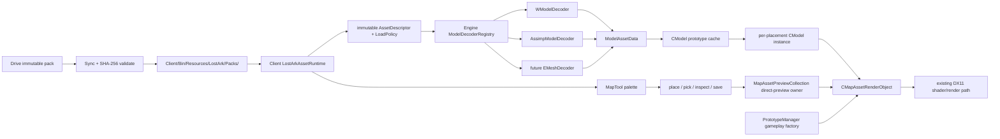

Session - LostArk 공용 멀티 포맷 바이너리 에셋 런타임·MapTool 연동
좌표: 신규 좌표 후보 · 축: C4 수명은 선언된다 · C7 권위와 정합성
관련: 2026-07-28_LOSTARK_COURSE_FOUNDATION_INTEGRATION_PLAN, 2026-07-29_LOSTARK_IMGUI_F1_BOOTSTRAP_PLAN, Winters AssetFormat/Scene_Editor

# LostArk 공용 멀티 포맷 바이너리 에셋 런타임·MapTool 마스터 계획

> 목표: 팀원이 각자 만든 바이너리 에셋을 확장자 이름과 무관하게 등록 가능한 디코더로 읽고, 하나의 `CModel` 렌더 경로로 합친다. 기존 수업 FBX/Assimp 장면은 깨뜨리지 않고 유지한다. Winters에서 만든 맵·캐릭터·향후 발탄 본체 pack이 이미 지원되는 runtime capability 범위라면 Drive 동기화 뒤 재빌드 없이 MapTool 카탈로그에 나타나고, 클릭 배치·피킹·수정·저장까지 가능하게 한다.

> 문서 유형: **MASTER ROADMAP — 이 문서 단독으로 구현을 허가하지 않는다.** A00~A09는 각각 별도 dated 상세 PLAN에서 새 파일 전문, 기존 파일의 정확한 anchor+추가/교체 블록, project wiring, 복사 실행 가능한 명령을 확정한 뒤에만 편집한다. 아래 C++/JSON은 patch 본문이 아니라 아키텍처·schema 계약 예시다.

## 1. 결정 기록

① 문제/제약: LostArk `CModel`은 현재 Assimp `aiScene/aiMesh/aiMaterial`을 직접 소유하고, Winters 카탈로그 실측은 18행(맵 17, 캐릭터 1)이며 LostArk에는 W-format reader와 JSON parser가 없다.
② 순진한 접근의 실패: “`.wmesh`가 있으면 읽고 없으면 FBX”라는 묵시적 fallback은 손상된 바이너리도 성공처럼 숨기고 Release가 원본/Assimp 설치에 다시 의존하게 만든다.
③ 채택 메커니즘: `파일 bytes → 등록된 decoder → ModelAssetData → GPU resource prototype/cache → per-instance CModel → renderer`로 고정하고, 에셋마다 `LegacyAssimpOnly/CookedOnly/PreferCookedDebug` 정책을 명시한다.
④ 대비: 확장자가 달라도 bytes 계약이 같으면 같은 decoder를 쓰고, bytes 계약이 다르면 `.emesh` 같은 이름만 바꾸지 말고 `EMeshDecoder`를 추가한다. 게임 오브젝트 prototype 등록은 import가 아니다.
⑤ 트레이드오프: 첫 통합에서는 W-format과 기존 Assimp만 실제 지원하고 다른 포맷은 확장점만 연다. CPU 정규화 복사와 manifest 검증 비용을 지불하는 대신 팀 호환성·오류 가시성·재현성을 얻는다.

## 1.1 먼저 이해할 본질

바이너리는 “GPU가 직접 이해하는 특별한 파일”이 아니다. 사람이 읽기 쉬운 FBX/JSON 대신, 우리 프로그램이 약속한 순서와 크기로 숫자를 저장한 파일이다.

```text
파일 이름(.wmesh/.emesh/무확장자)
    ↓ 이름은 힌트일 뿐
파일 header magic + version 확인
    ↓
해당 decoder가 정점·인덱스·재질·뼈·애니메이션을 읽음
    ↓
공통 CPU 구조 ModelAssetData로 정규화
    ↓
DirectX 11 vertex/index/texture buffer 생성
    ↓
CModel prototype/cache
    ↓ clone
각 배치 인스턴스의 transform·animation state
    ↓
기존 shader/render pass
```

셰이더와 GPU는 원본 확장자를 보지 않는다. 최종 vertex layout, index format, texture binding, bone matrix가 맞는지만 본다. 그러므로 다음 두 경우를 분리한다.

| 입력 | 처리 |
|---|---|
| 이름만 `.wmesh`/`.emesh`로 다르고 내부 header/layout이 동일 | 같은 decoder 사용 가능 |
| 내부 정점 stride, section 순서, 좌표계, bone/animation 규칙이 다름 | 포맷별 decoder 필요 |

공통 파이프라인은 “아무 파일이나 자동 해석”한다는 뜻이 아니라, 각 decoder가 서로 다른 입력을 하나의 엄격한 `ModelAssetData` 계약으로 번역한다는 뜻이다.

## 1.2 현재 코드와 데이터의 확인된 사실

| 영역 | 확인된 코드/실측 | 의미 |
|---|---|---|
| LostArk FBX load | `Engine/Private/Model.cpp:52-77`의 `Initialize_Prototype()`이 `m_Importer.ReadFile()` 호출 | 현재 runtime Assimp 경로는 실제 사용 중이므로 즉시 제거 금지 |
| LostArk model state | `Engine/Public/Model.h:37-56`이 `aiScene`, `Assimp::Importer`, mesh/material/bone/animation 보유 | decoder와 renderer 경계가 아직 없음 |
| 수업 asset 등록 | `Client/Private/Loader.cpp:169-176`에서 Fiona/ForkLift FBX를 model prototype으로 등록 | 기존 수업 장면은 `LegacyAssimpOnly`로 보존 |
| 게임 오브젝트 | `Client/Private/Weapon.cpp:102-111`이 이미 등록된 ForkLift model component를 clone | `CWeapon::Create` 자체는 파일 import가 아님 |
| instance 수명 | `CModel` copy 생성자는 mesh/material을 공유하고 bone/animation을 clone | GPU 공유 + animation instance 분리의 출발점으로 유지 |
| shared mesh scratch | `Engine/Private/Mesh.cpp:72-85`가 공유 `CMesh::m_BoneMatrices`를 draw마다 덮어씀 | sequential draw는 가능해도 immutable cache/parallel draw 계약에는 맞지 않음 |
| layer 수명 | `CLayer`는 `list<shared_ptr<CGameObject>>`만 순회하며 개별 삭제 API 없음 | 에디터 Delete에는 안전한 deferred removal 또는 MapTool 소유 instance 집합 필요 |
| 지면 picking | `CPicking`은 `Target_PickPos` staging texture를 CPU로 복사 | 배치 위치에는 재사용 가능하지만 object ID 선택은 별도 필요 |
| picking 결함 | `Engine/Private/Picking.cpp:53-66`이 `RowPitch`를 무시하고 mouse bounds 검사 없음 | MapTool 배치 전에 반드시 수정·회귀 검증 |
| LostArk MapTool | 현재 `Client/Private/MapTool.cpp`은 bootstrap/status placeholder | palette/picking/inspector는 별도 slice |
| Winters 포맷 | 16-byte `WINT` header 뒤 `WMSH/WMAT/WSKL/WANM` section | v1 canonical reader를 포팅할 근거 있음 |
| W material v1 | `MaterialEntry`는 diffuse path 1개만 가짐 | first preview는 diffuse 범위이며 normal/ORM 등 full material parity를 주장하면 안 됨 |
| Winters model | `Engine/Private/Resource/Model.cpp:994`부터 `.wmesh`, same-stem `.wmat/.wskel`, `anims/*.wanim` load | 파일 묶음 규칙과 검증 흐름을 참고하되 LostArk API에 맞게 이식 |
| Winters cache | `ResourceCache.cpp:47-72`가 normalized cooked path로 `shared_ptr<CModel>` cache | 같은 asset의 중복 GPU upload 방지 패턴 |
| Winters editor | local ray를 AABB와 교차하고 가장 가까운 placement를 선택 | LostArk object picking의 첫 구현 패턴 |
| 현재 Winters pack | `AssetCatalog.json` schema 1, 18행, mesh 18개 존재; 17 Map + `SK_GSC_BST_00` Character 1 | 정적/스킨 애니메이션 smoke 입력은 준비됨 |
| 현재 material path | 현행 `.wmat` 18개 binary scan에서 drive-letter absolute path 0건 | current pack은 portable해 보이지만 importer/runtime validation은 계속 필요 |
| 발탄 본체 상태 | 17개 `BG_RAD_VALTAN_A`는 배경 소품이고 `SK_GSC_BST_00`은 Scouter transformation demo | 둘 다 “발탄 본체”라고 표시하면 안 됨 |
| JSON 의존성 | LostArk source에서 nlohmann/rapidjson runtime 사용 실측 없음 | parser를 명시적으로 선택·고정해야 함 |

## 1.3 최종 구조



소유권은 다음처럼 고정한다.

| 소유자 | 책임 | 알면 안 되는 것 |
|---|---|---|
| `AssetFormat` static library | W-format bytes read/write/validate, CPU-only fixtures | D3D11, ImGui, Client level |
| Engine decoder layer | 입력 포맷을 `ModelAssetData`로 정규화 | Drive UI, LostArk catalog label |
| Engine model cache | GPU prototype 1회 생성, instance clone 제공 | MapTool window layout |
| Client `CLostArkAssetRuntime` | pointer/stamp/manifest/catalog revision 단일 소유, assetId→immutable descriptor resolve | raw D3D11 buffer 생성, Engine cache 내부 |
| `CMapAssetPreviewCollection` | editor preview render object/placement/command safe point | Drive 원본 경로, gameplay layer 수명 |
| `CMapAssetRenderObject` | preview/gameplay가 공유하는 기존 render-queue node | decoder 구현, Drive 원본 경로 |
| `CMapTool` | 검색, 상태, 배치, 선택, 편집, 저장 | 바이너리 section parsing |
| Sync/validate tool | Drive source를 runtime root로 원자적 materialize, hash 검증 | 게임 render loop |

## 1.4 loader 정책: scene 기준도, 자동 fallback 기준도 아니다

```cpp
enum class MODEL_LOAD_POLICY : uint8_t
{
    LEGACY_ASSIMP_ONLY,
    COOKED_ONLY,
    PREFER_COOKED_DEBUG,
};
```

| 정책 | 대상 | 성공 조건 | 실패 동작 |
|---|---|---|---|
| `LEGACY_ASSIMP_ONLY` | 현재 Fiona/ForkLift 등 수업 FBX | Assimp import 성공 | 기존처럼 명시적 load 실패 |
| `COOKED_ONLY` | Drive/Winters 맵·보스·신규 공용 asset | catalog가 지정한 cooked decoder와 모든 필수 dependency 성공 | Missing/Invalid 표시, Assimp로 우회 금지 |
| `PREFER_COOKED_DEBUG` | converter parity 기간의 개발 전용 asset | cooked 성공이 기본; fallback 사용 사실을 UI/log에 크게 표시 | Release에서는 금지 |

“기존 수업 scene은 Assimp, 나머지 scene은 binary”처럼 scene 이름으로 결정하지 않는다. 같은 scene에도 legacy FBX와 cooked map asset이 함께 존재할 수 있으므로 asset descriptor가 정책을 소유한다.

기존 foundation 계획의 “F05 뒤 Assimp runtime 제거”는 이 계획으로 수정한다. 모든 legacy asset이 catalog와 cooked parity gate를 통과하기 전에는 Assimp runtime을 유지한다. 제거는 별도 migration 결정이다.

## 1.5 prototype의 정확한 의미

다음 코드는 파일을 읽는 코드가 아니다.

```cpp
CGameInstance::Get().Add_Prototype(
    ETOUI(LEVEL::GAMEPLAY),
    TEXT("Prototype_GameObject_Weapon"),
    CWeapon::Create(m_pDevice, m_pContext));
```

이는 “나중에 `CWeapon`을 복제할 공장 원본”을 등록한다. 현재 실제 asset import는 `Loader.cpp`의 `CModel::Create(..., "...fbx", ...)`에서 일어난다.

MapTool preview에서는 GameObject prototype을 쓰지 않고 A05의 preview collection이 `CMapAssetRenderObject`를 소유하며, 그 render object가 cache model instance를 소유한다. 향후 A09 gameplay 재생에서도 asset마다 `Prototype_GameObject_XXX`를 만들지 않고, 같은 render object class를 generic `Prototype_GameObject_MapAsset` 공장 하나로 등록한다.

```cpp
struct MAP_ASSET_DESC : public CGameObject::GAMEOBJECT_DESC
{
    std::shared_ptr<const LOSTARK_ASSET_DESCRIPTOR> asset;
    uint64_t placementId = 0;
};

CGameInstance::Get().Add_GameObject_to_Layer(
    ETOUI(LEVEL::STATIC),
    TEXT("Prototype_GameObject_MapAsset"),
    ETOUI(LEVEL::GAMEPLAY),
    TEXT("Layer_MapAsset"),
    &desc);
```

A04의 `CLostArkAssetRuntime`만 catalog를 parse하고 placement 문서의 `assetId`를 immutable descriptor snapshot으로 resolve한다. A05 preview와 A09 gameplay loader는 이 descriptor를 `MAP_ASSET_DESC`로 Engine cache/object에 주입한다. `CMapAssetRenderObject::Initialize()`가 숨은 전역 catalog를 다시 찾거나 MapTool/gameplay가 각각 catalog를 parse하지 않는다. cache는 model prototype 하나를 보관하고, static instance는 GPU mesh/material을 공유하며 animated instance는 bone/animation state를 clone한다.

## 1.6 공통 `ModelAssetData` 계약

최종 CPU 중간 표현은 최소한 다음 정보를 갖는다. 이는 구현 API 계약이며 정확한 전체 header body는 A02 상세 계획에서 확정한다.

```cpp
struct MODEL_ASSET_DATA
{
    MODEL_ASSET_KIND kind;
    MODEL_COORDINATE_METADATA sourceCoordinate;
    std::vector<MODEL_SUBMESH_DATA> subMeshes;
    std::vector<MODEL_MATERIAL_DATA> materials;
    std::vector<MODEL_BONE_DATA> bones;
    std::vector<MODEL_ANIMATION_DATA> animations;
    BoundingBox localBounds;
    std::string sourceDecoderId;
    uint16_t sourceFormatMajor;
};
```

모든 decoder가 아래를 LostArk 기준으로 정규화한 후 반환한다.

- left-handed 좌표와 winding
- 단위 scale
- static/skinned vertex layout과 stride
- 16/32-bit index를 engine 내부 32-bit 또는 명시 형식으로 통일
- material slot 의미와 resource-root-relative texture path
- bone parent range, bone index/weight 상한, weight normalization
- animation duration/ticks-per-second/key ordering
- mesh-local AABB; 파일에 없으면 vertex에서 계산
- absolute path와 `..` path 거부

decoder 선택은 확장자 단독 분기를 쓰지 않는다.

```cpp
class IModelDecoder
{
public:
    virtual ~IModelDecoder() = default;
    virtual std::string_view GetId() const = 0;
    virtual bool CanDecode(std::span<const std::byte> prefix) const = 0;
    virtual MODEL_DECODE_RESULT Decode(
        const MODEL_DECODE_REQUEST& request,
        MODEL_ASSET_DATA& outData) const = 0;
};
```

- v1 registry의 모든 decoder는 Engine DLL 소스에 정적 컴파일한다. runtime decoder DLL/plugin ABI는 지원하지 않는다.
- 위 C++ virtual API는 Engine 내부 경계이며 module 밖으로 export하지 않는다. 따라서 `std::span/string_view/vector`를 제3자 DLL ABI로 사용하지 않는다.
- catalog `decoder` ID로 정확히 하나를 선택하고 그 decoder의 header probe로 재검증한다. 전체 decoder probe 순회나 Assimp fallback은 하지 않는다.
- W-format은 `WINT` + payload `WMSH` + version으로 판별한다.
- `.emesh`의 bytes가 W-format과 완전히 같으면 catalog에서 `decoder: "winters-w-v1"`을 써도 된다.
- `.emesh`의 내부 규약이 다르면 `decoder: "team-e-v1"`과 Engine에 정적 컴파일한 `EMeshDecoder`가 반드시 필요하고 Engine/Client rebuild가 필요하다.
- catalog의 decoder ID와 header probe 결과가 충돌하면 `InvalidDecoder`로 실패한다.
- common material은 semantic texture slot을 표현하되 WMaterial v1 decoder는 diffuse만 채운다. normal/ORM/emissive가 필요한 자산은 explicit missing capability로 표시하고, 포맷 v2가 준비되기 전 full material parity PASS를 주지 않는다.
- 좌표/단위/winding 변환은 모든 입력에 무조건 적용하지 않는다. decoder spec과 golden fixture가 source convention을 선언하고, 이미 left-handed인 W data를 다시 뒤집지 않도록 source→LostArk 변환을 정확히 한 번만 적용한다.

## 1.7 공용 Drive pack 계약

Git에는 source/schema/tool/test fixture만 저장한다. 실제 `.wmesh/.wmat/.wskel/.wanim/.dds` 팀 asset은 Drive pack으로 배포하고 `Client/Bin/Resources`에 materialize한다.

```text
<Drive 공유 root>/LostArkAssetPacks/
  Packs/
    2026.07.29-valtan-preview.1/
      AssetCatalog.json
      pack-manifest.json
      Models/
        Map/BG_RAD_VALTAN_A/...
        Character/SK_GSC_BST_00/...
        Boss/Valtan/...                 # 실제 본체가 준비됐을 때
      Textures/...

LostArk/Client/Bin/Resources/LostArk/
  current-pack.json                    # local materialized pointer
  Packs/
    2026.07.29-valtan-preview.1/...     # immutable copy
```

규칙:

1. `packId`는 immutable이다. 같은 ID의 파일을 덮어쓰지 않고 새 ID를 발행한다.
2. `pack-manifest.json.files[]`는 payload set만 열거한다: `AssetCatalog.json`과 `Models/Textures/Maps/...` runtime payload다. `pack-manifest.json` 자신, publisher `pack-complete.json`, local `validation-stamp.json`은 self-hash 순환을 막기 위해 `files[]`에서 제외한다.
3. catalog와 material texture path는 pack root 상대 경로만 허용한다. rooted/UNC/device path, drive colon/ADS, `.`/`..`, reparse point를 거부하고 `GetFullPath` 뒤 case-insensitive root containment를 재검사한다. normalized path의 case-fold 중복도 거부한다.
4. runtime root는 process CWD가 아니라 `GetModuleFileNameW(Client.exe)`의 parent에서 `Resources/LostArk`를 계산한다.
5. sync는 final `Packs`와 같은 parent/volume에 sibling staging directory를 만들고, 전체 hash 검증 후 rename한다. source Drive가 다른 volume이어도 source→destination staging은 copy하고 final rename만 같은 volume에서 수행한다.
6. 같은 `packId` final directory가 이미 있으면 manifest digest가 같을 때만 재사용하고, 다르면 immutable ID collision으로 실패한다.
7. publisher는 모든 payload 뒤 `pack-manifest.json`과 `pack-complete.json`을 마지막에 발행한다. `manifestSha256`은 manifest raw bytes 자체의 SHA-256이다. consumer는 complete marker와 manifest hash가 일치하지 않는 부분 동기화 pack을 무시한다.
8. sync는 destination staging에서 manifest `files[]`와 실제 payload set이 정확히 같은지 확인한다(누락/extra 0). 그 payload set의 size/hash를 전부 검증한 뒤 local `validation-stamp.json`을 생성하고 stamp까지 final directory에 포함해 rename한다. `validatedFileCount/validatedBytes`는 payload set만 센다.
9. `current-pack.json`은 sibling temp file을 flush한 뒤 같은 directory에서 replace한다. pointer 교체 전에 final pack/stamp가 존재해야 한다.
10. runtime reload는 pointer→stamp→manifest digest 결합을 확인한 뒤 새 catalog/cache revision을 만든다. runtime 매 load에서 전체 payload를 다시 hash하지 않는다.
11. runtime은 Drive API를 직접 호출하지 않는다. 로컬 materialized pack만 읽는다.
12. `.gitignore`의 `Client/Bin/Resources/`와 W-format ignore는 유지한다. Git LFS가 권리 검증을 대신하지 않는다.
13. SHA-256은 전송/저장 integrity 증거일 뿐 publisher authenticity나 재배포 권리 증명이 아니다. 팀 공유 권한이 확인된 asset만 pack에 포함한다.

세 control file의 결합은 다음으로 고정한다.

```json
// Packs/<packId>/pack-complete.json — publisher가 마지막 발행
{
  "schemaVersion": 1,
  "packId": "2026.07.29-valtan-preview.1",
  "manifestSha256": "<64 lowercase hex>"
}
```

```json
// Packs/<packId>/validation-stamp.json — local sync tool만 생성
{
  "schemaVersion": 1,
  "packId": "2026.07.29-valtan-preview.1",
  "manifestSha256": "<64 lowercase hex>",
  "validatedFileCount": 0,
  "validatedBytes": 0,
  "validatorVersion": "lostark-pack-validator-v1"
}
```

```json
// Resources/LostArk/current-pack.json — local atomic pointer
{
  "schemaVersion": 1,
  "packId": "2026.07.29-valtan-preview.1",
  "manifestSha256": "<64 lowercase hex>",
  "validationStampSha256": "<64 lowercase hex>"
}
```

JSON 주석은 설명용이며 실제 파일에는 넣지 않는다. `validatedAt` 같은 비결정 필드는 stamp hash 재현에 필요하지 않으므로 넣지 않는다.

현재 Winters schema 1은 `Resource/LostArk/...`라는 Winters 전용 경로를 저장한다. 즉시 bridge에서는 importer가 그 prefix를 제거해 pack-relative canonical schema 2를 만든다. 장기적으로 converter/catalog generator가 schema 2를 직접 출력한다. LostArk runtime에 Winters 절대 경로나 singular `Resource` root를 하드코딩하지 않는다.

canonical `AssetCatalog.json` schema 2 예시:

```json
{
  "schemaVersion": 2,
  "packId": "2026.07.29-valtan-preview.1",
  "assets": [
    {
      "id": "lostark.map.valtan.floor01",
      "label": "Valtan Arena / Floor 01",
      "kind": "Map",
      "decoder": "winters-w-v1",
      "loadPolicy": "CookedOnly",
      "mesh": "Models/Map/BG_RAD_VALTAN_A/BG_RAD_VALTAN_FLOOR01_SM/BG_RAD_VALTAN_FLOOR01_SM.wmesh",
      "material": "Models/Map/BG_RAD_VALTAN_A/BG_RAD_VALTAN_FLOOR01_SM/BG_RAD_VALTAN_FLOOR01_SM.wmat",
      "defaultTransform": {
        "position": [0.0, 0.0, 0.0],
        "rotationDeg": [0.0, 0.0, 0.0],
        "scale": [1.0, 1.0, 1.0]
      }
    },
    {
      "id": "lostark.character.scouter.transformation_demo",
      "label": "Scouter / Transformation Attack",
      "kind": "Character",
      "decoder": "winters-w-v1",
      "loadPolicy": "CookedOnly",
      "mesh": "Models/Character/SK_GSC_BST_00/SK_GSC_BST_00.wmesh",
      "material": "Models/Character/SK_GSC_BST_00/SK_GSC_BST_00.wmat",
      "skeleton": "Models/Character/SK_GSC_BST_00/SK_GSC_BST_00.wskel",
      "animations": [
        "Models/Character/SK_GSC_BST_00/anims/sk_transformationattack.wanim"
      ],
      "defaultTransform": {
        "position": [0.0, 0.0, 0.0],
        "rotationDeg": [0.0, 0.0, 0.0],
        "scale": [1.0, 1.0, 1.0]
      }
    }
  ]
}
```

실제 발탄 본체는 확인된 identity로 별도 stable ID를 사용한다. 예: `lostark.boss.valtan.body.phase1`. 배경 소품 prefix 또는 `SK_GSC_BST_00`을 발탄 본체 ID로 재사용하지 않는다.

## 1.8 MapTool 사용자 작업 계약

도구 분류는 Workflow Editor다.

| 항목 | 계약 |
|---|---|
| 사용자 작업 | canonical catalog에서 맵/캐릭터/보스를 고르고 viewport에 배치한 뒤 다시 선택해 transform/visible/animation preview를 수정하고 저장 |
| 범위 | 정적 맵 소품, skinned preview, 향후 발탄 본체 preview |
| 필요한 데이터 | pack/revision 상태, asset ID/label/kind, Ready/Missing/Invalid, placement ID, transform, bounds, animation clip/status |
| 핵심 action | 검색, row 클릭 즉시 one-shot placement 진입, viewport click 배치, 배치 object click 선택, Undo/Redo, Escape 취소, Delete, Save, Reload |
| 제외 | 발탄 gameplay AI/전투, collision/nav 자동 생성, animation/material authoring, Drive 업로드 |
| authority | Drive catalog/pack은 read-only 정본; MapTool draft가 placement를 소유; 검증 뒤 placement JSON을 atomic save |
| 완료 증거 | 선택 highlight, inspector 값, save/reload 동일성, animation time 증가, 로그에 decoder/policy/packId 표시 |

기본 레이아웃과 action hierarchy:

```text
+--------------------------------------------------------------------------------+
| [Save* Ctrl+S] [Undo] [Redo] | Reload Placement | Placement Dirty/Clean       |
+----------------------+--------------------------------------+------------------+
| Asset Pack: Ready/ReloadFailed/RevisionStale [Reload Pack] [Apply Revision]    |
+----------------------+--------------------------------------+------------------+
| Asset Palette        | Existing GAMEPLAY Viewport           | Inspector        |
| [Search...........]   |                                      | Asset / Revision |
| Kind: All/Map/Boss    |   Place mode: Visible Surface        | Transform        |
| > Ready asset row     |   Left click: place OR select        | Visible / Clip   |
| ! Invalid asset row   |   Esc/RMB: cancel placement          | [Delete]         |
+----------------------+--------------------------------------+------------------+
| Status: decoder | policy | packId | revision | exact error / next action        |
+--------------------------------------------------------------------------------+
```

- Primary action은 `Save`다. Dirty일 때 색/표식을 강화한다.
- Secondary toolbar action은 `Reload Placement from Disk`다. Dirty이면 바로 덮지 않고 `Discard Changes & Reload?` 확인을 요구한다.
- `Reload Asset Pack`과 `Apply Asset Revision`은 top toolbar에 섞지 않고 pack status banner에 context action으로만 표시한다.
- top shortcut budget은 5개 그룹으로 제한한다: `F1` open/close, `Ctrl+S` Save, `Ctrl+Z/Ctrl+Y` history, `Esc/RMB` placement cancel, `Delete` selected placement delete.
- Undo/Redo command history 범위는 placement add/delete, transform, visible, selected clip이다. palette selection/filter/viewport camera 이동은 history에 넣지 않는다.
- `WantCaptureKeyboard`는 gameplay keyboard 차단에만 사용한다. editor shortcut은 MapTool ImGui frame 안에서 처리하며 `WantTextInput` 또는 MapTool의 text/drag widget active 상태일 때만 `Delete/Escape/Ctrl+Z/Ctrl+Y/Ctrl+S`를 억제한다. F1 global toggle은 bootstrap의 확정된 edge 처리 규칙을 따른다.
- 검증 executable/scene은 `Client/Bin/Client.exe`, `LEVEL::GAMEPLAY`, F1이다.
- 기준 해상도는 현행 `Client_Defines.h`의 1280×720/Windows 100% scaling이다. 추가 QA는 1920×1080/100%와 1280×720/150% scaling이며, 150%에서 font/clip 대응이 안 되면 `CONFIRM_NEEDED(A06-DPI)`로 기록하고 PASS를 주장하지 않는다.

authority가 다른 상태를 한 개의 `Stale` bool로 뭉치지 않는다.

| typed state | 의미 | Save/복구 action |
|---|---|---|
| `PlacementClean/PlacementDirty` | in-memory draft와 load source 관계 | Dirty만 Save 활성 |
| `PlacementSourceStale` | Git/외부 도구가 disk placement를 변경 | Save 차단; merge 또는 Discard & Reload |
| `PlacementInvalid/Saving/SaveFailed` | document validation/atomic persist 상태 | 기존 disk 보존, exact error |
| `CatalogReady/CatalogReloadFailed` | current pointer/catalog reload 결과 | 실패 시 old catalog 유지; Reload Asset Pack 재시도 |
| `AssetRevisionCurrent/AssetRevisionStale` | placement instance가 current manifest와 일치하는지 | Stale여도 stable assetId save 가능; Apply Asset Revision 가능 |
| `AssetRevisionApplying/AssetRevisionFailed` | transactional rebind 상태 | 실패 시 old instance 전부 유지 |

- catalog 없음: empty state와 sync 안내를 표시하고 palette를 비운다.
- row dependency 없음/hash mismatch/decoder mismatch: 그 row만 `Invalid`, 배치 비활성화.
- asset-pack reload 실패인데 이전 catalog가 있으면 `CatalogReloadFailed`; old catalog/revision을 유지하고 새 data처럼 표시하지 않는다.
- save는 temp write → parse/validate → atomic replace. 실패 시 기존 placement 파일을 보존한다.
- default UI는 긴 raw path를 숨기고 tooltip/diagnostics에서만 보여준다.
- placement 문서 load 시 disk SHA-256을 source revision으로 보관한다. Dirty 상태에서 disk digest가 바뀌면 `PlacementSourceStale`로 전환하고 Save를 차단해 다른 팀원의 Git 변경을 덮지 않는다. 사용자는 placement reload/discard 또는 외부 merge 후 재검증을 선택한다.
- `Reload Asset Pack`은 `CLostArkAssetRuntime`만 호출하고 성공하면 catalog revision을 바꾸며 기존 instance를 `AssetRevisionStale`로 표시한다. `Apply Asset Revision`은 A03 transactional rebind만 호출한다. `Reload Placement from Disk`는 asset pack/catalog를 건드리지 않는다.

입력 동작:

1. palette row 클릭 즉시 `PlaceAsset` one-shot mode.
2. `ImGui::GetIO().WantCaptureMouse`가 true면 world place/pick 금지.
3. placement mode에서 viewport left click은 **place가 selection보다 우선**한다. place 성공 후 idle로 돌아가며 같은 click으로 object selection을 다시 실행하지 않는다.
4. idle에서만 left click이 camera ray→local AABB nearest hit selection을 실행한다. hit가 없으면 selection 해제 정책을 적용한다.
5. first slice의 기본 placement source는 `Visible Surface`다. `Target_PickPos`가 의미하는 가장 앞의 렌더 표면이며 terrain-only “ground”라고 부르지 않는다. static object 위 배치도 이 mode에서는 의도된 동작이다.
6. `Plane Y=0`은 명시적 dropdown mode로만 제공한다. Visible Surface miss를 plane으로 조용히 fallback하지 않는다.
7. `Visible Surface`는 click 시점에만 staging copy/map하는 lazy API로 바꾼 뒤 사용한다. RowPitch/viewport bounds/resize를 검증한다.
8. 선택은 camera mouse ray를 각 placement의 inverse world로 변환하고 local AABB와 교차해 가장 가까운 world-distance를 선택한다.
9. static은 WMesh bounds를 사용하고, bounds가 없으면 vertex에서 계산한다. skinned preview는 first slice에서 padded bind-pose bounds를 사용한다.
10. selection highlight는 기존 shader를 깨뜨리지 않는 outline/tint pass 또는 debug bounds로 시작한다.
11. Delete는 update/render 순회 중 vector를 즉시 invalidate하지 않고 command queue를 safe point에서 적용한다.

## 1.9 다른 세션과 겹치지 않는 경계

현재 다음 파일은 ImGui/Input/MapTool bootstrap 세션이 수정 중이므로 asset 구현에서 동시 수정하지 않는다.

```text
Client/Default/Client.cpp
Client/Default/Client.vcxproj
Client/Private/Level_Loading.cpp
Client/Private/Level_Logo.cpp
Client/Private/MainApp.cpp
Client/Private/MapTool.cpp
Client/Private/Player.cpp
Client/Public/MainApp.h
Client/Public/MapTool.h
Engine/Default/Engine.vcxproj
Engine/Default/Engine.vcxproj.filters
Engine/Private/GameInstance.cpp
Engine/Public/Engine_Defines.h
Engine/Public/GameInstance.h
Engine/Public/Input_Device.h
Engine/Private/ImGuiLayer.cpp
Engine/Public/ImGuiLayer.h
```

merge 순서:

1. ImGui/Input bootstrap 세션의 빌드·실행·F1 capture 결과를 먼저 확정한다.
2. A01 `AssetFormat` CPU code/test는 별도 물리 폴더에서 만들 수 있지만 `.sln/.vcxproj` 연결은 bootstrap commit 뒤 한 번에 한다.
3. A02~A04 Engine runtime을 연결한다.
4. A05는 새 preview collection/placement document 파일만 만들고 `MapTool.*`를 편집하지 않는다.
5. A06에서만 `MapTool.*`와 필요한 최소 MainApp/GameInstance/Picking integration을 편집한다.
6. Winters `Scene_Editor.*`는 이 작업에서 수정하지 않는다. producer artifact/schema만 소비한다.

## 2. 반영해야 하는 코드와 파일

이 문서는 여러 commit을 묶는 MASTER ROADMAP이다. `.md/계획서작성규칙.md`의 “새 파일은 전체 내용” 규칙을 지키기 위해, 각 slice 구현 직전 별도 dated 상세 PLAN을 만들고 새 `.h/.cpp/.ps1/.json`의 전체 내용과 기존 파일의 정확한 anchor+추가/교체 블록을 그 문서에 싣는다. 이 roadmap은 작업 순서와 계약을 승인하는 문서이지 source edit 지시서가 아니다.

### A00 — baseline과 producer snapshot 고정

`CONFIRM_NEEDED(A00)`: 상세 PLAN에서 baseline commit ID, 다른 세션 commit ID, exact build/run command와 캡처 경로를 확정하기 전 mutation 금지.

수정 파일: 없음. read-only evidence만 남긴다.

확인할 것:

- ImGui/Input bootstrap 세션 commit과 dirty worktree 분리
- `Framework.sln / Debug / x64` build + Client F1 smoke
- Winters producer catalog snapshot: schema 1, 18행, mesh 18/18 존재
- `SK_GSC_BST_00.wmesh/.wmat/.wskel/anims/sk_transformationattack.wanim` 존재와 `info` validation
- 17개 `BG_RAD_VALTAN_A`가 map props임을 catalog label/kind로 유지
- 진짜 발탄 body identity/provenance는 `확인 필요`; 준비 전에는 catalog에 Boss로 넣지 않음

PASS: asset code를 하나도 붙이지 않은 baseline에서 build와 기존 Fiona/ForkLift runtime이 유지된다.

### A01 — canonical W-format CPU library와 fixture test

`CONFIRM_NEEDED(A01)`: 별도 dated 상세 PLAN에 아래 새 파일 전문, solution/project GUID·configuration·output path, Winters source별 provenance, CPU fixture bytes/generator 전문을 싣기 전 구현 금지.

새 물리 영역 후보:

```text
AssetFormat/
  Public/AssetFormat/Common/
  Public/AssetFormat/Mesh/
  Public/AssetFormat/Material/
  Public/AssetFormat/Anim/
  Private/...
  Tests/...
  Default/AssetFormat.vcxproj
  Default/AssetFormat.vcxproj.filters
  Default/AssetFormatTests.vcxproj
```

project wiring 계약:

- `Framework.sln`에 `AssetFormat` static library와 `AssetFormatTests` console project를 Debug/Release × Win32/x64로 등록한다. 검증 기준은 x64다.
- `AssetFormatTests`는 `ProjectReference → AssetFormat`만 사용하고 Engine/Client/Assimp/D3D를 link하지 않는다.
- bootstrap 세션 merge 뒤 `Engine/Default/Engine.vcxproj`가 `ProjectReference → AssetFormat`을 하나만 가진다. AssetFormat source를 Engine project에 다시 compile하지 않는다.
- build order는 `AssetFormat → Engine → Client`와 `AssetFormat → AssetFormatTests`다.
- `AssetFormatTests` 실행 output은 `AssetFormat/Bin/Debug/AssetFormatTests.exe`와 `AssetFormat/Bin/Release/AssetFormatTests.exe`로 고정한다.

근거 source:

- `Winters/Engine/Public/AssetFormat/Common/WintersFileHeader.h`
- `Winters/Engine/Public/AssetFormat/Mesh/WMeshFormat.h`
- `Winters/Engine/Public/AssetFormat/Material/WMaterialFormat.h`
- `Winters/Engine/Public/AssetFormat/Anim/WSkelFormat.h`
- `Winters/Engine/Public/AssetFormat/Anim/WAnimFormat.h`
- 대응 `BinaryReader/*Loader.cpp`

포팅 원칙:

- `WINTERS_ENGINE` export와 Winters engine typedef 의존을 제거한 CPU-only static library.
- WINT 16 bytes와 모든 packed struct `static_assert` 유지.
- magic/version/flags/content_size, overflow, section range, count×stride, UTF/path termination을 검증.
- MVP에서 `WF_LZ4`/`WF_HAS_SHA256` flag가 오면 미지원 오류. SHA-256은 pack manifest가 먼저 소유.
- loader가 반환하는 blob 수명은 owning byte vector가 보장.
- golden fixture 하나와 truncation/bad magic/bad version/overflow/bad bone parent/bad animation trailer fixture를 test.
- 외부 asset 없이 procedural triangle fixture가 CI/team PASS를 제공.
- global `*.wmesh/*.wmat/*.wskel/*.wanim` ignore와 충돌하지 않도록 fixture는 test가 temporary directory에 결정적으로 생성한다. 실제 cooked binary fixture를 Git에 예외 등록하지 않는다.

현행 `.wmat` 18개 binary scan에서는 drive-letter absolute path가 0건이었다. 그래도 writer는 입력 root 밖 경로를 절대 경로로 보존할 가능성이 있으므로 canonical importer와 runtime은 모든 material path를 매번 pack-relative인지 검사하고, 절대 경로를 재작성할 근거가 없으면 row를 Invalid 처리한다.

PASS: `AssetFormatTests` 정상 fixture 1개와 오류 fixture 전부 기대 코드로 종료, D3D11/Assimp/Client link 없음.

### A02 — decoder registry와 `ModelAssetData`

`CONFIRM_NEEDED(A02)`: 별도 dated 상세 PLAN에 모든 새 header/cpp 전문과 `Model/Mesh/Material`의 정확한 기존 anchor+추가/교체 블록, static/skinned shader layout 대조를 싣기 전 구현 금지.

새 Engine 영역 후보:

```text
Engine/Public/Asset/ModelAssetData.h
Engine/Public/Asset/ModelDecodeResult.h
Engine/Public/Asset/IModelDecoder.h
Engine/Public/Asset/ModelDecoderRegistry.h
Engine/Public/Asset/WModelDecoder.h
Engine/Public/Asset/AssimpModelDecoder.h
Engine/Private/Asset/ModelDecoderRegistry.cpp
Engine/Private/Asset/WModelDecoder.cpp
Engine/Private/Asset/AssimpModelDecoder.cpp
```

수정 대상:

- `Engine/Public/Model.h`
- `Engine/Private/Model.cpp`
- `Engine/Public/Mesh.h`
- `Engine/Private/Mesh.cpp`
- `Engine/Public/Material.h`
- `Engine/Private/Material.cpp`

적용 순서:

1. `ModelAssetData`와 validation을 먼저 만들고 W decoder만 연결한다.
2. `CMesh::Create`에 common vertex/index/submesh 입력 overload를 추가한다. 기존 `aiMesh*` overload는 유지한다.
3. `CMaterial`에 engine-owned texture slot/path 입력 overload를 추가한다. 기존 `aiMaterial*`와 `aiTextureType` API는 compatibility wrapper로 유지한다.
4. `CModel::Create_FromCooked(descriptor)`를 추가하고 `ModelAssetData → meshes/materials/bones/animations` builder를 연결한다.
5. 기존 `CModel::Create(...)`는 `Create_FromAssimp(...)`의 compatibility wrapper로 남겨 Fiona/ForkLift를 변경하지 않는다.
6. cooked static/bind-pose smoke가 통과한 뒤 Assimp decoder가 `ModelAssetData`를 생성하게 이동한다. 그 전까지 기존 direct Assimp path는 병렬 유지한다.
7. 두 경로 parity 뒤 `m_pAIScene/m_Importer`를 legacy adapter 밖으로 이동한다.

중요 불변식:

- `CModel::Render/Bind_Material/Bind_BoneMatrices` 호출자는 입력 포맷을 모른다.
- decoder가 GPU object를 만들지 않는다.
- GPU buffer 생성 실패와 decode 실패는 서로 다른 오류 코드다.
- skinned asset은 bone 수/vertex bone index/shader cbuffer 한도를 load 전에 검증한다. LostArk `CMesh::m_BoneMatrices[512]`와 `Shader_VtxAnimMesh.hlsl`의 `g_BoneMatrices[512]`를 공통 상한 512로 고정하고, mesh별 palette count와 모든 vertex index가 그 범위 안인지 검증한다. Winters의 256 warning은 그대로 복사하지 않는다.
- animation 없는 model에서 현재 `Play_Animation()`의 index access가 발생하지 않도록 explicit `HasAnimation()`/guard를 추가한다.

PASS: procedural W triangle과 기존 ForkLift가 같은 render entry로 보이고, log가 각각 `winters-w-v1/CookedOnly`, `assimp/LegacyAssimpOnly`를 명시한다.

### A03 — prototype cache와 instance 수명

`CONFIRM_NEEDED(A03)`: 별도 dated 상세 PLAN에 cache/instance 새 파일 전문, Engine service owner와 shutdown 순서, reload transaction 상태도, 기존 `CPrototype_Manager` 경계의 정확한 anchor를 싣기 전 구현 금지.

새 Engine 영역 후보:

```text
Engine/Public/Asset/ModelAssetCache.h
Engine/Private/Asset/ModelAssetCache.cpp
```

수정 대상 후보:

- `Engine/Public/GameInstance.h`
- `Engine/Private/GameInstance.cpp`
- `Engine/Public/Model.h`

계약:

- cooked model의 유일한 cache owner는 `CModelAssetCache`다. 기존 `CPrototype_Manager`는 legacy model component prototype과 generic gameplay object factory만 소유하며 cooked model prototype을 이중 등록하지 않는다.
- cache key는 문자열 이어붙이기가 아니라 `{ manifestSha256, assetId, decoderId }` 구조체와 명시적 hash/equality다. raw path와 label은 key가 아니다.
- cache value는 animation을 재생하지 않는 immutable GPU/model prototype이다.
- instance 요청은 `CModel` instance clone을 반환한다. static GPU resource는 공유하고 bone palette/current clip/track position/loop state는 instance가 소유한다.
- 현재 공유 `CMesh` 안의 mutable `m_BoneMatrices[512]` scratch는 instance/draw-local palette로 이동한다. GPU mesh/offset/palette-index data만 cache에 공유하고, parallel render가 아니더라도 공유 prototype을 draw 중 mutate하지 않는다.
- load 실패는 null 하나로 뭉개지 않고 `MODEL_ASSET_ERROR`와 diagnostic context를 반환한다.
- catalog reload는 새 revision prototype을 먼저 완성한다. 기존 placement instance는 자동 pointer swap되지 않고 기존 manifest revision에 pinned되어 UI에서 `Stale Asset Revision`으로 표시된다.
- 사용자가 `Apply Asset Revision`을 누르면 main/render-owner safe point에서 모든 stale placement의 새 clone을 준비하고, 전부 성공했을 때만 transactional rebind한다. 하나라도 실패하면 기존 instance/revision을 모두 유지한다.
- 새로 배치하는 asset은 reload된 current revision을 사용한다. 사용 중인 이전 shared resource는 마지막 pinned instance가 놓을 때 해제된다.
- `selectedClip`은 animation index가 아니라 stable clip name 또는 content hash로 저장·resolve한다. revision rebind/clip 변경 시 track position과 left-key cursor를 0으로 reset한다. 현재 `CModel::Set_Animation()`처럼 index만 바꾸는 동작은 compatibility wrapper에 머물 수 없다.
- render/update 중 cache container를 직접 mutate하지 않는다.
- first slice reload는 main/render-owner thread의 safe point에서 동기 실행한다. background I/O/decode와 D3D resource creation 분리는 thread-safety 계측 뒤 별도 최적화한다.

service owner는 Engine `CGameInstance`로 고정한다. 초기화는 D3D device/context와 decoder registry 준비 뒤, shutdown은 level/object clear 뒤이면서 D3D device/context 파괴 전이다. Client catalog는 descriptor만 전달한다. exact member/initialization anchor는 bootstrap merge 뒤 A03 상세 PLAN에서 확정한다.

legacy migration은 asset 단위다. cooked parity를 통과한 legacy tag만 `Loader.cpp`의 `Prototype_Component_Model_*` 등록과 해당 `Add_Component` 사용을 제거하고 catalog/cache 요청으로 바꾼다. 남은 Fiona/ForkLift 등은 `CPrototype_Manager + LegacyAssimpOnly`에 유지한다. 전체 Assimp 제거는 migration list가 0개가 된 별도 계획에서만 한다.

PASS: 동일 static asset 10개 배치 시 vertex/index buffer prototype 1회 생성, animated asset 2개는 animation time을 독립적으로 변경 가능.

### A04 — canonical catalog, Drive sync, validation

`CONFIRM_NEEDED(A04)`: 별도 dated 상세 PLAN에 schema 3개와 PowerShell script 3개의 전문, JSON dependency/license, Windows path/atomic replace test, `MainApp` runtime owner init/shutdown exact anchor를 싣기 전 구현 금지.

Git에 저장할 새 파일 후보:

```text
AssetSchemas/LostArkAssetCatalog.schema.json
AssetSchemas/LostArkAssetPackManifest.schema.json
AssetSchemas/LostArkPlacement.schema.json
Tools/SyncLostArkAssetPack.ps1
Tools/ValidateLostArkAssetPack.ps1
Tools/ImportWintersLostArkPack.ps1
Config/AssetSources.example.json
```

로컬/ignored 파일:

```text
Config/AssetSources.local.json
Client/Bin/Resources/LostArk/current-pack.json
Client/Bin/Resources/LostArk/Packs/**
```

Client 새 영역 후보:

```text
Client/Public/Asset/LostArkAssetCatalog.h
Client/Private/Asset/LostArkAssetCatalog.cpp
Client/Public/Asset/LostArkAssetRuntime.h
Client/Private/Asset/LostArkAssetRuntime.cpp
Client/Public/Asset/RuntimeAssetRoot.h
Client/Private/Asset/RuntimeAssetRoot.cpp
Client/External/nlohmann/json.hpp
Client/External/nlohmann/LICENSE.MIT
```

수정 대상:

- `Client/Public/MainApp.h`: Debug/Release 공통 runtime owner 선언.
- `Client/Private/MainApp.cpp`: Engine cache 준비 뒤 initialize, preview/gameplay object clear 뒤 shutdown.

parser 결정:

- LostArk에 JSON runtime dependency가 없으므로 무단 custom parser를 즉흥 작성하지 않는다.
- Winters가 현재 사용하는 `nlohmann/json` 3.12.0 single-header와 MIT license를 provenance와 함께 `Client/External/nlohmann/`에 고정한다.
- parser dependency는 Client catalog/placement 영역으로 제한하며 Engine core와 AssetFormat CPU reader에는 넣지 않는다.
- malformed JSON, duplicate ID, maximum file bytes/depth/row count test를 A04 상세 PLAN에서 수치와 함께 고정한다.
- `RuntimeAssetRoot`는 `GetModuleFileNameW`로 Client executable directory를 얻고 그 아래 `Resources/LostArk`만 runtime root로 반환한다. Visual Studio working directory와 shell CWD에 의존하지 않는다.

runtime owner/injection:

- `CMainApp`가 Debug/Release 공통으로 `unique_ptr<CLostArkAssetRuntime>` 하나를 소유한다. MapTool이 없어도 gameplay placement load에 필요하므로 `_DEBUG` 안에 두지 않는다.
- initialize는 `CGameInstance::Initialize_Engine()`가 decoder registry/model cache를 준비한 뒤다. runtime은 pointer→stamp→manifest→catalog revision을 한 번만 parse/소유한다.
- MapTool과 gameplay placement loader는 `assetId`를 runtime에서 `shared_ptr<const LOSTARK_ASSET_DESCRIPTOR>` snapshot으로 resolve한 뒤 preview/render object와 Engine cache에 주입한다.
- Engine cache는 Client runtime/catalog를 참조하지 않는다. object가 `assetId`로 숨은 global lookup을 하거나 MapTool/gameplay가 catalog를 각자 parse하는 경로를 금지한다.
- shutdown은 MapTool preview collection 해제 → gameplay level/object clear → `CLostArkAssetRuntime` 해제 → Engine model cache clear → D3D device/context 파괴 순서다. descriptor snapshot 때문에 old revision을 쓰는 instance도 자신의 revision 수명을 명시적으로 보유한다.

Winters bridge:

- input: `Winters/Client/Bin/Resource/LostArk/AssetCatalog.json` schema 1과 동일 root의 파일.
- `Resource/LostArk/` prefix 제거, pack-relative path 생성.
- same-stem `.wmat/.wskel`, `anims/*.wanim`, diffuse dependency를 열거.
- 모든 dependency hash/size를 manifest에 기록.
- 출력은 새 immutable pack ID. 기존 pack 덮어쓰기 금지.

PASS: 새 clone에서 code checkout 후 local Drive source만 지정하고 sync/validate를 실행하면 runtime pack이 생긴다. source가 없으면 code build는 성공하고 MapTool은 `Pack missing`을 보여준다.

### A05 — MapTool-owned preview collection과 placement 문서

`CONFIRM_NEEDED(A05)`: 별도 dated 상세 PLAN에 preview collection/render object/document 새 파일 전문, current Weapon/Body shader binding 대조, command history와 atomic save/revision conflict test 전문을 싣기 전 구현 금지. 이 slice에서는 `Loader/Object_Manager/Layer/MapTool`을 수정하지 않는다.

새 Client 파일 후보:

```text
Client/Public/Asset/MapAssetPreviewCollection.h
Client/Private/Asset/MapAssetPreviewCollection.cpp
Client/Public/Asset/MapEditorCommandHistory.h
Client/Private/Asset/MapEditorCommandHistory.cpp
Client/Public/MapAssetRenderObject.h
Client/Private/MapAssetRenderObject.cpp
Client/Public/MapPlacementDocument.h
Client/Private/MapPlacementDocument.cpp
```

first slice owner:

- `CMapAssetRenderObject : CGameObject`가 injected immutable descriptor, cache model instance, `CTransform`, static/skinned shader component를 감싼다. 직접 `CreatePreview()`할 수 있지만 A05에서는 Prototype Manager에 등록하지 않는다.
- `CMapAssetRenderObject::Late_Update()`는 기존 object와 똑같이 `RENDERGROUP::NONBLEND`에 `shared_from_this()`를 제출한다. `Render()`는 world/view/proj, material, instance-local bone palette를 bind하고 기존 `CModel::Render()`를 호출한다. ImGui draw list나 `CMapTool::RenderUI()`에서 3D model을 직접 draw하지 않는다.
- `CMapAssetPreviewCollection`이 `vector<shared_ptr<CMapAssetRenderObject>>`와 placement metadata를 단독 소유하고 update/late-submit/safe-point command 적용을 제공한다. A06의 MapTool은 이 collection을 호출할 뿐 별도 instance vector를 갖지 않는다.
- `CMapEditorCommandHistory`가 add/delete/transform/visible/clip command의 before/after state를 소유하고 Undo/Redo 후 selection/dirty를 일관되게 갱신한다.
- 저장 문서는 `placementId, assetId, position, rotationDeg, scale, visible, selectedClip`만 가진다.
- placement source는 작은 text asset이므로 `Client/Bin/DataFiles/MapTool/Placements/<mapId>.placements.json`에 두고 Git으로 협업한다. binary/texture pack만 Drive에 둔다.
- placement는 pack 내부 경로가 아니라 stable `assetId`만 참조한다. 새 pack도 유지되는 ID를 재사용하고, 제거된 ID가 있으면 문서 전체를 Invalid로 보고 사용자 승인 없이 부분 삭제 저장하지 않는다.
- load 때 source digest를 저장하고 Save 직전 disk digest를 다시 비교한다. external change가 있으면 `Stale`로 실패하며 기존 disk file과 in-memory draft를 모두 보존한다.
- 이 slice는 `Loader/Object_Manager/Layer/MapTool/MainApp`을 건드리지 않는다. gameplay object manager 승격은 A09다.

이유: 현재 `Add_GameObject_to_Layer`는 생성 객체를 돌려주지 않고 `CLayer`에는 개별 삭제가 없다. 첫 MapTool에 engine-wide handle/removal 정책까지 동시에 넣으면 수명주기 위험이 커진다.

최종 gameplay load는 A05의 같은 `CMapAssetRenderObject` class를 generic prototype factory로 등록한다. preview/gameplay가 동일 `Late_Update/Render` submission과 Engine cache/model instance API를 사용하며 editor 전용 decoder/renderer 복제는 금지한다.

PASS: placement JSON save → tool restart/reload → placement ID/asset ID/transform/visible/clip이 동일하고 invalid row 하나가 전체 문서를 부분 적용하지 않는다.

### A06 — LostArk MapTool palette/place/pick/inspect

`CONFIRM_NEEDED(A06)`: ImGui/Input bootstrap merge 뒤 별도 dated 상세 PLAN에 최종 `MapTool/MainApp/GameInstance/Picking` exact anchor+교체 블록, wireframe/shortcut/DPI/capture checklist를 싣기 전 구현 금지.

이 slice는 ImGui/Input bootstrap commit 뒤에만 시작한다.

수정 대상:

- `Client/Public/MapTool.h`
- `Client/Private/MapTool.cpp`
- 필요한 최소 `Client/Public/MainApp.h`, `Client/Private/MainApp.cpp`
- `Engine/Public/GameInstance.h`, `Engine/Private/GameInstance.cpp`
- `Engine/Public/Picking.h`, `Engine/Private/Picking.cpp`

`CPicking` 정확한 수정 방향:

- viewport size를 정수 width/height로 보관.
- `Map()` 뒤 각 row를 `MappedSubResource.RowPitch` 간격으로 복사.
- mouse x/y가 `[0,width)×[0,height)` 밖이면 false.
- staging texture의 CPU access는 read만 사용.
- resize 시 staging texture와 CPU buffer 재생성.
- `CGameInstance::Update_Engine()`의 매-frame `CPicking::Update()`를 제거하고 `TryPickVisibleSurfaceAtMouse()` 호출이 들어온 click frame에만 copy/map한다. 기존 Player click 이동도 이 lazy API를 사용한다.

object selection은 `Target_PickPos`에 object ID를 새로 쓰는 render pipeline 변경을 하지 않고, Winters와 같은 ray/local-AABB nearest hit를 사용한다.

frame integration:

1. `CMainApp::Update()`가 normal `CGameInstance::Update_Engine()` 뒤, render 전 safe point에서 `CMapTool::TickPreview3D(dt)`를 open 여부와 무관하게 호출한다.
2. `TickPreview3D`는 전 frame UI가 큐에 넣은 command를 순서대로 적용하고 preview collection의 Update/Late_Update를 호출한다. 각 `CMapAssetRenderObject`가 기존 Renderer queue에 제출된다.
3. `CGameInstance::Render()`가 preview를 다른 `CGameObject`와 같은 MRT/depth/shader path에서 그린다.
4. 그 뒤 `CMapTool::RenderUI()`가 ImGui palette/inspector를 그리고 다음 safe point용 command만 enqueue한다. UI에서 D3D model draw를 직접 호출하지 않는다. UI edit 반영이 1 frame 늦는 것은 명시된 tradeoff다.
5. `CGameInstance::Picking()` public compatibility wrapper는 내부적으로 새 lazy `TryPickVisibleSurfaceAtMouse()`를 호출하므로 기존 `Player.cpp`는 수정하지 않는다.

UI 완료 기준:

- F1 open/close와 gameplay input block이 기존 bootstrap대로 유지.
- row click만으로 one-shot place mode 진입; 별도 `Place Selected` 버튼 불필요.
- UI 위 click은 world에 전달되지 않음.
- viewport visible-surface/explicit-plane click으로 1개 생성 후 idle로 복귀.
- 생성된 mesh를 click하면 highlight와 inspector 표시.
- transform/visible 수정은 Dirty 표시.
- Escape는 placement 취소, Delete는 선택 placement 삭제.
- Undo/Redo와 Save/Reload, invalid/stale 상태가 눈에 보임.

PASS asset 순서:

1. procedural static W triangle.
2. `BG_RAD_VALTAN_FLOOR01_SM` 또는 명확한 정적 맵 소품.
3. `SK_GSC_BST_00` bind-pose + texture.
4. `SK_GSC_BST_00`의 `sk_transformationattack` time 증가.
5. 실제 발탄 본체 pack이 준비되면 동일 catalog reload만으로 표시.

### A07 — 발탄/보스 ready gate

`CONFIRM_NEEDED(A07)`: actual Valtan identity/provenance와 pack fixture가 생긴 뒤 별도 dated 상세 PLAN/RESULT에 exact asset ID, decoder/version/capability, inspect output과 캡처 기준을 확정하기 전 Boss Ready 표기 금지.

진짜 발탄 본체를 “준비 완료”로 판단하려면 다음이 모두 참이어야 한다.

| gate | PASS |
|---|---|
| identity | source package/mesh가 발탄 body임을 provenance와 catalog label로 확인 |
| mesh | WINT/WMSH/version/count/stride/index/bounds validation PASS |
| material | submesh material index 범위와 `.wmat` dependency PASS |
| material capability | v1 diffuse preview인지 full slot parity인지 UI/RESULT에 명시 |
| texture | 모든 pack-relative texture 존재/hash PASS; missing이면 명시적 placeholder 정책 |
| skeleton | `.wmesh` bone table과 `.wskel` count/name/hash/parent가 일치 |
| animation | `.wanim` trailer skeleton hash, key range, TPS/duration PASS |
| render | bind pose silhouette, winding/normals/UV/material 확인 |
| runtime | animation time 증가, instance 2개의 playback 독립 |
| editor | palette Ready, 배치, object pick, transform, save/reload PASS |

schema/format major, decoder ID, material capability, vertex layout, bone/animation limit, dependency semantics가 모두 현재 runtime 지원 범위이면 새 발탄 asset을 띄우는 절차는 다음뿐이다.

```text
producer가 새 immutable pack 발행
→ 팀원이 SyncLostArkAssetPack 실행
→ ValidateLostArkAssetPack PASS
→ Client 실행 중 MapTool Reload Asset Pack
→ 새 Boss row 선택
→ viewport click 배치
```

위 capability 범위 안에서는 코드 수정과 Client rebuild가 필요 없어야 한다. 다른 bytes layout/decoder ID, 새 material slot, 더 큰 vertex/bone limit, 새 dependency semantics가 필요하면 decoder/schema/renderer 변경과 rebuild가 필요하다.

### A08 — 다른 팀 포맷 onboarding

`CONFIRM_NEEDED(A08)`: 실제 다른 bytes layout spec과 golden fixture가 제출된 경우에만 decoder별 dated 상세 PLAN에 새 decoder 전문, registry anchor, normalization evidence와 regression command를 싣는다.

팀원이 `.emesh`를 만든 경우 먼저 header/layout 문서를 비교한다.

```text
동일 WINT/WMSH bytes + 확장자만 emesh
  → catalog decoder=winters-w-v1
  → W decoder가 extension allowlist 없이 header로 판별

다른 magic/layout
  → EMeshDecoder + CPU fixtures
  → ModelAssetData validation
  → registry 등록
  → renderer/MapTool 변경 없음
```

새 decoder 완료 조건:

- format spec과 version policy
- valid golden fixture 1개
- truncated/bad count/bad stride/bad path/bad bone test
- coordinate/unit/winding/UV normalization evidence
- static 또는 skinned render parity capture
- manifest/canonical catalog decoder ID
- 기존 W/Assimp regression PASS

확장자만 등록하고 reader를 생략하거나, decoder 내부에서 D3D11 buffer를 직접 만들거나, 실패 시 Assimp fallback으로 숨기는 구현은 금지한다.

### A09 — 검증된 placement의 gameplay object 승격

`CONFIRM_NEEDED(A09)`: editor placement workflow와 수명주기 검증이 완료된 뒤 별도 dated 상세 PLAN에 A05 `CMapAssetRenderObject`의 prototype registration/clone mode exact block, `Loader.cpp` exact prototype anchor, ObjectManager/Layer handle·deferred removal의 전체 교체 블록과 level clear/shutdown test를 싣기 전 구현 금지.

수정 후보:

- `Client/Private/Loader.cpp`: A05의 동일 `CMapAssetRenderObject`를 `Prototype_GameObject_MapAsset` generic factory 하나로 등록.
- placement gameplay loader: document row의 `assetId`를 유일한 `CLostArkAssetRuntime`에서 immutable descriptor로 resolve한 뒤 `descriptor/placementId/transform/clip`을 object에 주입.
- 개별 runtime delete가 실제 요구될 때만 `Object_Manager/Layer`에 stable handle과 deferred removal을 추가.

`CMapAssetRenderObject`는 cooked model을 `CPrototype_Manager`에 다시 등록하지 않는다. generic game-object factory만 prototype manager에 있고, model instance는 A03의 유일한 `CModelAssetCache`에서 받는다. A05 preview direct-create와 A09 prototype clone은 동일 `Late_Update/Render` 구현을 사용한다.

PASS: placement document를 `LEVEL::GAMEPLAY` runtime object로 재생성하고 level clear 시 object→model instance→old cache revision 순서로 안전하게 해제된다. MapTool preview와 gameplay object가 같은 decoder/cache log를 사용한다.

## 3. 예상 결과와 검증 계획

### 3.1 구현 전 예측

| 검증 | 예측 PASS | 실패가 의미하는 것 |
|---|---|---|
| 현재 Debug/x64 rebuild | 기존 Fiona/ForkLift와 ImGui bootstrap 유지 | baseline/다른 세션 merge 문제 |
| W header/fixture test | 정상 triangle load, malformed fixture 전부 거부 | reader boundary/overflow 오류 |
| static cooked render | 실제 mesh silhouette, correct winding/UV | normalization 또는 GPU upload 오류 |
| legacy render | Fiona/ForkLift 변화 없음 | compatibility path 파손 |
| cache count | 동일 asset N개에도 prototype load 1회 | key/ownership 설계 오류 |
| animated instances | 두 instance time 독립 | mutable animation state가 prototype에 공유됨 |
| catalog reload | 기존 instance는 pinned+Stale, Apply 성공 때만 전부 새 revision | clone이 조용히 혼합 revision이 됨 |
| missing cooked asset | `Invalid/Missing`, Assimp log 없음 | silent fallback 존재 |
| sync corruption | SHA mismatch에서 current pack 미교체 | atomicity/manifest gate 오류 |
| Release policy | `PreferCookedDebug` fixture 거부, legacy Assimp asset은 정상 | build-mode 정책 또는 DLL 배포 오류 |
| editor pick | 겹친 AABB 중 camera에 가까운 placement 선택 | ray transform/distance 계산 오류 |
| placement reload | save 전후 semantic equality | authority/serialization 오류 |
| 발탄 새 pack | sync+reload만으로 palette 등장 | catalog path/schema/cache invalidation 오류 |

### 3.2 복사 실행 명령 계약

아래 경로/target/output을 각 상세 PLAN과 project에서 그대로 만족시킨다. 스크립트가 아직 없는 현재는 실행하지 않으며, 해당 slice 구현 뒤 이 block을 복사 실행한다.

```powershell
cd C:\Users\user\Desktop\LostArk
$msbuild = 'C:\Program Files\Microsoft Visual Studio\2022\Community\MSBuild\Current\Bin\MSBuild.exe'
$packId = '2026.07.29-valtan-preview.1'
$stagingRoot = Join-Path (Get-Location) '_work\AssetPackStaging'
$packRoot = Join-Path $stagingRoot "Packs\$packId"

if (-not (Test-Path -LiteralPath $msbuild)) { throw "MSBuild missing: $msbuild" }

# CPU format validation: Debug + Release
& $msbuild Framework.sln /t:AssetFormatTests /p:Configuration=Debug /p:Platform=x64 /m
if ($LASTEXITCODE -ne 0) { throw 'AssetFormatTests Debug build failed' }
& .\AssetFormat\Bin\Debug\AssetFormatTests.exe
if ($LASTEXITCODE -ne 0) { throw 'AssetFormatTests Debug failed' }

& $msbuild Framework.sln /t:AssetFormatTests /p:Configuration=Release /p:Platform=x64 /m
if ($LASTEXITCODE -ne 0) { throw 'AssetFormatTests Release build failed' }
& .\AssetFormat\Bin\Release\AssetFormatTests.exe
if ($LASTEXITCODE -ne 0) { throw 'AssetFormatTests Release failed' }

# Winters 현행 output을 임시 canonical pack으로 변환
.\Tools\ImportWintersLostArkPack.ps1 `
  -SourceRoot C:\Users\user\Desktop\Winters\Client\Bin\Resource\LostArk `
  -OutputRoot $stagingRoot `
  -PackId $packId

# pack 검증·materialize. 실제 Drive도 -PackRoot만 local synced pack으로 바꾼다.
.\Tools\ValidateLostArkAssetPack.ps1 -PackRoot $packRoot
.\Tools\SyncLostArkAssetPack.ps1 `
  -PackRoot $packRoot `
  -DestinationRoot .\Client\Bin\Resources\LostArk

# Debug build/run: Client는 Bin working directory에서 실행해야 legacy ../Bin/Resources도 유지된다.
& $msbuild Framework.sln /t:Rebuild /p:Configuration=Debug /p:Platform=x64 /m
if ($LASTEXITCODE -ne 0) { throw 'Debug x64 rebuild failed' }
if (-not (Test-Path -LiteralPath '.\Client\Bin\assimp-vc143-mtd.dll')) { throw 'Debug Assimp DLL missing' }
Push-Location .\Client\Bin
try { .\Client.exe } finally { Pop-Location }

# Release build/run: PreferCookedDebug는 runtime/schema test에서 거부되고 legacy Assimp DLL은 유지된다.
& $msbuild Framework.sln /t:Rebuild /p:Configuration=Release /p:Platform=x64 /m
if ($LASTEXITCODE -ne 0) { throw 'Release x64 rebuild failed' }
if (-not (Test-Path -LiteralPath '.\Client\Bin\assimp-vc143-mt.dll')) { throw 'Release Assimp DLL missing' }
Push-Location .\Client\Bin
try { .\Client.exe } finally { Pop-Location }

git diff --check
git check-ignore -v -- Client/Bin/Resources/LostArk/Packs/$packId/AssetCatalog.json
```

팀 Drive 정본은 `Config/AssetSources.local.json`에서 지정하고 Git에 넣지 않는다. parser는 A04 계약대로 nlohmann/json 3.12.0이다. Visual Studio edition/path가 다른 팀원은 `Config/BuildTools.local.json` 또는 `vswhere` bootstrap으로 `$msbuild`만 로컬 해석하며 project/source에는 PC 절대 경로를 넣지 않는다.

### 3.3 자동 검증 matrix

| 계층 | 자동 검증 |
|---|---|
| format | magic/version/flags/content size/section bounds/count×stride/path termination |
| semantic | material index, bone parent/index/weight, animation key/order/TPS/hash, AABB finite |
| pack | schema, unique ID, rooted/UNC/device/ADS/reparse/case-fold path, root containment, existence, size, SHA-256, no extra unmanaged file |
| decoder | requested decoder ID와 probed header 일치, normalized `ModelAssetData` invariant |
| GPU | buffer create, input layout stride, material bind, bone cbuffer limit |
| cache | duplicate load count, pinned stale revision, transactional rebind rollback, instance animation/clip reset isolation |
| document | schema, unique placement ID, known asset ID, finite transform, command undo/redo, source-digest stale gate, atomic save/rollback |
| Git | cooked pack untracked/ignored, source/schema/tool만 staged, `git diff --check` |

### 3.4 수동 시각 QA

캡처 artifact root는 `.md/plan/artifacts/2026-07-29_lostark_asset_editor/`로 고정한다. 다음 PNG와 log를 RESULT 문서에 첨부한다.

1. `01_legacy_gameplay.png`: 기존 Fiona/ForkLift scene 정상.
2. `02_static_valtan_prop.png`: 정적 Valtan arena prop의 silhouette/material/UV.
3. `03_editor_ready.png`: MapTool palette Ready와 toolbar/action hierarchy.
4. `04_editor_empty_pack.png`: pack 없음 empty state와 복구 action.
5. `05_editor_invalid_asset.png`: hash/decoder/path failure row와 exact error.
6. `06_place_and_pick.png`: row click 후 visible-surface 배치, object click highlight + inspector.
7. `07_undo_redo_save_reload.png`: add/transform/delete Undo/Redo와 save/reload 동일 위치.
8. `08_stale_revision.png`: external placement change 또는 pack revision 뒤 Save 차단/Stale/Apply UI.
9. `09_scouter_animation.png`: `SK_GSC_BST_00` texture + animation time 증가.
10. `10_valtan_body.png`: 실제 발탄 본체가 준비된 경우 body silhouette + 적어도 한 animation clip.
11. `asset_editor_debug.log`, `asset_editor_release.log`: decoder/policy/pack/revision/fallback count와 error context.

editor QA는 1280×720/100%에서 edit→Undo→Redo→Save→Reload를 완료하고, 1920×1080/100%와 1280×720/150%에서 toolbar/palette/inspector clipping과 click target을 확인한다.

빈 파란 창, placeholder cube, FBX fallback, 다른 asset을 발탄이라고 이름만 바꾼 화면은 PASS가 아니다.

### 3.5 성능/안정성 관찰값

초기 목표값은 실측 후 RESULT에 기록한다.

- catalog parse/validate 시간 `(실측 없음)`
- pack file 수/bytes/hash 검증 시간 `(실측 없음)`
- W static/skinned decode와 GPU upload 시간 `(실측 없음)`
- 동일 asset 10개 배치 시 GPU resource duplication `(실측 없음; 목표 prototype 1회)`
- pick click latency `(실측 없음)`
- staging `Target_PickPos` readback frequency `(실측 없음; 목표 click edge)`

숫자 없이 “빠름/최적화됨”으로 판정하지 않는다.

## 4. 구현 commit 순서

각 단계는 독립 build/test 가능한 commit으로 제한한다.

1. `feat(asset-format): port W-format readers and CPU fixtures`
2. `feat(engine): add normalized model decoder pipeline`
3. `feat(engine): add model prototype cache and cooked instances`
4. `feat(asset-pack): add catalog schemas and sync validation tools`
5. `feat(client): add generic map asset preview and placement document`
6. `feat(editor): add catalog placement picking and inspector workflow`
7. `feat(asset): enable skinned animation and boss ready gate`
8. `feat(gameplay): instantiate validated placements as generic map objects`

각 commit 전 `git status --short`, 해당 slice 파일만 `git add`, `git diff --cached --stat`, target test/build를 실행한다. 현재 다른 세션의 dirty 파일을 asset commit에 섞지 않는다.

## 5. 중단 조건과 롤백

- ImGui/Input bootstrap가 build 또는 capture smoke를 통과하지 않으면 A06만 중단한다. A01 CPU work를 bootstrap 파일에 섞지 않는다.
- Winters 포맷의 실제 version/struct가 계획과 다르면 reader를 추측 수정하지 말고 fixture와 source format을 다시 고정한다.
- `.wmat`에 absolute texture path가 있으면 runtime 허용하지 않고 importer에서 pack-relative로 재작성하거나 row를 Invalid 처리한다.
- actual Valtan identity/provenance가 불명확하면 Boss catalog 등록을 중단한다.
- `CookedOnly`가 Assimp fallback을 탔다면 해당 smoke 전체를 실패로 처리한다.
- save validation 실패 시 기존 placement 문서를 유지하고 in-memory dirty state를 보존한다.
- GPU device/resource lifetime crash가 생기면 cache hot reload를 끄고 restart-only reload로 축소한 뒤 별도 수명주기 계획을 작성한다.

## 6. 완료 정의

다음을 모두 만족해야 이 마스터 계획이 완료다.

- W-format CPU reader/test와 malformed fixture PASS.
- 기존 Assimp 수업 asset regression PASS.
- W cooked static·skinned·animation이 하나의 `CModel` render API를 사용.
- `CookedOnly` silent fallback 0건.
- model prototype cache 공유와 animation instance 독립 확인.
- Drive immutable pack sync/hash/atomic current pointer 동작.
- MapTool에서 catalog 검색→row click→배치→object pick→inspector→Undo/Redo→save/reload 완료.
- actual Valtan body는 준비 전 명확히 Not Ready, 현재 runtime capability 안의 pack이면 준비 후 code/rebuild 없이 sync+reload로 표시.
- 다른 bytes layout decoder는 Engine compile-time registry와 rebuild로 추가하되 renderer/MapTool 수정 없이 fixture contract를 통과.
- 구현 RESULT 문서에 자동 명령 결과, 실측 수치, 시각 캡처, 미완료 항목 기록.

## 서브 에이전트 비평

초안 작성 후 독립 비평을 수행한다. P0/P1은 모두 수용·수정 또는 근거 있는 기각으로 처리하고, 수용한 P0/P1이 있으면 수정본을 재비평한다.

### 비평 결과

1차 판정: P0 0, P1 7, P2 1. P1이 남아 초안은 통과하지 못했다.

| 등급 | 지적 | 처리 |
|---|---|---|
| P1 | master 문서가 새 파일 전문/anchor를 blanket 위임하고 축 이름·수가 규칙과 다름 | 수용: 정식 축 2개로 수정, MASTER ROADMAP/구현 금지 명시, A00~A09별 `CONFIRM_NEEDED` stop gate 추가 |
| P1 | Prototype Manager와 새 cache의 이중 소유, reload clone/clip 수명 미정 | 수용: cooked cache 단독 소유, legacy/generic factory 경계, structured key, pinned stale+transactional rebind, clip name/hash+track reset 고정 |
| P1 | decoder가 compile-time인지 runtime DLL ABI인지 미정 | 수용: Engine 정적 compile registry, 정확히 한 decoder ID+probe, runtime plugin 미지원, 새 layout은 rebuild 필요 명시 |
| P1 | Drive pointer/stamp/path confinement/same-volume atomicity 미정 | 수용: control file schema, same-parent staging/rename, immutable collision, root/UNC/device/ADS/reparse/case-fold 검증, exe-relative runtime root, source digest stale gate 추가 |
| P1 | Workflow Editor의 Undo/Redo/action hierarchy/shortcut/DPI/artifact 누락 | 수용: command 범위, Primary/Secondary action, wireframe, keyboard capture, executable/scene, DPI matrix, success/empty/failure artifact 경로 추가 |
| P1 | `Target_PickPos`는 ground가 아니며 click-edge 계획에 GameInstance 수정 누락 | 수용: Visible Surface로 명명, explicit Plane mode/no fallback, place 우선/idle select, GameInstance lazy click API와 대상 파일 추가 |
| P1 | A05/A06 owner·수정 순서 모순과 placeholder 검증 명령 | 수용: A05 preview collection 단독 owner, gameplay 승격 A09 분리, MSBuild/output/staging/CWD/Debug+Release 명령 고정 |
| P2 | “schema/decoder 같으면 무빌드” 조건이 좁음 | 수용: material/vertex/bone/dependency capability까지 현재 runtime 지원 범위일 때만 무빌드로 제한 |

2차 판정: P0 0, P1 4. 1차 P1 중 roadmap/축, decoder ABI, picking 의미/lazy API, 무빌드 capability 조건은 해소됐고 아래 4건을 추가 수용했다.

| 등급 | 2차 잔여 지적 | 처리 |
|---|---|---|
| P1 | preview collection만으로는 `CGameObject` render queue/MRT/depth에 들어갈 node가 없음 | 수용: direct-create 가능한 `CMapAssetRenderObject : CGameObject`, collection Late_Update submission, MainApp pre-render tick, ImGui UI-only command queue 고정 |
| P1 | Client catalog의 단일 runtime owner/init/shutdown/descriptor injection 미정 | 수용: Debug/Release 공통 `CLostArkAssetRuntime`을 `CMainApp` 단독 소유, descriptor snapshot 주입, Engine cache 역참조 금지, shutdown 순서 고정 |
| P1 | manifest가 control file까지 “모든 파일”을 포함해 self-hash 순환 | 수용: manifest `files[]`를 runtime payload set으로 한정, control 3종 제외, manifest raw hash와 payload exact-set count/bytes 정의 |
| P1 | placement reload, pack reload, asset revision apply와 keyboard capture 권위가 혼합 | 수용: toolbar/banner action 분리, typed stale/failure states, Save 조건, WantCaptureKeyboard gameplay-only/WantTextInput editor-shortcut 규칙 고정 |

3차 판정: **P0 0 / P1 0, 독립 비평 게이트 PASS.**

- preview는 `CMapAssetRenderObject : CGameObject`를 통해 기존 NONBLEND/MRT/depth 경로에 제출되고 ImGui는 UI command만 enqueue한다.
- catalog는 `CMainApp`의 단일 `CLostArkAssetRuntime`이 소유하고 immutable descriptor를 preview/gameplay에 주입한다.
- manifest payload와 control file 범위가 분리되어 self-hash 순환이 없다.
- placement reload, asset-pack reload, revision apply와 keyboard/gameplay capture 권위가 typed state/action으로 분리됐다.
- 선택 P2였던 Mermaid 소유 방향도 `collection → render object → model instance/render queue` 의미가 드러나도록 정리했다.
