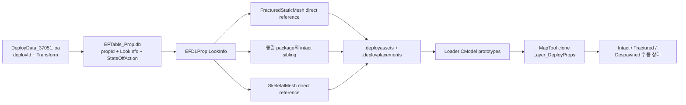

# 발탄 HeartRB 맵 완전 복원 작업 핸드오프

- 작성일: 2026-07-30
- 마지막 동기화: 2026-07-30 15:24 KST
- 대상: `LV_LUT_HEARTRB_ED`, zone `37051`
- 작업 위치: `C:/Users/user/Desktop/LostArk`
- 현재 상태: 맵 세션은 문서만 갱신 중이며, 다른 활성 세션이 Profiler/Frustum/FPS 표시를 조사·수정 중
- 한 줄 결론: 정적 맵과 전투장 Deploy Prop의 **배치 기반**은 복구됐지만, 파괴 Prop은 아직 원작 트리거에 따라 자동으로 무너지는 완성형 게임플레이가 아니라 **수동 intact/fractured/despawned 시각 상태기**다.

## 1. 지금 어디까지 왔는가

| 영역 | 현재 실측 | 판정 |
|---|---:|---|
| UE3 대상 레벨 | PS + SL00~SL05 | 완료 |
| exact 정적 StaticMesh 경로 | 260 | 완료 |
| exact 정적 placement | 13,091 | 완료 |
| Actor/Component property 오류 | 0 | 완료 |
| 현재 Map Catalog | 269 assets | exact 260 + overlay 9 |
| 현재 Map placement | 13,103 | exact 13,091 + overlay 12 |
| Deploy Catalog | 9 families | 완료 |
| 현재 arena Deploy placement | 85 | 시각 배치 완료 |
| Deploy WModel | 17 | static 16 + skeletal 1 |
| 실제 TriggerMap node 연결 | 0 | 미완료 |
| 원작 파괴 타이밍·낙하·particle·audio | 미연결 | 미완료 |
| 최신 `Client.exe` | 존재, Release, 2026-07-30 15:20:13 | 빌드 복구, 맵 실행 QA는 별도 필요 |

여기서 `260`은 아카이브 전체 에셋 수가 아니라 HeartRB의 PS/SL 레벨이 ImportTable로 실제 참조한 고유 StaticMesh 수다. 전체 게임의 다른 레이드·대륙은 같은 파이프라인으로 각 레벨 family를 다시 처리해야 한다.

## 2. 어제 수행한 정적 맵 복원

### 2.1 어떻게 에셋을 정확히 찾았는가

메시 이름 검색만 한 것이 아니다. 각 레벨 패키지의 UE3 테이블과 직렬화 payload를 다음 순서로 복구했다.

```text
PS/SL package
  -> AES-256 ECB + LZ4 logical package 복구
  -> NameTable / ImportTable / ExportTable
  -> StaticMeshActor 또는 StaticMeshCollectionActor
  -> Component의 StaticMesh object reference
  -> ImportTable의 package.mesh.object exact path
  -> Actor/Component의 Location, Rotation, Scale
```

ImportTable은 “이 레벨이 어떤 원본 StaticMesh를 참조하는가”의 증거이고, Actor/Component serial property는 “그 메시를 어디에 어떻게 배치했는가”의 증거다. 두 증거를 결합했기 때문에 중앙 메시를 포함한 13,091개 placement를 이름 추측 없이 복원할 수 있었다.

### 2.2 Transform 계약

```text
UE3 position (X,Y,Z) cm
  -> Client position (X,Z,-Y) m
  -> 위치 단위에 0.01 적용

UModel glTF meter
  -> cook 시 scale 100
  -> CModel Loader PreTransform 0.01
  -> 최종 Client world meter

UE3 signed scale (SX,SY,SZ)
  -> Client signed scale (SX,SZ,SY)
```

- 음수 축 placement: 5,042
- 실제 reflection: 4,521
- exact 자동 배치 anchor: `Origin`
- 마우스 수동 소품 배치용 `BottomCenter`를 exact 복원에 사용하면 안 된다.

### 2.3 런타임 연결

```text
mapassets
  assetId -> WModel/Material 생성 정의

mapplacements
  placementId -> assetId + source + Transform

Loader
  WModel을 CModel prototype으로 등록

MapTool
  placement를 읽고 CMapAssetObject clone
  -> Layer_Map_*
```

정적 맵은 기존 `CModel -> CMaterial` 통합 경로를 사용한다. 별도의 레거시 `CCookedModel` 또는 `CBinaryAssetObject` 런타임을 만들지 않았다.

## 3. 중앙 전투장과 누락 재질의 현재 상태

### 3.1 중앙 Floor overlay

원본 정적 level placement만으로 보스방의 intact 상태가 완전히 닫히지 않아 다음 전투장 overlay를 별도 provenance로 추가했다.

- `BG_RAD_VALTAN_FLOOR01_SM`
- `BG_RAD_VALTAN_FLOOR01A_SM`
- `BG_RAD_VALTAN_FLOOR01B_SM`
- 공통 중심 위치에 yaw `0°`와 `180°`를 배치
- exact static placement와 섞지 않고 reconstruction overlay로 표기

Floor01A/B의 diffuse와 normal은 원본이다. 돌 틈의 약한 녹색 발광 mask는 원작 영상을 맞춘 `VIDEO_MATCH_RECONSTRUCTION`이며 exact UE3 material이라고 주장하지 않는다. 발광 밝기는 전역 상수가 아니라 asset별 Catalog render profile이 소유한다.

### 3.2 쇠사슬

쇠사슬 A/B의 D/N/S 텍스처는 원본에 존재했다. 초기 누락 원인은 UModel staging 경로가 길어 `.props.txt` 생성에 실패했는데도 파이프라인이 성공 receipt를 남긴 것이었다.

현재 복구 대상은 다음과 같다.

- Chain01A: exact placement 4
- Chain01B: exact placement 9
- 공통 exact texture: `bg_fat_karlajavil_elevator01a_{d,n,s}_khb`

### 3.3 CloudPlane과 하늘

- CloudPlane 2개: exact placement, exact diffuse/normal/opacity, moving UV
- `sky_mirror_sm`: exact mesh/texture와 exact placement
- SpaceHole/ChaosGate: 원본 ParticleSystem texture를 사용한 proxy plane 6개
- SpaceHole/ChaosGate의 plane topology와 수동 phase timing은 재구성이지 원본 ParticleSystem 구현이 아니다.

이전 G5 결과는 Debug/Release build와 smoke까지 통과했다. 이후 sky depth와 opacity를 다시 조정하여 현재 Map Catalog가 v4가 됐다. 2026-07-30 15:20에 다른 Profiler 세션의 전체 빌드 검증을 통해 이 최신 소스와 데이터도 Debug/Release 컴파일·링크는 통과했지만, 그 빌드는 Profiler 오류 종결용이었다. v4 sky, Map 269/13,103, Deploy 9/85를 실제 AssetTest에서 다시 본 시각 QA로 간주하면 안 된다.

## 4. Destroy/Deploy는 정확히 무엇이 반영됐는가

### 4.1 원본 데이터에서 찾은 경로



원본 DeployData 전체에는 169개 레코드가 있다. 전투장 반경 2,000 cm subset은 112개이며, 그중 실제 시각 모델이 해석된 85개만 현재 런타임에 생성한다.

```text
ITR_02306   5
ITR_02307   4
ITR_02308   6
ITR_02309   2
ITR_02310   3
ITR_02311   2
ITR_02315  28
ITR_02316  27
ITR_02326   8
합계       85
```

### 4.2 지금 실제 화면에서 일어나는 일

1. Loader가 `.deployassets`를 읽어 9개 family의 CModel prototype을 등록한다.
2. Static family 8종은 intact와 fractured WModel을 각각 등록한다.
3. `ITR_02326`은 skeletal WModel 하나를 `MODEL::ANIM` prototype으로 등록한다.
4. MapTool이 `.deployplacements` 85행을 읽고 `Layer_DeployProps`에 clone한다.
5. 로드 직후 85개 모두 `INTACT` 상태가 된다.
6. MapTool radio button으로 85개 전체를 한 번에 다음 상태로 바꾼다.
   - `Intact`: intact model 렌더
   - `Fractured`: static family는 fractured model로 즉시 교체
   - `Despawned`: 렌더하지 않음

즉, 지금 보이는 Destroy 오브젝트는 임의 소품이 아니라 DeployData의 원본 위치·회전·스케일에 놓인 85개 게임플레이 시각 Prop이다. 다만 현재 `Fractured`는 돌이 시간에 따라 떨어지는 애니메이션이 아니라 한 프레임에 모델을 교체하는 상태 확인 기능이다.

### 4.3 현재 정확한 완료 경계

| 항목 | 현재 상태 |
|---|---|
| Deploy 원본 Transform | 반영 |
| 안정적인 runtime placement ID | 반영 |
| intact/fractured exact static mesh pair | 77개 반영 |
| skeletal `ITR_02326` exact mesh/skeleton | 8개 반영 |
| parse -> validate -> stage -> commit -> rollback | 반영 |
| 수동 상태 전환 | 전체 85개 일괄 반영 |
| 개별 Deploy trigger 연결 | 미반영 |
| 피격 횟수·HP·무적·난이도 조건 | 미반영 |
| 시간축 파괴·낙하·rigid body | 미반영 |
| 파괴 particle·audio·camera shake | 미반영 |
| 파괴 후 navigation 갱신 | 미반영 |
| wipe/restart restore | 미반영 |

### 4.4 `ITR_02326` 주의점

`ITR_02326`은 skinned WModel이지만 확보한 source glTF와 WModel의 animation clip 수가 0이다.

```text
mesh=1
skin=1
animation=0
```

LookInfo에는 `ITR_02326_Ani` AnimSet 이름이 있으나 해당 AnimSet export는 아직 확보되지 않았다. 따라서 현재 `Fractured` 상태에서도 bind pose만 렌더된다. 가짜 애니메이션은 넣지 않았다.

### 4.5 현재 생성하지 않은 DeployData

- arena subset 112개 중 시각 모델이 없는 27개는 빈 메시로 만들지 않았다.
- 그 안에는 trigger/volume/state 전용 레코드가 포함될 수 있다.
- 전체 주요 파괴 모델 113개 중 외곽 28개는 조사됐지만 현재 arena runtime 85개에는 포함하지 않았다.
- TriggerMapData의 deploy ID binary occurrence는 111개에서 확인했지만, 특정 Trigger node·field 직접 참조로 구조 파싱한 것은 아니다.

따라서 “파괴 데이터를 전부 복구했다”가 아니라 “전투장 시각 Prop 85개의 exact 모델·배치와 수동 상태 lane을 연결했다”가 정확한 표현이다.

## 5. 정적 Floor와 Destroy Prop은 별도 layer다

중앙 Floor01/A/B overlay와 Deploy Prop을 혼동하면 안 된다.

```text
Layer_Map_*
  정적 맵, 중앙 Floor overlay, 쇠사슬, CloudPlane, sky proxy

Layer_DeployProps
  DeployData가 소유하는 파괴·상태형 게임플레이 Prop 85개
```

현재 Destroy state를 `Fractured`로 바꿔도 Floor01A/B 자체를 실시간으로 조각내지 않는다. 원작에서 바닥 구역이 단계적으로 무너진다면 Trigger/Matinee/Deploy action이 어떤 Prop 또는 floor state를 끄는지 추가로 구조 파싱해야 한다.

## 6. 현재 빌드·실행 상태

### 6.1 마지막으로 검증된 상태

`valtan_dynamic_runtime` G5 단계에서는 다음이 통과했다.

- Engine x64 Debug Rebuild
- UpdateLib Debug
- Client x64 Debug Rebuild
- Engine/Client Release build
- 변경 HLSL FXC
- data invariant
- AssetTest smoke

### 6.2 지금 디스크의 최신 상태

- `LV_LUT_HEARTRB_ED.mapassets`: v4, 269 rows
- `LV_LUT_HEARTRB_ED.mapplacements`: 13,103 rows
- `LV_LUT_HEARTRB_ED.deployassets`: 9 rows
- `LV_LUT_HEARTRB_ED.deployplacements`: 85 rows
- Deploy WModel: 17개
- `Client/Bin/Client.exe`: 435,712 bytes, 2026-07-30 15:20:13 생성
- `Engine/Bin/Engine.dll`: 1,746,944 bytes, 2026-07-30 15:19:15 생성
- `Client/Bin`의 현재 최종 구성: Release

15:24 KST에 현재 파일을 다시 읽어 수행한 data invariant 결과는 다음과 같다.

| 검증 항목 | 실측 | 판정 |
|---|---:|---|
| exact / overlay Map assets | 260 / 9 | PASS |
| exact / overlay Map placements | 13,091 / 12 | PASS |
| Map asset ID / placement ID 중복 | 0 / 0 | PASS |
| Map placement의 missing asset reference | 0 | PASS |
| Deploy asset ID / placement ID 중복 | 0 / 0 | PASS |
| Deploy placement의 missing asset reference | 0 | PASS |
| Map / Deploy non-finite numeric row | 0 / 0 | PASS |
| Map WModel missing | 0 / 269 | PASS |
| Deploy WModel missing | 0 / 17 | PASS |

Deploy family별 placement도 `5, 4, 6, 2, 3, 2, 28, 27, 8`로 4.1의 85개 합계와 일치한다.

핸드오프 최초 작성 시점에는 최신 sky 수정 뒤 `Rebuild`가 Clean 단계에서 멈춰 `Client.exe`가 없었다. 이후 다른 Profiler 세션이 공유 변경을 보존한 채 다음 체인을 모두 통과시켜 실행 파일을 복구했다.

```text
Engine Debug -> UpdateLib Debug -> Client Debug       PASS
Engine Release -> UpdateLib Release -> Client Release PASS
```

따라서 현재 차단점은 “실행 파일 없음”이 아니라 “다른 활성 세션의 후속 변경이 아직 끝나지 않았고, v4 맵의 실행·시각 검증을 다시 하지 않음”이다.

### 6.3 병렬 세션 동기화 상태

현재 같은 `C:/Users/user/Desktop/LostArk` 워크트리에서 활성인 다른 작업은 `발탄 파괴 구조물 및 텍스처 조사` 세션이며, 최신 요청 범위는 Profiler 설명, TextureResourceCache 역할 확인, Frustum 적용 감사, 좌상단 FPS/Draw 통계 표시다.

15:24 KST 실측 기준으로 이미 반영된 것은 다음과 같다.

- `CProfiler` 엔진 코어와 `CGameInstance` 소유·접근·해제 연결
- `Profiler.h/.cpp`의 Engine 프로젝트 등록
- 활성 프레임 밖 scope/counter 기록을 막는 `m_FrameActive` 경계
- 위 변경을 포함한 Engine/UpdateLib/Client Debug·Release 빌드 통과

아직 반영되지 않았거나 활성 세션에서 조사 중인 것은 다음과 같다.

- Client frame loop의 `Begin_Frame()` / `End_Frame()` 호출: 외부 호출 0
- F2 Profiler panel, JSON capture, 좌상단 FPS/Draw 통계: 미연결 또는 조사 중
- `TextureResourceCache.h`: `#pragma once`만 존재
- `TextureResourceCache.cpp`: 0 bytes, 프로젝트 미등록·런타임 미연결
- Frustum 호출: 현재 `VIBuffer_Terrain`과 `ForkLift`에서만 확인됨
- `CMapAssetObject`와 `CDeployPropObject`의 per-object frustum culling: 호출 없음

이 활성 세션에는 핸드오프 문서를 수정하지 말고, 완료 시 변경 파일과 빌드·실행 검증 범위를 남겨 달라고 전달했다. 이 문서의 다음 동기화에서는 그 최종 결과를 먼저 대조해야 한다.

### 6.4 작업 재개 전 금지 사항

- 다른 세션의 Engine/Client 변경을 reset 또는 checkout하지 않는다.
- `Client/Bin`의 일부 DLL만 임의로 복사해 Debug/Release를 섞지 않는다.
- 현재 `Client.exe`가 없다는 이유로 옛 Release exe를 가져오지 않는다.
- Map placement와 Deploy placement를 하나의 파일로 합치지 않는다.

## 7. 한글 폰트·창 제목 깨짐 원인과 수정 계획

### 7.1 확인된 원인

한 가지 문제가 아니라 세 경로가 섞여 있다.

1. Release 좌상단 문자열
   - `CMainApp::Render`의 `#ifndef _DEBUG` 블록이 `한글 이다12abd` 테스트 문구를 항상 그린다.
   - 따라서 Release 화면에 해당 문구가 뜨는 것 자체가 현재 코드의 의도된 테스트 잔재다.
2. C++ source encoding
   - `MainApp.cpp`, `Loader.cpp`, `Level_GamePlay.cpp`, `Level_AssetTest.cpp`는 UTF-8 BOM이 없다.
   - Client 프로젝트에는 `/utf-8` 또는 `/source-charset:utf-8` 계약이 없다.
   - 한국어 Windows의 MSVC가 해당 bytes를 CP949로 해석해 wide literal을 이미 깨진 문자로 컴파일할 수 있다.
   - 반면 `Level_Logo.cpp`는 UTF-8 BOM이 있어 파일별 결과가 달라진다.
3. 이미 손상된 literal
   - `Level_GamePlay.cpp`의 Debug `SetWindowText` 문자열은 소스 안에서 이미 `����...`로 손상돼 있다.
4. ImGui font
   - `CImGuiLayer::Initialize`는 기본 ImGui font만 사용하며 Korean glyph font를 등록하지 않는다.
   - 이것은 Win32 창 제목과 SpriteFont 깨짐과는 별개의 문제다.

`161ex.spritefont`는 한글 범위를 포함해 생성된 파일이고 실제 리소스도 존재한다. 현재 캡처만으로 SpriteFont 바이너리 자체가 고장 났다고 단정하면 안 된다. 우선 컴파일된 문자열 codepoint가 정상인지부터 확인해야 한다.

### 7.2 수정 순서

1. `MainApp.cpp`의 Release 전용 `Draw_Text("한글 이다12abd")` 테스트 코드를 제거한다.
2. `Level_GamePlay.cpp`의 이미 손상된 Debug 제목을 정상 문자열 또는 영문 진단 제목으로 교체한다.
3. `Loader.cpp`의 loading title과 `Level_Logo.cpp`, `Level_AssetTest.cpp`의 title을 포함해 모든 `SetWindowText` 호출을 목록화한다.
4. 변경 파일의 인코딩을 하나의 계약으로 통일한다.
   - 안전한 단기안: 한글 literal이 있는 변경 파일을 UTF-8 BOM으로 보존
   - 장기안: 전체 C++/HLSL 인코딩 audit와 변환 후 모든 Client/Engine configuration에 `/utf-8` 적용
   - 기존 CP949 파일이 남은 상태에서 프로젝트 전체에 `/utf-8`만 먼저 켜면 다른 문자열이 새로 깨질 수 있으므로 금지
5. ImGui에서 한국어 UI가 필요하면 라이선스가 확인된 TTF/OTF를 runtime resource로 포함하고 `GetGlyphRangesKorean()` 범위로 atlas에 등록한다.
6. DirectXTK SpriteFont는 `한글 가나다 ABC 0123` 고정 smoke 문자열로 glyph 존재와 codepoint를 확인한다.
7. Debug와 Release를 각각 Rebuild하여 아래 매트릭스를 캡처한다.

| 구성 | Logo 제목 | Loading 제목 | AssetTest 제목 | SpriteFont | ImGui 한글 | 좌상단 테스트 잔재 |
|---|---|---|---|---|---|---|
| x64 Debug | 정상 | 정상 | 정상 | 정상 | 정상 | 없음 |
| x64 Release | 정상 | 정상 | 정상 | 정상 | 정상 | 없음 |

초기 Win32 resource title `Client`와 AssetTest title `Valtan WModel Asset Test`는 각각 현재 리소스·레벨 코드가 설정한 정상 영문 제목이다. 제목이 영문이라는 사실과 한글이 깨지는 결함을 구분한다.

## 8. 다음 세션의 정확한 작업 순서

### Gate 0. 다른 세션 종료와 변경 경계 확인

1. 활성 Profiler/Frustum/FPS 세션이 작업을 끝냈는지 확인한다.
2. 그 세션의 최종 변경 파일과 빌드·실행 검증 범위를 이 문서 6.3과 대조한다.
3. `git status --short`로 공유 변경을 기록한다.
4. 현재 요청과 무관한 파일을 되돌리지 않는다.
5. Engine public header 변경 여부를 확인한다.
6. `MainApp.cpp`, `Renderer.*`, `GameInstance.*`, `Profiler.*`, `Timer.cpp`가 바뀌었다면 한글 수정 전 최신 내용을 다시 읽고 블록 단위로 병합한다.

### Gate 1. 데이터 invariant 재검증

```text
Map asset header/rows          v4 / 269 / 269
Map placement header/rows     13,103 / 13,103
Deploy asset header/rows       9 / 9
Deploy placement header/rows  85 / 85
```

- placement ID 중복 0
- asset reference missing 0
- Deploy Transform finite
- WModel 경로 missing 0
- exact/overlay provenance 유지

### Gate 2. 한글·창 제목 수정

7장의 원인과 수정 순서를 먼저 적용한다. 이 변경은 렌더러·Deploy 기능과 분리된 작은 변경으로 유지한다.

### Gate 3. 정식 빌드

```text
1. Engine x64 Debug Rebuild
2. UpdateLib.bat Debug
3. Client x64 Debug Rebuild
4. Debug 실행 QA
5. Engine x64 Release Rebuild
6. UpdateLib.bat Release
7. Client x64 Release Rebuild
8. Release 실행 QA
9. 최종 실행할 구성을 다시 Rebuild
```

Debug/Release가 같은 `Engine/Bin`, `Client/Bin`을 공유하므로 마지막 단순 `Build`가 아니라 원하는 최종 구성을 `Rebuild`한다.

### Gate 4. Map·Deploy 시각 검증

1. Logo 진입
2. F2로 AssetTest loader 진입
3. 중앙 Floor01/A/B가 닫혀 있는지 확인
4. 쇠사슬 D/N/S 확인
5. CloudPlane alpha·moving UV 확인
6. MapTool에서 Deploy `Intact` 캡처
7. `Fractured` 캡처
8. `Despawned` 캡처
9. 각 상태에서 85개 개수와 crash 여부 확인
10. F7/F8/F9 sky phase 캡처

### Gate 5. 원작 파괴 게임플레이 복원

1. TriggerMapData node/field 구조를 파싱한다.
2. deploy actor ID를 특정 trigger node와 연결한다.
3. `StateOffActionId -> GameAction -> SkillEffect`를 runtime event로 변환한다.
4. 전체 일괄 상태가 아니라 placement ID별 state를 둔다.
5. phase별 visibility, hit, delay, fall duration, restore를 데이터로 저장한다.
6. particle/audio/camera shake를 별도 effect event로 연결한다.
7. `ITR_02326_Ani` exact AnimSet을 확보한다.
8. 정적 맵이 확정된 뒤 navigation을 bake하고 파괴 state별 blocker 갱신을 검증한다.

## 9. 다음 작업자가 먼저 볼 파일

### 정본 문서

- `C:/Users/user/Desktop/LostArk/.md/GB/07-30/맵추출파이프라인.md`
- `C:/Users/user/Desktop/LostArk/.md/GB/07-30/2026-07-30_LOSTARK_LEVEL_PLACEMENT_RECOVERY_RESULT.md`
- `C:/Users/user/Desktop/LostArk/.md/GB/07-30/2026-07-30_LOSTARK_VALTAN_FLOOR_EMISSIVE_DEPLOYDATA_RESULT.md`
- `C:/Users/user/Desktop/LostArk/.md/GB/07-30/2026-07-30_LOSTARK_VALTAN_DYNAMIC_ENVIRONMENT_DEPLOY_RUNTIME_RESULT.md`
- `C:/Users/user/Desktop/LostArk/.md/GB/07-30/2026-07-30_LOSTARK_VALTAN_DESTRUCTIBLE_ENVIRONMENT_SKY_AUDIT_RESULT.md`

### 런타임 데이터

- `C:/Users/user/Desktop/LostArk/Client/Bin/DataFiles/Map/LV_LUT_HEARTRB_ED.mapassets`
- `C:/Users/user/Desktop/LostArk/Client/Bin/DataFiles/Map/LV_LUT_HEARTRB_ED.mapplacements`
- `C:/Users/user/Desktop/LostArk/Client/Bin/DataFiles/Map/LV_LUT_HEARTRB_ED.deployassets`
- `C:/Users/user/Desktop/LostArk/Client/Bin/DataFiles/Map/LV_LUT_HEARTRB_ED.deployplacements`

### Deploy 런타임 코드

- `C:/Users/user/Desktop/LostArk/Client/Public/DeployPropCatalog.h`
- `C:/Users/user/Desktop/LostArk/Client/Private/DeployPropCatalog.cpp`
- `C:/Users/user/Desktop/LostArk/Client/Public/DeployPropObject.h`
- `C:/Users/user/Desktop/LostArk/Client/Private/DeployPropObject.cpp`
- `C:/Users/user/Desktop/LostArk/Client/Private/Loader.cpp`
- `C:/Users/user/Desktop/LostArk/Client/Private/MapTool.cpp`

### 생성기

- `C:/Users/user/Desktop/LostArk/Tools/LevelPlacementExtractor/extract_ue3_placements.py`
- `C:/Users/user/Desktop/LostArk/Tools/LevelPlacementExtractor/extract_deploydata_props.py`
- `C:/Users/user/Desktop/LostArk/Tools/LevelPlacementExtractor/build_deployprop_runtime.py`
- `C:/Users/user/Desktop/LostArk/Tools/LevelPlacementExtractor/build_maptool_scene.py`
- `C:/Users/user/Desktop/LostArk/Tools/LevelPlacementExtractor/build_valtan_environment_runtime.py`
- `C:/Users/user/Desktop/LostArk/Tools/LevelPlacementExtractor/build_valtan_phase_layers.py`

### 한글·창 제목 조사 지점

- `C:/Users/user/Desktop/LostArk/Client/Private/MainApp.cpp`
- `C:/Users/user/Desktop/LostArk/Client/Private/Loader.cpp`
- `C:/Users/user/Desktop/LostArk/Client/Private/Level_Logo.cpp`
- `C:/Users/user/Desktop/LostArk/Client/Private/Level_GamePlay.cpp`
- `C:/Users/user/Desktop/LostArk/Client/Private/Level_AssetTest.cpp`
- `C:/Users/user/Desktop/LostArk/Engine/Private/ImGuiLayer.cpp`
- `C:/Users/user/Desktop/LostArk/Client/Bin/Resources/Fonts/161ex.spritefont`

## 10. 최종 인수 기준

- [ ] 다른 세션의 변경을 보존한 채 Engine/UpdateLib/Client Debug·Release가 모두 빌드된다.
- [ ] Debug·Release 창 제목과 모든 한국어 진단 문자열이 깨지지 않는다.
- [ ] Release 좌상단 테스트 문구가 제거된다.
- [ ] Map 269/13,103과 Deploy 9/85가 누락 없이 로드된다.
- [ ] 중앙 바닥, 외곽 경계, 쇠사슬, CloudPlane이 대상 카메라에서 원작과 대조된다.
- [ ] Deploy 85개가 Intact/Fractured/Despawned 각 상태에서 안정적으로 전환된다.
- [ ] 수동 state selector와 원작 Trigger 기반 자동 파괴를 완료 상태로 혼동하지 않는다.
- [ ] TriggerMap 구조, AnimSet, particle/audio, restore, navigation까지 연결된 뒤에만 “파괴 연출 완전 복원”으로 닫는다.

## 11. 다음 세션에 넘길 한 문장

> HeartRB의 정적 맵 13,091개와 전투장 Deploy 시각 Prop 85개의 exact 배치·모델 로드는 준비됐고, 현재 Destroy는 intact/fractured/despawned를 전체 일괄 전환하는 검증용 상태기까지다. 15:20 기준 Debug/Release 빌드와 Release 실행 파일은 복구됐지만 v4 맵의 실행 QA는 아직이며, 활성 Profiler/Frustum/FPS 세션의 최종 diff를 먼저 병합한 뒤 한글·창 제목과 Map 269/13,103·Deploy 9/85 시각 검증을 닫고 TriggerMap node를 placement별 파괴 event에 연결하라.
