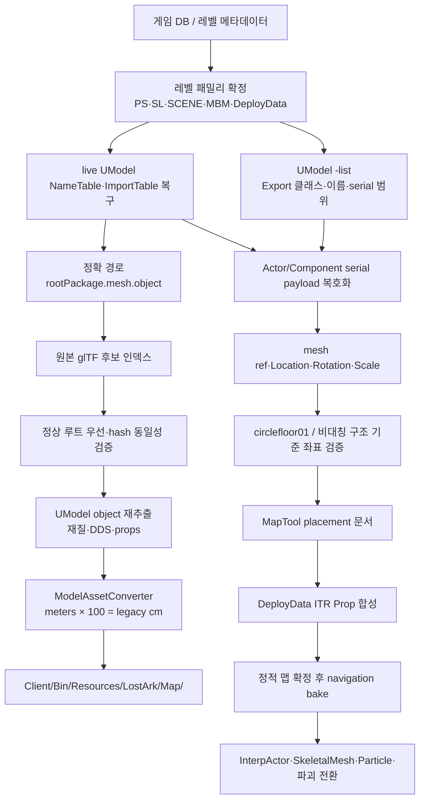

# Lost Ark 범용 맵 추출 파이프라인

작성일: 2026-07-30  
정본 도구 위치: `C:/Users/user/Desktop/Final_LostArk/Tools/AssetPipeline`  
현재 실증 대상: `LV_LUT_HEARTRB_ED_PS`, `LV_LUT_HEARTRB_ED_SL00`~`SL05`

## 1. 이 문서가 보장하는 것과 아직 보장하지 않는 것

이 파이프라인은 이름 검색이나 시각적 추측으로 맵을 조립하지 않는다. 게임 DB로 레벨 패밀리를 정하고, 레벨 패키지의 정확한 UE3 ImportTable로 원본 패키지와 StaticMesh 경로를 확정한 뒤, 원본 mesh·재질·텍스처를 다시 추출하고 `.wmodel`로 조리한다.

2026-07-30 HeartRB 기준 상태는 다음과 같다.

| 구간 | 상태 | 실측 결과 |
|---|---:|---|
| 레벨 패밀리 식별 | PASS | `PS + SL00~SL05` |
| 정확 ImportTable 복구 | PASS | 4,276 import행, StaticMesh 참조 709행 |
| 고유 StaticMesh 경로 | PASS | 260개 |
| 원본 glTF 확정 | PASS | 260/260, 모호성 0 |
| 재질 추출 manifest | PASS | 260/260 |
| 실제 텍스처가 복구된 에셋 | PASS | 188개, 텍스처 파일 465개 |
| `.wmodel` 조리 | PASS | 260/260 |
| LostArk 런타임 Map 폴더 설치 | PASS | 260/260 |
| SL00~SL05 Export 목록 | PASS | 25,155행 |
| StaticMeshComponent 목록 | PASS | 12,949행 |
| Actor/Component serial payload | PASS | 원본 UPK를 메모리에서 AES-256 ECB + LZ4 복원 |
| UE3-native Transform 추출 | PASS | PS+SL00~SL05 13,091개, property 오류 0 |
| Client 좌표계 확정 | PASS | `UE3 (X,Y,Z) cm -> Client (X,Z,-Y) m`, signed scale·quaternion 런타임 검증 |
| MapTool placement 변환 | PASS | exact 13,091개 + reconstruction overlay 6개, parse/validate/stage/commit 성공 |

따라서 “발탄 중앙 mesh와 원본 UE3 배치값을 정확히 찾았는가”에는 **예**다. 다만 “어떤 Lost Ark 맵이든 지금 즉시 Client 좌표로 변환해 완성된 맵이 되는가”에는 아직 **아니다**. 에셋과 UE3-native Transform 복구는 완료됐지만 Client의 축·단위·반사 계약, hidden/collision 분류, DeployData, navigation과 동적 actor는 별도 gate다.

## 2. 전체 데이터 흐름



## 3. 절대 섞으면 안 되는 네 종류의 근거

### 3.1 DB와 패키지 카탈로그

DB는 지역, 레벨 패밀리, 퀘스트, DeployData 같은 상위 관계를 찾는 데 사용한다. DB에 mesh 이름이 보인다는 이유만으로 배치 에셋이라고 단정하지 않는다.

### 3.2 ImportTable

ImportTable의 `className=StaticMesh`, `fullPath=root.mesh.object`는 그 레벨 패키지가 원본 에셋을 참조한다는 정확한 증거다. 예:

```text
Level:    LV_LUT_HEARTRB_ED_SL00
Class:    StaticMesh
FullPath: pvp_retown_a.mesh.bg_pvp_retown_floor01_sm
Source:   PVP_RETOWN_A / U0U1Q8PMN7G1QXES1JU9GC3.upk
```

이 근거로 `bg_pvp_retown_floor01_sm`이 HeartRB가 실제 사용하는 원형 링/기둥 계열 구조물임을 확정했다. 단, 이것을 발탄 보스방의 납작한 중앙 캡이라고 부르면 안 된다. 보스방 중앙 캡의 정본은 SL00가 1회 배치한 `bg_lut_wagloy_circlefloor01_sm_jjy`다. ImportTable은 Transform을 주지 않는다.

### 3.3 Export 목록

special UModel의 `-list`는 복호화된 export index, class, object name, serial offset, serial size를 준다. SL00 실측은 Export 1,871개, StaticMeshActor 388개, StaticMeshComponent 682개다.

### 3.4 Actor/Component serial payload

실제 배치는 이 payload에서 나온다. 최소 계약은 다음과 같다.

```text
Actor export
  actor identity
  StaticMeshComponent object reference
  Location / Rotation / DrawScale / DrawScale3D

StaticMeshComponent export
  StaticMesh import/export reference
  Translation / Rotation / Scale3D
  visibility / hidden / collision flags
  material overrides if present
```

Actor Transform과 Component local Transform을 합성해야 최종 world Transform이 된다. 한쪽만 읽으면 중앙 정렬과 중복 판정이 틀어진다.

## 4. 범용 입력 spec

맵마다 코드를 복사하지 않는다. `Specs/<AreaId>.json`만 추가한다.

현재 실증 spec:

```text
C:/Users/user/Desktop/Final_LostArk/Tools/AssetPipeline/Specs/LV_LUT_HEARTRB_ED.json
```

필수 필드는 다음과 같다.

```json
{
  "schemaVersion": 1,
  "areaId": "LV_LUT_HEARTRB_ED",
  "rawRoot": "C:/Users/user/Desktop/Resource_LostArk/01_Extracted/Map/StaticMesh_Raw_20260729",
  "reportRoot": "C:/Users/user/Desktop/Resource_LostArk/05_Reports/MapExtraction/LV_LUT_HEARTRB_ED",
  "levels": [
    {
      "package": "LV_LUT_HEARTRB_ED_SL00",
      "kind": "streaming",
      "imports": ".../LV_LUT_HEARTRB_ED_SL00.imports.json"
    }
  ]
}
```

아브렐슈드, 일리아칸, 카멘, 카오스 던전, 시작 마을, 장비 제련 마을, 대륙, 성벽 퀘스트 연출도 같은 spec을 사용한다. 다른 것은 `areaId`, 레벨 패밀리 구성, DeployData/SCENE 보조 패키지뿐이다.

## 5. 1단계: 레벨 패밀리 확정

한 이름만 잡지 말고 다음을 함께 조사한다.

- `*_PS`: persistent/root world
- `*_SL00...`: streaming geometry와 actor
- `*_SCENE*`: 연출 전용 actor, sequence, particle
- `*_MBM`, `*_MUSIC`: 배경/사운드 보조 레이어
- DeployData: ITR/NPC/interactive prop 배치
- quest/continent DB: 퀘스트 단계와 레벨 연결

`SL00` 하나만 보고 맵 전체라고 부르면 안 된다. 반대로 `PS`에 StaticMesh import가 적다고 맵이 비었다고 판단해서도 안 된다.

## 6. 2단계: NameTable과 ImportTable 복구

Lost Ark special UModel은 `-game=lostark -kr -nameresolve` 세 옵션을 함께 사용한다.

```powershell
python C:/Users/user/Desktop/Final_LostArk/Tools/AssetPipeline/ue3_level_memory_exporter.py `
  --umodel C:/Users/user/Desktop/Resource_LostArk/06_Tools/UEViewerLostArk_runtime/umodel_lostark_v7.exe `
  --packages C:/ProgramData/Smilegate/Games/LOSTARK/EFGame/ReleasePC/Packages `
  --package LV_LUT_HEARTRB_ED_SL00 `
  --physical-package C:/ProgramData/Smilegate/Games/LOSTARK/EFGame/ReleasePC/Packages/534P5WP4TDS0BPB74ESL4EI522.upk `
  --out C:/Users/user/Desktop/Resource_LostArk/05_Reports/MapExtraction/LV_LUT_HEARTRB_ED/levels/LV_LUT_HEARTRB_ED_SL00.tables.json
```

이미 exact ImportTable JSON이 있으면 `--imports-json`으로 재사용한다. 이 방식이 반복 실행과 CI 감사에 더 안정적이다.

ImportTable in-memory compact layout은 현재 빌드에서 32바이트다.

```text
+0x00 ClassName FName.Str pointer
+0x08 PackageIndex int32
+0x10 ObjectName FName.Str pointer
+0x18 Missing helper byte
stride 0x20
```

부모 import는 음수 `PackageIndex`의 `-(index + 1)` 규칙으로 따라가 `root.mesh.object`를 만든다.

## 7. 3단계: 정확 에셋 manifest 생성

```powershell
python C:/Users/user/Desktop/Final_LostArk/Tools/AssetPipeline/map_asset_pipeline.py `
  --spec C:/Users/user/Desktop/Final_LostArk/Tools/AssetPipeline/Specs/LV_LUT_HEARTRB_ED.json `
  build-manifest
```

해결 키는 object name 단독이 아니라 다음 두 필드다.

```text
(rootImport.casefold(), objectName.casefold())
```

고유 asset ID는 exact full path의 SHA-1 앞 12자리와 object name으로 만든다.

```text
MAP_<12HEX>_<NORMALIZED_OBJECT_NAME>
```

같은 object name이 다른 패키지에 있으면 서로 다른 asset이다. vector index, pointer, Prototype tag는 저장 ID로 사용하지 않는다.

### 원본 선택 우선순위

1. 정상 raw root의 동일 logical package + object
2. 정상 후보가 여러 개면 glTF와 buffer payload hash가 모두 같을 때만 중복으로 인정
3. 정상 후보가 없을 때만 `_COUNT_MISSING`, `_COUNT_MISMATCH`, `_RECOVERY_PARTIAL` 후보 검토
4. 서로 다른 payload가 두 개 이상 남으면 자동 선택하지 않고 실패

복구 버킷은 정본을 덮어쓰지 않는다.

## 8. 4단계: 재질과 텍스처 재추출

```powershell
python C:/Users/user/Desktop/Final_LostArk/Tools/AssetPipeline/map_asset_pipeline.py `
  --spec C:/Users/user/Desktop/Final_LostArk/Tools/AssetPipeline/Specs/LV_LUT_HEARTRB_ED.json `
  extract-materials --workers 2
```

각 object를 물리 UPK에서 다시 뽑고 다음을 asset별 staging에 보존한다.

- target glTF와 buffer
- Material/MaterialInstance props
- diffuse, normal, emissive, ORM DDS
- UModel stdout/stderr
- source logical/physical package
- runtime texture 경로

UModel은 Win32 긴 경로에서 성공 코드만 내고 target glTF를 만들지 않을 수 있다. staging leaf에는 긴 asset ID를 쓰지 않고 12자리 UUID만 쓴다.

텍스처가 0개인 에셋은 실패와 구분한다. 추출이 성공했지만 usable diffuse가 없으면 `fallbackDiffuse=true`가 된다.

### MaterialInstanceConstant export 실패 복구

UModel이 메시와 Texture2D dependency를 메모리에 로드했어도 `MaterialInstanceConstant`의 `.mat` 파일 생성만 실패할 수 있다. 이때 `fallbackDiffuse=true`를 최종 판결로 굳히지 않는다.

1. 해당 에셋의 `logs/umodel.stdout.log`에서 로드된 MIC와 Texture2D 이름·물리 패키지를 확인한다.
2. Texture2D를 `-obj=<exact texture object>`로 물리 UPK에서 직접 DDS 추출한다.
3. MIC dependency 순서와 texture parameter 근거로 material slot별 diffuse/normal을 manifest에 기록한다.
4. 해당 에셋 하나만 `cook_one(..., force=True)`로 다시 조리한다.
5. `install-runtime`으로 WModel과 DDS를 원자적으로 갱신하고 runtime manifest 수량을 다시 쓴다.

HeartRB 중앙 실증은 다음과 같다.

```text
mesh       bg_lut_wagloy_circlefloor01_sm_jjy
placement  LV_LUT_HEARTRB_ED_SL00:export:1274
material0  bg_lut_wagloy_circlefloor01_mi_rain_jjy
diffuse    bg_lut_wagloy_circlefloor01_d_jjy
normal     bg_lut_wagloy_circlefloor01_n_jjy
material1  bg_lut_wagloy_circlefloor01a_mi_rain_jjy
diffuse    bg_lut_memonast_deco_d_sup
normal     bg_lut_memonast_deco_n_sup
```

원작의 `preset_rain_opa`는 현재 기본 `CModel -> CMaterial` 셰이더보다 젖은 표면의 roughness/specular 응답이 복잡하다. diffuse/normal 복구와 원작 rain shader 재현은 별도 gate로 기록한다.

## 9. 5단계: `.wmodel` 조리

```powershell
python C:/Users/user/Desktop/Final_LostArk/Tools/AssetPipeline/map_asset_pipeline.py `
  --spec C:/Users/user/Desktop/Final_LostArk/Tools/AssetPipeline/Specs/LV_LUT_HEARTRB_ED.json `
  cook --workers 8
```

UModel glTF의 단위는 meters다. 현재 LostArk 런타임은 legacy centimeter 공간을 사용하므로 converter에 `--scale 100`을 적용한다.

```text
ModelAssetConverter <source.gltf>
  -o <AssetId>.wmodel
  --pretransform
  --no-auto-textures
  --scale 100
  --material-remap / --normal-remap / --emissive-remap / --orm-remap
```

WModel 검증 계약은 다음과 같다.

```text
offset 0x00: "WINT"
offset 0x10: "WMOD"
minimum size: 64 bytes
```

`stdout`의 `wrote ...`만으로 성공 처리하지 않는다.

## 10. 6단계: LostArk Map 런타임 설치

```powershell
python C:/Users/user/Desktop/Final_LostArk/Tools/AssetPipeline/map_asset_pipeline.py `
  --spec C:/Users/user/Desktop/Final_LostArk/Tools/AssetPipeline/Specs/LV_LUT_HEARTRB_ED.json `
  install-runtime

python C:/Users/user/Desktop/Final_LostArk/Tools/AssetPipeline/map_asset_pipeline.py `
  --spec C:/Users/user/Desktop/Final_LostArk/Tools/AssetPipeline/Specs/LV_LUT_HEARTRB_ED.json `
  status
```

정본 archive와 런타임 입력을 분리한다.

```text
Archive:
Resource_LostArk/02_WintersBinary/Final_LostArk/Map/LevelAssets/<AreaId>/<AssetId>/

Runtime:
LostArk/Client/Bin/Resources/LostArk/Map/<AreaId>/<AssetId>/
```

runtime은 `_work`나 raw glTF를 직접 읽지 않는다. MapTool 등록은 `CModel -> CMaterial` 통합 경로만 사용한다.

## 11. 7단계: Export 목록과 placement payload

SL00~SL05의 exact component 수는 다음과 같다.

| 레벨 | Export | StaticMeshActor | StaticMeshComponent | InterpActor |
|---|---:|---:|---:|---:|
| SL00 | 1,871 | 388 | 682 | 3 |
| SL01 | 6,274 | 449 | 3,603 | 3 |
| SL02 | 4,018 | 217 | 2,094 | 8 |
| SL03 | 5,054 | 562 | 2,543 | 0 |
| SL04 | 4,829 | 168 | 2,324 | 71 |
| SL05 | 3,109 | 268 | 1,703 | 3 |
| 합계 | 25,155 | 2,052 | 12,949 | 88 |

기계 판독 결과:

```text
C:/Users/user/Desktop/Resource_LostArk/05_Reports/MapExtraction/LV_LUT_HEARTRB_ED/level_export_summary.json
```

### payload blocker를 실제로 푼 방법

`UModel -list`가 알려 준 serial offset을 물리 `.upk`나 `-save` 사본에 그대로 적용하는 방식은 실패했다. 이유는 Lost Ark package의 export payload가 압축·암호화된 물리 표현이고 special UModel의 reader 안에서만 논리 바이트로 복원되기 때문이다.

정식 추출기는 UModel을 우회해 값을 추측하지 않는다. UModel은 오직 논리 패키지명→난독화된 물리 UPK 이름 해석에 사용하고, 원본 UPK는 다음 순서로 읽기 전용 복원한다.

```text
physical UPK
  -> UE3 PackageSummary
  -> Lost Ark 20-byte compressed chunk descriptor
  -> chunk별 compressed block table
  -> 각 LZ4 block의 앞 4,096바이트 AES-256 ECB 해제
  -> LZ4 block 복원
  -> logical package byte stream
  -> NameTable / 28-byte ImportTable / variable ExportTable
  -> Actor와 Component tagged properties
```

현재 KR 패키지에서 실측한 추가 규칙은 다음과 같다.

- package compression flags: `0x44`
- compressed chunk descriptor: 표준 16바이트가 아니라 `encrypted_lz4`가 붙은 20바이트
- `IntProperty`: 선언 payload 앞에 Lost Ark 전용 8바이트 descriptor 존재
- Actor export: UnrealScript stack frame 때문에 property 시작 offset이 고정되지 않음
- Rotator: `65,536 units = 360 degrees`
- 일반 `StaticMeshActor/InterpActor`: Actor Transform 사용
- `StaticMeshCollectionActor`: Component의 `Translation/Rotation/Scale3D`가 인스턴스 Transform

정식 구현과 결과는 다음 경로다.

```text
C:/Users/user/Desktop/LostArk/Tools/LevelPlacementExtractor/extract_ue3_placements.py
C:/Users/user/Desktop/Resource_LostArk/05_Reports/MapExtraction/LV_LUT_HEARTRB_ED/placements/
  LV_LUT_HEARTRB_ED_PS.placements.json
  LV_LUT_HEARTRB_ED_SL00.placements.json ... SL05.placements.json
  placement_manifest.json
```

재실행 실측은 `PS 142 + SL00~SL05 12,949 = 13,091` placement, 고유 exact path 260, property 오류 0이다. 기존 결과와 독립 재실행 결과의 SHA-256도 8개 파일 전부 일치했다. 실험용 `ue3_level_property_probe.py`는 이 정식 결과의 입력이 아니며 production에서 사용하지 않는다.

## 12. 좌표·단위·회전 확정 절차

일반 UE3 관례를 바로 저장 계약으로 고정하지 않는다.

- package 위치 단위: UE3 centimeter
- glTF source 단위: meter
- cooked WModel: `meter × 100`
- UE3 Rotator: 65,536 units = 360 degrees
- Client 위치: `UE3 (X,Y,Z) cm -> Client (X,Z,-Y) m`, 즉 축 변환 뒤 `× 0.01`
- Client signed scale: `(SX,SY,SZ) -> (SX,SZ,SY)`
- 회전: 같은 basis 변환을 quaternion에 적용하고 길이 1로 정규화

확정 순서는 반드시 다음과 같다.

1. 수치 골든은 `pvp_retown_a.mesh.bg_pvp_retown_floor01_sm`의 `SL00:export:1234`를 사용한다.
2. 골든 원본 위치 `(849.491821, 2140.945313, 975.819458)`, yaw `-90°`, scale `(0.490689, 0.513935, 0.225717)`이 Client에서 위치 `(8.494918, 9.758195, -21.409453)`, scale `(0.490689, 0.225717, 0.513935)`가 되는지 검증한다.
3. 보스방 중앙 캡은 exact `SL00:export:1274`, `bg_lut_wagloy_circlefloor01_sm_jjy`를 사용한다. `BG_RAD_VALTAN_STATUE01_SM`은 중앙 캡이 아니므로 배치하지 않는다.
4. Actor와 Component 중 `transform.source`가 지시한 정본 Transform을 적용한다.
5. floor 중심, 원형 방향, 높이, 비대칭 구조의 상대 위치를 스크린샷과 비교한다.
6. 한 축 mapping으로 최소 2개 비대칭 anchor가 동시에 맞을 때만 Client 좌표 계약을 확정한다.

원형 floor 하나만 맞는 것은 회전/반사 검증이 아니다. 반드시 비대칭 구조물을 두 번째 anchor로 사용한다. `BG_RAD_VALTAN_FLOOR01_SM`은 외곽 반원 레일이므로 동일 Origin에 yaw 0°와 180° 두 배치가 한 바퀴를 만든다. 이는 exact ImportTable 배치가 아니라 DeployData 감사까지 마친 `intact-arena-reconstruction-overlay-deploydata-audited` 출처로 분리한다.

## 13. placement JSON 계약

목표 schema는 catalog 정의와 placement instance를 분리한다.

```json
{
  "schemaVersion": 1,
  "areaId": "LV_LUT_HEARTRB_ED",
  "coordinateContract": {
    "source": "UE3",
    "target": "LostArk legacy runtime",
    "units": "meters",
    "axisMapping": "UE3_XYZ_cm_TO_Client_XZNegY_m"
  },
  "placements": [
    {
      "placementId": "LV_LUT_HEARTRB_ED_SL00:export:1234",
      "assetId": "MAP_<stable-id>",
      "level": "LV_LUT_HEARTRB_ED_SL00",
      "actorExport": 840,
      "componentExport": 1234,
      "transform": {
        "position": [849.491821, 2140.945313, 975.819458],
        "rotationDegrees": [0.0, -90.0, 0.0],
        "scale": [0.490689, 0.513935, 0.225717]
      },
      "visible": true,
      "collisionOnly": false
    }
  ]
}
```

`placementId`는 source level + actor export identity + component export identity에서 만든다. vector index는 저장 ID가 아니다.

## 14. 중복·비가시·특수 Actor 분류

Transform 추출 뒤 다음을 분리한다.

1. renderable StaticMeshComponent
2. hidden/editor-only component
3. collision-only mesh, BlockingVolume, PathBlockingVolume
4. StaticMeshCollectionActor와 인스턴스 배치
5. InstancedFoliageActor
6. InterpActor
7. SkeletalMeshActor/Component
8. Emitter/ParticleSystemComponent
9. decal, lightmap, shadowmap, light

동일 asset과 동일 world Transform이 반복되어도 source actor/component identity가 다르면 먼저 보존한다. 완전 중복 제거는 visibility, ownership, streaming level, destruction state까지 비교한 뒤 수행한다.

## 15. DeployData 합성

정적 level actor가 맞은 뒤 ITR/NPC/interactive 배치를 합친다.

- DeployData는 별도 source layer로 보존한다.
- `ITR_023xx` 같은 prop ID를 mesh 이름으로 추측하지 않는다.
- `DeployData.loa`의 deploy actor ID/Transform → `EFTable_Prop.db`의 prop 정의와
  LookInfo ID → `EFDLProp_*.loa`의 intact/fractured/skeletal/particle/audio reference를
  순서대로 join한다.
- `StateOffActionId`는 `EFTable_GameAction.db -> EFTable_SkillEffect.db`까지
  해석한다. 단순 visibility toggle로 축약하지 않는다.
- `TriggerMapData.loa`에서 deploy actor ID의 little-endian 4바이트 occurrence를 먼저
  감사한다. 이것은 binary 포함 증거이지 특정 Trigger node·필드 직접 참조의 구조
  파싱 결과가 아니다. 이후 구조 파서에서
  `SpawnProp/DespawnProp/DestroyHitProp/ChangePropState/ChangePropProperty` 노드와
  실제 필드를 연결한다.
- DB row → package/object → assetId 연결표를 만든다.
- level placement와 DeployData placement가 동일 ID 공간을 공유하지 않게 source namespace를 포함한다.
- 정적 `.mapplacements`와 Deploy placement 문서는 파일과 런타임 layer를 분리한다.
- 좌표가 같거나 가까운 레코드를 바로 중복 제거하지 않는다. 난이도, phase,
  restore state를 결정하는 아직 이름 붙지 않은 raw field가 다를 수 있다.
- FracturedStaticMesh는 intact/파괴 mesh state lane, SkeletalMesh는 AnimModel lane,
  model 없는 record는 trigger/volume lane으로 보존한다.
- 합성 순서는 `parse -> validate -> stage -> commit`이다.
- 실패 시 새로 만든 placement만 rollback하고 기존 Scene을 유지한다.

HeartRB `37051` 실측:

```text
DeployData Prop record                 169
발탄 아레나 반경 2,000 cm             112
아레나 시각 Prop                        85
해석된 FracturedStaticMesh placement     77
해석된 SkeletalMesh placement             8
TriggerMapData binary ID occurrence      111
StateOffAction DB chain 해석 record       30
```

아레나의 exact 시각 모델은 `ITR_02306/07/08/09/10/11/15/16` 77개와
`ITR_02326` 8개다. 따라서 이 레벨은 대체 오브젝트를 고를 필요가 없다.
Static family 77개와 SkeletalMesh 8개는 별도 `.deployassets/.deployplacements`로
조리되어 MapTool의 atomic stage/commit 경로에 연결됐다. 현재 상태 선택기는
Intact/Fractured/Despawned 수동 검증용이며 원작 Trigger timing이 아니다.
`ITR_02326`은 static proxy로 영구 대체하지 않고 exact skinned WModel bind pose를 쓴다.
source glTF의 animation clip이 0이므로 `ITR_02326_Ani` AnimSet을 확보하기 전까지
animation 복구 완료로 판정하지 않는다.

## 16. Navigation과 동적 복구 순서

navigation은 정적 mesh와 collision 분류가 확정되기 전에 굽지 않는다.

1. static render placement
2. collision/volume
3. DeployData prop
4. 저장·재로드 round trip
5. navigation bake
6. InterpActor
7. SkeletalMesh와 animation
8. Particle/Emitter
9. 파괴 전/후 mesh, sequence, quest state

성벽 파괴 퀘스트처럼 상태 전환이 있는 맵은 “한 장의 정적 맵”으로 합치지 않는다. base placement와 state/sequence override를 분리한다.

## 17. 반드시 기억할 gotchas

1. `BG_RAD_VALTAN_A` 이름 17개는 레벨 exact set이 아니었다. 실제 HeartRB exact set은 260 경로다.
2. object name 단독 검색은 다른 package의 동명이물을 섞는다.
3. ImportTable은 asset reference 증거이지 placement 증거가 아니다.
4. `_COUNT_*` 복구 사본이 정상 root와 다를 수 있다. 정상 root가 정본이다.
5. UModel `-save`는 이 게임의 논리 Actor payload를 주지 않는다. 원본 compressed chunk를 해제·복원해야 한다.
6. UModel `-list`는 exact export metadata에는 유효하지만 Transform 값은 주지 않는다. Transform은 logical Export payload의 tagged property에서 읽는다.
7. 긴 staging 경로는 target glTF가 조용히 누락되는 원인이 된다.
8. glTF는 meter, runtime은 centimeter다. `--scale 100`을 중복 적용하지 않는다.
9. WModel은 `WINT` 컨테이너 안 `WMOD` 섹션이다.
10. texture 0은 추출 실패와 동일하지 않다. fallback 상태를 manifest에 남긴다.
11. 실행 중인 UModel을 이미지 이름으로 일괄 종료하지 않는다. 도구가 만든 PID만 종료한다.
12. 정적 mesh가 맞기 전에 navigation, particle, destruction부터 복구하지 않는다.
13. `12,949`는 SL00~SL05만의 수이고 `13,091`은 PS의 142개까지 합친 수다.
14. 원본에 음수 scale/reflection이 존재한다. MapTool validator가 scale을 무조건 양수로 제한하면 원본 배치를 손실한다.
15. property 오류 0은 읽기 성공을 뜻한다. hidden/collision/material override 분류까지 끝났다는 뜻은 아니다.
16. 파괴 Prop가 PS/SL StaticMesh 목록에 없다고 누락 에셋으로 판정하지 않는다. 먼저 DeployData를 조사한다.
17. DeployData의 가까운 중복은 난이도·phase variant일 수 있다. raw record hash와 조건 필드를 보존한다.
18. FracturedStaticMesh는 바닥 통짜 mesh를 런타임에 임의 절단한 결과가 아니다. LookInfo의 exact 파괴 상태 mesh다.
19. model 없는 Deploy record를 빈 GameObject로 시각 배치하지 않는다. trigger/volume/state ID로 유지한다.
20. original MaterialInstance에 emissive slot이 없으면 재구성 emissive를 `MATERIAL_EXACT`라고 기록하지 않는다.
21. 에미시브를 diffuse에 구워 넣으면 조명에 따라 꺼지고 전체 돌이 뜬다. 별도 G-buffer emissive target을 쓴다.
22. WMat을 v2로 다시 조리한 뒤 `asset.manifest.json`과 `.complete.json`의 해시를 반드시 동기화한다.
23. emissive RT를 MRT에 추가하면 같은 MRT를 쓰는 모든 G-buffer writer가 target을 덮어야 한다. emissive가 없는 writer는 0을 써야 전경 occlusion leak이 없다.
24. crack emissive `0.35`는 asset별 Catalog render profile 값이다. `CMapAssetObject` 전역 상수로 만들면 authored emissive 전체가 같은 밝기가 된다.
25. 쇠사슬 A/B, CloudPlane, sky mirror는 exact level placement/texture다. spacehole/hugechaosgate는 exact particle texture를 쓰지만 plane topology와 수동 timing은 reconstruction이다.
26. skinned glTF를 `--pretransform`으로 조리하면 skeleton을 잃을 수 있다. AnimModel은 pretransform 없이 조리하고 WModel skeleton/animation 수를 검사한다.
27. TriggerMapData 안의 ID byte occurrence는 node/field 직접 참조와 동의어가 아니다. 구조 파서 전에는 `binary occurrence`로만 쓴다.
28. Debug/Release가 같은 `Engine/Bin`, `Client/Bin`을 쓰므로 구성 전환 뒤 단순 Build가 이전 구성 산출물을 남길 수 있다. 최종 구성은 Rebuild로 보장한다.
29. AssetTest 자동 smoke 순서는 초기 Enter → Logo → F2 → loader Enter다. 단축키만 보내고 프로세스가 산다고 올바른 level 진입으로 판정하지 않는다.

## 18. HeartRB 재현 명령

```powershell
$spec = 'C:/Users/user/Desktop/Final_LostArk/Tools/AssetPipeline/Specs/LV_LUT_HEARTRB_ED.json'
$tool = 'C:/Users/user/Desktop/Final_LostArk/Tools/AssetPipeline/map_asset_pipeline.py'

python $tool --spec $spec build-manifest
python $tool --spec $spec extract-materials --workers 2
python $tool --spec $spec cook --workers 8
python $tool --spec $spec install-runtime
python $tool --spec $spec status

python C:/Users/user/Desktop/LostArk/Tools/LevelPlacementExtractor/extract_ue3_placements.py `
  --umodel C:/Users/user/Desktop/Resource_LostArk/06_Tools/UEViewerLostArk_runtime/umodel_lostark_v7.exe `
  --package-root C:/ProgramData/Smilegate/Games/LOSTARK/EFGame/ReleasePC/Packages `
  --output C:/Users/user/Desktop/Resource_LostArk/05_Reports/MapExtraction/LV_LUT_HEARTRB_ED/placements `
  LV_LUT_HEARTRB_ED_PS LV_LUT_HEARTRB_ED_SL00 LV_LUT_HEARTRB_ED_SL01 `
  LV_LUT_HEARTRB_ED_SL02 LV_LUT_HEARTRB_ED_SL03 LV_LUT_HEARTRB_ED_SL04 `
  LV_LUT_HEARTRB_ED_SL05
```

성공 기준:

```text
assetCount                     260
materialReady                  260
assetsWithRecoveredTextures    187
recoveredTextureFiles          461
wmodelReady                    260
runtimeReady                   260
```

중앙 floor 결과:

```text
assetId: MAP_7D6EFEB99D88_BG_PVP_RETOWN_FLOOR01_SM
fullPath: pvp_retown_a.mesh.bg_pvp_retown_floor01_sm
dimensionsMeters: 9.19958 × 5.287395 × 9.19958
materials: 2
textures: 4
wmodelBytes: 97,460
runtime: Client/Bin/Resources/LostArk/Map/LV_LUT_HEARTRB_ED/...
```

## 19. 다음 작업 체크리스트

- [x] SL00 exact ImportTable
- [x] 중앙 `bg_pvp_retown_floor01_sm` exact source
- [x] HeartRB 260개 재질/텍스처 추출
- [x] HeartRB 260개 WModel 조리와 runtime 설치
- [x] SL00~SL05 25,155 Export 목록
- [x] SL00~SL05 12,949 StaticMeshComponent 목록
- [x] 원본 UPK compressed payload 복호화·LZ4 복원
- [x] PS+SL00~SL05 13,091 placement JSON, 오류 0
- [x] 중앙 floor Component와 owner Actor 연결
- [ ] Statue01 anchor 연결
- [x] UE3 단위·Rotator 해석
- [x] Client 좌표축·handedness 계약 확정
- [ ] hidden/collision/volume/collection 분류
- [x] DeployData/Prop/LookInfo/Trigger/GameAction 전수 join과 감사 JSON
- [x] DeployData ITR_023xx 시각 runtime 합성과 수동 상태 선택기
- [x] MapTool placement 변환, atomic stage/commit/rollback과 runtime smoke
- [ ] TriggerMap node/field 구조 파서와 원작 phase 자동 전환
- [ ] navigation bake
- [ ] exact AnimSet/InterpActor/Particle timing과 파괴 상태 자동 연출

이 체크리스트에서 미완료 항목을 완료로 바꾸려면 반드시 생성물 경로와 수치 검증을 함께 남긴다.
