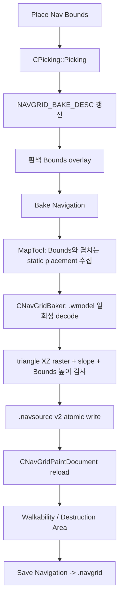

# LostArk NavBounds Picking Bake 완결 계획

## 문서 옵션

```text
C1~C8: OFF
문제 해결 ①~⑤: OFF
자료구조·알고리즘: ON
현재 상태: 컴파일 완료, 실행 완결 판정 철회, 입력·Bake UI 수정 전 보류
```

## 1. 변경 범위

이 문서가 확정하는 사용자 흐름은 하나다.

```text
Navigation > Bake
    -> Place Nav Bounds
    -> 월드 바닥 LMB Picking
    -> 흰색 Bounds 생성
    -> Position / Size / Yaw 조절
    -> Bake Navigation
    -> Bounds와 겹치는 Static Map Mesh의 삼각형 검사
    -> 높이와 Walkable/Non-walkable cell 생성
    -> Walkability에서 노란색 Non-walkable만 보정
    -> Destruction Area 작성
    -> Save Navigation
```

다음 구조는 사용하지 않는다.

```text
NAV_BAKE_ROLE
NAV_BAKE_ASSIGNMENT
CNavBakeAuthoringDocument
.navauthoring
CUL_BOX 선택을 NavBounds 생성의 필수 절차로 사용하는 UI
```

`CUL_BOX`는 원본 `LV_NAVIMESH` proxy 계열이다. NavBounds의 정본이 아니며 이번 Bake의
walkable surface 입력에서도 제외한다. Bounds는 MapTool이 소유하는 흰색 editor volume이다.

### 1.1 색상 계약

```text
흰색   NavBounds
초록   Walkable cell
노랑   Non-walkable cell: 표면 없음 / 급경사 / 수동 Block
자홍   선택한 Destruction Area
빨강   사용자가 해결해야 하는 실제 오류
```

### 1.2 실제 처리 흐름



## 2. 추가·수정·삭제 파일

| 구분 | 절대 경로 | 역할 |
|---|---|---|
| 삭제 | `C:/Users/user/Desktop/LostArk/Client/Public/NavBakeAuthoringDocument.h` | 폐기한 Role 문서의 빈 헤더 |
| 삭제 | `C:/Users/user/Desktop/LostArk/Client/Private/NavBakeAuthoringDocument.cpp` | 폐기한 Role 문서의 빈 구현 |
| 추가 | `C:/Users/user/Desktop/LostArk/Client/Public/NavGridBaker.h` | Bake 입력·결과와 단일 Bake API |
| 추가 | `C:/Users/user/Desktop/LostArk/Client/Private/NavGridBaker.cpp` | static mesh 삼각형을 grid 높이로 변환하고 source 저장 |
| 수정 | `C:/Users/user/Desktop/LostArk/Client/Public/NavGridPaintDocument.h` | Bounds/Bake 설정을 source description에 포함 |
| 수정 | `C:/Users/user/Desktop/LostArk/Client/Private/NavGridPaintDocument.cpp` | source v1 호환 load와 v2 Bounds 설정 load |
| 수정 | `C:/Users/user/Desktop/LostArk/Client/Public/MapTool.h` | Bounds placement state, Bake command, overlay 선언 |
| 수정 | `C:/Users/user/Desktop/LostArk/Client/Private/MapTool.cpp` | Picking, Bounds UI/표시, placement 수집, Bake 연결 |
| 수정 | `C:/Users/user/Desktop/LostArk/Client/Default/Client.vcxproj` | 폐기 파일 제거, Baker 등록 |
| 수정 | `C:/Users/user/Desktop/LostArk/Client/Default/Client.vcxproj.filters` | 폐기 파일 제거, Baker Map filter 등록 |

### 2.1 배치와 의존성

| 파일/클래스 | 배치 | 소유 이유 | 직접 의존 | 의존 금지 | 수명/소유자 |
|---|---|---|---|---|---|
| `CNavGridBaker` | Client | LostArk catalog/placement를 읽는 MapTool 전용 Bake 알고리즘 | Engine 공개 model decoder, Client map catalog | ImGui, runtime actor | Bake 명령의 stack |
| `CNavGridPaintDocument` | Client | `.navsource/.navpaint` authoring 정본 | filesystem, 기본 Engine 타입 | actor 이동, A* | `CMapTool` 멤버 |
| `CMapTool` | Client | LMB picking, ImGui command, overlay, 문서 연결 | catalog, placements, baker, documents | A* 내부 상태 | `CMainApp` |

Engine public header와 runtime Navigation 형식은 바꾸지 않는다. `.navgrid`는 기존
`CNavigation -> CNavGrid -> CPathFinder`가 그대로 소비한다.

## 3. 자료구조·알고리즘

### 3.1 `NAVGRID_BAKE_DESC`

```text
표현 상태: 흰색 Bounds와 Bake에 필요한 두 옵션
owner: CMapTool
writer: Place Picking, ImGui Position/Size/Yaw, source reload
reader: Bounds overlay, CNavGridBaker
불변식: size/cellSize 양수, slope [0, 90), finite 값, isReady
프레임 빈도: overlay에서 읽기, Bake 버튼에서 한 번 소비
```

최종 구조:

```cpp
struct NAVGRID_BAKE_DESC final
{
	float3_t position = {};
	float3_t size = float3_t(30.f, 10.f, 30.f);
	f32_t yawDegrees = 0.f;
	f32_t cellSize = 0.5f;
	f32_t maxSlopeDegrees = 50.f;
	bool_t isReady = false;
};
```

`maxStepHeight`는 넣지 않는다. 현재 A*의 `PATH_QUERY_DESC::fMaxStepHeight`가 이웃 cell의
높이 차이를 판정하므로 Bake 설정으로 중복 소유하지 않는다.

### 3.2 `NAVGRID_BAKE_PLACEMENT`

```text
표현 상태: Bounds와 겹쳐 Bake에 참여하는 한 static placement
owner: Bake_Navigation()의 지역 vector
writer: CMapTool::Collect_NavigationBakePlacements
reader: CNavGridBaker::Build
불변식: assetId/modelPath 유효, world는 Map rendering과 동일한 anchor 적용 결과
수명: Bake 호출 동안만 존재
```

```cpp
struct NAVGRID_BAKE_PLACEMENT final
{
	std::string assetId;
	std::filesystem::path modelPath;
	float4x4_t world = {};
};
```

### 3.3 Bake 알고리즘

입력:

```text
area ID
NAVGRID_BAKE_DESC
Bounds와 겹치는 static placement vector
```

출력:

```text
NAVGRID_AUTHORING_DESC
width * height NAV_SOURCE_CELL
placement/triangle/resolved count
```

처리:

1. Yaw가 적용된 Bounds의 world AABB로 grid origin/width/height를 계산한다.
2. cell 중심을 inverse yaw로 돌려 실제 oriented Bounds 안인지 검사한다.
3. asset ID별 `.wmodel`을 Bake 호출 중 한 번만 decode한다.
4. Loader와 같은 `0.01` pre-transform을 정점에 적용한다.
5. MapTool이 전달한 placement world matrix로 정점을 world space로 옮긴다.
6. triangle의 XZ AABB에 포함되는 cell만 순회한다.
7. barycentric 좌표로 cell 중심의 Y를 보간한다.
8. Bounds Y 범위 안의 가장 높은 표면을 cell height로 기록한다.
9. 선택된 최고 표면의 `abs(normal.y) >= cos(maxSlope)` 결과를
   `baseWalkable`로 함께 기록한다. 급경사 표면도 높이는 버리지 않는다.
10. 결과가 하나도 없으면 저장하지 않고 실패한다.

### 3.4 `NAV_SOURCE_CELL`

```text
surfaceResolved: Bounds 안 cell 중심에 투영 가능한 표면이 존재하는가
baseWalkable: 선택된 최고 표면이 Max Slope를 통과했는가
height: 선택된 최고 표면의 world Y
```

```cpp
struct NAV_SOURCE_CELL final
{
	bool_t surfaceResolved = false;
	bool_t baseWalkable = false;
	f32_t height = {};
};
```

최종 runtime walkable 식은 다음 하나다.

```cpp
surfaceResolved && baseWalkable && !manualBlocked
```

따라서 상태는 다음처럼 보인다.

| Bake 결과 | 표시 높이 | 색 | Runtime |
|---|---:|---|---|
| 표면 있음, 경사 통과 | 실제 표면 Y | 초록 | Walkable |
| 표면 있음, 급경사 | 실제 표면 Y | 노랑 | Non-walkable |
| 표면 없음 | Bounds bottom + 0.08 | 노랑 | Non-walkable |
| 수동 Block | 실제 표면 Y | 노랑 | Non-walkable |
| 회전 Bounds 밖의 직사각 grid cell | 표시하지 않음 | 없음 | Non-walkable |

복잡도:

```text
시간: decode 정점/인덱스 + 각 triangle이 덮는 cell 수의 합
공간: unique asset geometry + width * height cell
호출: Bake 버튼 1회, Update/Render에서는 호출하지 않음
최대 cell: CNavGridPaintDocument::MAX_CELL_COUNT(1,000,000)
```

실제 Valtan 기본값:

```text
Bounds 약 31 x 31.5
Cell Size 0.5
Grid 62 x 63
Cell 3,906
```

## 4. 파일별 최종 반영 코드

### 4.1 `Client/Public/NavGridPaintDocument.h`

한 문장 본질: Bake Bounds 설정, source height, 수동 blocked 상태를 소유한다.

기존 `NAVGRID_AUTHORING_DESC` 앞에 다음 구조를 추가하고 description에 포함한다.

```cpp
struct NAVGRID_BAKE_DESC final
{
	float3_t position = {};
	float3_t size = float3_t(30.f, 10.f, 30.f);
	f32_t yawDegrees = 0.f;
	f32_t cellSize = 0.5f;
	f32_t maxSlopeDegrees = 50.f;
	bool_t isReady = false;
};

struct NAVGRID_AUTHORING_DESC final
{
	std::string areaId;
	uint32_t width = {};
	uint32_t height = {};
	f32_t cellSize = {};
	f32_t originX = {};
	f32_t originZ = {};
	NAVGRID_BAKE_DESC bake;
};
```

`CNavGridPaintDocument` public query에 다음을 추가한다.

```cpp
const NAVGRID_BAKE_DESC& Get_BakeDesc() const {
	return m_Desc.bake;
}
```

### 4.2 `Client/Public/NavGridBaker.h`

한 문장 본질: MapTool이 고른 static placement를 authoring source cell로 변환한다.

신규 파일 전체:

```cpp
#pragma once

#include "Client_Defines.h"
#include "NavGridPaintDocument.h"

#include <filesystem>
#include <string>
#include <vector>

NS_BEGIN(Client)

struct NAVGRID_BAKE_PLACEMENT final
{
	std::string assetId;
	std::filesystem::path modelPath;
	float4x4_t world = {};
};

struct NAVGRID_BAKE_RESULT final
{
	NAVGRID_AUTHORING_DESC desc;
	std::vector<NAV_SOURCE_CELL> cells;
	uint32_t placementCount = {};
	uint64_t triangleCount = {};
	uint32_t resolvedCellCount = {};
};

class CNavGridBaker final
{
public:
	static bool_t Build_Desc(
		const std::string& areaId,
		const NAVGRID_BAKE_DESC& bakeDesc,
		NAVGRID_AUTHORING_DESC& outDesc,
		std::string& outStatus);

	static bool_t Build(
		const std::string& areaId,
		const NAVGRID_BAKE_DESC& bakeDesc,
		const std::vector<NAVGRID_BAKE_PLACEMENT>& placements,
		NAVGRID_BAKE_RESULT& outResult,
		std::string& outStatus);

	static bool_t Save_Source(
		const NAVGRID_BAKE_RESULT& result,
		const std::filesystem::path& path,
		std::string& outStatus);
};

NS_END
```

### 4.3 `Client/Private/NavGridBaker.cpp`

한 문장 본질: 버튼을 누른 순간에만 모델을 decode하고 triangle을 cell로 rasterize한다.

내부 함수:

```text
IsValidBakeDesc       입력 Bounds 검증
IsInsideBoundsXZ      회전된 Bounds 안 cell인지 검사
TryProjectHeight      triangle XZ barycentric 높이 계산
DecodeGeometry        asset ID당 static geometry decode
CommitTemporaryFile   검증된 source를 atomic 교체
```

최종 구현은 다음 계약을 그대로 사용한다.

```cpp
const f32_t minimumWalkableNormalY =
	std::cos(XMConvertToRadians(bakeDesc.maxSlopeDegrees));

const bool_t triangleWalkable =
	normalY + GEOMETRY_EPSILON >= minimumWalkableNormalY;
```

```cpp
if (!cell.surfaceResolved || surfaceHeight > cell.height)
{
	cell.surfaceResolved = true;
	cell.baseWalkable = triangleWalkable;
	cell.height = surfaceHeight;
}
```

전체 구현 정본은
`C:/Users/user/Desktop/LostArk/Client/Private/NavGridBaker.cpp`이며 다음 실패는 source를
교체하지 않는다.

```text
Bounds/Cell Size/Max Slope invalid
1,000,000 cell 초과
겹치는 static placement 없음
.wmodel decode 실패
triangle index/vertex invalid
Bounds 안에서 resolved surface가 하나도 없음
temporary write/atomic replace 실패
저장 직후 reload validation 실패
```

### 4.4 `Client/Private/NavGridPaintDocument.cpp`

한 문장 본질: source v1을 계속 읽으면서 v2에서는 흰색 Bounds 설정까지 복원한다.

source 계약:

```text
v1:
MAGIC 1 area width height cellSize originX originZ cellCount

v2:
MAGIC 2 area width height cellSize originX originZ
boundsPositionXYZ boundsSizeXYZ yaw maxSlope isReady cellCount
```

row는 버전에 따라 다음처럼 읽는다.

```text
v1: cellX cellZ surfaceResolved height
v2: cellX cellZ surfaceResolved baseWalkable height
```

v1의 `surfaceResolved == 1`은 호환 로드 시 `baseWalkable == true`로 승격한다.

v1은 cell을 모두 읽은 뒤 다음 값으로 Bounds를 복원한다.

```cpp
stagedDesc.bake.position.x =
	stagedDesc.originX +
	static_cast<f32_t>(stagedDesc.width) *
	stagedDesc.cellSize * 0.5f;
stagedDesc.bake.position.z =
	stagedDesc.originZ +
	static_cast<f32_t>(stagedDesc.height) *
	stagedDesc.cellSize * 0.5f;
stagedDesc.bake.size.x =
	static_cast<f32_t>(stagedDesc.width) *
	stagedDesc.cellSize;
stagedDesc.bake.size.z =
	static_cast<f32_t>(stagedDesc.height) *
	stagedDesc.cellSize;
stagedDesc.bake.cellSize = stagedDesc.cellSize;
stagedDesc.bake.maxSlopeDegrees = 50.f;
stagedDesc.bake.yawDegrees = 0.f;
stagedDesc.bake.isReady = true;
```

### 4.5 `Client/Public/MapTool.h`

한 문장 본질: Bounds 배치 상태와 Bake command를 MapTool 수명 동안 소유한다.

최종 enum:

```cpp
enum class NAVIGATION_MODE
{
	BAKE,
	WALKABILITY,
	DESTRUCTION_AREA,
};

enum class NAV_BOUNDS_STATE
{
	IDLE,
	PLACING,
};
```

기존 중첩 `NAV_BAKE_DESC`와 다음 함수는 삭제한다.

```cpp
bool_t Use_SelectedPlacementAsNavigationBounds();
```

추가 함수:

```cpp
bool_t Try_PlaceNavigationBounds();
bool_t Bake_Navigation();
bool_t Collect_NavigationBakePlacements(
	std::vector<NAVGRID_BAKE_PLACEMENT>& outPlacements,
	std::string& outStatus) const;
void Render_NavigationBakeControls();
void Render_NavigationBoundsOverlay();
bool_t Is_CellInsideNavigationBounds(
	f32_t worldX,
	f32_t worldZ) const;
static bool_t Is_ValidNavigationBakeDesc(
	const NAVGRID_BAKE_DESC& desc);
```

추가 member:

```cpp
NAV_BOUNDS_STATE m_eNavigationBoundsState =
	NAV_BOUNDS_STATE::IDLE;
NAVGRID_BAKE_DESC m_NavigationBakeDesc;
std::string m_NavigationBakeStatus = "Create Nav Bounds";
bool_t m_bNavigationBakeResetConfirmed = false;
bool_t m_bNavigationBakeResetPending = false;
```

### 4.6 `Client/Private/MapTool.cpp`

한 문장 본질: ImGui는 command만 전달하고 Picking/Bake handler가 실제 상태를 변경한다.

Bake mode의 `Update()` 입력:

```cpp
if (TOOL_MODE::NAVIGATION == m_eToolMode)
{
	if (NAVIGATION_MODE::BAKE == m_eNavigationMode)
	{
		m_bNavigationStrokeActive = false;
		if (NAV_BOUNDS_STATE::PLACING ==
				m_eNavigationBoundsState &&
			mousePressed && canUseWorldMouse)
		{
			Try_PlaceNavigationBounds();
		}
		return;
	}

	if (!mouseDown || !canUseWorldMouse)
	{
		m_bNavigationStrokeActive = false;
		return;
	}

	if (mousePressed)
		m_bNavigationStrokeActive = true;

	if (m_bNavigationStrokeActive)
		Try_PaintNavigation();
	return;
}
```

Picking:

```cpp
bool_t Client::CMapTool::Try_PlaceNavigationBounds()
{
	float4_t picked{};
	if (!CGameInstance::Get().Picking(picked))
	{
		m_NavigationBakeStatus =
			"Pick a rendered map surface";
		return false;
	}

	m_NavigationBakeDesc.position =
		float3_t(
			picked.x,
			picked.y +
				m_NavigationBakeDesc.size.y * 0.5f,
			picked.z);
	m_NavigationBakeDesc.isReady = true;
	m_eNavigationBoundsState = NAV_BOUNDS_STATE::IDLE;
	m_NavigationBakeStatus =
		"Nav Bounds placed";
	return true;
}
```

Bake 대상 수집 규칙:

```text
visible placement
Deferred static map asset
Bounds world AABB와 placement world sphere가 겹침
groupLabel != LV_NAVIMESH
```

Render 분기:

```cpp
if (isAssetTest &&
	TOOL_MODE::NAVIGATION == m_eToolMode)
{
	if (NAVIGATION_MODE::BAKE == m_eNavigationMode)
		Render_NavigationBoundsOverlay();
	else
		Render_NavigationOverlay();
}
```

ImGui 기본 화면:

```text
[Place Nav Bounds]
Position
Yaw
Size
Cell Size
Max Slope
[Bake Navigation]
한 줄 상태
```

grid layout이 달라지고 기존 paint/region이 있으면 `Bake` 첫 호출은 파일을 건드리지 않고
확인 상태로 전환한다.

```text
Rebuild Navigation?
Bounds or Cell Size changed.
Existing walkability corrections and destruction areas will be cleared.
[Confirm Reset and Rebake]
```

확인 후에도 바로 기존 파일을 덮지 않는다.

```text
1. source/paint/blocker를 .bakebak으로 복사
2. 새 source를 .tmp -> atomic replace
3. layout 변경이면 호환되지 않는 paint/blocker 제거
4. CNavGridPaintDocument + CNavRuntimeBlockerDocument reload
5. reload 성공이면 backup 제거
6. 실패면 세 파일 복원 후 이전 문서 reload
```

`Bake`는 `.navsource`만 갱신한다. `.navgrid`는 기존 `Save Navigation`을 눌렀을 때만
export하므로, Bake 실패나 단순 Bounds 편집이 runtime pathfinding 파일을 바꾸지 않는다.

## 5. 프로젝트 등록

삭제:

```xml
<ClInclude Include="..\Public\NavBakeAuthoringDocument.h" />
<ClCompile Include="..\Private\NavBakeAuthoringDocument.cpp" />
```

```xml
<ClInclude Include="..\Public\NavBakeAuthoringDocument.h">
  <Filter>02.GameObjects\02. World\Map</Filter>
</ClInclude>
<ClCompile Include="..\Private\NavBakeAuthoringDocument.cpp">
  <Filter>02.GameObjects\02. World\Map</Filter>
</ClCompile>
```

추가:

```xml
<!-- Client/Default/Client.vcxproj -->
<ClInclude Include="..\Public\NavGridBaker.h" />
<ClCompile Include="..\Private\NavGridBaker.cpp" />
```

```xml
<!-- Client/Default/Client.vcxproj.filters -->
<ClInclude Include="..\Public\NavGridBaker.h">
  <Filter>03. Tools\00. Map</Filter>
</ClInclude>
<ClCompile Include="..\Private\NavGridBaker.cpp">
  <Filter>03. Tools\00. Map</Filter>
</ClCompile>
```

## 6. 적용 순서와 검증

1. 빈 `NavBakeAuthoringDocument` 두 파일과 XML 등록만 제거한다.
2. `NavGridPaintDocument`에 Bake description과 source v2 호환을 추가한다.
3. `NavGridBaker`를 추가하고 프로젝트에 등록한다.
4. `MapTool`의 현재 빈 NavBounds 함수들을 실제 Picking/UI/overlay/Bake 구현으로 교체한다.
5. CUL_BOX 선택 함수와 버튼이 남지 않았는지 검색한다.
6. `git diff --check`와 프로젝트 XML parse를 수행한다.
7. Client Debug를 빌드한다. Engine public 변경이 없으므로 Engine/UpdateLib은 필수가 아니다.
8. 팀 완료 게이트를 위해 기존 dirty Engine도 포함한 전체 Debug/Release 순서 빌드를 수행한다.

빌드:

```text
1. Engine x64 Debug
2. UpdateLib.bat Debug
3. Client x64 Debug
4. Engine x64 Release
5. UpdateLib.bat Release
6. Client x64 Release
```

실행:

```text
F2 AssetTest
F1 MapTool
Navigation > Bake
Place Nav Bounds
아레나 바닥 LMB
흰색 Bounds 확인
Position/Size/Yaw 조절
Bake Navigation
Walkability에서 초록/노랑 확인
Save Navigation
재진입 후 Character 좌클릭 path 확인
```

실행 완료 조건:

- ImGui 위에서 누른 LMB는 Bounds를 배치하지 않는다.
- Escape, tool/level 이탈은 placement를 취소한다.
- Bake 중에만 `.wmodel` decode가 실행된다.
- 회전 Bounds를 감싸는 직사각 grid는 생성되지만, oriented Bounds 밖 cell은
  `surfaceResolved=false`이며 표시하지 않고 runtime non-walkable이다.
- `LV_NAVIMESH`/CUL_BOX는 walkable surface로 사용되지 않는다.
- Bake 실패 시 기존 source와 runtime grid를 유지한다.
- layout 변경은 확인 후 paint/blocker를 초기화한다.
- Save 후 재진입했을 때 Bounds와 Cell 결과가 복원된다.
- Character와 Valtan은 기존 `CNavigation/CNavPathFollower` 경로를 그대로 사용한다.

## 7. 실제 반영 및 컴파일 검증 결과

반영 완료:

```text
NavBakeAuthoringDocument.h/.cpp와 프로젝트 등록 제거
NavGridBaker.h/.cpp 추가 및 Map filter 등록
NAV_SOURCE_CELL을 surfaceResolved/baseWalkable/height로 분리
.navsource v1 호환 load + v2 load/save
Navigation > Bake mode, LMB Bounds placement, 흰색 OBB overlay
visible deferred static placement 수집
LV_NAVIMESH/CUL_BOX walkable 입력 제외
triangle raster, 최고 표면, slope 판정
no-surface/급경사/수동 block 노란 overlay
layout 변경 확인과 source/paint/blocker rollback
Save Navigation의 기존 .navgrid export 유지
```

실행하지 않고 다음 순서의 컴파일·링크만 검증했다.

```text
[PASS] Engine x64 Debug
[PASS] UpdateLib.bat Debug
[PASS] Client x64 Debug -> Client/Bin/Debug/Client.exe
[PASS] Engine x64 Release
[PASS] UpdateLib.bat Release
[PASS] Client x64 Release -> Client/Bin/Release/Client.exe
```

빌드에는 기존 CP949 `C4819`, 수치 변환 `C4244`, ThirdParty PDB `LNK4099` 경고가
남아 있지만 오류는 0개다. 사용자 요청에 따라 `Client.exe` 실행, ImGui 조작, 실제 Bake,
파일 저장/재로드 검증은 수행하지 않았다. 다음 단계는 실행 화면을 보면서 Bounds,
Cell Size, Max Slope를 튜닝하는 것이다.

## 8. 실행 실측과 독립 비평 반영

### 8.1 완결 판정 철회 근거

2026-07-31 첫 실행 화면을 기준으로 기존의 “반영 완료”는 컴파일 완료만 의미한다.
사용자가 실제로 조작하는 authoring 수직 흐름은 아직 완료가 아니다.

```text
확인됨:
기존 source에서 복원한 흰색 Bounds 표시
Position / Size / Yaw ImGui 편집

확인되지 않음:
Place command click -> 월드 Picking -> Bounds 중심 갱신
Navigation 편집 중 카메라 조작
Bake command가 Bake_Navigation까지 도달
.navsource v2 저장
Walkability 자동 전환
Save Navigation과 재진입 복원
```

실제 데이터는 새 Bake가 성공한 적이 없음을 보여준다.

```text
현재 ValtanArena.navsource header
LOSTARK_NAVGRID_SOURCE 1 ...

CNavGridBaker::Save_Source가 쓰는 version
LOSTARK_NAVGRID_SOURCE 2 ...
```

따라서 현재 초록·노랑 Cell은 새 authoring Bake 결과가 아니다. Bake mode에서 MapTool은
흰 Bounds만 그린다. 화면의 초록·노랑은 F5로 켜진 기존 runtime `.navgrid` debug다.

```text
흰색 Bounds     현재 편집 중인 authoring volume
초록/노랑 Grid  Level 진입 때 이미 로드한 기존 runtime .navgrid
```

### 8.2 독립 비평 결론

세 관점의 비평을 적용한다.

| 관점 | 발견한 결함 | 계획 반영 |
|---|---|---|
| 입력 소유권 | Navigation mode 전체가 마우스를 독점하여 Camera delta까지 0이 됨 | LMB 편집과 RMB camera를 분리 |
| Bake 호출 | mode `RadioButton("Bake")`와 command `Button("Bake")`의 ImGui ID 충돌 | 표시 이름과 내부 ID를 분리 |
| 사용자 흐름 | compile 결과만 있고 click, file, reload 증거가 없음 | 단계별 실행 gate를 추가 |

ImGui는 같은 window와 ID stack에서 label로 ID를 만든다. 현재 두 widget은 같은 `"Bake"`를
사용한다.

```text
Render_NavigationPanel
    RadioButton("Bake")

Render_NavigationBakeControls
    Button("Bake")
```

아래 command button이 mouse active ID를 잡아도 다음 frame에 먼저 그려지는 위
radio button이 같은 ID를 처리할 수 있다. 이 경우 `Bake_Navigation()`은 호출되지 않고
상태 문자열도 계속 `Needs Bake`로 남는다.

### 8.3 이번 안정화 단계의 최종 조작 계약

```text
Tool 창 클릭             ImGui만 소비
Game View RMB drag       AssetTest Camera 회전
Game View WASD           AssetTest Camera 이동
Game View LMB            Nav Bounds 배치 또는 Cell paint
Esc                      진행 중인 배치 취소
Tab                      기존 Free Camera 이동 잠금 toggle
F5                       저장되어 Level에 로드된 runtime grid 표시
```

LMB 편집 중에는 Character click move와 Camera rotation이 동시에 발생하면 안 된다.
RMB camera 중에는 MapTool paint가 발생하면 안 된다.

### 8.4 수정 파일

| 구분 | 절대 경로 | 역할 |
|---|---|---|
| 수정 | `C:/Users/user/Desktop/LostArk/Client/Public/Camera_Free.h` | AssetTest에서만 RMB look을 선택할 desc |
| 수정 | `C:/Users/user/Desktop/LostArk/Client/Private/Camera_Free.cpp` | RMB가 눌린 동안만 AssetTest camera 회전 |
| 수정 | `C:/Users/user/Desktop/LostArk/Client/Private/Level_AssetTest.cpp` | AssetTest camera에 RMB look 설정 |
| 수정 | `C:/Users/user/Desktop/LostArk/Client/Public/NavGridPaintDocument.h` | legacy/v2 source 상태 읽기 |
| 수정 | `C:/Users/user/Desktop/LostArk/Client/Private/NavGridPaintDocument.cpp` | source version을 load commit 상태로 보관 |
| 수정 | `C:/Users/user/Desktop/LostArk/Client/Public/MapTool.h` | deferred Bake request 상태 |
| 수정 | `C:/Users/user/Desktop/LostArk/Client/Private/MapTool.cpp` | 입력 범위 축소, ImGui ID 분리, Bake request와 authoring/runtime 분리 |

`MainApp.cpp`의 입력 중재 위치와 Engine `CInput_Device`는 수정하지 않는다.
`ConsumesWorldMouse()`가 mode 소유 여부가 아니라 이번 frame의 실제 LMB 소비 여부를
반환하도록 계약만 바로잡는다.

새 파일이 없으므로 `.vcxproj`와 `.vcxproj.filters` 변경도 없다.

이번 Section 8이 실행 피드백을 반영한 최신 정본이다. 앞 절과 다른 내용이 있으면
Section 8을 따른다. 특히 Bake validation은 Character Navigation이나 runtime blocker
등록 성공에 의존하지 않는다.

### 8.5 최종 반영 코드

#### `Client/Public/Camera_Free.h`

`CAMERA_FREE_DESC`와 private member의 최종 변경 블록:

```cpp
typedef struct tagCameraFreeDesc : public CCamera::CAMERA_DESC
{
	f32_t fMouseSensor;
	shared_ptr<CTransform> pFollowTarget = { nullptr };
	float3_t vFollowOffset = { -12.f, 16.f, -12.f };
	float3_t vLookOffset = { 0.f, 1.2f, 0.f };
	bool_t isFollowEnabled = { false };
	bool_t isRightMouseLook = { false };
} CAMERA_FREE_DESC;
```

```cpp
private:
	f32_t m_fMouseSensor = {};
	bool_t m_bMovementLocked = false;
	bool_t m_bTabDown = false;
	bool_t m_bFollowEnabled = false;
	bool_t m_bF6Down = false;
	bool_t m_bRightMouseLook = false;
	weak_ptr<CTransform> m_pFollowTarget;
	float3_t m_vFollowOffset = {};
	float3_t m_vLookOffset = {};
```

기본값은 `false`이므로 Gameplay 등 기존 `CCamera_Free` 사용처의 동작은 바꾸지 않는다.

#### `Client/Private/Camera_Free.cpp`

`Initialize()`에 다음 대입을 추가한다.

```cpp
m_bRightMouseLook = pDesc->isRightMouseLook;
```

`Priority_Update()`의 mouse rotation 블록 전체를 다음으로 교체한다.

```cpp
const bool_t canRotate =
	!m_bMovementLocked &&
	(!m_bRightMouseLook ||
		0 != (CGameInstance::Get().Get_DIMouseState(DIM::RB) & 0x80));

int32_t mouseMove = {};
if (canRotate &&
	(mouseMove = CGameInstance::Get().Get_DIMouseMove(DIMM::X)))
{
	m_pTransformCom->Turn(
		XMVectorSet(0.f, 1.f, 0.f, 0.f),
		m_fMouseSensor * mouseMove * fTimeDelta);
}

if (canRotate &&
	(mouseMove = CGameInstance::Get().Get_DIMouseMove(DIMM::Y)))
{
	m_pTransformCom->Turn(
		m_pTransformCom->Get_State(STATE::RIGHT),
		m_fMouseSensor * mouseMove * fTimeDelta);
}
```

#### `Client/Private/Level_AssetTest.cpp`

`Ready_Layer_Camera()`의 desc 설정에 다음 한 줄을 추가한다.

```cpp
CameraDesc.fMouseSensor = 0.1f;
CameraDesc.isRightMouseLook = true;
```

#### `Client/Public/NavGridPaintDocument.h`

legacy source에서 합성한 Bounds와 실제 v2 Bake 결과를 UI가 구분할 수 있게 read-only 상태를
추가한다.

```cpp
bool_t Is_LegacySource() const { return m_isLegacySource; }
```

```cpp
bool_t m_isReady = false;
bool_t m_isDirty = false;
bool_t m_isLegacySource = false;
```

#### `Client/Private/NavGridPaintDocument.cpp`

`Load()`의 최종 commit 블록에 source version 상태를 함께 반영한다.

```cpp
m_Desc = std::move(stagedDesc);
m_SourceCells = std::move(stagedSourceCells);
m_BlockedCells = std::move(stagedBlockedCells);
m_isReady = true;
m_isDirty = false;
m_isLegacySource =
	LEGACY_SOURCE_VERSION == sourceVersion;
```

#### `Client/Public/MapTool.h`

private function 선언:

```cpp
void Execute_NavigationBakeRequest();
```

Bake state member:

```cpp
NAVGRID_BAKE_DESC m_NavigationBakeDesc;
std::string m_NavigationBakeStatus = "Create Nav Bounds";
bool_t m_bNavigationBakeRequested = false;
bool_t m_bNavigationBakeResetConfirmed = false;
bool_t m_bNavigationBakeResetPending = false;
uint32_t m_iNavigationBakeAttempt = {};
```

#### `Client/Private/MapTool.cpp`

`<chrono>` include를 추가한다.

```cpp
#include <chrono>
```

`Update()`에서 open/level 검증과 Escape 처리 뒤, world mouse 분기 전에 다음을 추가한다.
ImGui command가 그려진 frame에는 `Bake queued`가 표시되고 실제 동기 Bake는 다음
Update에서 한 번만 실행된다.

```cpp
if (m_bNavigationBakeRequested)
{
	Execute_NavigationBakeRequest();
	return;
}
```

`Toggle()`은 Tool을 닫을 때 다음 frame으로 넘긴 command를 취소한다.

```cpp
void Client::CMapTool::Toggle()
{
	m_bOpen = !m_bOpen;
	if (!m_bOpen)
	{
		m_bNavigationBakeRequested = false;
		m_bNavigationBakeResetConfirmed = false;
		m_bNavigationBakeResetPending = false;
		m_NavigationBakeStatus =
			"Bake cancelled because MapTool closed";
	}
}
```

`Handle_LevelTransition(false)`의 상태 정리에도 다음을 추가한다.

```cpp
m_bNavigationBakeRequested = false;
m_bNavigationBakeResetConfirmed = false;
m_bNavigationBakeResetPending = false;
```

Tool 종료나 AssetTest 이탈 뒤 재진입해도 오래된 queued Bake가 자동 실행되지 않는다.

`ConsumesWorldMouse()` 전체를 교체한다.

```cpp
bool_t Client::CMapTool::ConsumesWorldMouse() const
{
	if (!m_bOpen ||
		ETOUI(LEVEL::ASSET_TEST) !=
			CGameInstance::Get().Get_CurrentLevelID() ||
		GetForegroundWindow() != g_hWnd)
	{
		return false;
	}

	const bool_t hasWorldLeftCommand =
		TOOL_MODE::NAVIGATION == m_eToolMode ||
		PLACEMENT_STATE::ARMED == m_ePlacementState;
	const bool_t isLeftMouseDown =
		0 != (GetAsyncKeyState(VK_LBUTTON) & 0x8000);

	return hasWorldLeftCommand && isLeftMouseDown;
}
```

`Execute_NavigationBakeRequest()`를 `Bake_Navigation()` 앞에 추가한다.

```cpp
void Client::CMapTool::Execute_NavigationBakeRequest()
{
	if (!m_bNavigationBakeRequested)
		return;

	m_bNavigationBakeRequested = false;
	++m_iNavigationBakeAttempt;
	const auto startedAt = std::chrono::steady_clock::now();
	m_NavigationBakeStatus =
		"Bake attempt " +
		std::to_string(m_iNavigationBakeAttempt) +
		" running";

	const bool_t succeeded = Bake_Navigation();
	const auto finishedAt = std::chrono::steady_clock::now();
	const auto elapsedMilliseconds =
		std::chrono::duration_cast<std::chrono::milliseconds>(
			finishedAt - startedAt).count();
	const std::string result = m_NavigationBakeStatus;
	const std::string summary =
		"Bake attempt " +
		std::to_string(m_iNavigationBakeAttempt) +
		(succeeded ? " succeeded in " : " stopped in ") +
		std::to_string(elapsedMilliseconds) +
		" ms: " +
		result;

	m_NavigationBakeStatus = summary;
	if (succeeded)
		m_NavigationStatus = summary;
}
```

`Render_NavigationPanel()`의 mode radio ID를 교체하고 조작 안내를 추가한다.

```cpp
ImGui::TextDisabled(
	"Game View: RMB drag Look | WASD Move | LMB Place/Paint | Esc Cancel | F5 Runtime Grid");

if (GetForegroundWindow() != g_hWnd)
	ImGui::TextDisabled(
		"Click the game viewport before using camera controls.");

if (ImGui::RadioButton(
	"Bake##NavigationMode",
	NAVIGATION_MODE::BAKE == m_eNavigationMode))
{
	m_eNavigationMode = NAVIGATION_MODE::BAKE;
	m_bNavigationStrokeActive = false;
}
```

`Render_NavigationBakeControls()`의 command와 reset 확인 블록을 교체한다.

```cpp
ImGui::BeginDisabled(
	m_bNavigationBakeRequested ||
	!Is_ValidNavigationBakeDesc(m_NavigationBakeDesc) ||
	NAV_BOUNDS_STATE::PLACING == m_eNavigationBoundsState);
if (ImGui::Button(
	"Bake Navigation##ExecuteNavigationBake"))
{
	m_bNavigationBakeResetConfirmed = false;
	m_bNavigationBakeResetPending = false;
	m_bNavigationBakeRequested = true;
	m_NavigationBakeStatus = "Bake queued";
}
ImGui::EndDisabled();

if (m_bNavigationBakeResetPending)
	ImGui::OpenPopup(
		"Reset Navigation Authoring?##NavigationBakeReset");

if (ImGui::BeginPopupModal(
	"Reset Navigation Authoring?##NavigationBakeReset",
	nullptr,
	ImGuiWindowFlags_AlwaysAutoResize))
{
	ImGui::TextUnformatted(
		"Grid coordinates changed.");
	ImGui::TextUnformatted(
		"Existing Walkability paint and Destruction Areas must be reset.");

	if (ImGui::Button(
		"Reset and Rebake##ConfirmNavigationBakeReset"))
	{
		m_bNavigationBakeResetConfirmed = true;
		m_bNavigationBakeResetPending = false;
		m_bNavigationBakeRequested = true;
		m_NavigationBakeStatus = "Confirmed rebake queued";
		ImGui::CloseCurrentPopup();
	}

	ImGui::SameLine();
	if (ImGui::Button(
		"Cancel##CancelNavigationBakeReset"))
	{
		m_bNavigationBakeResetConfirmed = false;
		m_bNavigationBakeResetPending = false;
		m_NavigationBakeStatus =
			"Rebake cancelled; existing files were preserved";
		ImGui::CloseCurrentPopup();
	}

	ImGui::EndPopup();
}

ImGui::TextWrapped(
	"%s",
	m_NavigationBakeStatus.c_str());
ImGui::TextDisabled(
	"White: authoring Bounds | F5 colored cells: currently loaded runtime grid");
```

비동기 worker는 이번 단계에 넣지 않는다. `CModelDecoderRegistry`, catalog와 placement
접근의 thread-safety가 확인되지 않았고, 우선 실제 elapsed time을 측정해야 하기 때문이다.

### 8.6 적용 Phase

```text
Phase 0A: 입력과 command 도달
1. AssetTest camera를 RMB look으로 설정
2. MapTool mouse 소비를 실제 LMB frame으로 축소
3. Bake radio/button ID 분리
4. 조작 안내 표시

Phase 0B: Bake 관찰 가능성
5. Button click을 queued state로 저장
6. 다음 Update에서 attempt를 정확히 한 번 실행
7. reset을 modal로 확인
8. elapsed time과 최종 status 표시

Phase 0C: authoring 수직 흐름
9. Bake 성공 후 Walkability 자동 전환
10. Cell 보정
11. Save Navigation
12. Level 재진입 후 runtime grid 확인

보류:
runtime blocker controller
Valtan collapse pattern 연결
비동기 Bake
geometry cache 최적화
```

### 8.7 빌드와 실행 완료 Gate

코드 반영 후 빌드는 Client Debug/Release를 우선 수행한다. Engine public 계약 변경은
없으므로 이 안정화 단계만으로 `UpdateLib.bat`은 필요하지 않다. 다만 최종 Navigation
완료 gate에서는 팀 공통 전체 순서를 다시 수행한다.

실행 전에 현재 네 파일의 hash와 수정 시각을 기록한다.

```text
ValtanArena.navsource
ValtanArena.navpaint
ValtanArena.navblockers
ValtanArena.navgrid
```

실행 검증:

```text
1. Navigation 탭에서 RMB drag camera 회전
2. WASD 이동
3. LMB Bounds 배치 중 camera와 Character가 움직이지 않음
4. Pick/Reposition 후 Position 값과 흰 Bounds 중심이 같은 지점으로 변경
5. Position/Size/Yaw 수정 즉시 흰 Bounds 갱신, 상태는 Needs Bake
6. Bake Navigation 클릭 시 attempt가 정확히 1 증가
7. 현재 변경 Bounds에서는 reset modal 표시
8. Cancel 시 네 파일의 hash와 mtime 불변
9. Confirm 후 Bake 실행 결과와 elapsed time 표시
10. 성공 후 Walkability 자동 전환
11. 성공 후 navsource header version == 2
12. resolved surface cell count가 0보다 큼
13. Walkability LMB Block은 초록->노랑, Erase는 노랑->초록
14. Cell 변경 직후 Unsaved 표시
15. Save Navigation 전 navgrid hash 불변
16. Save Navigation 후 navpaint/navgrid가 함께 변경
17. 강제 export 실패 시 navpaint/navgrid가 둘 다 이전 hash로 rollback
18. Level 재진입 후 painted cell과 F5 runtime grid가 저장 결과와 일치
19. Character 좌클릭 path가 저장된 walkability를 사용
20. 알려진 빈 좌표의 작은 Bounds Bake 실패에서 기존 파일 보존
21. Bake queued 직후 F1 close 또는 Level 이탈 후 재진입해도 Bake가 실행되지 않음
22. MapTool을 닫거나 다른 Level에서 기존 Free Camera 동작 회귀 없음
```

이 gate가 모두 통과하기 전에는 NavBounds/Bake를 완료로 표시하지 않고 runtime Navigation
구현도 시작하지 않는다.

### 8.8 Authoring Bake와 runtime blocker 분리

세 번째 독립 비평에서 Bake 성공 직전의 재로드가 다음 runtime 경로까지 실행하는 결합을
확인했다.

```text
Bake_Navigation
    -> Load_NavigationDocument
        -> Load_RuntimeBlockers
            -> Register_RuntimeBlockers
                -> Layer_Player / Com_Navigation 탐색
```

이 구조에서는 새 `.navsource`가 정상이어도 Character의 `Com_Navigation` 조회나 runtime
blocker 등록이 실패하면 Bake validation 실패로 취급하고 source를 rollback한다.
MapTool authoring Bake가 runtime actor 존재 여부에 의존하는 것은 잘못이다.

최종 경계는 다음과 같다.

```text
현재 authoring 완료 gate
    Load .navsource / .navpaint
    Bake .navsource
    Edit Walkability
    Save .navpaint / .navgrid

후속 runtime Navigation
    Load .navblockers
    Register regions into shared CNavGrid
    Set runtime condition
```

`Client/Public/MapTool.h`에서 다음 runtime 적용 선언을 제거한다.

```cpp
bool_t Load_RuntimeBlockers();
bool_t Register_RuntimeBlockers();
bool_t Set_NavigationCondition(
	const std::string& conditionId,
	bool_t value);
```

`m_NavigationConditions`도 제거한다.

```cpp
std::unordered_map<std::string, bool_t> m_NavigationConditions;
```

이 제거 후 `MapTool.h`에서는 `<unordered_map>` include도 제거한다. `MapTool.cpp` 내부의
지역 cache들은 계속 `unordered_map`을 사용하므로 CPP include는 유지한다.

`Set_DeployPhase()`는 DeployProp visual state만 바꾸도록 되돌린다.

```cpp
void Client::CMapTool::Set_DeployPhase(
	DEPLOY_PROP_STATE state)
{
	m_DeployPhase = state;
	for (DEPLOY_ENTRY& entry : m_DeployProps)
		entry.object->Set_State(state);
}
```

`Render_DestructionAreaControls()` 끝의 `CollapsingHeader("Test")` 블록도 삭제한다.
MapTool preview가 runtime Navigation condition을 바꾸는 경로는 남기지 않는다.

이번 P1~P5에서는 `.navblockers`를 load/save/edit하지 않는다. 기존 파일은 grid 좌표가
그대로면 보존하고, 좌표가 바뀐 Bake를 사용자가 확인했을 때만 기존 Bake rollback
대상에 포함해 제거한다. Destruction Area authoring은 후속 Phase에서 controller 계약과
함께 다시 연다.

`Bake_Navigation()`의 layout reset preflight는 blocker document를 load하지 않고 파일
존재만 확인한다. 이 파일은 cell index 좌표에 의존하므로 grid 좌표가 바뀌면 빈 문서라도
확인 후 함께 reset한다.

```cpp
std::error_code blockerExistsError;
const bool_t hasDependentBlockerFile =
	std::filesystem::exists(
		m_RuntimeBlockerPath,
		blockerExistsError);
if (blockerExistsError)
{
	m_NavigationBakeStatus =
		"Could not inspect dependent runtime blocker file";
	return false;
}

const bool_t hasAuthoredCells =
	hasCurrentNavigation &&
	(0 != m_NavigationDocument.Get_BlockedCount() ||
		hasDependentBlockerFile);
```

`Load_NavigationDocument()`은 source/paint만 읽는다.

```cpp
bool_t Client::CMapTool::Load_NavigationDocument()
{
	const std::filesystem::path root = GetNavigationDataRoot();
	if (root.empty())
	{
		m_NavigationStatus = "Navigation data is unavailable";
		return false;
	}

	m_NavigationSourcePath = root / L"ValtanArena.navsource";
	m_NavigationPaintPath = root / L"ValtanArena.navpaint";
	m_NavigationRuntimePath = root / L"ValtanArena.navgrid";
	m_RuntimeBlockerPath = root / L"ValtanArena.navblockers";

	if (!m_NavigationDocument.Load(
		m_NavigationSourcePath,
		m_NavigationPaintPath,
		m_NavigationStatus))
	{
		return false;
	}

	m_NavigationBakeDesc =
		m_NavigationDocument.Get_BakeDesc();
	m_NavigationBakeStatus =
		m_NavigationDocument.Is_LegacySource() ?
		"Loaded legacy source Bounds; Bake is required" :
		"Loaded baked v2 source";
	m_bNavigationBakeResetConfirmed = false;

	m_NavigationStatus = "Saved";
	return true;
}
```

`Save_Navigation()`의 현재 저장 대상은 `.navpaint`와 `.navgrid` 두 개뿐이다. 두 파일을
각각 atomic write하는 것만으로는 중간 실패 시 서로 다른 세대가 될 수 있으므로,
기존 Bake의 backup/restore 패턴을 동일하게 적용한다.

```cpp
bool_t Client::CMapTool::Save_Navigation()
{
	if (!m_NavigationDocument.Is_Ready())
	{
		m_NavigationStatus = "Navigation source is not loaded";
		return false;
	}

	const std::array<std::filesystem::path, 2> paths =
	{
		m_NavigationPaintPath,
		m_NavigationRuntimePath,
	};
	std::array<std::filesystem::path, 2> backups;
	std::array<bool_t, 2> existed = {};

	for (size_t index = 0; index < paths.size(); ++index)
	{
		backups[index] = paths[index];
		backups[index] += L".savebak";
	}

	auto cleanup = [&]()
	{
		for (const std::filesystem::path& backup : backups)
		{
			std::error_code error;
			std::filesystem::remove(backup, error);
		}
	};

	for (size_t index = 0; index < paths.size(); ++index)
	{
		std::error_code error;
		std::filesystem::remove(backups[index], error);
		error.clear();
		existed[index] = std::filesystem::exists(paths[index], error);
		if (error)
		{
			cleanup();
			m_NavigationStatus =
				"Could not inspect existing navigation output";
			return false;
		}

		if (existed[index])
		{
			std::filesystem::copy_file(
				paths[index],
				backups[index],
				std::filesystem::copy_options::overwrite_existing,
				error);
			if (error)
			{
				cleanup();
				m_NavigationStatus =
					"Could not back up navigation output";
				return false;
			}
		}
	}

	auto restore = [&]()
	{
		bool_t restored = true;
		for (size_t index = 0; index < paths.size(); ++index)
		{
			std::error_code error;
			if (existed[index])
			{
				std::filesystem::copy_file(
					backups[index],
					paths[index],
					std::filesystem::copy_options::overwrite_existing,
					error);
			}
			else
			{
				std::filesystem::remove(paths[index], error);
			}
			restored = !error && restored;
		}
		return restored;
	};

	std::string status;
	if (!m_NavigationDocument.Save_Paint(
		m_NavigationPaintPath,
		status))
	{
		const bool_t restored = restore();
		cleanup();
		m_NavigationStatus = restored ?
			status :
			"Save Paint failed and rollback failed";
		return false;
	}

	if (!m_NavigationDocument.Export_Runtime(
		m_NavigationRuntimePath,
		status))
	{
		const bool_t restored = restore();
		cleanup();
		m_NavigationStatus = restored ?
			status :
			"Runtime export failed and rollback failed";
		return false;
	}

	cleanup();
	m_NavigationStatus =
		"Saved. Re-enter ASSET_TEST to reload runtime navigation.";
	return true;
}
```

현재 Navigation mode는 Bake와 Walkability만 활성화한다.

```text
Bake               항상 표시
Walkability        Navigation source ready면 사용
Destruction Area   P1~P5 완료 전 disabled
```

Destruction Area와 runtime condition Test UI는 현재 단계에서 비활성화한다. 후속 단계에서도
MapTool이 Character Navigation에 직접 등록하지 않는다. Level 수명의 runtime controller가
등록과 condition 적용을 담당한다.

`Render_NavigationPanel()`의 mode readiness 블록은 다음으로 교체한다.

```cpp
const bool_t navigationReady =
	m_NavigationDocument.Is_Ready();

ImGui::SameLine();
ImGui::BeginDisabled(!navigationReady);
if (ImGui::RadioButton(
	"Walkability##NavigationMode",
	NAVIGATION_MODE::WALKABILITY == m_eNavigationMode))
{
	m_eNavigationMode = NAVIGATION_MODE::WALKABILITY;
	m_eNavigationEditAction =
		NAVIGATION_EDIT_ACTION::APPLY;
}
ImGui::EndDisabled();

ImGui::SameLine();
ImGui::BeginDisabled();
ImGui::RadioButton(
	"Destruction Area##NavigationMode",
	false);
ImGui::EndDisabled();
```

아래 source unavailable 분기도 같은 `navigationReady`만 검사한다. Destruction Area 관련
render와 paint 분기는 현재 mode로 진입할 수 없으므로 실행되지 않는다.

`Render_NavigationBakeControls()`의 첫 command 이름도 실제 동작에 맞춘다. 이 command는
항상 새 volume을 만드는 것이 아니라 현재 size/yaw를 유지한 채 Bounds 중심을 다시
Picking한다.

```cpp
if (ImGui::Button(
	"Pick / Reposition Bounds Center##PickNavigationBoundsCenter"))
{
	m_eNavigationBoundsState = NAV_BOUNDS_STATE::PLACING;
	m_bNavigationBakeResetConfirmed = false;
	m_bNavigationBakeResetPending = false;
	m_NavigationBakeStatus =
		"Click a rendered floor to reposition Nav Bounds";
}
```

### 8.9 최종 우선순위

```text
P1 RMB Camera / LMB authoring 입력 분리
P2 Bounds loaded / modified / baked 상태와 조작 안내
P3 Bake ImGui ID 충돌 제거와 queued/attempt/duration 증거
P4 Bake 재로드에서 Character/runtime blocker 의존 제거
P5 .navsource v2 -> Walkability -> Save -> 재진입 검증

위 단계 완료 후:
Destruction Area authoring
runtime blocker controller
Valtan arena collapse condition
```
