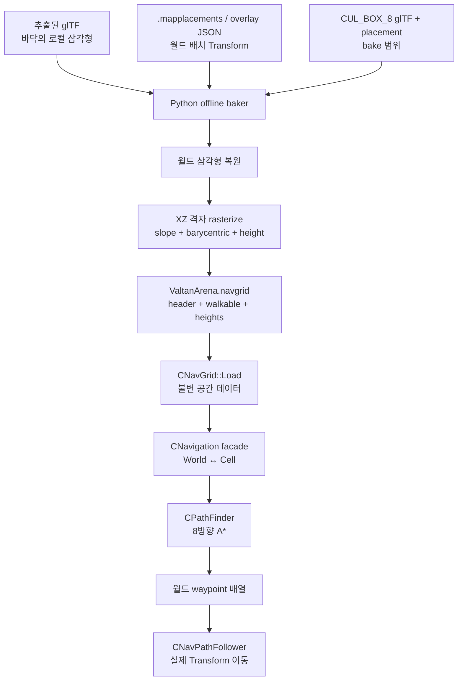

# LostArk NavGrid Baker 원리·검증·면접 설명 훈련 계획서

> 작성일: 2026-07-31
>
> 상태: 현재 코드 실측 완료, 이해·검증 훈련 기준 확정
>
> 대상: `build_valtan_navgrid.py` → `ValtanArena.navgrid` → `CNavGrid` → `CNavigation` → `CPathFinder`
>
> 변경 범위: 설명과 검증 계획만 다룬다. 이 문서 작성으로 C++·Python·프로젝트 파일은 변경하지 않는다.

## 1. 훈련 목표와 완료 기준

### 1.1 이 기능의 본질

이 프로젝트의 `.py`는 게임이 실행되는 동안 길을 찾는 코드가 아니다.

`build_valtan_navgrid.py`는 **오프라인 빌드 도구**다. 추출된 바닥 메시의 삼각형과 맵 배치 Transform을 읽고, 월드 공간에 실제로 놓인 바닥을 복원한 뒤, 일정 간격의 XZ 격자로 샘플링하여 각 셀의 `Walkable` 여부와 높이 `Y`를 `.navgrid` 이진 파일에 저장한다.

게임 런타임은 원본 glTF나 Python을 전혀 사용하지 않는다. `CNavGrid`가 이미 구워진 `.navgrid`를 한 번 읽고, `CNavigation`이 월드 좌표와 셀 좌표를 연결하며, `CPathFinder`가 8방향 A*로 셀 경로를 계산한다.

한 문장으로 줄이면 다음과 같다.

> 무거운 공간 해석은 Python으로 미리 굽고, 런타임은 작고 검증 가능한 격자 데이터만 읽어 A*를 수행한다.

### 1.2 30초 면접 답변

> 정적 보스 아레나의 이동 가능 영역을 런타임에서 매번 계산하지 않도록 오프라인 NavGrid baker를 만들었습니다. Python 도구가 추출된 glTF 바닥 삼각형과 placement의 위치·회전·스케일을 결합해 월드 메시를 복원하고, 경사 제한을 적용해 XZ 셀별 Walkable과 높이를 기록합니다. 결과는 작은 `.navgrid` 바이너리로 저장하고, C++ 런타임에서는 `CNavGrid`가 이를 로드한 뒤 `CNavigation` facade를 통해 월드 좌표를 셀로 바꾸고 8방향 A*를 수행합니다. Python은 런타임 의존성이 아니라 오프라인 제작 도구이므로 현재 범위에는 적절하지만, 에이전트 반경·동적 장애물·타일 재생성이 필요한 범용 상용 내비게이션이라면 Recast 계열의 polygon navmesh로 확장해야 합니다.

### 1.3 90초 면접 답변

> 문제는 렌더링용 맵 메시와 배치 정보만 있고, AI가 바로 사용할 수 있는 이동 그래프는 없다는 점이었습니다. 메시 파일만 읽으면 로컬 좌표라 실제 맵 위치를 모르고, placement만 읽으면 표면 형상을 모르기 때문에 두 데이터를 결합해야 했습니다.
>
> 그래서 Python baker가 glTF의 `POSITION`과 index를 읽어 삼각형을 만들고, scene node Transform과 맵 placement의 Translation·Rotation·Scale을 순서대로 적용해 월드 삼각형을 복원합니다. `CUL_BOX_8`은 걸을 수 있는 면으로 쓰지 않고 bake 범위만 정합니다. 각 셀 중심을 XZ 평면의 삼각형에 투영하고 barycentric 좌표로 내부 여부와 Y를 계산하며, 삼각형 normal이 최대 경사 조건을 만족할 때만 Walkable로 기록합니다. 겹친 표면은 현재 가장 높은 Y를 보존합니다.
>
> 바이너리는 너비·높이·셀 크기·원점, 셀별 Walkable byte, 셀별 float 높이 순서의 단순한 계약입니다. 런타임에서 `CNavGrid`가 이를 검증해 읽고, `CNavigation`이 시작·도착 월드 좌표를 셀로 변환합니다. `CPathFinder`는 직선 비용 10, 대각선 비용 14, octile heuristic을 사용하고 대각선 코너 통과와 높이 차를 막습니다. 결과 셀을 다시 월드 waypoint로 바꾸면 follower가 실제 객체를 이동시킵니다.
>
> 이 방식은 고정된 단일 아레나를 빠르게 검증하기에는 단순하고 재현성이 좋습니다. 다만 렌더 메시 기반 셀 중심 샘플링이고 agent clearance, 다층 구조, 동적 obstacle, area cost, off-mesh link, tile rebuild가 없으므로 Unreal의 Recast NavMesh와 동급이라고 말하면 안 됩니다. 현재는 의도적인 최소 구현이고, 요구가 커지면 collision 기반의 editor baker와 Recast/Detour로 옮기는 것이 맞습니다.

### 1.4 면접에서 반드시 구분할 말

| 질문 | 정확한 답 | 피해야 할 과장 |
|---|---|---|
| Python이 길을 찾는가? | 아니오. Python은 오프라인에서 이동 가능 격자를 굽는다. | Python A*를 게임에서 돌린다. |
| `.navgrid`가 NavMesh인가? | 현재 프로젝트가 정의한 규칙 격자 바이너리다. | Unreal/Recast NavMesh 파일과 같다. |
| `CUL_BOX_8` 위를 걷는가? | 아니오. bake할 XZ 범위를 정하는 보조 메시다. | CUL 박스 자체를 바닥으로 사용한다. |
| A*가 캐릭터를 이동시키는가? | 아니오. 경로만 계산하고 follower가 Transform을 이동시킨다. | A*가 애니메이션과 이동까지 처리한다. |
| 상용급인가? | 정적 단일 아레나 검증 범위에서는 실용적이다. 범용 상용 navmesh 기능은 아직 없다. | Unreal Navigation System을 완전히 대체한다. |

### 1.5 완료 기준

다음 질문에 코드나 문서를 보지 않고 답할 수 있어야 완료다.

- 왜 mesh와 placement가 둘 다 필요한가?
- `CUL_BOX_8`과 실제 floor mesh의 역할은 무엇이 다른가?
- 삼각형이 어떻게 셀의 `Walkable`과 `height`가 되는가?
- `.navgrid`의 바이트 순서와 현재 파일 크기는 어떻게 계산하는가?
- `CNavGrid`, `CNavigation`, `CPathFinder`, `CNavPathFollower`의 책임은 어떻게 분리되는가?
- 8방향 A*에서 octile heuristic과 corner cutting 방지가 왜 필요한가?
- Python 선택이 적절한 이유와, 이 방식이 부족해지는 경계는 어디인가?
- Unreal/Recast가 현재 방식보다 추가로 해결하는 문제는 무엇인가?

---

## 2. 프로젝트 수직 흐름과 라운드 지도

### 2.1 전체 수직 흐름



흐름은 오프라인과 런타임으로 단절되어 있다.

| 구간 | 실행 시점 | 입력 | 출력 | 게임 프레임 비용 |
|---|---|---|---|---:|
| Bake | 개발자가 명령을 실행할 때 | glTF, placement, 옵션 | `.navgrid` | 없음 |
| Load | 레벨/Prototype 초기화 | `.navgrid` | `CNavGrid` 메모리 | 1회 |
| Query | 이동 명령 또는 재탐색 때 | 시작·도착 월드 좌표 | waypoint 배열 | A* 실행 시만 |
| Follow | 매 프레임 | waypoint 배열 | 객체 위치 갱신 | 작음 |

### 2.2 왜 mesh와 placement를 결합하는가

두 데이터는 서로 다른 질문에 답한다.

- glTF mesh: “이 물체의 로컬 좌표에서 표면 모양은 무엇인가?”
- placement: “이 물체가 실제 맵 월드에서 어디에, 어떤 회전과 크기로 놓이는가?”

mesh만 사용하면 여러 조각이 원점에 포개진다. placement만 사용하면 점 하나의 위치는 알아도 바닥 경계·구멍·경사를 알 수 없다. 따라서 아래 합성이 본질이다.

```text
local vertex
  → glTF node transform
  → map placement T · R · S
  → world vertex
  → world triangle
```

현재 `placement_matrix()`는 placement의 Translation, Quaternion Rotation, Scale을 행렬로 만들고 `apply_placement()`가 모든 삼각형 정점에 적용한다. 행렬 곱 순서와 좌표계가 틀리면 파일은 정상 생성되어도 바닥이 다른 위치·방향·크기로 구워진다.

### 2.3 현재 발탄 bake 입력의 정확한 역할

| 입력 | 실제 역할 | 현재 선택 기준 |
|---|---|---|
| `BG_RAD_VALTAN_FLOOR01_SM` | 파괴 가능한 외곽 바닥 | overlay JSON의 0도/180도 배치 2개 |
| `BG_RAD_VALTAN_FLOOR01A_SM` | 파괴 가능한 외곽 바닥 변형 | overlay JSON의 0도/180도 배치 2개 |
| `BG_RAD_VALTAN_FLOOR01B_SM` | 파괴 가능한 외곽 바닥 변형 | overlay JSON의 0도/180도 배치 2개 |
| `MAP_4A6CF4...HEARTRB_FLOOR01_SM` | 아레나 본체 바닥 | source placement ID 4개를 정확히 지정 |
| `MAP_FBC80A...CIRCLEFLOOR01_SM_JJY` | 중앙 원형 캡 | source placement ID 1개를 정확히 지정 |
| `MAP_1E5F55...CUL_BOX_8` | 격자를 만들 XZ bounds | source placement ID 1개를 정확히 지정, Walkable 표면에는 미포함 |
| `LV_LUT_HEARTRB_ED.mapplacements` | 본체·중앙·bounds의 실제 Transform | 헤더 버전·전체 개수·asset ID까지 검증 |
| `heartrb_valtan_core_overlay.json` | 외곽 Floor01/A/B의 복원 배치 | visible 항목과 기대 개수를 검증 |

현재 확인된 source placement ID는 다음과 같다.

```text
Main floor: LV_LUT_HEARTRB_ED_SL00:export:1271
            LV_LUT_HEARTRB_ED_SL00:export:1299
            LV_LUT_HEARTRB_ED_SL00:export:1304
            LV_LUT_HEARTRB_ED_SL00:export:1337
Center:     LV_LUT_HEARTRB_ED_SL00:export:1274
Bounds:     LV_LUT_HEARTRB_ED_SL01:export:2767
```

#### `CUL_NAV`에 대한 현재 결론

현재 저장소와 추출 데이터에서 `CUL_NAV`라는 정확한 이름을 근거로 사용하는 코드는 확인되지 않았다. 확인된 패키지는 `LV_NAVIMESH`이고 그 안의 `lv_common_mesh_cul_box_1`부터 `_9` 중 현재 baker가 쓰는 것은 `_8`이다.

이름에 `NAVIMESH`나 `CUL`이 들어간다고 자동으로 이동 가능 면이라고 단정하면 안 된다. 현재 코드에서 검증된 사실은 다음 두 가지뿐이다.

1. `CUL_BOX_8`의 placement와 geometry로 전체 bounds를 계산한다.
2. Walkable 판정은 별도로 선택한 실제 floor 삼각형에서만 만든다.

### 2.4 Python 도구가 실행되는 정확한 방식

파일 마지막의 다음 Python 관례가 진입점이다.

```python
if __name__ == "__main__":
    raise SystemExit(main())
```

개발자가 `python build_valtan_navgrid.py ...`를 실행하면 운영체제가 Python interpreter를 시작하고, interpreter가 파일을 위에서 아래로 읽어 함수와 상수를 정의한 다음 `main()`을 호출한다. Visual Studio 빌드나 Client 실행이 이 도구를 자동 호출하는 구조는 현재 없다.

즉 “맵에 배치된 것을 보고 자동으로 굽는다”는 말은 절반만 맞다. 정확히는 다음과 같다.

- 실행 중인 맵이나 viewport를 관찰하지 않는다.
- 명령행으로 전달한 `.mapplacements`와 overlay JSON에서 배치 기록을 읽는다.
- 명령행으로 전달한 추출 glTF에서 메시 삼각형을 읽는다.
- 코드에 지정된 asset ID와 source placement ID만 결합한다.
- 결과 파일을 `--output` 경로에 쓴다.

현재 입력 계약은 다음과 같다.

```text
required:
  --floor01
  --floor01a
  --floor01b
  --main-floor
  --center-floor
  --overlay
  --mapplacements
  --bounds-gltf
  --output

optional:
  --cell-size   default 0.5
  --max-slope   default 45.0
```

재현용 PowerShell 실행 형태는 다음과 같다. 추출 루트가 달라지면 glTF 경로만 바꾼다.

```powershell
$extractRoot = 'C:\Users\user\Desktop\Resource_LostArk\01_Extracted\Map\StaticMesh_Raw_20260729'
$valtanBg = Join-Path $extractRoot 'BG\BG_RAD_VALTAN_A__542N9YJ2R1Y3NYH2RYFTMPE9\BG_RAD_VALTAN_A\StaticMesh3'
$heartLv = Join-Path $extractRoot 'LV\LV_LUT_HEARTRB__201M2TM1QAPX8M84E7DM961\LV_LUT_HEARTRB\StaticMesh3'
$centerBg = Join-Path $extractRoot 'BG\BG_LUT_WAGLOY_A__542N3UN2R8Y43OM2RYFTUHE9\BG_LUT_WAGLOY_A\StaticMesh3'
$navLv = Join-Path $extractRoot 'LV\LV_NAVIMESH__1Z0LFWZG8OE9D61V6R2IMO\LV_NAVIMESH\StaticMesh3'

python Tools/LevelPlacementExtractor/build_valtan_navgrid.py `
  --floor01 (Join-Path $valtanBg 'bg_rad_valtan_floor01_sm.gltf') `
  --floor01a (Join-Path $valtanBg 'bg_rad_valtan_floor01a_sm.gltf') `
  --floor01b (Join-Path $valtanBg 'bg_rad_valtan_floor01b_sm.gltf') `
  --main-floor (Join-Path $heartLv 'lv_lut_heartrb_floor01_sm.gltf') `
  --center-floor (Join-Path $centerBg 'bg_lut_wagloy_circlefloor01_sm_jjy.gltf') `
  --overlay Tools/LevelPlacementExtractor/heartrb_valtan_core_overlay.json `
  --mapplacements Client/Bin/DataFiles/Map/LV_LUT_HEARTRB_ED.mapplacements `
  --bounds-gltf (Join-Path $navLv 'lv_common_mesh_cul_box_8.gltf') `
  --cell-size 0.5 `
  --max-slope 45 `
  --output Client/Bin/DataFiles/Navigation/ValtanArena.navgrid
```

### 2.5 baker 내부 알고리즘

#### 단계 A: glTF 파싱

`read_gltf()`는 glTF JSON과 외부 buffer 파일을 읽고 선언된 크기를 검증한다. 현재 구현은 embedded data URI와 sparse accessor를 범위 밖으로 둔다.

`read_accessor()`는 accessor와 buffer view를 따라가 `POSITION`, index 등 typed array를 복원한다. 지원 component type은 `u8`, `u16`, `u32`, `f32`이고, 지원 shape은 `SCALAR`, `VEC2`, `VEC3`, `VEC4`, `MAT4`다.

`load_triangles()`는 scene graph를 순회하며 node Transform을 누적하고, primitive mode가 `TRIANGLES`인 geometry만 읽는다. 결과는 `(triangleCount, 3, 3)` 형태의 삼각형 정점 배열이다.

#### 단계 B: 월드 배치 복원

`load_overlay_placements()`와 `load_exact_placements()`가 저장된 배치 기록을 읽는다. 후자는 다음을 검증한다.

- magic과 format version
- 선언된 placement 개수와 실제 파싱 개수
- 필요한 source placement ID 존재 여부
- 해당 ID가 기대한 asset ID를 가리키는지
- Transform 수치가 유효한지

이 검증이 중요한 이유는 “비슷한 이름의 바닥을 대충 찾는 것”이 아니라 **저장된 동일 인스턴스**를 재현하기 위해서다.

#### 단계 C: bounds와 grid 정의

`CUL_BOX_8`의 월드 정점 전체에서 `boundsMin`, `boundsMax`를 구한다. XZ 원점은 cell 크기에 맞춰 아래로 정렬한다.

```text
originX = floor(boundsMin.x / cellSize) * cellSize
originZ = floor(boundsMin.z / cellSize) * cellSize

width  = ceil((boundsMax.x - originX) / cellSize)
height = ceil((boundsMax.z - originZ) / cellSize)
```

현재는 `width × height`가 1,000,000 셀을 넘으면 실패한다.

#### 단계 D: 경사 판정

삼각형의 두 edge로 normal을 구하고 Y 성분을 이용해 바닥으로 허용할 경사를 판정한다.

```text
abs(normal.y) / length(normal) >= cos(maxSlope)
```

수직 벽은 normal의 Y 성분이 작아 탈락하고, 수평 바닥은 거의 1이므로 통과한다. `abs`를 쓰므로 winding이 반대인 바닥도 동일하게 처리된다.

#### 단계 E: XZ rasterization

각 통과 삼각형에 대해 다음을 수행한다.

1. 삼각형의 XZ AABB와 겹치는 셀 범위를 구한다.
2. 각 셀의 중심점을 만든다.
3. 중심점이 XZ로 투영된 삼각형 안인지 barycentric 좌표로 판정한다.
4. 내부라면 같은 barycentric 가중치로 Y를 보간한다.
5. 해당 셀을 Walkable로 표시하고 높이를 기록한다.
6. 여러 표면이 한 XZ 셀에 겹치면 현재는 가장 높은 Y만 보존한다.

셀이 삼각형과 조금이라도 겹치는지가 아니라 **셀 중심이 삼각형 안에 있는지**를 본다는 점이 핵심이다. 단순하고 결정적이지만 셀보다 얇은 통로나 경계 조각을 놓칠 수 있다.

#### 단계 F: 원자적 파일 저장

`write_navgrid()`가 메모리에서 전체 payload를 만든 뒤 `ValtanArena.navgrid.tmp`에 쓰고 최종 경로로 교체한다. 중간 실패로 기존 완성 파일이 반쪽짜리로 덮이는 위험을 줄이기 위한 방식이다.

성공 시 표준 출력에는 width, height, bounds, triangle 수, Walkable 수, 높이 범위, 출력 경로가 JSON 영수증처럼 출력된다. 이 출력은 현재 별도 manifest 파일로 저장되지는 않는다.

### 2.6 `.navgrid` 이진 포맷

모든 값은 little-endian이고 셀은 row-major, 즉 `index = z * width + x` 순서다.

| Offset | Type | Count | 의미 |
|---:|---|---:|---|
| 0 | `uint32` | 1 | width |
| 4 | `uint32` | 1 | height |
| 8 | `float32` | 1 | cellSize |
| 12 | `float32` | 1 | originX |
| 16 | `float32` | 1 | originZ |
| 20 | `uint8` | `width × height` | Walkable, 반드시 0 또는 1 |
| `20 + N` | `float32` | `N` | 셀별 world Y height |

```text
N = width × height
fileSize = 20 + N + 4N = 20 + 5N bytes
```

현재 생성 파일의 실측값은 다음과 같다.

| 항목 | 값 |
|---|---:|
| width | 62 |
| height | 63 |
| cellSize | 0.5 |
| originX | 140.5 |
| originZ | -137.5 |
| 전체 셀 N | 3,906 |
| Walkable 셀 | 2,843 |
| 기대 파일 크기 | `20 + 5 × 3,906 = 19,550 bytes` |
| 실제 파일 크기 | 19,550 bytes |

현재 포맷은 의도적으로 작지만 `magic`, `version`, endian 표기, checksum, source fingerprint가 없다. writer와 reader 코드가 함께 있을 때는 작동하지만, 포맷 진화와 잘못된 파일 조기 진단에는 약하다.

### 2.7 월드와 셀 좌표 변환

월드 좌표에서 셀은 다음과 같이 계산한다.

```text
cellX = floor((worldX - originX) / cellSize)
cellZ = floor((worldZ - originZ) / cellSize)
index = cellZ * width + cellX
```

셀을 월드 waypoint로 돌릴 때는 셀 중심과 저장된 높이를 사용한다.

```text
worldX = originX + (cellX + 0.5) * cellSize
worldY = heights[index]
worldZ = originZ + (cellZ + 0.5) * cellSize
```

현재 중앙 검산 예시는 다음과 같다.

```text
world = (156.25, 22.99751, -121.75)
cellX = floor((156.25 - 140.5) / 0.5) = 31
cellZ = floor((-121.75 - (-137.5)) / 0.5) = 31
index = 31 * 62 + 31 = 1953
```

역변환하면 XZ가 다시 `(156.25, -121.75)`가 되고 Y는 1953번 셀에 저장된 높이가 된다. 이 왕복 검산은 Python writer와 C++ reader가 같은 좌표 계약을 사용한다는 가장 작은 증거다.

### 2.8 C++ 런타임의 책임 분리

#### `CNavGrid`: 공간 데이터

- `.navgrid` header와 두 배열을 읽는다.
- width·height·cellSize·origin과 cell 데이터를 소유한다.
- 최대 셀 수, finite float, Walkable 0/1, 파일 read 성공을 검증한다.
- 좌표 변환과 셀 조회를 제공한다.
- 길 찾기 정책이나 객체 이동은 모른다.

#### `CPathFinder`: 알고리즘

- `CNavGrid`를 읽기 전용으로 받아 A*를 수행한다.
- 8개 이웃, 직선 비용 10, 대각선 비용 14를 사용한다.
- octile heuristic으로 목표까지의 하한 비용을 추정한다.
- 인접 셀 높이 차가 query의 `maxStepHeight`를 넘으면 막는다.
- 대각 이동 때 양옆 직교 셀이 모두 통과 가능한지 확인해 벽 모서리를 관통하지 못하게 한다.
- 부모 index를 따라 최종 셀 경로를 복원한다.

Octile heuristic은 다음과 같다.

```text
dx = abs(goalX - x)
dz = abs(goalZ - z)
h  = 14 * min(dx, dz) + 10 * (max(dx, dz) - min(dx, dz))
```

대각선 이동이 가능한 격자에서 Manhattan distance를 그대로 쓰는 것보다 실제 비용 모델과 맞고, 비용을 과대평가하지 않아 A*의 최단 경로 성질을 유지한다.

#### `CNavigation`: facade와 생명주기 경계

`CNavigation`을 facade라고 부르는 이유는 호출자가 grid 파일 형식, 좌표 변환, A* scratch buffer를 각각 알 필요 없이 다음 하나의 게임 의미 API만 호출하게 만들기 때문이다.

```cpp
Find_Path(startWorld, goalWorld, maxStepHeight, outWorldPath)
```

내부 흐름은 다음과 같다.

```text
Start/Goal world position
  → CNavGrid::World_ToCell
  → 범위와 Walkable 검증
  → CPathFinder::Find_Path
  → cell index path
  → CNavGrid::Cell_ToWorld
  → world waypoint path
```

Prototype은 navgrid를 한 번 로드하고, clone들은 같은 불변 grid를 공유한다. 반면 탐색 중 바뀌는 open/closed/parent/g-cost 같은 scratch 상태는 clone마다 소유한다. 이 구분은 데이터 중복을 줄이면서 서로 다른 객체의 탐색 상태가 충돌하지 않게 한다.

#### `CNavPathFollower`: 기능 소비자

follower는 `CNavigation::Find_Path()`의 waypoint를 받아 현재 waypoint 방향으로 Transform을 이동하고 도착하면 다음 waypoint로 넘어간다. 따라서 책임은 다음처럼 닫힌다.

```text
NavGrid = 어디를 걸을 수 있는가
PathFinder = 어떤 순서로 갈 것인가
Navigation = 게임 좌표/API로 어떻게 연결할 것인가
PathFollower = 계산된 경로를 따라 실제로 움직이는가
```

### 2.9 8방향 A*에서 반드시 설명할 문제

| 문제 | 현재 해결 | 이유 |
|---|---|---|
| 4방향 경로가 계단처럼 꺾임 | 8방향 이웃 | 자연스러운 대각 접근 |
| 대각선 비용을 10으로 둠 | 직선 10, 대각선 14 | `sqrt(2) ≈ 1.414` 근사 |
| heuristic이 비용 모델과 불일치 | Octile distance | 8방향 최단 비용의 admissible 추정 |
| 벽 두 개 사이 모서리 관통 | 대각선 양쪽 직교 셀 검사 | corner cutting 방지 |
| 높이가 다른 셀 순간 이동 | `abs(nextY-currentY) <= maxStepHeight` | 오를 수 없는 단차 차단 |
| 매 탐색마다 새 대형 구조 할당 | finder가 셀 수에 맞춘 scratch 재사용 | allocation 비용과 파편화 완화 |

시간 복잡도는 binary heap 기준 대략 `O(V log V)`, 메모리는 `O(V)`이며 여기서 `V <= width × height`다. 실제 비용은 장애물 배치, heuristic 품질, 재탐색 빈도에 좌우된다.

### 2.10 순진한 해결책과 실패 이유

| 순진한 해결책 | 당장은 좋아 보이는 이유 | 실제 문제 | 본질적인 보완 |
|---|---|---|---|
| 목표까지 직선 이동 | 구현이 한 줄에 가깝다 | 벽·구멍·낭떠러지를 관통 | 이동 가능 공간 위 경로 탐색 |
| `CUL_BOX_8` 전체를 Walkable로 표시 | 아레나를 한 번에 감싼다 | 원 밖과 구멍도 모두 길이 됨 | bounds와 walkable geometry 분리 |
| 렌더 메시 vertex를 곧바로 graph node로 사용 | 별도 rasterize가 필요 없다 | 미술 topology가 불균일하고 너무 크며 연결성이 gameplay와 다름 | agent 기준 공간 표현으로 변환 |
| 이름에 `FLOOR`가 든 모든 배치를 자동 포함 | 수동 ID가 줄어든다 | 다른 층·장식·숨김·잘못된 인스턴스가 섞임 | 안정적인 placement ID와 검증된 catalog 사용 |
| Client 시작 때마다 bake | 항상 최신처럼 보인다 | 시작 지연, 실행 환경 의존, 결과 재현성 저하 | editor/CI에서 bake하고 asset 배포 |
| 매 프레임 A* 재계산 | 목표 변화에 즉시 반응한다 | CPU 낭비와 경로 떨림 | 사건 기반 재탐색, cooldown, corridor 유지 |
| 셀마다 bool만 저장 | 파일이 더 작다 | 단차와 waypoint Y를 판단할 수 없다 | 최소한 surface height 저장 |
| 정적 bake가 동적 장애물도 해결한다고 가정 | 시스템 하나로 끝난다 | 플레이어·몬스터·파괴물 상태가 bake 후 바뀜 | local avoidance, dynamic modifier, 재탐색 분리 |
| cell center 하나만 보고 완전하다고 판단 | 계산이 단순하다 | 얇은 통로와 경계가 사라지고 agent 반경이 반영되지 않음 | voxel/coverage sampling과 clearance erosion |
| `CUL_NAV`라는 이름만 믿고 사용 | nav 데이터처럼 들린다 | 실제 geometry와 배치 역할이 검증되지 않음 | 데이터 실측 후 bounds/surface/obstacle 역할 확정 |

### 2.11 Python이 정말 맞는 방법인가

결론은 **현재 목적에는 맞고, 최종 범용 내비게이션의 권위 있는 구현으로는 부족하다**이다.

#### 현재 목적에 맞는 이유

- 오프라인 도구이므로 Client 런타임에 Python을 배포하지 않는다.
- JSON/glTF/binary 처리와 NumPy 벡터 계산을 짧고 명확하게 표현할 수 있다.
- 한 개 정적 아레나의 좌표계와 파일 계약을 빠르게 검증할 수 있다.
- 입력과 옵션이 같으면 같은 결과를 만들어 재현하기 쉽다.
- C++ 런타임에는 작고 안정적인 reader와 A*만 남는다.

#### 현재 구현의 한계

- 발탄 아레나의 asset ID와 placement ID가 코드에 고정되어 있다.
- 외부 추출 폴더의 glTF 경로를 사람이 모두 넘겨야 한다.
- gameplay collision이 아니라 선택된 render floor geometry를 권위로 사용한다.
- agent radius, agent height, 머리 위 clearance를 반영하지 않는다.
- 좁은 통로를 agent radius만큼 침식하는 과정이 없다.
- 작은 고립 영역 제거, region 병합, contour 단순화가 없다.
- XZ 하나에 높이 하나만 남겨 다층 구조와 다리 아래 공간을 표현하지 못한다.
- tile과 incremental rebuild가 없다.
- dynamic obstacle, area cost, off-mesh link, jump/ladder가 없다.
- cell center sampling 때문에 얇은 표면을 놓칠 수 있다.
- binary에 magic, version, checksum, source fingerprint가 없다.
- 출력 JSON 영수증이 지속되는 manifest가 아니다.

#### 의사결정 기준

| 요구 | 현재 Python Grid | 권장 방향 |
|---|---:|---|
| 고정된 원형 보스방 한 곳 | 적합 | 현재 구조를 시각 검증 후 유지 가능 |
| 수십 개 정적 맵 일괄 bake | 부분 적합 | MapTool/CLI catalog 기반 자동화와 manifest 추가 |
| 다양한 agent 크기 | 부족 | agent profile별 erosion 또는 Recast config |
| 다층 맵·다리·실내 | 부적합 | heightfield/span + polygon navmesh |
| 문·파괴 바닥·동적 장애물 | 부적합 | tiled rebuild/modifier + local avoidance |
| 점프·사다리·텔레포트 | 부적합 | off-mesh link |
| 디자이너가 editor에서 수정 | 부족 | MapTool 내 bake/preview/area modifier UI |

따라서 “Python이라서 틀렸다”가 아니다. 진짜 질문은 **어느 단계의 도구이며, 어떤 계약까지 책임지는가**다. Python은 orchestration·prototype·검증 도구로 남을 수 있지만, 맵 제작 파이프라인의 정본은 장기적으로 MapTool/editor의 collision·placement 데이터와 연결되어야 한다.

### 2.12 Unreal은 어떻게 구현하는가

Unreal Navigation System은 기본적으로 Recast가 생성한 polygon NavMesh를 사용한다. 핵심 흐름은 다음과 같다.

```mermaid
flowchart LR
    A["NavMeshBoundsVolume"] --> B["bounds 안의 collision geometry 수집"]
    B --> C["Recast voxel heightfield"]
    C --> D["agent slope / step / height / radius filter"]
    D --> E["walkable region 분할·정리"]
    E --> F["contour 생성·단순화"]
    F --> G["convex polygon navmesh tiles"]
    G --> H["dtNavMeshQuery path search"]
    H --> I["path corridor / steering / avoidance"]
```



현재 NavGrid와의 가장 큰 차이는 **셀을 그대로 최종 graph로 쓰느냐**, **voxel은 제작 중간 표현으로만 쓰고 최종적으로 convex polygon graph를 만드느냐**다.

Recast의 대표 파이프라인은 다음과 같다.

1. collision triangle을 voxel heightfield로 rasterize한다.
2. agent의 최대 경사·최대 단차·높이·반경으로 걸을 수 없는 span을 거른다.
3. agent 반경만큼 장애물 경계를 침식해 실제 몸이 통과할 공간을 확보한다.
4. 연결된 walkable span을 region으로 나누고 작은 고립 영역을 정리한다.
5. region contour를 만들고 단순화한다.
6. contour를 convex polygon으로 삼각분할·병합한다.
7. tile 단위 `dtNavMesh`와 query 구조를 만든다.
8. 런타임에서는 polygon graph를 탐색하고 path corridor를 유지한다.

Unreal의 `NavMeshBoundsVolume`은 “이 박스 표면 전체가 walkable”이라는 뜻이 아니라, **이 bounds 안의 navigation-relevant collision을 수집해 NavMesh를 만들라**는 범위다. 이 점은 현재 `CUL_BOX_8`을 bounds로만 쓰는 사고방식과 닮았지만, Unreal은 bounds volume을 전용 editor/runtime 시스템으로 관리한다.

Unreal은 생성 정책도 구분한다.

| 모드 | 의미 | 적합한 상황 |
|---|---|---|
| Static | editor/offline에서 만들고 레벨과 저장 | 완전히 고정된 맵 |
| Dynamic | navigation-relevant geometry가 바뀐 tile을 재생성 | 표면 자체가 런타임에 변함 |
| Dynamic Modifiers Only | 기존 navmesh의 area/link/modifier만 변경 | 표면은 고정, 통행 규칙만 자주 바뀜 |

또한 navigation path와 군중 회피는 같은 문제가 아니다. NavMesh는 전역적으로 갈 수 있는 corridor를 찾고, RVO 또는 Detour Crowd 같은 local avoidance가 서로 움직이는 agent의 단기 충돌을 처리한다.

공식 근거:

- [Epic Games: Navigation System in Unreal Engine](https://dev.epicgames.com/documentation/unreal-engine/navigation-system-in-unreal-engine?lang=en-US)
- [Epic Games: Basic Navigation in Unreal Engine](https://dev.epicgames.com/documentation/unreal-engine/basic-navigation-in-unreal-engine?lang=en-US)
- [Epic Games: How to Modify the Navigation Mesh](https://dev.epicgames.com/documentation/en-us/unreal-engine/overview-of-how-to-modify-the-navigation-mesh-in-unreal-engine)
- [Epic Games: Navigation Mesh Settings](https://dev.epicgames.com/documentation/unreal-engine/navigation-mesh-settings-in-the-unreal-engine-project-settings?lang=en-US)
- [Recast Navigation 공식 저장소](https://github.com/recastnavigation/recastnavigation)
- [Epic Games: Navmesh Runtime API](https://dev.epicgames.com/documentation/unreal-engine/API/Runtime/Navmesh?lang=en-US)

### 2.13 현재 Grid와 Unreal/Recast 비교

| 축 | 현재 LostArk NavGrid | Unreal/Recast |
|---|---|---|
| 제작 입력 | 명시한 render floor glTF + placement | bounds 안의 navigation-relevant collision |
| 제작 중간 표현 | XZ 셀 + 단일 Y | voxel compact heightfield/span |
| 최종 graph | 8방향 grid cell | convex polygon adjacency |
| 경로 모양 | 셀 중심을 잇는 경로 | polygon corridor 위 경로 |
| agent 반경 | 미반영 | erosion/config로 반영 |
| agent 높이·clearance | 미반영 | span filter로 반영 |
| 다층 표면 | XZ당 최고 Y 하나 | 같은 XZ의 여러 span 가능 |
| 작은 영역 정리 | 없음 | region filter/merge |
| 동적 갱신 | 없음 | tile rebuild/modifier 지원 |
| area cost | 없음 | area별 비용/filter |
| 특수 연결 | 없음 | off-mesh link |
| 구현·디버깅 난도 | 낮음 | 높음 |
| 현재 단일 아레나 적합성 | 높음 | 기능상 충분하지만 더 무거움 |

### 2.14 상용 파이프라인으로 발전시키는 순서

현재 코드를 버리고 처음부터 크게 만드는 것이 아니라, 검증된 계약을 단계적으로 확장한다.

1. **현재 결과를 시각 검증한다.** Walkable·blocked·높이·A* open/closed/path를 MapTool 또는 Client debug draw로 확인한다.
2. **입력 권위를 정리한다.** 하드코딩된 절대 경로 대신 asset catalog와 placement ID로 source를 찾고, render mesh가 아닌 collision/nav proxy를 우선한다.
3. **bake receipt를 남긴다.** tool version, format version, 입력 hash, 옵션, 셀 통계를 manifest에 저장한다.
4. **format을 버전화한다.** magic/version/payload size/checksum을 추가하고 구버전 거부 또는 migration 정책을 둔다.
5. **agent clearance를 반영한다.** 최소 단계로 radius erosion과 height/step 검증을 bake에 추가한다.
6. **여러 맵과 editor를 연결한다.** MapTool의 실제 placement/collision 데이터를 직접 사용하고 preview·save·reload를 한 흐름으로 만든다.
7. **요구가 생길 때 Recast/Detour를 도입한다.** 다층·타일·dynamic modifier·area cost·off-mesh link가 필요해지는 시점이 전환 기준이다.

Python을 계속 쓴다면 orchestration과 regression test에 두고, 핵심 bake library를 C++ Recast로 옮긴 뒤 Python이 CLI를 호출하는 구조도 가능하다. 중요한 것은 언어가 아니라 MapTool과 런타임이 **하나의 저장 계약**을 공유하는 것이다.

### 2.15 라운드 지도

| 라운드 | 본질 질문 | 완료 증거 |
|---|---|---|
| R0 | Python은 언제, 누가 실행하는가? | 수동 CLI와 runtime 단절을 설명 |
| R1 | mesh와 placement가 왜 둘 다 필요한가? | local→world 변환을 그림 없이 설명 |
| R2 | 어떤 바닥과 bounds를 선택했는가? | asset/source placement ID를 근거로 구분 |
| R3 | 삼각형이 셀로 어떻게 변하는가? | slope·center sample·barycentric·Y 보간 설명 |
| R4 | `.navgrid`에 무엇이 어떤 순서로 저장되는가? | 19,550 bytes를 직접 계산 |
| R5 | C++에서 어떻게 경로가 되는가? | Grid→Facade→A*→Follower 책임 분리 |
| R6 | 8방향 A*가 왜 올바른가? | 10/14·octile·corner·step 설명 |
| R7 | 현재 방식의 한계는 무엇인가? | 최소 5개를 요구와 연결해 설명 |
| R8 | Unreal/Recast는 무엇을 더 하는가? | voxel→region→polygon→tile/query 설명 |

---

## 3. Breakpoint·Call Stack·Watch 실측 절차

설명은 추측이 아니라 한 번의 bake와 한 번의 runtime query를 직접 따라가며 확정한다.

### 3.1 Python bake 실측

#### 준비

1. 위 PowerShell 명령으로 기존과 다른 임시 output 경로에 먼저 굽는다.
2. 성공 JSON을 저장하고 기존 `ValtanArena.navgrid`와 크기·hash를 비교한다.
3. 입력과 옵션이 같은데 hash가 다르면 nondeterminism 또는 입력 변경부터 조사한다.

#### breakpoint 순서

| 순서 | 함수 | Watch할 값 | 확인할 불변식 |
|---:|---|---|---|
| 1 | `main()` | `args`, `source_paths` | 모든 입력이 존재하고 asset ID와 path가 맞다. |
| 2 | `load_triangles()` | `scene`, `node_index`, `positions.shape`, `indices.shape` | TRIANGLES primitive이고 index가 vertex 범위 안이다. |
| 3 | `load_overlay_placements()` | `asset_id`, placement count, yaw/rotation | 세 asset 각각 기대한 2개만 선택된다. |
| 4 | `load_exact_placements()` | header count, `source_id`, `asset_id` | 지정한 6개 source ID가 정확한 asset을 가리킨다. |
| 5 | `apply_placement()` | local 첫 정점, matrix, world 첫 정점 | Transform 뒤 좌표가 아레나 bounds 근처다. |
| 6 | `rasterize()` 진입 | `bounds_min/max`, `origin`, `width`, `height` | 62×63, origin `(140.5, -137.5)`가 재현된다. |
| 7 | slope filter | normal, normalized Y, `cos_limit` | 벽은 탈락하고 바닥은 통과한다. |
| 8 | barycentric 판정 | cell center, weights, interpolated Y | weights 합이 약 1이고 내부 셀만 기록된다. |
| 9 | `write_navgrid()` | header, `walkable.sum()`, payload length | 2,843, 19,550 bytes가 재현된다. |

Python debugger는 IDE breakpoint를 사용해도 되고 다음처럼 `pdb`로 진입해도 된다.

```powershell
python -m pdb Tools/LevelPlacementExtractor/build_valtan_navgrid.py <동일 인자>
```

단, NumPy 배열 전체를 출력하지 말고 `shape`, `min/max`, 특정 삼각형·특정 셀만 본다. 전체 배열 출력은 원인을 밝히기보다 관찰을 방해한다.

### 3.2 binary 독립 검산

writer와 reader가 동시에 같은 버그를 공유할 수 있으므로 파일 자체를 별도 방식으로 확인한다.

```powershell
$path = 'Client/Bin/DataFiles/Navigation/ValtanArena.navgrid'
$bytes = [System.IO.File]::ReadAllBytes($path)
$width = [BitConverter]::ToUInt32($bytes, 0)
$height = [BitConverter]::ToUInt32($bytes, 4)
$cellSize = [BitConverter]::ToSingle($bytes, 8)
$originX = [BitConverter]::ToSingle($bytes, 12)
$originZ = [BitConverter]::ToSingle($bytes, 16)
$expected = 20 + 5 * $width * $height

[pscustomobject]@{
    Width = $width
    Height = $height
    CellSize = $cellSize
    OriginX = $originX
    OriginZ = $originZ
    ExpectedBytes = $expected
    ActualBytes = $bytes.Length
}
```

추가로 1953번 셀을 검산한다.

```text
walkableOffset = 20 + 1953
heightOffset   = 20 + 3906 + 1953 * 4
```

### 3.3 C++ load와 query 실측

#### 권장 breakpoint

1. `CNavigation::Initialize_Prototype()` 또는 실제 navgrid load 호출부
2. `CNavGrid::Load()`의 header read 직후
3. `CNavigation::Find_Path()` 진입
4. 두 번의 `CNavGrid::World_ToCell()` 직후
5. `CPathFinder::Find_Path()` 초기화 직후
6. neighbor loop의 대각선·step 검사
7. goal 도달과 parent 역추적
8. `CNavGrid::Cell_ToWorld()`
9. `CNavPathFollower`의 waypoint 소비 지점

#### 기대 Call Stack

```text
Player/Boss 이동 요청
  → CNavPathFollower 또는 제어 코드
    → CNavigation::Find_Path
      → CNavGrid::World_ToCell
      → CPathFinder::Find_Path
        → open heap pop/push
        → neighbor walkable/corner/height 검사
        → parent 역추적
      → CNavGrid::Cell_ToWorld
  → follower update에서 Transform 이동
```

#### Watch 항목

| 위치 | 값 |
|---|---|
| `CNavGrid::Load` | width 62, height 63, cellSize 0.5, origin `(140.5, -137.5)` |
| `World_ToCell` 중앙 | x 31, z 31, index 1953 |
| Query 시작 | start/goal이 bounds 안이고 두 셀이 Walkable |
| A* pop | `f = g + h`, goal 쪽으로 h가 줄어드는지 |
| 대각선 검사 | 양옆 직교 셀 중 하나가 막히면 대각선도 막히는지 |
| step 검사 | 높이 차가 query limit보다 큰 edge가 거부되는지 |
| 결과 | 첫 waypoint와 마지막 waypoint, 셀 중복 여부 |
| follower | waypoint 도착 판정 후 index가 한 번만 증가하는지 |

### 3.4 시각 검증

파일 수치와 A* 반환 성공만으로 NavGrid가 옳다고 결론 내리지 않는다. 최소한 다음 overlay가 필요하다.

- Walkable 셀: 초록색
- blocked 셀: 반투명 빨간색 또는 미표시
- 셀 높이: 실제 월드 Y에 그린 선/점
- start: 파랑, goal: 노랑
- 최종 path: 굵은 하늘색 선
- 선택 사항: open set, closed set, 실패 지점

검증 위치는 중앙, 외곽 경계, 구멍, 파괴 바닥 연결부, 좁은 경계, 의도한 단차를 포함한다. “한 번 목적지까지 갔다”가 아니라 **가면 안 되는 곳을 가지 않는지**가 더 중요한 검증이다.

---

## 4. 함수 분석 양식

### 4.1 공통 양식

함수를 이해할 때 문법을 줄별로 번역하지 않고 아래 질문으로 닫는다.

```text
함수명:
한 줄 책임:
호출 시점/빈도:
입력:
출력:
읽는 상태:
바꾸는 상태:
핵심 자료구조:
핵심 알고리즘:
성공 불변식:
실패 조건:
다음 호출자에게 넘기는 계약:
본질이 아닌 것:
실측 breakpoint/Watch:
```

### 4.2 현재 핵심 함수 분석

#### `main()` — Python orchestration

- 한 줄 책임: 명령행 입력을 검증하고 전체 bake 단계를 올바른 순서로 연결한다.
- 호출 시점/빈도: 개발자가 baker를 실행할 때 한 번.
- 입력: 6개 glTF, overlay, mapplacements, cell size, max slope, output.
- 출력: `.navgrid` 한 개와 stdout JSON 결과.
- 핵심 자료구조: `source_paths`, asset별 triangle 배열, world triangle block 목록.
- 성공 불변식: Walkable 셀이 하나 이상이고 최종 파일이 원자적으로 교체된다.
- 실패 조건: 입력 누락, 옵션 범위 오류, placement 불일치, geometry 오류, Walkable 0개.
- 다음 계약: C++ reader가 읽을 정확한 binary layout.
- 본질이 아닌 것: A*와 런타임 객체 이동.

#### `load_triangles()` — glTF geometry decoder

- 한 줄 책임: glTF scene의 indexed triangle을 node Transform까지 적용한 로컬 asset 삼각형으로 만든다.
- 입력: glTF path.
- 출력: NumPy triangle array.
- 핵심 알고리즘: scene graph 순회, accessor decode, homogeneous transform.
- 성공 불변식: 모든 triangle index가 유효하고 좌표가 finite다.
- 실패 조건: 미지원 buffer/accessor/primitive, 잘못된 index, 빈 triangle.
- 본질이 아닌 것: 맵 placement와 Walkable 판정.

#### `load_exact_placements()` — 저장 인스턴스 선택기

- 한 줄 책임: placement 문서에서 필요한 source placement를 정확한 asset mapping과 함께 복원한다.
- 입력: `.mapplacements`.
- 출력: source ID를 key로 한 placement map.
- 핵심 알고리즘: parse → count validate → required ID validate → asset ID validate.
- 성공 불변식: 본체 4개, 중앙 1개, bounds 1개가 모두 기대 asset이다.
- 실패 조건: format/header/count/ID/asset mismatch.
- 본질이 아닌 것: 문자열 이름 유사도로 임의 검색.

#### `rasterize()` — surface-to-grid 변환기

- 한 줄 책임: 월드 바닥 삼각형을 고정 해상도 XZ 셀의 Walkable과 최고 Y로 변환한다.
- 입력: floor triangles, bounds min/max, cell size, max slope.
- 출력: origin, width/height, Walkable array, height array.
- 핵심 알고리즘: slope filter, triangle AABB, cell-center barycentric test, Y interpolation.
- 성공 불변식: 배열 크기가 width×height이고 모든 Walkable 셀의 Y가 finite다.
- 실패 조건: 비정상 bounds/options, 셀 수 초과, 퇴화·빈 geometry로 유효 셀이 없음.
- 다음 계약: row-major index가 C++와 동일하다.
- 본질이 아닌 것: agent radius, region, polygon 생성.

#### `write_navgrid()` — binary contract writer

- 한 줄 책임: header와 두 cell 배열을 little-endian payload로 원자 저장한다.
- 입력: grid metadata와 arrays.
- 출력: `.navgrid`.
- 핵심 알고리즘: `struct.pack("<IIfff", ...)`, byte/float array 직렬화, temp replace.
- 성공 불변식: 파일 크기 `20 + 5N`.
- 실패 조건: shape/type/value 불일치 또는 I/O 실패.
- 다음 계약: `CNavGrid::Load()`가 같은 순서·크기로 읽는다.

#### `CNavGrid::Load()` — binary contract reader

- 한 줄 책임: `.navgrid`를 검증해 불변 공간 데이터로 적재한다.
- 입력: 파일 경로.
- 출력: 성공 시 grid descriptor와 cell 배열.
- 핵심 자료구조: descriptor, cell vector.
- 성공 불변식: cell count가 정확하고 모든 값이 유효하다.
- 실패 조건: open/read 실패, overflow/1M 초과, invalid float, Walkable byte 오류.
- 본질이 아닌 것: 길 탐색과 movement.

#### `CNavGrid::World_ToCell()` — 좌표 계약 경계

- 한 줄 책임: 월드 XZ를 grid 정수 좌표로 변환하고 bounds 포함 여부를 반환한다.
- 입력: world position.
- 출력: cell x/z와 성공 여부.
- 핵심 알고리즘: origin 보정 → cellSize 나눗셈 → floor.
- 성공 불변식: 성공한 x/z는 `[0,width) × [0,height)` 안이다.
- 주의: 음수 방향에서 truncation이 아니라 floor가 필요하다.

#### `CNavigation::Find_Path()` — 게임용 facade

- 한 줄 책임: 월드 위치 두 개를 받아 grid/A* 세부를 감추고 월드 waypoint를 반환한다.
- 입력: start world, goal world, max step height.
- 출력: result code와 world path.
- 핵심 알고리즘: World→Cell → query → A* → Cell→World.
- 성공 불변식: 반환 waypoint가 모두 유효한 Walkable 셀 중심이다.
- 실패 조건: bounds 밖, blocked start/goal, no path, 잘못된 초기화.
- 본질이 아닌 것: 매 프레임 캐릭터 이동.

#### `CPathFinder::Find_Path()` — 8방향 A*

- 한 줄 책임: 높이와 코너 제약을 지키며 시작 셀에서 목표 셀까지 최소 비용 경로를 찾는다.
- 입력: 읽기 전용 NavGrid와 query.
- 출력: result code와 cell index path.
- 핵심 자료구조: min-heap open set, g-cost, parent, closed/visit state.
- 핵심 알고리즘: `f=g+h` 우선 확장, 8-neighbor relaxation, octile heuristic, parent 역추적.
- 성공 불변식: 인접 path cell마다 이동 규칙이 유효하고 시작부터 목표 순서다.
- 실패 조건: 유효하지 않은 query 또는 open set 소진.
- 본질이 아닌 것: waypoint smoothing, avoidance, animation.

---

## 5. 라운드별 질문과 증거 기록 항목

각 라운드는 말로 답한 뒤 코드·Watch·파일 중 하나의 증거를 붙인다. 답을 먼저 외우기보다 증거에서 문장을 만든다.

### R0. 실행 경계

- 질문: `.py`는 누가 언제 실행하며 Client와 어떤 관계인가?
- 필수 단어: offline, manual CLI, precomputed asset, runtime Python dependency 없음.
- 증거: `main()` 진입과 Client call site가 없다는 검색 결과.

### R1. 데이터 결합

- 질문: glTF 하나로는 왜 충분하지 않은가?
- 필수 단어: local geometry, placement, T/R/S, world reconstruction.
- 증거: 한 정점의 placement 적용 전후 좌표.

### R2. 입력 선택

- 질문: `CUL_BOX_8`, main floor, center floor, overlay floor의 역할은 무엇인가?
- 필수 단어: bounds only, surface, stable source placement ID.
- 증거: 코드의 asset/source ID 상수와 placement 원문.

### R3. Rasterization

- 질문: 임의의 셀이 Walkable이 되는 정확한 조건은 무엇인가?
- 필수 단어: slope, XZ cell center, barycentric inside, interpolated Y.
- 증거: Walkable 셀 하나와 blocked 셀 하나의 계산 값.

### R4. 저장 계약

- 질문: 62×63 grid가 왜 19,550 bytes인가?
- 필수 단어: 20-byte header, N Walkable bytes, 4N height bytes.
- 증거: 독립 binary parser 결과.

### R5. 런타임 연결

- 질문: `CNavigation` facade가 없으면 호출자가 무엇을 알아야 하는가?
- 필수 단어: file/grid details hidden, World↔Cell, result code, shared immutable grid, per-clone scratch.
- 증거: `Find_Path` Call Stack.

### R6. A*

- 질문: 왜 10/14이며 왜 Manhattan이 아니라 octile인가?
- 필수 단어: diagonal `sqrt(2)`, admissible heuristic, corner cutting, max step.
- 증거: 직선·대각 후보의 g/h/f를 한 번 손으로 계산.

### R7. 한계

- 질문: 플레이어 반경 0.5인 게임에서 cell center만 통과하면 왜 충분하지 않은가?
- 필수 단어: clearance, erosion, thin passage, render vs collision, multi-layer.
- 증거: 경계 셀 또는 좁은 연결부 debug draw.

### R8. Unreal 비교

- 질문: Unreal/Recast가 단순 grid A*보다 무엇을 더 해결하는가?
- 필수 단어: collision, voxel heightfield, agent filters, regions, contours, convex polygons, tiles, modifiers, avoidance separation.
- 증거: 공식 문서의 pipeline과 현재 비교표.

### 증거 기록 양식

```text
라운드:
내 답변:
확인한 함수/파일:
Breakpoint와 Call Stack:
Watch 실측값:
파일/화면 증거:
틀렸던 가정:
수정한 한 문장:
남은 질문:
```

---

## 6. 채점·피드백·재도전 규칙

### 6.1 라운드별 10점 기준

| 항목 | 점수 | 기준 |
|---|---:|---|
| 한 줄 본질 | 2 | 함수/단계의 책임을 다른 책임과 섞지 않는다. |
| 입력→출력 흐름 | 2 | 자료가 어떤 형태로 바뀌는지 말한다. |
| 실제 코드 근거 | 2 | 함수·상수·Watch 값 중 하나를 댄다. |
| 실패 조건·경계 | 2 | 정상 경로뿐 아니라 잘못될 조건을 말한다. |
| 다음 단계 계약 | 2 | 결과를 누가 어떤 전제로 소비하는지 말한다. |

### 6.2 판정

- 9~10점: 다음 라운드로 진행한다.
- 7~8점: 틀린 문장만 고치고 같은 질문을 짧게 재답변한다.
- 6점 이하: Call Stack과 Watch를 다시 실측한 뒤 재도전한다.

### 6.3 피드백 원칙

- “대충”, “알아서”, “NavMesh니까” 같은 이름 기반 설명은 증거로 인정하지 않는다.
- 코드 줄을 읽은 순서가 아니라 입력→변환→출력→소비자 순서로 설명한다.
- 현재 구현과 개선 제안을 섞지 않는다. 먼저 “현재 무엇을 한다”를 닫고 “무엇이 부족하다”를 말한다.
- 모르는 세부를 상용급이라는 단어로 덮지 않는다.
- 틀린 답은 문장만 외워 고치지 않고 해당 breakpoint에서 값을 다시 본다.

---

## 7. 전체 완료 검증

### 7.1 구두 검증

- 30초 답변을 시간 안에 말한다.
- 90초 답변에서 offline/runtime 경계를 빠뜨리지 않는다.
- `CUL_BOX_8`을 Walkable surface라고 잘못 말하지 않는다.
- Python 선택을 무조건 옳다/틀리다가 아니라 요구 범위로 판단한다.
- Unreal/Recast와의 차이를 agent·voxel·polygon·tile 관점에서 설명한다.

### 7.2 데이터 검증

- 같은 입력과 옵션으로 62×63, origin `(140.5, -137.5)`, Walkable 2,843을 재현한다.
- 파일 크기 19,550 bytes를 수식과 실제 파일 양쪽에서 확인한다.
- 중앙 world `(156.25, 22.99751, -121.75)`가 cell `(31,31)`, index 1953으로 왕복한다.
- 서로 다른 Python parser와 C++ `CNavGrid::Load()`가 같은 값을 읽는다.

### 7.3 기능 검증

- 중앙→외곽의 정상 경로가 성공한다.
- bounds 밖 start/goal이 실패한다.
- blocked start/goal이 실패한다.
- 벽 모서리 대각선 관통이 실패한다.
- 허용 단차 이하는 통과하고 초과는 실패한다.
- 동일 start/goal 정책이 의도한 result를 반환한다.
- path의 모든 연속 셀 쌍이 8방향 인접이며 이동 규칙을 만족한다.

### 7.4 시각 검증

- floor 위 Walkable 셀의 높이가 실제 렌더 바닥과 겹친다.
- 원형 아레나 밖, 구멍, 절벽이 Walkable로 새지 않는다.
- 파괴 바닥 연결부에서 의도한 상태의 경로가 나온다.
- Lancer 우클릭과 Valtan 추적이 같은 `CNavigation` 계약을 사용한다.
- 카메라 위치가 달라도 picking world 좌표와 NavGrid 변환 결과는 동일하다.

### 7.5 회귀·운영 검증

- 입력 하나를 제거하면 baker가 명확히 실패하고 기존 output을 훼손하지 않는다.
- placement ID가 다른 asset을 가리키면 bake가 실패한다.
- 손상되거나 잘린 `.navgrid`를 C++ loader가 거부한다.
- 같은 입력은 같은 output hash를 만든다.
- bake가 Client 매 프레임 또는 시작 때 실행되지 않는다.
- 문서에 적힌 현재 한계가 기능 요구로 바뀌면 format 또는 Recast 전환 결정을 다시 검토한다.

### 7.6 최종 면접 체크 질문

다음 꼬리 질문에 답하면 이 기능을 “작성했다”가 아니라 “이해했다”고 볼 수 있다.

1. 셀 크기를 0.5에서 0.25로 줄이면 정확도·파일 크기·A* 비용은 어떻게 변하는가?
2. 왜 XZ당 최고 Y 하나는 다리와 지하 공간에서 실패하는가?
3. max slope와 max step height는 같은 제약인가?
4. agent radius를 bake에 반영하지 않으면 어떤 경로가 거짓 양성이 되는가?
5. dynamic obstacle은 왜 NavMesh 재생성과 local avoidance를 구분해야 하는가?
6. octile heuristic이 현재 10/14 비용과 어떻게 연결되는가?
7. binary magic/version/checksum 중 각각 어떤 실패를 더 빨리 발견하는가?
8. MapTool로 옮길 때 Python을 완전히 제거하지 않고도 권위 있는 pipeline을 만들 수 있는가?

### 7.7 최종 결론

현재 구현의 가치는 “Python으로 NavMesh를 만들었다”가 아니다.

**추출된 렌더 데이터와 저장된 배치 데이터를 하나의 월드 공간 계약으로 결합하고, 그 결과를 작은 런타임 데이터로 굽고, C++의 공간 데이터·탐색 알고리즘·게임 facade·movement 소비자를 분리했다**는 데 있다.

현재 정적 발탄 아레나 검증에는 이 단순함이 장점이다. 시각 검증과 실패 케이스를 통과하기 전에는 상용급이라고 부르지 않는다. 요구가 agent clearance, 다층, 동적 tile, area/link까지 확장될 때는 지금 확인한 좌표·배치·저장 계약을 발판으로 Recast/Detour 또는 동등한 editor baker로 발전시킨다.
