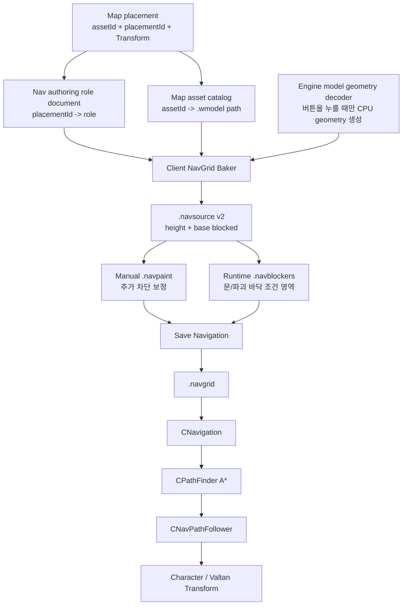

# LostArk Navigation Authoring 완결 계획

## 문서 옵션

```text
C1~C8: OFF
문제 해결 ①~⑤: OFF
자료구조·알고리즘: ON
```

## 1. 이번 작업의 최종 결론

이번 Navigation 작업은 다음 한 줄 구조로 끝낸다.

```text
Map Assets에서 배치·Transform 확정
    -> Navigation Setup에서 배치별 역할 지정
    -> Bake로 높이와 기본 Walkable/Blocked 생성
    -> Walkability에서 수동 Block 보정
    -> Destruction Area에서 런타임 차단 영역 작성
    -> Save Navigation 한 번으로 authoring/runtime 저장
    -> CNavigation -> CPathFinder -> CNavPathFollower가 소비
```

`CUL_BOX`는 이름만 우연히 같은 렌더 에셋이 아니라 `LV_NAVIMESH` 그룹에 속한 원본
Navigation proxy 계열이다. 따라서 기존 배치와 Transform은 재사용한다. 다만 139개를 모두
Walkable 바닥으로 간주하지는 않는다.

현재 확인된 Valtan 데이터의 최초 역할 제안은 다음과 같다.

| 원본 자산 | 수량 | 최초 역할 | 확정 방법 |
|---|---:|---|---|
| `CUL_BOX_8` | 1 | `Bounds` 후보 | 현재 보스 아레나를 감싸는 30.72 x 30.72 footprint를 화면에서 확인 |
| 실제 Floor/Main/Center floor | 기존 배치 | `Walkable Guide` | 위를 캐릭터가 걸어야 하는 실제 표면 |
| `CUL_BOX_1` | 49 | `Static Blocker` 후보 | 높고 좁은 volume이 벽·난간을 막는지 overlay로 확인 |
| `CUL_BOX_4` | 87 | `Static Blocker` 후보 | 높이가 있는 volume이 벽·장애물과 일치하는지 확인 |
| `CUL_BOX_7` | 2 | `Unassigned` | 낮고 음수 scale이 있으므로 화면 확인 후 역할 지정 |

이 표는 한 번의 import를 돕는 제안값일 뿐 저장 계약이 아니다. 사용자가 확인하고 저장한
`placementId -> role`이 이후의 유일한 정본이다. 런타임 코드에서 `CUL_BOX_1` 같은 이름을
다시 검사하지 않는다.

### Unreal 방식과 같은 점, 다른 점

같은 점은 Bounds 안에서 지형을 샘플링하고, 경사·장애물 조건으로 이동 가능 영역을 만든 뒤
필요한 부분을 수정한다는 것이다. 다른 점은 Unreal Recast가 한 XZ 위치에 여러 높이 span을
가질 수 있지만 현재 `CNavGrid`는 cell당 높이를 하나만 저장한다는 것이다.

따라서 오늘 완결 범위는 다음 조건이다.

- 같은 XZ에 위층과 아래층이 겹치지 않는 Valtan raid 공간은 한 `.navgrid`로 굽는다.
- 실제로 상하층이 겹치는 맵은 억지로 한 grid에 넣지 않고 영역별 `.navgrid`로 나눈다.
- multi-layer grid는 오늘 범위에 섞지 않는다.

## 2. 소유권과 의존 방향



| 클래스/문서 | 위치 | 소유하는 것 | 소유하지 않는 것 |
|---|---|---|---|
| `CMapPlacementDocument` | Client | 배치 ID, asset ID, Transform | Navigation 역할 |
| `CNavBakeAuthoringDocument` | Client | cell size와 `placementId -> role` | 모델 정점, 런타임 A* |
| `CModelBakeGeometryLoader` | Engine | `.wmodel`을 일시적인 정점/인덱스로 decode | LostArk asset ID, ImGui |
| `CNavGridBaker` | Client | 역할·배치·geometry를 `.navsource` cell로 변환 | 매 프레임 UI, actor 이동 |
| `CNavGridPaintDocument` | Client | source + 수동 static block 보정 | CUL_BOX 이름 판정 |
| `CNavRuntimeBlockerDocument` | Client | 조건부 cell 집합 | boss pattern 자체 |
| `CNavigation` | Engine | grid와 path query의 public facade | authoring 파일과 ImGui |
| `CNavPathFollower` | Engine | 받은 waypoint 소비와 Transform 이동 계산 | 클릭·보스 패턴 결정 |
| `CCharacter`, `CValtan` | Client | 언제 어디로 갈지 결정하고 follower에 요청 | A* 내부 자료구조 |

핵심 경계는 다음과 같다.

```text
Client가 결정한다: 무엇을 굽고, 언제 이동하고, 목적지가 어디인가?
Engine이 처리한다: geometry decode, grid query, A*, waypoint 소비는 어떻게 동작하는가?
```

## 3. 저장 계약

### 3.1 파일

```text
Client/Bin/DataFiles/Navigation/<AreaId>.navauthoring
Client/Bin/DataFiles/Navigation/<AreaId>.navsource
Client/Bin/DataFiles/Navigation/<AreaId>.navpaint
Client/Bin/DataFiles/Navigation/<AreaId>.navblockers
Client/Bin/DataFiles/Navigation/<AreaId>.navgrid
```

- UI에는 확장자와 절대 경로를 기본 노출하지 않는다.
- 실제 경로는 접힌 `Diagnostics`에서만 보인다.
- `ValtanArena` 하드코딩은 area ID로 교체한다.
- placement 문서가 Transform의 정본이고 `.navauthoring`은 placement ID와 역할만 저장한다.
- Prototype tag, 포인터, vector index는 저장하지 않는다.

### 3.2 역할

```cpp
enum class NAV_BAKE_ROLE : uint8_t
{
	UNASSIGNED,
	BOUNDS,
	WALKABLE_GUIDE,
	STATIC_BLOCKER,
	IGNORE,
};

struct NAV_BAKE_ASSIGNMENT final
{
	uint64_t placementId = {};
	NAV_BAKE_ROLE role = NAV_BAKE_ROLE::UNASSIGNED;
};

struct NAV_BAKE_SETTINGS final
{
	std::string areaId;
	f32_t cellSize = 0.5f;
	f32_t maxSlopeDegrees = 50.f;
	f32_t agentHeight = 1.8f;
	f32_t blockerPadding = 0.1f;
};
```

역할 의미는 다음과 같다.

- `BOUNDS`: grid의 XZ 범위를 정한다. 표면 높이를 만들지는 않는다.
- `WALKABLE_GUIDE`: 위쪽을 향한 mesh triangle로 cell 높이를 만든다.
- `STATIC_BLOCKER`: 구워질 때부터 이동 불가인 고정 벽·난간·장애물이다.
- `IGNORE`: Navigation 입력에서 명시적으로 제외한다.
- `UNASSIGNED`: 아직 사용자가 판단하지 않은 상태다. Bake 입력으로 쓰지 않는다.

### 3.3 `.navsource` v2 cell

```cpp
struct NAV_SOURCE_CELL final
{
	bool_t heightResolved = false;
	bool_t baseBlocked = false;
	f32_t height = {};
};
```

최종 cell 상태는 다음 식으로만 결정한다.

```cpp
const bool_t walkable =
	cell.heightResolved &&
	!cell.baseBlocked &&
	!manualBlocked;
```

- 표면이 없으면 자동 nonwalkable이며 overlay에는 그리지 않는다.
- static blocker는 `baseBlocked`이므로 노란색으로 보인다.
- 수동 `Block`은 `.navpaint`에만 추가된다.
- `Erase`는 수동 보정만 지우며, Bake가 만든 static blocker를 뚫지 않는다.
- 잘못 분류한 static blocker는 역할을 고친 다음 다시 Bake한다.

## 4. Bake 알고리즘

### 입력 검증

Bake는 다음 조건을 전부 만족해야 시작한다.

1. catalog와 placement 문서가 준비되어 있다.
2. `BOUNDS`가 한 개 이상 있다.
3. `WALKABLE_GUIDE`가 한 개 이상 있다.
4. 모든 assignment의 placement ID가 실제 배치에 존재한다.
5. 모든 배치의 asset ID가 catalog에 존재하고 `.wmodel`을 열 수 있다.
6. cell 수가 `CNavGridPaintDocument::MAX_CELL_COUNT` 이하이다.
7. 입력 Transform의 quaternion과 scale이 유효하다.

하나라도 실패하면 기존 `.navsource`, `.navpaint`, `.navgrid`를 건드리지 않는다.

### 높이 계산

각 `WALKABLE_GUIDE`는 Bake 명령 중에만 `.wmodel` 정점과 index를 decode한다. 정점을 배치
Transform으로 world space에 옮긴 뒤 triangle별 XZ 범위로 후보 cell을 제한한다.

cell 중심이 triangle의 XZ 투영 안에 있으면 barycentric 좌표로 Y를 보간한다. triangle
normal의 Y가 `cos(maxSlopeDegrees)`보다 작으면 너무 가파른 면이므로 제외한다. 한 cell에
여러 표면이 들어오면 현재 single-height 계약에 따라 가장 높은 표면 하나를 선택한다.

```cpp
bool_t Try_ProjectTriangleHeight(
	const float3_t& a,
	const float3_t& b,
	const float3_t& c,
	f32_t worldX,
	f32_t worldZ,
	f32_t minimumNormalY,
	f32_t& outHeight)
{
	const vector_t va = XMLoadFloat3(&a);
	const vector_t vb = XMLoadFloat3(&b);
	const vector_t vc = XMLoadFloat3(&c);
	const vector_t normal = XMVector3Normalize(
		XMVector3Cross(
			XMVectorSubtract(vb, va),
			XMVectorSubtract(vc, va)));
	if (XMVectorGetY(normal) < minimumNormalY)
		return false;

	const f32_t denominator =
		(b.z - c.z) * (a.x - c.x) +
		(c.x - b.x) * (a.z - c.z);
	if (std::fabs(denominator) <= 0.000001f)
		return false;

	const f32_t weightA =
		((b.z - c.z) * (worldX - c.x) +
		 (c.x - b.x) * (worldZ - c.z)) /
		denominator;
	const f32_t weightB =
		((c.z - a.z) * (worldX - c.x) +
		 (a.x - c.x) * (worldZ - c.z)) /
		denominator;
	const f32_t weightC = 1.f - weightA - weightB;
	constexpr f32_t epsilon = 0.0001f;
	if (weightA < -epsilon ||
		weightB < -epsilon ||
		weightC < -epsilon)
	{
		return false;
	}

	outHeight =
		weightA * a.y +
		weightB * b.y +
		weightC * c.y;
	return std::isfinite(outHeight);
}
```

### Static blocker 계산

`STATIC_BLOCKER`는 walkable surface를 만들지 않는다. 해당 모델 local bounds의 8개 모서리를
Transform하여 world bounds를 만들고, cell 중심의 높이부터 `agentHeight`까지 blocker와
겹치면 `baseBlocked = true`로 기록한다. XZ는 `blockerPadding`만큼 확장한다.

이 방식은 CUL_BOX 같은 volume proxy에 맞는다. 실제 복잡한 render mesh를 static blocker로
지정해야 할 때만 후속으로 triangle 정밀 교차를 추가하며, 오늘은 두 번째 충돌 체계를 만들지
않는다.

### 안전한 commit

```text
decode -> validate -> memory bake -> temporary source write
       -> temporary source reload validation
       -> 기존 paint/blocker header 호환 확인
       -> source 교체 -> document reload -> runtime export
```

- cell size 또는 bounds가 달라지면 기존 paint와 destruction region 좌표가 달라진다.
- 이 경우 UI가 `기존 보정과 영역을 초기화하고 다시 굽기` 확인을 한 번 받는다.
- 사용자가 취소하면 아무 파일도 바뀌지 않는다.
- 같은 grid header에서 mesh만 바뀐 re-bake는 기존 paint와 region을 유지한다.
- 임시 파일 검증 실패 시 기존 상태를 유지한다.

## 5. ImGui 유지 규칙과 최종 화면

Navigation 화면은 한 번에 한 작업만 보여 준다.

```text
Navigation

[Bake Setup] [Walkability] [Destruction Area]
```

### Bake Setup

```text
Selected Object: CUL_BOX_8
Role: [Bounds] [Walkable Guide] [Static Blocker] [Ignore]

Cell Size  [0.50]
[Bake Navigation]

[Save Navigation]   Saved / Unsaved / Bake failed: ...
> Diagnostics
```

### Walkability

```text
Tool   [Block] [Erase]
Brush  [0]

[Save Navigation]   Saved / Unsaved
Green: Walkable | Yellow: Non-walkable
> Diagnostics
```

### Destruction Area

```text
Region [Outer Ring Collapse v] [New]
Tool   [Add Cells] [Remove Cells]
Brush  [0]

[Save Navigation]   Saved / Unsaved
Magenta: Selected destruction area
> Test
> Diagnostics
```

반드시 지킬 규칙:

- 기본 화면에는 현재 mode, 현재 tool, 필요한 옵션 1~2개, 단일 Save, 한 줄 status만 둔다.
- 파일 확장자, asset ID, placement ID, 절대 경로는 `Diagnostics`에서만 보인다.
- Bake는 버튼 명령에서 한 번 실행한다. `Update()`나 ImGui render 중 반복 decode하지 않는다.
- `Reload`, 초기화, 복구 기능은 `Diagnostics/Advanced`와 확인 popup 아래에 둔다.
- 초록은 walkable, 노랑은 nonwalkable, 자홍은 선택된 runtime region만 사용한다.
- 빨강은 사용자가 바로 조치할 수 있는 오류에만 사용한다.
- world에서 시작한 LMB stroke만 cell을 편집한다.
- ImGui 위에서 누르기, focus 이탈, mode 변경, level 이탈, mouse release 시 stroke를 취소한다.
- `Bake Navigation`과 `Save Navigation`의 의미를 섞지 않는다.
  - Bake: placement geometry로 source를 다시 계산한다.
  - Save: role, paint, blockers, runtime grid를 한 번에 commit한다.

## 6. Phase별 적용

각 Phase는 먼저 대화에 최종 코드를 전부 제시하고 설명한 뒤, 사용자 확인을 받고 실제 파일에
반영한다. 반영 뒤 해당 Phase의 빌드·실행 검증을 통과해야 다음 Phase로 이동한다.

### Phase 1 — 역할 문서와 area 기반 경로

목표:

- `CNavBakeAuthoringDocument`를 추가한다.
- `placementId -> NAV_BAKE_ROLE`과 bake setting을 parse/validate/stage/commit으로 저장한다.
- 신규 `.navauthoring`만 catalog area ID 기반으로 연결한다.
- 기존 `ValtanArena.navsource/.navpaint/.navblockers/.navgrid` 경로는 중간 Phase의 runtime을
  깨지 않도록 그대로 둔다.
- 아직 실제 Bake 버튼은 연결하지 않는다.

변경 파일:

```text
신규 Client/Public/NavBakeAuthoringDocument.h
신규 Client/Private/NavBakeAuthoringDocument.cpp
수정 Client/Public/MapTool.h
수정 Client/Private/MapTool.cpp
수정 Client/Default/Client.vcxproj
수정 Client/Default/Client.vcxproj.filters
신규 Client/Bin/DataFiles/Navigation/LV_LUT_HEARTRB_ED.navauthoring
```

Phase 완료 조건:

- 없는 문서는 빈 assignment로 정상 시작한다.
- 잘못된 role, 중복 placement ID, 유효하지 않은 숫자는 기존 메모리 상태를 보존하고 실패한다.
- Save 후 reload하면 setting과 role이 동일하다.
- 현재 `.navsource/.navpaint/.navblockers/.navgrid`는 그대로 사용할 수 있다.

#### Phase 1 반영 코드

`CNavBakeAuthoringDocument`는 UI나 모델을 모르고, Bake 설정과 안정적인 placement ID의 역할만
소유한다. `Load()`는 파일 전체를 staging한 뒤 검증에 성공했을 때만 현재 상태을 교체한다.

`Client/Public/NavBakeAuthoringDocument.h` 신규 파일 전체:

```cpp
#pragma once

#include "Client_Defines.h"
#include "Engine_Defines.h"

#include <filesystem>
#include <string>
#include <vector>

NS_BEGIN(Client)

enum class NAV_BAKE_ROLE : uint8_t
{
	UNASSIGNED,
	BOUNDS,
	WALKABLE_GUIDE,
	STATIC_BLOCKER,
	IGNORE,
};

struct NAV_BAKE_ASSIGNMENT final
{
	uint64_t placementId = {};
	NAV_BAKE_ROLE role = NAV_BAKE_ROLE::UNASSIGNED;
};

struct NAV_BAKE_SETTINGS final
{
	std::string areaId;
	f32_t cellSize = 0.5f;
	f32_t maxSlopeDegrees = 50.f;
	f32_t agentHeight = 1.8f;
	f32_t blockerPadding = 0.1f;
};

class CNavBakeAuthoringDocument final
{
public:
	static constexpr uint32_t MAX_ASSIGNMENT_COUNT = 65536;

public:
	bool_t Load(
		const std::filesystem::path& path,
		const std::string& expectedAreaId,
		std::string& outStatus);
	bool_t Save(
		const std::filesystem::path& path,
		std::string& outStatus);
	bool_t Set_Settings(
		const NAV_BAKE_SETTINGS& settings);
	bool_t Set_Role(
		uint64_t placementId,
		NAV_BAKE_ROLE role);

public:
	bool_t Is_Ready() const { return m_isReady; }
	bool_t Is_Dirty() const { return m_isDirty; }
	NAV_BAKE_ROLE Get_Role(uint64_t placementId) const;
	const NAV_BAKE_SETTINGS& Get_Settings() const {
		return m_Settings;
	}
	const std::vector<NAV_BAKE_ASSIGNMENT>& Get_Assignments() const {
		return m_Assignments;
	}

private:
	static bool_t Is_ValidSettings(
		const NAV_BAKE_SETTINGS& settings);

private:
	NAV_BAKE_SETTINGS m_Settings;
	std::vector<NAV_BAKE_ASSIGNMENT> m_Assignments;
	bool_t m_isReady = false;
	bool_t m_isDirty = false;
};

NS_END
```

`Client/Private/NavBakeAuthoringDocument.cpp` 신규 파일 전체:

```cpp
#include "NavBakeAuthoringDocument.h"

#include <algorithm>
#include <cmath>
#include <fstream>
#include <iomanip>
#include <unordered_set>
#include <utility>

namespace
{
	constexpr const char* AUTHORING_MAGIC =
		"LOSTARK_NAV_BAKE_AUTHORING";
	constexpr uint32_t AUTHORING_VERSION = 1;

	bool_t IsValidRole(uint32_t value)
	{
		return value <= static_cast<uint32_t>(
			Client::NAV_BAKE_ROLE::IGNORE);
	}

	bool_t CommitTemporaryFile(
		const std::filesystem::path& destination,
		const std::filesystem::path& temporary)
	{
		std::error_code error;
		const bool_t destinationExists =
			std::filesystem::exists(destination, error);
		if (error)
			return false;

		if (destinationExists &&
			ReplaceFileW(
				destination.c_str(),
				temporary.c_str(),
				nullptr,
				REPLACEFILE_WRITE_THROUGH,
				nullptr,
				nullptr))
		{
			return true;
		}

		return MoveFileExW(
			temporary.c_str(),
			destination.c_str(),
			MOVEFILE_REPLACE_EXISTING |
			MOVEFILE_WRITE_THROUGH);
	}

	void RemoveTemporaryFile(
		const std::filesystem::path& temporary)
	{
		std::error_code error;
		std::filesystem::remove(temporary, error);
	}
}

bool_t Client::CNavBakeAuthoringDocument::Load(
	const std::filesystem::path& path,
	const std::string& expectedAreaId,
	std::string& outStatus)
{
	if (expectedAreaId.empty())
	{
		outStatus = "Navigation area ID is empty";
		return false;
	}

	std::error_code existsError;
	const bool_t exists =
		std::filesystem::exists(path, existsError);
	if (existsError)
	{
		outStatus =
			"Could not inspect navigation authoring document";
		return false;
	}

	if (!exists)
	{
		m_Settings = {};
		m_Settings.areaId = expectedAreaId;
		m_Assignments.clear();
		m_isReady = true;
		m_isDirty = false;
		outStatus =
			"Navigation bake setup starts empty";
		return true;
	}

	std::ifstream input(path, std::ios::binary);
	std::string magic;
	uint32_t version = {};
	NAV_BAKE_SETTINGS stagedSettings;
	uint64_t assignmentCount = {};
	if (!input ||
		!(input >>
			magic >>
			version >>
			std::quoted(stagedSettings.areaId) >>
			stagedSettings.cellSize >>
			stagedSettings.maxSlopeDegrees >>
			stagedSettings.agentHeight >>
			stagedSettings.blockerPadding >>
			assignmentCount) ||
		magic != AUTHORING_MAGIC ||
		version != AUTHORING_VERSION ||
		stagedSettings.areaId != expectedAreaId ||
		!Is_ValidSettings(stagedSettings) ||
		assignmentCount > MAX_ASSIGNMENT_COUNT)
	{
		outStatus =
			"Navigation bake setup header is invalid";
		return false;
	}

	std::vector<NAV_BAKE_ASSIGNMENT> stagedAssignments;
	stagedAssignments.reserve(
		static_cast<size_t>(assignmentCount));
	std::unordered_set<uint64_t> placementIds;
	for (uint64_t index = 0;
		index < assignmentCount;
		++index)
	{
		NAV_BAKE_ASSIGNMENT assignment{};
		uint32_t role = {};
		if (!(input >> assignment.placementId >> role) ||
			0 == assignment.placementId ||
			!IsValidRole(role) ||
			NAV_BAKE_ROLE::UNASSIGNED ==
				static_cast<NAV_BAKE_ROLE>(role) ||
			!placementIds.emplace(
				assignment.placementId).second)
		{
			outStatus =
				"Navigation bake setup row is invalid";
			return false;
		}

		assignment.role =
			static_cast<NAV_BAKE_ROLE>(role);
		stagedAssignments.push_back(assignment);
	}

	input >> std::ws;
	if (input.peek() !=
		std::char_traits<char>::eof())
	{
		outStatus =
			"Navigation bake setup has trailing data";
		return false;
	}

	std::sort(
		stagedAssignments.begin(),
		stagedAssignments.end(),
		[](const NAV_BAKE_ASSIGNMENT& left,
			const NAV_BAKE_ASSIGNMENT& right)
		{
			return left.placementId < right.placementId;
		});

	m_Settings = std::move(stagedSettings);
	m_Assignments = std::move(stagedAssignments);
	m_isReady = true;
	m_isDirty = false;
	outStatus = "Loaded navigation bake setup";
	return true;
}

bool_t Client::CNavBakeAuthoringDocument::Save(
	const std::filesystem::path& path,
	std::string& outStatus)
{
	if (!m_isReady ||
		!Is_ValidSettings(m_Settings))
	{
		outStatus =
			"Navigation bake setup is not ready";
		return false;
	}

	std::error_code directoryError;
	std::filesystem::create_directories(
		path.parent_path(),
		directoryError);
	if (directoryError)
	{
		outStatus =
			"Could not create navigation data directory";
		return false;
	}

	std::filesystem::path temporary = path;
	temporary += L".tmp";
	std::ofstream output(
		temporary,
		std::ios::binary | std::ios::trunc);
	if (!output)
	{
		outStatus =
			"Could not create temporary navigation bake setup";
		return false;
	}

	output <<
		AUTHORING_MAGIC << ' ' <<
		AUTHORING_VERSION << ' ' <<
		std::quoted(m_Settings.areaId) << ' ' <<
		std::setprecision(9) <<
		m_Settings.cellSize << ' ' <<
		m_Settings.maxSlopeDegrees << ' ' <<
		m_Settings.agentHeight << ' ' <<
		m_Settings.blockerPadding << ' ' <<
		m_Assignments.size() << '\n';

	for (const NAV_BAKE_ASSIGNMENT& assignment :
		m_Assignments)
	{
		output <<
			assignment.placementId << ' ' <<
			static_cast<uint32_t>(
				assignment.role) << '\n';
	}

	output.flush();
	const bool_t wroteSuccessfully = output.good();
	output.close();
	if (!wroteSuccessfully ||
		!CommitTemporaryFile(path, temporary))
	{
		RemoveTemporaryFile(temporary);
		outStatus =
			"Failed to commit navigation bake setup";
		return false;
	}

	m_isDirty = false;
	outStatus = "Saved navigation bake setup";
	return true;
}

bool_t Client::CNavBakeAuthoringDocument::Set_Settings(
	const NAV_BAKE_SETTINGS& settings)
{
	if (!m_isReady ||
		!Is_ValidSettings(settings) ||
		settings.areaId != m_Settings.areaId)
	{
		return false;
	}

	const bool_t changed =
		settings.cellSize != m_Settings.cellSize ||
		settings.maxSlopeDegrees !=
			m_Settings.maxSlopeDegrees ||
		settings.agentHeight != m_Settings.agentHeight ||
		settings.blockerPadding !=
			m_Settings.blockerPadding;
	if (!changed)
		return false;

	m_Settings = settings;
	m_isDirty = true;
	return true;
}

bool_t Client::CNavBakeAuthoringDocument::Set_Role(
	uint64_t placementId,
	NAV_BAKE_ROLE role)
{
	if (!m_isReady ||
		0 == placementId ||
		role > NAV_BAKE_ROLE::IGNORE)
	{
		return false;
	}

	const auto iter = std::lower_bound(
		m_Assignments.begin(),
		m_Assignments.end(),
		placementId,
		[](const NAV_BAKE_ASSIGNMENT& assignment,
			uint64_t id)
		{
			return assignment.placementId < id;
		});

	if (NAV_BAKE_ROLE::UNASSIGNED == role)
	{
		if (iter == m_Assignments.end() ||
			iter->placementId != placementId)
		{
			return false;
		}

		m_Assignments.erase(iter);
		m_isDirty = true;
		return true;
	}

	if (iter != m_Assignments.end() &&
		iter->placementId == placementId)
	{
		if (iter->role == role)
			return false;

		iter->role = role;
		m_isDirty = true;
		return true;
	}

	m_Assignments.insert(
		iter,
		NAV_BAKE_ASSIGNMENT{
			placementId,
			role });
	m_isDirty = true;
	return true;
}

Client::NAV_BAKE_ROLE
Client::CNavBakeAuthoringDocument::Get_Role(
	uint64_t placementId) const
{
	const auto iter = std::lower_bound(
		m_Assignments.begin(),
		m_Assignments.end(),
		placementId,
		[](const NAV_BAKE_ASSIGNMENT& assignment,
			uint64_t id)
		{
			return assignment.placementId < id;
		});
	return iter != m_Assignments.end() &&
		iter->placementId == placementId ?
		iter->role :
		NAV_BAKE_ROLE::UNASSIGNED;
}

bool_t
Client::CNavBakeAuthoringDocument::Is_ValidSettings(
	const NAV_BAKE_SETTINGS& settings)
{
	return
		!settings.areaId.empty() &&
		std::isfinite(settings.cellSize) &&
		settings.cellSize >= 0.05f &&
		settings.cellSize <= 10.f &&
		std::isfinite(settings.maxSlopeDegrees) &&
		settings.maxSlopeDegrees >= 0.f &&
		settings.maxSlopeDegrees < 90.f &&
		std::isfinite(settings.agentHeight) &&
		settings.agentHeight > 0.f &&
		settings.agentHeight <= 20.f &&
		std::isfinite(settings.blockerPadding) &&
		settings.blockerPadding >= 0.f &&
		settings.blockerPadding <= 10.f;
}
```

Phase 1에서 `MapTool`에 들어갈 필드와 함수 선언은 다음 블록을 그대로 추가한다. UI는 Phase
4에서 붙이고 Phase 1에서는 load/save와 area 기반 파일명만 연결한다.

```cpp
#include "NavBakeAuthoringDocument.h"

bool_t Load_NavigationAuthoring();
bool_t Save_NavigationAuthoring();

CNavBakeAuthoringDocument m_NavBakeAuthoringDocument;
std::filesystem::path m_NavigationAuthoringPath;
```

`Load_NavigationDocument()`에서 기존 네 경로를 정한 직후 authoring 경로와 load만 추가한다.
기존 runtime 파일명은 Phase 5에서 모든 소비자를 함께 바꾼다.

```cpp
	const std::string areaId = m_Catalog.Get_AreaId();
	if (areaId.empty())
	{
		m_NavigationStatus =
			"Navigation area is unavailable";
		return false;
	}

	const std::wstring fileStem =
		std::filesystem::path(areaId).wstring();
	m_NavigationAuthoringPath =
		root / (fileStem + L".navauthoring");

	if (!m_NavBakeAuthoringDocument.Load(
		m_NavigationAuthoringPath,
		areaId,
		m_NavigationStatus))
	{
		return false;
	}
```

### Phase 2 — Engine의 일회성 geometry decode

목표:

- MapTool Bake가 `.wmodel`의 static 정점·index를 읽을 수 있는 범용 Engine API를 추가한다.
- geometry는 Bake 호출 동안만 존재하고 `CModel` prototype에는 복사해 두지 않는다.
- skinned model은 Navigation guide로 거부한다.

변경 파일:

```text
신규 Engine/Public/ModelBakeGeometry.h
신규 Engine/Private/ModelBakeGeometry.cpp
수정 Engine/Default/Engine.vcxproj
수정 Engine/Default/Engine.vcxproj.filters
```

공개 계약:

```cpp
#pragma once

#include "Engine_Defines.h"

#include <filesystem>
#include <string>
#include <vector>

NS_BEGIN(Engine)

struct MODEL_BAKE_GEOMETRY final
{
	std::vector<float3_t> positions;
	std::vector<uint32_t> indices;
	float3_t localBoundsMin = {};
	float3_t localBoundsMax = {};
};

class ENGINE_DLL CModelBakeGeometryLoader final
{
public:
	static bool_t Load_Static(
		const std::filesystem::path& modelPath,
		MODEL_BAKE_GEOMETRY& outGeometry,
		std::string& outStatus);
};

NS_END
```

Phase 완료 조건:

- 네 종류 CUL_BOX와 실제 Floor 모델을 decode한다.
- index가 3의 배수이고 모든 index가 positions 범위 안이다.
- 실패 시 `outGeometry`는 비어 있다.
- Engine Debug/Release, UpdateLib, Client Debug/Release를 모두 통과한다.

### Phase 3 — 범용 NavGrid Baker와 `.navsource` v2

목표:

- `CNavGridBaker`를 추가하고 Bounds/Walkable Guide/Static Blocker 역할을 실제 cell로 굽는다.
- `CNavGridPaintDocument`가 source v1을 계속 읽고 v2의 `baseBlocked`를 지원한다.
- Valtan 전용 Python baker는 비교용 도구로 남기되 정본 생성 경로에서 제외한다.

변경 파일:

```text
신규 Client/Public/NavGridBaker.h
신규 Client/Private/NavGridBaker.cpp
수정 Client/Public/NavGridPaintDocument.h
수정 Client/Private/NavGridPaintDocument.cpp
수정 Client/Default/Client.vcxproj
수정 Client/Default/Client.vcxproj.filters
```

Phase 완료 조건:

- 같은 입력은 byte 단위로 같은 `.navsource`를 만든다.
- 표면 없음, 경사 초과, bounds 밖은 walkable이 아니다.
- static blocker cell은 노란색이며 Erase로 뚫리지 않는다.
- 기존 v1 Valtan source도 회귀 없이 load된다.
- 62 x 63 기준 bake가 한 번의 버튼 명령으로 끝나고 매 프레임 비용이 없다.

### Phase 4 — Bake Setup UI와 CUL_BOX import

목표:

- Navigation mode를 `Bake Setup / Walkability / Destruction Area`로 정리한다.
- 현재 Hierarchy에서 선택한 placement에 역할을 지정한다.
- `LV_NAVIMESH` 배치를 한 번 import하고 Valtan 최초 제안 역할을 표시한다.
- 사용자가 확인한 뒤 `Bake Navigation`을 실행한다.

변경 파일:

```text
수정 Client/Public/MapTool.h
수정 Client/Private/MapTool.cpp
```

Phase 완료 조건:

- 기본 화면에 raw ID/path가 보이지 않는다.
- selection이 없으면 role 버튼과 Bake가 안전하게 disabled된다.
- import는 기존 placement나 Transform을 복제하지 않는다.
- 역할 변경은 authoring dirty만 만들며 map placement를 망가뜨리지 않는다.
- topology 변경 re-bake는 기존 보정 초기화 확인 popup을 띄운다.

### Phase 5 — 단일 Save와 런타임 재로드

목표:

- `Save Navigation` 한 번으로 authoring, paint, blocker, `.navgrid`를 저장한다.
- `.navsource/.navpaint/.navblockers/.navgrid`도 catalog area ID 기반 경로로 바꾸고,
  Level과 MapTool 소비자를 같은 Phase에서 함께 교체한다.
- 저장 중간 실패 시 기존 runtime grid를 보존한다.
- 저장 성공 후 AssetTest의 `CNavigation`을 안전하게 다시 읽거나, 재입장이 필요하면 한 줄로
  정확히 안내한다.

변경 파일:

```text
수정 Client/Private/MapTool.cpp
필요 시 수정 Engine/Public/Navigation.h
필요 시 수정 Engine/Private/Navigation.cpp
```

Phase 완료 조건:

- Save 성공 전에는 dirty flag가 사라지지 않는다.
- 실패한 저장은 기존 `.navgrid`와 현재 캐릭터 navigation을 보존한다.
- 우클릭이 아닌 좌클릭 path request가 새 grid에서 정상 동작한다.
- `Request_Path -> Find_Path -> OutPath reverse -> NavPathFollower -> Transform` 흐름이 유지된다.

현재 Valtan 파일은 이 Phase에서 아래처럼 이관한다. 먼저 복사하고 새 area 기반 파일을
MapTool과 Level 양쪽에서 정상 load한 뒤에만 기존 이름의 파일 정리를 별도 판단한다.

```text
ValtanArena.navsource   -> LV_LUT_HEARTRB_ED.navsource
ValtanArena.navpaint    -> LV_LUT_HEARTRB_ED.navpaint
ValtanArena.navblockers -> LV_LUT_HEARTRB_ED.navblockers
ValtanArena.navgrid     -> LV_LUT_HEARTRB_ED.navgrid
```

### Phase 6 — Valtan raid 전체 authoring과 종료 검증

적용 순서:

1. 원본 CUL_BOX 139개를 import한다.
2. `CUL_BOX_8`과 전체 raid 범위를 비교해 Bounds를 확정한다.
3. Floor/Main/Center/계단 guide를 `Walkable Guide`로 지정한다.
4. `CUL_BOX_1/4` blocker 후보를 화면 overlay와 실제 지형으로 확인한다.
5. `CUL_BOX_7` 두 개를 직접 확인하고 역할을 지정한다.
6. Bake한다.
7. 노란색 static blocker가 벽·난간과 일치하는지 확인한다.
8. 남은 절벽·장식물 주변만 Walkability `Block`으로 보정한다.
9. 문·관문·파괴 바닥만 Destruction Area로 작성한다.
10. Save하고 게임을 재시작해 실제 runtime 결과를 검증한다.

종료 조건:

- 아레나 중앙, 외곽, 계단, 좁은 통로에서 좌클릭 이동이 끊기지 않는다.
- 벽 너머 클릭은 가장 가까운 유효 cell 처리 정책에 맞게 실패하거나 보정된다.
- static blocker와 파괴 영역의 역할이 중복되지 않는다.
- Valtan 이동도 같은 `CNavigation`과 `CNavPathFollower`를 사용한다.
- 보스 패턴은 목적지만 결정하고 직접 Transform을 순간 이동시키지 않는다.
- source를 삭제하거나 손상시켰을 때 기존 runtime 상태를 보존하고 오류를 표시한다.

## 7. 프로젝트 등록

Phase 1:

```xml
<!-- Client/Default/Client.vcxproj -->
<ClInclude Include="..\Public\NavBakeAuthoringDocument.h" />
<ClCompile Include="..\Private\NavBakeAuthoringDocument.cpp" />
```

```xml
<!-- Client/Default/Client.vcxproj.filters -->
<ClInclude Include="..\Public\NavBakeAuthoringDocument.h">
  <Filter>03. Tools\00. Map</Filter>
</ClInclude>
<ClCompile Include="..\Private\NavBakeAuthoringDocument.cpp">
  <Filter>03. Tools\00. Map</Filter>
</ClCompile>
```

Phase 2:

```xml
<!-- Engine/Default/Engine.vcxproj -->
<ClInclude Include="..\Public\ModelBakeGeometry.h" />
<ClCompile Include="..\Private\ModelBakeGeometry.cpp" />
```

```xml
<!-- Engine/Default/Engine.vcxproj.filters -->
<ClInclude Include="..\Public\ModelBakeGeometry.h">
  <Filter>99. Asset Pipeline</Filter>
</ClInclude>
<ClCompile Include="..\Private\ModelBakeGeometry.cpp">
  <Filter>99. Asset Pipeline</Filter>
</ClCompile>
```

Phase 3:

```xml
<!-- Client/Default/Client.vcxproj -->
<ClInclude Include="..\Public\NavGridBaker.h" />
<ClCompile Include="..\Private\NavGridBaker.cpp" />
```

```xml
<!-- Client/Default/Client.vcxproj.filters -->
<ClInclude Include="..\Public\NavGridBaker.h">
  <Filter>03. Tools\00. Map</Filter>
</ClInclude>
<ClCompile Include="..\Private\NavGridBaker.cpp">
  <Filter>03. Tools\00. Map</Filter>
</ClCompile>
```

실제 반영 시 기존 filter가 없으면 가장 가까운 기존 Map/Asset Pipeline filter를 사용한다.
기존 항목은 재배치하지 않는다.

## 8. 빌드·실행 검증

Engine public header가 생기는 Phase 2 이후의 정식 순서는 다음과 같다.

```text
1. Engine x64 Debug
2. UpdateLib.bat Debug
3. Client x64 Debug
4. Engine x64 Release
5. UpdateLib.bat Release
6. Client x64 Release
```

실행 검증:

1. `Client/Default` working directory로 실행한다.
2. F2로 AssetTest에 진입한다.
3. Map Assets에서 guide/bounds로 쓸 mesh를 배치하고 position/rotation/scale을 조절한다.
4. Navigation > Bake Setup에서 역할을 지정한다.
5. Bake 후 초록/노랑 cell과 실제 floor 높이가 일치하는지 확인한다.
6. 계단 아래부터 위까지 이어서 path가 생성되는지 확인한다.
7. Walkability에서 nonwalkable만 추가 보정한다.
8. Destruction Area를 작성하고 Test condition으로 즉시 차단 여부를 확인한다.
9. Save Navigation 후 재실행한다.
10. Character 좌클릭 이동과 Valtan pattern 이동이 같은 grid에서 정상인지 확인한다.
11. 저장 파일 하나를 고의로 손상시켜 parse 실패 시 이전 상태가 보존되는지 확인한다.

## 9. 오늘 진행 순서

```text
지금: 최종 방향과 계획서 확정
다음: Phase 1 전체 코드 설명 -> 사용자 확인 -> 반영 -> 검증
그다음: Phase 2 전체 코드 설명 -> 사용자 확인 -> 반영 -> 검증
이후: Phase 3 -> Phase 4 -> Phase 5 -> Phase 6
```

각 Phase에서 빌드 오류나 데이터 실측 차이가 나오면 그 Phase 안에서 해결한 뒤 다음으로 넘어간다.
완료되지 않은 중간 상태를 새로운 런타임 경로로 우회하지 않는다.
