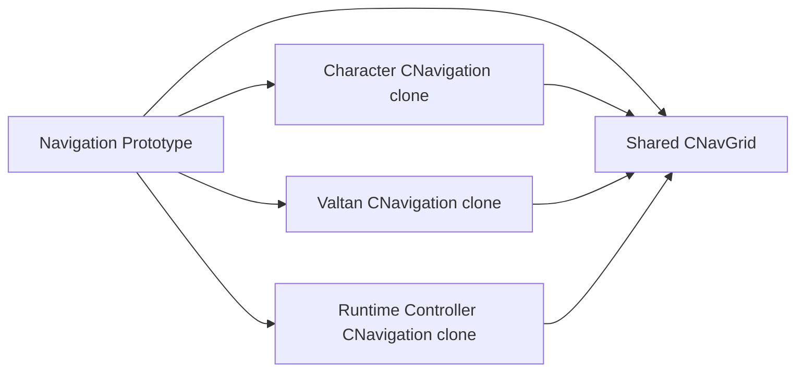
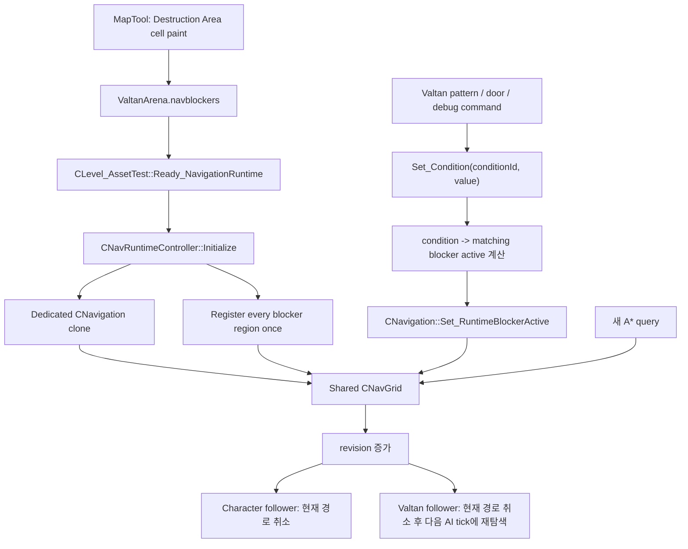

# LostArk 런타임 Navigation Condition 구현 계획

## 문서 옵션

```text
C1~C8: OFF
문제 해결 ①~⑤: OFF
자료구조·알고리즘: ON
문서 유형: 구현 계획서
현재 상태: 계획 확정 전 검토용, 아직 코드 미반영
```

## 1. 한 문장 본질

MapTool에서 미리 칠한 cell region을 Level이 런타임 시작 시 한 번 등록하고, 발탄 패턴이나
문 상태가 semantic condition만 변경하면 공유 `CNavGrid`가 즉시 길찾기 결과를 바꾸게 한다.

## 2. 현재 코드에서 이미 되는 부분

다음 Engine 기능은 새로 만들 필요가 없다.

```text
CNavGrid::Register_RuntimeBlocker()
    region cell index를 정렬·중복 제거하여 등록

CNavGrid::Set_RuntimeBlockerActive()
    활성화 시 cell별 block count 증가
    비활성화 시 cell별 block count 감소

CNavGrid::Is_Walkable()
    baseWalkable && runtimeBlockCount == 0

CNavGrid::m_iRevision
    실제 blocker 상태가 변할 때만 증가

CNavPathFollower::Update()
    자신이 경로를 만든 revision과 현재 revision이 다르면 경로 취소

CPathFinder
    다음 query부터 변경된 Is_Walkable 결과를 그대로 사용
```

`CNavigation` clone은 `CPathFinder`는 각자 소유하지만 `shared_ptr<CNavGrid>`는 공유한다.
따라서 Character의 Navigation, Valtan의 Navigation, runtime controller가 같은
Navigation prototype에서 clone되면 blocker 상태는 모두에게 동시에 보인다.



현재 부족한 것은 다음 세 가지다.

```text
1. MapTool이 아닌 Level 수명의 runtime blocker 등록 owner
2. semantic condition을 blocker active 상태로 변환하는 Client controller
3. 실제로 칠한 region data
```

현재 파일 실측:

```text
Client/Bin/DataFiles/Navigation/ValtanArena.navblockers

LOSTARK_NAVGRID_BLOCKERS 1 "LV_LUT_HEARTRB_ED"
62 63 0.5 140.5 -137.5 0
```

마지막 `0`은 region count다. 즉 Engine 기능은 존재하지만 지금은 활성화할 region이 없다.

## 3. 최종 수직 흐름



## 4. 런타임 변화 규칙

### 4.1 무너지는 발판

```text
base bake: Walkable
condition: VALTAN_ARENA_DESTROYED
activateWhenConditionTrue: true

Destroyed == false -> blocker inactive -> 이동 가능
Destroyed == true  -> blocker active   -> 이동 불가
```

### 4.2 열리는 문

문 cell은 base bake에서 Walkable로 둔다. 닫힌 상태만 blocker로 막는다.

```text
condition: GATE_OPEN
activateWhenConditionTrue: false

GateOpen == false -> blocker active   -> 닫힌 문
GateOpen == true  -> blocker inactive -> 열린 문
```

base bake가 Non-walkable인 cell은 blocker를 꺼도 Walkable이 되지 않는다.

```cpp
baseWalkable && !runtimeBlocked
```

따라서 현재 runtime blocker가 표현하는 변화는 다음 범위다.

```text
지원:
Walkable cell을 임시로 막기
막아 둔 Walkable cell을 다시 열기
여러 region이 겹친 cell을 count로 안전하게 막기

미지원:
없는 바닥을 새로 만들기
cell 높이 변경
이동 플랫폼
위·아래 층을 같은 XZ에 동시에 표현하기
```

발탄 아레나 외곽 붕괴는 기존 바닥을 막는 문제이므로 현재 blocker 방식에 맞는다.

### 4.3 이미 region 안에 서 있는 actor

Navigation은 actor를 순간이동시키거나 죽이지 않는다.

```text
경로가 region을 지나고 있음 -> revision 불일치로 경로 취소
actor가 무너진 cell 위에 있음 -> 패턴/낙하/피격 시스템이 처리
Character                      -> 정지 후 다음 클릭을 기다림
Valtan                         -> AI repath 주기에 새 경로 요청
```

## 5. 소유권

| 대상 | owner | 생성 시점 | 파괴 시점 | 역할 |
|---|---|---|---|---|
| `.navblockers` authoring | `CMapTool` | MapTool Navigation load | MapTool 종료 | region 작성·저장 |
| runtime condition state | `CNavRuntimeController` | Level Initialize | Level 종료 | condition 정본 |
| runtime grid/block count | 공유 `CNavGrid` | Navigation prototype load | Level resource clear | A*가 읽는 실제 상태 |
| actor path | 각 `CNavPathFollower` | Request Path | 도착·취소·revision 변경 | Transform 이동 |
| 발탄 패턴 상태 | `CValtan` | Valtan clone | Valtan 제거 | condition 변경 시점 결정 |

`CMapTool`은 runtime owner가 아니다. 에디터가 닫혀도 보스전 Navigation 변화가
동작해야 하기 때문이다.

## 6. 수정 파일

### Phase 1: Runtime condition 기반 닫기

| 구분 | 파일 | 수정 이유 |
|---|---|---|
| 수정 | `Engine/Public/Navigation.h` | runtime document와 grid identity를 검증할 읽기 API |
| 수정 | `Engine/Private/Navigation.cpp` | shared NavGrid identity 복사 구현 |
| 추가 | `Client/Public/NavRuntimeController.h` | Level 수명의 condition owner |
| 추가 | `Client/Private/NavRuntimeController.cpp` | blocker load/register/toggle/rollback |
| 수정 | `Client/Public/Level_AssetTest.h` | controller와 F10 검증 상태 소유 |
| 수정 | `Client/Private/Level_AssetTest.cpp` | actor 생성 전 controller 초기화, F10 condition test |
| 수정 | `Client/Public/MapTool.h` | runtime blocker 등록 owner 선언 제거 |
| 수정 | `Client/Private/MapTool.cpp` | document load만 유지하고 runtime 등록 제거 |
| 수정 | `Client/Default/Client.vcxproj` | 새 controller 등록 |
| 수정 | `Client/Default/Client.vcxproj.filters` | 기존 Navigation authoring 파일과 같은 Map filter에 등록 |
| 데이터 | `Client/Bin/DataFiles/Navigation/ValtanArena.navblockers` | 실제 outer ring region cell |

### Phase 2: 실제 발탄 붕괴 패턴 연결

| 파일 | 수정 이유 |
|---|---|
| `Client/Public/Valtan.h` | collapse pattern의 condition sink 보관 |
| `Client/Private/Valtan.cpp` | 붕괴가 확정되는 pattern 단계에서 condition 변경 |
| 실제 raid Level | 파괴 visual/collision/nav를 같은 event에서 변경 |

Phase 1에서는 아직 존재하지 않는 붕괴 패턴 코드를 미리 넣지 않는다. F10 검증으로
runtime path invalidation까지 먼저 닫은 뒤, 실제 collapse pattern을 구현할 때 Phase 2를
연결한다.

## 7. 자료구조

### 7.1 `NAVGRID_IDENTITY`

```text
표현: runtime `.navgrid`의 좌표 계약
owner: CNavGrid
writer: CNavGrid::Load
reader: CNavRuntimeController 초기화
수명: Navigation prototype과 동일
불변식: width/height/cellSize 유효, origin finite
```

```cpp
struct NAVGRID_IDENTITY final
{
	uint32_t width = {};
	uint32_t height = {};
	f32_t cellSize = {};
	f32_t originX = {};
	f32_t originZ = {};
};
```

blocker 파일이 다른 크기·원점의 grid에서 만들어졌다면 cell index의 의미가 달라진다.
따라서 등록 전에 반드시 identity를 비교한다.

### 7.2 `CNavRuntimeController`

```text
표현: condition 값과 condition에 연결된 blocker region
owner: CLevel_AssetTest
writer: Level debug command, 이후 Valtan pattern event
reader: condition debug UI
수명: 한 raid Level
프레임 비용: 없음. 상태가 바뀌는 event에서만 호출
```

핵심 멤버:

```cpp
shared_ptr<CNavigation> m_pNavigation;
CNavRuntimeBlockerDocument m_Document;
std::unordered_map<std::string, bool_t> m_Conditions;
```

controller용 `CNavigation` clone은 경로를 만들기 위한 것이 아니다. 같은 prototype의
`CNavGrid`를 공유하는 안전한 변경 handle이다.

## 8. 최종 반영 코드

### 8.1 `Engine/Public/Navigation.h`

`CNavigation` 선언 앞에 추가:

```cpp
struct NAVGRID_IDENTITY final
{
	uint32_t width = {};
	uint32_t height = {};
	f32_t cellSize = {};
	f32_t originX = {};
	f32_t originZ = {};
};
```

public runtime blocker API 끝에 추가:

```cpp
bool_t Get_NavGridIdentity(
	NAVGRID_IDENTITY& outIdentity) const;
```

### 8.2 `Engine/Private/Navigation.cpp`

추가 함수 전체:

```cpp
bool_t CNavigation::Get_NavGridIdentity(
	NAVGRID_IDENTITY& outIdentity) const
{
	if (MODE::NAVGRID_ASTAR != m_eMode ||
		nullptr == m_pNavGrid)
	{
		return false;
	}

	const CNavGrid::NAVGRID_DESC& desc =
		m_pNavGrid->Get_Desc();
	outIdentity.width = desc.iWidth;
	outIdentity.height = desc.iHeight;
	outIdentity.cellSize = desc.fCellSize;
	outIdentity.originX = desc.fOriginX;
	outIdentity.originZ = desc.fOriginZ;
	return true;
}
```

### 8.3 `Client/Public/NavRuntimeController.h`

신규 파일 전체:

```cpp
#pragma once

#include "Client_Defines.h"
#include "NavRuntimeBlockerDocument.h"

#include <filesystem>
#include <string>
#include <unordered_map>

NS_BEGIN(Engine)
class CNavigation;
NS_END

NS_BEGIN(Client)

class CNavRuntimeController final
{
public:
	bool_t Initialize(
		uint32_t prototypeLevelIndex,
		const std::wstring& navigationPrototypeTag,
		const std::string& areaId,
		const std::filesystem::path& blockerPath,
		std::string& outStatus);

	bool_t Set_Condition(
		const std::string& conditionId,
		bool_t value,
		std::string& outStatus);

	bool_t Get_Condition(
		const std::string& conditionId,
		bool_t& outValue) const;

	uint64_t Get_NavigationRevision() const;

private:
	shared_ptr<CNavigation> m_pNavigation;
	CNavRuntimeBlockerDocument m_Document;
	std::unordered_map<std::string, bool_t> m_Conditions;
};

NS_END
```

### 8.4 `Client/Private/NavRuntimeController.cpp`

신규 파일 전체:

```cpp
#include "NavRuntimeController.h"

#include "GameInstance.h"
#include "Navigation.h"

#include <algorithm>
#include <cmath>
#include <iterator>
#include <utility>
#include <vector>

namespace
{
	std::filesystem::path ResolveNavigationPath(
		const std::filesystem::path& requested)
	{
		if (requested.empty())
			return {};
		if (requested.is_absolute() ||
			std::filesystem::exists(requested))
		{
			return requested.lexically_normal();
		}

		wchar_t modulePath[32768]{};
		const DWORD length = GetModuleFileNameW(
			nullptr,
			modulePath,
			static_cast<DWORD>(std::size(modulePath)));
		if (0 == length || length >= std::size(modulePath))
			return requested.lexically_normal();

		return (
			std::filesystem::path(modulePath).parent_path() /
			requested).lexically_normal();
	}
}

bool_t Client::CNavRuntimeController::Initialize(
	uint32_t prototypeLevelIndex,
	const std::wstring& navigationPrototypeTag,
	const std::string& areaId,
	const std::filesystem::path& blockerPath,
	std::string& outStatus)
{
	if (navigationPrototypeTag.empty() || areaId.empty())
	{
		outStatus = "Runtime navigation identity is invalid";
		return false;
	}

	shared_ptr<CNavigation> stagedNavigation =
		dynamic_pointer_cast<CNavigation>(
			CGameInstance::Get().Clone_Prototype(
				prototypeLevelIndex,
				navigationPrototypeTag));
	if (nullptr == stagedNavigation)
	{
		outStatus = "Could not clone runtime navigation handle";
		return false;
	}

	NAVGRID_IDENTITY identity{};
	if (!stagedNavigation->Get_NavGridIdentity(identity))
	{
		outStatus = "Runtime NavGrid identity is unavailable";
		return false;
	}

	NAVGRID_AUTHORING_DESC expectedDesc;
	expectedDesc.areaId = areaId;
	expectedDesc.width = identity.width;
	expectedDesc.height = identity.height;
	expectedDesc.cellSize = identity.cellSize;
	expectedDesc.originX = identity.originX;
	expectedDesc.originZ = identity.originZ;

	CNavRuntimeBlockerDocument stagedDocument;
	if (!stagedDocument.Load(
		ResolveNavigationPath(blockerPath),
		expectedDesc,
		outStatus))
	{
		return false;
	}

	stagedNavigation->Clear_RuntimeBlockers();
	std::unordered_map<std::string, bool_t>
		stagedConditions;
	for (size_t index = 0;
		index < stagedDocument.Get_RegionCount();
		++index)
	{
		const NAV_RUNTIME_BLOCKER_REGION* region =
			stagedDocument.Get_Region(index);
		if (nullptr == region)
		{
			stagedNavigation->Clear_RuntimeBlockers();
			outStatus = "Runtime blocker region is unavailable";
			return false;
		}

		const bool_t initialCondition = false;
		const bool_t initiallyActive =
			initialCondition ==
			region->activateWhenConditionTrue;
		if (!stagedNavigation->Register_RuntimeBlocker(
			region->id,
			stagedDocument.Get_CellIndices(index),
			initiallyActive))
		{
			stagedNavigation->Clear_RuntimeBlockers();
			outStatus =
				"Could not register runtime blocker: " +
				region->id;
			return false;
		}

		stagedConditions.emplace(
			region->conditionId,
			initialCondition);
	}

	m_pNavigation = std::move(stagedNavigation);
	m_Document = std::move(stagedDocument);
	m_Conditions = std::move(stagedConditions);
	outStatus =
		"Runtime navigation ready: " +
		std::to_string(m_Document.Get_RegionCount()) +
		" regions";
	return true;
}

bool_t Client::CNavRuntimeController::Set_Condition(
	const std::string& conditionId,
	bool_t value,
	std::string& outStatus)
{
	if (nullptr == m_pNavigation)
	{
		outStatus = "Runtime navigation is not initialized";
		return false;
	}

	const auto condition = m_Conditions.find(conditionId);
	if (condition == m_Conditions.end())
	{
		outStatus =
			"Unknown navigation condition: " +
			conditionId;
		return false;
	}
	if (condition->second == value)
	{
		outStatus = "Navigation condition is unchanged";
		return true;
	}

	struct APPLIED_CHANGE final
	{
		std::string blockerId;
		bool_t previousActive = false;
	};
	std::vector<APPLIED_CHANGE> appliedChanges;
	for (size_t index = 0;
		index < m_Document.Get_RegionCount();
		++index)
	{
		const NAV_RUNTIME_BLOCKER_REGION* region =
			m_Document.Get_Region(index);
		if (nullptr == region ||
			region->conditionId != conditionId)
		{
			continue;
		}

		const bool_t previousActive =
			condition->second ==
			region->activateWhenConditionTrue;
		const bool_t nextActive =
			value ==
			region->activateWhenConditionTrue;
		if (previousActive == nextActive)
			continue;

		if (!m_pNavigation->Set_RuntimeBlockerActive(
			region->id,
			nextActive))
		{
			bool_t rollbackSucceeded = true;
			for (auto applied = appliedChanges.rbegin();
				applied != appliedChanges.rend();
				++applied)
			{
				rollbackSucceeded =
					m_pNavigation->Set_RuntimeBlockerActive(
						applied->blockerId,
						applied->previousActive) &&
					rollbackSucceeded;
			}
			outStatus = rollbackSucceeded ?
				"Navigation condition change was rolled back" :
				"Navigation condition rollback failed";
			return false;
		}

		appliedChanges.push_back(
			{ region->id, previousActive });
	}

	condition->second = value;
	outStatus =
		"Navigation condition changed: " +
		conditionId +
		(value ? "=true" : "=false");
	return true;
}

bool_t Client::CNavRuntimeController::Get_Condition(
	const std::string& conditionId,
	bool_t& outValue) const
{
	const auto condition = m_Conditions.find(conditionId);
	if (condition == m_Conditions.end())
		return false;

	outValue = condition->second;
	return true;
}

uint64_t
Client::CNavRuntimeController::Get_NavigationRevision() const
{
	return nullptr != m_pNavigation ?
		m_pNavigation->Get_NavigationRevision() :
		0;
}
```

### 8.5 `Client/Public/Level_AssetTest.h`

forward declaration:

```cpp
class CNavRuntimeController;
```

private 함수:

```cpp
HRESULT Ready_NavigationRuntime();
#ifdef _DEBUG
void Update_NavigationDebug();
#endif
```

member:

```cpp
shared_ptr<CNavRuntimeController> m_pNavigationRuntime;
#ifdef _DEBUG
bool_t m_bF10Down = false;
bool_t m_bArenaDestroyed = false;
#endif
```

### 8.6 `Client/Private/Level_AssetTest.cpp`

include 추가:

```cpp
#include "NavRuntimeController.h"
```

`Initialize()` 최종 순서:

```cpp
HRESULT CLevel_AssetTest::Initialize()
{
	if (FAILED(__super::Initialize()))
		return E_FAIL;
	if (FAILED(Ready_Lights()))
		return E_FAIL;
	if (FAILED(Ready_Layer_Camera(
		TEXT("Layer_Camera"))))
	{
		return E_FAIL;
	}
	if (FAILED(Ready_NavigationRuntime()))
		return E_FAIL;
	if (FAILED(Ready_Character()))
		return E_FAIL;
	if (FAILED(Ready_Valtan()))
		return E_FAIL;
	return S_OK;
}
```

runtime controller 생성:

```cpp
HRESULT CLevel_AssetTest::Ready_NavigationRuntime()
{
	auto controller =
		make_shared<CNavRuntimeController>();
	std::string status;
	if (!controller->Initialize(
		ETOUI(LEVEL::ASSET_TEST),
		TEXT("Prototype_Component_Navigation_ValtanArena"),
		"LV_LUT_HEARTRB_ED",
		TEXT("../DataFiles/Navigation/ValtanArena.navblockers"),
		status))
	{
		return E_FAIL;
	}

	m_pNavigationRuntime = std::move(controller);
	return S_OK;
}
```

기존 F5 처리 끝에 F10 검증을 추가한다. F6는 `CCamera_Free`의 follow toggle이므로
runtime Navigation 검증에 재사용하지 않는다.

```cpp
const bool_t isF10Down =
	false ==
		CGameInstance::Get().IsKeyboardInputBlocked() &&
	0 != (CGameInstance::Get().Get_DIKeyState(DIK_F10) & 0x80);

if (isF10Down && !m_bF10Down &&
	nullptr != m_pNavigationRuntime)
{
	std::string status;
	const bool_t nextDestroyed =
		!m_bArenaDestroyed;
	if (m_pNavigationRuntime->Set_Condition(
		"VALTAN_ARENA_DESTROYED",
		nextDestroyed,
		status))
	{
		m_bArenaDestroyed = nextDestroyed;
	}
}

m_bF10Down = isF10Down;
```

F10은 임시 런타임 검증 command다. 실제 붕괴 패턴이 연결되면 condition 변경 호출자는
F10이 아니라 Valtan pattern event가 된다.

### 8.7 `Client/Private/MapTool.cpp`

`Load_RuntimeBlockers()`는 authoring document만 로드한다.

```cpp
bool_t Client::CMapTool::Load_RuntimeBlockers()
{
	if (!m_NavigationDocument.Is_Ready())
	{
		m_NavigationStatus =
			"Load NavGrid source before runtime blockers";
		return false;
	}

	if (!m_RuntimeBlockerDocument.Load(
		m_RuntimeBlockerPath,
		m_NavigationDocument.Get_Desc(),
		m_NavigationStatus))
	{
		return false;
	}

	if (m_iSelectedRuntimeRegion >=
		m_RuntimeBlockerDocument.Get_RegionCount())
	{
		m_iSelectedRuntimeRegion = 0;
	}

	return true;
}
```

다음 함수와 header 선언은 삭제한다.

```cpp
bool_t CMapTool::Register_RuntimeBlockers();
```

이유:

```text
기존: MapTool level transition -> Player component 탐색 -> blocker 등록
변경: Level Initialize -> CNavRuntimeController -> blocker 등록
```

MapTool의 Test UI가 호출하는 `Set_NavigationCondition()`은 이미 등록된 region을 임시로
켜고 끄는 authoring preview로만 남긴다. region cell을 수정하고 Save한 뒤에는 Level을
재진입해야 controller가 새 region을 등록한다.

### 8.8 프로젝트 등록

`Client/Default/Client.vcxproj`:

```xml
<ClInclude Include="..\Public\NavRuntimeController.h" />
<ClCompile Include="..\Private\NavRuntimeController.cpp" />
```

`Client/Default/Client.vcxproj.filters`:

```xml
<ClInclude Include="..\Public\NavRuntimeController.h">
  <Filter>03. Tools\00. Map</Filter>
</ClInclude>
<ClCompile Include="..\Private\NavRuntimeController.cpp">
  <Filter>03. Tools\00. Map</Filter>
</ClCompile>
```

새 filter는 만들지 않는다. 현재 Navigation authoring 파일과 같은 Map filter를 사용한다.

## 9. 발탄 패턴과 연결할 위치

발탄의 모든 공격이 Navigation을 바꾸는 것은 아니다.

```text
일반 3연타
    Navigation condition 변경 없음

외곽 붕괴 패턴
    붕괴 animation/event가 실제로 확정되는 단 한 지점
        -> VALTAN_ARENA_DESTROYED = true

wipe/reset/retry
    arena reset이 실제 지원될 때
        -> VALTAN_ARENA_DESTROYED = false
```

호출 위치는 패턴 시작 타이머가 아니라 visual/collision 파괴가 확정되는 commit 단계다.

```cpp
if (!m_pNavigationRuntime->Set_Condition(
	"VALTAN_ARENA_DESTROYED",
	true,
	status))
{
	// 패턴 상태를 다음 단계로 넘기지 않고 오류를 보고한다.
}
```

장기적으로 visual, collision, navigation을 다음 한 함수에서 함께 바꾼다.

```text
Apply_ArenaDestruction()
    1. deploy prop fractured/despawned
    2. collision 제거 또는 hazard 전환
    3. navigation condition true
    4. VFX/SFX
```

이번 Phase 1에서는 MapTool의 deploy preview를 runtime raid system으로 잘못 승격하지 않는다.

## 10. 데이터 작성

MapTool 실행 후:

```text
Navigation
  -> Destruction Area
  -> New

Name:
VALTAN_OUTER_RING_COLLAPSE

Condition:
VALTAN_ARENA_DESTROYED

Mode:
Block after destruction
```

외곽 붕괴 시 실제로 사라질 cell만 자홍색으로 칠하고 `Save Navigation`을 누른다.

예상 header:

```text
LOSTARK_NAVGRID_BLOCKERS 1 "LV_LUT_HEARTRB_ED"
62 63 0.5 140.5 -137.5 1
```

region:

```text
REGION "VALTAN_OUTER_RING_COLLAPSE"
"VALTAN_ARENA_DESTROYED" 1 <cellCount>
```

정확한 cell row는 화면에서 실제 외곽을 확인하면서 작성하므로 계획서에서 추측하지 않는다.

## 11. 적용 순서

```text
Phase 1
1. Navigation grid identity read API 추가
2. CNavRuntimeController 추가
3. Level에서 actor보다 먼저 controller 초기화
4. MapTool에서 blocker 등록 책임 제거
5. 프로젝트 XML 등록
6. Debug/Release 빌드

Phase 2
7. MapTool에서 outer ring region paint
8. Save Navigation
9. Level 재진입
10. F5 grid 표시
11. 이동 중 F10으로 condition 변경
12. Character 경로 취소 확인
13. Valtan 우회 재탐색 확인

Phase 3
14. 실제 외곽 붕괴 pattern commit에 condition 연결
15. F10 임시 command 제거
16. visual/collision/navigation 동시 전환 검증
```

## 12. 빌드·실행 검증

Engine public header 변경이 있으므로 다음 전체 순서를 사용한다.

```text
1. Engine x64 Debug
2. UpdateLib.bat Debug
3. Client x64 Debug
4. Engine x64 Release
5. UpdateLib.bat Release
6. Client x64 Release
```

필수 런타임 검증:

```text
초기 false
    outer ring 초록
    기존 Character/Valtan path 정상

이동 중 true 전환
    outer ring 노랑
    Navigation revision 정확히 증가
    Character 기존 path 즉시 취소
    Valtan 기존 path 취소 후 새 A* query
    새 query가 outer ring을 통과하지 않음

동일한 true 재호출
    revision 증가 없음
    기존 새 path가 불필요하게 취소되지 않음

false 복귀
    blocker count 감소
    outer ring 다시 초록

겹치는 두 blocker
    하나만 해제해도 다른 blocker가 활성 상태면 cell은 계속 노랑

실패
    잘못된 area/grid identity면 등록 전 실패
    없는 condition ID면 상태 변경 없음
    여러 region 중 하나가 실패하면 이전 active 상태로 rollback
```

## 13. 완료 기준

```text
MapTool을 열지 않아도 Level 진입만으로 blocker region이 등록된다.
Character와 Valtan은 같은 runtime block 상태를 본다.
condition이 실제로 달라질 때만 revision이 증가한다.
기존 path는 revision 변경 즉시 취소된다.
다음 A* query는 변경된 grid를 사용한다.
외곽 붕괴 cell data가 navblockers에 저장되어 있다.
Debug/Release 빌드가 성공한다.
F5/F10 실측 후 실제 Valtan collapse pattern에 연결할 수 있다.
```
