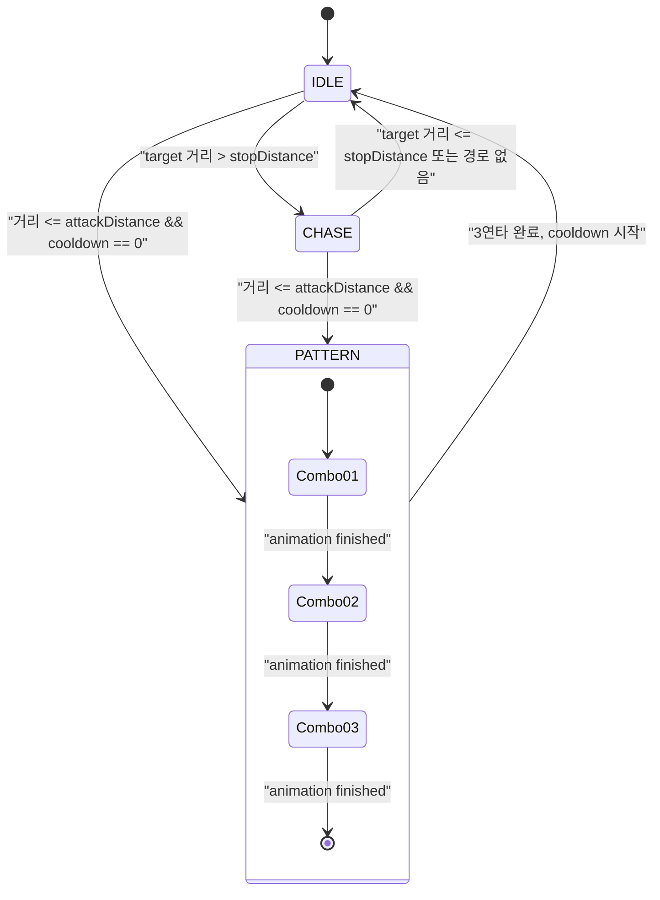
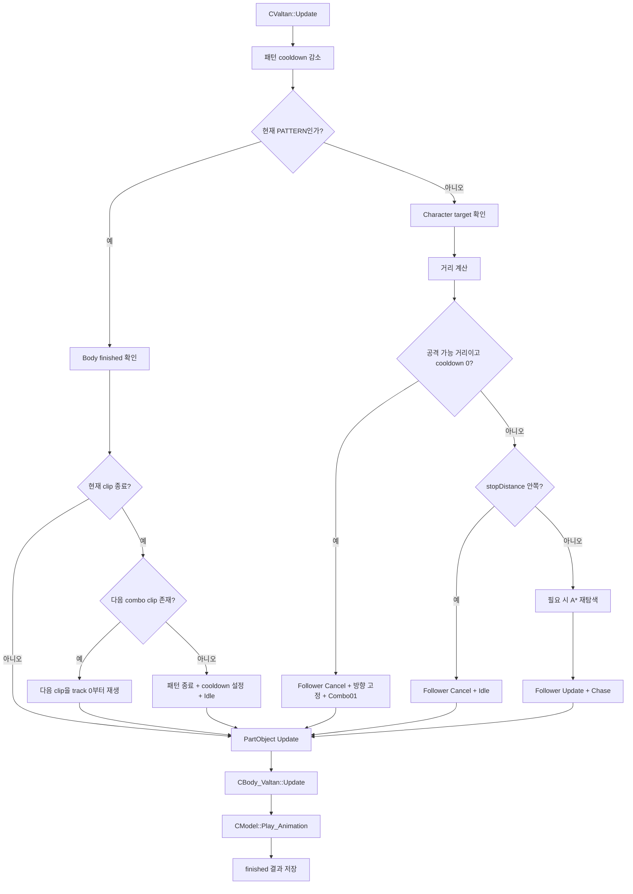

# LostArk 발탄 보스 패턴 1차 구현 계획서

> 작성일: 2026-07-31  
> 기준 브랜치: `codex/valtan-nav-movement-architecture-plan`  
> 기준 커밋: `4096bdccaaf7b32ead89b5553e06fc0542b2d3e4`  
> 기준 상태: `HEAD == origin/main`, Character 좌클릭 이동과 Valtan 자동 추적 구현은 작업 트리에 반영된 상태  
> 문서 목적: Valtan 추적 위에 실제 보스 공격 패턴 하나를 안전하게 얹기 위한 구현 코드와 검증 절차 제시  
> 이번 구현 범위: `att_battle_2_01 → att_battle_2_02 → att_battle_2_03` 3연타, 추적/패턴 이동 제어권 분리, 반복 재생 안정화  

---

## C1. 목표

현재 `CValtan`은 Character를 찾아 A* 경로를 만들고 `CNavPathFollower`로 추적할 수 있다.
이번 단계에서는 그 추적 흐름 위에 다음 한 사이클을 완성한다.

```text
Character가 멀리 있음
  → Valtan이 NavPathFollower로 추적
  → 공격 거리 진입
  → 추적 경로 즉시 취소
  → Character 방향을 한 번 바라봄
  → 발탄 3연타 애니메이션 순서대로 재생
  → 패턴 종료
  → 쿨다운
  → Character 위치를 다시 평가해 추적 또는 다음 공격
```

이번 계획의 핵심은 “공격 애니메이션을 하나 더 재생한다”가 아니다.
일반 이동과 보스 패턴 사이의 **Transform 제어권**을 명확히 나누는 것이다.

```text
CValtan
  ├─ 판단: 추적할지, 멈출지, 패턴을 시작할지
  ├─ 제어권: 추적 경로 취소, 패턴 단계 전환
  └─ 명령: Body에 재생할 애니메이션 전달

CNavPathFollower
  └─ 일반 추적 상태에서 Waypoint를 따라 Transform 이동

CBody_Valtan
  ├─ 지정된 애니메이션 재생
  └─ non-loop 애니메이션 종료 여부 보고
```

---

## C2. C1~C8 관점

| 관점 | 이번 설계에 적용한 내용 | 중요도 |
|---|---|---:|
| C1 기준계 | 거리 단위는 월드 미터, 시간 단위는 초, 애니메이션 진행은 WANIM tick/tick-per-second를 그대로 사용한다. | ★★★ |
| C2 이동>계산 | 공격 중에는 A*와 Follower 갱신을 멈추고, 애니메이션 종료 신호만 소비한다. | ★★★ |
| C3 공유는 비싸다 | NavGrid 원본만 공유하고, Valtan의 Follower·패턴 상태·애니메이션 재생 상태는 clone별로 가진다. | ★★★ |
| C4 수명은 선언된다 | `CValtan`이 `shared_ptr<CBody_Valtan>`을 소유하고, Body는 부모 상태 포인터를 보관하지 않는다. | ★★★ |
| C5 이산화와 오차 | 패턴 종료는 프레임 수나 임의 타이머가 아니라 실제 `Play_Animation()` 종료값으로 판정한다. | ★★★ |
| C6 가지치기 | 패턴 중에는 target 거리 계산·repath·Follower update를 조기에 건너뛴다. | ★★★ |
| C7 권위와 정합성 | 행동 상태의 정본은 `CValtan`, 현재 애니메이션의 정본은 `CBody_Valtan::CModel`이다. | ★★★ |
| C8 검증이 병목 | 첫 실행뿐 아니라 같은 3연타의 두 번째 반복이 처음부터 정상 재생되는지를 필수 검증한다. | ★★★ |

---

## C3. 현재 코드와 자산에서 확인한 사실

### C3-1. 현재 추적 흐름

현재 작업 트리의 흐름은 다음과 같다.

```text
CLevel_AssetTest
  ├─ Character 생성
  ├─ Character Transform을 Valtan 생성 인자로 전달
  └─ LMB Picking 결과는 Character::Request_Move()에만 전달

CCharacter
  ├─ 전용 CNavigation clone
  ├─ 전용 CNavPathFollower
  └─ 좌클릭 목적지 이동

CValtan
  ├─ Character Transform weak_ptr
  ├─ 전용 CNavigation clone
  ├─ 전용 CNavPathFollower
  └─ 0.35초마다 필요할 때만 목표 경로 재탐색
```

따라서 보스 패턴을 `CLevel_AssetTest`나 `CNavPathFollower`에 넣을 이유가 없다.
패턴 판단은 Valtan 자신의 행동이므로 `CValtan`이 가져야 한다.

### C3-2. 현재 Valtan 애니메이션 소비 구조

현재 `CValtan`과 `CBody_Valtan`은 애니메이션 책임을 나눠 가진 상태다.

```text
CValtan::Set_ChaseState()
  └─ Body의 CModel에 직접 Set_Animation()

CBody_Valtan::Update()
  └─ 부모 state bit가 IDLE 또는 CHASE일 때 Play_Animation()
```

이 구조는 Idle/Chase 두 상태에서는 동작하지만 패턴을 추가하면 문제가 생긴다.

```text
PATTERN 상태 추가
  → Body의 기존 bit 조건에는 포함되지 않음
  → 공격 animation을 선택해도 Play_Animation()이 호출되지 않음
```

단순히 `PATTERN` bit를 Body 조건에 추가할 수도 있지만, 그러면 Body가
Valtan의 행동 상태가 늘어날 때마다 계속 수정되어야 한다.

이번 계획에서는 다음처럼 정리한다.

```text
Body는 부모의 행동 상태를 해석하지 않는다.
Body는 현재 선택된 animation을 매 프레임 재생한다.
Valtan은 Body가 보고한 종료값으로 다음 패턴 단계만 결정한다.
```

### C3-3. 실제 MN_RPBF_01 공격 애니메이션

`Client/Bin/Resources/LostArk/Character/MN_RPBF_01/anims`의 WANIM 헤더를
직접 확인한 결과는 다음과 같다.

| 묶음 | 클립 | 재생 시간 |
|---|---|---:|
| Battle 2 | `att_battle_2_01` | 3.000초 |
| Battle 2 | `att_battle_2_02` | 1.200초 |
| Battle 2 | `att_battle_2_03` | 2.100초 |
| Battle 4 | `att_battle_4_01` | 4.733초 |
| Battle 4 | `att_battle_4_02` | 2.000초 |
| Battle 7 | `att_battle_7_01` | 6.067초 |
| Battle 7 | `att_battle_7_02` | 1.200초 |
| Battle 7 | `att_battle_7_03` | 2.000초 |
| Battle 19 | `att_battle_19_01` ~ `19_06` | 0.333~5.000초 |
| Battle 20 | `att_battle_20_01` ~ `20_04` | 0.533~2.500초 |

원본 액션 데이터인 다음 파일에도 Battle 2의 연속 스테이지가 존재한다.

```text
Client/Bin/Resources/LostArk/SourceData/LPK/data3/
EFGame_Extra/ClientData/XmlData/Action/MN_RPBF_01-1.loa
```

이번 1차 패턴은 가장 명확한 3단 묶음인 다음 순서를 사용한다.

```cpp
att_battle_2_01
att_battle_2_02
att_battle_2_03
```

총 애니메이션 길이는 약 6.3초다.

### C3-4. CModel 재생 계약에서 주의할 점

현재 `CModel::Set_Animation()`은 현재 animation index와 loop 여부만 바꾼다.
해당 animation의 track position을 0으로 되돌리지는 않는다.

```cpp
bool_t CModel::Set_Animation(const char_t* pAnimationName, bool_t isLoop)
{
    ...
    m_iCurrentAnimIndex = i;
    m_isAnimLoop = isLoop;
    return true;
}
```

따라서 같은 non-loop 공격을 두 번째 실행할 때 다음 문제가 생길 수 있다.

```text
첫 번째 3연타 종료
  → 각 공격 clip의 track position이 끝에 남음

두 번째 3연타 시작
  → Set_Animation만 호출
  → 이전 끝 위치에서 다시 시작
  → 첫 프레임에 즉시 finished
```

공격 재생 API에서는 반드시 다음 두 호출이 한 계약이어야 한다.

```cpp
m_pModelCom->Set_Animation(pAnimationName, isLoop);
m_pModelCom->Set_AnimTrackPosition(
    m_pModelCom->Get_CurrentAnimIndex(),
    0.f);
```

Engine의 전역 `CModel::Set_Animation()` 의미를 바꾸면 다른 preview와 animation
소비자에게 영향을 줄 수 있다. 이번에는 `CBody_Valtan::Set_Animation()` 안에서만
명시적으로 처음부터 재생한다.

### C3-5. 현재 Character에는 전투 피격 계약이 없다

현재 AssetTest의 실제 대상은 `CPlayer`가 아니라 새 공통 `CCharacter`다.
`CCharacter`에는 아직 다음 기능이 없다.

```text
HP
Hurt Collider
TakeDamage()
무적 시간
경직/다운 상태
보스 공격별 중복 피격 방지
```

따라서 이번 패턴에 가짜 거리 판정이나 사용되지 않는 damage 값을 끼워 넣지 않는다.
1차 완료 기준은 다음까지다.

```text
추적 → 공격 거리 판정 → 추적 취소
→ 실제 3연타 재생 → 정상 종료 → 다시 추적
```

피격과 데미지는 Character 전투 계약을 먼저 정의한 뒤 별도 단계에서 연결한다.

---

## C4. 문제 해결 ①~⑤

### ① 문제: 추적과 패턴이 동시에 Transform을 움직일 수 있다

공격 중에도 `m_PathFollower.Update()`를 호출하면 Valtan은 공격 animation을
재생하면서 Character 쪽으로 미끄러진다.

해결:

```cpp
bool_t CValtan::Begin_AxeCombo(fvector_t vTargetPosition)
{
    ...
    Stop_Chase();
    ...
    m_eState = VALTAN_STATE::PATTERN;
    return true;
}
```

`Stop_Chase()`는 현재 Waypoint와 마지막 목표를 모두 비운다.
패턴 상태에서는 `CNavPathFollower::Update()` 경로 자체로 진입하지 않는다.

### ② 문제: Body가 Valtan state bit를 해석한다

Body가 `IDLE | CHASE | PATTERN | ...`을 계속 알아야 하면 행동 상태와 렌더 파트가
강하게 결합된다.

해결:

```text
기존
CBody_Valtan
  → CValtan::VALTAN_STATE bit를 읽음

변경
CBody_Valtan
  → 현재 animation을 재생
  → 끝났는지만 보고
```

`BODY_VALTAN_DESC::pParentState`와 `m_pParentState`는 제거한다.

### ③ 문제: 누가 animation을 선택하고 누가 끝을 판정하는지 분산돼 있다

현재는 Valtan이 `CModel::Set_Animation()`을 직접 호출하고 Body가
`CModel::Play_Animation()`을 호출한다.

해결:

```cpp
class CBody_Valtan
{
public:
    bool_t Set_Animation(const char_t* pAnimationName, bool_t isLoop);
    bool_t Is_AnimationFinished() const;
};
```

Valtan은 구체 `CModel` 포인터 대신 `CBody_Valtan`을 소유한다.

```text
CValtan
  → "att_battle_2_01을 non-loop로 시작"

CBody_Valtan
  → track 0 초기화
  → 매 프레임 재생
  → finished 저장
```

### ④ 문제: 패턴을 타이머로만 연결하면 자산 길이와 어긋난다

`3.0초 뒤 다음 단계`를 별도 하드코딩하면 animation play rate나 자산 변경 때
상태 전이가 어긋난다.

해결:

```cpp
if (m_pBodyPart->Is_AnimationFinished())
{
    ++m_iPatternStep;
    Play_AxeComboStep();
}
```

공격 범위와 패턴 재사용 간격만 gameplay 값으로 두고, 각 단계의 길이는
실제 animation 종료값을 따른다.

### ⑤ 문제: 지금 범용 BossPattern 프레임워크를 만들면 소비자가 하나뿐이다

아직 Valtan 한 개, 실제 패턴 한 개, 전투 판정 없음 상태다.
지금 `IBossPattern`, Factory, JSON schema, Blackboard를 만들면 검증되지 않은
추상화가 먼저 생긴다.

해결:

```text
1차
  CValtan 내부의 작은 상태 머신 + 실제 3연타 하나

2차 진입 조건
  이동 방식이 다른 두 번째 패턴이 실제로 연결될 때

그때 검토
  패턴별 클래스로 분리할지
  데이터 정의를 둘지
  공통 hit window 계약을 둘지
```

이번에는 새 C++ 파일을 만들지 않고 `CValtan`과 `CBody_Valtan`만 수정한다.

---

## C5. 최종 소유권

| 계층 | 소유하는 것 | 소유하지 않는 것 |
|---|---|---|
| `CLevel_AssetTest` | Character LMB 명령, 테스트 객체 생성 | Valtan 패턴 선택 |
| `CCharacter` | 플레이어 이동 의도, 플레이어 Navigation/Follower | Valtan AI |
| `CValtan` | target 평가, 추적/패턴 상태, 패턴 단계, 쿨다운 | animation 내부 tick 계산 |
| `CNavPathFollower` | Waypoint와 현재 진행 index, 일반 경로 추종 | 공격 종류, 공격 거리, 쿨다운 |
| `CBody_Valtan` | Valtan model, animation 재생, 종료 여부 | target, A*, 패턴 선택 |
| `CModel` | animation clip과 track position | 보스 행동 상태 |

가장 중요한 규칙은 다음 하나다.

```text
한 프레임에 Valtan Transform을 움직일 수 있는 주체는 하나다.
```

이번 3연타는 제자리 패턴이므로:

```text
CHASE 상태   → CNavPathFollower가 Transform 이동
PATTERN 상태 → 누구도 Transform 위치를 이동하지 않음
```

나중에 돌진 패턴을 추가한다면:

```text
PATTERN 상태 → 돌진 패턴 코드만 Transform 이동
```

이때도 Follower는 반드시 취소된 상태여야 한다.

---

## C6. 최종 상태 흐름



프레임 흐름은 다음과 같다.



`CValtan::Update()`가 먼저 실행되고 `__super::Update()`에서 Body가 실행되므로,
Body의 종료값은 다음 프레임 Valtan이 소비한다.
이는 최대 한 프레임의 상태 확인 지연이며, 다음 clip은 그 프레임 Body update에서
바로 재생되므로 중간에 Idle animation이 삽입되지 않는다.

---

## C7. 자료구조와 알고리즘

### C7-1. 행동 상태

```cpp
enum class VALTAN_STATE : uint32_t
{
    IDLE,
    CHASE,
    PATTERN,
};
```

bit mask가 아니다. 동시에 두 행동 상태를 가질 수 없으므로 상호 배타 enum이 맞다.

### C7-2. 현재 패턴

```cpp
enum class VALTAN_PATTERN : uint32_t
{
    NONE,
    AXE_COMBO,
};
```

`PATTERN`은 상위 행동 상태이고 `AXE_COMBO`는 현재 실행 중인 구체 패턴이다.
지금은 하나뿐이지만 두 값은 의미가 다르므로 분리한다.

### C7-3. 패턴 단계

```cpp
constexpr array<const char_t*, 3> AXE_COMBO_CLIPS
{
    "att_battle_2_01",
    "att_battle_2_02",
    "att_battle_2_03",
};
```

단계 index만 저장한다.

```cpp
uint32_t m_iPatternStep = {};
```

별도 단계별 duration은 저장하지 않는다.

### C7-4. 1차 gameplay 값

```cpp
f32_t m_fAttackDistance = { 3.f };
f32_t m_fPatternInterval = { 2.f };
f32_t m_fPatternCooldown = {};
```

- `m_fAttackDistance`: 이 거리 안이고 cooldown이 0이면 3연타 시작.
- `m_fPatternInterval`: 3연타가 완전히 끝난 뒤 다음 패턴까지의 최소 시간.
- `m_fPatternCooldown`: clone별 현재 남은 시간.

이 수치는 1차 검증용 하드코딩이다.
실제 감각이 확인된 뒤 기존
`2026-07-31_LOSTARK_VALTAN_TUNING_DIRECTION_PLAN.md`의 tuning data로 이동한다.

### C7-5. 패턴 선택 우선순위

```text
1. 이미 PATTERN이면 그 패턴을 끝까지 진행
2. target과 Navigation 유효성 확인
3. 공격 거리 + cooldown 검사
4. stop distance 검사
5. 일반 chase
```

패턴 상태를 가장 먼저 검사하므로 Character가 공격 도중 멀어져도
3연타는 중간 취소되지 않는다. 이는 첫 패턴의 의도적인 규칙이다.

```text
공격 시작 시 target 방향 고정
공격 도중 target 재조준 없음
공격 종료 후 target 위치 재평가
```

플레이어가 보고 피할 수 있는 기본 패턴이 되며, 추적 공격처럼 계속 회전하는 문제를 막는다.

---

## C8. 변경 파일

| 구분 | 파일 | 변경 내용 |
|---|---|---|
| 수정 | `Client/Public/Body_Valtan.h` | 부모 state 포인터 제거, animation 명령/종료 API 추가 |
| 수정 | `Client/Private/Body_Valtan.cpp` | animation 상시 갱신, track 0 초기화, finished 저장 |
| 수정 | `Client/Public/Valtan.h` | 상호 배타 상태, 패턴 상태와 3연타 함수 추가 |
| 수정 | `Client/Private/Valtan.cpp` | chase와 pattern 분기, 3연타 순차 재생 구현 |
| 변경 없음 | `Client/Client.vcxproj` | 새 C++ 파일 없음 |
| 변경 없음 | `Client/Client.vcxproj.filters` | 새 C++ 파일 없음 |
| 변경 없음 | `Engine/*` | 범용 Model/Navigation 계약은 수정하지 않음 |
| 변경 없음 | `Client/Private/Level_AssetTest.cpp` | LMB는 계속 Character에만 전달 |

삭제 파일은 없다.

---

## C9. 최종 코드

아래 코드는 각 파일의 **전체 교체안**이다.

### C9-1. `Client/Public/Body_Valtan.h`

```cpp
#pragma once

#include "Client_Defines.h"
#include "PartObject.h"

NS_BEGIN(Engine)
class CShader;
class CModel;
NS_END

NS_BEGIN(Client)

class CBody_Valtan final : public CPartObject
{
public:
    typedef struct tagBodyValtanDesc : public CPartObject::PARTOBJECT_DESC
    {
    } BODY_VALTAN_DESC;

private:
    CBody_Valtan(ComPtr<ID3D11Device> pDevice,
        ComPtr<ID3D11DeviceContext> pContext);
public:
    virtual ~CBody_Valtan();

public:
    bool_t Set_Animation(
        const char_t* pAnimationName,
        bool_t isLoop);
    bool_t Is_AnimationFinished() const {
        return m_isAnimationFinished;
    }

public:
    virtual HRESULT Initialize_Prototype() override;
    virtual HRESULT Initialize(void* pArg) override;
    virtual void Priority_Update(f32_t fTimeDelta) override;
    virtual void Update(f32_t fTimeDelta) override;
    virtual void Late_Update(f32_t fTimeDelta) override;
    virtual HRESULT Render() override;

private:
    shared_ptr<CShader> m_pShaderCom = { nullptr };
    shared_ptr<CModel> m_pModelCom = { nullptr };
    bool_t m_isAnimationFinished = { false };

private:
    HRESULT Ready_Components();
    HRESULT Bind_ShaderResources();

public:
    static unique_ptr<CBody_Valtan> Create(
        ComPtr<ID3D11Device> pDevice,
        ComPtr<ID3D11DeviceContext> pContext);
    virtual shared_ptr<CPrototype> Clone(void* pArg) override;
};

NS_END
```

### C9-2. `Client/Private/Body_Valtan.cpp`

```cpp
#include "Body_Valtan.h"

#include "GameInstance.h"
#include "Model.h"

CBody_Valtan::CBody_Valtan(ComPtr<ID3D11Device> pDevice,
    ComPtr<ID3D11DeviceContext> pContext)
    : CPartObject { pDevice, pContext }
{
}

CBody_Valtan::~CBody_Valtan()
{
}

bool_t CBody_Valtan::Set_Animation(
    const char_t* pAnimationName,
    bool_t isLoop)
{
    if (nullptr == m_pModelCom ||
        nullptr == pAnimationName ||
        false == m_pModelCom->Set_Animation(
            pAnimationName,
            isLoop))
        return false;

    const uint32_t iAnimationIndex =
        m_pModelCom->Get_CurrentAnimIndex();
    if (false == m_pModelCom->Set_AnimTrackPosition(
        iAnimationIndex,
        0.f))
        return false;

    m_isAnimationFinished = false;
    return true;
}

HRESULT CBody_Valtan::Initialize_Prototype()
{
    return S_OK;
}

HRESULT CBody_Valtan::Initialize(void* pArg)
{
    if (nullptr == pArg)
        return E_FAIL;

    if (FAILED(__super::Initialize(pArg)) ||
        FAILED(Ready_Components()))
        return E_FAIL;

    /* The source model faces a different forward axis than Engine LOOK(+Z). */
    m_pTransformCom->Rotation(0.f, -90.f, 0.f);

    if (false == Set_Animation("idle_battle_1", true))
        return E_FAIL;

    return S_OK;
}

void CBody_Valtan::Priority_Update(f32_t fTimeDelta)
{
}

void CBody_Valtan::Update(f32_t fTimeDelta)
{
    m_isAnimationFinished =
        m_pModelCom->Play_Animation(fTimeDelta);

    __super::Update_CombinedWorldMatrix(
        XMLoadFloat4x4(
            m_pTransformCom->Get_WorldMatrixPtr()));
}

void CBody_Valtan::Late_Update(f32_t fTimeDelta)
{
    CGameInstance::Get().Add_RenderObject(
        RENDERGROUP::NONBLEND,
        static_pointer_cast<CGameObject>(
            shared_from_this()));
}

HRESULT CBody_Valtan::Render()
{
    if (FAILED(Bind_ShaderResources()))
        return E_FAIL;

    for (uint32_t i = 0;
        i < m_pModelCom->Get_NumMeshes();
        ++i)
    {
        const uint32_t hasNormalTexture =
            m_pModelCom->Has_MaterialTexture(
                i,
                aiTextureType_NORMALS) ?
            1u : 0u;

        if (FAILED(m_pModelCom->Bind_Material(
            m_pShaderCom,
            "g_DiffuseTexture",
            i,
            aiTextureType_DIFFUSE,
            0)) ||
            FAILED(m_pShaderCom->Bind_RawValue(
                "g_HasNormalTexture",
                &hasNormalTexture,
                sizeof(hasNormalTexture))) ||
            (0 != hasNormalTexture &&
                FAILED(m_pModelCom->Bind_Material(
                    m_pShaderCom,
                    "g_NormalTexture",
                    i,
                    aiTextureType_NORMALS,
                    0))) ||
            FAILED(m_pModelCom->Bind_BoneMatrices(
                m_pShaderCom,
                "g_BoneMatrices",
                i)) ||
            FAILED(m_pShaderCom->Begin(0)) ||
            FAILED(m_pModelCom->Render(i)))
            return E_FAIL;
    }

    return S_OK;
}

HRESULT CBody_Valtan::Ready_Components()
{
    if (FAILED(__super::Add_Component(
        ETOUI(LEVEL::ASSET_TEST),
        TEXT("Prototype_Component_Shader_VtxAnimMeshBinary"),
        TEXT("Com_Shader"),
        m_pShaderCom)))
        return E_FAIL;

    if (FAILED(__super::Add_Component(
        ETOUI(LEVEL::ASSET_TEST),
        TEXT("Prototype_Component_Model_Valtan"),
        TEXT("Com_Model"),
        m_pModelCom)))
        return E_FAIL;

    return S_OK;
}

HRESULT CBody_Valtan::Bind_ShaderResources()
{
    if (FAILED(__super::Bind_WorldMatrix(
        m_pShaderCom,
        "g_WorldMatrix")) ||
        FAILED(CGameInstance::Get().Bind_Transform(
            m_pShaderCom,
            "g_ViewMatrix",
            D3DTS::VIEW)) ||
        FAILED(CGameInstance::Get().Bind_Transform(
            m_pShaderCom,
            "g_ProjMatrix",
            D3DTS::PROJ)))
        return E_FAIL;

    return S_OK;
}

unique_ptr<CBody_Valtan> CBody_Valtan::Create(
    ComPtr<ID3D11Device> pDevice,
    ComPtr<ID3D11DeviceContext> pContext)
{
    auto pInstance = unique_ptr<CBody_Valtan>(
        new CBody_Valtan(pDevice, pContext));

    if (FAILED(pInstance->Initialize_Prototype()))
    {
        MSG_BOX("Failed to Created : CBody_Valtan");
        return nullptr;
    }

    return pInstance;
}

shared_ptr<CPrototype> CBody_Valtan::Clone(void* pArg)
{
    auto pInstance = shared_ptr<CBody_Valtan>(
        new CBody_Valtan(*this));

    if (FAILED(pInstance->Initialize(pArg)))
    {
        MSG_BOX("Failed to Cloned : CBody_Valtan");
        return nullptr;
    }

    return pInstance;
}
```

### C9-3. `Client/Public/Valtan.h`

```cpp
#pragma once

#include "Client_Defines.h"
#include "ContainerObject.h"
#include "NavPathFollower.h"

NS_BEGIN(Engine)
class CNavigation;
class CTransform;
NS_END

NS_BEGIN(Client)

class CBody_Valtan;

class CValtan final : public CContainerObject
{
public:
    typedef struct tagValtanDesc :
        public CContainerObject::CONTAINEROBJECT_DESC
    {
        const tchar_t* pNavigationPrototypeTag = { nullptr };
        shared_ptr<CTransform> pTargetTransform = { nullptr };
        float3_t vPosition = {};
    } VALTAN_DESC;

    enum class VALTAN_STATE : uint32_t
    {
        IDLE,
        CHASE,
        PATTERN,
    };

    enum class VALTAN_PATTERN : uint32_t
    {
        NONE,
        AXE_COMBO,
    };

private:
    CValtan(ComPtr<ID3D11Device> pDevice,
        ComPtr<ID3D11DeviceContext> pContext);
public:
    virtual ~CValtan();

public:
    virtual HRESULT Initialize_Prototype() override;
    virtual HRESULT Initialize(void* pArg) override;
    virtual void Priority_Update(f32_t fTimeDelta) override;
    virtual void Update(f32_t fTimeDelta) override;
    virtual void Late_Update(f32_t fTimeDelta) override;
    virtual HRESULT Render() override;

    VALTAN_STATE Get_State() const {
        return m_eState;
    }
    VALTAN_PATTERN Get_Pattern() const {
        return m_ePattern;
    }
    uint32_t Get_PatternStep() const {
        return m_iPatternStep;
    }
    PATH_RESULT_CODE Get_PathResult() const {
        return m_PathFollower.Get_LastResult();
    }
    uint32_t Get_PathExpandedNodes() const {
        return m_PathFollower.Get_LastExpandedNodes();
    }
    uint32_t Get_PathWaypointCount() const {
        return m_PathFollower.Get_NumWaypoints();
    }

#ifdef _DEBUG
    void Set_NavigationDebugVisible(bool_t isVisible) {
        m_isNavigationDebugVisible = isVisible;
    }
#endif

private:
    VALTAN_STATE m_eState = { VALTAN_STATE::IDLE };
    VALTAN_PATTERN m_ePattern = {
        VALTAN_PATTERN::NONE
    };
    uint32_t m_iPatternStep = {};

    f32_t m_fMoveSpeed = { 3.f };
    f32_t m_fRepathTime = {};
    f32_t m_fStopDistance = { 2.5f };
    f32_t m_fAttackDistance = { 3.f };
    f32_t m_fPatternInterval = { 2.f };
    f32_t m_fPatternCooldown = {};

    bool_t m_hasLastPathGoal = { false };
    float3_t m_vLastPathGoal = {};
    wstring_t m_strNavigationPrototypeTag;
    weak_ptr<CTransform> m_pTargetTransform;

    shared_ptr<CNavigation> m_pNavigationCom = {
        nullptr
    };
    shared_ptr<CBody_Valtan> m_pBodyPart = {
        nullptr
    };
    CNavPathFollower m_PathFollower;

#ifdef _DEBUG
    bool_t m_isNavigationDebugVisible = { false };
#endif

private:
    HRESULT Ready_PartObjects();
    HRESULT Ready_Components();

    void Update_Chase(
        f32_t fTimeDelta,
        fvector_t vTargetPosition);
    PATH_RESULT_CODE Request_PathToTarget(
        fvector_t vGoalPosition);
    void Stop_Chase();
    void Set_LocomotionState(bool_t isChasing);

    bool_t Begin_AxeCombo(fvector_t vTargetPosition);
    void Update_Pattern();
    bool_t Play_AxeComboStep();
    void Finish_Pattern();

public:
    static unique_ptr<CValtan> Create(
        ComPtr<ID3D11Device> pDevice,
        ComPtr<ID3D11DeviceContext> pContext);
    virtual shared_ptr<CPrototype> Clone(void* pArg) override;
};

NS_END
```

### C9-4. `Client/Private/Valtan.cpp`

```cpp
#include "Valtan.h"

#include "Body_Valtan.h"
#include "GameInstance.h"
#include "Navigation.h"
#include "Transform.h"

#include <array>

namespace
{
    constexpr array<const char_t*, 3> AXE_COMBO_CLIPS
    {
        "att_battle_2_01",
        "att_battle_2_02",
        "att_battle_2_03",
    };

    constexpr f32_t REPATH_INTERVAL = 0.35f;
    constexpr f32_t REPATH_GOAL_DELTA_SQ = 0.25f;
}

CValtan::CValtan(ComPtr<ID3D11Device> pDevice,
    ComPtr<ID3D11DeviceContext> pContext)
    : CContainerObject { pDevice, pContext }
{
}

CValtan::~CValtan()
{
}

HRESULT CValtan::Initialize_Prototype()
{
    return S_OK;
}

HRESULT CValtan::Initialize(void* pArg)
{
    VALTAN_DESC desc{};
    desc.fSpeedPerSec = 3.f;
    desc.fRotationPerSec = 180.f;

    if (nullptr != pArg)
    {
        desc = *static_cast<VALTAN_DESC*>(pArg);

        if (desc.fSpeedPerSec <= 0.f)
            desc.fSpeedPerSec = 3.f;
        if (desc.fRotationPerSec <= 0.f)
            desc.fRotationPerSec = 180.f;
    }

    m_fMoveSpeed = desc.fSpeedPerSec;
    m_pTargetTransform = desc.pTargetTransform;

    if (nullptr != desc.pNavigationPrototypeTag)
        m_strNavigationPrototypeTag =
            desc.pNavigationPrototypeTag;

    if (FAILED(__super::Initialize(&desc)))
        return E_FAIL;

    m_pTransformCom->Set_State(
        STATE::POSITION,
        XMVectorSet(
            desc.vPosition.x,
            desc.vPosition.y,
            desc.vPosition.z,
            1.f));

    if (FAILED(Ready_Components()))
        return E_FAIL;

    return Ready_PartObjects();
}

void CValtan::Priority_Update(f32_t fTimeDelta)
{
    __super::Priority_Update(fTimeDelta);
}

void CValtan::Update(f32_t fTimeDelta)
{
    if (m_fPatternCooldown > 0.f)
    {
        m_fPatternCooldown -= fTimeDelta;
        if (m_fPatternCooldown < 0.f)
            m_fPatternCooldown = 0.f;
    }

    /* A running pattern owns the behavior until its animation chain ends. */
    if (VALTAN_STATE::PATTERN == m_eState)
    {
        Update_Pattern();
        __super::Update(fTimeDelta);
        return;
    }

    if (nullptr == m_pNavigationCom)
    {
        Stop_Chase();
        Set_LocomotionState(false);
        __super::Update(fTimeDelta);
        return;
    }

    shared_ptr<CTransform> pTargetTransform =
        m_pTargetTransform.lock();
    if (nullptr == pTargetTransform)
    {
        Stop_Chase();
        Set_LocomotionState(false);
        __super::Update(fTimeDelta);
        return;
    }

    const vector_t vPosition =
        m_pTransformCom->Get_State(STATE::POSITION);
    const vector_t vTargetPosition =
        pTargetTransform->Get_State(STATE::POSITION);
    const vector_t vHorizontalOffset =
        XMVectorSetY(vTargetPosition - vPosition, 0.f);
    const f32_t fTargetDistance = XMVectorGetX(
        XMVector3Length(vHorizontalOffset));

    if (m_fPatternCooldown <= 0.f &&
        fTargetDistance <= m_fAttackDistance &&
        Begin_AxeCombo(vTargetPosition))
    {
        __super::Update(fTimeDelta);
        return;
    }

    if (fTargetDistance <= m_fStopDistance)
    {
        Stop_Chase();
        Set_LocomotionState(false);
        __super::Update(fTimeDelta);
        return;
    }

    Update_Chase(fTimeDelta, vTargetPosition);
    __super::Update(fTimeDelta);
}

void CValtan::Late_Update(f32_t fTimeDelta)
{
    __super::Late_Update(fTimeDelta);

#ifdef _DEBUG
    if (m_isNavigationDebugVisible &&
        nullptr != m_pNavigationCom)
        CGameInstance::Get().Add_DebugComponent(
            m_pNavigationCom);
#endif
}

HRESULT CValtan::Render()
{
    return S_OK;
}

HRESULT CValtan::Ready_PartObjects()
{
    CBody_Valtan::BODY_VALTAN_DESC bodyDesc{};
    bodyDesc.pParentMatrix =
        m_pTransformCom->Get_WorldMatrixPtr();

    if (FAILED(__super::Add_PartObject(
        ETOUI(LEVEL::ASSET_TEST),
        TEXT("Prototype_GameObject_Body_Valtan"),
        TEXT("Part_Body"),
        &bodyDesc)))
        return E_FAIL;

    const auto iter = m_PartObjects.find(
        TEXT("Part_Body"));
    if (iter == m_PartObjects.end())
        return E_FAIL;

    m_pBodyPart =
        dynamic_pointer_cast<CBody_Valtan>(
            iter->second);

    return nullptr != m_pBodyPart ?
        S_OK : E_FAIL;
}

HRESULT CValtan::Ready_Components()
{
    if (m_strNavigationPrototypeTag.empty())
        return S_OK;

    return __super::Add_Component(
        ETOUI(LEVEL::ASSET_TEST),
        m_strNavigationPrototypeTag,
        TEXT("Com_Navigation"),
        m_pNavigationCom);
}

void CValtan::Update_Chase(
    f32_t fTimeDelta,
    fvector_t vTargetPosition)
{
    m_fRepathTime -= fTimeDelta;
    if (m_fRepathTime <= 0.f)
    {
        float3_t vCurrentGoal{};
        XMStoreFloat3(
            &vCurrentGoal,
            vTargetPosition);

        const f32_t fGoalDeltaX =
            vCurrentGoal.x - m_vLastPathGoal.x;
        const f32_t fGoalDeltaZ =
            vCurrentGoal.z - m_vLastPathGoal.z;
        const bool_t isNewGoal =
            false == m_hasLastPathGoal ||
            fGoalDeltaX * fGoalDeltaX +
                fGoalDeltaZ * fGoalDeltaZ >=
                REPATH_GOAL_DELTA_SQ ||
            false == m_PathFollower.Has_Path();

        if (isNewGoal)
        {
            const PATH_RESULT_CODE eResult =
                Request_PathToTarget(vTargetPosition);

            if (PATH_RESULT_CODE::SUCCESS == eResult)
            {
                m_vLastPathGoal = vCurrentGoal;
                m_hasLastPathGoal = true;
            }
            else
            {
                Stop_Chase();
            }
        }

        m_fRepathTime = REPATH_INTERVAL;
    }

    m_PathFollower.Update(
        m_pTransformCom,
        m_fMoveSpeed,
        fTimeDelta);
    Set_LocomotionState(
        m_PathFollower.Has_Path());
}

PATH_RESULT_CODE CValtan::Request_PathToTarget(
    fvector_t vGoalPosition)
{
    if (nullptr == m_pNavigationCom ||
        nullptr == m_pTransformCom)
        return PATH_RESULT_CODE::INVALID_GRID;

    return m_PathFollower.Request_Path(
        m_pNavigationCom,
        m_pTransformCom->Get_State(
            STATE::POSITION),
        vGoalPosition);
}

void CValtan::Stop_Chase()
{
    m_PathFollower.Cancel();
    m_hasLastPathGoal = false;
    m_fRepathTime = 0.f;
}

void CValtan::Set_LocomotionState(bool_t isChasing)
{
    if (VALTAN_STATE::PATTERN == m_eState)
        return;

    const VALTAN_STATE eNextState =
        isChasing ?
        VALTAN_STATE::CHASE :
        VALTAN_STATE::IDLE;
    if (m_eState == eNextState)
        return;

    const char_t* pAnimationName =
        isChasing ?
        "run_battle_1" :
        "idle_battle_1";

    if (nullptr == m_pBodyPart ||
        false == m_pBodyPart->Set_Animation(
            pAnimationName,
            true))
        return;

    m_eState = eNextState;
}

bool_t CValtan::Begin_AxeCombo(
    fvector_t vTargetPosition)
{
    if (nullptr == m_pBodyPart ||
        false == m_pBodyPart->Set_Animation(
            AXE_COMBO_CLIPS[0],
            false))
        return false;

    Stop_Chase();

    const vector_t vPosition =
        m_pTransformCom->Get_State(STATE::POSITION);
    const vector_t vHorizontalTarget =
        XMVectorSetY(
            vTargetPosition,
            XMVectorGetY(vPosition));

    if (XMVectorGetX(XMVector3LengthSq(
        vHorizontalTarget - vPosition)) > 0.000001f)
        m_pTransformCom->LookAt(vHorizontalTarget);

    m_eState = VALTAN_STATE::PATTERN;
    m_ePattern = VALTAN_PATTERN::AXE_COMBO;
    m_iPatternStep = 0;
    return true;
}

void CValtan::Update_Pattern()
{
    if (VALTAN_PATTERN::AXE_COMBO != m_ePattern ||
        nullptr == m_pBodyPart)
    {
        Finish_Pattern();
        return;
    }

    if (false ==
        m_pBodyPart->Is_AnimationFinished())
        return;

    ++m_iPatternStep;
    if (m_iPatternStep >= AXE_COMBO_CLIPS.size())
    {
        Finish_Pattern();
        return;
    }

    if (false == Play_AxeComboStep())
        Finish_Pattern();
}

bool_t CValtan::Play_AxeComboStep()
{
    if (nullptr == m_pBodyPart ||
        m_iPatternStep >= AXE_COMBO_CLIPS.size())
        return false;

    return m_pBodyPart->Set_Animation(
        AXE_COMBO_CLIPS[m_iPatternStep],
        false);
}

void CValtan::Finish_Pattern()
{
    m_ePattern = VALTAN_PATTERN::NONE;
    m_iPatternStep = 0;
    m_fPatternCooldown = m_fPatternInterval;
    m_eState = VALTAN_STATE::IDLE;

    if (nullptr != m_pBodyPart)
        m_pBodyPart->Set_Animation(
            "idle_battle_1",
            true);
}

unique_ptr<CValtan> CValtan::Create(
    ComPtr<ID3D11Device> pDevice,
    ComPtr<ID3D11DeviceContext> pContext)
{
    auto pInstance = unique_ptr<CValtan>(
        new CValtan(pDevice, pContext));

    if (FAILED(pInstance->Initialize_Prototype()))
    {
        MSG_BOX("Failed to Created : CValtan");
        return nullptr;
    }

    return pInstance;
}

shared_ptr<CPrototype> CValtan::Clone(void* pArg)
{
    auto pInstance = shared_ptr<CValtan>(
        new CValtan(*this));

    if (FAILED(pInstance->Initialize(pArg)))
    {
        MSG_BOX("Failed to Cloned : CValtan");
        return nullptr;
    }

    return pInstance;
}
```

---

## C10. 코드 흐름 해설

### C10-1. 평소에는 기존 추적을 그대로 사용한다

```cpp
Update_Chase(fTimeDelta, vTargetPosition);
```

내부 흐름:

```text
0.35초 재탐색 시점 확인
  → target이 충분히 이동했는지 확인
  → CNavigation::Find_Path()
  → CPathFinder A*
  → CNavPathFollower에 Waypoint 저장
  → 매 프레임 Follower Update
```

### C10-2. 공격 거리에 들어오면 Follower를 먼저 끊는다

```cpp
if (m_fPatternCooldown <= 0.f &&
    fTargetDistance <= m_fAttackDistance &&
    Begin_AxeCombo(vTargetPosition))
```

`Begin_AxeCombo()`에서:

```cpp
Stop_Chase();
m_pTransformCom->LookAt(vHorizontalTarget);
m_eState = VALTAN_STATE::PATTERN;
```

따라서 공격 도중에는 이전 Waypoint가 남지 않는다.

### C10-3. Body는 첫 clip을 0부터 재생한다

```cpp
m_pModelCom->Set_Animation(
    pAnimationName,
    isLoop);
m_pModelCom->Set_AnimTrackPosition(
    m_pModelCom->Get_CurrentAnimIndex(),
    0.f);
```

이 초기화가 첫 실행과 두 번째 실행의 동작을 동일하게 만든다.

### C10-4. Valtan은 종료 신호만 보고 다음 단계로 간다

```cpp
if (m_pBodyPart->Is_AnimationFinished())
{
    ++m_iPatternStep;
    Play_AxeComboStep();
}
```

단계별 타이머를 따로 가지지 않으므로 WANIM 길이가 바뀌어도
상태 전이는 실제 재생 종료에 맞춰진다.

### C10-5. 마지막 clip 뒤에는 Idle로 돌아간다

```cpp
m_fPatternCooldown = m_fPatternInterval;
m_eState = VALTAN_STATE::IDLE;
m_pBodyPart->Set_Animation(
    "idle_battle_1",
    true);
```

다음 프레임부터 target 거리를 다시 평가한다.

```text
Character가 멀어졌음 → Chase
Character가 가까움 + cooldown 남음 → Idle
Character가 가까움 + cooldown 종료 → 다음 3연타
```

---

## C11. 실패 처리

### 공격 clip 이름이 잘못된 경우

첫 clip 설정 실패:

```text
Begin_AxeCombo() == false
→ PATTERN으로 바뀌지 않음
→ 기존 chase/idle 흐름 유지
```

중간 clip 설정 실패:

```text
Play_AxeComboStep() == false
→ Finish_Pattern()
→ Idle 복구
→ cooldown 적용
```

### target이 패턴 도중 사라진 경우

패턴 진행은 target weak_ptr보다 먼저 처리한다.

```text
현재 3연타는 끝까지 재생
→ Idle 복귀
→ 다음 프레임 target lock 실패
→ 추적 없이 Idle 유지
```

### Navigation이 없는 경우

패턴이 시작되지 않은 상태에서는:

```text
Follower Cancel
→ Idle
```

이미 시작된 제자리 패턴은 Navigation 없이도 끝까지 재생할 수 있다.

---

## C12. 빌드 검증

새 C++ 파일이나 Engine public header 변경이 없으므로 프로젝트 XML 수정은 없다.
그래도 팀 규칙에 따라 전체 연결을 다음 순서로 검증한다.

```text
1. Engine x64 Debug
2. UpdateLib.bat Debug
3. Client x64 Debug

4. Engine x64 Release
5. UpdateLib.bat Release
6. Client x64 Release
```

검증 포인트:

```text
Client/Public/Body_Valtan.h 변경
  → Client 내부 public header이므로 EngineSDK 배포 대상 아님

Engine public header 변경 없음
  → ABI 변경 없음

새 파일 없음
  → Client.vcxproj / Client.vcxproj.filters 변경 없음
```

---

## C13. 실행 검증

### C13-1. 기본 추적

1. `Client.exe`를 실행한다.
2. AssetTest Level 진입을 확인한다.
3. Character와 Valtan이 둘 다 생성되는지 확인한다.
4. Character가 멀리 있으면 Valtan이 기존 NavGrid 경로로 추적하는지 확인한다.
5. Chase 동안 `run_battle_1`이 반복되는지 확인한다.

### C13-2. 첫 3연타

1. Character를 Valtan 공격 거리 3m 안으로 이동시킨다.
2. Valtan이 이동을 즉시 멈추는지 확인한다.
3. 공격 시작 방향이 Character를 향하는지 확인한다.
4. 다음 순서가 중간 Idle 없이 재생되는지 확인한다.

```text
att_battle_2_01
  → att_battle_2_02
  → att_battle_2_03
  → idle_battle_1
```

5. 약 6.3초 동안 Valtan 위치가 미끄러지지 않는지 확인한다.

### C13-3. 공격 도중 Character 이동

1. 첫 공격이 시작된 직후 Character를 LMB로 멀리 이동시킨다.
2. Valtan이 공격 도중 Character 쪽으로 회전하거나 미끄러지지 않는지 확인한다.
3. 3연타를 끝낸 뒤 Character의 새 위치로 A* 경로를 다시 만드는지 확인한다.

### C13-4. 같은 패턴 두 번째 실행

이 검증은 필수다.

1. 첫 3연타를 끝낸다.
2. Character를 가까이 유지한다.
3. 2초 cooldown 뒤 두 번째 3연타가 시작되는지 확인한다.
4. 두 번째 `att_battle_2_01`이 즉시 끝나지 않고 처음부터 3초 재생되는지 확인한다.
5. 02와 03도 동일하게 처음부터 재생되는지 확인한다.

이 검증이 통과해야 `Set_AnimTrackPosition(0.f)` 계약이 올바르게 적용된 것이다.

### C13-5. 경로 실패

1. Character를 NavGrid 밖 또는 도달 불가능한 위치로 이동시키는 실패 조건을 만든다.
2. Valtan이 이전 경로를 계속 따라가지 않는지 확인한다.
3. Idle animation으로 안전하게 복귀하는지 확인한다.
4. 다시 유효한 위치로 Character가 들어왔을 때 추적이 회복되는지 확인한다.

---

## C14. 이번 구현에서 하지 않는 것

다음 항목은 이번 코드에 미리 넣지 않는다.

```text
Character HP
Hurt Collider
실제 Damage 적용
공격 active frame 판정
Counter 판정
Stagger/Destruction
Effect spawn
Camera shake
Root Motion
돌진 Transform 이동
랜덤 패턴 선택
Phase 전환
Boss Pattern Factory
Boss 전용 범용 Engine 클래스
최종 tuning JSON schema
```

이 중 피격 판정은 다음 계약이 먼저 필요하다.

```text
CCharacter가 어떤 Collider를 Hurt 영역으로 공개할지
누가 TakeDamage를 받을지
한 패턴에서 같은 대상을 몇 번 맞힐 수 있는지
active window를 animation event로 읽을지 별도 data로 둘지
피격 시 이동/Follower를 취소할지
```

이 계약 없이 거리 비교만 넣으면 나중에 전투 시스템과 중복되는 두 번째 경로가 된다.

---

## C15. 후속 확장 순서

### 2차: Character 피격 계약

진입 조건:

```text
CCharacter의 HP/피격 상태/Hurt Collider 소유권 합의
```

그 뒤 3연타의 각 타격 active window를 실제 판정에 연결한다.

### 3차: 특수 이동 패턴

두 번째 실제 패턴으로 돌진 또는 점프를 선택할 때 검토한다.

```text
Begin
  → Follower Cancel
  → 시작 방향/목표 고정

Update
  → 패턴 전용 Transform 이동
  → NavGrid 이탈 방지

End
  → 일반 target 평가와 chase로 복귀
```

이때 서로 다른 두 패턴의 공통 코드가 확인되면 Pattern 클래스로 분리한다.

### 4차: Effect와 tuning

실제 pattern 소비자가 생긴 값만 기존 tuning 방향 문서에 추가한다.

```text
attackDistance
patternInterval
패턴 선택 weight
hit window
이펙트/사운드 event
phase별 허용 패턴
```

ImGui와 JSON은 패턴 로직의 소유자가 아니라 검증된 값을 전달하는 도구로 유지한다.

---

## C16. 완료 기준

다음이 모두 참일 때 1차 발탄 보스 패턴 구현이 완료된 것으로 본다.

- [ ] LMB 입력은 계속 Character 이동만 제어한다.
- [ ] Valtan은 Character를 자동 추적한다.
- [ ] 공격 거리 진입 시 기존 Follower 경로가 즉시 취소된다.
- [ ] Valtan이 공격 시작 순간 Character를 바라본다.
- [ ] `att_battle_2_01 → 02 → 03`이 순서대로 재생된다.
- [ ] 공격 도중 Valtan이 NavPathFollower 때문에 미끄러지지 않는다.
- [ ] Character가 공격 도중 움직여도 Valtan은 계속 재조준하지 않는다.
- [ ] 3연타 종료 후 Idle을 거쳐 target을 다시 평가한다.
- [ ] cooldown 뒤 같은 패턴의 두 번째 실행이 track 0부터 정상 재생된다.
- [ ] target/Navigation/clip 실패 시 Idle로 안전하게 복구한다.
- [ ] Debug Engine → UpdateLib → Client 빌드가 통과한다.
- [ ] Release Engine → UpdateLib → Client 빌드가 통과한다.
- [ ] AssetTest 실제 실행 검증이 통과한다.

---

## 결론

이번 단계의 가장 깔끔한 구조는 다음이다.

```text
CValtan
  = 보스의 판단과 이동 제어권 소유자

CNavPathFollower
  = 일반 추적 이동 실행자

CBody_Valtan
  = animation 재생과 종료 보고자

CCharacter
  = Valtan이 추적하는 target

CLevel_AssetTest
  = Character 좌클릭 명령과 테스트 조립
```

첫 패턴은 작은 기능처럼 보여도 다음 구조를 먼저 증명한다.

```text
일반 추적 제어권을 안전하게 놓는다.
→ 패턴이 자기 animation sequence를 끝낸다.
→ 일반 추적 제어권을 다시 돌려준다.
```

이 사이클이 안정된 뒤에 hit window, damage, effect, 돌진, phase를 한 층씩 추가해야
Valtan이 거대한 `Update()` 하나나 범용 Follower에 모든 책임을 몰아넣지 않게 된다.
