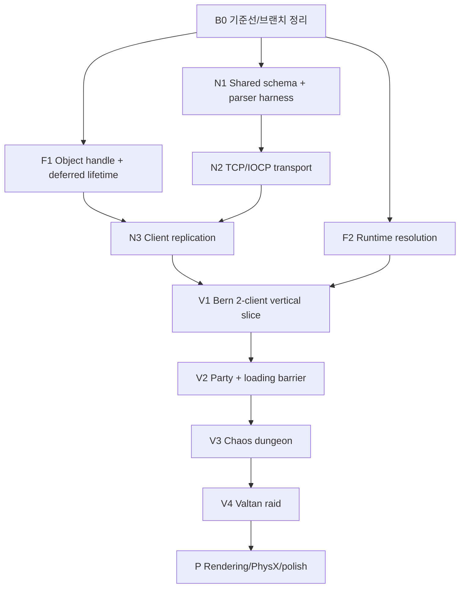

# 2026-08-01 LostArk Framework Foundation Master Plan

문서 유형: 시스템 이해 + 상위 구현 마스터 계획서  
출력 모드: `CODE_WITH_EXPLANATION`  
작성 목적: 팀장이 공용 기반의 순서와 owner를 확정하고 각 담당자가 기다리지 않고 작업하게 만드는 것  

```text
C1~C8: ON
문제 해결 ①~⑤: ON
자료구조·알고리즘: ON
```

이 문서는 여러 주의 작업을 묶는 상위 계획이다. 특정 C++ slice의 최종 코드를 확정하는 문서가 아니다. 각 source 구현에 착수하기 전에는 같은 날짜 폴더에 해당 slice의 코드 우선 계획서를 만들고, 새 파일 전문·기존 파일 교체 블록·`.vcxproj`·`.vcxproj.filters` 등록을 확정한다.

정본:

- [북극성](C:/Users/user/Desktop/LostArk/북극성.md)
- [원문 보존본](C:/Users/user/Desktop/LostArk/.md/GB/08-01/2026-08-01_LOSTARK_REFERENCE_TEAM_PORTFOLIO_RAW_TRANSCRIPT.md)
- [현재 프레임워크 설명](C:/Users/user/Desktop/LostArk/CLAUDE.md)

---

## 1. 결론부터: 무엇부터 할 것인가

```text
현재 build/dirty worktree 기준선
-> Object ID + 지연 수명
-> 런타임 해상도
-> Shared packet contract + headless parser
-> TCP/IOCP Server/Client adapter
-> SERVER_SELECT / CHARACTER_SELECT / BERN 수직 슬라이스
-> Party + loading barrier
-> CHAOS_DUNGEON
-> VALTAN_RAID
-> 고급 렌더/PhysX/강화 확장
```

질문에 대한 직접 답:

- **서버 먼저인가?** Server의 모든 기능이 아니라 `Shared 계약 + 접속/이름/이동/채팅` 수직 슬라이스를 먼저 만든다.
- **Manager부터 정리하는가?** Manager 목록 정리가 아니라 Object owner와 thread owner를 먼저 정한다. owner가 없는 기능에만 작은 service를 추가한다.
- **레벨부터 만드는가?** 빈 레벨 다섯 개를 먼저 만들지 않는다. 접속 흐름이 통과할 때 `SERVER_SELECT`, `CHARACTER_SELECT`, `BERN`을 추가한다.
- **팀원 unblock은 무엇인가?** 해상도 변경, 안전한 spawn/destroy, 안정 ID, typed command/event 네 개다.

현재 브랜치 `codex/valtan-nav-movement-architecture-plan`에는 Navigation/Valtan/MapTool/Engine 공용 파일을 포함한 대규모 미커밋 변경이 있다. Framework source 구현은 이 변경을 되돌리거나 섞지 말고, 현재 작업의 commit/handoff 후 별도 기능 브랜치와 PR로 진행한다.

---

## 2. 문제 해결 ①~⑤

① 문제·제약: 네 명이 Player/UI/Boss/Framework를 병렬 구현해야 하지만 현재 안정 runtime ID, 안전한 객체 파괴, network authority, resize, loading barrier가 없다. 기존 Prototype/Clone/Level/Layer와 `CModel → CMaterial` 경로는 유지해야 한다.  
② 단순 해법의 문제: Manager와 packet을 기능별로 먼저 많이 만들면 owner가 중복되고, IO worker가 GameObject를 직접 바꾸며, layer index와 pointer가 wire ID가 된다. 빈 레벨을 먼저 늘리면 Loader/enum/project 파일 충돌만 커진다.  
③ 해결 방식: Object 수명과 ID를 먼저 고정하고, pure Shared 계약을 경계로 TCP/IOCP transport와 30 Hz Room owner를 분리한다. 첫 vertical slice는 이름·spawn·이동·채팅이다.  
④ 비교: 현재 LostArk는 local Client 중심 Prototype/Layer OOP, Winters는 Shared/GameSim과 Server authority 중심이다. LostArk는 Winters의 의존 방향과 owner queue만 가져오며 ECS·UDP·거대 schema는 가져오지 않는다.  
⑤ 대가: Shared/Server project, code generation, queue, replication map이 추가된다. 대신 기능별 socket 코드와 Client/Server 이중 truth를 제거한다. TCP head-of-line이나 snapshot 비용이 실측 병목이 될 때만 UDP/delta를 재검토한다.

---

## 3. C1~C8 설계 판단

| 관점 | 이번 작업에 적용한 사실 | 중요도 |
|---|---|---:|
| C1 기준계 | wire는 UTF-8·고정 폭 수치·`NetEntityId/ZoneId`, Client는 DirectX 좌표·`LEVEL`; 변환 경계를 명시한다. | ★★★ |
| C2 이동>계산 | schema codegen, catalog validate, scene/collision cook은 build/authoring 단계에서 끝낸다. | ★★☆ |
| C3 공유는 비싸다 | Game world는 Room/Main thread 한 명만 쓰고 worker는 owned message만 공유한다. | ★★★ |
| C4 수명은 선언된다 | Prototype, Clone, Layer, NetEntity mapping, Session, Room, Transition의 owner와 파괴 순서를 정한다. | ★★★ |
| C5 이산화와 오차 | Server 30 Hz, Snapshot 15 Hz, Client 60 Hz 사이를 보간하고 root motion/float drift는 Server snapshot으로 보정한다. | ★★☆ |
| C6 가지치기 | envelope/schema/sequence/room state를 world mutation 전에 검증하고 invalid packet을 조기 폐기한다. | ★★★ |
| C7 권위와 정합성 | Server gameplay truth, Client presentation, Catalog definition, Placement scene source를 분리한다. | ★★★ |
| C8 검증이 병목 | Server log만으로 완료하지 않고 Client apply log와 실제 두 화면까지 확인한다. | ★★★ |

핵심 축: `C3 thread owner`, `C4 lifetime`, `C7 authority`, `C8 two-client proof`.

---

## 4. 현재 코드에서 반드시 보존할 것

| 현재 owner | 보존할 책임 | 확장 방식 |
|---|---|---|
| `CGameInstance` | Engine subsystem façade와 수명 | 범용 object/resize API만 추가; Client network를 소유시키지 않음 |
| `CPrototype_Manager` | 레벨별 Prototype 원본 | Network spawn도 기존 Clone을 사용 |
| `CObject_Manager` / `CLayer` | Client visual GameObject 소유와 Update | handle registry와 deferred mutation을 추가 |
| `CLevel_Manager` / `CLevel_Loading` | Client level 전환과 local load | stage/commit, progress, error를 추가 |
| `CRenderer` / `CTarget_Manager` | 화면 render target | viewport-relative target rebuild를 추가 |
| `CMainApp` Debug ToolHost | Map/Effect/Animation/HUD tool owner | 동일 owner 아래 settings/NPC/camera panel 연결 |
| `CModel → CMaterial` | 신규 model runtime | Server나 Tool이 legacy `CCookedModel` 경로를 늘리지 않음 |

새 Server simulation은 `CGameObject`를 재사용하지 않는다. 이는 중복 runtime이 아니라 process와 책임이 다른 authoritative model이다. Client visual object와 Server simulation entity는 `NetEntityId`로 연결한다.

---

## 5. Manager를 늘리지 않는 owner 설계

### 5.1 Engine

기존 owner를 확장한다.

| 책임 | owner |
|---|---|
| Prototype 원본 | `CPrototype_Manager` |
| Client GameObject/Layer/handle/deferred mutation | `CObject_Manager` |
| Level commit | `CLevel_Manager` |
| window/swapchain/backbuffer resize | `CGraphic_Device` |
| viewport-relative MRT rebuild | `CTarget_Manager` + `CRenderer` |

`CLifetimeManager`, `CResolutionManager`, `CSpawnManager`를 별도 singleton으로 만들지 않는다.

### 5.2 Client

`CMainApp`이 다음 application service를 `unique_ptr`로 소유한다.

| service | 역할 | 비역할 |
|---|---|---|
| `CClientNetwork` | socket adapter, send/inbound queue | GameObject/Level/UI mutation |
| `CClientReplication` | main thread에서 Snapshot/Event 적용 | socket/IOCP |
| `CLevelFlow` | `ZoneId ↔ LEVEL`, TransitionToken, loading barrier 표시 상태 | asset decode 자체 |

Chat/Party/UI마다 network manager를 만들지 않는다. `CClientReplication`이 typed event를 해당 ViewModel에 전달한다.

### 5.3 Server

첫 버전은 single room이므로 `CRoomManager`도 만들지 않는다.

```text
CServerApp
  owns CIOCPCore
  owns CSessionRegistry
  owns CGameRoom (1개)

CGameRoom
  owns PlayerState
  owns PartyService
  owns Dungeon/Encounter state
  owns AI state
  owns inbound command queue
```

다중 room 요구가 실제로 생길 때만 `CRoomRegistry`를 추가한다.

---

## 6. 자료구조 핵심

### 6.1 ObjectHandle

```text
이름과 타입: ObjectHandle { uint32 slot; uint32 generation; }
표현하는 상태: Client process 안의 한 Clone 수명
선택 이유: slot 재사용 뒤 stale observer가 새 객체를 가리키는 것을 generation으로 차단
owner: CObject_Manager
생성·파괴 시점: Layer commit 성공 시 생성, deferred destroy flush 시 invalidation
writer: CObject_Manager만
reader: Level, replication, controller, tool
불변식: 같은 slot이라도 generation이 다르면 다른 객체
초기 규모: active visual object 최대 4,096
빈도: frame마다 조회, 생성/파괴는 event 시점
```

### 6.2 ObjectMutationCommand

```text
이름과 타입: Spawn 또는 Destroy command의 frame-local vector
표현하는 상태: Update 순회가 끝난 안전 지점에 반영할 변경
선택 이유: list iterator invalidation과 재진입 제거
owner: CObject_Manager
writer: main thread caller만
reader: pre/post update Flush
불변식: Destroy는 한 handle당 idempotent, spawn 실패는 registry/layer를 남기지 않음
초기 규모: frame당 0~256 commands
```

### 6.3 PacketEnvelope

```text
이름과 타입: 16-byte packed header + FlatBuffers payload
표현하는 상태: TCP stream 안의 logical frame
owner: Shared wire contract
writer/reader: ClientNetwork, Server transport
불변식: magic/version/type/size 상한 검증 전 payload 접근 금지
상한: payload 64 KiB
```

### 6.4 IngressMessage

```text
이름과 타입: session id + packet type + sequence + owned byte vector/typed payload
표현하는 상태: IO thread에서 owner thread로 넘긴 한 메시지
owner: bounded MPSC queue, 소비 후 Room/Main thread
불변식: socket recv buffer를 참조하지 않고 bytes를 소유
초기 상한: 2,048 events 또는 4 MiB
```

### 6.5 ReplicationMap

```text
이름과 타입: unordered_map<NetEntityId, ObjectHandle>
표현하는 상태: Server entity와 Client visual Clone의 연결
owner: CClientReplication
writer: main thread replication apply만
reader: snapshot/event/UI/camera target resolver
불변식: active NetEntityId 하나당 active handle 최대 하나
초기 규모: room당 entity 최대 512
```

### 6.6 TransitionState

```text
이름과 타입: token, sourceZone, targetZone, localProgress, memberReady, phase, error
표현하는 상태: 한 번의 zone 전환 transaction
owner: Server Room의 barrier truth + Client CLevelFlow의 presentation copy
불변식: 현재 token과 다른 ready/commit packet은 폐기
초기 규모: party 최대 4명, 동시에 1 transition
```

### 6.7 PartyState

```text
이름과 타입: PartyId, leaderPlayerId, vector<Member>
표현하는 상태: 파티와 공대장
owner: Server Room PartyService
불변식: leaderPlayerId는 members에 존재, PlayerId 중복 없음
초기 규모: 4명
```

---

## 7. 알고리즘 핵심

### 7.1 Deferred mutation flush

```text
입력: frame 동안 쌓인 Spawn/Destroy command
출력: commit된 Layer/registry 상태
처리: command validate -> spawn initialize/stage -> layer+handle commit 또는 rollback -> destroy mapping 제거+layer erase+generation 증가
종료: command vector 끝
실패: prototype 없음, Initialize 실패, invalid/stale handle
실패 전파: HRESULT/result + Debug reason, 기존 active object 보존
시간: O(C + lookup), C는 frame command 수 최대 256
공간: frame vector O(C), Update 중 추가 heap 할당은 command reserve로 제한
호출: Client main thread, Update 전/후 각 1회
```

실제 값 추적:

```text
NetEntityId 17 SpawnEvent
-> Replication이 visual definition 선택
-> Spawn command 저장
-> Object Manager가 Prototype_GameObject_Character Clone
-> Initialize 성공
-> Layer_Player commit + ObjectHandle(42, 3)
-> ReplicationMap[17] = (42, 3)
-> 다음 Snapshot이 handle 42의 Transform에 적용
```

### 7.2 TCP frame parser

```text
입력: recv 완료의 임의 byte chunk
출력: 0개 이상의 완전한 owned frame
처리: append -> header 검증 -> 전체 길이 확인 -> payload verify -> consume 반복
종료: 다음 frame을 완성할 byte 부족
실패: magic/version/type/size/schema invalid
실패 전파: session disconnect + bounded diagnostic
시간: 수신 byte에 대해 O(N)
공간: session별 누적 buffer, packet 상한 64 KiB
호출: IOCP worker에서 recv completion마다
```

### 7.3 Snapshot interpolation

```text
입력: 15 Hz entity snapshots
출력: 60 Hz remote visual transform
처리: server tick 순 buffer -> render time을 약 100 ms 지연 -> 앞/뒤 snapshot lerp
종료: entity별 한 transform 계산
실패: snapshot gap/teleport flag/stale entity
실패 전파: gap은 최신 snapshot hold, teleport는 즉시 snap
시간: O(E), 초기 replicated entity 최대 512
공간: entity당 최근 4~8 samples
호출: Client main thread 매 frame
```

### 7.4 Party loading barrier

```text
입력: token별 member ready/fail/disconnect
출력: TransitionCommit 또는 Rollback
처리: token/party membership validate -> state update -> all ready 검사
종료: all ready, fail, timeout 중 하나
시간/공간: O(P), P 최대 4
호출: Server Room owner tick
```

### 7.5 Behavior Tree tick

```text
입력: MonsterState, immutable context, server tick
출력: action intent 또는 Running/Success/Failure
처리: root부터 selector/sequence 조건을 순회하고 action 하나 수행
종료: root status 반환
시간: O(V), 그 tick에 방문한 node 수; 초기 tree 32 node 이하
공간: monster별 running node/path 최소 상태
호출: Server 30 Hz, 멀리 있는 trash는 낮은 빈도 검토 가능
```

---

## 8. 실행 DAG



Object lifetime, resolution, schema/parser는 서로 다른 파일군이므로 기준선 이후 병렬 작업이 가능하다. 그러나 현재 공용 파일이 dirty이므로 실제 담당/브랜치 분리 전에 파일 겹침을 확인한다.

---

## 9. Phase B0 — 기준선과 협업 경계

### 목표

현재 변경을 잃지 않고 Framework 작업의 출발점을 고정한다.

### 작업

1. 현재 dirty 파일의 owner와 진행 중 작업을 표로 확정한다.
2. Navigation/Valtan 작업의 commit 또는 handoff가 끝나기 전에 공용 Engine 파일을 추가 수정하지 않는다.
3. 현재 `Engine Debug → UpdateLib Debug → Client Debug`, Release도 같은 순서로 build 결과를 기록한다.
4. 정상 실행 레벨, F1 ToolHost, AssetTest, Test2의 시작 절차를 기록한다.
5. Framework slice마다 별도 branch/PR과 `_PLAN/_RESULT` 문서를 사용한다.

### 검증

- unrelated diff를 되돌리지 않는다.
- baseline build 실패가 기존 실패인지 새 변경인지 구분할 log가 있다.
- 각 담당자가 손댈 파일 목록을 공유한다.

---

## 10. Phase F1 — Object ID와 수명

### 현재 근거

- [Object_Manager.h](C:/Users/user/Desktop/LostArk/Engine/Public/Object_Manager.h): level/layer와 index 기반 query
- [Layer.cpp](C:/Users/user/Desktop/LostArk/Engine/Private/Layer.cpp): `list<shared_ptr<CGameObject>>`, 즉시 erase
- [GameObject.h](C:/Users/user/Desktop/LostArk/Engine/Public/GameObject.h): lifecycle/ID가 없음
- [GameInstance.h](C:/Users/user/Desktop/LostArk/Engine/Public/GameInstance.h): Engine façade가 pointer/index query 노출

### 변경 책임

1. `ObjectHandle(slot,generation)`과 invalid 값 계약
2. stable handle query
3. spawn/destroy command queue
4. Update/Late_Update 중 직접 list mutation 방지
5. 외부 long-lived observer는 handle/weak_ptr 사용
6. level clear 시 registry와 queued command 동시 정리

### 이 단계에서 하지 않음

- Engine ECS
- Server NetEntity 구현
- component bitset/query system
- 모든 기존 `Get_GameObject(index)` 호출 즉시 삭제

기존 index API는 사용처를 migration한 뒤 제거한다. 새 network/UI 코드는 처음부터 handle API만 쓴다.

### 완료 게이트

- 같은 slot이 재사용돼도 이전 generation handle 조회가 실패한다.
- Update 안에서 destroy 요청한 객체가 그 frame Late_Update 이후 안전하게 제거된다.
- Initialize 실패 spawn은 Layer/registry/handle을 남기지 않는다.
- Level clear 뒤 이전 handle은 전부 invalid다.
- Engine Debug/Release → UpdateLib → Client Debug/Release build.
- AssetTest에서 기존 MapTool 생성/삭제/재로드가 회귀하지 않는다.

---

## 11. Phase F2 — 런타임 해상도

### 현재 근거

- [Client_Defines.h](C:/Users/user/Desktop/LostArk/Client/Public/Client_Defines.h): 1280×720 상수
- [Client.cpp](C:/Users/user/Desktop/LostArk/Client/Default/Client.cpp): 초기 `CreateWindowW`만 존재
- [Graphic_Device.cpp](C:/Users/user/Desktop/LostArk/Engine/Private/Graphic_Device.cpp): swapchain/RTV/DSV 생성만 존재
- [Renderer.cpp](C:/Users/user/Desktop/LostArk/Engine/Private/Renderer.cpp): viewport 크기 MRT를 초기 1회 생성
- [Target_Manager.cpp](C:/Users/user/Desktop/LostArk/Engine/Private/Target_Manager.cpp): target recreate/resize 없음
- Camera/Picking/UIObject가 `Get_ViewportSize()`를 읽지만 viewport 값 갱신 경로 없음

### 변경 책임

1. `Request_Resize(width,height)`는 main-thread frame boundary에 적용
2. Graphic Device가 backbuffer RTV/DSV/viewport를 transaction으로 재생성
3. Target Manager가 target descriptor와 `ViewportRelative/Fixed` 정책 소유
4. Renderer screen MRT recreate
5. `CGameInstance::m_vViewportDesc` commit 후 Camera/Picking/UI projection 갱신
6. Client settings panel에 세 preset button
7. minimized 0×0, 같은 해상도, 실패 fallback 처리

### 완료 게이트

- 1280×720 → 1600×900 → 1920×1080 → 1280×720을 MapTool 열린 상태로 10회 반복
- deferred/picking/UI/nameplate가 늘어나거나 찌그러지지 않음
- D3D11 Debug Layer에 resize 관련 live reference/error 없음
- F1 Tool, Effect preview, HUD layout, AssetTest camera 입력 유지
- Debug/Release build와 실제 영상 preset 캡처

---

## 12. Phase N1 — Shared와 protocol harness

### 목표 물리 구조

```text
Shared/
├─ Public/       stable IDs, wire enums, pure POD/query contracts
├─ Private/      pure helper implementation
├─ Schemas/      hand-authored .fbs source
└─ Generated/    flatc output, 직접 편집 금지

Tools/NetworkProtocolHarness/
  partial/coalesced/invalid frame probe
```

### 의존 방향

- Shared는 Engine/DirectX/ImGui/WinSock을 include하지 않는다.
- Client와 Server는 동일 generated schema와 envelope를 include한다.
- packet type과 schema root type은 1:1 표를 갖는다.

### 최초 test cases

1. header 1 byte씩 도착
2. header+payload가 여러 recv로 분할
3. 두 frame이 한 recv에 결합
4. 잘못된 magic/version/type
5. payload size 64 KiB 초과
6. FlatBuffers verifier 실패
7. UTF-8 nickname round trip
8. sequence duplicate/out-of-order policy

### 새 C++ 파일 프로젝트 등록 계약

이 slice 계획에서 생성되는 모든 `.h/.cpp`는 물리 폴더를 먼저 만들고 `Shared.vcxproj`/`.filters`, Harness `.vcxproj`/`.filters`, `Framework.sln`에 등록한다. 생성된 `.fbs` C++ header는 codegen command와 산출 위치를 project build step에 명시한다. build 산출물이나 수동 생성 임시 파일은 commit하지 않는다.

### 완료 게이트

- Harness Debug/Release에서 위 8 case 모두 통과
- Client/Server가 서로 다른 packet header 정의를 갖지 않음
- `.fbs`가 Protobuf가 아니라 FlatBuffers임을 팀장이 설명
- envelope, frame parser, verifier, typed message의 역할을 90초 안에 설명

---

## 13. Phase N2 — TCP/IOCP transport

### Server thread

```text
IOCP completion worker 2~4
  -> accept/recv/send 완료 처리
  -> session-owned receive accumulator
  -> parser/verifier
  -> bounded ingress publish

Room owner 1
  -> 30 Hz tick
  -> ingress drain
  -> command validation/simulation
  -> outbox publish
```

### Client thread

```text
Network worker 1
  -> connect/recv/send
  -> inbound/outbound queue

Main thread 1
  -> input/GameObject/Level/DX/UI
```

### 수명 종료 순서

```text
close admission
-> stop accepting new sessions
-> cancel/close sockets
-> wake IOCP workers
-> join workers
-> drain/discard queues by policy
-> destroy sessions
-> destroy Room
-> WSACleanup
```

Room을 먼저 파괴한 뒤 worker callback이 raw room pointer를 호출하는 구조를 금지한다.

### 완료 게이트

- Server start/stop 100회 harness에서 hang/crash 없음
- Client connect/disconnect/reconnect 50회
- partial/coalesced frame 실제 socket 검증
- ingress overflow가 무한 memory 증가가 아니라 disconnect/reject로 끝남
- network worker breakpoint에서 `CGameObject`, `CLevel`, DX11 context mutation이 0회
- worker 수를 바꿔도 correctness가 같음

---

## 14. Phase N3/V1 — Bern 두 Client 수직 슬라이스

### 최소 packet

```text
C2S SessionHello(nickname, characterId, protocolVersion)
S2C SessionAccepted(playerId, netEntityId, serverTick)
S2C EntitySpawned(netEntityId, playerId, visualId, transform, nickname)
C2S MoveCommand(sequence, clientTick, target/direction)
S2C Snapshot(serverTick, entities[])
C2S ChatSend(text)
S2C ChatBroadcast(playerId, nickname, text)
S2C EntityDespawned(netEntityId, reason)
```

### Server tick rate

- simulation 30 Hz
- player movement command 최대 30 Hz
- snapshot 15 Hz부터 시작
- Client remote interpolation 약 100 ms
- TCP heartbeat 1초 또는 connection idle policy

### Level 추가 순서

1. `SERVER_SELECT`: connect/status/background presentation
2. `CHARACTER_SELECT`: 4캐릭터, nickname validation, hello command
3. `BERN`: accepted session과 initial spawn set을 받은 뒤 commit

`LEVEL` enum, Loader branch, Loading switch, MainApp start path, `.vcxproj/.filters`를 같은 PR 단위로 변경한다.

### 완료 게이트

- Server 1 + Client A/B
- A와 B의 닉네임/visual이 양 화면에서 일치
- 30초 이동 후 위치 오차가 snapshot으로 수렴
- 채팅 작성자/이름/내용 일치
- B 종료 시 A에서 despawn, B 재접속 시 새 NetEntityId와 단 하나의 visual object
- 잘못된 nickname/protocol packet이 world mutation 전에 거절

---

## 15. Phase V2 — Party와 loading barrier

### Server owner

```text
PartyService
  parties: PartyId -> PartyState
  playerToParty: PlayerId -> PartyId
  invitations: InvitationId -> pending invite
```

### 명령/이벤트

```text
PartyInvite / PartyAccept / PartyReject / PartyLeave
PartyStateChanged
ZoneTransitionRequest
ZoneTransitionBegin(token, zone, members)
ZoneMemberReady(token, player)
ZoneTransitionCommit(token)
ZoneTransitionRollback(token, reason)
```

### 실패 시나리오

- 초대 대상 disconnect
- 수락 직전 party full
- leader leave
- member local load failure
- ready wait timeout
- transition 중 duplicate/old token

### 완료 게이트

- leader가 vector 순서 변경과 무관하게 유지
- 네 명까지 초대/탈퇴/재초대
- 한 Client load failure에서 기존 Bern 상태 보존
- 전원 ready일 때만 새 Zone commit
- UI가 network를 매 Tick poll하지 않고 state event로 갱신

---

## 16. Phase V3 — Chaos Dungeon

### 수직 흐름

```text
Party TransitionCommit
-> Server Dungeon instance state
-> Client map/visual stage
-> Monster SpawnEvents
-> Player skill Commands
-> Server hit/damage/death
-> Snapshot/Event
-> Client animation/effect/UI
-> DungeonProgressChanged
-> Clear/Reward
-> Bern transition
```

### 최소 gameplay

- 일반 몬스터 1 archetype + 행동 트리
- 플레이어 직업 1개 대표 스킬과 기본 이동/피격/사망
- 서버 collision/hit truth
- forced motion 또는 root motion 하나
- 진행도와 clear
- reward item 한 종류와 inventory slot 반영

네 직업 전체를 동시에 온라인화하지 않는다. 한 직업 vertical slice의 command/snapshot/event 길을 만든 뒤 주승이 직업별 콘텐츠를 확장한다.

### 완료 게이트

- 두 Client에서 같은 몬스터 수/HP/death/progress
- 같은 공격이 중복 damage/effect를 만들지 않음
- monster AI snapshot gap에서도 순간이동/ghost가 bounded
- clear reward가 Server inventory truth와 UI에서 일치
- clear 뒤 party 전원이 Bern으로 commit

---

## 17. Phase V4 — Valtan Raid

### 구현 순서

1. Server Valtan entity + HP/phase snapshot
2. one normal pattern + telegraph/action event
3. charge direction lock + wall collision + stun
4. armor durability/part break
5. stagger gauge/pattern interruption
6. sidereal gauge/leader validation + one skill
7. 130-bar wipe + Bahuntur survival
8. death/spectate/clear/return
9. remaining pattern/sidereal polish

### 보스 action truth

Boss state는 `CValtan` Client object에 저장하지 않는다. Server Encounter state가 truth이고 `CValtan`은 snapshot/event를 표현한다.

### deterministic replay seed

발탄 검증용으로 server tick, RNG seed, command journal, important boss event를 기록한다. 첫 버전은 완전한 replay 시스템보다 고정 seed + scripted command harness로 같은 phase가 재현되는지 확인한다.

### 완료 게이트

- 같은 seed/command에서 armor break와 phase transition tick 재현
- 두 Client의 HP bars/armor/stagger/sidereal gauge 일치
- leader가 아닌 Client의 sidereal command 거절
- Bahuntur 없이 wipe, 사용 시 20초 buff 정책 검증
- death 뒤 spectate target은 Party PlayerId로 찾고 index를 저장하지 않음
- boss death event 1회, reward/return transition 1회

---

## 18. 해상도와 Tool 작업을 즉시 unblock하는 팀 분담

| 작업 묶음 | 주 owner | 필요한 공용 계약 | 동시에 가능한 작업 |
|---|---|---|---|
| F1 Object lifetime | 건보 | Engine ObjectHandle/deferred mutation | 태준 UI mock, 주승 local controller, 찬영 map/BT data 설계 |
| F2 Runtime resolution | 건보 | resize request + viewport size | 태준 anchor/pivot UI, 툴 화면 검증 |
| Player input/state | 주승 | `GameplayCommand` draft | local-only animation/camera sequence |
| UI/NPC | 태준 | ViewModel interface, PlacementId | 화면/NPC data authoring, network dummy state |
| Map/Monster/Boss | 찬영 | PlacementId, BossEvent draft | behavior content/state table, collision/telegraph data |
| N1/N2 Network | 건보 | Shared IDs/schema | 다른 담당은 socket 없이 fake typed event로 개발 |

Network가 아직 없어도 팀원은 fake `Snapshot/Event` fixture를 소비해 presentation을 만들 수 있다. 다만 fake data owner는 test fixture이며 release truth로 남기지 않는다.

---

## 19. 담당별 handoff 계약

### 주승에게 제공

```text
EmitCommand(GameplayCommand)
ResolveLocalPlayer() -> ObjectHandle
PlayerSnapshot view
ActionEvent / EffectCue / CameraCue
Local vs Remote presentation role
```

주승 완료 증거: 같은 action event를 local/remote가 한 번씩 재생하고 server rejection 시 prediction이 복구된다.

### 태준에게 제공

```text
SessionViewModel
LoadingViewModel(local percent + ready members)
PartyViewModel
ChatViewModel
RaidHUDViewModel
SendUiCommand(typed command)
NpcPlacementId / NpcInteractionCommand
```

태준 완료 증거: UI가 raw packet/generated schema를 include하지 않고 view model만 읽는다.

### 찬영에게 제공

```text
Server AI Context
Boss Encounter state/event contract
PlacementId -> server collision/trigger lookup
EffectCue/TelegraphCue output
fixed tick/RNG access
```

찬영 완료 증거: Boss action이 socket, Client `CValtan`, ImGui를 include하지 않고 동일 seed에서 재현된다.

### 건보가 소유

```text
Object/Level/Resize contract
Shared schema/codegen
IOCP/session/room boundary
replication application
Effect runtime cue bridge
render target lifetime/profiler
headless/runtime harness
```

건보 완료 증거: 팀원 기능을 직접 구현하지 않고 각 기능이 같은 command/snapshot/event 길을 통과한다.

---

## 20. 예정 slice 문서

source를 수정하기 전에 아래 문서를 순서대로 작성하거나 같은 작업의 기존 문서를 갱신한다.

```text
2026-08-01_LOSTARK_OBJECT_HANDLE_DEFERRED_LIFETIME_PLAN.md
2026-08-01_LOSTARK_RUNTIME_RESOLUTION_RESIZE_PLAN.md
2026-08-01_LOSTARK_SHARED_NETWORK_PROTOCOL_PLAN.md
2026-08-01_LOSTARK_TCP_IOCP_VERTICAL_SLICE_PLAN.md
2026-08-01_LOSTARK_SERVER_SELECT_CHARACTER_BERN_PLAN.md
2026-08-01_LOSTARK_PARTY_ZONE_LOADING_BARRIER_PLAN.md
2026-08-01_LOSTARK_CHAOS_DUNGEON_AUTHORITY_PLAN.md
2026-08-01_LOSTARK_VALTAN_SERVER_ENCOUNTER_PLAN.md
```

각 문서는 다음을 포함한다.

- 새 파일 전문과 기존 파일 최종 교체 코드
- 물리 파일/프로젝트/filter 등록
- owner/writer/reader/thread/lifetime
- 실제 값 하나의 end-to-end 추적
- Engine → UpdateLib → Client와 Server/Harness build
- runtime 실패 시 기존 상태 보존 검증

---

## 21. 프로젝트 등록과 build 방향

현재 필수 build chain은 유지한다.

```text
Engine x64 Debug/Release
-> UpdateLib.bat Debug/Release
-> Client x64 Debug/Release
```

Shared/Server가 추가된 뒤 목표 chain:

```text
Shared Debug/Release
├─> Server Debug/Release
└─> Engine Debug/Release
      -> UpdateLib Debug/Release
      -> Client Debug/Release
```

Server는 Engine에 링크하지 않는다. Shared public contract가 Engine public header를 include하지 않는 것을 project include path와 compile probe로 확인한다.

새 C++ 파일은 항상:

1. 물리 폴더 생성
2. `.vcxproj`의 `ClInclude/ClCompile`
3. `.vcxproj.filters`의 물리 구조 대응 Filter
4. Debug/Release x64 build
5. 필요 시 UpdateLib/Runtime DLL 배포

을 하나의 변경 단위로 처리한다.

---

## 22. 검증 행렬

| 영역 | 정상 경로 | 실패 경로 | 완료 증거 |
|---|---|---|---|
| Object | spawn/update/destroy | stale/double destroy/init fail | handle generation + 화면/로그 |
| Resize | 세 preset 왕복 | minimized/invalid/recreate fail | RTV 크기, UI/picking, D3D debug |
| Parser | partial/coalesced frames | bad magic/size/schema | headless harness |
| IOCP | accept/recv/send/stop | peer reset/queue overflow/shutdown race | 반복 script + no hang |
| Session | hello/reconnect | version/name invalid | assigned ID/거절 reason |
| Replication | spawn/snapshot/despawn | out-of-order/stale event | 두 화면과 mapping log |
| Party | invite/accept/leave | full/disconnect/duplicate | Server state + UI |
| Level | all ready commit | one load fail/timeout/old token | previous state preservation |
| Dungeon | kill/progress/reward | duplicate death/event | two-client equality |
| Valtan | phase/armor/stagger/sidereal | invalid leader/wipe/death | fixed-seed trace + screens |

---

## 23. 성능 예산

초기 목표값이며 profiler로 검증한다.

```text
Client render/update: 60 FPS, frame 16.67 ms
Server simulation: 30 Hz, tick 33.33 ms보다 충분히 작게
Room players: 4
Replicated entities: 512 이하
Snapshot: 15 Hz 시작
Packet payload: 64 KiB 이하
Ingress queue: 2,048 event 또는 4 MiB
Client interpolation buffer: 약 100 ms
```

최적화 순서:

1. duplicate path 제거
2. profiler에서 실제 CPU/GPU/network byte 측정
3. snapshot field/빈도 조절
4. instancing/batching
5. 필요할 때 delta/compression/UDP 검토

spin lock, lock-free queue, monster spawn-only deterministic sync는 측정 전에 도입하지 않는다.

---

## 24. 위험 원장

| 위험 | 조기 신호 | 예방/대응 |
|---|---|---|
| 공용 파일 merge 폭발 | Loader/MainApp/Client_Defines 동시 수정 | slice/branch owner, 작은 PR, 변경 전 파일 겹침 공유 |
| Network thread world mutation | callback에서 `CGameInstance` 호출 | owned ingress + main/room drain breakpoint |
| ID 혼용 | `iIndex`, pointer, prototype tag가 packet/save에 등장 | ID type 분리, schema review gate |
| Server/Client 이중 truth | 양쪽에서 damage/collision 확정 | Server event만 UI/FX의 gameplay 근거 |
| ghost object | reconnect 후 동일 player visual 중복 | NetEntity mapping invariant + despawn/shutdown test |
| loading half-commit | 실패 후 빈 화면/old resource 삭제 | stage/validate/commit/rollback |
| resize half-state | stretched UI, invalid RTV | single transaction + relative target registry |
| schema 비대화 | 미래 field 수십 개 | vertical slice field만 추가, writer/reader 필수 |
| Winters 무이해 복사 | class 수는 늘고 설명 불가 | envelope/queue/owner를 독립 harness로 재구현 |
| polish 선행 | SSAO/PhysX 중인데 두 Client 미동작 | P2~P5 gate 전 P6 금지 |

---

## 25. 팀 운영 rhythm

### 매일 시작 10분

각 담당은 세 줄만 말한다.

```text
오늘 통과시킬 하나의 end-to-end 화살표
건드릴 공용 파일
필요한 contract field와 owner
```

### 매일 종료 15분

```text
build/runtime 증거
두 Client 또는 Tool 재현 절차
새로 생긴 stable contract
다음 사람에게 넘긴 fixture/data
```

“클래스 몇 개 만들었다”는 진행률이 아니다. `입력 → owner → 결과 → 소비 화면` 한 화살표가 통과했는지가 진행률이다.

---

## 26. 팀장 학습 게이트

다음 질문에 코드와 실제 값을 대고 답할 수 있어야 다음 단계로 간다.

### Object 단계

1. Layer의 `shared_ptr`와 외부 `weak_ptr/ObjectHandle` 중 누가 수명을 소유하는가?
2. `ObjectHandle(42,2)`가 파괴된 뒤 `(42,3)`을 왜 가리키지 못하는가?
3. Update 중 destroy가 언제 실제 erase되는가?

### Network 단계

1. recv 한 번과 packet 한 개가 왜 같지 않은가?
2. IOCP worker가 Room world를 직접 바꾸면 어떤 race가 생기는가?
3. `.fbs`와 `.proto`는 무엇이 다른가?
4. Command, Snapshot, Event의 차이는 무엇인가?

### Level 단계

1. local 100%와 party ready 4/4는 무엇이 다른가?
2. old TransitionToken을 왜 폐기하는가?
3. stage 실패 시 무엇이 남아야 하는가?

### Boss 단계

1. Client `CValtan`과 Server Valtan state 중 HP truth는 어디인가?
2. armor break는 Snapshot인가 Event인가, 또는 둘 다인가?
3. 에스더 사용 권한을 UI가 아니라 Server가 검사하는 이유는 무엇인가?

답을 못 하면 기능을 더 추가하지 않고 그 화살표를 debugger/harness로 다시 추적한다.

---

## 27. 최종 완료 조건

이 마스터 계획은 다음 상태에서 달성된다.

- 기존 Prototype/Clone/Level/Layer와 `CModel → CMaterial` 경로가 정본으로 유지된다.
- 세 해상도에서 Tool과 runtime이 재시작 없이 작동한다.
- GameObject는 handle과 지연 파괴로 안전하게 관리된다.
- IOCP worker는 transport만, Room/Main thread는 game state만 변경한다.
- Server 1 + Client 2 이상의 이름/이동/채팅/파티/level transition이 검증된다.
- Chaos Dungeon의 몬스터/진행도/보상이 Server truth다.
- Valtan의 최소 phase/armor/stagger/sidereal/clear 흐름이 두 Client에서 일치한다.
- 각 담당 기능이 socket이나 다른 담당 private class가 아니라 공용 typed contract를 소비한다.
- Debug/Release build와 실제 runtime 절차, 실패 후 기존 상태 보존을 기록한다.

가장 가까운 다음 구현 문서는 `OBJECT_HANDLE_DEFERRED_LIFETIME_PLAN`이다. 단, 현재 dirty Engine/Object/Nav 변경의 owner를 먼저 정리한 뒤 작성·구현한다.
