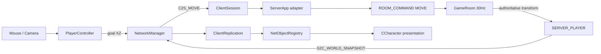

```text
[G3 착수 전 G2 종료 게이트]
Right Mouse Down Edge
-> PlayerController::Try_PickGroundPlane
-> C2S_MOVE(clientSequence, goalX, goalZ)
-> ServerApp packet-to-command adapter
-> GameRoom command queue
-> GameRoom fixed Tick straight-line movement
-> S2C_WORLD_SNAPSHOT
-> NetworkManager ordered replication event
-> ClientReplication NetEntityId lookup
-> Character network target interpolation
-> IDLE/RUN presentation
```



```cpp
// `Shared/Public/Network/PacketMessages.h` 변경
#include <string>
#include <vector>
```

```cpp
	inline constexpr std::size_t
		MAX_WORLD_SNAPSHOT_PLAYERS = 32;

	enum class PLAYER_LOCOMOTION_STATE : std::uint8_t
	{
		IDLE,
		MOVING,
		END
	};

	struct C2S_MOVE
	{
		std::uint32_t iClientSequence = 0;
		float fGoalX = 0.f;
		float fGoalZ = 0.f;
	};

	bool Write_Message(
		CPacketWriter& writer,
		const C2S_MOVE& message);

	bool Read_Message(
		CPacketReader& reader,
		C2S_MOVE& message);

	struct PLAYER_SNAPSHOT
	{
		NET_ENTITY_ID iNetEntityId =
			INVALID_NET_ENTITY_ID;

		float fPositionX = 0.f;
		float fPositionY = 0.f;
		float fPositionZ = 0.f;
		float fYawDegrees = 0.f;

		PLAYER_LOCOMOTION_STATE eLocomotionState =
			PLAYER_LOCOMOTION_STATE::IDLE;
	};

	struct S2C_WORLD_SNAPSHOT
	{
		std::uint32_t iServerTick = 0;
		std::vector<PLAYER_SNAPSHOT> Players;
	};

	bool Write_Message(
		CPacketWriter& writer,
		const S2C_WORLD_SNAPSHOT& message);

	bool Read_Message(
		CPacketReader& reader,
		S2C_WORLD_SNAPSHOT& message);
```

```cpp
// `Shared/Private/Network/PacketMessages.cpp` 추가 코드
namespace
{
	bool Is_Valid_Locomotion(
		LostArk::Shared::PLAYER_LOCOMOTION_STATE state)
	{
		return static_cast<std::uint8_t>(state) <
			static_cast<std::uint8_t>(
				LostArk::Shared::PLAYER_LOCOMOTION_STATE::END);
	}

	bool Is_Valid_PlayerSnapshot(
		const LostArk::Shared::PLAYER_SNAPSHOT& snapshot)
	{
		return
			snapshot.iNetEntityId !=
				LostArk::Shared::INVALID_NET_ENTITY_ID &&
			std::isfinite(snapshot.fPositionX) &&
			std::isfinite(snapshot.fPositionY) &&
			std::isfinite(snapshot.fPositionZ) &&
			std::isfinite(snapshot.fYawDegrees) &&
			Is_Valid_Locomotion(snapshot.eLocomotionState);
	}
}
```

```cpp
bool LostArk::Shared::Write_Message(
	CPacketWriter& writer,
	const C2S_MOVE& message)
{
	if (0 == message.iClientSequence ||
		!std::isfinite(message.fGoalX) ||
		!std::isfinite(message.fGoalZ))
	{
		return false;
	}

	writer.Write_U32(message.iClientSequence);
	writer.Write_F32(message.fGoalX);
	writer.Write_F32(message.fGoalZ);

	return true;
}

bool LostArk::Shared::Read_Message(
	CPacketReader& reader,
	C2S_MOVE& message)
{
	std::uint32_t clientSequence = 0;
	float goalX = 0.f;
	float goalZ = 0.f;

	if (!reader.Read_U32(clientSequence) ||
		!reader.Read_F32(goalX) ||
		!reader.Read_F32(goalZ))
	{
		return false;
	}

	if (0 == clientSequence ||
		!std::isfinite(goalX) ||
		!std::isfinite(goalZ))
	{
		return false;
	}

	C2S_MOVE decoded{};
	decoded.iClientSequence = clientSequence;
	decoded.fGoalX = goalX;
	decoded.fGoalZ = goalZ;

	message = decoded;
	return true;
}

bool LostArk::Shared::Write_Message(
	CPacketWriter& writer,
	const S2C_WORLD_SNAPSHOT& message)
{
	if (0 == message.iServerTick ||
		message.Players.empty() ||
		message.Players.size() >
			MAX_WORLD_SNAPSHOT_PLAYERS)
	{
		return false;
	}

	for (const PLAYER_SNAPSHOT& player : message.Players)
	{
		if (!Is_Valid_PlayerSnapshot(player))
			return false;
	}

	writer.Write_U32(message.iServerTick);
	writer.Write_U16(
		static_cast<std::uint16_t>(
			message.Players.size()));

	for (const PLAYER_SNAPSHOT& player : message.Players)
	{
		writer.Write_U32(player.iNetEntityId);
		writer.Write_F32(player.fPositionX);
		writer.Write_F32(player.fPositionY);
		writer.Write_F32(player.fPositionZ);
		writer.Write_F32(player.fYawDegrees);
		writer.Write_U8(
			static_cast<std::uint8_t>(
				player.eLocomotionState));
	}

	return true;
}

bool LostArk::Shared::Read_Message(
	CPacketReader& reader,
	S2C_WORLD_SNAPSHOT& message)
{
	std::uint32_t serverTick = 0;
	std::uint16_t playerCount = 0;

	if (!reader.Read_U32(serverTick) ||
		!reader.Read_U16(playerCount))
	{
		return false;
	}

	if (0 == serverTick ||
		0 == playerCount ||
		playerCount > MAX_WORLD_SNAPSHOT_PLAYERS)
	{
		return false;
	}

	S2C_WORLD_SNAPSHOT decoded{};
	decoded.iServerTick = serverTick;
	decoded.Players.reserve(playerCount);

	for (std::uint16_t i = 0; i < playerCount; ++i)
	{
		PLAYER_SNAPSHOT player{};
		std::uint8_t rawLocomotion = 0;

		if (!reader.Read_U32(player.iNetEntityId) ||
			!reader.Read_F32(player.fPositionX) ||
			!reader.Read_F32(player.fPositionY) ||
			!reader.Read_F32(player.fPositionZ) ||
			!reader.Read_F32(player.fYawDegrees) ||
			!reader.Read_U8(rawLocomotion))
		{
			return false;
		}

		player.eLocomotionState =
			static_cast<PLAYER_LOCOMOTION_STATE>(
				rawLocomotion);

		if (!Is_Valid_PlayerSnapshot(player))
			return false;

		decoded.Players.push_back(player);
	}

	message = std::move(decoded);
	return true;
}
```

```cpp
// `Tools/NetworkProtocolHarness/Private/NetworkProtocolHarness.cpp`
	bool Build_MovePayload(
		const C2S_MOVE& message,
		std::vector<std::uint8_t>& payload)
	{
		CPacketWriter writer;

		if (!Write_Message(writer, message))
			return false;

		payload = writer.Get_Buffer();
		return true;
	}

	bool Build_WorldSnapshotPayload(
		const S2C_WORLD_SNAPSHOT& message,
		std::vector<std::uint8_t>& payload)
	{
		CPacketWriter writer;

		if (!Write_Message(writer, message))
			return false;

		payload = writer.Get_Buffer();
		return true;
	}
```

```cpp
	void Test_MoveRoundTrip(TEST_RUNNER& testRunner)
	{
		C2S_MOVE source{};
		source.iClientSequence = 7;
		source.fGoalX = 10.f;
		source.fGoalZ = -5.f;

		std::vector<std::uint8_t> payload;

		testRunner.Require(
			Build_MovePayload(source, payload),
			"Writer Move Goal");

		const std::vector<std::uint8_t> expected
		{
			0x07, 0x00, 0x00, 0x00,
			0x00, 0x00, 0x20, 0x41,
			0x00, 0x00, 0xA0, 0xC0
		};

		testRunner.Require(
			payload == expected,
			"Move Goal Payload Layout");

		CPacketReader reader{ payload };
		C2S_MOVE decoded{};

		testRunner.Require(
			Read_Message(reader, decoded),
			"Read Move Goal");

		testRunner.Require(
			decoded.iClientSequence == 7 &&
			decoded.fGoalX == 10.f &&
			decoded.fGoalZ == -5.f,
			"Move Goal Round Trip");

		testRunner.Require(
			0 == reader.Get_RemainingSize(),
			"Consume Entire Move Goal");

		C2S_MOVE invalidSequence = source;
		invalidSequence.iClientSequence = 0;
		CPacketWriter sequenceWriter;

		testRunner.Require(
			!Write_Message(sequenceWriter, invalidSequence),
			"Reject Zero Move Sequence");

		C2S_MOVE invalidGoal = source;
		invalidGoal.fGoalX =
			std::numeric_limits<float>::infinity();
		CPacketWriter goalWriter;

		testRunner.Require(
			!Write_Message(goalWriter, invalidGoal),
			"Reject Infinite Move Goal");

		payload.pop_back();
		CPacketReader truncatedReader{ payload };
		C2S_MOVE unchanged{};
		unchanged.iClientSequence = 99;
		unchanged.fGoalX = 77.f;
		unchanged.fGoalZ = 88.f;

		testRunner.Require(
			!Read_Message(truncatedReader, unchanged),
			"Reject Truncated Move Goal");

		testRunner.Require(
			unchanged.iClientSequence == 99 &&
			unchanged.fGoalX == 77.f &&
			unchanged.fGoalZ == 88.f,
			"Failed Move Does Not Mutate");
	}

	void Test_WorldSnapshotRoundTrip(
		TEST_RUNNER& testRunner)
	{
		S2C_WORLD_SNAPSHOT source{};
		source.iServerTick = 30;

		PLAYER_SNAPSHOT first{};
		first.iNetEntityId = 100;
		first.fPositionX = 1.f;
		first.fPositionY = 0.f;
		first.fPositionZ = 2.f;
		first.fYawDegrees = 90.f;
		first.eLocomotionState =
			PLAYER_LOCOMOTION_STATE::MOVING;

		PLAYER_SNAPSHOT second{};
		second.iNetEntityId = 101;
		second.fPositionX = 3.f;
		second.fPositionY = 0.f;
		second.fPositionZ = 4.f;
		second.fYawDegrees = 180.f;
		second.eLocomotionState =
			PLAYER_LOCOMOTION_STATE::IDLE;

		source.Players.push_back(first);
		source.Players.push_back(second);

		std::vector<std::uint8_t> payload;

		testRunner.Require(
			Build_WorldSnapshotPayload(source, payload),
			"Writer World Snapshot");

		testRunner.Require(
			48 == payload.size(),
			"World Snapshot Payload Size");

		CPacketReader reader{ payload };
		S2C_WORLD_SNAPSHOT decoded{};

		testRunner.Require(
			Read_Message(reader, decoded),
			"Read World Snapshot");

		testRunner.Require(
			decoded.iServerTick == 30 &&
			decoded.Players.size() == 2,
			"World Snapshot Header Round Trip");

		testRunner.Require(
			decoded.Players[0].iNetEntityId == 100 &&
			decoded.Players[0].fPositionX == 1.f &&
			decoded.Players[0].fPositionZ == 2.f &&
			decoded.Players[0].eLocomotionState ==
				PLAYER_LOCOMOTION_STATE::MOVING &&
			decoded.Players[1].iNetEntityId == 101 &&
			decoded.Players[1].fPositionX == 3.f &&
			decoded.Players[1].fPositionZ == 4.f &&
			decoded.Players[1].eLocomotionState ==
				PLAYER_LOCOMOTION_STATE::IDLE,
			"World Snapshot Players Round Trip");

		testRunner.Require(
			0 == reader.Get_RemainingSize(),
			"Consume Entire World Snapshot");

		S2C_WORLD_SNAPSHOT empty{};
		empty.iServerTick = 1;
		CPacketWriter emptyWriter;

		testRunner.Require(
			!Write_Message(emptyWriter, empty),
			"Reject Empty World Snapshot");

		S2C_WORLD_SNAPSHOT invalid = source;
		invalid.Players[0].eLocomotionState =
			PLAYER_LOCOMOTION_STATE::END;
		CPacketWriter invalidWriter;

		testRunner.Require(
			!Write_Message(invalidWriter, invalid),
			"Reject Invalid Locomotion State");

		payload.pop_back();
		CPacketReader truncatedReader{ payload };
		S2C_WORLD_SNAPSHOT unchanged{};
		unchanged.iServerTick = 777;

		testRunner.Require(
			!Read_Message(truncatedReader, unchanged),
			"Reject Truncated World Snapshot");

		testRunner.Require(
			unchanged.iServerTick == 777 &&
			unchanged.Players.empty(),
			"Failed Snapshot Does Not Mutate");
	}
```

```cpp
	Test_MoveRoundTrip(testRunner);
	Test_WorldSnapshotRoundTrip(testRunner);
```

```cpp
// `Server/Public/ServerPlayer.h` 변경
#include <cstdint>
#include <string>
```

```cpp
		std::uint32_t iLastMoveSequence = 0;

		float fMoveGoalX = 0.f;
		float fMoveGoalZ = 0.f;
		float fMoveSpeed = 6.f;

		bool hasMoveGoal = false;
```

```cpp
// `Server/Public/RoomCommand.h` 변경
	enum class ROOM_COMMAND_TYPE
	{
		REGISTER_SESSION,
		ENTER_WORLD,
		MOVE,
		LEAVE
	};
```

```cpp
		LostArk::Shared::C2S_MOVE Move;
```

```cpp
// `Server/Public/GameRoom.h` 변경
		bool Handle_Move(
			SESSION_ID sessionId,
			const LostArk::Shared::C2S_MOVE& move);

		void Update_Players(float fixedDeltaSeconds);

		bool Broadcast_WorldSnapshot();
```

```cpp
		std::uint32_t m_iServerTick = 0;
```

```cpp
// `Server/Private/ServerApp.cpp`의 `On_SessionFrame()` 전체 교체
void LostArk::Server::CServerApp::On_SessionFrame(
	SESSION_ID sessionId,
	const LostArk::Shared::PACKET_FRAME& frame)
{
	using namespace LostArk::Shared;

	CPacketReader reader{ frame.Payload };
	ROOM_COMMAND command{};
	command.iSessionId = sessionId;

	switch (frame.ePacketType)
	{
	case PACKET_TYPE::C2S_ENTER_WORLD:
	{
		C2S_ENTER_WORLD enterWorld{};

		if (!Read_Message(reader, enterWorld) ||
			0 != reader.Get_RemainingSize())
		{
			Request_SessionClose(sessionId);
			return;
		}

		command.eType = ROOM_COMMAND_TYPE::ENTER_WORLD;
		command.EnterWorld = std::move(enterWorld);
		break;
	}

	case PACKET_TYPE::C2S_MOVE:
	{
		C2S_MOVE move{};

		if (!Read_Message(reader, move) ||
			0 != reader.Get_RemainingSize())
		{
			Request_SessionClose(sessionId);
			return;
		}

		command.eType = ROOM_COMMAND_TYPE::MOVE;
		command.Move = move;
		break;
	}

	default:
		Request_SessionClose(sessionId);
		return;
	}

	if (!m_GameRoom.Enqueue(std::move(command)))
		Request_SessionClose(sessionId);
}
```

```cpp
// `Server/Private/GameRoom.cpp` include 변경
#include <algorithm>
#include <cmath>
#include <cstdint>
#include <iostream>
#include <utility>
```

```cpp
namespace
{
	constexpr float MAX_ABS_MOVE_GOAL = 10000.f;
	constexpr float MOVE_STOP_DISTANCE = 0.05f;
	constexpr float RADIANS_TO_DEGREES = 57.2957795f;

	// 기존 Is_Valid_EnterWorld는 그대로 둔다.
}
```

```cpp
	if (nullptr == session || !Is_Valid_EnterWorld(enterWorld) ||
		m_PlayerIdBySessionId.contains(sessionId) ||
		m_Players.size() >= MAX_WORLD_SNAPSHOT_PLAYERS ||
		m_iNextPlayerId == INVALID_PLAYER_ID ||
		m_iNextNetEntityId == INVALID_NET_ENTITY_ID)
```

```cpp
void LostArk::Server::CGameRoom::Tick(
	float fixedDeltaSeconds)
{
	if (!std::isfinite(fixedDeltaSeconds) ||
		fixedDeltaSeconds <= 0.f)
	{
		return;
	}

	std::deque<ROOM_COMMAND> commands;

	{
		std::scoped_lock lock{ m_CommandMutex };
		commands.swap(m_InboundCommands);
	}

	for (ROOM_COMMAND& command : commands)
	{
		switch (command.eType)
		{
		case ROOM_COMMAND_TYPE::REGISTER_SESSION:
			Handle_Register(command.pSession);
			break;

		case ROOM_COMMAND_TYPE::ENTER_WORLD:
			Join(command.iSessionId, command.EnterWorld);
			break;

		case ROOM_COMMAND_TYPE::MOVE:
			if (!Handle_Move(
				command.iSessionId,
				command.Move))
			{
				if (const std::shared_ptr<CClientSession> session =
					Find_Session(command.iSessionId))
				{
					session->Request_Close();
				}
			}
			break;

		case ROOM_COMMAND_TYPE::LEAVE:
			Leave(
				command.iSessionId,
				command.eLeaveReason);
			break;

		default:
			break;
		}
	}

	Update_Players(fixedDeltaSeconds);

	++m_iServerTick;
	if (0 == m_iServerTick)
		++m_iServerTick;

	if (!m_Players.empty())
		Broadcast_WorldSnapshot();
}
```

```cpp
bool LostArk::Server::CGameRoom::Handle_Move(
	SESSION_ID sessionId,
	const LostArk::Shared::C2S_MOVE& move)
{
	if (0 == move.iClientSequence ||
		!std::isfinite(move.fGoalX) ||
		!std::isfinite(move.fGoalZ) ||
		std::abs(move.fGoalX) > MAX_ABS_MOVE_GOAL ||
		std::abs(move.fGoalZ) > MAX_ABS_MOVE_GOAL)
	{
		return false;
	}

	const auto sessionPlayerIter =
		m_PlayerIdBySessionId.find(sessionId);

	if (sessionPlayerIter ==
		m_PlayerIdBySessionId.end())
	{
		return false;
	}

	const auto playerIter =
		m_Players.find(sessionPlayerIter->second);

	if (playerIter == m_Players.end())
		return false;

	SERVER_PLAYER& player = playerIter->second;

	// TCP는 순서를 보장하지만, Server state 계약도 오래된 요청을 적용하지 않는다.
	if (move.iClientSequence <= player.iLastMoveSequence)
		return true;

	player.iLastMoveSequence = move.iClientSequence;
	player.fMoveGoalX = move.fGoalX;
	player.fMoveGoalZ = move.fGoalZ;

	const float deltaX =
		player.fMoveGoalX - player.fPositionX;
	const float deltaZ =
		player.fMoveGoalZ - player.fPositionZ;

	player.hasMoveGoal =
		deltaX * deltaX + deltaZ * deltaZ >
		MOVE_STOP_DISTANCE * MOVE_STOP_DISTANCE;

	return true;
}

void LostArk::Server::CGameRoom::Update_Players(
	float fixedDeltaSeconds)
{
	for (auto& [playerId, player] : m_Players)
	{
		(void)playerId;

		if (!player.hasMoveGoal)
			continue;

		const float deltaX =
			player.fMoveGoalX - player.fPositionX;
		const float deltaZ =
			player.fMoveGoalZ - player.fPositionZ;
		const float distanceSquared =
			deltaX * deltaX + deltaZ * deltaZ;

		if (distanceSquared <=
			MOVE_STOP_DISTANCE * MOVE_STOP_DISTANCE)
		{
			player.fPositionX = player.fMoveGoalX;
			player.fPositionZ = player.fMoveGoalZ;
			player.hasMoveGoal = false;
			continue;
		}

		const float distance = std::sqrt(distanceSquared);
		const float directionX = deltaX / distance;
		const float directionZ = deltaZ / distance;
		const float moveDistance =
			(std::min)(
				player.fMoveSpeed * fixedDeltaSeconds,
				distance);

		player.fPositionX += directionX * moveDistance;
		player.fPositionZ += directionZ * moveDistance;
		player.fYawDegrees =
			std::atan2(directionX, directionZ) *
			RADIANS_TO_DEGREES;

		if (moveDistance >= distance)
		{
			player.fPositionX = player.fMoveGoalX;
			player.fPositionZ = player.fMoveGoalZ;
			player.hasMoveGoal = false;
		}
	}
}
```

```cpp
bool LostArk::Server::CGameRoom::Broadcast_WorldSnapshot()
{
	using namespace LostArk::Shared;

	S2C_WORLD_SNAPSHOT message{};
	message.iServerTick = m_iServerTick;
	message.Players.reserve(m_Players.size());

	for (const auto& [playerId, player] : m_Players)
	{
		(void)playerId;

		PLAYER_SNAPSHOT snapshot{};
		snapshot.iNetEntityId = player.iNetEntityId;
		snapshot.fPositionX = player.fPositionX;
		snapshot.fPositionY = player.fPositionY;
		snapshot.fPositionZ = player.fPositionZ;
		snapshot.fYawDegrees = player.fYawDegrees;
		snapshot.eLocomotionState =
			player.hasMoveGoal ?
			PLAYER_LOCOMOTION_STATE::MOVING :
			PLAYER_LOCOMOTION_STATE::IDLE;

		message.Players.push_back(snapshot);
	}

	CPacketWriter writer;
	if (!Write_Message(writer, message))
		return false;

	bool allSucceeded = true;

	for (const auto& [sessionId, playerId] :
		m_PlayerIdBySessionId)
	{
		(void)playerId;

		const std::shared_ptr<CClientSession> session =
			Find_Session(sessionId);

		if (nullptr == session)
			continue;

		if (!session->Send_Frame(
			PACKET_TYPE::S2C_WORLD_SNAPSHOT,
			writer.Get_Buffer()))
		{
			allSucceeded = false;
			session->Request_Close();
		}
	}

	return allSucceeded;
}
```

```cpp
// `Client/Public/ClientReplicationEvent.h` 변경
	enum class CLIENT_REPLICATION_EVENT_TYPE
	{
		PLAYER_SPAWNED,
		PLAYER_DESPAWNED,
		WORLD_SNAPSHOT
	};
```

```cpp
		LostArk::Shared::S2C_WORLD_SNAPSHOT WorldSnapshot;
```

```cpp
// `Client/Public/NetworkManager.h` 변경
	bool Send_MoveGoal(
		std::uint32_t clientSequence,
		float goalX,
		float goalZ);
```

```cpp
// `Client/Private/NetworkManager.cpp` 추가 함수
bool CNetworkManager::Send_MoveGoal(
	std::uint32_t clientSequence,
	float goalX,
	float goalZ)
{
	using namespace LostArk::Shared;

	if (!Is_Connected())
		return false;

	C2S_MOVE message{};
	message.iClientSequence = clientSequence;
	message.fGoalX = goalX;
	message.fGoalZ = goalZ;

	CPacketWriter payloadWriter;
	if (!Write_Message(payloadWriter, message))
		return false;

	std::vector<std::uint8_t> frameBytes;
	if (!Build_Packet_Frame(
		PACKET_TYPE::C2S_MOVE,
		payloadWriter.Get_Buffer(),
		frameBytes))
	{
		return false;
	}

	return Send_All(frameBytes);
}
```

```cpp
	case PACKET_TYPE::S2C_WORLD_SNAPSHOT:
	{
		S2C_WORLD_SNAPSHOT snapshot{};

		if (!Read_Message(reader, snapshot) ||
			0 != reader.Get_RemainingSize())
		{
			m_iLastErrorCode.store(WSAEINVAL);
			return;
		}

		Client::CLIENT_REPLICATION_EVENT event{};
		event.eType =
			Client::CLIENT_REPLICATION_EVENT_TYPE::WORLD_SNAPSHOT;
		event.WorldSnapshot = std::move(snapshot);
		m_ReplicationEvents.push_back(std::move(event));
		break;
	}
```

```cpp
// `Client/Public/ClientReplication.h` 변경
		bool Apply_WorldSnapshot(
			const LostArk::Shared::S2C_WORLD_SNAPSHOT& snapshot);
```

```cpp
		std::uint32_t m_iLastServerTick = 0;
```

```cpp
// `Client/Private/ClientReplication.cpp` 변경
		case CLIENT_REPLICATION_EVENT_TYPE::WORLD_SNAPSHOT:
			allSucceeded =
				Apply_WorldSnapshot(event.WorldSnapshot) &&
				allSucceeded;
			break;
```

```cpp
bool Client::CClientReplication::Apply_WorldSnapshot(
	const LostArk::Shared::S2C_WORLD_SNAPSHOT& snapshot)
{
	using namespace LostArk::Shared;

	if (0 == snapshot.iServerTick)
		return false;

	// 현재 TCP 경로는 순서가 보장된다. 중복 또는 역전 Tick은 다시 적용하지 않는다.
	if (snapshot.iServerTick <= m_iLastServerTick)
		return true;

	bool allSucceeded = true;

	for (const PLAYER_SNAPSHOT& player : snapshot.Players)
	{
		OBJECT_HANDLE handle{};

		if (!m_Registry.Find_Handle(
			player.iNetEntityId,
			handle))
		{
			allSucceeded = false;
			continue;
		}

		const std::shared_ptr<CCharacter> character =
			m_Registry.Resolve(handle);

		if (nullptr == character)
		{
			allSucceeded = false;
			continue;
		}

		const float3_t position(
			player.fPositionX,
			player.fPositionY,
			player.fPositionZ);

		const bool_t isMoving =
			player.eLocomotionState ==
			PLAYER_LOCOMOTION_STATE::MOVING;

		if (!character->Apply_NetworkState(
			position,
			player.fYawDegrees,
			isMoving))
		{
			allSucceeded = false;
		}
	}

	m_iLastServerTick = snapshot.iServerTick;
	return allSucceeded;
}
```

```cpp
	m_iLastServerTick = 0;
```

```cpp
// `Client/Public/Character.h` 변경
	bool_t Apply_NetworkState(
		const float3_t& position,
		f32_t yawDegrees,
		bool_t isMoving);
```

```cpp
	bool_t Is_Moving() const
	{
		return m_isMoving;
	}
```

```cpp
	bool_t m_hasNetworkState = { false };
	float3_t m_vNetworkTargetPosition = {};
	f32_t m_fNetworkTargetYawDegrees = { 0.f };
```

```cpp
	void Update_NetworkTransform(f32_t fTimeDelta);
```

```cpp
// `Client/Private/Character.cpp` 변경
#include <algorithm>
#include <cmath>
```

```cpp
bool_t CCharacter::Apply_NetworkState(
	const float3_t& position,
	f32_t yawDegrees,
	bool_t isMoving)
{
	if (nullptr == m_pTransformCom ||
		!std::isfinite(position.x) ||
		!std::isfinite(position.y) ||
		!std::isfinite(position.z) ||
		!std::isfinite(yawDegrees))
	{
		return false;
	}

	m_vNetworkTargetPosition = position;
	m_fNetworkTargetYawDegrees = yawDegrees;
	m_hasNetworkState = true;

	Set_Locomotion(isMoving);
	return true;
}
```

```cpp
void CCharacter::Update(f32_t fTimeDelta)
{
	if (m_hasNetworkState)
	{
		Update_NetworkTransform(fTimeDelta);
	}
	else
	{
		m_PathFollower.Update(
			m_pTransformCom,
			m_fMoveSpeed,
			fTimeDelta);

		Set_Locomotion(m_PathFollower.Has_Path());
	}

	Update_Chain();

	if (m_isLocallyControlled && nullptr != m_pLogic)
		m_pLogic->Update(*this, fTimeDelta);

	__super::Update(fTimeDelta);
}
```

```cpp
void CCharacter::Update_NetworkTransform(
	f32_t fTimeDelta)
{
	if (!m_hasNetworkState ||
		nullptr == m_pTransformCom)
	{
		return;
	}

	const vector_t current =
		m_pTransformCom->Get_State(STATE::POSITION);
	const vector_t target = XMVectorSet(
		m_vNetworkTargetPosition.x,
		m_vNetworkTargetPosition.y,
		m_vNetworkTargetPosition.z,
		1.f);

	const f32_t blend =
		(std::min)(1.f, 12.f * fTimeDelta);

	vector_t next = XMVectorLerp(
		current,
		target,
		blend);

	const vector_t remaining = target - next;
	if (XMVectorGetX(
		XMVector3LengthSq(remaining)) < 0.0001f)
	{
		next = target;
	}

	m_pTransformCom->Set_State(
		STATE::POSITION,
		XMVectorSetW(next, 1.f));

	// G3에서는 위치만 보간하고 Yaw는 서버 최신값을 즉시 반영한다.
	m_pTransformCom->Rotation(
		0.f,
		m_fNetworkTargetYawDegrees,
		0.f);
}
```

```cpp
		Set_Animation(
			m_isMoving ?
			CHARACTER_ANIM::RUN : CHARACTER_ANIM::IDLE,
			true);
```

```cpp
// 새 파일 `Client/Public/PlayerController.h`
#pragma once

#include "Client_Defines.h"

#include <cstdint>
#include <memory>

NS_BEGIN(Client)

class CCharacter;

class CPlayerController final
{
public:
	void Set_LocalCharacter(
		const shared_ptr<CCharacter>& character);

	void Update();

private:
	bool_t Try_PickGroundPlane(
		f32_t groundY,
		float3_t& outPosition) const;

private:
	weak_ptr<CCharacter> m_pLocalCharacter;

	std::uint32_t m_iNextMoveSequence = 1;
	bool_t m_wasRightMouseDown = false;
};

NS_END
```

```cpp
// 새 파일 `Client/Private/PlayerController.cpp`
#include "PlayerController.h"

#include "Character.h"
#include "GameInstance.h"
#include "NetworkManager.h"
#include "Transform.h"

#include <cmath>

void Client::CPlayerController::Set_LocalCharacter(
	const shared_ptr<CCharacter>& character)
{
	if (m_pLocalCharacter.lock() == character)
		return;

	m_pLocalCharacter = character;
	m_iNextMoveSequence = 1;
	m_wasRightMouseDown = false;
}

void Client::CPlayerController::Update()
{
	const bool_t isRightMouseDown =
		!CGameInstance::Get().IsMouseInputBlocked() &&
		0 != (CGameInstance::Get().Get_DIMouseState(DIM::RB) & 0x80);

	const shared_ptr<CCharacter> character =
		m_pLocalCharacter.lock();

	if (isRightMouseDown &&
		!m_wasRightMouseDown &&
		nullptr != character)
	{
		const shared_ptr<CTransform> transform =
			character->Get_Transform();

		if (nullptr != transform)
		{
			const f32_t groundY = XMVectorGetY(
				transform->Get_State(STATE::POSITION));

			float3_t goal{};

			if (Try_PickGroundPlane(groundY, goal) &&
				CNetworkManager::Get().Send_MoveGoal(
					m_iNextMoveSequence,
					goal.x,
					goal.z))
			{
				++m_iNextMoveSequence;
				if (0 == m_iNextMoveSequence)
					m_iNextMoveSequence = 1;
			}
		}
	}

	m_wasRightMouseDown = isRightMouseDown;
}

bool_t Client::CPlayerController::Try_PickGroundPlane(
	f32_t groundY,
	float3_t& outPosition) const
{
	::POINT cursor{};

	if (!GetCursorPos(&cursor) ||
		!ScreenToClient(g_hWnd, &cursor))
	{
		return false;
	}

	const float2_t viewport =
		CGameInstance::Get().Get_ViewportSize();

	if (viewport.x <= 0.f || viewport.y <= 0.f ||
		cursor.x < 0 || cursor.y < 0 ||
		cursor.x >= static_cast<LONG>(viewport.x) ||
		cursor.y >= static_cast<LONG>(viewport.y))
	{
		return false;
	}

	const matrix_t view = XMLoadFloat4x4(
		CGameInstance::Get().Get_Transform(D3DTS::VIEW));
	const matrix_t projection = XMLoadFloat4x4(
		CGameInstance::Get().Get_Transform(D3DTS::PROJ));

	const vector_t nearPoint = XMVector3Unproject(
		XMVectorSet(
			static_cast<f32_t>(cursor.x),
			static_cast<f32_t>(cursor.y),
			0.f,
			1.f),
		0.f,
		0.f,
		viewport.x,
		viewport.y,
		0.f,
		1.f,
		projection,
		view,
		XMMatrixIdentity());

	const vector_t farPoint = XMVector3Unproject(
		XMVectorSet(
			static_cast<f32_t>(cursor.x),
			static_cast<f32_t>(cursor.y),
			1.f,
			1.f),
		0.f,
		0.f,
		viewport.x,
		viewport.y,
		0.f,
		1.f,
		projection,
		view,
		XMMatrixIdentity());

	const vector_t direction = farPoint - nearPoint;
	const f32_t directionY = XMVectorGetY(direction);

	if (std::abs(directionY) < 0.00001f)
		return false;

	const f32_t distance =
		(groundY - XMVectorGetY(nearPoint)) /
		directionY;

	if (distance < 0.f)
		return false;

	XMStoreFloat3(
		&outPosition,
		nearPoint + direction * distance);

	outPosition.y = groundY;

	return
		std::isfinite(outPosition.x) &&
		std::isfinite(outPosition.y) &&
		std::isfinite(outPosition.z);
}
```

```cpp
// `Client/Public/Level_Baren.h`
#include "PlayerController.h"
```

```cpp
	CPlayerController m_PlayerController;
```

```cpp
// `Client/Private/Level_Baren.cpp`
	const shared_ptr<CCharacter> localCharacter =
		m_Replication.Get_LocalCharacter();

	m_PlayerController.Set_LocalCharacter(
		localCharacter);

	m_PlayerController.Update();
```

```text
[5. G3 프로젝트 등록]
Client/Public/PlayerController.h
Client/Private/PlayerController.cpp
```

```xml
<ClInclude Include="..\Public\PlayerController.h" />
<ClCompile Include="..\Private\PlayerController.cpp" />
```

```xml
<ClInclude Include="..\Public\PlayerController.h">
  <Filter>04. Network</Filter>
</ClInclude>
<ClCompile Include="..\Private\PlayerController.cpp">
  <Filter>04. Network</Filter>
</ClCompile>
```

```text
[6. G3 H/CPP 작성 순서]
G3-1 Shared message + Harness
-> Shared/Harness build + failures 0

G3-2 ServerPlayer + RoomCommand + ServerApp adapter
-> Server build

G3-3 GameRoom straight-line simulation + Snapshot broadcast
-> Server console/BP로 position 변화 확인

G3-4 NetworkManager Snapshot event
-> Client build

G3-5 Character Apply_NetworkState + ClientReplication
-> Snapshot이 Character까지 도달하는 BP 확인

G3-6 PlayerController Plane Picking + Baren 연결
-> 두 Client 실제 우클릭 왕복 확인
```

```text
[8. G3 빌드·실행 검증]
1. Shared x64 Debug
2. NetworkProtocolHarness x64 Debug
3. Harness 실행 -> failures : 0
4. Server x64 Debug
5. Client x64 Debug
6. Server 실행
7. Client A/B Lobby -> Baren 입장
8. A 우클릭, 두 창 비교
9. B 우클릭, 두 창 비교
10. B 종료 -> A에서 Despawn 확인
```

```text
[9. G3 의도적 trade-off와 다음 단계]
G4 C2S_CHAT / S2C_CHAT
-> G5 Server Entity/Data Registry
-> G6 Player Skill + Cooldown + HP + EffectCue + UIViewModel
-> G7 Monster Brain 한 마리
-> G8 Valtan Pattern 한 개
```
