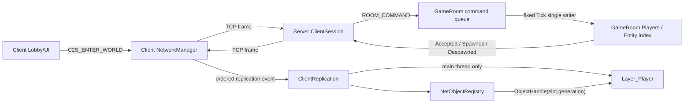

# G1/G2 GameRoom · Player Spawn/Despawn 구현 정답지

문서 유형: 단계별 구현 가이드 + 전체 코드 정답지  
출력 모드: `CODE_EXPLICIT`  
대상 저장소: `C:/Users/user/Desktop/LostArk`  
구현 범위: 두 Client 입장, 상호 Spawn, disconnect Despawn, Baren Character 생성·제거

## 1. 현재 체크포인트와 완료 조건

현재는 다음 화살표까지 실제로 닫혀 있다.

```text
Lobby 선택
-> C2S_ENTER_WORLD
-> Server 수신/해석
-> S2C_ENTER_ACCEPTED
-> Client main thread 수신
-> Baren 진입
```

이번 묶음에서 닫을 화살표는 다음과 같다.

```text
Client A/B 접속
-> 각 ClientSession이 raw frame만 수신
-> GameRoom command queue
-> GameRoom Tick single writer
-> PlayerId/NetEntityId 발급
-> Accepted + Spawned broadcast
-> Client NetworkManager typed event queue
-> Baren ClientReplication
-> Layer_Player CCharacter 생성
-> disconnect
-> Despawned broadcast
-> Layer_Player 제거 + ObjectHandle generation 무효화
```

완료 증거는 아래 여섯 가지다.

1. Client A와 B가 서로 다른 `PlayerId`, `NetEntityId`를 받는다.
2. A 화면에 A/B, B 화면에 A/B가 각각 한 번만 생성된다.
3. class와 nickname이 두 Client에서 같다.
4. B 종료 시 A에서 B Character가 제거된다.
5. B 재접속 시 새 ID를 받고 Ghost Character가 남지 않는다.
6. Shared Harness, Server, Client Debug x64가 모두 성공한다.

이번 코드에는 이동, 채팅, 스킬, Monster, Boss를 넣지 않는다. 이 수명 경로가 검증된 뒤 같은
`command -> room tick -> snapshot/event -> replication` 길 위에 하나씩 추가한다.

## 2. 핵심 책임 지도



### 수명 owner

| 대상 | 유일한 강한 owner | 비고 |
|---|---|---|
| Server Session | `CServerApp::m_Sessions` | `GameRoom`은 `weak_ptr`만 보유 |
| Server Player 상태 | `CGameRoom::m_Players` | Session은 `PlayerId` 연결 정보만 보유 |
| Client Character | Engine `Layer_Player` | Registry는 `weak_ptr<CCharacter>`만 보유 |
| Client network identity | `CNetObjectRegistry` | `NetEntityId -> ObjectHandle` |
| 수신 raw frame | `CNetworkManager::m_InboundFrames` | worker/main 경계라 mutex 필요 |
| typed replication event | `CNetworkManager::m_ReplicationEvents` | main thread 전용, mutex 불필요 |

### 반드시 유지할 불변식

- `CGameRoom::Tick()` 이외의 함수는 Room의 Player map을 직접 변경하지 않는다.
- `CClientSession`은 Socket과 Parser를 소유하지만 Player 위치·체력을 변경하지 않는다.
- 같은 `NetEntityId`로 두 Character를 만들지 않는다.
- Layer가 Character의 강한 owner다. Registry는 Layer 수명을 연장하지 않는다.
- Despawn은 Object Manager의 반복이 끝난 `CLevel_Baren::Update()`에서 처리한다.
- generation이 다른 옛 `ObjectHandle`은 재사용된 slot의 새 Character를 가리키지 않는다.
- Network worker는 `shared_ptr<CCharacter>`와 DX11 객체를 만지지 않는다.

## 3. 단계별 H/CPP 자연어 설명

### 3.1 Shared: `S2C_PLAYER_DESPAWNED`

파일이 존재하는 이유: Server와 Client가 Player 제거의 byte 순서를 똑같이 사용하기 위해서다.  
H 계약: `NetEntityId`와 제거 이유 enum을 값으로 선언하고 Writer/Reader overload를 공개한다.  
CPP 흐름: 모든 입력 검증 -> ID U32와 reason U8 기록. 읽을 때는 지역 변수로 전부 복원하고 검증이
끝난 뒤 출력 구조체에 한 번만 commit한다.  
실패 불변식: 잘린 payload를 읽어도 caller의 기존 message는 바뀌지 않는다.

### 3.2 Server: `CClientSession`

파일이 존재하는 이유: 접속한 Client 한 명의 Socket, TCP stream parser, receive thread를 한 수명으로
묶기 위해서다.  
H 계약: `Start`, `Request_Close`, `Stop`, `Send_Frame`, ID getter/bind, frame/closed callback을 공개한다.  
CPP 흐름: receive thread가 `recv -> parser -> complete frame callback`만 수행한다. callback의 소비자는
`CServerApp`이며 Session 자신은 message의 gameplay 의미를 해석하지 않는다.  
소유하지 않는 상태: `SERVER_PLAYER`, Room map, Monster/Boss, Client GameObject.  
파괴 규칙: `CServerApp`이 `Stop()`으로 receive thread를 join한 뒤 마지막 `shared_ptr`을 놓는다.

`CServerApp`의 main thread가 종료를 위해 Listener를 닫는 동안 accept thread가 같은 socket handle을
읽으므로 `CTcpListener`의 handle은 atomic exchange로 닫는다. atomic이 gameplay 동기화를 대신하는
것이 아니라, listener handle 하나의 동시 read/write data race만 막는다.

### 3.3 Server: `ROOM_COMMAND`

파일이 존재하는 이유: accept thread와 Session receive thread가 Room state를 직접 쓰지 않고 입력을
한 줄로 세우기 위해서다.  
H 계약: `REGISTER_SESSION`, `ENTER_WORLD`, `LEAVE` 세 command와 필요한 값만 담는다.  
CPP: 값 구조체이므로 별도 CPP는 없다. queue에서 먼저 들어온 command가 먼저 처리된다.

### 3.4 Server: `CGameRoom`

파일이 존재하는 이유: Server gameplay truth와 Player/Entity ID 발급을 transport에서 분리하기
위해서다.  
H 계약: 외부에는 `Enqueue()`와 `Tick()`만 공개한다. `Join`, `Leave`, 전송/broadcast는 private다.  
CPP 흐름: `Tick -> queue swap -> command 순회 -> Register/Join/Leave`. Room map을 쓰는 thread는 이
Tick thread 하나뿐이다.  
입장 순서:

```text
A 입장: A Accepted -> A에게 A Spawned
B 입장: B Accepted -> B에게 A Spawned -> B에게 B Spawned -> A에게 B Spawned
```

`m_Players`가 `SERVER_PLAYER` 값의 owner이며, `m_PlayerIdBySessionId`와
`m_PlayerIdByEntityId`는 owner가 아닌 검색 index다.

### 3.5 Server: `CServerApp`

파일이 존재하는 이유: Winsock 전체 시작/종료, accept loop, Room fixed tick, Session owner를 한 곳에서
조율하기 위해서다.  
H 계약: public은 `Run()` 하나다. callback은 raw frame을 Shared message로 복원해 command로 바꾼다.  
CPP 흐름:

```text
Run
-> Winsock/Listener open
-> RoomLoop thread + AcceptLoop thread 시작
-> Enter 입력 대기
-> listener close
-> accept join
-> room join
-> 모든 session shutdown/join/close
-> Winsock cleanup
```

`On_SessionFrame()`은 Player를 생성하지 않는다. payload를 검사하고 `ROOM_COMMAND`를 enqueue할 뿐이다.

### 3.6 Client: `CNetworkManager`

파일이 존재하는 이유: Socket worker와 Client main thread 사이를 끊어 주기 위해서다.  
H 계약: 기존 Accepted 소비 함수에 더해 순서 보존형 `Try_Consume_ReplicationEvent()`를 공개한다.  
CPP 흐름: worker는 raw `PACKET_FRAME`만 mutex queue에 넣는다. main thread `Update()`가 이를 꺼내
`Spawned`/`Despawned` typed event로 변환한다.  
소유하지 않는 상태: Character, Layer, ObjectHandle, Camera.

### 3.7 Client: `CNetObjectRegistry`

파일이 존재하는 이유: network ID와 Engine GameObject pointer의 수명 차이를 안전하게 연결하기
위해서다.  
H 계약: `Register`, `Find_Handle`, `Resolve`, `Unregister`, `Reset`, `Get_LiveObjects`를 공개한다.  
CPP 흐름: slot 재사용 시 generation을 증가시킨다. `Resolve()`는 slot index와 generation이 모두
같을 때만 weak pointer를 lock한다.  
핵심 trade-off: Registry가 `shared_ptr`를 저장하면 Layer에서 지워도 Character가 살아남으므로
`weak_ptr`를 사용한다.

### 3.8 Client: `CClientReplication`

파일이 존재하는 이유: wire message를 Engine의 생성/제거 명령으로 바꾸는 main-thread 경계를 한
곳에 두기 위해서다.  
H 계약: `Initialize`, `Update`, `Get_LocalCharacter`만 외부에 공개한다.  
CPP 흐름:

```text
Spawn event
-> duplicate 검사
-> CharacterCatalog에서 spec 선택
-> CCharacter::CHARACTER_DESC stage
-> Add_GameObject_to_Layer
-> Registry commit
-> local handle 설정

Despawn event
-> handle/object 검색
-> Remove_GameObject_from_Layer
-> Registry generation 무효화
```

Layer 추가 뒤 Registry commit이 실패하면 즉시 Layer에서 제거하여 rollback한다.

### 3.9 Client: `CLevel_Baren`

파일이 존재하는 이유: Baren 레벨의 안전한 프레임 지점에서 Replication을 소비하고 Camera를 local
Character에 연결하기 위해서다.  
H 계약: `CClientReplication`과 Camera를 소유한다.  
CPP 흐름: Engine Object의 `Priority/Update/LateUpdate`가 끝난 뒤 Level Update가 호출되는 현재 순서를
이용해 Spawn/Despawn을 적용한다. 따라서 `CLayer`의 list 순회 중 erase하지 않는다.

## 4. 전체 구현 코드

아래 순서대로 적용한다.

1. Shared Despawn 계약과 Harness
2. Server Session/Room/App
3. Client event/registry/replication
4. Character/Loader/Baren 연결

---

## 4.1 Shared 코드

### `Shared/Public/Network/PacketMessages.h` 추가 블록

`S2C_PLAYER_SPAWNED` 선언 아래, namespace가 닫히기 전에 추가한다.

```cpp
	enum class PLAYER_DESPAWN_REASON : std::uint8_t
	{
		DISCONNECTED,
		LEFT_ROOM,
		KICKED,
		LEVEL_CHANGED,
		END
	};

	struct S2C_PLAYER_DESPAWNED
	{
		NET_ENTITY_ID iNetEntityId =
			INVALID_NET_ENTITY_ID;

		PLAYER_DESPAWN_REASON eReason =
			PLAYER_DESPAWN_REASON::END;
	};

	bool Write_Message(
		CPacketWriter& writer,
		const S2C_PLAYER_DESPAWNED& message);

	bool Read_Message(
		CPacketReader& reader,
		S2C_PLAYER_DESPAWNED& message);
```

### `Shared/Private/Network/PacketMessages.cpp` 추가 함수

```cpp
bool LostArk::Shared::Write_Message(
    CPacketWriter& writer,
    const S2C_PLAYER_DESPAWNED& message)
{
    if (message.iNetEntityId == INVALID_NET_ENTITY_ID)
        return false;

    const std::uint8_t rawReason =
        static_cast<std::uint8_t>(message.eReason);

    if (rawReason >= static_cast<std::uint8_t>(
        PLAYER_DESPAWN_REASON::END))
    {
        return false;
    }

    writer.Write_U32(message.iNetEntityId);
    writer.Write_U8(rawReason);

    return true;
}

bool LostArk::Shared::Read_Message(
    CPacketReader& reader,
    S2C_PLAYER_DESPAWNED& message)
{
    NET_ENTITY_ID netEntityId =
        INVALID_NET_ENTITY_ID;
    std::uint8_t rawReason = {};

    if (!reader.Read_U32(netEntityId))
        return false;

    if (!reader.Read_U8(rawReason))
        return false;

    if (netEntityId == INVALID_NET_ENTITY_ID)
        return false;

    if (rawReason >= static_cast<std::uint8_t>(
        PLAYER_DESPAWN_REASON::END))
    {
        return false;
    }

    S2C_PLAYER_DESPAWNED decoded{};
    decoded.iNetEntityId = netEntityId;
    decoded.eReason =
        static_cast<PLAYER_DESPAWN_REASON>(rawReason);

    message = decoded;

    return true;
}
```

### Harness helper와 test 함수

`Build_PlayerSpawnedPayload()` 아래에 helper를 추가한다.

```cpp
	bool Build_PlayerDespawnedPayload(
		const S2C_PLAYER_DESPAWNED& message,
		std::vector<std::uint8_t>& payload)
	{
		CPacketWriter writer;

		if (!Write_Message(writer, message))
			return false;

		payload = writer.Get_Buffer();
		return true;
	}
```

anonymous namespace가 닫히기 전에 test를 추가한다.

```cpp
	void Test_PlayerDespawnedRoundTrip(
		TEST_RUNNER& testRunner)
	{
		S2C_PLAYER_DESPAWNED source{};
		source.iNetEntityId = 100;
		source.eReason =
			PLAYER_DESPAWN_REASON::DISCONNECTED;

		std::vector<std::uint8_t> payload;

		testRunner.Require(
			Build_PlayerDespawnedPayload(source, payload),
			"Writer Player Despawned");

		const std::vector<std::uint8_t> expected
		{
			0x64, 0x00, 0x00, 0x00,
			0x00
		};

		testRunner.Require(
			payload == expected,
			"Player Despawned Payload Layout");

		CPacketReader reader{ payload };
		S2C_PLAYER_DESPAWNED decoded{};

		testRunner.Require(
			Read_Message(reader, decoded),
			"Read Player Despawned");

		testRunner.Require(
			decoded.iNetEntityId == source.iNetEntityId &&
			decoded.eReason == source.eReason,
			"Player Despawned Round Trip");

		testRunner.Require(
			0 == reader.Get_RemainingSize(),
			"Consume Entire Despawned Payload");

		S2C_PLAYER_DESPAWNED invalidId = source;
		invalidId.iNetEntityId = INVALID_NET_ENTITY_ID;
		CPacketWriter invalidIdWriter;

		testRunner.Require(
			!Write_Message(invalidIdWriter, invalidId),
			"Reject Despawned Zero Entity ID");

		S2C_PLAYER_DESPAWNED invalidReason = source;
		invalidReason.eReason =
			PLAYER_DESPAWN_REASON::END;
		CPacketWriter invalidReasonWriter;

		testRunner.Require(
			!Write_Message(invalidReasonWriter, invalidReason),
			"Reject Invalid Despawn Reason");

		std::vector<std::uint8_t> truncated = payload;
		truncated.pop_back();

		CPacketReader truncatedReader{ truncated };
		S2C_PLAYER_DESPAWNED unchanged{};
		unchanged.iNetEntityId = 777;
		unchanged.eReason =
			PLAYER_DESPAWN_REASON::KICKED;

		testRunner.Require(
			!Read_Message(truncatedReader, unchanged),
			"Reject Truncated Player Despawned");

		testRunner.Require(
			unchanged.iNetEntityId == 777 &&
			unchanged.eReason ==
				PLAYER_DESPAWN_REASON::KICKED,
			"Failed Despawn Does Not Mutate");
	}
```

`main()`의 Spawn test 뒤에 호출을 추가한다.

```cpp
	Test_PlayerDespawnedRoundTrip(testRunner);
```

---

## 4.2 Server 전체 코드

### 새 파일 `Server/Public/ServerIds.h`

```cpp
#pragma once

#include <cstdint>

namespace LostArk::Server
{
	using SESSION_ID = std::uint64_t;

	inline constexpr SESSION_ID
		INVALID_SESSION_ID = 0;
}
```

### `Server/Public/TcpListener.h` 변경 블록

표준 include에 `<atomic>`을 추가하고 기존 socket member를 교체한다.

```cpp
#include <atomic>
```

```cpp
		std::atomic<SOCKET> m_hListenSocket{ INVALID_SOCKET };
		std::atomic<int> m_iLastErrorCode{ 0 };
```

기존 inline getter 두 개는 아래처럼 교체한다.

```cpp
		[[nodiscard]]
		bool Is_Open() const
		{
			return INVALID_SOCKET != m_hListenSocket.load();
		}

		[[nodiscard]]
		int Get_LastErrorCode() const
		{
			return m_iLastErrorCode.load();
		}
```

### `Server/Private/TcpListener.cpp` 전체 교체

```cpp
#include "TcpListener.h"

LostArk::Server::CTcpListener::~CTcpListener()
{
	Close();
}

bool LostArk::Server::CTcpListener::Open(
	std::uint16_t port)
{
	if (Is_Open())
		return true;

	m_iLastErrorCode.store(0);

	const SOCKET listenSocket = ::socket(
		AF_INET,
		SOCK_STREAM,
		IPPROTO_TCP);

	if (INVALID_SOCKET == listenSocket)
	{
		m_iLastErrorCode.store(::WSAGetLastError());
		return false;
	}

	sockaddr_in address{};
	address.sin_family = AF_INET;
	address.sin_addr.s_addr = ::htonl(INADDR_LOOPBACK);
	address.sin_port = ::htons(port);

	if (SOCKET_ERROR == ::bind(
		listenSocket,
		reinterpret_cast<const sockaddr*>(&address),
		sizeof(address)))
	{
		m_iLastErrorCode.store(::WSAGetLastError());
		::closesocket(listenSocket);
		return false;
	}

	if (SOCKET_ERROR == ::listen(
		listenSocket,
		SOMAXCONN))
	{
		m_iLastErrorCode.store(::WSAGetLastError());
		::closesocket(listenSocket);
		return false;
	}

	m_hListenSocket.store(listenSocket);
	return true;
}

SOCKET LostArk::Server::CTcpListener::Accept()
{
	const SOCKET listenSocket = m_hListenSocket.load();

	if (INVALID_SOCKET == listenSocket)
	{
		m_iLastErrorCode.store(WSAENOTSOCK);
		return INVALID_SOCKET;
	}

	const SOCKET clientSocket = ::accept(
		listenSocket,
		nullptr,
		nullptr);

	if (INVALID_SOCKET == clientSocket)
	{
		m_iLastErrorCode.store(::WSAGetLastError());
		return INVALID_SOCKET;
	}

	m_iLastErrorCode.store(0);
	return clientSocket;
}

void LostArk::Server::CTcpListener::Close()
{
	const SOCKET listenSocket =
		m_hListenSocket.exchange(INVALID_SOCKET);

	if (INVALID_SOCKET != listenSocket)
		::closesocket(listenSocket);
}
```

### 새 파일 `Server/Public/ServerPlayer.h`

```cpp
#pragma once

#include "ServerIds.h"

#include "Network/NetworkIds.h"
#include "Network/PacketType.h"

#include <string>

namespace LostArk::Server
{
	struct SERVER_PLAYER
	{
		SESSION_ID iSessionId =
			INVALID_SESSION_ID;

		LostArk::Shared::PLAYER_ID iPlayerId =
			LostArk::Shared::INVALID_PLAYER_ID;

		LostArk::Shared::NET_ENTITY_ID iNetEntityId =
			LostArk::Shared::INVALID_NET_ENTITY_ID;

		LostArk::Shared::CHARACTER_CLASS_ID eCharacterClass =
			LostArk::Shared::CHARACTER_CLASS_ID::END;

		std::string strNickName;

		float fPositionX = 0.f;
		float fPositionY = 0.f;
		float fPositionZ = 0.f;
		float fYawDegrees = 0.f;
	};
}
```

### 새 파일 `Server/Public/RoomCommand.h`

```cpp
#pragma once

#include "ServerIds.h"

#include "Network/PacketMessages.h"

#include <memory>

namespace LostArk::Server
{
	class CClientSession;

	enum class ROOM_COMMAND_TYPE
	{
		REGISTER_SESSION,
		ENTER_WORLD,
		LEAVE
	};

	struct ROOM_COMMAND
	{
		ROOM_COMMAND_TYPE eType =
			ROOM_COMMAND_TYPE::REGISTER_SESSION;

		SESSION_ID iSessionId =
			INVALID_SESSION_ID;

		std::shared_ptr<CClientSession> pSession;

		LostArk::Shared::C2S_ENTER_WORLD EnterWorld;

		LostArk::Shared::PLAYER_DESPAWN_REASON eLeaveReason =
			LostArk::Shared::PLAYER_DESPAWN_REASON::DISCONNECTED;
	};
}
```

### `Server/Public/ClientSession.h` 전체 교체

```cpp
#pragma once

#include "ServerIds.h"

#include "Network/NetworkIds.h"
#include "Network/PacketFrame.h"
#include "Network/PacketStreamParser.h"

#include <WinSock2.h>

#include <atomic>
#include <cstdint>
#include <functional>
#include <mutex>
#include <span>
#include <thread>

namespace LostArk::Server
{
	class CClientSession final
	{
	public:
		using FRAME_HANDLER = std::function<void(
			SESSION_ID,
			const LostArk::Shared::PACKET_FRAME&)>;

		using CLOSED_HANDLER = std::function<void(
			SESSION_ID)>;

	public:
		CClientSession(
			SESSION_ID sessionId,
			SOCKET clientSocket,
			FRAME_HANDLER onFrame,
			CLOSED_HANDLER onClosed);

		~CClientSession();

		CClientSession(const CClientSession&) = delete;
		CClientSession& operator=(const CClientSession&) = delete;

	public:
		bool Start();
		void Request_Close();
		void Stop();

		bool Send_Frame(
			LostArk::Shared::PACKET_TYPE packetType,
			std::span<const std::uint8_t> payload);

		void Bind_PlayerId(
			LostArk::Shared::PLAYER_ID playerId);

		[[nodiscard]] SESSION_ID Get_SessionId() const;
		[[nodiscard]] LostArk::Shared::PLAYER_ID Get_PlayerId() const;
		[[nodiscard]] bool Is_Open() const;
		[[nodiscard]] int Get_LastErrorCode() const;

	private:
		void Receive_Loop();

		bool Receive_Frame(
			LostArk::Shared::PACKET_FRAME& frame);

		bool Send_All(
			std::span<const std::uint8_t> bytes);

		void Notify_Closed();

	private:
		const SESSION_ID m_iSessionId =
			INVALID_SESSION_ID;

		SOCKET m_hClientSocket = INVALID_SOCKET;

		std::atomic<int> m_iLastErrorCode{ 0 };
		std::atomic_bool m_isReceiveRunning{ false };
		std::atomic_bool m_hasNotifiedClosed{ false };

		std::atomic<LostArk::Shared::PLAYER_ID>
			m_iPlayerId{
				LostArk::Shared::INVALID_PLAYER_ID
			};

		LostArk::Shared::CPacketStreamParser m_StreamParser;
		std::thread m_ReceiveThread;
		std::mutex m_SendMutex;

		FRAME_HANDLER m_OnFrame;
		CLOSED_HANDLER m_OnClosed;
	};
}
```

### `Server/Private/ClientSession.cpp` 전체 교체

```cpp
#include "ClientSession.h"

#include <array>
#include <cstdint>
#include <utility>
#include <vector>

LostArk::Server::CClientSession::CClientSession(
	SESSION_ID sessionId,
	SOCKET clientSocket,
	FRAME_HANDLER onFrame,
	CLOSED_HANDLER onClosed)
	: m_iSessionId{ sessionId }
	, m_hClientSocket{ clientSocket }
	, m_OnFrame{ std::move(onFrame) }
	, m_OnClosed{ std::move(onClosed) }
{
}

LostArk::Server::CClientSession::~CClientSession()
{
	Stop();
}

bool LostArk::Server::CClientSession::Start()
{
	if (!Is_Open() ||
		m_iSessionId == INVALID_SESSION_ID ||
		m_ReceiveThread.joinable())
	{
		return false;
	}

	m_iLastErrorCode.store(0);
	m_hasNotifiedClosed.store(false);
	m_isReceiveRunning.store(true);

	m_ReceiveThread = std::thread(
		&CClientSession::Receive_Loop,
		this);

	return true;
}

void LostArk::Server::CClientSession::Request_Close()
{
	m_isReceiveRunning.store(false);

	if (Is_Open())
		::shutdown(m_hClientSocket, SD_BOTH);
}

void LostArk::Server::CClientSession::Stop()
{
	Request_Close();

	if (m_ReceiveThread.joinable())
		m_ReceiveThread.join();

	std::scoped_lock lock{ m_SendMutex };

	if (Is_Open())
	{
		::closesocket(m_hClientSocket);
		m_hClientSocket = INVALID_SOCKET;
	}
}

bool LostArk::Server::CClientSession::Send_Frame(
	LostArk::Shared::PACKET_TYPE packetType,
	std::span<const std::uint8_t> payload)
{
	std::vector<std::uint8_t> frameBytes;

	if (!LostArk::Shared::Build_Packet_Frame(
		packetType,
		payload,
		frameBytes))
	{
		return false;
	}

	return Send_All(frameBytes);
}

void LostArk::Server::CClientSession::Bind_PlayerId(
	LostArk::Shared::PLAYER_ID playerId)
{
	m_iPlayerId.store(playerId);
}

LostArk::Server::SESSION_ID
LostArk::Server::CClientSession::Get_SessionId() const
{
	return m_iSessionId;
}

LostArk::Shared::PLAYER_ID
LostArk::Server::CClientSession::Get_PlayerId() const
{
	return m_iPlayerId.load();
}

bool LostArk::Server::CClientSession::Is_Open() const
{
	return INVALID_SOCKET != m_hClientSocket;
}

int LostArk::Server::CClientSession::Get_LastErrorCode() const
{
	return m_iLastErrorCode.load();
}

void LostArk::Server::CClientSession::Receive_Loop()
{
	using namespace LostArk::Shared;

	while (m_isReceiveRunning.load())
	{
		PACKET_FRAME frame{};

		if (!Receive_Frame(frame))
			break;

		if (m_OnFrame)
			m_OnFrame(m_iSessionId, frame);
	}

	m_isReceiveRunning.store(false);
	Notify_Closed();
}

bool LostArk::Server::CClientSession::Receive_Frame(
	LostArk::Shared::PACKET_FRAME& frame)
{
	using namespace LostArk::Shared;

	for (;;)
	{
		const PACKET_PARSE_RESULT parseResult =
			m_StreamParser.Try_Pop(frame);

		if (PACKET_PARSE_RESULT::FRAME_READY == parseResult)
			return true;

		if (PACKET_PARSE_RESULT::INVALID_FRAME == parseResult)
		{
			m_iLastErrorCode.store(WSAEPROTONOSUPPORT);
			return false;
		}

		std::array<std::uint8_t, 4096> receiveBuffer{};

		const int receivedByteCount = ::recv(
			m_hClientSocket,
			reinterpret_cast<char*>(receiveBuffer.data()),
			static_cast<int>(receiveBuffer.size()),
			0);

		if (0 == receivedByteCount)
			return false;

		if (SOCKET_ERROR == receivedByteCount)
		{
			const int errorCode = ::WSAGetLastError();

			if (m_isReceiveRunning.load())
				m_iLastErrorCode.store(errorCode);

			return false;
		}

		const std::span<const std::uint8_t> receivedBytes
		{
			receiveBuffer.data(),
			static_cast<std::size_t>(receivedByteCount)
		};

		if (!m_StreamParser.Append(receivedBytes))
		{
			m_iLastErrorCode.store(WSAEMSGSIZE);
			return false;
		}
	}
}

bool LostArk::Server::CClientSession::Send_All(
	std::span<const std::uint8_t> bytes)
{
	std::scoped_lock lock{ m_SendMutex };

	if (!Is_Open())
		return false;

	std::size_t sentByteCount = 0;

	while (sentByteCount < bytes.size())
	{
		const int result = ::send(
			m_hClientSocket,
			reinterpret_cast<const char*>(
				bytes.data() + sentByteCount),
			static_cast<int>(
				bytes.size() - sentByteCount),
			0);

		if (SOCKET_ERROR == result)
		{
			m_iLastErrorCode.store(::WSAGetLastError());
			return false;
		}

		if (0 == result)
			return false;

		sentByteCount += static_cast<std::size_t>(result);
	}

	return true;
}

void LostArk::Server::CClientSession::Notify_Closed()
{
	if (m_hasNotifiedClosed.exchange(true))
		return;

	if (m_OnClosed)
		m_OnClosed(m_iSessionId);
}
```

### 새 파일 `Server/Public/GameRoom.h`

```cpp
#pragma once

#include "RoomCommand.h"
#include "ServerPlayer.h"

#include <cstddef>
#include <deque>
#include <map>
#include <memory>
#include <mutex>
#include <unordered_map>

namespace LostArk::Server
{
	class CClientSession;

	class CGameRoom final
	{
	public:
		bool Enqueue(ROOM_COMMAND command);
		void Tick(float fixedDeltaSeconds);

	private:
		void Handle_Register(
			const std::shared_ptr<CClientSession>& session);

		bool Join(
			SESSION_ID sessionId,
			const LostArk::Shared::C2S_ENTER_WORLD& enterWorld);

		void Leave(
			SESSION_ID sessionId,
			LostArk::Shared::PLAYER_DESPAWN_REASON reason);

		bool Send_Accepted(
			const std::shared_ptr<CClientSession>& session,
			const SERVER_PLAYER& player);

		bool Send_Spawned(
			const std::shared_ptr<CClientSession>& session,
			const SERVER_PLAYER& player);

		bool Send_Despawned(
			const std::shared_ptr<CClientSession>& session,
			LostArk::Shared::NET_ENTITY_ID netEntityId,
			LostArk::Shared::PLAYER_DESPAWN_REASON reason);

		void Broadcast_Spawned(
			const SERVER_PLAYER& player,
			SESSION_ID exceptSessionId);

		void Broadcast_Despawned(
			LostArk::Shared::NET_ENTITY_ID netEntityId,
			LostArk::Shared::PLAYER_DESPAWN_REASON reason);

		std::shared_ptr<CClientSession> Find_Session(
			SESSION_ID sessionId) const;

		void Rollback_Join(SESSION_ID sessionId);

	private:
		mutable std::mutex m_CommandMutex;
		std::deque<ROOM_COMMAND> m_InboundCommands;

		std::unordered_map<SESSION_ID, std::weak_ptr<CClientSession>>
			m_Sessions;

		std::map<LostArk::Shared::PLAYER_ID, SERVER_PLAYER>
			m_Players;

		std::unordered_map<SESSION_ID, LostArk::Shared::PLAYER_ID>
			m_PlayerIdBySessionId;

		std::unordered_map<
			LostArk::Shared::NET_ENTITY_ID,
			LostArk::Shared::PLAYER_ID>
			m_PlayerIdByEntityId;

		LostArk::Shared::PLAYER_ID m_iNextPlayerId = 1;
		LostArk::Shared::NET_ENTITY_ID m_iNextNetEntityId = 100;
	};
}
```

### 새 파일 `Server/Private/GameRoom.cpp`

```cpp
#include "GameRoom.h"

#include "ClientSession.h"

#include "Network/PacketMessages.h"
#include "Network/PacketWriter.h"

#include <cstdint>
#include <iostream>
#include <utility>

namespace
{
	bool Is_Valid_EnterWorld(
		const LostArk::Shared::C2S_ENTER_WORLD& message)
	{
		const std::uint8_t rawClass =
			static_cast<std::uint8_t>(message.eCharacterClass);

		return
			rawClass < static_cast<std::uint8_t>(
				LostArk::Shared::CHARACTER_CLASS_ID::END) &&
			!message.strNickName.empty() &&
			message.strNickName.size() <=
				LostArk::Shared::MAX_NICKNAME_BYTES;
	}
}

bool LostArk::Server::CGameRoom::Enqueue(
	ROOM_COMMAND command)
{
	if (command.iSessionId == INVALID_SESSION_ID)
		return false;

	if (command.eType == ROOM_COMMAND_TYPE::REGISTER_SESSION &&
		(nullptr == command.pSession ||
		 command.pSession->Get_SessionId() != command.iSessionId))
	{
		return false;
	}

	std::scoped_lock lock{ m_CommandMutex };
	m_InboundCommands.push_back(std::move(command));
	return true;
}

void LostArk::Server::CGameRoom::Tick(
	float fixedDeltaSeconds)
{
	(void)fixedDeltaSeconds;

	std::deque<ROOM_COMMAND> commands;

	{
		std::scoped_lock lock{ m_CommandMutex };
		commands.swap(m_InboundCommands);
	}

	for (ROOM_COMMAND& command : commands)
	{
		switch (command.eType)
		{
		case ROOM_COMMAND_TYPE::REGISTER_SESSION:
			Handle_Register(command.pSession);
			break;

		case ROOM_COMMAND_TYPE::ENTER_WORLD:
			Join(command.iSessionId, command.EnterWorld);
			break;

		case ROOM_COMMAND_TYPE::LEAVE:
			Leave(command.iSessionId, command.eLeaveReason);
			break;
		}
	}
}

void LostArk::Server::CGameRoom::Handle_Register(
	const std::shared_ptr<CClientSession>& session)
{
	if (nullptr == session ||
		session->Get_SessionId() == INVALID_SESSION_ID)
	{
		return;
	}

	m_Sessions.insert_or_assign(
		session->Get_SessionId(),
		session);
}

bool LostArk::Server::CGameRoom::Join(
	SESSION_ID sessionId,
	const LostArk::Shared::C2S_ENTER_WORLD& enterWorld)
{
	using namespace LostArk::Shared;

	const std::shared_ptr<CClientSession> session =
		Find_Session(sessionId);

	if (nullptr == session ||
		!Is_Valid_EnterWorld(enterWorld) ||
		m_PlayerIdBySessionId.contains(sessionId) ||
		m_iNextPlayerId == INVALID_PLAYER_ID ||
		m_iNextNetEntityId == INVALID_NET_ENTITY_ID)
	{
		if (nullptr != session)
			session->Request_Close();

		return false;
	}

	SERVER_PLAYER player{};
	player.iSessionId = sessionId;
	player.iPlayerId = m_iNextPlayerId;
	player.iNetEntityId = m_iNextNetEntityId;
	player.eCharacterClass = enterWorld.eCharacterClass;
	player.strNickName = enterWorld.strNickName;

	// 두 Client가 겹치지 않도록 Server가 임시 spawn 위치를 정한다.
	player.fPositionX =
		static_cast<float>(m_Players.size()) * 2.f;
	player.fPositionY = 0.f;
	player.fPositionZ = 0.f;
	player.fYawDegrees = 180.f;

	++m_iNextPlayerId;
	++m_iNextNetEntityId;

	m_Players.emplace(player.iPlayerId, player);
	m_PlayerIdBySessionId.emplace(sessionId, player.iPlayerId);
	m_PlayerIdByEntityId.emplace(
		player.iNetEntityId,
		player.iPlayerId);

	session->Bind_PlayerId(player.iPlayerId);

	if (!Send_Accepted(session, player))
	{
		Rollback_Join(sessionId);
		session->Request_Close();
		return false;
	}

	// 새 Client에게 이미 Room에 있던 Player들을 먼저 알려 준다.
	for (const auto& [existingPlayerId, existingPlayer] : m_Players)
	{
		(void)existingPlayerId;

		if (existingPlayer.iSessionId == sessionId)
			continue;

		if (!Send_Spawned(session, existingPlayer))
		{
			Rollback_Join(sessionId);
			session->Request_Close();
			return false;
		}
	}

	// 새 Client가 자기 자신도 생성하게 한다.
	if (!Send_Spawned(session, player))
	{
		Rollback_Join(sessionId);
		session->Request_Close();
		return false;
	}

	// 기존 Client들에게 새 Player를 알린다.
	Broadcast_Spawned(player, sessionId);

	std::cout
		<< "Player joined. SessionId=" << sessionId
		<< ", PlayerId=" << player.iPlayerId
		<< ", NetEntityId=" << player.iNetEntityId
		<< ", Nickname=" << player.strNickName
		<< ", RoomPlayers=" << m_Players.size()
		<< '\n';

	return true;
}

void LostArk::Server::CGameRoom::Leave(
	SESSION_ID sessionId,
	LostArk::Shared::PLAYER_DESPAWN_REASON reason)
{
	using namespace LostArk::Shared;

	const auto sessionPlayerIter =
		m_PlayerIdBySessionId.find(sessionId);

	if (sessionPlayerIter == m_PlayerIdBySessionId.end())
	{
		m_Sessions.erase(sessionId);
		return;
	}

	const PLAYER_ID playerId = sessionPlayerIter->second;
	const auto playerIter = m_Players.find(playerId);

	if (playerIter == m_Players.end())
	{
		m_PlayerIdBySessionId.erase(sessionPlayerIter);
		m_Sessions.erase(sessionId);
		return;
	}

	const NET_ENTITY_ID netEntityId =
		playerIter->second.iNetEntityId;

	if (const std::shared_ptr<CClientSession> session =
		Find_Session(sessionId))
	{
		session->Bind_PlayerId(INVALID_PLAYER_ID);
	}

	m_PlayerIdByEntityId.erase(netEntityId);
	m_PlayerIdBySessionId.erase(sessionPlayerIter);
	m_Players.erase(playerIter);
	m_Sessions.erase(sessionId);

	Broadcast_Despawned(netEntityId, reason);

	std::cout
		<< "Player left. SessionId=" << sessionId
		<< ", NetEntityId=" << netEntityId
		<< ", RoomPlayers=" << m_Players.size()
		<< '\n';
}

bool LostArk::Server::CGameRoom::Send_Accepted(
	const std::shared_ptr<CClientSession>& session,
	const SERVER_PLAYER& player)
{
	using namespace LostArk::Shared;

	S2C_ENTER_ACCEPTED message{};
	message.iPlayerId = player.iPlayerId;
	message.iNetEntityId = player.iNetEntityId;

	CPacketWriter writer;

	return
		nullptr != session &&
		Write_Message(writer, message) &&
		session->Send_Frame(
			PACKET_TYPE::S2C_ENTER_ACCEPTED,
			writer.Get_Buffer());
}

bool LostArk::Server::CGameRoom::Send_Spawned(
	const std::shared_ptr<CClientSession>& session,
	const SERVER_PLAYER& player)
{
	using namespace LostArk::Shared;

	S2C_PLAYER_SPAWNED message{};
	message.iPlayerId = player.iPlayerId;
	message.iNetEntityId = player.iNetEntityId;
	message.eCharacterClass = player.eCharacterClass;
	message.strNickName = player.strNickName;
	message.fPositionX = player.fPositionX;
	message.fPositionY = player.fPositionY;
	message.fPositionZ = player.fPositionZ;
	message.fYawDegrees = player.fYawDegrees;

	CPacketWriter writer;

	return
		nullptr != session &&
		Write_Message(writer, message) &&
		session->Send_Frame(
			PACKET_TYPE::S2C_PLAYER_SPAWNED,
			writer.Get_Buffer());
}

bool LostArk::Server::CGameRoom::Send_Despawned(
	const std::shared_ptr<CClientSession>& session,
	LostArk::Shared::NET_ENTITY_ID netEntityId,
	LostArk::Shared::PLAYER_DESPAWN_REASON reason)
{
	using namespace LostArk::Shared;

	S2C_PLAYER_DESPAWNED message{};
	message.iNetEntityId = netEntityId;
	message.eReason = reason;

	CPacketWriter writer;

	return
		nullptr != session &&
		Write_Message(writer, message) &&
		session->Send_Frame(
			PACKET_TYPE::S2C_PLAYER_DESPAWNED,
			writer.Get_Buffer());
}

void LostArk::Server::CGameRoom::Broadcast_Spawned(
	const SERVER_PLAYER& player,
	SESSION_ID exceptSessionId)
{
	for (const auto& [sessionId, playerId] : m_PlayerIdBySessionId)
	{
		(void)playerId;

		if (sessionId == exceptSessionId)
			continue;

		const std::shared_ptr<CClientSession> session =
			Find_Session(sessionId);

		if (nullptr != session && !Send_Spawned(session, player))
			session->Request_Close();
	}
}

void LostArk::Server::CGameRoom::Broadcast_Despawned(
	LostArk::Shared::NET_ENTITY_ID netEntityId,
	LostArk::Shared::PLAYER_DESPAWN_REASON reason)
{
	for (const auto& [sessionId, playerId] : m_PlayerIdBySessionId)
	{
		(void)playerId;

		const std::shared_ptr<CClientSession> session =
			Find_Session(sessionId);

		if (nullptr != session &&
			!Send_Despawned(session, netEntityId, reason))
		{
			session->Request_Close();
		}
	}
}

std::shared_ptr<LostArk::Server::CClientSession>
LostArk::Server::CGameRoom::Find_Session(
	SESSION_ID sessionId) const
{
	const auto iter = m_Sessions.find(sessionId);

	if (iter == m_Sessions.end())
		return nullptr;

	return iter->second.lock();
}

void LostArk::Server::CGameRoom::Rollback_Join(
	SESSION_ID sessionId)
{
	using namespace LostArk::Shared;

	const auto sessionPlayerIter =
		m_PlayerIdBySessionId.find(sessionId);

	if (sessionPlayerIter == m_PlayerIdBySessionId.end())
		return;

	const PLAYER_ID playerId = sessionPlayerIter->second;
	const auto playerIter = m_Players.find(playerId);

	if (playerIter != m_Players.end())
	{
		m_PlayerIdByEntityId.erase(
			playerIter->second.iNetEntityId);
		m_Players.erase(playerIter);
	}

	m_PlayerIdBySessionId.erase(sessionPlayerIter);

	if (const std::shared_ptr<CClientSession> session =
		Find_Session(sessionId))
	{
		session->Bind_PlayerId(INVALID_PLAYER_ID);
	}
}
```

### `Server/Public/ServerApp.h` 전체 교체

```cpp
#pragma once

#include "GameRoom.h"
#include "ServerIds.h"
#include "TcpListener.h"
#include "WinSockContext.h"

#include <atomic>
#include <deque>
#include <memory>
#include <mutex>
#include <thread>
#include <unordered_map>

namespace LostArk::Server
{
	class CClientSession;

	class CServerApp final
	{
	public:
		~CServerApp();

		int Run();

	private:
		void Accept_Loop();
		void Room_Loop();

		void On_SessionFrame(
			SESSION_ID sessionId,
			const LostArk::Shared::PACKET_FRAME& frame);

		void On_SessionClosed(SESSION_ID sessionId);
		void Request_SessionClose(SESSION_ID sessionId);
		void Reap_ClosedSessions();
		void Shutdown();

	private:
		CWinSockContext m_WinSockContext;
		CTcpListener m_TcpListener;
		CGameRoom m_GameRoom;

		std::atomic_bool m_isRunning{ false };
		std::atomic<SESSION_ID> m_iNextSessionId{ 1 };

		std::thread m_AcceptThread;
		std::thread m_RoomThread;

		std::mutex m_SessionsMutex;
		std::unordered_map<
			SESSION_ID,
			std::shared_ptr<CClientSession>> m_Sessions;

		std::mutex m_ClosedSessionsMutex;
		std::deque<SESSION_ID> m_ClosedSessionIds;
	};
}
```

### `Server/Private/ServerApp.cpp` 전체 교체

```cpp
#include "ServerApp.h"

#include "ClientSession.h"

#include "Network/PacketMessages.h"
#include "Network/PacketReader.h"

#include <WinSock2.h>

#include <chrono>
#include <cstdint>
#include <iostream>
#include <utility>
#include <vector>

LostArk::Server::CServerApp::~CServerApp()
{
	Shutdown();
}

int LostArk::Server::CServerApp::Run()
{
	if (!m_WinSockContext.Initialize())
	{
		std::cerr << "Failed to initialize Winsock 2.2.\n";
		return 1;
	}

	constexpr std::uint16_t SERVER_PORT = 7777;

	if (!m_TcpListener.Open(SERVER_PORT))
	{
		std::cerr
			<< "Failed to open TCP listener. Error: "
			<< m_TcpListener.Get_LastErrorCode()
			<< '\n';
		return 1;
	}

	m_isRunning.store(true);

	m_RoomThread = std::thread(
		&CServerApp::Room_Loop,
		this);

	m_AcceptThread = std::thread(
		&CServerApp::Accept_Loop,
		this);

	std::cout
		<< "Listening on 127.0.0.1:"
		<< SERVER_PORT
		<< '\n'
		<< "Open two Clients, then press Enter to stop.\n";

	std::cin.get();

	Shutdown();
	return 0;
}

void LostArk::Server::CServerApp::Accept_Loop()
{
	while (m_isRunning.load())
	{
		SOCKET clientSocket = m_TcpListener.Accept();

		if (INVALID_SOCKET == clientSocket)
		{
			if (m_isRunning.load())
			{
				std::cerr
					<< "Accept failed. Error: "
					<< m_TcpListener.Get_LastErrorCode()
					<< '\n';
			}

			break;
		}

		const SESSION_ID sessionId =
			m_iNextSessionId.fetch_add(1);

		if (sessionId == INVALID_SESSION_ID)
		{
			::closesocket(clientSocket);
			continue;
		}

		auto session = std::make_shared<CClientSession>(
			sessionId,
			clientSocket,
			[this](SESSION_ID id,
				const LostArk::Shared::PACKET_FRAME& frame)
			{
				On_SessionFrame(id, frame);
			},
			[this](SESSION_ID id)
			{
				On_SessionClosed(id);
			});

		{
			std::scoped_lock lock{ m_SessionsMutex };
			m_Sessions.emplace(sessionId, session);
		}

		ROOM_COMMAND registerCommand{};
		registerCommand.eType =
			ROOM_COMMAND_TYPE::REGISTER_SESSION;
		registerCommand.iSessionId = sessionId;
		registerCommand.pSession = session;

		if (!m_GameRoom.Enqueue(std::move(registerCommand)) ||
			!session->Start())
		{
			session->Request_Close();
			On_SessionClosed(sessionId);
			continue;
		}

		std::cout
			<< "Client connected. SessionId="
			<< sessionId
			<< '\n';
	}
}

void LostArk::Server::CServerApp::Room_Loop()
{
	using namespace std::chrono;

	constexpr float FIXED_DELTA_SECONDS = 1.f / 30.f;
	constexpr auto FIXED_STEP = milliseconds{ 33 };

	while (m_isRunning.load())
	{
		const steady_clock::time_point nextTick =
			steady_clock::now() + FIXED_STEP;

		m_GameRoom.Tick(FIXED_DELTA_SECONDS);
		Reap_ClosedSessions();

		std::this_thread::sleep_until(nextTick);
	}

	// 종료 직전에 이미 들어온 Leave까지 한 번 처리한다.
	m_GameRoom.Tick(FIXED_DELTA_SECONDS);
	Reap_ClosedSessions();
}

void LostArk::Server::CServerApp::On_SessionFrame(
	SESSION_ID sessionId,
	const LostArk::Shared::PACKET_FRAME& frame)
{
	using namespace LostArk::Shared;

	if (frame.ePacketType != PACKET_TYPE::C2S_ENTER_WORLD)
	{
		Request_SessionClose(sessionId);
		return;
	}

	CPacketReader reader{ frame.Payload };
	C2S_ENTER_WORLD enterWorld{};

	if (!Read_Message(reader, enterWorld) ||
		0 != reader.Get_RemainingSize())
	{
		Request_SessionClose(sessionId);
		return;
	}

	ROOM_COMMAND command{};
	command.eType = ROOM_COMMAND_TYPE::ENTER_WORLD;
	command.iSessionId = sessionId;
	command.EnterWorld = std::move(enterWorld);

	if (!m_GameRoom.Enqueue(std::move(command)))
		Request_SessionClose(sessionId);
}

void LostArk::Server::CServerApp::On_SessionClosed(
	SESSION_ID sessionId)
{
	ROOM_COMMAND command{};
	command.eType = ROOM_COMMAND_TYPE::LEAVE;
	command.iSessionId = sessionId;
	command.eLeaveReason =
		LostArk::Shared::PLAYER_DESPAWN_REASON::DISCONNECTED;

	m_GameRoom.Enqueue(std::move(command));

	std::scoped_lock lock{ m_ClosedSessionsMutex };
	m_ClosedSessionIds.push_back(sessionId);
}

void LostArk::Server::CServerApp::Request_SessionClose(
	SESSION_ID sessionId)
{
	std::shared_ptr<CClientSession> session;

	{
		std::scoped_lock lock{ m_SessionsMutex };
		const auto iter = m_Sessions.find(sessionId);

		if (iter != m_Sessions.end())
			session = iter->second;
	}

	if (nullptr != session)
		session->Request_Close();
}

void LostArk::Server::CServerApp::Reap_ClosedSessions()
{
	std::deque<SESSION_ID> closedIds;

	{
		std::scoped_lock lock{ m_ClosedSessionsMutex };
		closedIds.swap(m_ClosedSessionIds);
	}

	for (const SESSION_ID sessionId : closedIds)
	{
		std::shared_ptr<CClientSession> session;

		{
			std::scoped_lock lock{ m_SessionsMutex };
			const auto iter = m_Sessions.find(sessionId);

			if (iter == m_Sessions.end())
				continue;

			session = std::move(iter->second);
			m_Sessions.erase(iter);
		}

		if (nullptr != session)
			session->Stop();
	}
}

void LostArk::Server::CServerApp::Shutdown()
{
	m_isRunning.store(false);
	m_TcpListener.Close();

	if (m_AcceptThread.joinable())
		m_AcceptThread.join();

	if (m_RoomThread.joinable())
		m_RoomThread.join();

	std::vector<std::shared_ptr<CClientSession>> sessions;

	{
		std::scoped_lock lock{ m_SessionsMutex };

		for (auto& [sessionId, session] : m_Sessions)
		{
			(void)sessionId;
			sessions.push_back(std::move(session));
		}

		m_Sessions.clear();
	}

	for (const auto& session : sessions)
	{
		if (nullptr != session)
			session->Request_Close();
	}

	for (const auto& session : sessions)
	{
		if (nullptr != session)
			session->Stop();
	}

	m_WinSockContext.Shutdown();
}
```

---

## 4.3 Client replication 전체 코드

### 새 파일 `Client/Public/ClientReplicationEvent.h`

Spawn과 Despawn을 별도 queue로 나누면 두 종류 사이의 도착 순서가 사라진다. 따라서 하나의
ordered event queue를 사용한다.

```cpp
#pragma once

#include "Network/PacketMessages.h"

namespace Client
{
	enum class CLIENT_REPLICATION_EVENT_TYPE
	{
		PLAYER_SPAWNED,
		PLAYER_DESPAWNED
	};

	struct CLIENT_REPLICATION_EVENT
	{
		CLIENT_REPLICATION_EVENT_TYPE eType =
			CLIENT_REPLICATION_EVENT_TYPE::PLAYER_SPAWNED;

		LostArk::Shared::S2C_PLAYER_SPAWNED PlayerSpawned;
		LostArk::Shared::S2C_PLAYER_DESPAWNED PlayerDespawned;
	};
}
```

### `Client/Public/NetworkManager.h` 전체 교체

```cpp
#pragma once

#include <WinSock2.h>

#include "ClientReplicationEvent.h"

#include "Network/PacketFrame.h"
#include "Network/PacketMessages.h"
#include "Network/PacketStreamParser.h"

#include <atomic>
#include <cstdint>
#include <deque>
#include <mutex>
#include <span>
#include <string_view>
#include <thread>

class CNetworkManager final
{
public:
	CNetworkManager() = default;
	CNetworkManager(const CNetworkManager&) = delete;
	CNetworkManager& operator=(const CNetworkManager&) = delete;

private:
	~CNetworkManager() = default;

public:
	static CNetworkManager& Get();

	bool Initialize();
	void Shutdown();
	void Update();

	bool Connect_To_Server(std::uint16_t port);

	bool Send_EnterWorld(
		LostArk::Shared::CHARACTER_CLASS_ID characterClass,
		std::string_view nickName);

	bool Try_Consume_EnterAccepted(
		LostArk::Shared::S2C_ENTER_ACCEPTED& message);

	bool Try_Consume_ReplicationEvent(
		Client::CLIENT_REPLICATION_EVENT& event);

	void Close_ServerConnection();

	[[nodiscard]] bool Is_Connected() const;
	[[nodiscard]] int Get_LastErrorCode() const;
	[[nodiscard]] LostArk::Shared::PLAYER_ID Get_LocalPlayerId() const;
	[[nodiscard]] LostArk::Shared::NET_ENTITY_ID Get_LocalEntityId() const;

private:
	bool Send_All(std::span<const std::uint8_t> bytes);
	void Receive_Loop();
	void Handle_Frame(const LostArk::Shared::PACKET_FRAME& frame);

private:
	SOCKET m_hServerSocket = INVALID_SOCKET;
	std::atomic<int> m_iLastErrorCode{ 0 };
	bool m_isWinSocketInitialized = false;

	std::thread m_ReceiveThread;
	std::atomic_bool m_isReceiveRunning{ false };
	LostArk::Shared::CPacketStreamParser m_StreamParser;

	std::mutex m_InboundMutex;
	std::deque<LostArk::Shared::PACKET_FRAME> m_InboundFrames;

	// Handle_Frame과 소비자 모두 main thread다.
	std::deque<Client::CLIENT_REPLICATION_EVENT>
		m_ReplicationEvents;

	bool m_hasPendingEnterAccepted = false;
	LostArk::Shared::S2C_ENTER_ACCEPTED
		m_PendingEnterAccepted{};

	LostArk::Shared::PLAYER_ID m_iLocalPlayerId =
		LostArk::Shared::INVALID_PLAYER_ID;

	LostArk::Shared::NET_ENTITY_ID m_iLocalNetEntityId =
		LostArk::Shared::INVALID_NET_ENTITY_ID;
};
```

### `Client/Private/NetworkManager.cpp` 전체 교체

```cpp
#include "NetworkManager.h"

#include "Network/PacketReader.h"
#include "Network/PacketWriter.h"

#include <array>
#include <string>
#include <utility>
#include <vector>

CNetworkManager& CNetworkManager::Get()
{
	static CNetworkManager instance;
	return instance;
}

bool CNetworkManager::Initialize()
{
	if (m_isWinSocketInitialized)
		return true;

	WSADATA winSockData{};
	const int result =
		::WSAStartup(MAKEWORD(2, 2), &winSockData);

	if (0 != result)
	{
		m_iLastErrorCode.store(result);
		return false;
	}

	const bool isVersionSupported =
		2 == LOBYTE(winSockData.wVersion) &&
		2 == HIBYTE(winSockData.wVersion);

	if (!isVersionSupported)
	{
		m_iLastErrorCode.store(WSAVERNOTSUPPORTED);
		::WSACleanup();
		return false;
	}

	m_isWinSocketInitialized = true;
	m_iLastErrorCode.store(0);
	return true;
}

void CNetworkManager::Shutdown()
{
	Close_ServerConnection();

	if (!m_isWinSocketInitialized)
		return;

	::WSACleanup();
	m_isWinSocketInitialized = false;
}

void CNetworkManager::Update()
{
	std::deque<LostArk::Shared::PACKET_FRAME> receivedFrames;

	{
		std::scoped_lock lock{ m_InboundMutex };
		receivedFrames.swap(m_InboundFrames);
	}

	for (const auto& frame : receivedFrames)
		Handle_Frame(frame);
}

bool CNetworkManager::Connect_To_Server(
	std::uint16_t port)
{
	if (!m_isWinSocketInitialized)
	{
		m_iLastErrorCode.store(WSANOTINITIALISED);
		return false;
	}

	if (Is_Connected())
		return true;

	// 이전 peer close 뒤 socket/thread 정리가 아직 안 된 경우 먼저 닫는다.
	if (INVALID_SOCKET != m_hServerSocket ||
		m_ReceiveThread.joinable())
	{
		Close_ServerConnection();
	}

	m_hServerSocket =
		::socket(AF_INET, SOCK_STREAM, IPPROTO_TCP);

	if (INVALID_SOCKET == m_hServerSocket)
	{
		m_iLastErrorCode.store(::WSAGetLastError());
		return false;
	}

	sockaddr_in serverAddress{};
	serverAddress.sin_family = AF_INET;
	serverAddress.sin_addr.s_addr = ::htonl(INADDR_LOOPBACK);
	serverAddress.sin_port = ::htons(port);

	if (SOCKET_ERROR == ::connect(
		m_hServerSocket,
		reinterpret_cast<const sockaddr*>(&serverAddress),
		sizeof(serverAddress)))
	{
		m_iLastErrorCode.store(::WSAGetLastError());
		Close_ServerConnection();
		return false;
	}

	m_StreamParser.Reset();
	m_ReplicationEvents.clear();
	m_hasPendingEnterAccepted = false;
	m_PendingEnterAccepted = {};
	m_iLocalPlayerId =
		LostArk::Shared::INVALID_PLAYER_ID;
	m_iLocalNetEntityId =
		LostArk::Shared::INVALID_NET_ENTITY_ID;
	m_iLastErrorCode.store(0);
	m_isReceiveRunning.store(true);

	m_ReceiveThread = std::thread(
		&CNetworkManager::Receive_Loop,
		this);

	return true;
}

bool CNetworkManager::Send_EnterWorld(
	LostArk::Shared::CHARACTER_CLASS_ID characterClass,
	std::string_view nickName)
{
	using namespace LostArk::Shared;

	if (!Is_Connected())
		return false;

	C2S_ENTER_WORLD message{};
	message.eCharacterClass = characterClass;
	message.strNickName = std::string{ nickName };

	CPacketWriter payloadWriter;

	if (!Write_Message(payloadWriter, message))
		return false;

	std::vector<std::uint8_t> frameBytes;

	if (!Build_Packet_Frame(
		PACKET_TYPE::C2S_ENTER_WORLD,
		payloadWriter.Get_Buffer(),
		frameBytes))
	{
		return false;
	}

	return Send_All(frameBytes);
}

bool CNetworkManager::Try_Consume_EnterAccepted(
	LostArk::Shared::S2C_ENTER_ACCEPTED& message)
{
	if (!m_hasPendingEnterAccepted)
		return false;

	message = m_PendingEnterAccepted;
	m_hasPendingEnterAccepted = false;
	return true;
}

bool CNetworkManager::Try_Consume_ReplicationEvent(
	Client::CLIENT_REPLICATION_EVENT& event)
{
	if (m_ReplicationEvents.empty())
		return false;

	event = std::move(m_ReplicationEvents.front());
	m_ReplicationEvents.pop_front();
	return true;
}

void CNetworkManager::Close_ServerConnection()
{
	m_isReceiveRunning.store(false);

	if (INVALID_SOCKET != m_hServerSocket)
		::shutdown(m_hServerSocket, SD_BOTH);

	if (m_ReceiveThread.joinable())
		m_ReceiveThread.join();

	if (INVALID_SOCKET != m_hServerSocket)
	{
		::closesocket(m_hServerSocket);
		m_hServerSocket = INVALID_SOCKET;
	}

	{
		std::scoped_lock lock{ m_InboundMutex };
		m_InboundFrames.clear();
	}

	m_StreamParser.Reset();
	m_ReplicationEvents.clear();
	m_hasPendingEnterAccepted = false;
	m_PendingEnterAccepted = {};
	m_iLocalPlayerId =
		LostArk::Shared::INVALID_PLAYER_ID;
	m_iLocalNetEntityId =
		LostArk::Shared::INVALID_NET_ENTITY_ID;
}

bool CNetworkManager::Is_Connected() const
{
	return
		INVALID_SOCKET != m_hServerSocket &&
		m_isReceiveRunning.load();
}

int CNetworkManager::Get_LastErrorCode() const
{
	return m_iLastErrorCode.load();
}

LostArk::Shared::PLAYER_ID
CNetworkManager::Get_LocalPlayerId() const
{
	return m_iLocalPlayerId;
}

LostArk::Shared::NET_ENTITY_ID
CNetworkManager::Get_LocalEntityId() const
{
	return m_iLocalNetEntityId;
}

void CNetworkManager::Receive_Loop()
{
	using namespace LostArk::Shared;

	std::array<std::uint8_t, 4096> receiveBuffer{};

	while (m_isReceiveRunning.load())
	{
		const int receiveByteCount = ::recv(
			m_hServerSocket,
			reinterpret_cast<char*>(receiveBuffer.data()),
			static_cast<int>(receiveBuffer.size()),
			0);

		if (0 == receiveByteCount)
			break;

		if (SOCKET_ERROR == receiveByteCount)
		{
			const int errorCode = ::WSAGetLastError();

			if (m_isReceiveRunning.load())
				m_iLastErrorCode.store(errorCode);

			break;
		}

		const std::span<const std::uint8_t> receiveBytes
		{
			receiveBuffer.data(),
			static_cast<std::size_t>(receiveByteCount)
		};

		if (!m_StreamParser.Append(receiveBytes))
		{
			m_iLastErrorCode.store(WSAEMSGSIZE);
			break;
		}

		for (;;)
		{
			PACKET_FRAME frame{};
			const PACKET_PARSE_RESULT parseResult =
				m_StreamParser.Try_Pop(frame);

			if (PACKET_PARSE_RESULT::NEED_MORE_DATA == parseResult)
				break;

			if (PACKET_PARSE_RESULT::INVALID_FRAME == parseResult)
			{
				m_iLastErrorCode.store(WSAEPROTONOSUPPORT);
				m_isReceiveRunning.store(false);
				return;
			}

			{
				std::scoped_lock lock{ m_InboundMutex };
				m_InboundFrames.push_back(std::move(frame));
			}
		}
	}

	m_isReceiveRunning.store(false);
}

void CNetworkManager::Handle_Frame(
	const LostArk::Shared::PACKET_FRAME& frame)
{
	using namespace LostArk::Shared;

	CPacketReader reader{ frame.Payload };

	switch (frame.ePacketType)
	{
	case PACKET_TYPE::S2C_ENTER_ACCEPTED:
	{
		S2C_ENTER_ACCEPTED accepted{};

		if (!Read_Message(reader, accepted) ||
			0 != reader.Get_RemainingSize())
		{
			m_iLastErrorCode.store(WSAEINVAL);
			return;
		}

		m_iLocalPlayerId = accepted.iPlayerId;
		m_iLocalNetEntityId = accepted.iNetEntityId;
		m_PendingEnterAccepted = accepted;
		m_hasPendingEnterAccepted = true;
		break;
	}

	case PACKET_TYPE::S2C_PLAYER_SPAWNED:
	{
		S2C_PLAYER_SPAWNED spawned{};

		if (!Read_Message(reader, spawned) ||
			0 != reader.Get_RemainingSize())
		{
			m_iLastErrorCode.store(WSAEINVAL);
			return;
		}

		Client::CLIENT_REPLICATION_EVENT event{};
		event.eType =
			Client::CLIENT_REPLICATION_EVENT_TYPE::PLAYER_SPAWNED;
		event.PlayerSpawned = std::move(spawned);
		m_ReplicationEvents.push_back(std::move(event));
		break;
	}

	case PACKET_TYPE::S2C_PLAYER_DESPAWNED:
	{
		S2C_PLAYER_DESPAWNED despawned{};

		if (!Read_Message(reader, despawned) ||
			0 != reader.Get_RemainingSize())
		{
			m_iLastErrorCode.store(WSAEINVAL);
			return;
		}

		Client::CLIENT_REPLICATION_EVENT event{};
		event.eType =
			Client::CLIENT_REPLICATION_EVENT_TYPE::PLAYER_DESPAWNED;
		event.PlayerDespawned = despawned;
		m_ReplicationEvents.push_back(std::move(event));
		break;
	}

	default:
		break;
	}
}

bool CNetworkManager::Send_All(
	std::span<const std::uint8_t> bytes)
{
	if (!Is_Connected())
		return false;

	std::size_t sentByteCount = 0;

	while (sentByteCount < bytes.size())
	{
		const int result = ::send(
			m_hServerSocket,
			reinterpret_cast<const char*>(
				bytes.data() + sentByteCount),
			static_cast<int>(
				bytes.size() - sentByteCount),
			0);

		if (SOCKET_ERROR == result)
		{
			m_iLastErrorCode.store(::WSAGetLastError());
			return false;
		}

		if (0 == result)
			return false;

		sentByteCount += static_cast<std::size_t>(result);
	}

	return true;
}
```

### 새 파일 `Client/Public/NetObjectRegistry.h`

```cpp
#pragma once

#include "Network/NetworkIds.h"
#include "Network/PacketType.h"

#include <cstdint>
#include <limits>
#include <memory>
#include <string>
#include <unordered_map>
#include <vector>

namespace Client
{
	class CCharacter;

	struct OBJECT_HANDLE
	{
		static constexpr std::uint32_t INVALID_SLOT =
			(std::numeric_limits<std::uint32_t>::max)();

		std::uint32_t iSlotIndex = INVALID_SLOT;
		std::uint32_t iGeneration = 0;

		[[nodiscard]] bool Is_Valid() const
		{
			return
				iSlotIndex != INVALID_SLOT &&
				iGeneration != 0;
		}
	};

	struct NET_PLAYER_RECORD
	{
		LostArk::Shared::PLAYER_ID iPlayerId =
			LostArk::Shared::INVALID_PLAYER_ID;

		LostArk::Shared::NET_ENTITY_ID iNetEntityId =
			LostArk::Shared::INVALID_NET_ENTITY_ID;

		LostArk::Shared::CHARACTER_CLASS_ID eCharacterClass =
			LostArk::Shared::CHARACTER_CLASS_ID::END;

		std::string strNickName;

		float fPositionX = 0.f;
		float fPositionY = 0.f;
		float fPositionZ = 0.f;
		float fYawDegrees = 0.f;
	};

	class CNetObjectRegistry final
	{
	public:
		bool Register(
			const NET_PLAYER_RECORD& record,
			const std::shared_ptr<CCharacter>& character,
			OBJECT_HANDLE& outHandle);

		bool Find_Handle(
			LostArk::Shared::NET_ENTITY_ID netEntityId,
			OBJECT_HANDLE& outHandle) const;

		const NET_PLAYER_RECORD* Find_Record(
			LostArk::Shared::NET_ENTITY_ID netEntityId) const;

		std::shared_ptr<CCharacter> Resolve(
			OBJECT_HANDLE handle) const;

		bool Unregister(
			LostArk::Shared::NET_ENTITY_ID netEntityId,
			std::shared_ptr<CCharacter>* outCharacter = nullptr);

		std::vector<std::shared_ptr<CCharacter>>
			Get_LiveObjects() const;

		void Reset();

	private:
		struct SLOT
		{
			std::uint32_t iGeneration = 1;
			bool isOccupied = false;
			NET_PLAYER_RECORD Record;
			std::weak_ptr<CCharacter> pCharacter;
		};

		static void Advance_Generation(SLOT& slot);

	private:
		std::vector<SLOT> m_Slots;
		std::vector<std::uint32_t> m_FreeSlotIndices;

		std::unordered_map<
			LostArk::Shared::NET_ENTITY_ID,
			OBJECT_HANDLE> m_HandleByEntityId;
	};
}
```

### 새 파일 `Client/Private/NetObjectRegistry.cpp`

```cpp
#include "NetObjectRegistry.h"

#include "Character.h"

#include <cstdint>

bool Client::CNetObjectRegistry::Register(
	const NET_PLAYER_RECORD& record,
	const std::shared_ptr<CCharacter>& character,
	OBJECT_HANDLE& outHandle)
{
	using namespace LostArk::Shared;

	const std::uint8_t rawClass =
		static_cast<std::uint8_t>(record.eCharacterClass);

	if (record.iPlayerId == INVALID_PLAYER_ID ||
		record.iNetEntityId == INVALID_NET_ENTITY_ID ||
		rawClass >= static_cast<std::uint8_t>(
			CHARACTER_CLASS_ID::END) ||
		record.strNickName.empty() ||
		nullptr == character ||
		m_HandleByEntityId.contains(record.iNetEntityId))
	{
		return false;
	}

	std::uint32_t slotIndex = 0;

	if (!m_FreeSlotIndices.empty())
	{
		slotIndex = m_FreeSlotIndices.back();
		m_FreeSlotIndices.pop_back();
	}
	else
	{
		slotIndex = static_cast<std::uint32_t>(m_Slots.size());
		m_Slots.emplace_back();
	}

	SLOT& slot = m_Slots[slotIndex];
	slot.isOccupied = true;
	slot.Record = record;
	slot.pCharacter = character;

	OBJECT_HANDLE handle{};
	handle.iSlotIndex = slotIndex;
	handle.iGeneration = slot.iGeneration;

	const auto [iter, inserted] =
		m_HandleByEntityId.emplace(
			record.iNetEntityId,
			handle);

	(void)iter;

	if (!inserted)
	{
		slot.isOccupied = false;
		slot.Record = {};
		slot.pCharacter.reset();
		m_FreeSlotIndices.push_back(slotIndex);
		return false;
	}

	outHandle = handle;
	return true;
}

bool Client::CNetObjectRegistry::Find_Handle(
	LostArk::Shared::NET_ENTITY_ID netEntityId,
	OBJECT_HANDLE& outHandle) const
{
	const auto iter = m_HandleByEntityId.find(netEntityId);

	if (iter == m_HandleByEntityId.end())
		return false;

	outHandle = iter->second;
	return true;
}

const Client::NET_PLAYER_RECORD*
Client::CNetObjectRegistry::Find_Record(
	LostArk::Shared::NET_ENTITY_ID netEntityId) const
{
	OBJECT_HANDLE handle{};

	if (!Find_Handle(netEntityId, handle) ||
		handle.iSlotIndex >= m_Slots.size())
	{
		return nullptr;
	}

	const SLOT& slot = m_Slots[handle.iSlotIndex];

	if (!slot.isOccupied ||
		slot.iGeneration != handle.iGeneration)
	{
		return nullptr;
	}

	return &slot.Record;
}

std::shared_ptr<Client::CCharacter>
Client::CNetObjectRegistry::Resolve(
	OBJECT_HANDLE handle) const
{
	if (!handle.Is_Valid() ||
		handle.iSlotIndex >= m_Slots.size())
	{
		return nullptr;
	}

	const SLOT& slot = m_Slots[handle.iSlotIndex];

	if (!slot.isOccupied ||
		slot.iGeneration != handle.iGeneration)
	{
		return nullptr;
	}

	return slot.pCharacter.lock();
}

bool Client::CNetObjectRegistry::Unregister(
	LostArk::Shared::NET_ENTITY_ID netEntityId,
	std::shared_ptr<CCharacter>* outCharacter)
{
	const auto iter = m_HandleByEntityId.find(netEntityId);

	if (iter == m_HandleByEntityId.end())
		return false;

	const OBJECT_HANDLE handle = iter->second;

	if (!handle.Is_Valid() ||
		handle.iSlotIndex >= m_Slots.size())
	{
		return false;
	}

	SLOT& slot = m_Slots[handle.iSlotIndex];

	if (!slot.isOccupied ||
		slot.iGeneration != handle.iGeneration)
	{
		return false;
	}

	if (nullptr != outCharacter)
		*outCharacter = slot.pCharacter.lock();

	slot.isOccupied = false;
	slot.Record = {};
	slot.pCharacter.reset();
	Advance_Generation(slot);

	m_FreeSlotIndices.push_back(handle.iSlotIndex);
	m_HandleByEntityId.erase(iter);

	return true;
}

std::vector<std::shared_ptr<Client::CCharacter>>
Client::CNetObjectRegistry::Get_LiveObjects() const
{
	std::vector<std::shared_ptr<CCharacter>> objects;
	objects.reserve(m_HandleByEntityId.size());

	for (const SLOT& slot : m_Slots)
	{
		if (!slot.isOccupied)
			continue;

		if (std::shared_ptr<CCharacter> character =
			slot.pCharacter.lock())
		{
			objects.push_back(std::move(character));
		}
	}

	return objects;
}

void Client::CNetObjectRegistry::Reset()
{
	m_HandleByEntityId.clear();
	m_FreeSlotIndices.clear();
	m_FreeSlotIndices.reserve(m_Slots.size());

	for (std::uint32_t index = 0;
		index < static_cast<std::uint32_t>(m_Slots.size());
		++index)
	{
		SLOT& slot = m_Slots[index];
		slot.isOccupied = false;
		slot.Record = {};
		slot.pCharacter.reset();
		Advance_Generation(slot);
		m_FreeSlotIndices.push_back(index);
	}
}

void Client::CNetObjectRegistry::Advance_Generation(
	SLOT& slot)
{
	++slot.iGeneration;

	if (0 == slot.iGeneration)
		++slot.iGeneration;
}
```

### 새 파일 `Client/Public/CharacterCatalog.h`

```cpp
#pragma once

#include "Network/PacketType.h"

namespace Client
{
	struct CHARACTER_SPEC;

	class CCharacterCatalog final
	{
	public:
		static const CHARACTER_SPEC* Find_Spec(
			LostArk::Shared::CHARACTER_CLASS_ID characterClass);
	};
}
```

### 새 파일 `Client/Private/CharacterCatalog.cpp`

```cpp
#include "CharacterCatalog.h"

#include "Logic_LanceMaster.h"

const Client::CHARACTER_SPEC*
Client::CCharacterCatalog::Find_Spec(
	LostArk::Shared::CHARACTER_CLASS_ID characterClass)
{
	using LostArk::Shared::CHARACTER_CLASS_ID;

	switch (characterClass)
	{
	case CHARACTER_CLASS_ID::LANCE_MASTER:
		return &Spec_LanceMaster;

	default:
		return nullptr;
	}
}
```

### 새 파일 `Client/Public/ClientReplication.h`

```cpp
#pragma once

#include "ClientReplicationEvent.h"
#include "NetObjectRegistry.h"

#include <cstdint>
#include <memory>
#include <string>

namespace Client
{
	class CCharacter;

	class CClientReplication final
	{
	public:
		struct DESC
		{
			std::uint32_t iPrototypeLevelIndex = 0;
			std::uint32_t iLayerLevelIndex = 0;
			std::wstring strPlayerLayerTag;
		};

	public:
		bool Initialize(const DESC& desc);
		bool Update();

		std::shared_ptr<CCharacter> Get_LocalCharacter() const;

	private:
		bool Apply_Spawn(
			const LostArk::Shared::S2C_PLAYER_SPAWNED& spawned);

		bool Apply_Despawn(
			const LostArk::Shared::S2C_PLAYER_DESPAWNED& despawned);

		void Reset_World();

	private:
		DESC m_Desc;
		CNetObjectRegistry m_Registry;
		OBJECT_HANDLE m_LocalCharacterHandle;
		bool m_isInitialized = false;
		bool m_wasConnected = false;
	};
}
```

### 새 파일 `Client/Private/ClientReplication.cpp`

```cpp
#include "ClientReplication.h"

#include "Character.h"
#include "CharacterCatalog.h"
#include "GameInstance.h"
#include "NetworkManager.h"
#include "Transform.h"

namespace
{
	Client::NET_PLAYER_RECORD Make_Record(
		const LostArk::Shared::S2C_PLAYER_SPAWNED& spawned)
	{
		Client::NET_PLAYER_RECORD record{};
		record.iPlayerId = spawned.iPlayerId;
		record.iNetEntityId = spawned.iNetEntityId;
		record.eCharacterClass = spawned.eCharacterClass;
		record.strNickName = spawned.strNickName;
		record.fPositionX = spawned.fPositionX;
		record.fPositionY = spawned.fPositionY;
		record.fPositionZ = spawned.fPositionZ;
		record.fYawDegrees = spawned.fYawDegrees;
		return record;
	}

	bool Is_Same_Record(
		const Client::NET_PLAYER_RECORD& left,
		const Client::NET_PLAYER_RECORD& right)
	{
		return
			left.iPlayerId == right.iPlayerId &&
			left.iNetEntityId == right.iNetEntityId &&
			left.eCharacterClass == right.eCharacterClass &&
			left.strNickName == right.strNickName &&
			left.fPositionX == right.fPositionX &&
			left.fPositionY == right.fPositionY &&
			left.fPositionZ == right.fPositionZ &&
			left.fYawDegrees == right.fYawDegrees;
	}
}

bool Client::CClientReplication::Initialize(
	const DESC& desc)
{
	if (desc.strPlayerLayerTag.empty())
		return false;

	m_Desc = desc;
	m_isInitialized = true;
	m_wasConnected =
		CNetworkManager::Get().Is_Connected();
	return true;
}

bool Client::CClientReplication::Update()
{
	if (!m_isInitialized)
		return false;

	CNetworkManager& networkManager =
		CNetworkManager::Get();

	const bool isConnected =
		networkManager.Is_Connected();

	if (!isConnected)
	{
		if (m_wasConnected)
			Reset_World();

		CLIENT_REPLICATION_EVENT ignored{};
		while (networkManager.Try_Consume_ReplicationEvent(ignored))
		{
		}

		m_wasConnected = false;
		return true;
	}

	m_wasConnected = true;
	bool allSucceeded = true;

	CLIENT_REPLICATION_EVENT event{};

	while (networkManager.Try_Consume_ReplicationEvent(event))
	{
		switch (event.eType)
		{
		case CLIENT_REPLICATION_EVENT_TYPE::PLAYER_SPAWNED:
			allSucceeded =
				Apply_Spawn(event.PlayerSpawned) &&
				allSucceeded;
			break;

		case CLIENT_REPLICATION_EVENT_TYPE::PLAYER_DESPAWNED:
			allSucceeded =
				Apply_Despawn(event.PlayerDespawned) &&
				allSucceeded;
			break;
		}
	}

	return allSucceeded;
}

std::shared_ptr<Client::CCharacter>
Client::CClientReplication::Get_LocalCharacter() const
{
	return m_Registry.Resolve(m_LocalCharacterHandle);
}

bool Client::CClientReplication::Apply_Spawn(
	const LostArk::Shared::S2C_PLAYER_SPAWNED& spawned)
{
	const NET_PLAYER_RECORD stagedRecord =
		Make_Record(spawned);

	if (const NET_PLAYER_RECORD* existing =
		m_Registry.Find_Record(spawned.iNetEntityId))
	{
		// 같은 event 재전송은 no-op, 다른 내용의 같은 ID는 protocol conflict다.
		return Is_Same_Record(*existing, stagedRecord);
	}

	const CHARACTER_SPEC* spec =
		CCharacterCatalog::Find_Spec(spawned.eCharacterClass);

	if (nullptr == spec)
		return false;

	CCharacter::CHARACTER_DESC desc{};
	desc.iPrototypeLevelIndex =
		m_Desc.iPrototypeLevelIndex;
	desc.pSpec = spec;
	desc.pNavigationPrototypeTag = nullptr;
	desc.fSpeedPerSec = 6.f;
	desc.fRotationPerSec = 180.f;
	desc.vPosition = float3_t(
		spawned.fPositionX,
		spawned.fPositionY,
		spawned.fPositionZ);
	desc.strNickName = spawned.strNickName;
	desc.isLocallyControlled =
		spawned.iPlayerId ==
		CNetworkManager::Get().Get_LocalPlayerId();

	std::shared_ptr<CGameObject> gameObject;

	if (FAILED(CGameInstance::Get().Add_GameObject_to_Layer(
		m_Desc.iPrototypeLevelIndex,
		TEXT("Prototype_GameObject_Character"),
		m_Desc.iLayerLevelIndex,
		m_Desc.strPlayerLayerTag,
		&desc,
		&gameObject)))
	{
		return false;
	}

	const std::shared_ptr<CCharacter> character =
		std::dynamic_pointer_cast<CCharacter>(gameObject);

	if (nullptr == character ||
		nullptr == character->Get_Transform())
	{
		CGameInstance::Get().Remove_GameObject_from_Layer(
			m_Desc.iLayerLevelIndex,
			m_Desc.strPlayerLayerTag,
			gameObject);
		return false;
	}

	character->Get_Transform()->Rotation(
		0.f,
		spawned.fYawDegrees,
		0.f);

	OBJECT_HANDLE handle{};

	if (!m_Registry.Register(
		stagedRecord,
		character,
		handle))
	{
		CGameInstance::Get().Remove_GameObject_from_Layer(
			m_Desc.iLayerLevelIndex,
			m_Desc.strPlayerLayerTag,
			gameObject);
		return false;
	}

	if (desc.isLocallyControlled)
		m_LocalCharacterHandle = handle;

	return true;
}

bool Client::CClientReplication::Apply_Despawn(
	const LostArk::Shared::S2C_PLAYER_DESPAWNED& despawned)
{
	OBJECT_HANDLE handle{};

	if (!m_Registry.Find_Handle(
		despawned.iNetEntityId,
		handle))
	{
		// 이미 제거된 중복 Despawn은 no-op으로 취급한다.
		return true;
	}

	const std::shared_ptr<CCharacter> character =
		m_Registry.Resolve(handle);

	if (nullptr != character &&
		FAILED(CGameInstance::Get().Remove_GameObject_from_Layer(
			m_Desc.iLayerLevelIndex,
			m_Desc.strPlayerLayerTag,
			character)))
	{
		return false;
	}

	if (!m_Registry.Unregister(despawned.iNetEntityId))
		return false;

	if (m_LocalCharacterHandle.iSlotIndex == handle.iSlotIndex &&
		m_LocalCharacterHandle.iGeneration == handle.iGeneration)
	{
		m_LocalCharacterHandle = {};
	}

	return true;
}

void Client::CClientReplication::Reset_World()
{
	const std::vector<std::shared_ptr<CCharacter>> characters =
		m_Registry.Get_LiveObjects();

	for (const auto& character : characters)
	{
		if (nullptr == character)
			continue;

		CGameInstance::Get().Remove_GameObject_from_Layer(
			m_Desc.iLayerLevelIndex,
			m_Desc.strPlayerLayerTag,
			character);
	}

	m_Registry.Reset();
	m_LocalCharacterHandle = {};
}
```

`CClientReplication` 파괴자에서 `Reset_World()`를 호출하지 않는다. 현재 Engine은 레벨 전환 시
Layer를 먼저 지우고 Level 객체를 나중에 파괴하므로, 파괴자에서 Layer 제거를 재시도하면 이미
사라진 Layer를 만지게 된다. 접속 끊김은 `Update()`에서, 레벨 전환은 Engine Layer clear가 담당한다.

---

## 4.4 Character · Loader · Baren 연결 코드

### `Client/Public/Character.h` 변경 블록

기존 `CHARACTER_DESC`를 아래 내용으로 교체한다.

```cpp
	typedef struct tagCharacterDesc :
		public CContainerObject::CONTAINEROBJECT_DESC
	{
		uint32_t iPrototypeLevelIndex = {};
		const CHARACTER_SPEC* pSpec = { nullptr };
		const tchar_t* pNavigationPrototypeTag = { nullptr };
		float3_t vPosition = {};

		std::string strNickName;
		bool_t isLocallyControlled = { false };
	} CHARACTER_DESC;
```

`Get_Transform()` 아래에 getter 두 개를 추가한다.

```cpp
	const std::string& Get_NickName() const
	{
		return m_strNickName;
	}

	bool_t Is_LocallyControlled() const
	{
		return m_isLocallyControlled;
	}
```

private member에 아래 두 개를 추가한다.

```cpp
	std::string m_strNickName;
	bool_t m_isLocallyControlled = { false };
```

### `Client/Private/Character.cpp`의 `Initialize()` 전체 교체

```cpp
HRESULT CCharacter::Initialize(void* pArg)
{
	if (nullptr == pArg)
		return E_FAIL;

	const auto pDesc =
		static_cast<CHARACTER_DESC*>(pArg);

	m_pSpec = pDesc->pSpec;
	m_iPrototypeLevelIndex =
		pDesc->iPrototypeLevelIndex;
	m_fMoveSpeed = pDesc->fSpeedPerSec > 0.f ?
		pDesc->fSpeedPerSec : 5.f;
	m_strNickName = pDesc->strNickName;
	m_isLocallyControlled =
		pDesc->isLocallyControlled;

	if (nullptr != pDesc->pNavigationPrototypeTag)
	{
		m_strNavigationPrototypeTag =
			pDesc->pNavigationPrototypeTag;
	}

	if (nullptr == m_pSpec)
		return E_FAIL;

	if (FAILED(__super::Initialize(pDesc)))
		return E_FAIL;

	m_pTransformCom->Set_State(
		STATE::POSITION,
		XMVectorSet(
			pDesc->vPosition.x,
			pDesc->vPosition.y,
			pDesc->vPosition.z,
			1.f));

	if (FAILED(Ready_Components()) ||
		FAILED(Ready_PartObjects()))
	{
		return E_FAIL;
	}

	Load_ClipChains();

	// Remote Character는 local keyboard logic를 만들지 않는다.
	if (m_isLocallyControlled &&
		nullptr != m_pSpec->pCreateLogic)
	{
		m_pLogic = m_pSpec->pCreateLogic();
	}

	return S_OK;
}
```

### `Client/Private/Character.cpp`의 `Update()` 전체 교체

```cpp
void CCharacter::Update(f32_t fTimeDelta)
{
	m_PathFollower.Update(
		m_pTransformCom,
		m_fMoveSpeed,
		fTimeDelta);

	Set_Locomotion(m_PathFollower.Has_Path());
	Update_Chain();

	if (m_isLocallyControlled &&
		nullptr != m_pLogic)
	{
		m_pLogic->Update(*this, fTimeDelta);
	}

	__super::Update(fTimeDelta);
}
```

이 gate는 최종 `PlayerController`가 아니다. 지금은 remote Character가 같은 키보드를 읽는 문제를
막는 최소 경계다. 다음 이동 절편에서 local input은 `PlayerController -> C2S_MOVE`로 이동한다.

### `Client/Private/Loader.cpp`의 `Ready_For_Baren()` 전체 교체

```cpp
HRESULT CLoader::Ready_For_Baren()
{
	lstrcpy(m_szLoadingText, TEXT("Loading Baren"));

	if (FAILED(CGameInstance::Get().Add_Prototype(
		ETOUI(LEVEL::BAREN),
		TEXT("Prototype_Component_Shader_VtxAnimMeshBinary"),
		CShader::Create(
			m_pDevice,
			m_pContext,
			TEXT("../Bin/ShaderFiles/Shader_VtxAnimMeshBinary.hlsl"),
			VTXANIMMESH::Elements,
			VTXANIMMESH::iNumElements))))
	{
		return E_FAIL;
	}

	if (FAILED(CGameInstance::Get().Add_Prototype(
		ETOUI(LEVEL::BAREN),
		TEXT("Prototype_Component_Shader_VtxMeshBinary"),
		CShader::Create(
			m_pDevice,
			m_pContext,
			TEXT("../Bin/ShaderFiles/Shader_VtxMeshBinary.hlsl"),
			VTXMESH::Elements,
			VTXMESH::iNumElements))))
	{
		return E_FAIL;
	}

	if (FAILED(Ready_LanceMaster_Prototypes(
		ETOUI(LEVEL::BAREN))))
	{
		return E_FAIL;
	}

	if (FAILED(CGameInstance::Get().Add_Prototype(
		ETOUI(LEVEL::BAREN),
		TEXT("Prototype_GameObject_Camera_Free"),
		CCamera_Free::Create(m_pDevice, m_pContext))))
	{
		return E_FAIL;
	}

	lstrcpy(
		m_szLoadingText,
		TEXT("Loading Baren Complete!"));

	m_isFinished = true;
	return S_OK;
}
```

Prototype의 중복 검사는 “다른 레벨에서 자동 공유”를 뜻하지 않는다. AssetTest에 등록한
LanceMaster Prototype은 `LEVEL::ASSET_TEST` 소유이므로 Baren에서는 `LEVEL::BAREN` index로 다시
등록해야 한다. 로딩 비용을 줄이는 최적화는 이 절편이 닫힌 뒤 Static/shared asset policy로 별도
설계한다.

### `Client/Public/Level_Baren.h` 전체 교체

```cpp
#pragma once

#include "Client_Defines.h"
#include "ClientReplication.h"
#include "Level.h"

NS_BEGIN(Client)

class CCamera_Free;
class CCharacter;

class CLevel_Baren final : public CLevel
{
private:
	CLevel_Baren(
		ComPtr<ID3D11Device> pDevice,
		ComPtr<ID3D11DeviceContext> pContext);

public:
	virtual ~CLevel_Baren();

public:
	virtual HRESULT Initialize() override;
	virtual void Update(f32_t fTimeDelta) override;
	virtual HRESULT Render() override;

private:
	HRESULT Ready_Lights();
	HRESULT Ready_Layer_Camera(
		const wstring_t& strLayerTag);

	bool_t Bind_CameraToLocalCharacter();

private:
	shared_ptr<CCamera_Free> m_pCamera = { nullptr };
	weak_ptr<CCharacter> m_pCameraTarget;
	CClientReplication m_Replication;

public:
	static unique_ptr<CLevel_Baren> Create(
		ComPtr<ID3D11Device> pDevice,
		ComPtr<ID3D11DeviceContext> pContext);
};

NS_END
```

### `Client/Private/Level_Baren.cpp` 전체 교체

```cpp
#include "Level_Baren.h"

#include "Camera_Free.h"
#include "Character.h"
#include "GameInstance.h"
#include "Level_Loading.h"
#include "NetworkManager.h"
#include "Transform.h"

CLevel_Baren::CLevel_Baren(
	ComPtr<ID3D11Device> pDevice,
	ComPtr<ID3D11DeviceContext> pContext)
	: CLevel{ pDevice, pContext }
{
}

CLevel_Baren::~CLevel_Baren()
{
}

HRESULT CLevel_Baren::Initialize()
{
	if (FAILED(__super::Initialize()))
		return E_FAIL;

	if (FAILED(Ready_Lights()))
		return E_FAIL;

	if (FAILED(Ready_Layer_Camera(
		TEXT("Layer_Camera"))))
	{
		return E_FAIL;
	}

	CClientReplication::DESC replicationDesc{};
	replicationDesc.iPrototypeLevelIndex =
		ETOUI(LEVEL::BAREN);
	replicationDesc.iLayerLevelIndex =
		ETOUI(LEVEL::BAREN);
	replicationDesc.strPlayerLayerTag =
		TEXT("Layer_Player");

	if (!m_Replication.Initialize(replicationDesc))
		return E_FAIL;

	return S_OK;
}

void CLevel_Baren::Update(f32_t fTimeDelta)
{
	__super::Update(fTimeDelta);

	// Object Manager의 세 update pass가 끝난 뒤라 Layer 변경이 안전하다.
	if (!m_Replication.Update())
		OutputDebugStringA("[Baren] Replication event failed.\n");

	Bind_CameraToLocalCharacter();

	if (!CGameInstance::Get().IsKeyboardInputBlocked() &&
		(GetKeyState(VK_F2) & 0x8000))
	{
		// AssetTest로 빠지는 개발용 shortcut은 Room에서도 퇴장시킨다.
		CNetworkManager::Get().Close_ServerConnection();

		if (FAILED(CGameInstance::Get().Change_Level(
			ETOUI(LEVEL::LOADING),
			CLevel_Loading::Create(
				m_pDevice,
				m_pContext,
				LEVEL::ASSET_TEST))))
		{
			MSG_BOX("Failed to Change Level");
		}

		return;
	}
}

HRESULT CLevel_Baren::Render()
{
	if (FAILED(__super::Render()))
		return E_FAIL;

#ifdef _DEBUG
	SetWindowText(g_hWnd, TEXT("Baren Network Spawn Test"));
#endif

	return S_OK;
}

HRESULT CLevel_Baren::Ready_Lights()
{
	LIGHT_DESC light{};
	light.eType = LIGHT::DIRECTIONAL;
	light.vDirection =
		float4_t(0.5f, -1.f, 0.5f, 0.f);
	light.vDiffuse =
		float4_t(0.8f, 0.8f, 0.8f, 1.f);
	light.vAmbient =
		float4_t(0.35f, 0.35f, 0.35f, 1.f);
	light.vSpecular =
		float4_t(0.5f, 0.5f, 0.5f, 1.f);

	return CGameInstance::Get().Add_Light(light);
}

HRESULT CLevel_Baren::Ready_Layer_Camera(
	const wstring_t& strLayerTag)
{
	CCamera_Free::CAMERA_FREE_DESC cameraDesc{};
	cameraDesc.vEye = float3_t(0.4f, 7.5f, 4.5f);
	cameraDesc.vAt = float3_t(0.f, 1.2f, 0.f);
	cameraDesc.fFovy = 60.f;
	cameraDesc.fNear = 0.1f;
	cameraDesc.fFar = 1000.f;
	cameraDesc.fSpeedPerSec = 20.f;
	cameraDesc.fRotationPerSec = 90.f;
	cameraDesc.fMouseSensor = 0.1f;
	cameraDesc.pFollowTarget = nullptr;
	cameraDesc.vPositionOffset =
		float3_t(0.4f, 7.5f, 4.5f);
	cameraDesc.vLookOffset =
		float3_t(0.f, 1.2f, 0.f);
	cameraDesc.fFollowResponse = 18.f;
	cameraDesc.isFollowEnabled = false;

	shared_ptr<CGameObject> gameObject;

	if (FAILED(CGameInstance::Get().Add_GameObject_to_Layer(
		ETOUI(LEVEL::BAREN),
		TEXT("Prototype_GameObject_Camera_Free"),
		ETOUI(LEVEL::BAREN),
		strLayerTag,
		&cameraDesc,
		&gameObject)))
	{
		return E_FAIL;
	}

	m_pCamera =
		dynamic_pointer_cast<CCamera_Free>(gameObject);

	return nullptr != m_pCamera ? S_OK : E_FAIL;
}

bool_t CLevel_Baren::Bind_CameraToLocalCharacter()
{
	if (nullptr == m_pCamera)
		return false;

	const shared_ptr<CCharacter> localCharacter =
		m_Replication.Get_LocalCharacter();

	if (nullptr == localCharacter)
	{
		m_pCameraTarget.reset();
		m_pCamera->Set_FollowTarget(nullptr);
		m_pCamera->Set_FollowEnabled(false);
		return true;
	}

	if (m_pCameraTarget.lock() == localCharacter)
		return true;

	m_pCameraTarget = localCharacter;

	const shared_ptr<CTransform> transform =
		localCharacter->Get_Transform();

	if (nullptr == transform)
		return false;

	m_pCamera->Set_FollowTarget(transform);
	m_pCamera->Set_FollowEnabled(true);
	return true;
}

unique_ptr<CLevel_Baren> CLevel_Baren::Create(
	ComPtr<ID3D11Device> pDevice,
	ComPtr<ID3D11DeviceContext> pContext)
{
	auto instance = unique_ptr<CLevel_Baren>(
		new CLevel_Baren(pDevice, pContext));

	if (FAILED(instance->Initialize()))
		return nullptr;

	return instance;
}
```

## 5. 프로젝트 등록

### Server 물리 파일

```text
Server/Public/ServerIds.h
Server/Public/ServerPlayer.h
Server/Public/RoomCommand.h
Server/Public/GameRoom.h
Server/Private/GameRoom.cpp
```

`Server/Default/Server.vcxproj`의 header ItemGroup에 추가한다.

```xml
<ClInclude Include="..\Public\ServerIds.h" />
<ClInclude Include="..\Public\ServerPlayer.h" />
<ClInclude Include="..\Public\RoomCommand.h" />
<ClInclude Include="..\Public\GameRoom.h" />
```

CPP ItemGroup에 추가한다.

```xml
<ClCompile Include="..\Private\GameRoom.cpp" />
```

`Server/Default/Server.vcxproj.filters`에는 기존 filter를 재배치하지 않고 추가 item만 넣는다.

```xml
<ClInclude Include="..\Public\ServerIds.h">
  <Filter>Public</Filter>
</ClInclude>
<ClInclude Include="..\Public\ServerPlayer.h">
  <Filter>Public</Filter>
</ClInclude>
<ClInclude Include="..\Public\RoomCommand.h">
  <Filter>Public</Filter>
</ClInclude>
<ClInclude Include="..\Public\GameRoom.h">
  <Filter>Public</Filter>
</ClInclude>
<ClCompile Include="..\Private\GameRoom.cpp">
  <Filter>Private</Filter>
</ClCompile>
```

### Client 물리 파일

```text
Client/Public/ClientReplicationEvent.h
Client/Public/NetObjectRegistry.h
Client/Private/NetObjectRegistry.cpp
Client/Public/CharacterCatalog.h
Client/Private/CharacterCatalog.cpp
Client/Public/ClientReplication.h
Client/Private/ClientReplication.cpp
```

`Client/Default/Client.vcxproj`에 추가한다.

```xml
<ClInclude Include="..\Public\ClientReplicationEvent.h" />
<ClInclude Include="..\Public\NetObjectRegistry.h" />
<ClInclude Include="..\Public\CharacterCatalog.h" />
<ClInclude Include="..\Public\ClientReplication.h" />

<ClCompile Include="..\Private\NetObjectRegistry.cpp" />
<ClCompile Include="..\Private\CharacterCatalog.cpp" />
<ClCompile Include="..\Private\ClientReplication.cpp" />
```

`Client/Default/Client.vcxproj.filters`에서는 header는 기존 `Public`, CPP는 기존 `Private` filter에
등록한다.

```xml
<ClInclude Include="..\Public\ClientReplicationEvent.h">
  <Filter>Public</Filter>
</ClInclude>
<ClInclude Include="..\Public\NetObjectRegistry.h">
  <Filter>Public</Filter>
</ClInclude>
<ClInclude Include="..\Public\CharacterCatalog.h">
  <Filter>Public</Filter>
</ClInclude>
<ClInclude Include="..\Public\ClientReplication.h">
  <Filter>Public</Filter>
</ClInclude>

<ClCompile Include="..\Private\NetObjectRegistry.cpp">
  <Filter>Private</Filter>
</ClCompile>
<ClCompile Include="..\Private\CharacterCatalog.cpp">
  <Filter>Private</Filter>
</ClCompile>
<ClCompile Include="..\Private\ClientReplication.cpp">
  <Filter>Private</Filter>
</ClCompile>
```

새 library, include directory, project reference는 필요 없다. Client와 Server 모두 이미 Shared
project를 reference한다.

## 6. 빌드 순서

이 구현은 Engine public header를 바꾸지 않으므로 `UpdateLib.bat`은 필수 변경 단계가 아니다. 다만
Client가 현재 EngineSDK를 사용하는 구조이므로 clean 상태에서는 기존 정식 순서를 지킨다.

```text
1. Shared x64 Debug
2. NetworkProtocolHarness x64 Debug
3. Harness 실행 -> failures : 0
4. Server x64 Debug
5. 필요 시 Engine x64 Debug -> UpdateLib.bat Debug
6. Client x64 Debug
```

## 7. Breakpoint 검증 순서

### A 입장

1. `CServerApp::On_SessionFrame`
   - `sessionId == 1`
   - type `C2S_ENTER_WORLD`
   - Reader remaining `0`
2. `CGameRoom::Tick`
   - command 순서 `REGISTER_SESSION`, `ENTER_WORLD`
3. `CGameRoom::Join`
   - PlayerId `1`, NetEntityId `100`
   - `m_Players.size()`가 `0 -> 1`
4. Client `CNetworkManager::Handle_Frame`
   - Accepted 처리 뒤 local IDs `1/100`
   - Spawn event queue `0 -> 1`
5. `CClientReplication::Apply_Spawn`
   - `isLocallyControlled == true`
   - Layer clone 성공
   - handle `(slot 0, generation 1)`

### B 입장

1. Server `Join`
   - PlayerId `2`, NetEntityId `101`
   - `m_Players.size()`가 `1 -> 2`
2. B의 `Handle_Frame` 순서
   - Accepted B
   - Spawn A
   - Spawn B
3. A의 `Handle_Frame`
   - Spawn B 한 건
4. 두 Client Registry
   - entity `100`, `101` 각각 한 건
   - local handle만 Client마다 다름

### B 종료

1. B Server `CClientSession::Receive_Loop`
   - `recv == 0` 또는 종료 error
2. `CServerApp::On_SessionClosed`
   - LEAVE command enqueue
3. `CGameRoom::Leave`
   - entity `101` 제거
   - A에게 Despawn `101`
4. A `CClientReplication::Apply_Despawn`
   - Layer remove 성공
   - slot 1 generation `1 -> 2`
   - 옛 handle `(1,1)` Resolve 결과 `nullptr`

## 8. 실제 실행 시나리오

1. Server를 실행한다.
2. Client A를 실행하고 `A` 닉네임으로 LanceMaster를 선택해 Baren에 들어간다.
3. Client B를 실행하고 `B` 닉네임으로 같은 과정을 수행한다.
4. 두 창에서 Character 두 명이 보이는지 확인한다.
5. B 창을 종료한다.
6. A 창에서 B가 사라지는지 확인한다.
7. Client B를 다시 실행한다.
8. Server console에서 새 `SessionId/PlayerId/NetEntityId`가 발급되고 A 화면에 Character가 한 번만
   추가되는지 확인한다.

예상 Server 핵심 로그는 다음 형태다.

```text
Client connected. SessionId=1
Player joined. SessionId=1, PlayerId=1, NetEntityId=100, Nickname=A, RoomPlayers=1
Client connected. SessionId=2
Player joined. SessionId=2, PlayerId=2, NetEntityId=101, Nickname=B, RoomPlayers=2
Player left. SessionId=2, NetEntityId=101, RoomPlayers=1
```

## 9. 이 단계에서 의도적으로 남긴 trade-off

- Server 전송은 아직 blocking `send`다. G1/G2의 계약과 수명을 먼저 검증하기 위한 선택이다.
- Room tick은 30 Hz 단일 thread이며 command queue만 mutex로 보호한다.
- `SERVER_PLAYER`는 값 객체이고 entity index는 `NetEntityId -> PlayerId`다. Monster/Boss가 들어올 때
  generic Server Entity Registry로 확장하되 Player owner를 중복 생성하지 않는다.
- Character Catalog는 LanceMaster만 지원한다. 다른 class Prototype과 spec이 준비되기 전에는
  해당 Spawn을 실패 처리한다.
- nickname은 Character와 Registry에 저장만 한다. World-space text 출력은 UI 절편에서 붙인다.
- remote 위치 보간은 없다. 다음 `C2S_MOVE / S2C_WORLD_SNAPSHOT` 절편에서 추가한다.

## 10. 다음 단계

G1/G2가 실제 두 Client 실행으로 닫힌 뒤에만 아래 순서로 진행한다.

```text
G3 PlayerController local input
-> C2S_MOVE command
-> GameRoom 권위 위치 갱신
-> S2C_WORLD_SNAPSHOT
-> Remote interpolation
-> C2S_CHAT / S2C_CHAT
```

이후 Monster/Boss도 새 네트워크 길을 만들지 않는다.

```text
Monster/Boss Brain
-> Room command 또는 Server fixed tick
-> 같은 entity identity/수명 registry
-> snapshot/event
-> ClientReplication
-> 기존 GameObject/Effect/UI 표현
```

이 문서의 핵심 완료 문장은 다음과 같다.

> Session은 바이트를 소유하고, GameRoom은 truth를 소유하며, Layer는 보이는 객체를 소유한다.
> 세 수명은 Shared message와 ID로만 연결한다.
