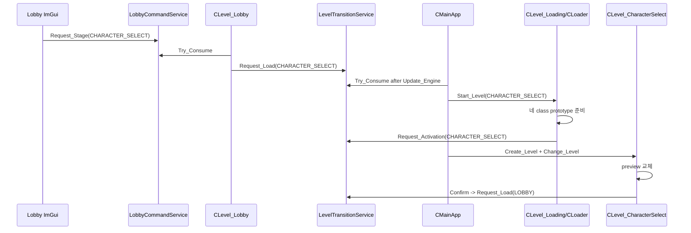
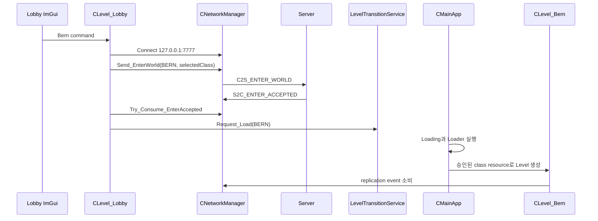

# LEVEL 단일 구조와 Character Select 학습·구현 가이드

작성일: 2026-08-03
전체 코드 정본: `2026-08-03_CHARACTER_SELECT_LEVEL_VERTICAL_SLICE_PLAN.md`

이 문서는 코드를 대신 작성하는 문서가 아니다. 사용자가 H/CPP를 직접 작성하면서 각 파일의 존재
이유, 호출 흐름, 자료구조, 불변식, 실패 원인을 설명할 수 있도록 작업 순서를 고정한다.

## 1. 먼저 말할 수 있어야 하는 결론

```text
LEVEL은 현재 실행할 장면의 identity다.
CLevelRegistry는 LEVEL을 create/load 함수에 연결한다.
CLoader는 선택이 끝난 LEVEL의 무거운 resource를 준비한다.
CLevelTransitionService는 Level이 Update 중 자기 자신을 삭제하지 않게 요청을 미룬다.
CLevel_Lobby는 네 stage 선택과 서버 승인 대기만 소유한다.
CLevel_CharacterSelect는 preview와 class 선택만 소유한다.
CCharacterSelectionState는 두 Level 사이에 class 값 하나만 보존한다.
```

`CLIENT_SCENARIO`, `ClientLaunchOptions`, `LevelCatalog.json`, Local Preview, Client smoke harness는
전부 이 구조에서 제외한다.

## 2. H와 CPP가 나뉘는 이유

H 파일은 다른 번역 단위가 알아야 하는 계약이다.

- class 이름과 상속 관계
- public 함수의 parameter와 반환값
- class가 소유하는 상태의 형태
- forward declaration으로 표현할 수 있는 의존성

CPP 파일은 계약을 지키는 실행 순서다.

- 입력 검증
- 외부 service 호출
- 성공 전 임시 상태 staging
- 실패 rollback
- 멤버 상태 commit
- 다음 소비자에게 결과 전달

H에 함수 본문과 불필요한 include를 몰아넣으면 H를 include한 모든 CPP가 구현 변경의 영향을 받는다.
반대로 멤버가 실제 object 크기를 알아야 하는 value type이면 forward declaration만으로 부족하다.

예를 들어 `shared_ptr<CCharacter>` 멤버는 H에서 `class CCharacter;`로 선언할 수 있다. 실제
`CCharacter::Get_Transform()`을 호출하는 CPP만 `Character.h`를 include한다.

## 3. 파일별 존재 이유와 책임 경계

### `Client_Defines.h`

존재 이유: Client 전체가 공유하는 닫힌 Level identity를 선언한다.

소유 상태: 없음. enum 정의만 소유한다.

불변식:

- `LEVEL::END`는 실제 Level이 아니다.
- `STATIC`과 `LOADING`은 Lobby 버튼 destination이 아니다.
- Test는 표시 이름이며 identity는 `LEVEL::DEVELOPMENT`다.
- `FRONT_CHARACTER_SELECT` 같은 두 번째 enum을 만들지 않는다.

### `CLevelRegistry`

존재 이유: `LEVEL`을 Loader 함수와 Level create 함수에 한 번만 연결한다.

직접 호출자:

- `CLoader`: `Execute_Load`
- `CMainApp`: `Create_Level`
- 제품 Level/Loader: map area와 load scope 조회
- `CLevelTransitionService`: target 등록 여부 검증

소유하지 않는 상태:

- 현재 Level
- pending transition
- network session
- 외부 stable scenario ID

### `CLoader`

존재 이유: GPU/model/map resource 준비를 Loading worker 수명에 묶는다.

입력: `LEVEL` 하나.

출력: `SUCCEEDED` 또는 실패 `HRESULT`, status text.

불변식:

- 성공 전에는 rollback scope를 commit하지 않는다.
- CharacterSelect는 지원 class 네 개의 prototype을 모두 준비한다.
- 제품/Test Character class는 서버 입장 요청에 사용한 class만 먼저 준비한다.
- remote class는 기존 `CPlayableCharacterAssetService` 경로로 lazy admission한다.

### `CLevelTransitionService`

존재 이유: 현재 Level 객체의 member function이 실행 중일 때 그 객체를 파괴하지 않는다.

자료구조: `std::optional<LEVEL_TRANSITION_REQUEST>` 하나.

왜 queue가 아닌가: 한 프레임에 두 Level 목적지를 순서대로 처리하는 것은 정상 요구가 아니다. 두 번째
요청을 쌓으면 사용자의 한 번 클릭이 중복 전환으로 바뀔 수 있다. pending 하나를 두고 중복을
명시적으로 실패시키는 편이 상태를 설명하기 쉽다.

불변식:

- pending request는 0개 또는 1개다.
- `LOAD`와 `ACTIVATE` 모두 target identity는 `LEVEL` 하나다.
- `ACTIVATE`는 `CLevel_Loading`만 제출한다.
- `Try_Consume`은 MainApp만 호출한다.

### `CMainApp`

존재 이유: Engine과 Client subsystem의 최상위 lifetime owner다.

이번 변경의 핵심 책임:

- 항상 Lobby loading으로 시작한다.
- Network frame을 main thread state로 반영한다.
- 현재 Level Update가 끝난 뒤 pending Level request를 적용한다.
- Client에서 유일하게 `Change_Level()`을 호출한다.
- Debug build에서 tool instance를 lazy 소유한다.

소유하지 않는 책임:

- stage를 고르는 UI 정책
- server world 승인 판정
- Character preview 선택
- smoke 자동 종료와 report 작성

### `CLevel_Lobby`

존재 이유: 제품 시작 화면에서 네 destination과 서버 승인 state machine을 연결한다.

입력:

- ImGui stage button command
- NetworkManager의 `S2C_ENTER_ACCEPTED`
- connection 상태와 steady clock

출력:

- CharacterSelect `LOAD` 요청
- Test/Bern/Valtan의 승인 후 `LOAD` 요청
- 실패 status

소유 상태:

- `LOBBY_ENTRY_STATE`
- pending stage/world
- 5초 deadline
- status string

소유하지 않는 상태:

- socket 자체
- packet queue
- Character object
- Local Preview
- server host input

### `CLobbyCommandService`

존재 이유: ImGui Render 코드가 socket과 packet을 직접 호출하지 않게 stage 의도만 전달한다.

자료구조: `optional<LOBBY_STAGE_COMMAND>` 하나.

`LOBBY_STAGE`가 `LEVEL`과 별도인 이유: UI의 `Test`는 `LEVEL::DEVELOPMENT`이면서
`WORLD_ID::TRAINING_GROUND`도 필요하다. `Character Select`는 network world가 없다. UI 목적지를
LEVEL 하나로 바로 바꾸면 Lobby가 서버 승인 없이 제품 Level 전환을 요청하기 쉽다.

### `CLevel_CharacterSelect`

존재 이유: Lobby의 stage 선택과 Character preview 제작 책임을 분리한다.

입력: class selectable, Confirm, Back.

출력:

- preview Character 교체
- Confirm 때 selected class commit
- Lobby `LOAD` 요청

불변식:

- preview class는 지원 class 네 개 중 하나다.
- preview 생성 실패 시 기존 preview는 남는다.
- Back은 session selection을 바꾸지 않는다.
- Confirm 성공 전에는 global selection을 영구 변경하지 않는다.
- network 함수는 호출하지 않는다.

### `CCharacterSelectionState`

존재 이유: CharacterSelect가 파괴된 뒤 Lobby가 선택 class를 읽어야 한다.

왜 `CCharacterCatalog`에 넣지 않는가: Catalog는 class ID를 불변 spec에 연결한다. 사용자 선택은
변하는 session state다. 정의와 선택을 섞으면 catalog 조회가 상태 변경 API가 된다.

왜 `CNetworkManager`에 넣지 않는가: 선택은 connect 전에도 존재한다. NetworkManager가 UI session
state까지 소유하면 socket reset이 선택까지 지워야 하는지 경계가 흐려진다.

### `CLevel_Loading`

존재 이유: Loader worker의 진행/실패를 화면 Level lifetime에 묶는다.

변경 후 중요한 점:

- 성공해도 직접 `Change_Level()`하지 않는다.
- `ACTIVATE` 요청만 제출한다.
- 제품 load 실패는 session을 닫고 Lobby `LOAD`를 요청한다.
- Lobby load 실패는 현재 Loading 화면에서 Retry만 제공한다.

### `CClientReplication`

존재 이유: network event를 Engine GameObject 생성/삭제/표현 상태로 번역하는 main-thread 경계다.

Local Preview 삭제 후 불변식:

- local Character는 registry의 local handle로만 찾는다.
- server spawn이 없으면 local Character도 없다.
- disconnect는 registry, world entity, HUD state를 함께 reset한다.
- `Create_Character`는 network spawn의 단일 생성 경로로 남는다.

## 4. 함수 계약을 읽는 방법

### `CLevelTransitionService::Request_Load`

존재 이유: 일반 Level이 다음 Level resource 준비를 요청한다.

호출자: Lobby, CharacterSelect, Bern/Valtan/Test disconnect recovery, Loading failure recovery.

입력: 등록된 target `LEVEL`.

읽는 상태: registry, pending optional.

변경 상태: pending request, status.

성공 조건: target 등록됨, 기존 pending 없음.

실패 조건: `END`/미등록 target 또는 중복 요청.

다음 소비자: `CMainApp::Apply_LevelRequest`.

### `CLevelTransitionService::Request_Activation`

존재 이유: Loader가 끝난 target을 실제 Level object로 만들 준비가 됐음을 알린다.

호출자: `CLevel_Loading::Update` 하나.

차이점: Loader를 다시 시작하는 요청이 아니라 이미 준비된 target을 생성하는 요청이다.

### `CMainApp::Apply_LevelRequest`

존재 이유: Level member function의 call stack 밖에서 current Level을 바꾼다.

호출 시점: `CGameInstance::Update_Engine()` 반환 후.

분기:

- `LOAD`: `Start_Level(target)`으로 Loading Level 생성
- `ACTIVATE`: 현재가 Loading인지 검증 후 registry create와 `Change_Level(target)`

불변식: Client의 다른 파일은 `Change_Level`을 호출하지 않는다.

### `CLevel_Lobby::Begin_StageRequest`

존재 이유: UI stage를 network 없는 frontend 이동 또는 server world 입장으로 해석한다.

입력: `LOBBY_STAGE`.

상태 변화:

- CharacterSelect: transition pending
- 제품/Test: network connected, pending stage/world, deadline, WAITING

실패 시 보존: Lobby가 계속 current Level이고 Local fallback이 없다.

### `CLevel_Lobby::Update`

존재 이유: command, server acceptance, timeout을 한 state machine에서 직렬화한다.

중요한 순서:

```text
command 소비
-> 새 connect/send 시작
-> acceptance 소비
-> 요청 world와 승인 world 비교
-> LEVEL load 요청
-> timeout/disconnect 확인
-> base Level Update
```

### `CLevel_CharacterSelect::Ready_Preview`

존재 이유: 선택 class의 presentation Character를 교체한다.

transaction 순서:

```text
class/spec 검증
-> 새 Character 생성
-> cast/Transform 검증
-> 기존 Character 제거
-> member pointer와 preview class commit
-> Camera target 교체
```

기존 Character를 먼저 지우지 않는 이유는 새 model/part 생성 실패 시 사용자가 빈 화면만 보게 되는
것을 막기 위해서다.

### `CLoader::Ready_For_CharacterSelect`

존재 이유: selectable 네 class를 클릭할 때 disk decode가 발생하지 않게 Level 진입 전에 준비한다.

반복문 종료 조건: 고정 array 네 원소 완료 또는 취소/실패.

실패 보존: rollback scope가 Level resource를 제거하고 Loading이 Lobby recovery를 요청한다.

## 5. 호출 흐름을 직접 그리는 연습

### Character Select 진입과 확정



### Bern 진입



## 6. 헤더 include 판단표

| 파일 | include | 이유 |
|---|---|---|
| `CharacterSelectionState.h` | `Network/PacketType.h` | member의 enum 정의가 필요 |
| `LevelTransitionService.h` | `Client_Defines.h` | request가 LEVEL value를 소유 |
| `Level_CharacterSelect.h` | `Level.h` | base class 완전한 정의 필요 |
| `Level_CharacterSelect.h` | `<array>` | fixed class list value member |
| `Level_CharacterSelect.cpp` | `Character.h` | 생성, cast, Transform 호출 |
| `Level_CharacterSelect.cpp` | `CharacterCatalog.h` | class ID에서 spec 조회 |
| `Level_Lobby.cpp` | `NetworkManager.h` | connect/send/acceptance 소비 |
| `LevelRegistry.cpp` | 각 Level header | static Create 함수 호출 |
| `Loader.cpp` | `LevelRegistry.h` | map descriptor 조회 |
| `MainApp.cpp` | `LevelTransitionService.h` | pending 요청 소비 |

Public H에서 `MainApp.h`나 `NetworkManager.h`를 필요 없이 include하지 않는다. pointer/reference만
보관하면 forward declaration을 먼저 검토한다.

## 7. 변수 이름과 상태 의미

| 변수 | 의미 | 바뀌는 함수 | 금지 상태 |
|---|---|---|---|
| `m_eSelectedClass` | 다음 server enter에 사용할 class | `Select` | unsupported/END |
| `m_ePreviewClass` | 현재 화면에 보이는 class | `Ready_Preview` | preview pointer와 불일치 |
| `m_eEntryState` | Lobby 승인 state | `Begin_StageRequest`, `Update` | IDLE인데 pending world 존재 |
| `m_ePendingStage` | 승인 후 갈 UI stage | `Begin_StageRequest`, reset | WAITING인데 END |
| `m_ePendingWorldId` | 보낸 world | `Begin_StageRequest`, reset | acceptance와 불일치한 채 전환 |
| `m_ApprovalDeadline` | 최대 승인 대기 시각 | connect/send 성공 직후 | system_clock 사용 |
| `g_PendingRequest` | MainApp이 적용할 Level request | `Stage`, `Try_Consume` | 2개 이상 |
| `m_eNextLevelID` | Loader가 준비 중인 target | Loading Initialize | registry 미등록 |

`Data`, `Manager`, `Temp`, `Handle`만으로 의미를 숨기는 새 이름을 쓰지 않는다. 예를 들어
`m_TempData` 대신 `stagedCharacter`, `m_Manager` 대신 실제 type의 역할을 이름에 드러낸다.

## 8. 직접 작성 순서와 매 단계 확인

### 단계 1: enum과 state

작성:

- `LEVEL::CHARACTER_SELECT` 확인
- `CharacterSelectionState.h/.cpp`

확인:

- default가 LanceMaster인가
- END와 Destroyer를 Select했을 때 false인가
- H가 NetworkManager를 include하지 않는가

### 단계 2: transition boundary

작성:

- SceneTransitionService 삭제
- LevelTransitionService 추가
- MainApp의 `Apply_LevelRequest`
- Loading의 activation/recovery 요청

확인:

```powershell
rg -n "Change_Level\(" Client
```

결과는 `MainApp.cpp`만 나와야 한다.

### 단계 3: registry와 loader

작성:

- descriptor 5개
- CharacterSelect create/load 등록
- map metadata 이동
- scenario branch 제거

확인:

- `Find(LEVEL::CHARACTER_SELECT)`가 null이 아닌가
- CharacterSelect Loader가 네 class를 모두 순회하는가
- Test가 `LV_DEV_TRAINING_GROUND`인가

### 단계 4: CharacterSelect

작성:

- 깨진 주석과 `initonly` 전체 삭제
- H 계약부터 작성
- preview staging/commit
- Confirm/Back

확인:

- Preview 실패 시 이전 object가 남는가
- Back이 selection state를 바꾸지 않는가
- socket include/call이 0건인가

### 단계 5: Lobby

작성:

- Character list와 Local/Multiplayer radio 삭제
- 네 stage command
- connect/send/acceptance/timeout

확인:

- Server 실패 시 Level request가 생기지 않는가
- acceptance 전 Loading으로 가지 않는가
- world mismatch가 socket을 닫는가

### 단계 6: 제품 Level과 replication

작성:

- Offline preview branch 삭제
- network sink 항상 설치
- connection loss LEVEL request
- local Character registry-only

확인:

- server spawn 전 camera follow가 꺼져 있는가
- spawn 후 local Character와 camera target이 같은가
- disconnect 후 registry/HUD가 비는가

### 단계 7: 실행/검증 정리

작성:

- ClientLaunchOptions/LevelCatalog/Offline files 삭제
- Client smoke scripts 삭제
- project/filter 정리
- `.slnLaunch`
- audit와 문서 교정

확인:

```powershell
rg -n "ClientLaunchOptions|CLIENT_SCENARIO|CLIENT_ENTRY_MODE|isOfflinePreview|OfflinePlayerPreview|SmokeHarness|--smoke" Client
```

0건이어야 한다.

## 9. 대표 면접 질문과 답변 골격

### 왜 enum만 쓰지 않고 Registry가 필요한가

`LEVEL` enum은 identity만 표현합니다. 실제 Level을 생성하는 함수와 준비해야 할 Loader 함수까지 enum
안에 넣을 수는 없습니다. Registry는 외부 JSON을 파싱하는 Catalog가 아니라 enum을 함수 포인터와
고정 map metadata에 연결하는 compile-time dispatch table입니다. 이를 제거하면 Loader와 MainApp에
같은 switch가 반복됩니다.

대안은 각 위치의 switch입니다. 파일 수는 줄지만 새 Level을 추가할 때 여러 switch를 함께 고쳐야
하고 누락을 compiler가 한곳에서 보여주지 못하는 단점이 있습니다.

### Loader를 Level Initialize에 합치지 않은 이유는 무엇인가

model decode, shader/model prototype 등록, map placement 준비는 비용이 크고 중간 실패가 가능합니다.
Level Initialize에 합치면 frame이 멈추고 rollback 책임도 제품 Level마다 중복됩니다. Loader로
분리하면 Loading UI, 취소/join, rollback scope를 공통으로 쓸 수 있습니다.

단점은 상태 전환 단계가 하나 늘고 worker-safe API만 호출해야 한다는 점입니다.

### 왜 transition service가 필요한가

현재 Engine의 `Change_Level`은 current Level unique_ptr을 즉시 reset합니다. Level의 `Update()`에서
직접 호출하면 실행 중인 객체를 파괴하는 undefined behavior가 됩니다. 요청을 staging하고
`Update_Engine()` 반환 뒤 MainApp이 적용하면 call stack 밖에서 안전하게 교체할 수 있습니다.

대안은 Engine LevelManager 자체에 deferred transition queue를 넣는 것입니다. 여러 Client가 공유할
범용 요구가 생기면 더 좋은 최종 위치지만, 현재 변경은 Client Level 정책이므로 Client service로
경계를 닫습니다.

### 왜 Local Preview를 삭제했는가

제품 Stage의 player, skill, damage, boss authority를 검증해야 하는데 Local Preview가 같은 버튼에서
서버 없는 Character를 만들면 성공처럼 보이는 두 번째 runtime이 됩니다. 현재 제품 계약은 server
approval 하나이므로 실패 시 Lobby 유지가 더 명확합니다.

대안은 별도 Development-only presentation sandbox입니다. 그것은 제품 Stage 진입과 이름/UI/코드를
공유하지 않아야 하며 실제 필요가 생겼을 때 별도 vertical slice로 추가합니다.

### 왜 CharacterSelectionState가 singleton인가

현재는 process 안에서 사용자 한 명, 선택 class 한 개이며 Lobby와 CharacterSelect의 Level lifetime을
넘겨야 합니다. 작은 application session state로 두면 pointer나 vector index를 저장하지 않고 enum
value만 보존할 수 있습니다.

단점은 global state이므로 test isolation과 다중 local profile에 약합니다. 계정/character slot이
생기면 authenticated session model이나 profile repository로 옮겨야 합니다.

### `array`와 `vector` 중 array를 선택한 이유는 무엇인가

현재 지원 class 네 개는 protocol의 compile-time 집합이고 CharacterSelect 진입 전에 전부 로드합니다.
크기 변경이 runtime 입력이 아니므로 `array`가 메모리 allocation 없이 크기 불변식을 표현합니다.
서버 character slot 목록이 동적으로 내려오면 그때 `vector<CHARACTER_SLOT_VIEW_MODEL>`이 맞습니다.

### 왜 Client 자동 smoke를 없애면서 ProjectAudit은 남기는가

삭제 대상은 Client executable 안의 scenario parser, 자동 조작, 자동 종료, report 분기입니다.
ProjectAudit은 source/data/project 계약을 읽는 외부 정적 검사이고 제품 Client runtime을 변형하지
않습니다. NetworkProtocolHarness와 Server contract test도 각 계층의 기존 계약 검증입니다.

실제 Client 화면과 Server 왕복은 Visual Studio multi-project 실행으로 확인하고 수동 결과를
RESULT에 기록합니다.

## 10. 모르는 질문을 받았을 때 사고 순서

1. 질문이 identity, lifetime, authority, data ownership 중 무엇인지 분류한다.
2. 실제 owner를 찾는다.
3. 입력이 어디서 만들어지고 어떤 경계를 통과하는지 추적한다.
4. 성공 전에 어떤 상태가 바뀌는지 확인한다.
5. 중간 실패 때 이전 상태가 보존되는지 본다.
6. 중복/timeout/disconnect 입력을 넣어본다.
7. 현재 선택과 최소 두 대안을 비교한다.
8. 알 수 없는 부분은 추측하지 않고 breakpoint와 관찰값을 제시한다.

답변 형식:

```text
제가 확인할 첫 불변식은 ... 입니다.
이 값의 owner는 ... 이고, 직접 변경하는 함수는 ... 입니다.
정상 흐름은 A -> B -> C이며, 실패는 B에서 ... 상태로 전달됩니다.
현재 구현을 선택한 이유는 ... 이고 대안은 ... 입니다.
확실하지 않은 부분은 ... breakpoint에서 ... 값을 확인해 결론내리겠습니다.
```

## 11. 작은 요구사항 변경 연습

### Lobby 버튼 순서를 Bern, Valtan, Test, Character Select로 바꾸기

수정 위치: `Render_StagePanel`의 호출 순서만 변경.

수정하면 안 되는 곳: LEVEL enum 값, Registry 순서, world mapping.

### 승인 timeout을 5초에서 8초로 바꾸기

수정 위치: deadline을 만드는 한 줄.

더 나은 후속: `constexpr auto ENTER_APPROVAL_TIMEOUT = std::chrono::seconds(5);`로 이름을 부여하고
그 상수만 변경한다.

### 새 class를 추가하기

한 줄 enum 추가로 끝나지 않는다.

```text
Shared supported class 계약
-> Actor catalog와 runtime model/equipment
-> CharacterSpec/Logic
-> PlayableCharacterAssetService tags
-> CharacterSelect array
-> Server balance profile와 admission
-> build/manual verification
```

### CharacterSelect에서 회전 slider 추가하기

Level state에 yaw 하나를 추가하고 preview Character의 Transform에만 적용한다. 선택 session state에는
class 외 값을 아직 저장하지 않는다. 외형 저장 요구가 생기면 별도 appearance value object와
server validation 계약을 설계한다.

### server endpoint를 바꾸기

현재는 `127.0.0.1:7777` 고정이다. 다시 ClientLaunchOptions를 만들지 않는다. LAN UI가 실제 제품
요구가 되면 endpoint value object, IPv4 validation, persistence 금지, connection state machine을
별도 계획으로 추가한다.

## 12. 주석과 인코딩

주석은 한글로 작성한다. 함수명 반복이 아니라 이유와 불변식을 적는다.

```cpp
// 새 preview 생성이 끝난 뒤 기존 preview를 제거해야 실패 시 화면이 비지 않는다.
// 승인 world가 요청 world와 다르면 잘못된 session 상태이므로 연결을 닫는다.
// Level의 Update가 반환된 뒤에만 현재 Level을 교체한다.
```

새 C++은 UTF-8(BOM 없음)이다. 기존 파일은 현재 encoding을 먼저 확인하고 유지한다. 터미널 출력이
깨졌다는 이유만으로 파일을 ANSI/UTF-8로 일괄 변환하지 않는다.

## 13. 완료 전 스스로 답할 다섯 문장

1. 각 파일과 class가 없으면 어떤 책임이 어느 파일로 새는지 설명할 수 있다.
2. Lobby button부터 Character/Map 표시까지 호출 흐름을 그릴 수 있다.
3. pending request, pending world, selected class의 owner와 불변식을 설명할 수 있다.
4. server 부재, 승인 mismatch, Loader 실패, disconnect를 재현하고 첫 확인 변수를 말할 수 있다.
5. timeout이나 버튼 순서 같은 작은 변경을 책임 경계를 깨지 않고 반영할 수 있다.
