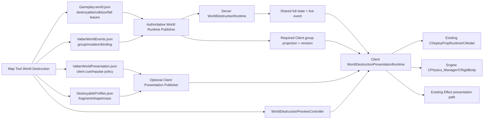

# 발탄 아레나 Map Tool 파괴 시뮬레이션·PhysX 구현 계획

작성일: 2026-08-07

현재 코드 재실측·전면 개정: 2026-08-08

문서 유형: 구현 계획서

대상 Area: `LV_LUT_HEARTRB_ED`
상태: 구현 전 계획. 현재 완료 상태는 대응 RESULT가 소유한다.

연결 문서:

- [현재 구현 결과](2026-08-07_VALTAN_WORLD_DESTRUCTION_RESULT.md)
- [PhysX 본질·세팅·활용 설계](../08-05/2026-08-05_PHYSX_ESSENCE_SETUP_UTILIZATION_DESIGN_PLAN.md)
- [PhysX G00-G01 전체 코드 PLAN](../08-05/2026-08-05_PHYSX_INTEGRATION_G00_G01_PLAN.md)
- [Map gameplay destroyable/nav 확장 계획](../08-05/2026-08-05_MAP_GAMEPLAY_TRIGGER_DESTROYABLE_NAV_EXTENSION_PLAN.md)
- [Valtan DeployProp 런타임 복구 결과](../08-05/2026-08-05_VALTAN_DEPLOYPROP_RUNTIME_RESTORE_RESULT.md)

이 문서는 2026-08-07의 최초 PLAN을 현재 코드 기준으로 다시 쓴다. 최초 PLAN은 G1을 읽기 전용
진단으로 잡았지만 실제 코드는 `CWorldDestructionDocument`, group/mutation/binding 저작,
타임라인, 피킹, 상태 프리뷰까지 진행됐다. 따라서 아래 G는 과거 PLAN의 번호를 이어 붙이지 않고,
현재 구현을 기준으로 `WD-G00`부터 다시 정의한다.

---

## 0. 최종 방향

사용자가 제안한 큰 방향은 채택한다.

```text
Map Tool에서 파괴 단위를 선택한다.
→ 발탄 pattern/stage 또는 collision receiver와 연결한다.
→ 같은 맵 화면에서 파괴 애니메이션과 물리 파편을 재생한다.
→ 저장된 stable ID 문서를 publisher가 검증한다.
→ Server가 실제 파괴 시점과 collision/navigation/fall 상태를 확정한다.
→ Client가 CModel 상태 전환, Effect, PhysX debris를 표현한다.
```

다만 다음 네 단위는 반드시 분리한다.

| 단위 | 정본 owner | 역할 |
|---|---|---|
| 파괴 그룹과 mutation | `ValtanWorldEvents.json` + Server runtime | 어떤 벽들이 함께 언제 어떤 상태로 바뀌는지 결정 |
| 벽의 지속 시각 상태 | `CDeployPropRuntime -> CDeployPropObject -> CModel` | `INTACT`, `FRACTURED`, `DESPAWNED`의 late-join 가능한 결과 표현 |
| 일회성 파괴 연출 | Client presentation runtime | 공격 한 번에만 animation/effect/audio/camera/debris 재생 |
| rigid-body 계산 | Engine `CPhysics_Manager`의 `PxScene` | 중력, 충돌, 선속도·각속도, sleep을 고정 스텝으로 계산 |

`CRigidBody` 컴포넌트 내부에 독립된 시뮬레이터가 하나씩 존재하는 구조가 아니다.

```text
CPhysics_Manager
  owns: Foundation, PxPhysics, PxScene, dispatcher, material, actor registry
  runs: simulate(fixedDt) + fetchResults(true)

CRigidBody
  owns: Engine stable actor handle, body/shape 설정, Transform 동기화 정책
  requests: gravity, dynamic actor의 kinematic/simulated 전환, velocity, impulse
  does not own: PxScene, 별도 simulation loop, gameplay authority
```

따라서 질문에 대한 정확한 답은 다음과 같다.

- 낙하는 가능하다. dynamic actor를 simulated로 풀고 gravity를 켜면 아래로 떨어진다.
- 공격 방향 파괴도 가능하다. 파편별 body에 발탄의 진행 방향·충돌점·충돌 법선으로 계산한 impulse를 준다.
- rigid body 하나를 벽 전체 모델 하나에 붙이면 벽 전체가 한 덩어리로 날아간다.
- 모델이 자동으로 여러 조각으로 fracture되지는 않는다. 분리된 fragment mesh, 분리 가능한 model mesh,
  또는 `b_piece_*` bone별 shape가 먼저 필요하다.
- 플레이어 낙사 판정과 벽이 사라졌다는 판정은 Server가 한다. Client PhysX pose를 Server 정답으로 보내지 않는다.

### 0.1 최종 아키텍처



Map Tool 프리뷰와 제품 Client가 마지막 presentation runtime 구현과 데이터 계약을 공유하되 instance는
각 owner가 따로 가진다. Map Tool이 별도 모델
로더·별도 파편 렌더러·별도 물리 공식을 만들지 않는다.

### 0.2 이번 계획에서 채택하지 않는 구조

- `CModel` 안에 `PxRigidDynamic*`를 직접 넣지 않는다.
- `CDeployPropObject`마다 별도 `PxScene`을 만들지 않는다.
- Effect Tool이나 Animation Tool의 private class를 Map Tool에서 include하지 않는다.
- boss clip 이름, Prototype tag, C++ pointer, vector index를 world JSON의 저장 ID로 사용하지 않는다.
- `Set_State(FRACTURED)`만 보고 매번 파편을 생성하지 않는다. late join에서 과거 폭발이 재생된다.
- Client PhysX 파편이 player collision, Server navigation, damage 판정에 영향을 주지 않는다.
- 현재 에셋을 PhysX가 런타임에 자동 절단해 줄 것으로 가정하지 않는다.

---

## 1. 현재 코드와 데이터 실측

### 1.1 이미 구현된 부분

현재 `CMapTool`에는 `TOOL_MODE::WORLD_DESTRUCTION`이 존재하고 다음 기능이 연결돼 있다.

- `CEncounterPatternReference`로 Valtan pattern/stage를 읽는다.
- `CWorldDestructionDocument`로 group/mutation/binding을 메모리에서 저작한다.
- `Render_DestructionTimeline()`이 pattern stage와 binding marker를 그린다.
- `Try_PickDeployProp()`이 현재 맵의 실제 DeployProp을 피킹한다.
- `Apply_DestructionPreview()`가 선택 prop/group을 `INTACT/FRACTURED/DESPAWNED`로 바꾼다.
- `CDeployPropRuntime`이 Map Tool과 `CLevel_ValtanArena`에서 같은 `CDeployPropObject` 경로를 쓴다.
- 새 `EncounterPatternReference`와 `WorldDestructionDocument` H/CPP는 Client project/filter에 등록돼 있다.

현재 프리뷰는 물리가 아니다.

```text
STATIC DeployProp
  INTACT     -> intact CModel
  FRACTURED  -> fractured CModel 전체 교체
  DESPAWNED  -> render 중지

ANIM DeployProp
  INTACT     -> logical on clip
  FRACTURED  -> logical off clip
```

`CDeployPropObject::Set_State()`는 같은 상태 요청이면 조기 반환하므로 one-shot animation 재시작과
persistent state 적용도 아직 분리돼 있지 않다.

### 1.2 추출된 파괴 에셋

`LV_LUT_HEARTRB_ED.deployassets`는 9개 asset, `.deployplacements`는 85개 placement를 가진다.

| asset | kind | placement 수 | 현재 파괴 표현 |
|---|---:|---:|---|
| `DEPLOY_ITR_02306` | STATIC | 5 | intact/fractured model swap |
| `DEPLOY_ITR_02307` | STATIC | 4 | intact/fractured model swap |
| `DEPLOY_ITR_02308` | STATIC | 6 | intact/fractured model swap |
| `DEPLOY_ITR_02309` | STATIC | 2 | intact/fractured model swap |
| `DEPLOY_ITR_02310` | STATIC | 3 | intact/fractured model swap |
| `DEPLOY_ITR_02311` | STATIC | 2 | intact/fractured model swap |
| `DEPLOY_ITR_02315` | STATIC | 28 | intact/fractured model swap |
| `DEPLOY_ITR_02316` | STATIC | 27 | intact/fractured model swap |
| `DEPLOY_ITR_02326` | ANIM | 8 | `on/off` clip, fractured model 없음 |

85개 placement 모두 `destructible=1`이지만 이 값은 “물리 파편 데이터가 있다”는 뜻이 아니다.
현재 추출 데이터에는 다음이 없다.

- piece별 stable ID
- piece별 local pivot/bounds/collision shape
- mass, damping, friction, restitution
- linear/angular impulse policy
- debris lifetime과 collision layer
- animation bone에서 dynamic body로 넘어가는 handoff 정보

`DEPLOY_ITR_02326`은 `b_piece_00`부터 `b_piece_14`까지 15개 piece bone을 갖지만 `ao_off`는
약 1.83초 정지 뒤 scale을 0으로 만드는 소멸 표현이다. 현재 clip 자체가 파편 비행을 만들지는 않는다.

### 1.3 제품 런타임에서 아직 막힌 부분

- `Data/Encounters/Valtan/ValtanWorldEvents.json`은 아직 없다.
- `Gameplay.world.json`의 Client parser는 `destroyable`을 이해하지만 실제 Valtan row는 0개다.
- `Publish-WorldGameplay.ps1`은 `destroyable`, `setCondition`, `setDestroyableState`를 fail-closed한다.
- `LV_LUT_HEARTRB_ED.navblockers`의 region 수는 0이다.
- Shared packet과 Server bootstrap에는 destroyable group/state/event가 없다.
- `CServerNavigation`에는 동적 blocker overlay가 없다.
- `CServerCollisionSystem`에는 stable collision ID enable/disable과 boss impact receiver 경로가 없다.
- `CValtanBrain`의 `WALL_CHARGE` stage는 현재 `WINDUP/NONE`이며 실제 forced charge 이동이 없다.
- `Engine/ThirdPartyLib/PhysX`, `CPhysics_Manager`, `CRigidBody`는 아직 없다.

즉 지금 Map 담당자가 즉시 확인할 수 있는 것은 상태 교체와 `off` clip까지다. 실제 방향성 파편,
Server 충돌 파괴, dynamic nav, 낙사는 아래 G를 닫기 전에는 제품 완료가 아니다.

---

## 2. 파괴 애니메이션과 rigid body의 결합 규칙

### 2.1 상태 애니메이션과 debris를 분리한다

```text
INTACT
  Server/late join 정본: intact wall

BREAKING
  one-shot event: off clip, effect, sound, camera, debris spawn
  gameplay collision/nav: mutation의 commitTick까지 기존 상태 유지

FRACTURED
  Server/late join 정본: fractured replacement model
  과거 debris event는 재생하지 않음

DESPAWNED
  Server/late join 정본: persistent prop 미표시
```

`BREAKING`은 transient runtime 상태다. `Gameplay.world.json`의 initial state에는 허용하지 않는다.

### 2.2 animation → physics handoff

한 transform이나 bone을 animation과 dynamic solver가 동시에 소유하면 진동·teleport가 발생한다.

```text
1. animation-owned
   prop root 또는 piece bone을 CModel이 갱신한다.

2. handoff frame
   현재 world pose를 읽는다.
   같은 pose로 미리 생성된 dynamic/kinematic rigid actor를 배치한다.
   kinematic target 갱신을 중단한다.

3. physics-owned
   dynamic actor의 motion mode를 KINEMATIC에서 SIMULATED로 전환한다.
   gravity를 켠다.
   linear/angular impulse를 한 번 적용한다.

4. reclaim
   sleep 또는 lifetime 종료 시 actor와 debris object를 제거한다.
```

static wall의 persistent fractured model은 원래 위치의 late-join 상태를 소유하고, live debris는 별도
`CDestructionDebrisObject`가 소유한다. 같은 fractured model 전체를 움직였다가 원위치로 되돌리지 않는다.

### 2.3 공격 방향 impulse

파편 중심 `P`, 공격 충돌점 `O`, 발탄 진행 방향 `A`, world up `U`를 사용한다.

```cpp
radial = Normalize(P - O);
scatter = SeededUnitVector(randomSeed, pieceId);
direction = Normalize(
    A * directionalWeight +
    radial * radialWeight +
    U * upwardBias +
    scatter * scatterWeight);

linearImpulse = direction * impulseStrength;
angularImpulse = SeededAngularAxis(randomSeed, pieceId) * angularStrength;
```

단위 계약은 다음으로 고정한다.

| 값 | 단위/기준 |
|---|---|
| 위치·shape | 게임 world meter = PhysX meter |
| 질량 | kilogram |
| 중력 | `(0, -9.81, 0)` m/s² |
| 선속도 | m/s |
| impulse | N·s |
| 각속도 | rad/s |
| Server tick | 30 Hz |
| Client physics | fixed 60 Hz |

impulse mode는 PhysX 타입이 아니라 프로젝트 semantic enum으로 저장한다.

```text
NONE
ATTACK_FORWARD
RADIAL_FROM_IMPACT
RADIAL_FROM_ARENA_CENTER
AUTHORED_VECTOR
```

### 2.4 파편 granularity

| 모드 | 결과 | 사용 조건 |
|---|---|---|
| `STATE_ONLY` | model swap/off clip만 | 모든 현재 asset의 안전한 기본값 |
| `WHOLE_PLACEMENT` | placement 하나가 큰 rigid body 하나 | 최종 상태가 `DESPAWNED`인 기술 프리뷰 또는 큰 덩어리 연출 |
| `MODEL_MESH_PIECES` | fractured model의 승인된 mesh별 actor | stable mesh name, local bounds/pivot 검증 완료 시 |
| `FRAGMENT_MODELS` | 별도 fragment `.wmodel`별 actor | 제품 파편의 우선 경로 |
| `SKELETAL_PIECES` | `b_piece_*` bone pose를 actor로 handoff | `ITR_02326` 후속 단계 |

모델의 submesh가 재질 분할일 뿐 공간적으로 분리된 조각이 아닐 수 있으므로 `MODEL_MESH_PIECES`는
자동 승인하지 않는다. Map Tool preview에서 piece별 bounds와 회전 결과를 확인한 profile만 publish한다.

`FRAGMENT_MODELS`의 Resources-relative asset ID는 `CWorldDestructionPresentationAssetService`가 기존
`CModel::Create -> CGameInstance::Add_Prototypes` 경로로 batch lazy admission한다. 서비스가 만든 Prototype tag는
process-local index일 뿐 JSON에 저장하지 않는다. `CDestructionDebrisObject`는 검증이 끝난 prototype을
clone하며 batch 중 한 fragment가 실패하면 그 cue의 staged prototypes/objects를 전부 rollback한다.

---

## 3. Map Tool Model View의 최종 형태

### 3.0 벽 중심 간편 편집기 통합

맵툴 담당자의 `Easy Wall Editor`는 아래 단계별 범위를 유지하며, 이 계획의
`Destruction Model View` 물리 audition과 같은 `CWorldDestructionDocument` 및
`CDeployPropRuntime`을 공유한다.

| G | 범위 | 종료 증거 |
|---|---|---|
| G1 | MapTool `World Destruction` 읽기 전용 진단 모드 | 5번째 모드 표시, encounter/deploy/world/nav 네 정본을 한 화면에서 읽음, 저장 경로 0개 |
| G2 | `ValtanWorldEvents.json` 문서와 strict parser, atomic save | 그룹 0개 문서 Save -> Load 왕복, 잘못된 문서에서 기존 문서 보존 |
| G3 | 그룹 저작 UI와 벽 한 그룹 작성 | `3705102` 5개를 한 그룹으로 저장하고 재로드해 동일 |
| G4 | 개별 `Set_State` 미리보기, 벽 선택·간편 편집기, nav region 연결 | 벽 선택 -> 정보/설정/강조가 한 화면에 보이고 INTACT/FRACTURED 전환이 보임. nav region 자동 셀 계산은 별도 완료 증거 필요 |
| G5 | Publisher의 destroyable / world event / navblocker 검증 | `Publish-WorldGameplay.ps1 -Mode Validate` 통과, 잘못된 참조에서 실패 |
| G6 | Server `INTACT -> BREAKING -> FRACTURED` 상태와 collision receiver | `Server.exe --contract-test` 통과 |
| G7 | Shared full sync / delta / late join | `NetworkProtocolHarness` failures 0 |
| G8 | Client `CDeployPropRuntime::Set_State` 서버 연결 | Server 명령으로만 벽이 바뀌고 재접속 Client도 같은 상태 |
| G9 | MapTool 타임라인과 파괴 미리보기 | stage 시간축 Play/Pause/Restart/현재 시점 복사. 실제 Valtan clip 동기 재생은 actionId→clip 계약 뒤 검증 |
| G10 | 돌진 충돌 판정과 스킬 이동 sweep 보강 | 벽이 실제로 이동을 막고 `Q`로 통과되지 않음 |
| G11 | 아레나 바닥 붕괴와 낙사 hazard | `VALTAN_ARENA_BREAK_80` 에서 반대 polarity가 동작 |
| G12 | 파괴 Effect / Camera / Audio 와 world-space effect spawn | Valtan admitted effect로 파편·먼지 재생 |
| G13 | 나머지 그룹 확장 | 85개 중 저작 대상 전부가 같은 계약으로 동작 |

첫 완료 단위는 G1~G8이다. 벽 한 그룹이 Server 확정으로 부서지고 collision/nav가 함께 열리며
재접속 Client가 같은 상태를 받는 것까지가 하나의 검증 단위다.

#### 2026-08-08 벽 중심 간편 편집기 보강

기존 Group/Mutation/Binding 원본 구조는 `Advanced Graph Editor`로 보존한다. 기본 화면은 사용자가
내부 stable ID를 직접 조립하지 않도록 다음 순서만 노출한다.

```text
벽 선택(월드 또는 목록)
-> 선택 벽의 asset/runtimePlacementId/위치/원본 근거/그룹 표시
-> Valtan pattern과 stage 선택
-> stage 시작/선택 시점/종료/보스 충돌 조건 선택
-> 그룹 BREAKING 표시 시간과 enabled 여부 선택
-> group/mutation/binding stable ID 자동 생성
-> 전체 외부 참조 검증
-> atomic Save
```

월드 선택은 `Target_PickPos`가 돌려준 실제 렌더 표면점을 DeployProp world AABB 소유권과
대조한다. 실패는 무음으로 삼키지 않고 `no rendered surface`와 `not a loaded DeployProp`을
구분한다. 목록 선택도 같은 `Select_DestructionWall()` 경로를 사용해 그룹 역조회와 와이어
강조가 항상 같이 갱신된다.

시간축은 `ValtanEncounter.json`의 stage 누적 시간만 재생한다. 현재 제품에는 actionId별 실제
clip binding이 없으므로 이 화면은 정확한 발탄 애니메이션을 재생한다고 주장하지 않는다.
`patternWindup / patternActive / patternRecovery` 공통 클립이라는 현재 런타임 한계를 화면에
명시한다.

간편 Apply는 `CWorldDestructionDocument` 복사본에 group/member/mutation/binding을 모두 적용한
뒤 성공할 때만 교체한다. 자동 ID는 선택 벽 순서가 아니라 stable group identity와 semantic
hash를 사용하고, 같은 semantic 중복이나 hash 충돌은 저장하지 않는다. Save 직전에는 문서의
모든 DeployProp, pattern/stage, Collision Box, navigation region 외부 참조를 다시 검증한다.
같은 navigation region을 두 그룹이 동시에 소유하거나, enabled binding이 빈 벽 그룹·0-cell
navigation region·비활성 Collision Box를 가리키면 저장을 거부한다. World Gameplay 또는
Navigation에 미저장 변경이 있으면 world-events 단독 저장도 거부하고 `Save All` 순서를 요구한다.
Encounter와 WorldEvents를 함께 Reload할 때는 두 파일을 모두 stage하고 서로 검증한 뒤 한 번에
commit한다. Encounter 단독 Reload와 Area 전환도 같은 cross-document 검증을 통과한 문서만
commit한다. enabled binding은 정확히 하나의 `BOSS_VALTAN` 배치가 `ENCOUNTER_VALTAN`에 연결된
Area에서만 저장한다. 새 binding은 Server 수직 슬라이스가 닫히기 전까지 기본 `enabled=false`다.

#### 최초 G1 경계 (2026-08-07 기록)

아래 절은 최초 G1 계획을 보존한 기록이다. 현재 코드는 1.1절과 대응 RESULT에 적힌 대로
G2/G3, G4 일부, G9의 데이터 시간축 일부까지 확장됐다.

G1은 **읽기 전용 진단 모드**다. 저장 경로, dirty 플래그, runtime 상태 변경을 만들지 않는다.

G1이 하는 일:

1. `TOOL_MODE::WORLD_DESTRUCTION`을 5번째 모드로 추가한다.
2. `Data/Encounters/Valtan/ValtanEncounter.json`을 읽기 전용으로 strict parse하는
   `CEncounterPatternReference`를 추가한다.
3. pattern / stage / 누적 offset / Server tick 환산을 표로 보여준다.
4. `m_DeployRuntime`의 85개 배치를 asset·stateOffActionId·trig 별로 보여준다.
5. `m_WorldGameplayDocument`의 dormant `destroyable` 행을 보여준다.
6. `m_RuntimeBlockerDocument`의 nav region을 보여준다.
7. 0절에서 실측한 미구현 경계를 잠긴 진단 문구로 고정 표시한다.

G1이 하지 않는 일: 그룹 생성, 상태 변경, 저장, publisher 호출, Server 통신.

G1 종료 증거는 대응 RESULT에 보존한다.

### 3.1 두 뷰의 역할을 구분한다

현재 `CMapAssetPreview`는 단일 `CModel`을 정적 렌더 경로로 별도 color/depth render target에 그리는
asset inspector다. animation clock, GameObject lifecycle, PhysX scene, 여러 prop group을 소유하지 않는다.

따라서 WD-G04에서 만드는 파괴 Model View는 `CMapAssetPreview` 안에 PhysX를 넣는 방식이 아니다.

```text
Map Tool의 실제 DEVELOPMENT world viewport
  Layer_DeployProps의 기존 CDeployPropObject를 그대로 표시
  선택 group으로 camera focus/solo
  같은 Engine PxScene에서 preview debris actor를 재생

투명 ImGui "Destruction Preview" control window
  Play / Pause / Reset / Single Step
  Focus Selected Group / Solo Group
  Preview INTACT / BREAKING / FRACTURED / DESPAWNED
  Attack Origin / Direction gizmo
  impulse/up-bias/scatter/seed 표시
  collision shape / center of mass / sleep debug draw
  active actor / sleeping actor / reclaimed actor 통계
```

Effect Tool의 Model View에서 재사용하는 것은 “투명 control window 아래 실제 world object를 재생하는
패턴”뿐이다. `CEffect_Tool`, `CEffectPlayback`, `CCharacterPreviewPanel`,
`CAnimationTargetService`를 Map Tool에 넣지 않는다.

향후 단일 animated asset의 bone/clip만 격리 검사할 필요가 생기면 `CMapAssetPreview`에 CModel 표준
animation sampling을 추가할 수 있다. 그러나 group destruction과 PhysX는 계속 world viewport에서만
재생한다.

### 3.2 Preview Controller의 책임

새 `CWorldDestructionPreviewController`는 모델이나 physics scene을 소유하지 않는다.

```text
입력
  selected groupId
  selected mutationId/bindingId
  attack origin/direction
  preview random seed
  CWorldDestructionPresentationRuntime에 대한 non-owning reference

session 상태
  STOPPED / PLAYING / PAUSED
  preview time
  staged group/mutation
  last error

출력
  persistent state 적용 요청
  one-shot preview event 한 번 제출
  camera focus bounds
  reset/cleanup 요청
```

V1 physics timeline은 `Play/Pause/Reset/Single Step`을 지원한다. 임의의 과거 시점으로 body pose를
보간하지 않는다. 뒤로 이동하려면 reset하고 같은 seed와 1/60 fixed step으로 다시 재생한다. global
scene을 한 프레임에 임의 fast-forward하는 기능은 첫 범위에 넣지 않는다.

같은 seed는 piece 선택과 초기 pose/impulse를 재현하기 위한 값이다. PhysX의 장시간 결과를 PC 간
network-deterministic truth로 만들겠다는 뜻이 아니다.

파편 충돌용 바닥도 명시적으로 stage한다. `CWorldDestructionPresentationRuntime::Stage_Area()`가
검증된 `ValtanWorldPresentation.supportVolumes`를 Client 표현용 static actor로 만들고 handle을 level
bucket에 보관한다. Map Tool은 support shape가 없으면 physics preview를 진단 오류로 막으며 제품 데이터에
존재하지 않는 `y=0` plane을 자동 생성하지 않는다. Pause/Single Step은 gameplay가 올라오지 않는
`LEVEL::DEVELOPMENT` Map Editor session에서만 허용한다.

Map Tool과 `CLevel_ValtanArena`는 같은 presentation runtime 구현과 데이터 계약을 쓰지만 같은 instance를
공유하지 않는다. `CMapTool`은 자신의 `CDeployPropRuntime` 옆에 preview용
`CWorldDestructionPresentationRuntime`을 소유하고, 제품 Level은 자신의 Deploy runtime 옆에 제품 instance를
소유한다. Map Tool 정리 순서는 controller reset → preview actor/object 제거 → presentation runtime clear →
deploy runtime clear다.

`Focus Selected Group`은 기존 free camera의 area framing seam을 재사용한다. `Solo Group`은 prop state를
`DESPAWNED`로 바꾸지 않고 `CDeployPropObject::Set_AuthoringVisible()`로만 비선택 prop을 숨긴다. Reset과
Area 전환은 authoring visibility를 모두 복원한다. 이 flag는 `_DEBUG` session 상태이며 저장·Server·제품
persistent state에 포함되지 않는다.

### 3.3 Preview 호출 흐름

```text
Frame N: CMapTool::Render_WorldDestructionPanel
→ 선택 group/mutation/binding 검증
→ Stage/Play/Pause/Reset/Single Step command만 latch
→ 현재 frame에서는 scene/actor를 직접 변경하지 않음

Frame N+1: CMainApp::Update의 Update_Engine은 이미 지나간 뒤 CMapTool::Update
→ latched command를 소비해 CWorldDestructionPreviewController::Stage/Restart/Play_Event
→ CWorldDestructionPresentationRuntime::Play_Event
→ 기존 CDeployPropRuntime에 persistent state 적용
→ profile에 승인된 debris object/rigid body stage

Frame N+2: 다음 CMainApp::Update의 CGameInstance fixed-step phase
→ CPhysics_Manager가 fixed step 실행
→ Post_Physics_Update에서 debris Transform 동기화
→ Late_Update/Render

Reset
→ preview actor handle 전부 제거
→ prop group을 authored initial state로 복원
→ animation track 0으로 복원
→ preview seed/time/sequence 초기화
```

현재 호출 순서에서 `CMapTool::Update`는 `Update_Engine` 뒤에 오므로 Render N에서 누른 Play가 물리 step에
반영되는 첫 시점은 N+2 update다. 이 editor-only two-frame command latency를 계약으로 받아들이고 UI에서
manager나 PxScene을 직접 step하지 않는다. 지연을 줄이는 pre-engine command pump는 별도 변경 단위다.
Area 전환, Level clear, Map Tool 종료에서도 같은 reset 경로를 호출한다.

---

## 4. 데이터 정본

### 4.1 `Gameplay.world.json`: gameplay leaf registry

현재 `CWorldDestructionDocument` v1 group은 raw `uint64 deployRuntimePlacementId`를 직접 저장한다.
아직 실제 `ValtanWorldEvents.json`이 없으므로 WD-G00에서 format v2로 바로 정규화한다.

`Gameplay.world.json`의 `destroyable` row가 사람이 읽는 stable placement ID와 deploy visual
instance를 연결한다.

```json
{
  "placementId": "destroyable.valtan.wall.3705102.100000b6",
  "kind": "destroyable",
  "position": [163.006504, 23.04, -129.46252],
  "yawDegrees": 45.3515625,
  "enabled": true,
  "deployRuntimePlacementId": "9335938568718910930",
  "initialState": "INTACT"
}
```

현재 v4 parser 계약상 destroyable leaf에도 `position`과 `yawDegrees`가 필수다. Map Tool은 연결된
`.deployplacements` transform에서 이를 복사하고 publisher가 허용 오차 안의 일치를 검사한다.
`deployRuntimePlacementId`는 JSON number의 64-bit 정밀도 손실을 막기 위해 decimal string으로 저장한다.

첫 벽 그룹의 정확한 source mapping은 다음으로 고정한다.

| stable destroyable placement ID | deploy runtime placement ID | source deploy actor |
|---|---:|---:|
| `destroyable.valtan.wall.3705102.100000b6` | `9335938568718910930` | `0x100000B6` |
| `destroyable.valtan.wall.3705102.100000b7` | `9681544306002658031` | `0x100000B7` |
| `destroyable.valtan.wall.3705102.10000083` | `12037145985028191659` | `0x10000083` |
| `destroyable.valtan.wall.3705102.100000b8` | `17280669848983777578` | `0x100000B8` |
| `destroyable.valtan.wall.3705102.1000007d` | `18177041425620847396` | `0x1000007D` |

`collisionBox`는 player/boss swept collision의 gameplay shape다. 벽 파괴까지는 기존
`Gameplay.world.json` format version 4를 유지한다. `fallVolume`은 blocked nav cell과 구분되는 낙사
판정 volume이며 WD-G09에서 world format version 5와 함께 연다. 두 kind 모두 stable placement ID를 갖는다.

### 4.2 `ValtanWorldEvents.json`: Server orchestration

목표 schema는 `lostark.world-destruction-events`, format version 2다.

```json
{
  "schema": "lostark.world-destruction-events",
  "formatVersion": 2,
  "provenance": "PROJECT_TUNED",
  "areaId": "LV_LUT_HEARTRB_ED",
  "encounterId": "ENCOUNTER_VALTAN",
  "groups": [
    {
      "groupId": "destroyable.group.valtan.wall.3705102",
      "memberPlacementIds": [
        "destroyable.valtan.wall.3705102.100000b6",
        "destroyable.valtan.wall.3705102.100000b7",
        "destroyable.valtan.wall.3705102.10000083",
        "destroyable.valtan.wall.3705102.100000b8",
        "destroyable.valtan.wall.3705102.1000007d"
      ],
      "collisionPlacementIds": ["collision.valtan.wall.3705102"],
      "navigationRegionIds": ["nav.valtan.wall.3705102"],
      "fallVolumeIds": [],
      "navPolarity": "BLOCK_WHILE_INTACT"
    }
  ],
  "mutations": [
    {
      "mutationId": "mutation.valtan.wall.3705102.break",
      "groupId": "destroyable.group.valtan.wall.3705102",
      "targetState": "FRACTURED",
      "breakingDurationMs": 250
    }
  ],
  "bindings": [
    {
      "bindingId": "bind.valtan.wall.3705102.impact",
      "mutationId": "mutation.valtan.wall.3705102.break",
      "patternId": "VALTAN_ARMOR_BREAK_OPENING",
      "stageId": "WALL_CHARGE",
      "actionId": "valtan.mechanic.armor-break-opening.charge",
      "impactSourceKind": "BODY_MOTION",
      "sourceHitEventId": "",
      "triggerKind": "COLLISION_IMPACT",
      "offsetMs": 0,
      "receiverCollisionId": "collision.valtan.wall.3705102",
      "enabled": true
    }
  ]
}
```

group에서 initial state를 중복 저장하지 않는다. Publisher가 member leaf들의 initial state가 모두
같은지 검증하고 bootstrap에 group initial state를 한 번 resolve한다.

WD-G00은 현재 `DESTRUCTION_GROUP::eInitialState`, `Set_InitialState()`와 Map Tool initial-state editor를
제거한다. Preview Reset은 group 필드가 아니라 연결된 World Gameplay leaf들의 initial state를 resolve하며,
서로 다르면 group 저장과 preview를 거부한다. v1의 root `provenance`는 v2에서도 유지한다.

`receiverCollisionId`는 enabled `collisionBox`를 참조해야 하고 같은 group의
`collisionPlacementIds` 안에 있어야 한다. 벽이 깨질 때 끌 collision을 free-text 이름으로 추측하지 않는다.
`actionId`는 Encounter의 `(patternId, stageId)`가 소유한 action ID와 exact 일치해야 한다. 같은 stage 이름을
재사용하거나 stale stage/action 조합이 남아도 binding을 발화하지 않는다.
`impactSourceKind=BODY_MOTION`은 non-`NONE` stage motion과 빈 `sourceHitEventId`를 요구하고
`BossProfiles.combatBodyCapsule`의 swept 이동만 receiver에 대조한다. `impactSourceKind=HIT_EVENT`는 같은
stage의 non-empty `sourceHitEventId`를 정확히 하나 resolve하고 v2에서는 full 3D `CAPSULE` 또는
`CAPSULE_TRACK` event만 receiver OBB에 대조한다. body charge와 weapon hit를 같은 이름의 action으로
암묵 합치지 않는다.

`.navblockers`의 condition은 arbitrary runtime expression으로 확장하지 않는다. 첫 계약은
`conditionId == groupId`를 강제하고 `activateWhenConditionTrue`와 `navPolarity`의 의미를 publisher가
서로 검증한다.

### 4.3 generated Client core projection

제품 Client는 Server용 WorldEvents 원본을 직접 읽지 않는다. authoritative publisher가 Gameplay leaf와
WorldEvents group을 join해 다음 필수 projection을 생성한다.

```json
{
  "schema": "lostark.world-destruction-client-projection",
  "formatVersion": 1,
  "areaId": "LV_LUT_HEARTRB_ED",
  "contentRevision": "1844674407370955161",
  "groups": [
    {
      "groupId": "destroyable.group.valtan.wall.3705102",
      "memberDeployRuntimePlacementIds": [
        "9335938568718910930",
        "9681544306002658031",
        "12037145985028191659",
        "17280669848983777578",
        "18177041425620847396"
      ]
    }
  ]
}
```

경로는 `Client/Bin/DataFiles/World/LV_LUT_HEARTRB_ED.worlddestruction.json`이다. `contentRevision`은
publisher가 authoritative Gameplay/WorldEvents/Nav/Motion 입력으로 계산하며 Server bootstrap과 full/delta packet이
같은 값을 가진다. WD-G08부터 `CLevel_ValtanArena`는 projection의 모든 group/member를 현재 `CDeployPropRuntime`에서
resolve한 뒤 한 번에 commit한다. 필수 projection 누락, revision 불일치, member resolve 실패는 보이지 않는
Server collision을 만들 수 있으므로 Level activation 실패다.

coordinator는 같은 promote에
`Client/Bin/DataFiles/World/LV_LUT_HEARTRB_ED.worldruntime.manifest.json`도 생성한다. schema는
`lostark.world-runtime-promotion-manifest`, formatVersion은 1이며 `contentRevision`과 coordinator가 실제로 읽은
Gameplay/WorldEvents/Nav/Motion byte buffer의 SHA-256을 가진다. Server 쪽 manifest/bootstrap에도 같은 revision을
쓴다. manifest는 optional publisher가 “현재 source가 이미 promote된 authoritative graph와 같은가”를 확인하는
근거이며 runtime stable ID 대신 hash를 쓰는 계약이 아니다.

같은 transaction의 Server group 출력은
`Server/Bin/DataFiles/World/VALTAN_ARENA.worlddestructionbootstrap`, schema
`lostark.server-world-destruction-bootstrap`, formatVersion 1이다. header에 같은 `contentRevision`을 쓰고 body에는
resolved group/mutation/binding stable references만 넣는다. leaf transform/shape는 기존
`VALTAN_ARENA.worldbootstrap`, nav cell/overlay는 generated navgrid가 각각 단독 소유한다.

Map Tool은 이 generated 파일을 편집하지 않고 authoring Gameplay/WorldEvents를 직접 join한다. optional
debris cue/profile 누락은 `STATE_ONLY`로 격리할 수 있지만 이 core projection은 optional이 아니다.
string leaf/group 해석은 `CWorldDestructionPresentationRuntime`의 stage 책임이다. 기존
`CDeployPropRuntime`은 gameplay document를 알지 않고 resolve가 끝난 `uint64_t` ID batch만 받는다.

network queue/revision/idempotency는 Engine을 모르는 pure
`CWorldDestructionReplicationController`가 소유한다. 이 class는
`IWorldDestructionStateSink::Apply_PersistentBatch()`/`Play_LiveEvent()`만 호출하고 GameInstance, CModel,
PhysX를 include하지 않는다. 제품의 `CWorldDestructionPresentationRuntime`이 sink adapter로서 기존
`CDeployPropRuntime`과 debris/effect 경로를 호출한다. `ClientFrontendHarness`는 production controller/parser
CPP를 직접 compile하고 fake sink로 transaction을 검증한다. fake model runtime을 만드는 구조가 아니다.

### 4.4 `ValtanWorldPresentation.json`: Client cue

Server 문서에는 model, clip, PhysX material, Effect resource path를 넣지 않는다. Client companion
문서가 mutation을 presentation cue와 연결한다.

```json
{
  "schema": "lostark.world-destruction-presentation",
  "formatVersion": 1,
  "areaId": "LV_LUT_HEARTRB_ED",
  "supportVolumes": [
    {
      "supportId": "physics.support.valtan.arena.floor",
      "position": [155.358, 22.5, -122.509],
      "yawDegrees": 0.0,
      "halfExtents": [14.0, 0.5, 14.0],
      "conditionGroupId": null,
      "activeWhileStates": ["INTACT", "BREAKING", "FRACTURED", "DESPAWNED"]
    }
  ],
  "cues": [
    {
      "cueId": "presentation.valtan.wall.3705102.break",
      "mutationId": "mutation.valtan.wall.3705102.break",
      "physicsProfileId": "physics.destroyable.valtan.itr02306.fractured",
      "impulseMode": "ATTACK_FORWARD",
      "impulseStrength": 18.0,
      "directionalWeight": 1.0,
      "radialWeight": 0.35,
      "upwardBias": 0.28,
      "scatterWeight": 0.15,
      "angularStrength": 5.0,
      "effectId": null,
      "audioId": null,
      "cameraPresetId": null
    }
  ]
}
```

위 수치는 첫 Map Tool 물리 preview의 프로젝트 baseline이며 제품 tuning은 reference 비교 뒤 같은 문서에서
조정한다. Server damage·collision·navigation에는 영향을 주지 않는다.

`supportVolumes`는 Client presentation 전용 static collision이다. Server `collisionBox`를 바닥으로
재해석하지 않으며 drop-test `y=0` plane도 재사용하지 않는다. Map Tool에서 실제 arena geometry와 맞춰
저작·검증한 box만 제품과 preview가 함께 소비한다. 영구 support는 `conditionGroupId=null`로 두고,
붕괴하는 바닥 support는 해당 `groupId`와 `activeWhileStates=["INTACT","BREAKING"]`를 저장한다. group commit
tick에서 presentation runtime이 `Set_SimulationEnabledBatch()`로 static actor의 scene 참여를 같은 pre-sim
command batch에서 전환해 사라진 바닥 위에 파편이 떠 있지 않게 한다.

authoring `ValtanWorldPresentation.json`과 `DestroyableProfiles.json` 자체는 authoritative revision을
소유하지 않는다. generated 출력은
`Client/Bin/DataFiles/World/LV_LUT_HEARTRB_ED.worlddestructionpresentation.json`, schema
`lostark.world-destruction-client-presentation-bundle`, formatVersion 1이다. 이 bundle은 resolved cue/profile/
support와 header의 `sourceContentRevision`을 가진다. 제품은 strict
`CWorldDestructionPresentationBundle` parser만 소비하고 authoring document parser를 재사용하지 않는다.

`Publish-WorldDestructionPresentation.ps1`은 promoted core projection과 promotion manifest를 먼저 읽는다. 그 뒤
authoring Gameplay/WorldEvents/Nav/Motion을 각각 한 번 byte buffer로 stage하고 SHA-256이 manifest와 모두
일치할 때만 그 manifest의 `contentRevision`을 `sourceContentRevision`으로 stamp한다. source WorldEvents가
바뀌었지만 core가 아직 old인 상태에서는 publish를 실패시키고 이전 bundle을 유지한다. 제품 runtime은
`sourceContentRevision == coreProjection.contentRevision`일 때만 cue/profile/support를 stage한다. 별도 Client
bundle publish가 실패해 이전 bundle이 남거나 revision이 다르면 persistent DeployProp 상태만 적용하고 optional
physics/effect/support는 `STATE_ONLY`로 격리한다. Map Tool authoring preview는 generated bundle 대신 같은
workspace의 원본 문서를 직접 stage하므로 이 stamp를 요구하지 않는다.

실행 owner는 Server pre-build의 단일 `Publish-WorldRuntime.ps1` 진입점이다. authoritative outputs promote가
성공한 뒤 이 coordinator가 presentation publisher를 별도 transaction으로 호출한다. optional 실패는 이미
promote한 Server truth를 rollback하지 않고 이전 bundle+`STATE_ONLY` warning을 남긴다. 정본 regression은
`-RequirePresentation`을 사용해 optional 실패도 전체 검증 실패로 처리하므로 G08/G09 완료 증거에서 debris/
support 누락을 PASS로 기록하지 않는다.

### 4.5 `DestroyableProfiles.json`: asset physical profile

정본 위치는 `Data/Physics/DestroyableProfiles.json`이다. JSON에는 PhysX pointer나 enum numeric value가
아니라 프로젝트 semantic과 Resources-relative asset ID만 저장한다.

```json
{
  "schema": "lostark.destroyable-physics-profiles",
  "formatVersion": 1,
  "profiles": [
    {
      "profileId": "physics.destroyable.valtan.itr02306.fractured",
      "sourceDeployAssetId": "DEPLOY_ITR_02306",
      "mode": "FRAGMENT_MODELS",
      "gravityEnabled": true,
      "linearDamping": 0.25,
      "angularDamping": 0.35,
      "sleepReclaimSeconds": 1.5,
      "maxLifetimeSeconds": 6.0,
      "pieces": [
        {
          "pieceId": "piece.itr02306.01",
          "assetId": "Deploy/LV_LUT_HEARTRB_ED/Physics/ITR_02306/fragment_01.wmodel",
          "spawnLocalPose": {
            "position": [0.0, 0.0, 0.0],
            "rotation": [0.0, 0.0, 0.0, 1.0]
          },
          "visualPivot": [0.0, 0.0, 0.0],
          "shape": {
            "kind": "BOX",
            "halfExtents": [0.35, 0.28, 0.42],
            "localPosition": [0.0, 0.0, 0.0],
            "localRotation": [0.0, 0.0, 0.0, 1.0]
          },
          "massKg": 18.0
        }
      ]
    }
  ]
}
```

실제 profile은 모든 승인 piece를 나열한다. 예시는 schema와 첫 piece의 단위만 고정한다. fragment
Resources는 기존 `CModel -> CMaterial` 경로로 cook하고, `Client/Bin/Resources/Deploy/...` 물리 폴더에
둔다. Data JSON에는 `Deploy/...` 상대 asset ID만 저장한다.

### 4.6 `ValtanMotionProfiles.json`: Server forced motion

기존 `ValtanEncounter.json` strict stage schema는 유지한다. 별도 companion이 pattern/stage/action tuple과
boss damage profile을 Server movement policy에 연결한다.

```json
{
  "schema": "lostark.valtan-motion-profiles",
  "formatVersion": 1,
  "provenance": "PROJECT_TUNED",
  "bossMotions": [
    {
      "profileId": "motion.valtan.armor-break-opening.charge",
      "sourcePatternId": "VALTAN_ARMOR_BREAK_OPENING",
      "sourceStageId": "WALL_CHARGE",
      "sourceActionId": "valtan.mechanic.armor-break-opening.charge",
      "motionKind": "FORCED_FORWARD",
      "directionPolicy": "LOCK_STAGE_START_FORWARD",
      "speedMetersPerSecond": 8.0,
      "sweepShapeSource": "BOSS_COLLISION_PROFILE",
      "stopOnImpact": true,
      "impactOutcomeStageId": "GROGGY",
      "noImpactOutcomeStageId": "RECOVERY"
    }
  ],
  "playerForcedMoves": [
    {
      "profileId": "forced-move.valtan.arena-destroy-80",
      "sourcePatternId": "VALTAN_ARENA_BREAK_80",
      "sourceStageId": "LANDING",
      "sourceActionId": "valtan.mechanic.arena-break-80.landing",
      "sourceDamageProfileId": "damage.valtan.arena-destroy-80",
      "directionPolicy": "FROM_BOSS_TO_PLAYER",
      "distanceMeters": 8.0,
      "durationMs": 650,
      "collisionPolicy": "SWEPT_WORLD",
      "fallPolicy": "ENTER_FALLING",
      "fallInitialVerticalVelocityMetersPerSecond": 0.0,
      "fallGravityMetersPerSecondSquared": -9.81,
      "fallDeathDelayMs": 2500
    }
  ]
}
```

값은 첫 프로젝트 baseline이다. companion JSON authoring에서 reference와 비교해 바꿀 수 있지만 Server
코드에 숫자를 하드코딩하지 않는다. 이 범위에서 Map Tool/Balance Tool에 Server motion editor를 새로 넣지는
않는다. publisher는 `(sourcePatternId, sourceStageId, sourceActionId,
sourceDamageProfileId)`가 existing encounter의 같은 stage를 정확히 가리키는지, selector duplicate,
finite/range, provenance coverage를 검증한다. 같은 damage profile을 공유하는 `SPIN`은 selector가 다르므로 이
forced move를 소비하지 않는다.

boss motion compiler도 `(sourcePatternId, sourceStageId, sourceActionId)`를 먼저 exact resolve한다. impact/no-impact
outcome stage ID는 그 same pattern 안에서 정확히 하나 존재하고 source보다 forward인 허용 stage여야 한다.
bootstrap에는 ambiguous 문자열이 아니라 resolved stage index와 검증된 stage ID를 함께 쓴다. missing,
duplicate, 다른 pattern, backward outcome은 publish 실패다.

fall volume 진입 시 initial XZ velocity는 그 시점의 forced-move velocity를 유지하고 Y는
`fallInitialVerticalVelocityMetersPerSecond`를 사용한다. V1 publisher는 fall gravity를 PhysX scene baseline
`-9.81 m/s²`와 exact 일치하도록 제한하고, `deathTick = fallStartTick +
ceil(fallDeathDelayMs * fixedTickHz / 1000)`으로 cook한다. 따라서 구현자가 vertical velocity나 사망 시간을
코드에서 추측하지 않는다.

위 `playerForcedMoves` row는 WD-G09에서 추가할 미래 row다. WD-G08의 첫 벽 product publish 시 실제 source는
`bossMotions`만 가지며 compiler는 player row를 fail-closed한다. WD-G09의 fall/runtime/harness가 닫힌 마지막
변경에서 row와 allow-list를 함께 연다.

generated Server 출력은 `Server/Bin/DataFiles/Gameplay/ValtanMotion.bootstrap`이고 header 계약은 schema
`lostark.server-valtan-motion-bootstrap`, formatVersion 1, `contentRevision`이다. body에는 strict validated
boss-motion/player-forced-move rows만 들어간다. `Tools/GameplayPipeline/Publish-ValtanMotion.ps1`이 encounter,
damage, provenance를 검증하고 coordinator가 준 staging root/revision에만 출력한다.
`CValtanMotionCatalog`는 이 파일 하나를 parse → validate → stage → commit하며 revision이 room의
WorldDestruction bootstrap과 다르면 Valtan room activation을 실패시킨다.

### 4.7 parse → validate → stage → commit

Map Tool workspace load는 Gameplay/WorldEvents/Presentation/Profile을 모두 stage한 뒤 active workspace를
교체한다. Save는 현재 저장 구조를 존중해 문서별 temp-file atomic replace를 사용하며 한 파일 실패 뒤 이미
저장된 다른 authoring 파일까지 되돌렸다고 주장하지 않는다. 제품 cross-document 일관성과 multi-output
transaction은 WD-G08 publisher coordinator가 소유한다.

`CMapTool::Has_UnsavedAuthoring()`은 기존 문서와 함께 Presentation/Profile dirty를 OR하고 Area switch/exit
경고가 같은 값을 소비한다. `Save_AllAuthoring()`의 dependency-first 순서는 기존 placements → spawn 뒤에
Physics Profile → Gameplay → Navigation → WorldEvents → Presentation이다. 각 문서는 자기 temp-file atomic
replace만 보장한다. 중간 실패에서는 즉시 중단해 아직 저장하지 않은 문서의 dirty를 유지하고, 이미 저장된
문서까지 rollback했다고 표시하지 않으며 status에 성공/실패 문서를 구분한다.

```text
parse
  JSON/schema/version/type/range 읽기

validate
  stable ID, duplicate, member ownership, cross-document reference,
  collision/nav/fall polarity, profile piece/shape/resource ID 검사

stage
  새 document/runtime bootstrap/preview actors를 local 임시 값에 구성

commit
  모든 검증 성공 후 active document/runtime을 한 번에 교체

failure
  기존 Map Tool document, current preview, published files, Server room state 유지
  구체적 실패 이유 보존
```

---

## 5. Engine PhysX 계약

### 5.1 SDK 세팅

이 저장소의 pinned baseline은 PhysX 5.6.1 tag `107.3-physx-5.6.1`, VS2022 `vc17win64`다.
자세한 전체 변경 코드는 연결된 PhysX G00-G01 PLAN이 소유한다.

```text
Engine/ThirdPartyLib/PhysX/
  Inc/
  Lib/Debug/
  Lib/Release/
  Bin/Debug/
  Bin/Release/
```

CRT는 `NV_USE_STATIC_WINCRT=False`로 빌드해 프로젝트의 `/MDd` Debug, `/MD` Release와 맞춘다.

Engine link library:

```text
PhysX_64.lib
PhysXCommon_64.lib
PhysXFoundation_64.lib
PhysXExtensions_static_64.lib
PhysXPvdSDK_static_64.lib
```

`UpdateLib.bat`이 구성별 Client bin에 배포하는 DLL:

```text
PhysX_64.dll
PhysXCommon_64.dll
PhysXFoundation_64.dll
```

이번 범위에서는 `PhysXGpu`, vehicle, character controller, GPU cloth를 링크하지 않는다. box/sphere/
capsule/plane과 미리 승인된 fragment shape가 첫 범위이며 triangle/convex runtime cooking은 별도
검증 없이 열지 않는다.

Engine public header에는 PhysX header와 PhysX value type을 노출하지 않는다. 연결된 G01 구현처럼
`physx` namespace forward declaration과 private opaque pointer member는 허용하고, 실제 API 호출과 object
graph 조작은 Engine private CPP에 한정한다. Client는 `CPhysics_Manager`와 `CRigidBody`의 Engine semantic
API만 본다.

### 5.2 핵심 H 계약

WD-G02 디테일 계획서에서 현재 Engine 코드에 맞춘 전체 H/CPP를 확정한다. 구현 계획의 공개 계약은
다음 이름과 책임으로 고정한다.

```cpp
enum class PHYSICS_ACTOR_TYPE
{
    STATIC,
    DYNAMIC,
    END
};

enum class PHYSICS_MOTION_MODE
{
    NOT_APPLICABLE,
    SIMULATED,
    KINEMATIC,
    END
};

enum class PHYSICS_SHAPE_KIND
{
    BOX,
    SPHERE,
    CAPSULE,
    PLANE,
    END
};

struct PHYSICS_ACTOR_HANDLE
{
    uint32_t index = UINT32_MAX;
    uint32_t generation = 0;

    bool_t Is_Valid() const;
};

struct PHYSICS_POSE
{
    float3_t positionMeters;
    float4_t rotationXyzw;
};

struct PHYSICS_SHAPE_DESC
{
    PHYSICS_SHAPE_KIND kind;
    float3_t halfExtents;
    f32_t radius;
    f32_t halfHeight;
    PHYSICS_POSE localPose;
};

struct PHYSICS_ACTOR_DESC
{
    uint32_t levelIndex;
    PHYSICS_ACTOR_TYPE actorType;
    PHYSICS_MOTION_MODE initialMotionMode;
    PHYSICS_SHAPE_DESC shape;
    PHYSICS_POSE pose;
    f32_t massKg;
    f32_t linearDamping;
    f32_t angularDamping;
    bool_t gravityEnabled;
    bool_t simulationEnabled;
    uint32_t collisionLayer;
    uint32_t collisionMask;
};

struct PHYSICS_SIMULATION_ENABLE_COMMAND
{
    PHYSICS_ACTOR_HANDLE actor;
    bool_t enabled;
};
```

변수 의미:

| 변수 | owner와 불변식 |
|---|---|
| `index` | manager slot index. 저장 ID나 network ID가 아니다. |
| `generation` | 제거된 slot handle의 재사용을 거부한다. |
| `levelIndex` | `Clear_Resources(level)`에서 actor를 정확히 회수하는 bucket key다. |
| `actorType` | 생성 시 고정한다. `PxRigidStatic`과 `PxRigidDynamic`을 제자리 전환하지 않는다. |
| `initialMotionMode` | STATIC은 `NOT_APPLICABLE`만, DYNAMIC은 `KINEMATIC` 또는 `SIMULATED`만 허용한다. 다른 조합은 생성 실패다. |
| `simulationEnabled` | actor 생성 시 scene collision/simulation 참여 여부다. motion mode와 별개다. |
| `collisionLayer/mask` | debris가 player/gameplay 판정을 만들지 않도록 presentation filter를 강제한다. |
| `massKg` | DYNAMIC actor에서는 KINEMATIC 시작이어도 양수이며 shape 연결 뒤 mass/inertia를 계산한다. STATIC은 사용하지 않는다. |
| `rotationXyzw` | finite·normalized quaternion이다. scale을 포함하지 않는다. |

`PHYSICS_ACTOR_TYPE::STATIC`은 수명 동안 static이다. animation에서 physics로 handoff할 body는 처음부터
`PxRigidDynamic`/`KINEMATIC`으로 만들고, handoff frame에 `SIMULATED`로 바꾼다. actor type 자체를 바꿔야
하면 기존 actor를 제거하고 새 descriptor로 stage한다. `Set_MotionMode()`는 STATIC actor와
`NOT_APPLICABLE` 입력을 거부한다.

`CPhysics_Manager` 공개 함수의 의미 단위:

```cpp
PHYSICS_ACTOR_HANDLE Create_Actor(const PHYSICS_ACTOR_DESC& desc);
bool_t Destroy_Actor(PHYSICS_ACTOR_HANDLE handle);
bool_t Set_MotionMode(PHYSICS_ACTOR_HANDLE handle, PHYSICS_MOTION_MODE mode);
bool_t Set_GravityEnabled(PHYSICS_ACTOR_HANDLE handle, bool_t enabled);
bool_t Set_Pose(PHYSICS_ACTOR_HANDLE handle, const PHYSICS_POSE& pose);
bool_t Get_Pose(PHYSICS_ACTOR_HANDLE handle, PHYSICS_POSE& outPose) const;
float3_t Get_GravityMetersPerSecondSquared() const;
bool_t Set_LinearVelocity(PHYSICS_ACTOR_HANDLE handle, const float3_t& value);
bool_t Add_Impulse(PHYSICS_ACTOR_HANDLE handle, const float3_t& impulse);
bool_t Add_ImpulseAtPosition(PHYSICS_ACTOR_HANDLE handle,
    const float3_t& impulse, const float3_t& worldPositionMeters);
bool_t Add_TorqueImpulse(PHYSICS_ACTOR_HANDLE handle, const float3_t& angularImpulse);
bool_t Set_SimulationEnabled(PHYSICS_ACTOR_HANDLE handle, bool_t enabled);
bool_t Set_SimulationEnabledBatch(
    const std::vector<PHYSICS_SIMULATION_ENABLE_COMMAND>& commands);
void Set_DebugClockPaused(bool_t paused);
void Request_DebugSingleStep();
void Update(f32_t frameDelta);
HRESULT Clear(uint32_t levelIndex);
```

simulation-enable batch는 모든 handle/generation과 duplicate command를 먼저 검증한 뒤 한 pre-sim command
batch로 enqueue한다. 하나라도 잘못되면 아무 command도 넣지 않는다. manager는 다음 fixed-step 직전에
STATIC support actor의 scene 참여를 한 번에 바꾸며 registry handle은 유지한다. 적용 전에 session reset으로
handle이 stale해지면 batch 전체를 폐기하고 진단하며, 일부 support만 남기는 partial apply를 하지 않는다.

`CRigidBody`는 `CComponent`이며 다음만 소유한다.

```cpp
PHYSICS_ACTOR_HANDLE m_ActorHandle;
PHYSICS_ACTOR_TYPE m_ActorType;
PHYSICS_MOTION_MODE m_MotionMode;
bool_t m_isGravityEnabled;
bool_t m_isRegistered;
```

`CRigidBody` prototype clone은 live handle을 복사하지 않는다. clone은 invalid handle로 시작한다.
실제 override는 기존 `CComponent` 계약대로 `HRESULT Initialize(void* pArg)`이며, non-null `pArg`를
`const PHYSICS_ACTOR_DESC*`로 해석해 즉시 값 복사·검증한 뒤 새 actor를 등록한다. destructor는 자신의
handle만 제거한다. `Prototype_Component_RigidBody`는 Static prototype으로 등록하고
`CDestructionDebrisObject`는 기존 exact 호출 형태인
`Add_Component<CRigidBody>(prototypeLevel, prototypeTag, componentTag, m_pRigidBodyCom, &actorDesc)`를 사용한다.
typed overload나 owner pointer를 새로 추측하지 않는다.

현재 `CComponent`는 owner Transform/update hook을 소유하지 않으므로 `CRigidBody`가 Transform을 몰래
갱신하지 않는다. 소유 GameObject가 Object Update에서 `Push_KinematicPose()`를 호출하고,
`Post_Physics_Update`에서 `Pull_SimulatedPose()` 결과의 position/rotation을 자신의 `CTransform`에 적용한다.
visual scale과 `visualPivot`은 GameObject가 보존한다.

Game→Physics 변환은 scale이 섞인 basis를 orthonormalize해 rotation만 추출한다. Physics→Game 변환은
기존 visual scale을 유지하고 position/rotation만 교체한다. 음수·0·shear scale, non-finite pose,
비정규 quaternion은 fail-closed하며 box half extent에는 절대 placement scale을 정확히 한 번만 적용한다.

`collisionLayer/mask`는 custom `PxFilterData`/project filter shader가 소비한다. `DEBRIS`는
`PRESENTATION_SUPPORT`와만 simulation contact를 만들고 player, damage, navigation actor와 pair를 만들지
않는다. 선형 impulse는 N·s, torque impulse는 N·m·s이며 `PxForceMode::eIMPULSE`를 사용한다. 공격 방향과
radial vector가 모두 0인 입력은 normalize하지 않고 document validation에서 거부한다.

### 5.3 프레임 순서

현재 Object update 뒤에 physics와 pose 동기화 phase를 추가한다.

```text
Priority_Update
→ Refresh_CameraState
→ Object Update
   animation-owned pose, kinematic target, spawn/impulse request 제출
→ CPhysics_Manager::Update
   fixed 1/60 accumulator, bounded substep
→ Object_Manager::Post_Physics_Update
   dynamic body pose를 CTransform에 복사
→ Late_Update
   render group 제출
→ Level_Manager::Update
→ Render
```

`Post_Physics_Update`는 `CGameObject`, `CLayer`, `CObject_Manager`, `CGameInstance`에 같은 G에서 연결한다.
Component를 추가하고 호출자가 없는 상태로 G를 끝내지 않는다.

`CGameInstance`만 scene step을 호출한다. Map Tool UI는 Render에서 command를 latch하고 다음
`CMapTool::Update`에서 request를 stage하며, 직접 `CPhysics_Manager::Update()`나 `simulate()`를 호출하지
않는다. Development editor의 Pause는 global debug physics clock을 멈추고 velocity를 보존한다. Single Step은
manager가 다음 fixed step 하나만 실행한 뒤 다시 pause한다. 이 제어는 gameplay가 없는 Development에서만
열며 제품 Level에서는 비활성이다.

debug clock이 pause 상태일 때는 frame delta를 accumulator에 더하지 않는다. `Request_DebugSingleStep()`은
accumulator와 무관하게 `fixedDt` 한 번만 실행하고 다시 pause 상태를 유지한다. resume은 pause 직전에 남아 있던
`[0, fixedDt)` residual만 보존해 재개하며, pause 동안 흐른 wall-clock time이나 single-step 요청을 residual로
누적하지 않는다.

Preview reset/close는 `Clear(levelIndex)`를 호출하지 않는다. session이 자신이 만든 actor handle과 debris
object 목록을 소유해 batch destroy하고, 생성 중간 실패 시 이미 staged actor/model만 rollback한다. reclaim은
Post-Physics 순회 중 layer를 즉시 erase하지 않고 pending-remove queue의 안전 지점에서 처리한다. Level clear가
handle을 먼저 invalidate한 뒤 component destructor가 와도 generation 검증으로 이중 release를 막는다.

---

## 6. Server 권위와 Shared 계약

### 6.1 persistent state machine

새 `CWorldDestructionRuntime`은 group-level 상태를 소유한다.

```cpp
struct WORLD_DESTRUCTION_GROUP_RUNTIME
{
    std::string groupId;
    WORLD_DESTRUCTION_RUNTIME_STATE state;
    uint32_t stateVersion;
    uint32_t stateStartTick;
    uint32_t commitTick;
};
```

전이 규칙:

```text
INTACT -> BREAKING -> FRACTURED -> DESPAWNED

금지
  동일 binding의 중복 전이
  DESPAWNED -> INTACT 자동 fallback
  중간 member만 commit
  collision만 먼저 끄고 nav는 다음 tick에 변경
```

`BREAKING` 진입 시 live event를 한 번 발급한다. `commitTick`에서 다음을 같은 room tick에 commit한다.

- member destroyable leaf final state
- group persistent state/version
- `collisionPlacementIds` enable/disable
- navigation region overlay polarity
- `fallVolumeIds` activation

`breakingDurationMs`와 `offsetMs`의 tick 변환은 publisher와 Server 모두 다음 식을 사용한다.

```text
tickCount = ceil(milliseconds * fixedTickHz / 1000)
commitTick = stateStartTick + tickCount
```

`tickCount==0`이면 BREAKING은 live event 발급을 위한 같은-tick 내부 단계일 뿐 full sync에서 관측되는 별도
persistent version이 아니다. final state/collision/nav/fall bitset을 한 atomic commit으로 바꾸고
`stateVersion`을 한 번 증가시키며, 같은 delta에 final state와 live event를 싣는다. 양수 duration일 때만
BREAKING state/version/start/commit tick이 여러 snapshot 동안 유지될 수 있다.

`CWorldBootstrap`은 destroyable/collision/fall leaf의 stable ID, transform, shape를 단독 소유한다.
`CWorldDestructionBootstrap`은 group/mutation/binding과 그 stable ID reference만 소유하며 shape/transform을
복제하지 않는다. Room activation에서 모든 reference를 기존 collision/navigation/world handle로 미리
resolve한다.

commit은 “같은 tick에 setter를 차례로 호출”하는 방식이 아니다. activation 때 pre-resolve한 collision/nav/
fall bitset의 next state를 먼저 계산하고, 실패할 수 없는 swap으로 한 번 교체한다. 사전 계산 실패 또는
injected failure에서는 old bitset, group state/version, event output을 유지한다. delta broadcast와
`stateVersion` 증가는 commit 성공 뒤에만 수행한다.

navigation overlay commit은 `overlayRevision`을 증가시킨다. Server player와 boss path는 계산 당시 revision을
보관하고, revision이 바뀌면 다음 segment를 현재 overlay로 재검증해 막혔으면 path를 폐기·재탐색한다.
WD-G09의 skill/knockback forced movement도 목적지만 project하지 않고 이동 segment를 collision/fall volume에
sweep해 새로 막힌 cell이나 volume을 건너뛰지 못하게 한다.

### 6.2 binding과 실제 발탄 충돌

binding idempotency key는 다음이다.

```text
(bossNetEntityId, patternSequence, bindingId)
```

`STAGE_ENTER/TIME/EXIT`는 Server `CValtanBrain`의 stage sequence와 start tick을 사용한다.
`COLLISION_IMPACT`는 Client callback이나 animation notify가 아니라 Server forced motion의 swept boss shape와
stable receiver OBB의 교차로만 발화한다.

현재 `WALL_CHARGE`는 실제 이동이 없으므로 기존 strict `ValtanEncounter.json` stage schema를 억지로
늘리지 않고 `Data/Encounters/Valtan/ValtanMotionProfiles.json` companion을 추가한다. profile은 기존
`(VALTAN_ARMOR_BREAK_OPENING, WALL_CHARGE, valtan.mechanic.armor-break-opening.charge)` tuple을 key로 다음을
소유한다.

```text
motionKind             FORCED_FORWARD
directionPolicy        LOCK_STAGE_START_FORWARD
speedMetersPerSecond   PROJECT_TUNED reference value
sweepShapeSource       BOSS_COLLISION_PROFILE
stopOnImpact           true
impactOutcomeStageId   GROGGY
noImpactOutcomeStageId RECOVERY
maxDuration            기존 WALL_CHARGE durationMs 1500을 사용
```

`Publish-ValtanMotion.ps1`이 source tuple, same-pattern forward outcome, profile 중복·range·provenance를 검증해
coordinator staging root의 `ValtanMotion.bootstrap`으로 compile한다. `CValtanBrain`은 stage 진입 시 forward를
잠그고 Server boss collider를 swept 이동시킨다.
impact에서는 motion을 즉시 멈추고 binding을 한 번 발화한 뒤 `GROGGY`, 1500ms 안에 impact가 없으면
mutation 없이 `RECOVERY`로 간다.

WD-G06에서 다음을 같은 검증 단위로 구현한다.

```text
CValtanMotionProfile의 WALL_CHARGE Server motion contract
→ CValtanBrain forced forward motion
→ CServerCollisionSystem boss sweep vs receiver OBB
→ 첫 impact에서 boss motion stop
→ matching COLLISION_IMPACT binding 한 번 발화
→ group BREAKING
→ commitTick에 collision/nav 동시 전환
```

receiver만 추가하고 실제 charge를 나중 G로 미루지 않는다.

### 6.3 full state와 live event 분리

30 Hz snapshot마다 85개 leaf를 반복 전송하지 않는다.

```cpp
struct WORLD_DESTRUCTION_SYNC_HEADER_WIRE
{
    uint64_t contentRevision;
    uint32_t serverTick;
    uint32_t groupCount;
};

struct WORLD_DESTRUCTION_STATE_WIRE
{
    std::string groupId;
    WORLD_DESTRUCTION_RUNTIME_STATE state;
    uint32_t stateVersion;
    uint32_t stateStartTick;
    uint32_t commitTick;
};

struct WORLD_DESTRUCTION_EVENT_WIRE
{
    uint64_t eventSequence;
    std::string groupId;
    std::string mutationId;
    uint32_t serverTick;
    uint64_t sourceNetEntityId;
    float3_t impactOrigin;
    float3_t impactDirection;
    uint32_t randomSeed;
};
```

Shared packet:

```text
S2C_WORLD_DESTRUCTION_FULL_SYNC
  contentRevision + send 시점 room serverTick + 입장/재입장 시 현재 group persistent state 전부

S2C_WORLD_DESTRUCTION_DELTA
  contentRevision + send 시점 room serverTick + state version 변화와 이번 live event
```

late join Client는 현재 persistent state를 적용하고 과거 event/debris/effect를 재생하지 않는다.
같은 `eventSequence` 재수신은 무시한다. PhysX actor pose는 packet에 넣지 않는다.

join 시 group이 아직 `BREAKING`이면 과거 debris/effect는 재생하지 않고 full-sync header의 `serverTick`으로 계산한 elapsed
animation state만 sample한다. `commitTick`까지 intact gameplay presentation을 유지한 뒤 final state를
적용하며, packet 처리 시점에 commit tick이 이미 지났으면 즉시 final state로 정렬한다.

Server join 순서는 `ENTER_ACCEPTED` 뒤, self/broadcast spawn 전 destruction full sync를 보낸다. full sync
send가 실패하면 기존 `Rollback_Join` 경로로 room join을 되돌려 ghost spawn을 남기지 않는다. Client
`CNetworkManager`는 accepted 뒤 Level projection/runtime이 ready되기 전에 온 full/delta를 typed queue에
보관하고, `CClientReplication`이 projection revision 확인 후 한 번에 적용한다.

---

## 7. 플레이어 낙사 계약

벽 파괴와 낙사는 같은 PhysX API를 사용할 수 있지만 같은 판정이 아니다.

```text
Server
  기존 SERVER_PLAYER::TriggerMove/CServerTriggerSystem forced movement를
  SERVER_FORCED_MOVE(sourceKind=MOVE_PLAYER/KNOCKBACK) 공통 계약으로 확장
  매 tick 이전 pose -> 다음 pose segment를 collision/nav/fallVolume에 sweep
  active fallVolume과 player shape가 교차하면 FALLING으로 전환
  fall sequence/start tick/start pose/initial velocity/death tick 확정

Client
  FALLING state 수신
  input command, navigation ground clamp, root-motion translation,
  정상 snapshot root pose와 gameplay CCollider 반영을 일시 중단
  FALL_PRESENTATION dynamic actor를 current analytic fall pose로 배치
  새 episode는 Server initial velocity, mid-FALLING 합류는 analytic current velocity로 시작
  gravity를 적용하고 어떤 support/player/debris와도 충돌하지 않음
  DEAD 뒤 기존 C2S_REVIVE_PLAYER 승인에서 body/velocity 제거와 spawn snapshot을 한 번에 commit
  snapshot pose/입력/navigation/root-motion/collider 적용 재개
```

두 번째 knockback mover나 자동 respawn runtime을 만들지 않는다. 현재 trigger move가 위치를 직접 보간해
collision/nav를 우회하는 부분을 공통 forced-move sweep으로 교정하고, `FALLING -> DEAD` 뒤에는 기존
`C2S_REVIVE_PLAYER` 경로가 Server-approved spawn을 복원한다.

낙사는 one-shot event가 아니라 기존 `S2C_WORLD_SNAPSHOT::Players`가 매 snapshot 반복하는 current state다.
`PLAYER_ACTION_STATE`에 `FALLING`을 추가하고 `PLAYER_SNAPSHOT`에 conditional payload를 넣는다.

```cpp
struct PLAYER_FALL_STATE_WIRE
{
    uint64_t iFallSequence;
    uint32_t iFallStartTick;
    float fStartPositionX;
    float fStartPositionY;
    float fStartPositionZ;
    float fInitialVelocityX;
    float fInitialVelocityY;
    float fInitialVelocityZ;
    float fGravityY;
    uint32_t iDeathTick;
};

// Existing PLAYER_SNAPSHOT additions.
bool hasFallState = false;
PLAYER_FALL_STATE_WIRE FallState{};
```

serializer는 `hasFallState`를 U8로 쓴 뒤 true일 때만 payload를 쓴다. `eAction==FALLING`과
`hasFallState==true`는 서로 동치여야 하며, sequence/start/death tick, finite pose/velocity,
negative finite gravity, `iActionStartTick==iFallStartTick`을 strict validation한다. Client는 `fGravityY`가
`CPhysics_Manager::Get_GravityMetersPerSecondSquared().y`와 일치하는지 확인한다. 다른 action은 payload를 전송하지 않고 default를
유지한다. protocol harness는 FALLING/non-FALLING roundtrip, truncated conditional payload, NaN/Inf, action/payload
mismatch를 거부한다.

Client는 새 `iFallSequence`에서만 current analytic pose/velocity를 sample해 FALL_PRESENTATION actor를 한 번
생성한다. 같은 sequence의 반복 snapshot은 start pose/initial velocity/deathTick이 기존 episode와 exact
일치하는지만 검증하고 actor pose/velocity를 다시 쓰지 않는다. 같은 sequence인데 immutable field가 다르면
기존 body를 유지한 채 replication error로 격리하고, 더 오래된 sequence는 무시한다. DEAD 전이와 승인된
REVIVE 전이에서 episode/body를 각각 한 번만 제거·초기화한다.

mid-FALLING late join은 `t=(currentServerTick-fallStartTick)/fixedTickHz`로 start pose와 initial velocity,
중력에서 현재 pose/velocity를 analytical sample한 뒤 Client body를 시작한다. 과거 낙하 시작 시점부터
0초 재생하지 않는다. `deathTick`이 지났으면 즉시 DEAD presentation으로 정렬한다.

knockback 수치는 하드코딩하지 않는다. `ValtanMotionProfiles.json`의 player forced-move entry가
`(VALTAN_ARENA_BREAK_80, LANDING, valtan.mechanic.arena-break-80.landing,
damage.valtan.arena-destroy-80)` selector에 stable profile을 연결하고 distance, duration, direction policy
`FROM_BOSS_TO_PLAYER`, collision/fall sweep policy를 소유한다.

`CValtanBrain::ApplyPatternHit`는 shape 안의 damageable target에 damage를 확정한 뒤 selector가 정확히 일치하고
target이 생존한 경우 `SERVER_FORCED_MOVE_REQUEST`를 `outForcedMoves`에 한 번 append한다. idempotency key는
`(bossNetEntityId, patternSequence, stageId, appliedHitOrdinal, targetNetEntityId, profileId)`다.
`CGameRoom::Update_WorldEntities`는 brain update가 끝난 같은 tick에 이 request들을
`CServerTriggerSystem::Submit_ForcedMove`로 commit하고, tick 앞쪽에서 이미 끝난 `Update_Players` 때문에 실제
첫 swept segment는 다음 fixed tick에 실행된다. `SPIN`, miss, duplicate hit는 request를 만들지 않는다.

Server 전투 소비자는 `SERVER_PLAYER`의 공통 `Is_GameplayTargetable()`/`Is_Damageable()` predicate를 사용한다.
둘 다 HP, combat-ready와 함께 `DEAD` 및 `FALLING`을 거부한다. `CValtanBrain`의 target 선택/패턴 hit,
`CMonsterBrain`의 target 선택/attack, `CServerTriggerSystem`의 entry/damage 평가가 이 함수를 소비하며 각자
action 비교를 복제하지 않는다. FALLING 중에는 targeting/damage/trigger가 0회이고, `deathTick` 도달을 처리하는
room player-life update만 `iCurrentHp=0`, `FALLING -> DEAD`, forced-move/fall payload clear를 같은 tick에
확정한다. 이후 snapshot은 `hasFallState=false`이며 기존 revive validator가 이 DEAD/HP 상태를 소비한다.

첫 외곽 붕괴는 순서를 데이터와 tick phase로 고정한다. mutation은 `breakingDurationMs=0`,
`VALTAN_ARENA_BREAK_80/LANDING/STAGE_ENTER` binding은 `offsetMs=0`이다. LANDING stage update에서
`CWorldDestructionRuntime`이 stage-enter signal을 먼저 소비해 outer-ring state와 fall-volume bitset을
FRACTURED로 commit한 다음 `CValtanBrain::ApplyPatternHit`를 실행한다. hit가 만든 forced-move request는 위에서
설명한 대로 다음 fixed tick의 `Update_Players`에서 첫 segment를 sweep하므로, 첫 segment부터 이미 활성화된
fall volume을 본다.

non-walkable nav cell을 낙사로 간주하지 않는다. 벽, 기둥, 일반 blocker까지 낙사 판정이 되는 오류를
막기 위해 `fallVolume`을 명시적으로 저작한다.

바닥 붕괴 group은 `BLOCK_WHILE_FRACTURED` polarity와 `fallVolumeIds`를 함께 사용한다. 벽 파괴 group은
보통 `BLOCK_WHILE_INTACT`이며 fall volume이 비어 있다.

---

## 8. 파일 계획

### 8.1 Engine

| 파일 | 변경 | 책임 |
|---|---|---|
| `Engine/Public/Physics_Manager.h` | 신규 | PhysX 타입 없는 manager semantic API, handle/statistics |
| `Engine/Private/Physics_Manager.cpp` | 신규 | Px object graph, fixed step, actor registry, filter, PVD |
| `Engine/Public/RigidBody.h` | 신규 | `CComponent` facade와 Transform sync 정책 |
| `Engine/Private/RigidBody.cpp` | 신규 | actor handle lifetime과 manager command 전달 |
| `Engine/Public/Model.h` | 수정 | 승인된 mesh piece의 stable name/local bounds 조회 seam |
| `Engine/Private/Model.cpp` | 수정 | mesh metadata를 bounds query로 전달 |
| `Engine/Public/Mesh.h` | 수정 | stable mesh name과 per-mesh local bounds 공개 |
| `Engine/Private/Mesh.cpp` | 수정 | Assimp/binary mesh bounds 계산·보존 |
| `Engine/Public/GameObject.h` | 수정 | `Post_Physics_Update` virtual phase |
| `Engine/Private/GameObject.cpp` | 수정 | base no-op `Post_Physics_Update` 정의 |
| `Engine/Public/Layer.h` | 수정 | layer post-physics 순회 선언 |
| `Engine/Private/Layer.cpp` | 수정 | object post-physics 순회 |
| `Engine/Public/Object_Manager.h` | 수정 | post-physics facade 선언 |
| `Engine/Private/Object_Manager.cpp` | 수정 | level/layer post-physics 호출 |
| `Engine/Public/GameInstance.h` | 수정 | manager 소유/semantic facade |
| `Engine/Private/GameInstance.cpp` | 수정 | initialize/update/clear/release 순서 |
| `Engine/Default/Engine.vcxproj(.filters)` | 수정 | 새 H/CPP와 PhysX link/include 등록 |
| `UpdateLib.bat` | 수정 | 구성별 PhysX DLL 3종 배포 |
| `.gitignore` / `.gitattributes` | 수정·확인 | PhysX Lib/Bin ignore 예외와 기존 LFS 적용 |

### 8.2 Client/Map Tool/presentation

| 파일 | 변경 | 책임 |
|---|---|---|
| `Client/Public/WorldDestructionDocument.h` | 수정 | v2 stable leaf/group/mutation/binding 계약 |
| `Client/Private/WorldDestructionDocument.cpp` | 수정 | v2 strict parse/save/graph validation |
| `Client/Public/WorldGameplayDocument.h` | 수정 | WD-G09에서 `fallVolume` kind와 v5 계약 추가 |
| `Client/Private/WorldGameplayDocument.cpp` | 수정 | v4 호환 load, v5 fall volume strict parse/save |
| `Client/Public/WorldDestructionPresentationDocument.h` | 신규 | mutation → Client cue/support authoring, dirty/save 계약 |
| `Client/Private/WorldDestructionPresentationDocument.cpp` | 신규 | companion strict parse/update/atomic save |
| `Client/Public/WorldDestructionPresentationBundle.h` | 신규 | generated optional bundle/sourceContentRevision 계약 |
| `Client/Private/WorldDestructionPresentationBundle.cpp` | 신규 | product-only strict parse/stage와 schema/revision 거부 |
| `Client/Public/WorldDestructionClientProjection.h` | 신규 | 필수 group → deploy ID projection/revision parser |
| `Client/Private/WorldDestructionClientProjection.cpp` | 신규 | generated core projection stage/validate |
| `Client/Public/WorldDestructionReplicationController.h` | 신규 | pure queue/revision/idempotency와 state-sink interface |
| `Client/Private/WorldDestructionReplicationController.cpp` | 신규 | full/delta transaction을 injected sink로 전달 |
| `Client/Public/DestroyablePhysicsCatalog.h` | 신규 | profile/piece/shape/resource ID 계약 |
| `Client/Private/DestroyablePhysicsCatalog.cpp` | 신규 | profile parse/validate/stage |
| `Client/Public/DestroyablePhysicsDocument.h` | 신규 | Map Tool profile/piece edit, dirty/save 계약 |
| `Client/Private/DestroyablePhysicsDocument.cpp` | 신규 | update/validate/atomic save |
| `Client/Public/WorldDestructionPresentationAssetService.h` | 신규 | fragment asset ID의 batch CModel prototype admission |
| `Client/Private/WorldDestructionPresentationAssetService.cpp` | 신규 | stage/commit/rollback과 asset ID→runtime tag index |
| `Client/Public/WorldDestructionPresentationRuntime.h` | 신규 | state-sink adapter + existing DeployProp/event/debris 조율 |
| `Client/Private/WorldDestructionPresentationRuntime.cpp` | 신규 | persistent batch와 live cue의 Engine 소비 |
| `Client/Public/WorldDestructionPreviewController.h` | 신규 | Map Tool preview session과 reset/play/pause/step |
| `Client/Private/WorldDestructionPreviewController.cpp` | 신규 | authored event를 presentation runtime에 제출 |
| `Client/Public/DestructionDebrisObject.h` | 신규 | fragment CModel + CRigidBody presentation object |
| `Client/Private/DestructionDebrisObject.cpp` | 신규 | actor 생성, post-physics sync, render, reclaim |
| `Client/Public/DeployPropRuntime.h` | 수정 | resolved uint64 member batch state/authoring visibility API |
| `Client/Private/DeployPropRuntime.cpp` | 수정 | transactional batch state와 visibility reset |
| `Client/Public/DeployPropObject.h` | 수정 | persistent state, replay seam, authoring visibility 분리 |
| `Client/Private/DeployPropObject.cpp` | 수정 | animation restart/sample, final state, solo visibility |
| `Client/Public/MapTool.h` | 수정 | preview controller/session UI와 신규 document dirty 상태 |
| `Client/Private/MapTool.cpp` | 수정 | leaf/group/profile/cue/support editor, unsaved/save 연결, input consume, preview/gizmo |
| `Client/Public/Physics_Tool.h` | 신규 | F1 drop/impulse/debug clock 첫 소비자 |
| `Client/Private/Physics_Tool.cpp` | 신규 | spawn/reset/pause/step/statistics UI |
| `Client/Public/MainApp.h` | 수정 | Physics Tool와 destruction presentation service 수명 |
| `Client/Private/MainApp.cpp` | 수정 | F1 panel update/render와 shutdown 순서 |
| `Client/Private/Loader.cpp` | 수정 | rigid-body/debris GameObject prototype 등록 |
| `Client/Public/NetworkManager.h` | 수정 | destruction packet parse/queue 계약 |
| `Client/Private/NetworkManager.cpp` | 수정 | full/delta decode와 replication event enqueue |
| `Client/Public/ClientReplicationEvent.h` | 수정 | typed destruction event와 기존 world-snapshot fall payload 운반 |
| `Client/Public/ClientReplication.h` | 수정 | projection-ready buffering, snapshot fall state, runtime injection |
| `Client/Private/ClientReplication.cpp` | 수정 | destruction full/delta와 반복 PLAYER_SNAPSHOT fall state 소비 |
| `Client/Public/Character.h` | 수정 | FALLING presentation ownership handoff |
| `Client/Private/Character.cpp` | 수정 | root/navigation/root-motion/collider suspend/resume |
| `Client/Public/PlayerController.h` | 수정 | FALLING 동안 gameplay command 제출 gate |
| `Client/Private/PlayerController.cpp` | 수정 | life state gate와 복귀 후 fresh-edge 정책 |
| `Client/Public/Level_ValtanArena.h` | 수정 | Deploy + destruction runtime instance owner |
| `Client/Private/Level_ValtanArena.cpp` | 수정 | presentation runtime stage/commit/clear |
| `Client/Default/Client.vcxproj(.filters)` | 수정 | 새 H/CPP와 Data `None` 등록 |

`CMapAssetPreview`, `Animation_Tool`, `Effect_Tool`은 WD-G04의 수정 대상이 아니다.

### 8.3 Data/Tools

| 파일 | 변경 | 책임 |
|---|---|---|
| `Data/Worlds/LV_LUT_HEARTRB_ED/Gameplay.world.json` | 수정 | destroyable/collision/fall stable leaves |
| `Data/Encounters/Valtan/ValtanWorldEvents.json` | 신규 | Server group/mutation/binding 정본 |
| `Data/Encounters/Valtan/ValtanWorldPresentation.json` | 신규 | Client presentation cue 정본 |
| `Data/Physics/DestroyableProfiles.json` | 신규 | fragment/shape/mass/lifetime 정본 |
| `Data/Navigation/LV_LUT_HEARTRB_ED.navblockers` | 수정 | group condition과 region cells |
| `Data/Encounters/Valtan/ValtanMotionProfiles.json` | 신규 | boss charge와 player forced-move 수치/정책 |
| `Tools/WorldPipeline/Publish-WorldGameplay.ps1` | 수정 | staged World/destruction bootstrap compiler와 G08 gate |
| `Tools/WorldPipeline/Publish-WorldDestructionPresentation.ps1` | 신규 | promoted manifest hash 검증, sourceContentRevision stamp, Client bundle rollback |
| `Tools/NavigationPipeline/Publish-ServerNavigation.ps1` | 수정 | coordinator staging root로 dynamic region overlay cook |
| `Tools/WorldPipeline/Publish-WorldRuntime.ps1` | 신규 | World/Nav/Motion/Server destruction/Client projection/manifest 공통 transaction |
| `Tools/GameplayPipeline/Publish-ValtanMotion.ps1` | 신규 | companion strict join/provenance와 staged ValtanMotion.bootstrap compile |
| `Tools/GameplayPipeline/Publish-GameplayBalance.ps1` | 수정 | global receipt expectations에 ValtanMotion companion field exact coverage 추가 |
| `Tools/GameplayPipeline/Update-BalanceProvenanceReceipt.ps1` | 수정 | companion motion field를 `PROJECT_TUNED` 근거로 동기화 |
| `Data/Balance/Reference/Official/2026-08-05.balance-provenance.receipt.json` | 수정 | Valtan companion motion field coverage |
| `Tools/WorldPipeline/Test-WorldDestruction.ps1` | 신규 | schema/reference/rollback negative harness |
| `Tools/ClientFrontendHarness/Private/ClientFrontendHarness.cpp` | 수정 | synthetic projection/packet + fake state sink의 resolve·queue·rollback 검증 |
| `Tools/ClientFrontendHarness/Default/ClientFrontendHarness.vcxproj(.filters)` | 수정 | pure projection/bundle/replication-controller production CPP 등록 |
| `Tools/LevelPlacementExtractor/build_destroyable_fragments.py` | 신규 | source glTF의 승인 node/mesh를 pivot-rebased fragment 입력으로 분리 |
| `Tools/LevelPlacementExtractor/test_build_destroyable_fragments.py` | 신규 | duplicate/material/pivot/bounds/rollback 검증 |
| `Tools/ProjectAudit/Invoke-ProjectAudit.ps1` | 수정 | project/data/profile/public boundary audit |

### 8.4 Shared/Server

| 파일 | 변경 | 책임 |
|---|---|---|
| `Shared/Public/Network/PacketType.h` | 수정 | full sync/delta packet type |
| `Shared/Public/Network/PacketMessages.h` | 수정 | bounded destruction wire와 PLAYER_SNAPSHOT conditional fall payload |
| `Shared/Private/Network/PacketMessages.cpp` | 수정 | writer/reader, action/payload invariant, malformed rejection |
| `Tools/NetworkProtocolHarness/Private/NetworkProtocolHarness.cpp` | 수정 | destruction/fall roundtrip, bounds, malformed, duplicate tests |
| `Server/Public/WorldDestructionBootstrap.h` | 신규 | published stable group graph |
| `Server/Private/WorldDestructionBootstrap.cpp` | 신규 | strict load/stage |
| `Server/Public/WorldBootstrap.h` | 수정 | destroyable leaf와 WD-G09 fall volume bootstrap kind |
| `Server/Private/WorldBootstrap.cpp` | 수정 | versioned placement parse/validation |
| `Server/Public/WorldDestructionRuntime.h` | 신규 | room-owned group state machine |
| `Server/Private/WorldDestructionRuntime.cpp` | 신규 | binding evaluation/commit/event issuance |
| `Server/Public/ValtanMotionCatalog.h` | 신규 | resolved pattern/stage/action/damage selector → forced motion 정본 |
| `Server/Private/ValtanMotionCatalog.cpp` | 신규 | published motion bootstrap strict load |
| `Server/Public/ServerNavigation.h` | 수정 | region overlay enable/disable |
| `Server/Private/ServerNavigation.cpp` | 수정 | path query가 base grid + overlay를 함께 소비 |
| `Server/Public/ServerCollisionSystem.h` | 수정 | stable ID activation과 boss sweep receiver |
| `Server/Private/ServerCollisionSystem.cpp` | 수정 | player blocker/boss impact query |
| `Server/Public/ValtanBrain.h` | 수정 | motion/destruction signal과 outForcedMoves를 드러내는 Update 계약 |
| `Server/Private/ValtanBrain.cpp` | 수정 | forced charge/stage signal/motion stop, accepted hit→forced-move request |
| `Server/Private/MonsterBrain.cpp` | 수정 | FALLING target/attack exclusion |
| `Server/Public/ServerPlayer.h` | 수정 | forced move/fall episode/life state와 common target/damage predicate owner |
| `Server/Public/ServerTriggerSystem.h` | 수정 | 공통 forced-move sweep 계약 |
| `Server/Private/ServerTriggerSystem.cpp` | 수정 | MOVE_PLAYER/KNOCKBACK segment update |
| `Server/Public/PlayerSkillSystem.h` | 수정 | skill forced move collision/fall query seam |
| `Server/Private/PlayerSkillSystem.cpp` | 수정 | raw destination 보정 대신 swept forced move 제출 |
| `Server/Public/GameRoom.h` | 수정 | destruction runtime, send, fall state member/함수 |
| `Server/Private/GameRoom.cpp` | 수정 | tick update, full sync/delta broadcast |
| `Server/Public/ServerGameplayContractTests.h` | 수정 | destruction/fall test entry |
| `Server/Private/ServerGameplayContractTests.cpp` | 수정 | fixture/rollback/late join/forced move tests |
| `Server/Default/Server.vcxproj(.filters)` | 수정 | 새 H/CPP 등록과 pre-build publisher coordinator 전환 |

새 C++ 파일은 UTF-8 BOM 없음으로 만들고 물리 폴더 구조에 맞춰 project/filter에 필요한 항목만 추가한다.

### 8.5 public 계약 문서

| 문서 | 갱신 시점 |
|---|---|
| `AGENTS.md` | destroyable/fallVolume 제품 admission과 protocol/public 경계가 실제 구현된 G |
| `CLAUDE.md` | PhysX build/runtime 배포와 Map Tool 제품 지원 범위가 실제 바뀐 G |
| `.md/TEAM/TEAM_GAMEPLAY_INTERFACE_HANDBOOK.md` | Server destruction/fall state를 팀 소비자가 쓸 수 있게 된 G |
| `.md/TEAM/AREA_DATA_LAYER_GUIDE.md` | Valtan WorldEvents/Presentation/Profile/Nav layer publish가 실제 열린 G |

PLAN만 작성한 현재 시점에는 위 현재 계약 문서를 미래 상태로 미리 고치지 않는다.

---

## 9. WD-G별 구현 순서

각 G는 직전 G의 실제 diff와 검증 결과를 다시 읽은 뒤 해당 디테일 계획서를 작성한다. 사용자가 직접
반영할 때 대화에서는 파일 위치 → H 계약 → include/enum/struct/변수 → CPP 함수 한 줄 책임 → 실제
호출 흐름 → 작성 순서 → 검증 순서로 한 G씩 진행한다.

G00~G07 동안에는 현재 Server pre-build가 거부하는 실제 Valtan destroyable/collision/nav/WorldEvents/Motion
product row를 canonical Data에 커밋하지 않는다. 문서 parser/save는 `ClientFrontendHarness`의 temp authoring
root에서, Map Tool UX/physics는 선택한 다섯 DeployProp으로 만든 unsaved in-memory draft에서 검증한다.
`Data/Worlds/LV_LUT_HEARTRB_ED`, 실제 `.navblockers`, 새 Valtan source 문서의 첫 product commit은 publisher
gate를 여는 WD-G08과 같은 검증 단위다. unsupported row를 publisher가 조용히 누락하는 중간 상태는 만들지
않는다.

### WD-G00 — 현재 Map Tool 계약 정규화와 첫 파괴 그룹 temp 저장

목표:

- `CWorldDestructionDocument`를 format v2 stable string member 계약으로 변경한다.
- `DESTRUCTION_GROUP::eInitialState`, `Set_InitialState()`와 해당 Map Tool editor를 제거하고 leaf initial
  state exact-match 검증으로 바꾼다.
- 선택 DeployProp으로 `Gameplay.world.json` destroyable leaf를 생성하는 Map Tool 명령을 추가한다.
- group에 `collisionPlacementIds`, `navigationRegionIds`, `fallVolumeIds`를 추가한다.
- 첫 group의 receiver `collisionBox`와 blocker region cell을 현재 Map Tool의 World Gameplay/Navigation
  editor에서 draft 저작할 수 있게 한다.
- 첫 `3705102 / DEPLOY_ITR_02306` 5개 group과 mutation/binding을 temp authoring root에 저장·재로드한다.
- Physics 없이 현재 `INTACT/FRACTURED/DESPAWNED` preview를 유지한다.
- `CMapTool::ConsumesWorldLeftMouse()`가 `(WORLD_DESTRUCTION && m_bDestructionPickArmed)`를 소비해
  destruction pick frame의 gameplay LMB가 새지 않게 한다.

종료 증거:

```text
temp authoring root save -> ValtanWorldEvents.json 첫 생성
temp 재로드 -> group/member/mutation/binding exact 일치
raw uint64 member를 WorldEvents에 저장하지 않음
duplicate leaf/group membership 거부
없는 collision/nav/fall/profile reference에서 기존 document 유지
Client project/filter의 v2 H/CPP 등록 확인
ClientFrontendHarness 또는 동등 parser harness failures 0
canonical Valtan Gameplay/nav/WorldEvents diff 0, 기존 Server pre-build PASS
git diff --check
```

### WD-G01 — PhysX SDK 빌드·링크·배포

목표:

- PhysX G00 코드 PLAN을 그대로 실행한다.
- SDK tag/CRT/configuration/library/DLL 계약을 고정한다.
- Engine Debug/Release가 PhysX를 링크하고 UpdateLib이 Client DLL을 배포한다.

종료 증거:

```text
Engine x64 Debug/Release PASS
UpdateLib.bat Debug/Release PASS
Client Bin 각 구성에 DLL 3종 존재
Debug lib와 Release lib 혼합 0
Git LFS attribute 확인
ProjectAudit PhysX dependency check PASS
```

이 G에는 Map Tool 파괴 코드를 섞지 않는다.

### WD-G02 — `CPhysics_Manager` + `CRigidBody` + post-physics bridge

목표:

- PhysX G01 manager를 구현하고 범용 rigid body bridge까지 확장한다.
- fixed step, stable handle generation, level bucket clear, collision filter를 닫는다.
- `Post_Physics_Update`가 실제 GameObject Transform consumer까지 연결된다.
- F1 Physics Tool drop/impulse test를 첫 소비자로 사용한다.

종료 증거:

```text
dynamic box gravity 낙하/바닥 충돌/sleep
dynamic actor KINEMATIC -> SIMULATED handoff에서 첫 frame teleport 없음
STATIC actor motion-mode 변경 거부, actor type 교체는 destroy/recreate만
STATIC+NOT_APPLICABLE와 DYNAMIC+SIMULATED/KINEMATIC만 생성 성공, 나머지 조합 거부
Add_Impulse 방향과 mass 차이에 따른 속도 차이 확인
rotation/position roundtrip 허용 오차, visual scale 보존, invalid shear/zero scale 거부
DEBRIS↔PRESENTATION_SUPPORT만 contact, player/gameplay pair 0
stale generation handle 명령 거부
support simulation-enable batch invalid/duplicate handle -> partial apply 0, handle 보존
Level clear/reenter actor count 0
Development global pause/single-step/reset 반복 후 velocity 보존과 actor leak 0
Engine -> UpdateLib -> Client Debug/Release PASS
```

### WD-G03 — 파괴 물리 profile과 fragment admission

목표:

- `DestroyableProfiles.json`과 parser/catalog를 추가한다.
- `ValtanWorldPresentation`과 `DestroyablePhysicsDocument`에 Add/Update/Remove, independent dirty state,
  atomic Save와 Map Tool cue/profile/piece/support-volume editor를 추가한다.
- support-volume editor는 optional `conditionGroupId`와 `activeWhileStates`를 저작하고 group/state reference를
  strict validation한다.
- 9개 deploy asset을 `STATE_ONLY/WHOLE_PLACEMENT/MODEL_MESH_PIECES/FRAGMENT_MODELS/
  SKELETAL_PIECES` 중 하나로 명시 분류한다.
- `CModel/CMesh`에 stable mesh name과 per-mesh local bounds가 필요한 profile만 최소 공개한다.
- `ITR_02306` 첫 제품 profile은 별도 fragment model 또는 검증된 mesh piece만 승인한다.
- source glTF node/connected mesh를 `build_destroyable_fragments.py`로 분리하고 pivot을 원점으로 rebake한
  뒤 기존 `ModelAssetConverter --pretransform --scale 100` 경로로 fragment `.wmodel`을 cook한다.
- 원본에서 공간 조각을 승인할 수 없으면 persistent wall은 `STATE_ONLY`를 유지하고, 명시적으로 만든
  project rubble proxy mesh profile을 사용한다. 재질 submesh를 자동 fracture로 승격하지 않는다.
- `ITR_02326`의 15 bone은 진단 목록까지만 열고 dynamic handoff는 WD-G10에서 연다.
- G03 source/profile/presentation cross-reference는 temp authoring fixture에서 검증하고 첫 Valtan canonical 문서는
  WD-G08로 미룬다.

종료 증거:

```text
9 asset admission report 생성
미승인 asset은 STATE_ONLY로 안전하게 동작
duplicate piece ID/name, zero/negative shape/mass, absolute/.. resource path 거부
piece bounds/shape debug draw와 rendered mesh 중심 정합
profile load 중간 실패 시 기존 active catalog 유지
fragment resource missing 시 해당 cue만 격리, 제품 spawn 전체는 유지
profile/cue/support Save -> reload exact 일치, 실패 시 각 기존 document 유지
unknown conditionGroupId, empty/duplicate/invalid activeWhileStates 거부
fragment admission service 중간 실패 -> staged CModel prototype batch rollback
Profile/Presentation dirty에서 Area switch/exit unsaved 경고와 Discard, canonical file diff 0
```

### WD-G04 — Map Tool Destruction Model View와 실제 물리 preview

목표:

- 실제 DEVELOPMENT world viewport 위에 `Destruction Preview` control window를 추가한다.
- `CWorldDestructionPreviewController`와 presentation runtime을 연결한다.
- selected group focus/solo, Play/Pause/Reset/Single Step, attack direction gizmo를 제공한다.
- persistent state 적용과 one-shot event를 분리한다.
- 같은 seed/reset에서 같은 초기 pose/impulse를 재현한다.
- UI command는 Render에서 latch하고 다음 Tool/Object update에서 적용하며 Map Tool이 scene을 직접 step하지 않는다.
- first group은 canonical product file이 아니라 선택 다섯 placement로 만든 unsaved in-memory draft를 사용한다.

종료 증거:

```text
3705102 group 5개 선택 -> focus/solo
INTACT -> BREAKING -> FRACTURED preview
발탄 진행 방향을 바꾸면 debris 초기 진행 방향이 함께 변경
gravity로 아래 낙하, floor/support shape 충돌, sleep/reclaim
저작된 presentation support volume 없이 physics preview 시작 거부
Reset 20회 후 prop state/animation/actor count exact 초기값
Area switch/Map Tool close에서 preview actor 0
MapAssetPreview/Animation_Tool/Effect_Tool include 추가 0
저장하지 않은 preview가 authoring dirty를 만들지 않음
cue/profile 수치 Apply 전 draft만 preview, Apply 뒤 document dirty, Discard 뒤 clear
G03 temp harness 외 canonical Save 실행 0
```

WD-G04가 끝나면 맵 담당자는 제품 서버 연결 전에도 물리 파편의 방향·질량·shape·lifetime을 Map Tool에서
직접 튜닝할 수 있다. 이 preview를 제품 판정 완료로 부르지는 않는다.

### WD-G05 — Shared protocol과 Server/Client bootstrap format

목표:

- protocol version을 올리고 bounded destruction full/delta wire를 추가한다.
- Server destruction bootstrap과 필수 Client projection의 version/revision/field 계약을 고정한다.
- NetworkProtocolHarness와 temp bootstrap fixture가 정상/경계/손상 입력을 검증한다.
- `Publish-WorldGameplay.ps1`의 제품 destroyable allow-list는 계속 fail-closed로 유지한다.

종료 증거:

```text
NetworkProtocolHarness Debug/Release failures 0
full/delta roundtrip, max group count, oversized ID, invalid enum, truncated payload rejection
contentRevision/serverTick/stateVersion/eventSequence bounds와 duplicate 정책 고정
Server bootstrap fixture와 Client projection fixture가 같은 revision/group graph를 표현
기존 제품 publisher destroyable 입력은 여전히 expected FAIL
```

이 G는 wire/format 계약만 닫는다. 아직 제품 Data admission이나 Valtan Level 완료로 처리하지 않는다.

### WD-G06 — Server group state, dynamic collision/nav, 실제 Valtan charge impact

목표:

- room-owned `CWorldDestructionRuntime` 상태 머신을 구현한다.
- collision/nav commit을 같은 Server tick에 원자적으로 적용한다.
- `VALTAN_ARMOR_BREAK_OPENING/WALL_CHARGE` forced motion과 swept receiver impact를 구현한다.
- 동일 `(boss, patternSequence, binding)`은 한 번만 발화한다.
- `ValtanMotionProfiles`의 charge contract와 provenance를 `Publish-ValtanMotion.ps1` staging compiler에 연결한다.
- contract test가 temp file에 쓴 bootstrap을 production parser가 읽게 하며 별도 test parser를 만들지 않는다.
- 제품 World publisher와 motion-profile activation gate는 계속 fail-closed다.

종료 증거:

```text
Server --contract-test:
  stage 진입 -> 실제 boss forced charge
  receiver 전까지 mutation 0회
  swept impact -> BREAKING/event 정확히 1회
  boss motion stop
  commitTick 전 old collision/nav
  commitTick에 member/collision/nav 동시 전환
  collision 적용 뒤/nav 적용 전 injected failure -> state/version/output/old bits 무변경
  같은 impact 재평가에도 version/event 증가 없음
  no-impact 1500ms -> mutation 0회, RECOVERY
  missing/duplicate/different-pattern/backward outcome stage -> motion publish FAIL
  overlay revision 변경 -> cached player/boss path 재검증/폐기
  잘못된 receiver/load에서 room activation rollback
  late room state는 current persistent state 보유
```

### WD-G07 — Client core projection, persistent state, one-shot PhysX presentation

목표:

- pure replication controller가 generated core projection을 stage하고 groupId를 resolved uint64 DeployProp IDs로
  join한 batch를 state-sink interface에 전달한다.
- `CNetworkManager -> ClientReplicationEvent -> CClientReplication -> replication controller` ready-buffering을
  연결한다.
- product presentation sink adapter는 persistent batch를 existing DeployProp runtime에, live event의
  origin/direction/seed를 기존 MapTool 검증 animation/debris/optional Effect 경로에 전달한다.
- optional presentation bundle은 `sourceContentRevision`이 core projection과 일치할 때만 stage한다.
- Map Tool과 제품 Level은 같은 presentation runtime 구현을 각자 instance로 사용한다.
- `CClientReplication`의 runtime sink는 nullable/dormant로 추가하고 synthetic packet/projection fixture에서만
  주입한다. 실제 `CLevel_ValtanArena`는 아직 sink를 등록하거나 projection을 필수 load하지 않는다.
- `ClientFrontendHarness`로 resolve/queue/idempotency/rollback을 검증하며 제품 publisher gate는 계속
  fail-closed다.

종료 증거:

```text
ClientFrontendHarness + fake state sink:
  projection group/member resolve 뒤에만 batch commit
  missing/mismatched projection revision -> stage fail, 기존 fake sink state 유지
  missing/mismatched optional sourceContentRevision -> persistent batch, cue/support는 STATE_ONLY
  accepted 뒤 runtime ready 전 full/delta -> queue 보존 후 exact 1회 적용
  eventSequence/stateVersion duplicate idempotency
  late join -> current FRACTURED batch, old live cue 0
  mid-BREAKING join -> header serverTick elapsed sample, old live cue 0, commit tick final batch
  full sync 중간 실패 -> fake sink state 유지
  동일 live event sequence -> Play_LiveEvent 1회, direction/seed exact
  owner reset/reenter -> stale queue/sequence 0
  synthetic destruction cases failures 0

G04 Development presentation regression:
  state sink adapter -> existing DeployProp batch exact 적용
  attack direction -> fragment initial impulse 방향 정합
  debris gameplay contact 0, sleep/lifetime/cap reclaim, reset actor 0

dormant sink에서 기존 제품 Valtan 입장 동작 변화 0
```

### WD-G08 — 통합 publisher coordinator, 제품 gate 개방, 첫 end-to-end

목표:

- `Publish-WorldRuntime.ps1`이 World, Navigation, Valtan motion, Server destruction bootstrap, Client core projection을
  공통 staging root와 `contentRevision`으로 만든 뒤 모두 성공할 때만 promote한다.
- G00~G07 temp fixture로 검증한 첫 `3705102` Gameplay/collision/nav/WorldEvents/Presentation/Profile과
  bossMotions-only Motion source를 이 G에서 처음 canonical Data에 commit한다.
- Map Tool `Save_AllAuthoring()` 성공 경로로 dependency-first canonical 저장·재로드를 확인한 뒤 publisher를
  실행한다.
- `Publish-GameplayBalance.ps1`의 exact receipt expectations, receipt updater, 공식 receipt의 companion coverage를
  Motion source와 같은 변경 단위로 열어 기존 Server pre-build가 coverage mismatch로 깨지지 않게 한다.
- Server pre-build의 독립 World/Navigation Exec를 coordinator 한 진입점으로 바꾼다.
- authoritative promote 뒤 같은 coordinator가 Presentation/Profile publisher를 별도 Client bundle transaction으로
  호출하고 current core revision을 `sourceContentRevision`으로 stamp한다. 실패 시 이전 bundle을 유지하며
  G08 regression은 `-RequirePresentation`으로 실패한다.
- Server/Shared/Client/harness가 모두 연결된 이 G의 마지막 변경에서만 format v4 `destroyable` product
  allow-list와 `bossMotions` activation을 연다. `playerForcedMoves`는 fall slice가 닫히는 WD-G09까지
  fail-closed다.
- 같은 gate-open 변경에서 `CLevel_ValtanArena`가 required core projection을 load/resolve/commit한 뒤에만
  destruction runtime sink를 `CClientReplication`에 등록한다. projection 누락/revision/member 실패는 이때부터
  Level activation을 실패시키며 기존 G07 빌드의 Valtan 진입을 선행해서 깨지 않는다.
- 실제 Server+Client Valtan 입장에서 `3705102` 첫 벽 slice를 검증한다.

종료 증거:

```text
잘못된 schema/version/member/collision/receiver/nav ref -> authoritative publish FAIL
Map Tool canonical Save_All -> reload exact, 신규 document dirty 전부 clear
신규 canonical Data 원본의 Client project `96.DataFiles` None 등록 확인
한 destroyable leaf의 다중 group 소속과 nav polarity mismatch -> FAIL
World 성공 뒤 Navigation/Client projection injected failure -> 기존 output 전체 hash 유지
Server bootstrap과 Client projection contentRevision exact 일치
ValtanMotion.bootstrap과 WorldDestruction bootstrap contentRevision exact 일치
G08 product Level missing/mismatched projection -> activation fail, partial Deploy state 0
presentation/profile 실패 -> 이전 Client bundle 유지, Server authoritative output과 분리
이전 optional bundle sourceContentRevision mismatch -> Client STATE_ONLY, stale support/debris stage 0
같은 optional 실패를 -RequirePresentation regression에서는 FAIL 처리
Server join full-sync send failure -> Rollback_Join, ghost spawn 0
실제 WALL_CHARGE sweep -> BREAKING -> collision/nav atomic commit -> Client final state/debris
late join -> current wall state, 과거 debris/effect 0
Map Tool과 제품 Level의 동일 profile/support-volume 결과
Test-WorldDestruction.ps1, Server --contract-test, NetworkProtocolHarness failures 0
```

WD-G08까지가 첫 벽 파괴의 하나의 제품 수직 슬라이스다.

### WD-G09 — 바닥 붕괴와 플레이어 낙사

목표:

- `fallVolume` gameplay kind와 Server player FALLING/death/respawn state를 추가한다.
- `PLAYER_ACTION_STATE::FALLING`과 conditional `PLAYER_SNAPSHOT::FallState`를 기존 world snapshot에 추가한다.
- PLAYER_SNAPSHOT byte layout 변경과 함께 `NETWORK_PROTOCOL_VERSION`을 G05 이후 두 번째로 올리고 G08
  old-version peer를 enter handshake에서 거부한다.
- `Gameplay.world.json`을 format version 5로 올리고 v4 backward load와 v5 strict save를 검증한다.
- 측정된 바깥 링 65개를 `destroyable.group.valtan.arena.outer-ring.80`으로 저작하고
  `breakingDurationMs=0`, `VALTAN_ARENA_BREAK_80/LANDING/STAGE_ENTER`, `offsetMs=0`으로 binding한다.
- group은 `BLOCK_WHILE_FRACTURED` nav polarity와 새 safe-area 외곽 `fallVolume` OBB set을 참조한다.
- 외곽 링의 Client support volume은 이 group과 `activeWhileStates=["INTACT","BREAKING"]`로 묶어
  FRACTURED commit에서 physics static actor를 비활성화한다.
- LANDING의 `(patternId, stageId, actionId, damageProfileId)` selector만 player forced-move profile에 연결하고
  `ApplyPatternHit -> outForcedMoves -> CGameRoom -> CServerTriggerSystem` 호출 경계를 닫는다.
- forced-move profile의 fall vertical velocity/gravity/death delay로 FallState와 deathTick을 cook한다.
- 새 playerForcedMove/fall field를 provenance updater와 global Gameplay receipt expectation에 같은 G로 반영한다.
- common player target/damage predicate로 FALLING을 Valtan/Monster/trigger 소비자에서 격리한다.
- overlay revision으로 cached path를 invalidate하고 skill/knockback segment를 collision/fall에 sweep한다.
- Client player presentation이 FALLING 동안 gravity를 사용하고 snapshot root와 싸우지 않게 한다.
- `FALLING -> DEAD` 뒤 기존 `C2S_REVIVE_PLAYER`가 Server-approved spawn을 복원하게 확장한다.
- fallVolume과 `playerForcedMoves` product admission은 Server/Shared/Client/harness가 닫힌 이 G 마지막에만 연다.
- 새 authoritative manifest/revision promote 뒤 optional presentation bundle도 같은 revision으로 다시 publish해
  outer-ring support/debris smoke가 `STATE_ONLY` 격리 없이 실행되게 한다.

종료 증거:

```text
벽 blocker/non-walkable cell에서는 낙사하지 않음
활성 fallVolume 진입에서만 Server FALLING
v4 문서는 기존 의미로 load, v5 invalid fallVolume은 publish 실패
PLAYER_SNAPSHOT FALLING conditional payload roundtrip/malformed rejection
G08 old protocol enter 거부, old PLAYER_SNAPSHOT layout의 silent misalignment 0
동일 fallSequence 반복 snapshot -> actor create 1회, SetPose/SetVelocity 재적용 0회
LANDING accepted target당 forced-move request 1회, SPIN/miss/duplicate는 0회
fall initial Y/gravity/deathTick이 profile과 ceil tick 식에 exact 일치
stage-enter zero-duration commit 완료 뒤 다음 tick 첫 knockback segment가 active fallVolume을 관측
knockback으로 비활성화 셀/경계 밖 진입 -> 낙하 표현
FALLING 동안 Valtan/Monster target·damage와 trigger entry 0, deathTick에서만 HP0/DEAD/payload clear
FALLING 중 snapshot root teleport/jitter 없음
input/navigation/root-motion/snapshot root/gameplay collider가 FALLING 동안 owner 충돌 0
mid-FALLING late join -> analytic current pose/velocity, 과거 시작부터 재생 0
death 뒤 자동 respawn 0, C2S_REVIVE_PLAYER 승인 뒤 rigid body 제거와 spawn pose 한 commit
fallVolume commit 뒤 stale cached path/skill movement의 collapsed cell 통과 0
FRACTURED commit 뒤 제거된 외곽 support 위에 debris가 떠 있는 actor 0
```

### WD-G10 — `ITR_02326` skeletal pieces, boss animation, 완성 연출·최적화

목표:

- 첫 단계는 `b_piece_00~14` world pose를 별도 fragment/proxy actor의 spawn anchor로만 사용한다.
- 원본 skinned mesh bone을 actor가 직접 구동하려면 animation/physics-owned bone mask, world→parent-local
  역변환, skinning palette override를 같은 G에서 추가·검증한 뒤에만 연다.
- Map Tool은 Animation Tool private state가 아니라 stable boss presentation binding을 소비한다.
- effect/audio/camera cue를 mutation presentation에 연결한다.
- WD-G09 outer ring 뒤 남은 asset/group과 `VALTAN_ARENA_BREAK_33` 축소 단계를 reference 기준으로 authoring한다.
- actor/piece budget과 debug statistics를 최종 고정한다.

종료 증거:

```text
animation -> physics handoff 첫 frame pose 오차 허용치 이내
bone과 dynamic solver 동시 ownership 0
boss pattern/stage와 실제 presentation sequence 정합
아레나 전체 파괴 반복에서 active debris 기본 128 cap 이내
프레임 update/render hot path의 신규 heap allocation 0
Debug/Release build and regression PASS
Lobby -> Valtan Server 입장 -> 실제 charge 파괴 -> late join -> 낙사/respawn smoke
ProjectAudit PASS
git diff --check PASS
```

---

## 10. 첫 수직 슬라이스

첫 제품 검증 단위는 `stateOffActionId=3705102`의 `DEPLOY_ITR_02306` 다섯 placement다.

```text
group
  destroyable.group.valtan.wall.3705102

mutation
  mutation.valtan.wall.3705102.break
  INTACT -> BREAKING(250ms) -> FRACTURED

binding
  VALTAN_ARMOR_BREAK_OPENING / WALL_CHARGE / COLLISION_IMPACT

gameplay references
  destroyable leaf 5
  collision receiver 1
  navigation region 1
  fall volume 0

presentation
  persistent fractured model swap
  source 분리 검증을 통과한 fragment profile,
  불가하면 명시적 project rubble proxy profile
  physics.support.valtan.arena.floor
  ATTACK_FORWARD impulse
```

이 슬라이스가 끝났다는 뜻은 Map Tool에서 보기 좋게 날아간다는 것만이 아니다.

```text
authoring save/reload
publisher cross-validation/rollback
Server/Client common contentRevision projection
Server actual charge/swept impact/idempotent state transition
collision/nav same-tick commit
Shared full/delta/late join
Client persistent state + one-shot debris
Map Tool과 제품 Level의 동일 presentation profile
```

위 체인이 전부 닫혀야 첫 벽 파괴 완료로 처리한다.

---

## 11. 직접 반영 세션 진행 방식

다음 대화부터 `WD-G00`을 한 단계씩 진행한다. 각 G에서는 현재 파일에 이미 반영된 코드를 반복하지
않고 이번 G의 delta만 설명한다.

```text
1. 이번 G의 목표와 종료 증거
2. 수정 파일과 그 파일이 존재하는 이유
3. H 계약
4. 새 include, enum, struct, 멤버 변수의 owner/수명/단위
5. CPP 함수별 한 줄 책임
6. caller -> validation -> state change -> lower call -> success/failure 흐름
7. 사용자가 직접 작성할 정확한 순서와 삽입 기준점
8. project/filter, diff, build, harness, runtime smoke
```

새 파일 전체 코드와 변경 후 기존 H/CPP 전문은 각 G의 디테일 계획서에 보존한다. 구현 계획서에 적힌
내용은 구현 완료가 아니며, 실제 diff·빌드·harness·runtime evidence는 대응 RESULT에만 기록한다.

---

## 12. 완료 판정

최종 완료 조건은 다음과 같다.

- Map 담당자가 Map Tool에서 stable destroyable leaf/group/mutation/binding을 저작한다.
- 같은 화면에서 실제 DeployProp, animation state, fragment rigid body를 reset 가능한 방식으로 preview한다.
- PhysX SDK/manager/rigid body가 Engine 단일 경로로 동작한다.
- Publisher가 world events, gameplay leaves, collision, nav, fall reference를 원자적으로 publish한다.
- 발탄의 실제 Server charge/impact가 group mutation을 한 번만 발화한다.
- Server가 persistent state, collision, nav, fall을 확정하고 Client는 표현만 담당한다.
- late join은 현재 벽 상태만 보고 과거 파편/Effect를 재생하지 않는다.
- 플레이어 낙사는 explicit fall volume과 Server FALLING 상태로만 발생한다.
- `CModel -> CMaterial`, `CDeployPropRuntime`, Effect presentation service를 재사용하며 두 번째 런타임을 만들지 않는다.
- 관련 Debug/Release build, protocol harness, Server contract test, Valtan smoke, ProjectAudit,
  `git diff --check`가 모두 통과한다.

---

## 13. 2026-08-08 즉시 구현하는 authoring physics slice

사용자 요청에 따라 제품 gate 전체를 기다리지 않고, 위 계획 중 `WD-G01`, `WD-G02`의 Engine 기반과
`WD-G04`의 MapTool audition만 먼저 하나의 검증 단위로 구현한다. 이 순서 변경은 제품 권위를 열지
않는다. `Publish-WorldGameplay.ps1`의 `destroyable` 거부는 그대로 두고 다음 tool-only 체인을 닫는다.

```text
Valtan World Destruction group 3705102
  -> lostark.destruction-simulation v1 profile
  -> All Fragments / Solo Emitter / Solo Fragment projection
  -> controller-owned 1/60 timeline
  -> existing CDeployPropObject visible instance
  -> CRigidBody handle -> CPhysics_Manager -> PhysX 5.6.1
  -> post-step pose pull -> existing CModel transform
```

### 13.1 실제 저작 계약

정본 경로는
`Data/Maps/Authoring/LV_LUT_HEARTRB_ED/LV_LUT_HEARTRB_ED.destructionsimulation.json`이다.
profile은 stable `profileId`, `groupId`, duration, optional preview ground와 element 배열을 가진다.
element는 stable `elementId`, decimal-string `sourceRuntimePlacementId`, spawn offset, normalized world
direction, speed(m/s), gravity scale, lifetime(s), trigger를 가진다. trigger는 `IMMEDIATE`,
`TIMELINE_TIME`, `COLLISION_IMPACT` 중 하나다. velocity는 저장하지 않고 `direction * speed`로
도출한다. gravity scale, lifetime, trigger는 PhysX native 문법이 아니라 PhysX 호출로 변환되는
LostArk authoring policy다.

WorldEvents group member 집합과 simulation element placement 집합은 완전히 같아야 한다. member
추가·제거 시 기존 element의 튜닝값은 보존하고 새 member만 default element로 추가한다. 두 문서는
각각 저장하지 않고 sidecar stage와 backup을 사용하는 한 pair transaction으로 commit한다. 두 번째
replace가 실패하면 첫 파일도 byte-exact 원본으로 rollback한다.

### 13.2 Engine과 frame 계약

- `CPhysics_Manager`가 PhysX foundation/physics/scene/dispatcher/material과 generation handle을 소유한다.
- public H에는 PhysX 타입을 노출하지 않는다. actor type, shape, pose, velocity, force, gravity policy만
  Engine semantic 구조체로 전달한다.
- actor root는 visible Deploy placement root다. box shape는 scaled local bounds center를
  `ShapeLocalPose`로 따로 보유해 world AABB 이중 회전과 중심 관통을 금지한다.
- Engine의 일반 scene step 뒤 `Post_Physics_Update`에서 dynamic pose를 pull한다.
- MapTool simulation이 staged된 동안 controller가 debug-paused scene의 유일한 clock이다. Play,
  single step과 seek의 재시뮬레이션은 모두 정확히 1/60초 fixed step을 사용한다.
- ANIM DeployProp은 preview 중 일반 frame delta를 소비하지 않는다. 같은 fixed step에서 logical `off`
  clip과 rigid body를 함께 전진하고 Reset/Seek는 clip 0과 actor initial pose에서 재시작한다.

### 13.3 MapTool UX와 lifecycle

Effect Tool의 Complete/Solo/Detail UX 패턴만 재사용하고 Effect document/runtime을 의존하지 않는다.
실제 Development world 위 투명 `Destruction Model View`에서 Stage, Play/Pause, Restart, Loop,
1/60 Step, deterministic Seek, All Debris, Solo Selected와 manual collision fire를 제공한다. Detail은
spawn offset, direction, speed, derived velocity, gravity scale, lifetime, trigger를 local draft로
live audition하고 Apply에서만 document를 dirty로 만든다.

ImGui Render는 명령만 latch한다. 다음 `CMapTool::Update`가 controller에 전달하고 physics fixed step 뒤
visible pose를 갱신한다. tool close, mode/Area switch, load 실패, stage 실패는 actor와 preview pose를
rollback한다. stale stage 실패 뒤 이전 simulation을 다시 재생하지 않는다.

### 13.4 이 slice의 완료와 미완료

자동 완료 증거는 PhysX Debug/Release build와 SDK 배포, physics/document contract harness,
Client Debug/Release build, 기존 Shared/Server regression, ProjectAudit, JSON/XML parse와
`git diff --check`다. 사용자가 실제 EXE에서 All/Solo, timeline, direction/speed/gravity/lifetime과
collision trigger를 눈으로 확인한 결과는 RESULT의 수동 검증으로 분리한다.

제품 미완료는 그대로다. `Gameplay.world.json kind=destroyable` admission, Server persistent state,
dynamic collision/navigation, Valtan actual charge/swept receiver, Shared full/delta, late join과 제품
Client debris presentation은 `WD-G05`~`WD-G08`에서 한 수직 슬라이스로 열어야 한다.

### 13.5 ITR_02306 project-authored mesh debris 보강

실측 결과 `DEPLOY_ITR_02306`의 fractured WModel은 작은 벽돌 조각을 숨겨 둔 모델이 아니라 기둥
전체를 표현하는 하나의 static CModel이다. 따라서 `Visible=true`나 submesh visibility 전환으로 작은
파편을 복구할 수 없다. 원본 deploy metadata가 가리키는 정확한 파괴 particle은
`FX_ITR_02315.Par_G_Fracture_Dust_02_01`이지만 현재 runtime Resources에는 그 emitter와 dependency가
복구되어 있지 않다.

정확한 particle이 복구되기 전의 MapTool audition은 다음처럼 명시적으로 `PROJECT_AUTHORED`인 proxy
debris를 사용한다.

```text
ITR_02306 source placement 1개
  -> 원래 위치에서 intact -> fractured 상태 전환
  -> Valtan stone proxy CModel 12개
  -> PhysX dynamic box actor 12개
  -> element direction/speed + stable deterministic spread/up/angular velocity
  -> gravity/lifetime 뒤 proxy만 숨김
  -> Reset/Clear에서 actor/proxy 제거와 source state exact 복원
```

proxy model은 `Effect/Valtan/Meshes/FX_SM_00/fm_a_stone_001`, `002`, `004`, `010`의 static
WModel을 기존 `CModel -> CMaterial` 경로로 admit한다. profile v1의 element 하나는 계속 source
placement 하나를 뜻하며, runtime이 stable element ID와 piece ordinal로 12개 조각을 결정한다. 따라서
기존 WorldEvents group과 element placement의 1:1 cross-reference 및 All/Solo UX를 깨지 않는다.

runtime fragment ID는 `<elementId>.fragment.00`~`.fragment.11`이다. Profile -> Wall Mesh Emitter ->
Fragment tree에서 model asset, state, normalized life, world pose, velocity를 read-only로 표시한다.
`ALL_DEBRIS`는 모든 emitter의 fragment, `SOLO_SELECTED`는 선택 emitter의 12개, `SOLO_FRAGMENT`는
정확히 actor 하나만 생성한다. proxy prototype은 0.01 asset pretransform 뒤 3.5 preview scale을 사용하고
piece별 0.8~1.2 scale/spread/up/angular velocity는 stable seed에서 결정한다.

activation 시 source fractured model을 물리 actor로 이동시키지 않고 제자리에 남긴다. proxy 조각만
각 actor pose를 pull해 렌더한다. 같은 seed 입력에서 Play, Restart, 1/60 Step과 reset 후 Seek가 같은
proxy 선택, spawn pose, 선속도와 각속도를 재현해야 한다. UI는 source particle ID가 아직 미복구이며
현재 결과가 project-authored proxy임을 숨기지 않는다. exact emitter가 복구되면 model spec/recipe를
교체하되 PhysX clock, actor lifecycle, All/Solo와 Detail 저작 경계는 그대로 재사용한다.

향후 recipe를 데이터로 승격할 때는 `recipeId`, Resources-relative fragment asset IDs, piece count,
spread angle, upward speed, speed/angular/visual scale range와 seed policy를 schema v2 또는 별도
presentation catalog에 둔다. Prototype tag와 vector index는 저장하지 않는다.

---

## 14. 2026-08-13 발탄 AI 애니메이션·몸통/무기 충돌·벽 파괴 제품 수직 슬라이스

이 절은 2026-08-13 현재 코드와 데이터를 다시 실측한 뒤 확정한 후속 구현 정본이다. 기존
`WD-G06`, `WD-G07`, `WD-G08`, `WD-G10`의 목표를 폐기하지 않고, 그 목표 사이에서 빠져 있던
Animation Tool 저작, action 단위 Client 재생, 승인된 Server 무기 궤적, 실제 강제 돌진과 벽 receiver
충돌을 하나의 제품 경로로 닫는다.

전투 shape/window/damage, Animation Tool writer, reviewed weapon track의 exact schema와 소유권은 더 늦게
작성된 `.md/GB/08-09/2026-08-09_COMBAT_CAPSULE_COLLISION_F7_DEBUG_IMPLEMENTATION_PLAN.md`의
14절 및 같은 이름 `DETAIL_PLAN.md`의 G02/G16/G17/G18을 단일 정본으로 따른다. 이 절은 그 계약을 복제하거나
다른 JSON 이름으로 다시 만들지 않고 WorldDestruction과 연결하는 순서만 확정한다.

이 절은 앞쪽 4.3~4.6과 WD-G05~G08에 남은 옛 파일명 가운데 `ValtanMotionProfiles.json`,
`ValtanMotion.bootstrap`, `Publish-ValtanMotion.ps1`, `Publish-WorldRuntime.ps1`, 별도 `contentRevision`을
구현 지시로 사용하지 않는다. 08-09 정본의 `ValtanEncounter.json` v4, `Gameplay.bootstrap`, 유일한 제품
entry `Publish-BalanceRuntimeSet.ps1`, `RuntimeSet.balance.manifest`, `combatRuntimeRevision`으로 통합한다.
이 통합 때문에 필요한 stage outcome union, WorldEvents v2 `actionId`, manifest v2 artifact/receipt 확장만
이 절에서 명시적으로 추가하며 병렬 writer나 두 번째 revision 체계를 만들지 않는다.

### 14.1 목표와 완료의 의미

최종 제품 흐름은 다음 하나뿐이다.

```text
Server CValtanBrain이 pattern을 선택
  -> patternSequence와 stage/action/startTick을 확정
  -> Server가 authored kinematic motion과 몸통/무기 hit-event timeline을 30 Hz로 평가
  -> Client는 같은 actionId의 authored clip chain을 같은 경과 시간으로 재생
  -> Server swept body/weapon volume이 player 또는 stable wall receiver와 교차
  -> player damage 또는 WorldDestruction binding을 Server가 한 번만 확정
  -> BREAKING live event를 Client가 파편/효과로 표현
  -> commitTick에 persistent wall state, collision, navigation, fall volume을 원자 전환
  -> late join은 persistent state만 받고 과거 파편을 다시 재생하지 않음
```

여기서 `100% 완료`는 “Client 화면에서 도끼 선이 벽에 닿아 보인다”는 뜻이 아니다. 아래가 모두
자동 검증되고 사용자가 마지막 시각 판정을 승인해야 한다.

- Encounter에 있는 Valtan 31개 pattern, 115개 stage actionId가 빠짐없이 animation binding을 가진다.
- 공격 판정이 없는 stage는 `hitEvents=[]`이고, 판정이 있는 각 pulse는 v4의 explicit `hitEventId` 하나로만
  평가된다. legacy shape와 v4 event를 동시에 판정하지 않으며 authored multi-pulse만 여러 event를 갖는다.
- 몸통/무기 volume의 Server 판정과 Client debug mirror가 같은 authored source revision을 사용한다.
- `WALL_CHARGE`가 정지 타이머가 아니라 실제 Server 강제 이동이며 impact/no-impact 결과가 갈린다.
- 잘못된 pattern, stage, action, receiver 조합은 벽을 파괴하지 않는다.
- 첫 impact만 상태 전이를 만들고 같은 pattern sequence의 중복 충돌은 무시한다.
- 벽 final state, collision, navigation, fall volume은 같은 `commitTick`에 원자적으로 바뀐다.
- 두 Client와 late join Client가 같은 action 시간과 같은 벽 상태로 수렴한다.
- 누락된 clip, bone/anchor, receiver, nav region, group member가 있으면 제품 publisher가 열리지 않는다.
- 이미 승인·배포된 뒤 Client presentation 파일만 손상된 경우에는 해당 action 표현만 generic fallback으로
  격리하고 Server boss spawn/gameplay는 유지한다. 반면 destruction core projection/revision 불일치는 보이지
  않는 Server collision을 만들므로 Valtan Level activation을 fail-closed한다.

### 14.2 현재 실측과 바로잡아야 할 오해

#### 현재 있는 것

- Engine `CCollider`는 AABB/OBB/Sphere의 Client component와 debug render를 제공한다.
- Shared는 Engine/PhysX와 무관한 XZ circle/ring/cone/forward-box/cross overlap을 제공한다.
- Server `CValtanBrain`은 pattern 선택, stage 순서, actionId, 정적 hit shape, damage를 30 Hz로 확정한다.
- Shared `WORLD_ENTITY_SNAPSHOT`은 이미 `patternId`, `actionId`, `patternSequence`,
  `patternStageIndex`, `actionStartTick`을 가진다.
- Client Valtan body에는 현재 Server `collisionRadius`를 반영한 debug Sphere가 있다. 제품 전환에서는 08-09
  G02의 `combatBodyCapsule`로 이관하고 이 legacy sphere/radius를 두 번째 정본으로 남기지 않는다.
- Valtan weapon visual은 body skeleton의 `b_wp_r_01` socket을 사용한다.
- `CAnimationTargetService`는 live cursor를 움직이지 않고 clip-local historical bone pose를 sample할 수 있다.
- MapTool은 wall group과 PhysX debris audition, manual collision fire를 지원한다.

#### 현재 없는 것

- `WALL_CHARGE` 중 Server boss root 이동은 없다. 현재 1500 ms 정지 timer다.
- Server는 skeleton, WModel, weapon bone을 읽지 않으며 weapon trajectory 데이터도 없다.
- Shared에는 continuous swept capsule/segment 대 OBB와 Y 범위 계약이 없다.
- Client는 정확한 actionId가 아니라 generic windup/active/recovery clip 여섯 개만 사용한다.
- ACTIVE에서 다른 ACTIVE action으로 바뀌어도 generic state가 같으면 clip이 바뀌지 않을 수 있다.
- Valtan Animation Tool preview는 `playback-only`라 action binding/weapon seed를 저장하거나 reviewed collider를
  타임라인에 overlay할 수 없다.
- `Gameplay.world.json`에는 Valtan wall receiver collisionBox가 0개다.
- `ValtanWorldEvents.json`의 13개 binding은 전부 `STAGE_TIME`, `enabled=false`, receiver가 비어 있다.
- `.navblockers`는 region count 0이고 Server publisher/runtime는 dynamic blocker를 소비하지 않는다.
- Server/Shared/Client에는 persistent world destruction state와 full/delta/edge event가 없다.

따라서 Client `CPart_Equipment`에 `CCollider`를 붙이고 `Intersect()` 결과로 벽을 숨기는 구현은 금지한다.
그 구현은 Server 권위, 빠른 sweep, 두 Client 일치, late join, navigation을 모두 깨뜨린다. Client collider는
Tool과 Development의 read-only debug mirror이고, 제품 판정은 Shared 수학과 Server runtime만 수행한다.

### 14.3 책임과 데이터 정본

#### `ValtanEncounter.json` v4와 Balance Tool

AI 선택과 pattern stage 순서뿐 아니라 제품 hit/motion의 단일 writer다.

```text
Data/Encounters/Valtan/ValtanEncounter.json
Data/Combat/ValtanHitTracks.json
Data/Combat/ReactionProfiles.json
```

- pattern 선택 방식, 체력/거리/가중치
- ordered `stageId`, semantic `actionId`, `durationMs`
- `motion` discriminated union
- explicit `hitEvents[]`의 window, anchor policy, shape, damage/reaction, hit budget
- Balance Tool이 승인한 `AUTHORED_ROOT_LOCAL_TRACK`

현재 v3의 legacy shape를 제품에서 함께 판정하는 fallback은 두지 않는다. explicit one-shot lossless converter와
frozen parity fixture로 v4를 만들고, `hitShape=NONE`은 `hitEvents=[]`, 기존 multi-pulse는 stable event 여러 개로
펼친다. converter만 v3를 읽고 final Balance Tool/publisher/Server runtime은 v4만 허용한다. Animation Tool과
Effect Tool은 이 값을 read-only overlay로만 표시하고 collider 크기, damage, target 정책을 저장하지 않는다.

#### `BossProfiles.json` v4의 몸통 collider

발탄 root-follow 몸통 volume의 단일 writer는 08-09 G02 정본의 다음 object다.

```json
{
  "combatBodyCapsule": {
    "radius": 3.0,
    "cylinderHalfHeight": 3.0,
    "centerOffsetY": 6.0
  }
}
```

top-level `collisionRadius`는 schema migration과 함께 제거한다. Server player overlap, static/nav sweep과
WorldDestruction의 `BODY_MOTION` receiver query가 모두 이 vertical capsule을 사용한다. Client F7/Animation
Tool은 같은 approved profile의 read-only mirror만 그린다. stage `hitEvents`의 damage shape와 몸통 이동
collision을 하나로 재해석하지 않는다. 무기 volume은 `ValtanHitTracks.json`의 reviewed capsule track만 쓰므로
몸통과 무기의 크기·창·권위가 분리된다.

#### `Valtan.patternbindings.json`

Animation Tool이 쓰는 Client presentation 정본은 다음 기존 계획 경로와 schema를 그대로 사용한다.

```text
Data/Animation/Authored/Valtan/Valtan.patternbindings.json
schema = lostark.valtan-pattern-bindings, formatVersion = 1
```

`actionId -> ordered clips + presentation cues`를 저장한다. `patternId`, `stageId`, `durationMs`, damage를 복제하지
않고 Encounter의 actionId로 join한다. 115개 stage actionId가 정확히 한 번씩 존재해야 제품 publish가 열린다.
27개 Valtan clip을 여러 action이 재사용할 수 있고 한 action이 여러 clip을 순차 재생할 수 있다. clip의
`sequenceIndex/clipId/startOffsetMs/playRate/loop`와 cue identity/time은 08-09 G17 exact schema를 따른다.

#### `Valtan.weapontracks.json`과 `ValtanHitTracks.json`

Animation Tool은 실제 `b_wp_r_01` bone을 historical pose로 측정해 gameplay 정답이 아닌 seed만 저장한다.

```text
Data/Animation/Authored/Valtan/Valtan.weapontracks.json
schema = lostark.valtan-animation-weapon-tracks, formatVersion = 1
```

seed는 source model/binding hash, clip/timebase, `boneName=b_wp_r_01`, root-local position sample을 가진다. bone
index, world transform, collider radius, damage는 저장하지 않는다. Balance Tool만 seed를 import/review해 다음
승인본을 쓴다.

```text
Data/Combat/ValtanHitTracks.json
schema = lostark.valtan-reviewed-hit-tracks, formatVersion = 1
```

Server publisher와 Server runtime은 승인된 finite root-local capsule track만 소비한다. 검증되지 않은 tip bone을
발명하지 않는다. source model/binding/clip/bone/timebase hash가 달라지면 review와 publish를 다시 요구한다.

#### Effect binding과 F7

`Data/Effects/Bindings/Valtan.effectbindings.json`은 Effect Tool 단일 writer이고 gameplay hit를 소유하지 않는다.
F7은 Server-approved occurrence와 reviewed collider의 read-only mirror이며 저장 기능과 Release 토글을 갖지 않는다.

#### Server compiled combat와 motion

`Publish-BalanceRuntimeSet.ps1`만 제품 publish entry다. 내부 staged emitter인 `Publish-GameplayBalance.ps1`이
Encounter v4, reviewed hit track, reaction/profile reference를 `Server/Bin/DataFiles/Gameplay/Gameplay.bootstrap`
v6의 `BOSSMOTION/BOSSHITEVENT/BOSSHITTRACK*` row로 compile한다. v6는 08-09 G16의 계획된 v5 row에
receiver outcome column을 더한 versioned successor다. 별도 Valtan motion source, bootstrap, loader,
publisher를 추가하지 않는다.

Server artifact에는 model path, bone name, material, animation pointer를 넣지 않는다. stable action/event ID,
validated tick window, Encounter motion union, analytic primitive 또는 reviewed root-local capsule samples와
`combatRuntimeRevision`만 둔다. 같은 source에서 반복 publish하면 byte-identical해야 한다.

armor break charge의 단일 writer도 Encounter v4의 `WALL_CHARGE` stage다. 이 stage는 다음 계약을 한 행에
결합한다.

```text
(VALTAN_ARMOR_BREAK_OPENING, WALL_CHARGE,
 valtan.mechanic.armor-break-opening.charge)
motion.kind                  FORWARD_DISTANCE
motion.distance              PROJECT_TUNED
motion.durationMs            1500
motion.stopOnStaticCollision true
motion.stopOnNavigationFailure true
locked direction             stage-open authoritative forward
wall sweep source            BossProfiles.combatBodyCapsule BODY_MOTION
```

현재 08-09 G16의 exact motion union에는 receiver impact와 timeout의 다음 stage가 없다. 구현 전에 그 G16
정본과 v4 exact schema를 같은 변경에서 다음 discriminated union으로 확장한다.

```json
{
  "kind": "FORWARD_DISTANCE",
  "distance": 18.0,
  "durationMs": 1500,
  "stopOnStaticCollision": true,
  "stopOnNavigationFailure": true,
  "outcomePolicy": {
    "kind": "RECEIVER_BRANCH",
    "matchingReceiverStageId": "GROGGY",
    "blockedOrTimeoutStageId": "RECOVERY"
  }
}
```

`FORWARD_DISTANCE`의 exact key set은 기존 다섯 field와 `outcomePolicy`다. `outcomePolicy`는 항상 존재하고 exact
key set은 `kind,matchingReceiverStageId,blockedOrTimeoutStageId`다. `kind=SEQUENTIAL`이면 두 ID는 모두 빈 문자열이고
기존 순차 stage 전이를 사용한다. `kind=RECEIVER_BRANCH`이면 두 ID는 모두 non-empty이고 같은 pattern 안의 서로 다른
stage에 정확히 한 번 존재해야 한다. `NONE`과 `TARGET_SNAPSHOT_DISTANCE`에는 `outcomePolicy` key 자체를 허용하지 않는다.
mixed empty, self/cycle, missing/foreign-pattern target, 마지막 stage의 `SEQUENTIAL`을 publisher와 Balance Tool이 거부한다.
WALL_CHARGE만 위 `RECEIVER_BRANCH` tuple을 사용하고 outcome을 companion이나 Server if문으로 우회하지 않는다.

Shared/Server catalog contract도 같은 변경에서 다음처럼 versioned 확장한다.

```cpp
enum class STAGE_MOTION_OUTCOME_KIND : std::uint8_t
{
    SEQUENTIAL,
    RECEIVER_BRANCH,
    END
};

inline constexpr std::uint16_t NO_STAGE_INDEX = 65535u;

struct STAGE_MOTION final
{
    STAGE_MOTION_KIND eKind = STAGE_MOTION_KIND::END;
    float fDistance = 0.f;
    std::uint32_t iDurationTickCount = 0;
    bool bStopOnStaticCollision = false;
    bool bStopOnNavigationFailure = false;
    STAGE_MOTION_OUTCOME_KIND eOutcomeKind = STAGE_MOTION_OUTCOME_KIND::END;
    std::uint16_t iMatchingReceiverStageIndex = NO_STAGE_INDEX;
    std::uint16_t iBlockedOrTimeoutStageIndex = NO_STAGE_INDEX;
};
```

Gameplay bootstrap v6의 exact motion row는 다음이다.

```text
BOSSMOTION\t<ENCOUNTER>\t<PATTERN>\t<STAGE_INDEX>\t<KIND>\t<DISTANCE>\t<DURATION_TICKS>\t<STOP_STATIC>\t<STOP_NAV>\t<OUTCOME_KIND>\t<MATCH_STAGE_ID_OR_EMPTY>\t<MATCH_STAGE_INDEX_OR_65535>\t<BLOCKED_STAGE_ID_OR_EMPTY>\t<BLOCKED_STAGE_INDEX_OR_65535>
```

`SEQUENTIAL`은 두 ID가 empty이고 두 index가 65535다. `RECEIVER_BRANCH`는 두 ID가 canonical stable stage ID이고
두 index가 `[0,stageCount)`이며 ID로 resolve한 index와 byte-for-byte 일치해야 한다. v6 loader는 header/version/column
count/enum/bool/finite distance/nonzero duration/sentinel/ID-index join을 graph 전체에 대해 parse→validate→stage한 뒤
commit한다. v5나 column이 짧은 v6을 fallback으로 읽지 않으며 frozen v5→v6 golden이 outcome 외 기존 row parity를
증명한다.

Animation root translation을 Server 정답으로 사용하지 않는다. Server forced motion이 boss root를 움직이고,
Client animation은 같은 action clock에 맞춰 시각적으로 따라간다.

### 14.4 Animation Tool 최종 형태

`ANIMATION_PREVIEW_ASSET::bPlaybackOnly` boolean으로 모든 boss를 한데 처리하지 않는다. capability를 다음처럼
분리한다.

```text
PLAYABLE_CHARACTER
PLAYBACK_ONLY
BOSS_PATTERN_AUTHORING
```

Valtan만 `BOSS_PATTERN_AUTHORING`이고 generic monster와 아직 저작하지 않는 boss는 계속 playback-only다.
Valtan 화면에 Player Key→Skill UI를 노출하지 않는다.

Tool의 Boss Action Authoring 화면은 다음 순서를 사용한다.

1. Encounter 31개 pattern과 ordered 115개 stage/action을 read-only tree로 표시한다.
2. action을 고르면 clip sequence와 stage duration을 같은 타임라인에 표시한다.
3. clip을 추가·삭제·순서 변경하고 exact G17 field인 startOffsetMs/playRate/loop를 편집한다.
4. Encounter v4의 Body/Weapon hit event와 reviewed capsule을 read-only overlay로 겹쳐 timing을 비교한다.
5. weapon measurement는 검증된 `b_wp_r_01`을 선택해 root-local seed를 만들고 실제 bone 존재를 즉시 검증한다.
6. current volume, previous→current swept volume, 30 Hz Server tick marker를 서로 다른 색으로 그린다.
7. pattern 전체 preview는 stage 순서를 따라 clip chain을 연속 재생하지만 AI 선택을 바꾸지 않는다.
8. `Save Valtan Presentation`은 `Valtan.patternbindings.json`, `Measure Weapon Track`은
   `Valtan.weapontracks.json`만 각각 atomic save한다.
9. collider dimension/window/damage 편집과 reviewed track 승인은 Balance Tool로 이동하는 typed request/인계만
   제공하며 Animation Tool이 combat JSON을 쓰지 않는다.

weapon measurement는 `CAnimationTargetService::Prepare_HistoricalPoseBinding`과 `Sample_HistoricalPose`를 사용한다.
live model cursor를 seek하지 않고 고정 target generation과 clip index를 pin한다. preview root world transform은
measurement에 포함하지 않으며, 각 sample을 actor/root-local point로 되돌린다. collider start/end/radius는
Animation Tool이 합성하지 않는다. 같은 source와 같은 tick rate에서 seed output이 byte-identical하지 않으면 실패한다.

Animation Tool은 기존 clip sequence/cue를 저작하고 weapon seed를 측정하는 도구다. WModel에 없는 새로운 bone
keyframe을 만드는 DCC editor로 확장하지 않는다. 요구 동작이 27개 clip로 표현되지 않으면 source animation을
별도 추출/제작한 뒤 WModel을 갱신하고 다시 저작한다.

### 14.5 Client exact action presentation

`CClientReplication`은 Valtan entity의 다음 값을 버리지 않고 `CValtan::Apply_NetworkState`에 typed snapshot으로
전달한다.

```text
patternId/actionId
patternSequence/patternStageIndex
actionStartTick
serverTick 또는 snapshot tick
position/yaw/high-level state
```

Client edge key는 다음이다.

```text
(patternSequence, patternStageIndex, actionStartTick, actionId)
```

새 edge에서 `Valtan.patternbindings`를 resolve하고 `ActionPresentationTimeline`의 기존 multi-clip/seek
계약을 재사용한다. 같은 edge를 다시 받으면 clip을 재시작하지 않는다. ACTIVE→ACTIVE라도 actionId나 stage가
바뀌면 새 clip chain으로 전환한다. 늦은 snapshot과 late join은 raw subtraction이 아니라
`Try_GetForwardTickDistanceSkippingZero(actionStartTick,snapshotServerTick)` 결과를 `fixedTickHz`로 나눠 현재
clip과 local time을 찾는다.

authoring/admission publish는 115/115 coverage, 실제 clip/model, seed provenance를 fail-closed한다. 승인된 runtime에서
pattern binding만 손상되면 spawn과 Server gameplay를 막지 않고 generic BossCatalog clip로 action 표현만 격리하며
오류를 한 번 보고한다. Client debug collider는 approved source revision이 일치할 때만 표시하고 damage/벽 파괴를
제출하지 않는다.

`Valtan.patternbindings.json`은 현재 08-09 required receipt inventory에 없으므로 몰래 runtime 입력으로 읽지 않는다.
Runtime-set manifest를 v2로 올리고 이 source와 generated Client presentation artifact를 `CLIENT_RUNTIME` role로
명시적으로 추가한다. gameplay, motion, world destruction과 Client presentation/projection은 모두 같은
`combatRuntimeRevision`을 사용한다. exact action presentation만 빠지거나 손상되면 visual fallback이지만,
destruction core projection 또는 revision이 다르면 Valtan Level activation을 실패시킨다. 서로 다른 세대의 clip,
hit track, wall collision을 겉보기로만 맞춰 실행하지 않는다.

generated 경로와 root contract는 다음으로 고정한다.

```text
Client/Bin/DataFiles/Gameplay/ValtanPatternPresentation.runtime.json
schema = lostark.valtan-pattern-presentation-runtime
formatVersion = 1
root = schema/formatVersion/combatRuntimeRevision/actorAssetId/fixedTickHz/bindings
```

generated binding의 exact key set은 `actionId,clips,cues`다. clip exact key set은
`sequenceIndex,clipId,startOffsetTick,playRate,loop`, cue exact key set은
`presentationCueId,startTick,effectBindingId`다. millisecond source offset은 exact 30 Hz tick에 떨어질 때만
`startOffsetTick/startTick`으로 바꾸며 반올림하지 않는다. binding은 Encounter의 pattern/stage/action ordinal, clip은
`sequenceIndex`, cue는 `(startTick,presentationCueId)` 순으로 canonical sort한다. model pointer, animation index,
absolute path, wall-clock timestamp는 넣지 않는다.

generated artifact의 단일 writer는 제품 entry를 새로 만들지 않고 `Publish-BalanceRuntimeSet.ps1` 내부의 private staged
emitter `Write-ValtanPatternPresentationRuntimeArtifact`로 고정한다. 이 emitter만 manifest v2의 staged source receipt graph에서
`Valtan.patternbindings.json`, `Valtan.effectbindings.json`, Encounter v4와 clip inventory를 읽고, destination이 아닌
transaction staging root에 UTF-8 no-BOM/LF/invariant-culture bytes를 쓴다. 같은 script의 독립 validator
`Read-ValtanPatternPresentationRuntimeArtifactStrict`가 staging bytes를 다시 열어 exact keys, revision, fixedTickHz=30,
115/115 action coverage, clip/cue reference, canonical order, row bounds와 trailing data를 검증한 뒤에만 artifact hash를
manifest 후보에 추가한다. 쓰기/재검증/receipt 중 하나라도 실패하면 promotion은 0건이고 이전 19 target bytes를 유지한다.

`CBossPatternPresentationCatalog`는 이 generated path만 읽고 authoring source를 runtime에서 직접 열지 않는다. catalog는
exact key set과 115/115 coverage를 parse→validate→stage→commit한다. reload 실패에서 이전 approved catalog는 요청한
`combatRuntimeRevision`과 동일할 때만 유지한다. revision이 다르면 이전 catalog를 격리·clear하고
`GENERIC_BOSS_VISUAL_FALLBACK`을 새 revision disposition으로 commit한다.
새 Level activation에서 core destruction projection/revision failure는 fail-closed다. pattern presentation artifact만
missing/corrupt하면 명시적 `GENERIC_BOSS_VISUAL_FALLBACK` catalog를 stage하고 오류를 한 번 보고하되 Server gameplay와
destruction projection은 막지 않는다. Level-ready 이전에는 core projection과 exact/fallback pattern catalog의 disposition을
모두 확정한 뒤 network action/destruction queue를 연다. publisher harness는 malformed exact keys, non-30-Hz offset,
unknown clip/cue, missing/duplicate action, noncanonical order, repeated publish byte identity와 injected pre/post-write rollback을,
Client harness는 approved load, same-revision corrupt reload의 old-catalog preservation, cross-revision corrupt reload의
old-catalog 격리+generic fallback, first-load visual fallback을 검증한다.

### 14.6 Shared deterministic collision 계약

`Shared/Gameplay/CombatCollisionContract`에 다음 순수 수학 API를 추가한다.

```text
SweptCircle vs Circle
SweptCircle vs Rotated OBB
SweptCapsule vs Circle
SweptCapsule vs Rotated OBB
SweptCapsuleTrack vs Rotated OBB
Static OBB/Sphere/Capsule overlap with explicit Y interval gate
```

입력과 출력은 Engine/DirectX/PhysX 타입을 노출하지 않는다. 출력에는 `hit`, normalized time of impact,
contact point, contact normal이 포함된다. 규칙은 다음으로 고정한다.

- 이전 sample과 현재 sample 사이 전체를 연속 검사해 tunneling을 막는다.
- zero-length sweep는 static overlap으로 처리한다.
- start-inside는 TOI 0이다.
- tangent contact는 hit다.
- NaN/Inf, 음수 크기, 비정규화 회전은 validation 실패다.
- Y interval이 겹치지 않으면 XZ가 겹쳐도 miss다.
- 한 tick에 여러 대상이 맞으면 가장 작은 TOI를 고른다. 동률 class 우선순위는
  `MATCHING_RECEIVER`, `STATIC_BLOCKER`, `NAV_BLOCK` 순이고 같은 class 안에서는 stable ID lexical order다.
- reviewed 30 Hz weapon sample의 이전 tick capsule에서 현재 tick capsule까지 continuous sweep한다.
- Animation seed의 `sampleHz`와 reviewed track의 `sourceSampleHz/fixedTickHz`는 모두 exact 30이어야 한다.
  다른 Hz를 암묵 resample하지 않으며 지원하려면 G17 schema와 golden부터 versioned 확장한다.

### 14.7 Server Valtan action evaluator

`CValtanBrain`은 선택과 stage 진행을 계속 소유하지만 model/bone을 알지 않는다. stage 진입에서 tuple로
motion/collision runtime을 resolve하고 다음 action context를 저장한다.

```text
patternSequence/stageIndex/actionId/actionStartTick
lockedStageStartYaw/lockedForward
actionElapsedTicks
motionRuntimeIndex/collisionRuntimeIndex
per-event target hit ledger
```

현재 `CValtanBrain::Update`처럼 entity/player HP/event를 즉시 바꾸지 않는다. Brain은 읽기 전용 snapshot에서
`VALTAN_TICK_RESULT`를 계산하고 Room이 결과 전체를 검증한 뒤 commit한다. Room tick 순서는 다음으로 고정한다.

```text
1. pending scripted health pattern과 normal pattern 선택
2. stage action context 시작 또는 기존 context 경과 시간 계산
3. forced motion의 previous root -> candidate root 계산
4. motion lane에서 body capsule을 static world/nav와 `BODY_MOTION` wall receiver에 continuous sweep
5. motion lane의 earliest impact까지 root를 clamp
6. hit-event lane에서 action window의 analytic/weapon volume을 previous time -> current time으로 평가
7. player hit와 명시적 `HIT_EVENT` receiver impact request를 각각 deterministic stable order로 생성
8. `Try_Counter`도 live player를 mutate하지 않고 player snapshot copy에서 평가해 HP뿐 아니라
   comboStage/actionElapsed/bufferedCombo/appliedSkillDamage/actionStartTick delta를 산출
9. player damage와 위 player action-state delta, boss pose/action/outcome, wall BREAKING/final edge,
   dynamic world next state와 event output을
   VALTAN_IMPACT_TRANSACTION 하나에 stage
10. 모든 reference/capacity/next state를 pre-validate하고 성공할 때만 player HP/action state + boss entity/action +
   destruction + dynamic world + output queue를 한 번 commit
11. stage outcome/timeout 전환
12. full world snapshot과 destruction delta/event 생성
```

motion lane 결과는 `MATCHING_RECEIVER`, `STATIC_BLOCKER`, `NAV_BLOCK`, `NONE`으로 구분한다. 정확한
`BODY_MOTION` binding receiver만 root를 impact까지 clamp하고 motion stop + BREAKING/event + `GROGGY`를 같은
transaction에 넣는다. 일반 static/nav blocker는 벽 mutation 없이 clamp하고 reviewed blocked outcome인
`RECOVERY`로 간다. `NONE`은 authored endpoint/timeout까지 진행한 뒤 `RECOVERY`다. 별도 hit-event lane의
`HIT_EVENT` receiver는 해당 event window에서 mutation/event만 stage하며 boss root를 되감거나 charge outcome을
임의 변경하지 않는다. weapon impact가 stage를 분기해야 하는 pattern은 Encounter outcome policy에 별도로
review되어야 한다.

`WALL_CHARGE`는 stage 시작 시 target이 없어지거나 engage 거리 밖이 되어도 즉시 취소하지 않는다. 시작 시 forward와
endpoint를 잠그고 authored duration까지 진행한다. outcome stage ID는 같은 pattern에서 unique index로 resolve해
전환하며 missing/self/cycle은 room activation을 거부한다. stage 중 boss 사망, room reset 같은 명시적 cancel reason만
action context를 폐기한다. transaction validation이 실패하면 boss root/action, player HP와
`iComboStage/fActionElapsedSeconds/hasBufferedComboInput/hasAppliedSkillDamage/iActionStartTick`, wall state/version,
collision/nav/fall, event/damage output 모두 이전 값 그대로다.

### 14.8 wall receiver와 persistent destruction

각 파괴 group에는 `Gameplay.world.json`의 stable `collisionBox` receiver를 둔다. receiver는 visual wall mesh가
아니라 Server sweep target이며 transform과 OBB shape를 WorldBootstrap이 단독 소유한다. WorldEvents binding은
다음 네 값이 모두 일치해야 발화한다.

```text
patternId + stageId + actionId
impactSourceKind + sourceHitEventId + receiverCollisionId
```

`triggerKind=COLLISION_IMPACT`, `enabled=true` 전환은 다음 reference가 전부 준비된 마지막 product gate에서만 한다.

- group member Deploy placement가 실제 runtime projection에 존재
- receiver collisionBox가 Area에 정확히 한 개 존재
- receiver가 다른 active destruction binding에 중복 소유되지 않음
- mutation의 final member state가 유효
- navigationRegionIds가 실제 nonempty blocker region을 참조
- presentation profile/debris recipe가 published Client projection에 존재

WorldEvents v2 binding의 exact key set에는 `actionId`, `impactSourceKind`, `sourceHitEventId`를 필수로 추가한다. 현재
`DESTRUCTION_BINDING`, `WorldDestructionDocument` parse/save, MapTool draft/UI/external validation,
PhysicsContractHarness, authoritative publisher/bootstrap, ProjectAudit를 같은 변경에서 옮긴다. publisher는
Encounter의 `(patternId,stageId)->actionId`와 exact join하고 `HIT_EVENT`이면 같은 stage의 exact event와 approved
shape까지 resolve한다. semantic duplicate key에는 action/source/event/receiver를 모두 포함한다. v1 binding은
action이나 impact source를 추측하지 않고 explicit migration receipt가 있을 때만 v2로 승격한다.

현재 WorldEvents v1 raw uint64 member와 group-level `initialState`를 제품에 직접 publish하지 않는다. 기존 계획의
v2 migration대로 `Gameplay.world.json` v5에 stable destroyable placement ID, decimal-string
`deployRuntimePlacementId`, leaf `initialState`를 저작하고, WorldEvents group member는 그 stable placement ID를
참조한다. group은 `collisionPlacementIds/navigationRegionIds/fallVolumeIds/navPolarity`를 소유하며 initial state를
중복 저장하지 않는다. v1은 ID를 추측해 자동 이관하지 않고 fail-closed migration tool/receipt를 거친다.

`CWorldDestructionRuntime` idempotency key는 다음이다.

```text
(bossNetEntityId, patternSequence, bindingId)
```

상태는 기존 정본을 유지한다.

```text
INTACT -> BREAKING -> FRACTURED -> DESPAWNED
```

첫 matching-receiver impact에서 `preBreakState`를 저장하고 `BREAKING + stateVersion++ + one-shot event`를 확정해
full/delta에서 관측 가능하게 한다. 양수 `breakingDurationMs` 동안 `preBreakState`의 player-blocking/nav/fall
participation을 유지하고, 같은 receiver가 다시
boss sweep을 만들지 않도록 `bossReceiverSweepEnabled`만 impact transaction에서 끈다. `commitTick`은 raw 덧셈이
아니라 zero-skipping tick helper로 `stateStartTick`에서 `ceil(ms * fixedTickHz / 1000)`만큼 전진해 계산한다.
commitTick에는 `final state + stateVersion++`과 함께 다음을 실패할 수 없는 한 번의 swap으로 바꾼다.

- group persistent state/version
- 모든 member final state
- boss receiver sweep enabled bitset
- player movement blocking enabled bitset
- navigation blocker overlay/refcount와 revision
- fall volume polarity

Room은 이를 별도 mutable system setter 순서로 바꾸지 않고 immutable
`WORLD_DYNAMIC_STATE { bossReceiverBits, playerBlockingBits, navRefcounts, overlayRevision, fallBits }`의 next 값을
stage해 포인터/값 한 번으로 swap한다. activation 시 모든 stable reference와 next aggregate를 pre-resolve하고,
하나라도 실패하면 old group/boss/player/collision/nav/fall/event output을 그대로 유지한다.
`breakingDurationMs=0`이면 BREAKING은 same-tick 내부 상태이고 final state/version 한 번과 event 하나만 publish한다.

상태별 기본 participation은 다음이다. 현재 v2에서 양수 duration transition은 `INTACT -> FRACTURED`만 허용하고
`FRACTURED -> DESPAWNED`는 duration 0의 final transition으로 제한한다. 따라서 `BREAKING`의 old participation은
항상 INTACT와 동일하다. 이 제한을 풀 때는 `preBreakState`를 wire/publisher까지 승격해 표를 versioned 확장한다.
`DESPAWNED`는 gameplay geometry가 이미 사라진 final side라 `FRACTURED`와 같은 polarity를 사용한다.

| state | boss receiver sweep | player blocking | `BLOCK_WHILE_INTACT` nav | `BLOCK_WHILE_FRACTURED` nav | fall bit |
|---|---:|---:|---:|---:|---:|
| `INTACT` | on | on | on | off | off |
| `BREAKING` | off | on | on | off | off |
| `FRACTURED` | off | off | off | on | on |
| `DESPAWNED` | off | off | off | on | on |

v2의 `fallVolumeIds` polarity는 `ENABLE_WHILE_FRACTURED` 하나로 고정한다. 반대 polarity가 필요하면 기존
field를 암묵 재해석하지 않고 schema를 올린다.

overlap region은 stable group별 contribution을 refcount로 합산한다. 같은 transition 중복은 no-op, missing owner와
refcount underflow/overflow는 pre-commit 실패이며 부분 decrement는 없다. `regionId`만 전역 unique이고 한 group이 같은
polarity의 여러 region을 소유하는 것은 허용한다. `(conditionGroupId,polarity)` 중복을 loader가 거부하지 않는다.
반대로 `fallVolumeId`는 v2에서 정확히 한 group만 소유할 수 있으며 publisher가 cross-group 공유를 거부한다.

### 14.9 Server navigation overlay

현재 `.navblockers`의 region count가 0이고 Server publisher가 파일을 읽지 않으므로 product gate를 열 수 없다.
각 wall group footprint에 실제 cell 목록을 authoring하고 다음을 publish한다.

```text
regionId
conditionId = groupId
activateWhenConditionTrue polarity
cell indices/count
source navgrid revision
```

Server navigation은 immutable base walkable과 dynamic blocker refcount overlay를 분리한다. `Project_Point`와
`Find_Path`는 둘 다 overlay를 소비한다. destruction commit이 overlay revision을 올리면 player/boss cached path는
계산 당시 `pathRevision`과 비교해 다음 segment를 재검증하고 막혔으면 폐기·재탐색한다. trigger forced move,
player root/knockback, boss forced charge도 일반 이동을 우회하지 않고 같은 continuous world collision/nav/fall sweep를
쓴다. collision만 사라지고 nav가 남거나 그 반대인 tick은 없다.

### 14.10 Shared protocol, late join, reset

protocol을 현재 v16에서 v17로 올리고 모든 reader/writer/harness를 같은
변경 단위에서 수정한다.

```text
S2C_WORLD_DESTRUCTION_FULL_SYNC
  string64 combatRuntimeRevision/u32 serverTick/u32 encounterEpoch/u16 groupCount
  groupId/string, state/u8, stateVersion/u32, stateStartTick/u32, commitTick/u32[]

S2C_WORLD_DESTRUCTION_DELTA
  string64 combatRuntimeRevision/u32 serverTick/u32 encounterEpoch
  u16 changedStateCount/u16 eventCount
  changed persistent state[]
  one-shot events[]:
    eventSequence/u64, groupId/string, mutationId/string, bindingId/string, patternSequence/u32
    sourceNetEntityId/u64, impactOrigin/float3, impactDirection/float3, randomSeed/u32
```

모든 float는 IEEE-754 finite `float32`, enum은 정의된 `uint8`, count는 `uint16`, stable string length prefix는
`uint16`이고 UTF-8 canonical stable ID 최대 128 bytes다. wire 상한은 group 128, changed state 128, event 64로
고정한다. persistent state는 groupId ascending, event는 현재 packet의 기준 `previousEventSequence`에서
zero-skipping forward distance ascending으로 encode하며 같은 distance는 허용하지 않는다. 비정규 순서, 중복, 0 sequence,
초과 count/string, non-finite/zero-length direction을 거부한다. `impactDirection`은 파편이 날아갈 authoritative unit vector이고
receiver contact normal을 쓴 경우 `impactDirection = -contactNormal`로 Server가 확정한 뒤 normalize한다. Client가 부호를
다시 해석하지 않는다.
`combatRuntimeRevision`은 정확히 64 lowercase hex다. Level-ready 전 queue는 latest full sync 하나와 ordered delta
256개로 제한하고 overflow, epoch/revision 혼합, full보다 앞선 delta는 조용히 버리지 않고 activation을 실패시켜
leave/Lobby 복귀를 요청한다.
`encounterEpoch/stateVersion/patternSequence`는 `uint32`, `eventSequence`는 `uint64`이며 모두 0을 sentinel로 둔다.
uint32는 `UINT32_MAX -> 1`로 진행한다. 같은 epoch에서 eventSequence를 재사용하지 않도록 `eventSequence`가
`UINT64_MAX`에 닿기 전에 Room이 새 `encounterEpoch` full reset을 원자 commit하고 event ledger를 1부터 시작한다.
stale/forward 판정,
action age, `commitTick`, late-join elapsed는 전부 `NextNonZeroTick/Try_GetForwardTickDistanceSkippingZero`를 사용하고
raw unsigned 덧셈·뺄셈·대소 비교를 금지한다.

join은 `ENTER_ACCEPTED` 뒤 entity spawn/broadcast 전에 destruction full sync를 전송한다. Server는 Client projection의
준비 여부를 알 수 있는 ACK가 현재 없으므로 “projection 실패 시 Server Rollback_Join”을 주장하지 않는다. Server send
실패만 기존 join rollback 대상이다. Client는 Valtan Level activation 전에 로컬 core projection을 strict stage하고,
부재/member/revision mismatch면 activation을 fail-closed해 leave/Lobby 복귀를 요청한다. optional pattern/destruction
presentation은 `READY_EXACT`, `READY_GENERIC_VISUAL_FALLBACK`, `READY_STATE_ONLY` 중 하나를 명시적으로 stage하면 gate를
만족한다. 이전 catalog/bundle은 같은 `combatRuntimeRevision`일 때만 유지하며 세대가 다르면 격리·clear한 뒤 해당 fallback을
commit한다. Level이 준비되기 전에 온
full/delta는 bounded typed queue에 보관하고 matching `combatRuntimeRevision`의 projection이 commit된 뒤 적용한다.

late join은 persistent state를 적용하지만 과거 event/debris를 재생하지 않는다. BREAKING 중 입장하면 full-sync
serverTick과 zero-skipping forward distance로 경과 presentation만 맞추고 commit tick이 지났으면 즉시 final state로
정렬한다. delta는 `encounterEpoch + stateVersion/eventSequence`로 stale/duplicate를 거부한다.

Valtan Arena의 마지막 플레이어 퇴장 정책도 명시한다. 현재 Character Select만 reset하는 비대칭을 없애고 raid reset 시
boss, pattern sequence, destruction groups, collision, navigation overlay, fall volume, one-shot ledger를 원자 초기화한 뒤
`encounterEpoch`을 zero-skipping 방식으로 증가시킨다. 새 epoch의 stateVersion/eventSequence는 첫 발행 값 1부터
시작하고 0은 사용하지 않는다. last-player leave는 수신자가 없어도 room reuse 전에 reset을 끝낸다. admin/contract
reset처럼 Client가 남아 있으면 새 epoch FULL_SYNC를 먼저 broadcast하고 그 뒤 delta만 허용한다. 이전 epoch packet은
새 입장에서 적용하지 않는다.

WorldBootstrap, WorldDestruction bootstrap, navgrid/navblockers, gameplay combat bootstrap과 required Client
presentation/projection은 각각 따로 promote하지 않는다. 다만 아래 v2 산술은 현재 코드 상태가 아니다. 현재
`Publish-BalanceRuntimeSet.ps1`은 Gameplay + world 4개, 총 5개만 promote하고 manifest/role/navigation/spawn-group/
Client-root transaction이 아직 없다. 따라서 08-09 G15의 v1 기반인 exact 14 artifact + manifest-last, role 검증,
Valtan/Character Select spawn과 Server/Client nav 여섯 artifact, Bern/Training expected-absent tombstone, Server startup
manifest admission을 먼저 실제 구현하고 Debug/Release regression으로 닫는 것을 VA-G03의 hard prerequisite로 둔다.
이 기반을 건너뛰고 “현재 14개”라고 가정하거나 v2 writer만 얹지 않는다.

그 prerequisite 뒤 기존 유일 entry `Publish-BalanceRuntimeSet.ps1`과 `RuntimeSet.balance.manifest`를 v2로 올려
exact 14 artifact inventory를 다음 exact 18 artifact로 versioned 확장한다.

```text
기존 v1 artifact 14개 전부 유지
+ SERVER_REQUIRED World/VALTAN_ARENA.worlddestructionbootstrap
+ CLIENT_RUNTIME  World/LV_LUT_HEARTRB_ED.worlddestruction.json
+ CLIENT_RUNTIME  World/LV_LUT_HEARTRB_ED.worlddestructionpresentation.json
+ CLIENT_RUNTIME  Gameplay/ValtanPatternPresentation.runtime.json
= SERVER_REQUIRED 11 / CLIENT_RUNTIME 6 / CLIENT_DEBUG 1 / artifact 18
+ Server/Bin/DataFiles/RuntimeSet.balance.manifest (manifest-last)
```

artifact target은 18개이고 manifest를 포함한 파일은 19개다. mutation/rollback slot은 별도다. exact 순서는
`18 artifact promote -> Bern expected-absent spawn tombstone -> Training expected-absent spawn tombstone -> manifest-last`이며
tombstone이 둘 다 존재하는 최댓값은 21 mutation이다. `FailureAfterMutation`은 0부터 실제 mutation count까지 각 경계를
순회하고 artifact/tombstone/manifest rollback을 역순 검증한다. old v1 `FailureAfterPromote 0..5`를 그대로 재사용하지 않는다.
강제 종료 fixture는 artifact 중간, 각 tombstone, manifest 직전/직후를 분리하고 old manifest + mixed bytes에서 Server가
room ready를 거부하는 것과 다음 정상 실행의 complete heal을 검증한다.

manifest header는 다음 exact 형식으로 올리고 v1 reader가 v2를 부분 해석하지 않게 한다.

```text
LOSTARK_BALANCE_RUNTIME_SET_MANIFEST\t2\t<64-lowercase-hex combatRuntimeRevision>\t18
ARTIFACT\t<SERVER_REQUIRED|CLIENT_RUNTIME|CLIENT_DEBUG>\t<root-relative path>\t<SHA256>
```

앞쪽 §4.3~4.4 generated 예시의 `contentRevision`, `sourceContentRevision`과 별도 world promotion manifest는
§14 구현에서 각각 `combatRuntimeRevision`, `sourceCombatRuntimeRevision`, runtime-set manifest v2로 교체한다.
numeric revision이나 world 전용 manifest를 병행 생성하지 않는다. Server destruction bootstrap, Client core
projection, presentation bundle의 header도 동일한 64 lowercase hex revision을 저장한다.

dynamic nav는 별도 parallel artifact를 만들지 않고 기존
`Server/Bin/DataFiles/Navigation/LV_LUT_HEARTRB_ED.navgrid` 자체를 v2로 올린다. v1 payload를 암묵 prefix로 재사용하지
않고 아래 little-endian byte layout으로 다시 쓴다. string은 `u16 byteLength + canonical UTF-8 bytes`, bool/cell index는
각각 `u8/u32`, float는 finite IEEE-754 float32다. `baseWalkableBytes=width*height`, `baseHeightCount=width*height`가
checked arithmetic로 정확히 성립해야 한다. Client navgrid는 기존 v1 bytes를 유지한다.

```text
HEADER = bytes[8] "LARKNVG2" / u16 version=2 / string combatRuntimeRevision
         / u32 width / u32 height / f32 cellSize / f32 originX / f32 originZ
         / u32 baseWalkableBytes / u32 baseHeightCount / u16 blockerRegionCount
BASE = u8 walkable[baseWalkableBytes] / f32 heights[baseHeightCount]
REGION = string regionId / string conditionGroupId / u8 polarity
         / u32 cellCount / u32 sortedUniqueCellIndices[cellCount]
TRAILER = bytes[32] SHA256(all preceding v2 bytes)
```

Server v2 loader는 magic/version/revision, 최대 128 region, region당 최대 1,000,000 cell, canonical stable ID,
strictly increasing in-range cell, duplicate `regionId`, exact SHA-256 trailer, trailing bytes 0을 검증하고 local stage에 base+region을
모두 만든 뒤 commit한다. v1 binary를 v2로 추측해 읽지 않으며 non-Valtan navgrid의 v1 admission은 manifest
inventory에서 명시적으로 유지한다. Valtan room만 manifest v2와 Valtan navgrid v2 revision exact match를 요구한다.
v2 required receipt에는 기존 inventory에 다음 exact source를 추가한다.

```text
Data/Encounters/Valtan/Reference/2026-08-13.world-events-v1-to-v2.migration.receipt.json
Data/Animation/Authored/Valtan/Valtan.patternbindings.json
Data/Animation/Authored/Valtan/ValtanCombatPresentation.trace.json
Data/Effects/Bindings/Valtan.effectbindings.json
Data/Encounters/Valtan/ValtanWorldEvents.json
Data/Encounters/Valtan/ValtanWorldPresentation.json
Data/Physics/DestroyableProfiles.json
Data/Maps/Authoring/LV_LUT_HEARTRB_ED/LV_LUT_HEARTRB_ED.destructionsimulation.json
Data/Maps/Authoring/LV_LUT_HEARTRB_ED/DEPLOY_ITR_02306.debrisrecipe.json
Data/Maps/Authoring/LV_LUT_HEARTRB_ED/DEPLOY_ITR_02307.debrisrecipe.json
Data/Maps/Authoring/LV_LUT_HEARTRB_ED/DEPLOY_ITR_02308.debrisrecipe.json
Data/Maps/Authoring/LV_LUT_HEARTRB_ED/DEPLOY_ITR_02309.debrisrecipe.json
Data/Maps/Authoring/LV_LUT_HEARTRB_ED/DEPLOY_ITR_02310.debrisrecipe.json
Data/Maps/Authoring/LV_LUT_HEARTRB_ED/DEPLOY_ITR_02311.debrisrecipe.json
Data/Maps/Authoring/LV_LUT_HEARTRB_ED/DEPLOY_ITR_02315.debrisrecipe.json
Data/Maps/Authoring/LV_LUT_HEARTRB_ED/DEPLOY_ITR_02316.debrisrecipe.json
```

migration receipt의 schema는 `lostark.valtan-world-events-migration-receipt` v1이고 exact root keys는
`schema,formatVersion,sourceWorldEventsSha256,targetWorldEventsSha256,members,bindings,reviewer,provenance`다.
`members` 77행은 `rawDeployPlacementId,stableDestroyablePlacementId` exact pair이고 raw와 stable ID가 각각 unique다.
`bindings` 13행은 `bindingId,actionId,impactSourceKind,sourceHitEventId,receiverCollisionId` exact set이며 BODY_MOTION은
empty event, HIT_EVENT는 non-empty exact Encounter event를 갖는다. canonical sort, 64 lowercase source/target hash,
reviewer/provenance non-empty와 target bytes 재계산이 일치해야 ProjectAudit와 publisher가 통과한다. receipt에 없는 v1 row,
중복 mapping, hash drift는 자동 추측 없이 fail-closed한다.

없는 optional file이나 extra recipe를 directory scan으로 revision에 섞지 않는다. complete product publish에서는
presentation bundle도 함께 stage/promote해야 하며 실패하면 새 manifest를 내지 않는다. 이미 승인된 Client에서
pattern presentation만 손상되면 visual fallback,
destruction presentation만 손상되면 persistent `STATE_ONLY`, core projection 손상이면 Level fail-closed라는 runtime
격리 정책은 그대로 유지한다.

위 artifact를 명시적 role/receipt로 더하고 `combatRuntimeRevision` 하나로 공통 staging/strict
reload/promotions rollback을 수행한다.
Server pre-build에 다른 `-Mode Publish` literal을 추가하지 않는다. Room init도 manifest 승인 revision과 모든 required
artifact reference를 stage한 뒤 한 번에 ready commit한다. 어느 하나라도 실패하면 이전 세대 전체를 유지한다.

### 14.11 Client wall projection과 debris

제품 runtime은 MapTool controller를 직접 사용하지 않는다. MapTool document/runtime에서 검증된 source suppression,
alias suppression, debris recipe/PhysX presentation seam만 공용 service로 분리해 재사용한다.

```text
full state/delta
  -> published groupId -> stable Deploy placement IDs resolve
  -> 모든 member next state stage
  -> 전부 성공하면 atomic batch commit
  -> 실패하면 batch rollback 뒤 core projection poison
  -> network sink/queue 해제, typed leave 요청, Lobby 복귀

one-shot event
  -> (encounterEpoch,eventSequence) dedupe
  -> event origin/direction/seed로 debris/effect 한 번 재생
  -> source와 suppression alias는 persistent state projection이 숨김
```

core persistent apply의 missing member, state resolve, batch commit, revision 실패는 old visible/state를 임시 보존하는 데서
끝내지 않는다. Server collision/nav와 영구 분기되지 않도록 projection owner를 poisoned로 만들고 더는 delta를 소비하지
않으며 Valtan Level을 fail-closed leave한다. debris/effect와 optional presentation 실패만 `STATE_ONLY`/visual fallback으로
격리한다. full sync와 late join은 debris를 생성하지 않는다. event가 누락돼도 persistent final state에는 수렴한다. event가 중복돼도
actor/effect를 두 번 만들지 않는다. Level clear는 event actors를 회수하고 projection owner를 해제하며 다음 Level의
Deploy runtime pointer를 보존하지 않는다.

### 14.12 AI pattern 실행과 Development audition

제품 AI는 기존대로 Server가 체력, 거리, selection weight, maximum consecutive use로 pattern을 선택한다. 모든 pattern을
번호대로 재생하는 코드를 Client나 Animation Tool에 넣지 않는다. pattern 내부 stage는 Encounter 순서대로만 진행한다.

현재 encounter에 `COUNTER_WINDOW`, `TRIPLE_COUNTER`, `STAGGER_WINDOW`가 있다는 이유만으로 성공 시 임의 stage를
건너뛰는 branch를 추가하지 않는다. 08-09 frozen parity 정본대로 first cut은 기존 `Try_Counter`의 target damage/reaction
suppression만 보존하고 pattern stage 진행은 그대로 둔다. counter/stagger 성공으로 pattern을 interrupt하거나 outcome을
분기하려면 별도 reviewed gameplay 계약, stable outcome target, migration fixture와 Server test를 먼저 추가한다. clip 이름이나
화면 인상으로 branch를 추측하지 않는다.

전체 31 pattern/115 action 검증에는 Server Debug Developer Tools의 typed command 경로를 확장한다.

```text
Force one pattern by stable patternId
Run canonical Valtan audition queue once
Cancel current audition and return to normal AI
```

command는 Server가 현재 world, boss stable ID, pattern availability, room authority를 검증한 뒤 queue에 넣는다. Client UI가
packet을 직접 작성하거나 local `CValtan` AI를 실행하지 않는다. 새 기능키를 만들지 않고 기존 F1 Developer Tools에서만
노출한다.

### 14.13 G별 구현 순서와 종료 증거

앞쪽 WD 단계와의 관계 및 제품 gate는 다음으로 고정한다. `staging`과 `dormant`는 canonical product binding이
계속 `enabled=false`라는 뜻이다.

| VA 단계 | 기존 WD 대응 | gate 상태 |
|---|---|---|
| VA-G00~G03 | WD-G05 입력·wire 준비 | closed |
| VA-G04~G06 | WD-G06 Server evaluator 기반 | closed |
| VA-G07 | WD-G06 Server destruction/dynamic world fixture | staging only |
| VA-G08 | WD-G05 wire + WD-G07 dormant Client | dormant, canonical binding disabled |
| VA-G09 | WD-G10 authoring/coverage | closed |
| VA-G10 | WD-G08 product admission | open |

#### VA-G00 — 실측 inventory와 product gate

- Valtan 27 clip의 exact ID/duration/loop, skeleton anchor 존재를 receipt로 생성한다.
- Encounter의 31 pattern/115 stage actionId exact 집합을 고정한다.
- 현재 13 wall group/member/receiver/nav/debris reference 현황을 audit에 노출한다.
- Valtan product publisher는 아직 incomplete 상태를 명확히 fail-closed로 유지한다.

종료 증거: JSON/XML parse, 27 clip/115 action/13 group count, source hash, ProjectAudit. 코드 소비자 없이 inventory 파일만
제품 runtime에 추가하지 않는다.

#### VA-G01 — Encounter v4와 기존 G17 document

- 08-09 정본대로 `ValtanEncounter.json`을 v4 `motion/hitEvents`로 lossless 전환하고 Balance Tool writer를 구현한다.
- strict v3 소비자인 `Publish-WorldGameplay.ps1`, `Publish-GameplayBalance.ps1`, `BalanceTool.cpp`,
  `EncounterPatternReference.cpp`, ProjectAudit와 `Update-BalanceProvenanceReceipt.ps1`을 같은 변경에서 v4로 옮긴다.
  31 pattern/115 stage/action/duration과 old damage first-fire tick의 frozen v3→v4 parity를 검증한다.
- G16의 `FORWARD_DISTANCE` exact union과 writer/publisher/bootstrap/runtime/golden에 same-pattern impact/blocked-timeout
  outcome policy를 추가한다. Gameplay bootstrap은 v6 exact column/sentinel/ID-index join을 사용하고 implicit
  `nextStageIndex++` fallback으로 receiver branch하지 않는다.
- `BossPatternPresentationDocument`가 `Valtan.patternbindings.json`과 `Valtan.weapontracks.json`을
  parse→validate→stage→commit한다. combat/anchor JSON을 중복 생성하지 않는다.
- valid roundtrip, unknown field/version/action, duplicate/missing 115 action, nonexistent clip/bone, invalid event/shape,
  중간 save 실패 byte-exact rollback을 해당 publisher/Client harness에 넣는다.
- 새 C++와 Data는 Client project의 물리 폴더와 `96.DataFiles`에 등록한다.

#### VA-G02 — Animation Tool Boss Pattern Authoring

- Valtan capability를 `BOSS_PATTERN_AUTHORING`으로 바꾼다.
- pattern/stage browser, clip-chain/cue editor, read-only Body/Weapon event lane, weapon seed measurement,
  fixed-tick/sweep overlay를 연결한다.
- Render는 command만 latch하고 다음 Update에서 document 변경/bake를 수행한다.
- Tool close/asset switch/load 실패에서 preview와 dirty 문서를 정확히 보존·복원한다. collider dimension/damage는
  Balance Tool로만 저장한다.

종료 증거: Debug build, save/reload/failure rollback 자동 harness, 사용자의 pattern 전체 playback과 collider overlay 수동 판정.

#### VA-G03 — deterministic weapon seed review와 publisher

- historical pose sample로 `b_wp_r_01` actor-local point seed를 정본의 30 Hz로 측정한다.
- binding/model/clip/bone/timebase hash receipt를 기록하고 Balance Tool이 필요한 event만 finite capsule track으로 승인한다.
- 먼저 08-09 G15의 RuntimeSet v1 exact 14 artifact/manifest/role/tombstone/Server admission을 현재 5-file orchestrator 위에
  실제 구현한다. 이 prerequisite가 없으면 v2 inventory 작업을 시작하지 않는다.
- v2 exact schema/inventory/role/rollback 코드는 dormant staged mode로만 구현한다. 별도 Valtan/world 제품 publisher entry를
  만들지 않고 pattern binding source receipt, generated Client presentation, 이후 WorldDestruction artifacts가 들어갈
  slot을 먼저 고정하되, VA-G03~G09 동안 제품 pre-build와 Server admission은 완성된 RuntimeSet v1을 계속 사용한다.
  v2 manifest/destination promotion은 VA-G10의 18 artifact, 최대 2 tombstone, Server/Client consumers와 positive gate가
  모두 한 transaction으로 준비된 마지막 변경에서만 원자 전환한다. 중간 단계에서 부분 v2 manifest를 발행하지 않는다.
- private staged emitter/strict reader가 `ValtanPatternPresentation.runtime.json`을 deterministic하게 생성·재검증하고
  Client catalog가 generated artifact만 소비하도록 닫는다. authoring source 직접 읽기와 두 번째 writer를 금지한다.
- publisher가 Encounter tuple, duration, clip/bone, 115 coverage, seed→reviewed track hash, deterministic repeat hash를 검증한다.

종료 증거: repeated seed byte-identical, preview root 변환 독립, unreviewed seed Server 미소비, injected promote failure에서
기존 Server/Client artifacts byte-exact 유지.

#### VA-G04 — Shared swept collision math

- continuous circle/capsule/OBB/Y-gate primitive를 Shared에 구현한다.
- Engine/DirectX/PhysX 의존을 추가하지 않는다.
- tangent, start-inside, zero sweep, high speed, NaN, Y miss, earliest TOI/tie order를 contract test로 고정한다.

종료 증거: Shared Debug/Release와 양 구성 contract test.

#### VA-G05 — Client exact action timeline

- ClientReplication이 full boss action identity/time을 `CValtan`에 전달한다.
- generic state switch를 exact action edge/timeline resolver로 교체한다.
- duplicate/stale snapshot no-restart, ACTIVE→ACTIVE switch, late snapshot seek, missing binding visual fallback을 검증한다.

종료 증거: ClientFrontendHarness와 Client Debug/Release, 두 Client에서 동일 tick action 관찰은 사용자 수동 판정.

#### VA-G06 — Server forced motion과 body/weapon evaluator

- Server loader가 manifest 승인 `Gameplay.bootstrap`의 action collision/motion row를 atomic load한다.
- `CValtanBrain` action context와 forced charge를 연결한다.
- Shared swept primitive로 player/receiver impact request를 생성한다.
- `Evaluate -> VALTAN_TICK_RESULT -> Room transaction Validate -> Commit`으로 즉시 entity/HP/event mutation을 제거한다.
- target disconnect 후 charge 지속, matching receiver GROGGY, static/nav block 및 no-impact RECOVERY, death/reset cancel,
  same-pattern outcome unique-index resolve와 tick wrap을 검증한다.

종료 증거: Server Debug/Release, `Server.exe --contract-test`, forced armor pattern root 이동과 outcome test.

#### VA-G07 — receiver, destruction, collision, navigation atomic commit

- temporary contract fixture에 Gameplay collisionBox receiver와 nonempty nav blocker region을 저작한다. canonical
  Data와 product output은 계속 disabled/closed다.
- staged-emitter mode의 world/destruction/navigation artifact와 runtime validation을 구현하되 제품 destination
  promotion과 allow-list는 열지 않는다.
- Server collision ID lookup/dynamic bitset, navigation overlay/refcount/revision, `CWorldDestructionRuntime`을 Room에 연결한다.
- `WORLD_DYNAMIC_STATE`와 `VALTAN_IMPACT_TRANSACTION`을 연결해 boss/player/wall/collision/nav/fall/output을
  all-or-nothing commit한다.
- 첫 vertical slice는 `VALTAN_ARMOR_BREAK_OPENING/WALL_CHARGE` 한 binding을 Development/contract fixture에서만
  활성화한다. 제품 source/published binding은 VA-G10까지 `enabled=false`다.
- 첫 대상은 source/member mapping이 이미 검증된 `destroyable.group.valtan.wall.3705102` 5개로 제한한다. 이 한
  group의 자동 검증과 사용자 판정이 끝나기 전에 나머지 12 group/72 member를 bulk admission하지 않는다.

종료 증거: wrong tuple miss, earliest receiver hit, once-per-sequence, BREAKING/commitTick, collision/nav same-tick, rollback injection.

#### VA-G08 — Shared full/delta와 Client persistent projection

- protocol version, packets, strict validation, caps/stable order를 추가한다.
- join full sync, live delta/event, Client typed queue/projection/debris를 연결한다.
- Runtime-set v2 staged graph에 Server/Client required artifact를 함께 넣어 rollback 검증하되 canonical product
  binding과 ProjectAudit positive gate는 아직 열지 않고 제품 pre-build는 v1을 유지한다.
- two-client duplicate/stale, late join INTACT/BREAKING/FRACTURED, event no-replay, Level clear를 검증한다.

종료 증거: NetworkProtocolHarness Debug/Release와 Server contract test, 두 Client 수동 smoke.

#### VA-G09 — 전체 pattern coverage와 AI audition

- 115 action binding과 각 stage의 v4 motion/explicit hit event 또는 empty `hitEvents=[]`를 완성한다.
- Debug typed forced pattern/canonical queue를 Server에 연결한다.
- 각 pattern의 clip 순서, hit window, 몸통/무기 debug mirror를 사용자가 승인한다.
- visual tuning 값은 승인된 source 문서에만 반영하고 Server 코드를 pattern별 if로 늘리지 않는다.

#### VA-G10 — product admission과 전체 regression

- 모든 binding reference와 115/115 coverage가 통과한 뒤에만 WorldEvents collision binding을 enabled로 publish한다.
- dormant v2 staged graph의 exact 18 artifact와 최대 2 tombstone, 모든 Server/Client consumer가 통과한 같은 변경에서
  manifest를 v1→v2로 manifest-last 전환하고 그때부터만 product pre-build가 v2를 요구한다.
- `ProjectAudit`의 현재 `world.destroyable-product-gate` 부정 검사를 삭제해 무검사로 만들지 않는다. required Server
  bootstrap/Client projection/Level sink/full-delta protocol과 matching `combatRuntimeRevision`이 모두 있을 때만 PASS하는
  positive admission check로 같은 변경에서 교체한다.
- 현재 Gameplay authoring/parser의 baseline은 이미 v5다. v4로 downgrade하지 않고, destroyable은 VA-G10에서,
  fallVolume product admission은 기존 WD-G09까지 각각 fail-closed 상태를 유지하다 해당 gate에서만 연다.
- AGENTS/CLAUDE, Animation Tool handoff, Area layer guide, Map destruction handoff와 RESULT를 실제 구현 상태로 갱신한다.
- build/regression 전 범위와 ProjectAudit를 실행한다.

### 14.14 자동 검증 매트릭스

```text
Document
  valid/roundtrip/unknown version/unknown field/noncanonical ID
  duplicate/missing action/clip/anchor/event/window overflow
  parse/load/save/promote 중간 실패 old-state 보존

Bake/Review
  30 Hz seed/reviewed sample count/boundary/interpolation/quantization
  same source byte-identical/model or source hash mismatch rejection
  preview world transform independent/live cursor unchanged

Shared collision
  static/swept hit and miss/tangent/start-inside/zero-length
  high-speed no tunneling/Y miss/NaN/tie stable ID order

Server AI
  normal weighted selection/scripted health order/forced debug queue
  ordered stage/action edge/locked charge forward/impact and timeout outcome
  weapon/body player hit policy and damage idempotence
  BODY_MOTION receiver root clamp/GROGGY, HIT_EVENT receiver mutation without implicit root rewind

World destruction
  v1->v2 explicit migration/actionId exact join
  unknown member/receiver/nav/group/action rejection
  once per boss+patternSequence+binding
  BREAKING version+event once/final version exact commit tick/duration-zero single version
  member/collision/nav/fall atomic swap and injected rollback
  receiver/player channel state table/nav polarity overlap refcount underflow rejection

Network
  protocol roundtrip/truncated/trailing/invalid enum/count/string/NaN
  exact uint8/u16/u32/u64/float32 wire, caps, forward canonical order, nonzero sequence
  uint32 MAX->1 zero-skipping wrap, uint64 event exhaustion before-reuse epoch reset
  full before projection queue/delta revision/stale epoch/duplicate event
  late join no historical debris and persistent convergence/admin reset new-epoch full sync

Client
  exact action resolve/multi-clip boundary/seek/ACTIVE-to-ACTIVE
  same-revision optional catalog preserve/cross-revision fallback
  group batch projection rollback+poison+leave/source+alias suppression/event actor cleanup

Publisher
  115/115 coverage, 13 group cross-reference, receiver ownership,
  action/source/event/receiver exact join, migration receipt 77 members/13 bindings,
  nav v2 byte layout/SHA trailer/nonempty regions, RuntimeSet v1 prerequisite,
  manifest v2 exact 18 artifacts/19 files/max 21 mutations/roles/receipts,
  one combatRuntimeRevision, project/filter/Data exposure, artifact+tombstone+manifest atomic rollback
```

### 14.15 최종 실행 검증과 완료 판정

자동 검증 순서는 저장소 정본을 따른다.

```text
Engine Debug/Release
UpdateLib Debug/Release
Shared Debug/Release + NetworkProtocolHarness 실행
Server Debug/Release + Server.exe --contract-test
Client Debug/Release
ClientFrontend/Physics/관련 authoring harness Debug/Release
ProjectAudit + JSON/XML parse + git diff --check
```

사용자는 Server를 켜고 Valtan Arena F1 Developer Tools에서 다음을 직접 확인한다.

1. armor break pattern 강제 실행 시 발탄이 실제로 돌진한다.
2. WINDUP/CHARGE/GROGGY/RECOVERY clip이 exact action clock으로 이어진다.
3. 몸통 swept volume이 receiver에 닿지 않으면 벽이 부서지지 않는다.
4. 닿은 첫 tick에만 파괴 cue가 시작되고 연결된 벽 group만 함께 무너진다.
5. breaking duration 후 벽 source/collision/nav가 같은 tick에 final state가 된다.
6. 두 Client에서 같은 벽과 같은 pattern sequence가 보인다.
7. 늦게 들어온 Client는 이미 부서진 벽을 보고 과거 파편은 다시 보지 않는다.
8. 도끼 pattern은 실제 weapon lane 시간과 위치에만 player/wall hit가 발생한다.
9. canonical queue로 31 pattern/115 action의 순서·clip·collider를 전부 검사한다.

위 자동 증거와 사용자 수동 시각 승인 전에는 `완벽`, `100% 완료`, `원본과 동일`로 RESULT에 기록하지 않는다.
특히 첫 `WALL_CHARGE` 수직 슬라이스가 통과했다는 사실만으로 나머지 114 action이 완료됐다고 간주하지 않는다.
