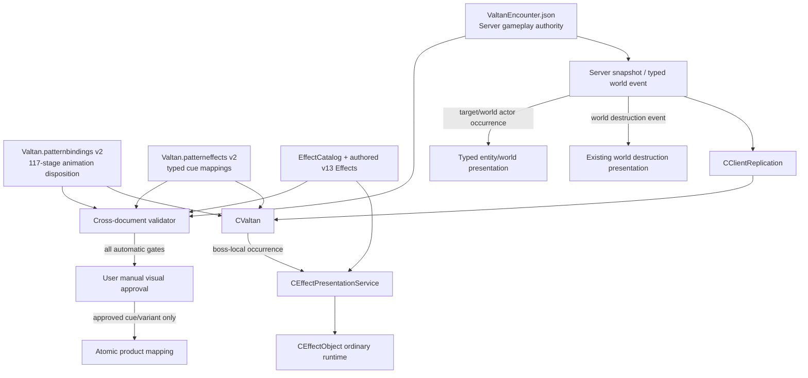

# 2026-08-14 발탄 패턴·애니메이션·Effect 구현 계획

> 2026-08-15 갱신: 현재 `420633 / 레이드 발탄_휠윈드` 메인 WWind 3의 authored v13 구현,
> ordinary Stage/probe와 hidden 6 fail-closed 검증 상태는
> `2026-08-14_FOUR_CLASS_VALTAN_EFFECT_RESTORATION_AND_RAID_PERFORMANCE_RESULT.md`가 정본이다.
> 이 문서는 그 한 slice의 RESULT가 아니라 31 patterns / 117 stages 전체를 확장하는 후속 구현 PLAN이다.
> 아래 `MAPPING_STATUS`는 2026-08-14 audit snapshot으로 유지하며 현재 완료 상태를 덮어쓰지 않는다.

## 1. 목표

사용자가 제공한 발탄 `주의 패턴`을 현재 Server-authoritative encounter와 대조해,
다음 연결을 추측 없이 닫는다.

```text
guide phase/name/bar
→ stable runtime patternId
→ semantic stage/actionId/branch
→ source Action/stage/clip
→ typed effect occurrence/owner/anchor
→ authored Effect document
→ existing Effect presentation runtime
→ user visual approval
→ atomic product admission
```

최종 목표는 단순히 Effect JSON을 많이 생성하는 것이 아니다.

- 31개 pattern, 117개 semantic stage의 animation 상태를 exact/candidate/non-clip/deferred로
  전수 분류한다.
- 제공 패턴 12그룹을 현재 runtime ID와 대응시키고, 현재 gameplay contract에 없는 mechanic은
  Effect로 위장하지 않고 Server 수직 슬라이스로 분리한다.
- effect-bearing source occurrence만 v13 authored Effect로 materialize한다.
- boss-local, target, world, actor, status occurrence를 typed owner/anchor로 구분한다.
- `CValtan`이 기존 `CEffectPresentationService`를 통해 admitted mapping만 실행하게 한다.
- 사용자 서면 visual 승인을 exact document/carrier hash에 대해 받은 cue/variant만 catalog와 boss
  runtime mapping에 제품 승격한다.

## 2. 시작 상태와 선행 조건

현재 상태의 상세 근거는
`2026-08-14_VALTAN_PATTERN_ANIMATION_EFFECT_MAPPING_STATUS.md`를 따른다.

| 항목 | 시작 상태 |
|---|---|
| Encounter | 31 patterns / 117 stages / 63 source Actions |
| Animation binding | 112 physical rows, 108/117 current coverage, missing 9, stale 4 |
| Pending source-stage located + authored binding identity | `레이드 발탄_휠윈드` `SPIN` 1/117; branch condition unresolved |
| Pending `SOURCE_EXACT` | 0/117 |
| Pending Effect mapping | Whirlwind binding 1개; merged HEAD에는 없음 |
| Pending Whirlwind carriers | 9 total, visible executable 3, fail-closed 6 |
| Pending Whirlwind canary unit test | 15/15 PASS; product/visual gate와 별개 |
| Valtan EffectCatalog product entry | 0 |
| `CValtan` product effect spawn | 0 |
| User visual PASS | 0 |

Action 420633의 정식 한국어 이름은 main PR #103 (`28fa75a2`)에 병합된
`Data/Animation/Reference/Valtan/Valtan.skilltiming`의 `레이드 발탄_휠윈드`다.
이 이름은 source commit `72cc7629`의 CEFActionObject designer label이며, 후속
`99b5e60e`는 이름을 유지하고 판정 shape의 `pks=42063301/02/03`만 보강했다.

다른 세션은 **목표 분모** 4직업 101/101 candidate와 Valtan Whirlwind
`WWind 3 + Dust 2` Track A slice를 소유한다. 이는 현재 완료 상태가 아니다. 이 문서 작성 시점의
실측은 4직업 full denominator 101, Track A seam 13, product mutation 0이며, Valtan은 9 carrier 중
WWind 3만 visible executable이고 Dust 2는 아직 fail-closed다. G00은 그 세션이 실제로
sync·commit·merge한 산출물을 다시 측정하고, 통과한 부분만 regression fixture로 계승한다.
다음 파일은 그 작업이 끝나기 전에 중복 수정하지 않는다.

- `Data/Animation/Authored/Valtan/Valtan.patterneffects.json`
- `Data/Effects/Authored/effect.valtan.pattern.420633.active.effect.json`
- `Data/Effects/EffectCatalog.json`
- `Client/Public/Effect_Catalog.h`
- `Client/Private/Effect_Catalog.cpp`
- `Tools/EffectPipeline/Schemas/lostark.boss-pattern-effects.schema.json`
- `Tools/EffectPipeline/build_valtan_whirlwind_effect_canary.py`
- `Tools/EffectPipeline/validate_boss_pattern_effects.py`
- `Tools/EffectPipeline/Publish-Effects.ps1`
- `Tools/EffectPipeline/Test-EffectPipeline.ps1`
- `Client/Public/AnimationSkillBindingDocument.h`
- `Client/Private/AnimationSkillBindingDocument.cpp`
- `Client/Public/Valtan.h`
- `Client/Private/Valtan.cpp`
- `Client/Private/ClientReplication.cpp`
- `Client/Public/Effect_PresentationService.h`
- `Client/Private/Effect_PresentationService.cpp`
- `Client/Public/Effect_Tool.h`
- `Client/Private/Effect_Tool.cpp`
- `Tools/ClientFrontendHarness/Private/ClientFrontendHarness.cpp`
- `Client/Default/Client.vcxproj`
- `Client/Default/Client.vcxproj.filters`

이 목록은 현재 확인된 최소 overlap이며 소유권 허용표가 아니다. G00은 다른 세션의 최종
`git status`, commit diff와 새 HEAD를 다시 읽고 실제 overlap 전체가 종료됐는지 확인한다.

구현 시작 조건은 다음과 같다.

1. 다른 세션의 통합 commit과 main merge가 끝난다.
2. 새 `codex/<topic>` 브랜치에서 `git status --short`를 다시 확인한다.
3. unmerged path가 0이고 Track A 산출물의 실제 hash와 admission 상태를 다시 실측한다.
4. Whirlwind regression을 보존하는 focused validator/harness가 먼저 통과한다.

## 3. 고정 결정과 범위

### 3.1 authority

- HP gate, target, damage, knockback, counter, armor stack, encounter phase, pattern sequence와 arena
  topology는 Server가 소유한다.
- Client Effect는 Server 상태를 표현할 뿐 gameplay 결과나 world mutation을 만들지 않는다.
- `ValtanEncounter.json`의 current stable ID와 trigger가 제품 정본이다.
- 나무위키 HP bar와 별칭은 guide reference다. `120→109`, `110→105`, `85→109`,
  `65→64`, `30→33`을 자동 rename하거나 같은 mechanic으로 확정하지 않는다.
- current project-tuned bar를 원작 bar로 바꾸는 일은 이펙트 매핑이 아니라 별도 balance/mechanic
  결정이다. 그 결정 전에는 guide bar와 runtime bar를 나란히 표시한다.

### 3.2 기본 variant

- 현재 프로젝트의 일반 Valtan encounter를 1차 제품 대상으로 삼는다.
- Hard 전용 3카 원혼불은 variant data와 source evidence는 보존하되 1차 제품 admission에서
  fail-closed한다.
- 제공 자료에 없는 망령 페이즈 전체를 추측해 확장하지 않는다. 자료에 명시된 망령 돌진 잡기와
  `GHOST_TRANSITION_15` 범위만 매핑한다.
- 정식 한국어 표시명을 기본으로 하고 통용 별칭은 검색 alias로 둔다.
- stable mapping ID는 유지하고 Action 420633 표시는 `레이드 발탄_휠윈드`를 사용한다.

### 3.3 제외 범위

- Client/UI 자율 실행, 화면 캡처, 자동 visual PASS
- 4직업 Track A의 재구현 또는 제품 승격 판단
- 비슷한 이름만으로 Action 전체 notify를 일괄 재생하는 generic fallback
- Effect asset에서 damage, counter 성공, grab, encounter phase 또는 destruction을 판정하는 경로
- 측정 근거 없는 IOCP 전환이나 광범위 네트워크 재작성
- audio 원본 복원

## 4. 완료 상태를 분리하는 gate

한 항목이 앞 gate를 통과했다고 뒤 gate를 자동 통과한 것으로 기록하지 않는다.

| Gate | 의미 |
|---|---|
| `GUIDE_RECONCILED` | guide 이름/bar/phase와 current runtime ID의 관계가 exact/candidate/unmapped로 기록됨 |
| `ANIMATION_COVERED` | 117 stage가 typed disposition으로 정확히 한 번 덮임 |
| `SOURCE_EXACT` | source Action/stage/branch/clip/occurrence 근거가 exact하게 선택됨 |
| `DOCUMENT_READY` | authored v13 Effect와 resource identity가 validation을 통과함 |
| `RUNTIME_EXECUTABLE` | 필요한 family/anchor/timing을 제품 runtime이 실행함 |
| `MECHANIC_COMPLETE` | 필요한 Server state/event/world actor 수직 슬라이스가 닫힘 |
| `VISUAL_APPROVED` | 사용자가 exact cue/variant/document/carrier hash를 실제 화면에서 서면 승인함 |
| `PRODUCT_MAPPED` | catalog와 boss runtime mapping이 atomic하게 승격됨 |
| `PERFORMANCE_APPROVED` | 지정된 4인 조건에서 Client/Server 지표를 만족함 |

## 5. 목표 data와 call flow



Boss-local effect lookup key는 다음 Server 권위 tuple을 사용한다.

```text
(bossNetEntityId,
 patternId,
 patternSequence,
 runtimePatternStageIndex,
 actionId,
 actionStartTick,
 encounterPhase)
```

현재 `WORLD_ENTITY_SNAPSHOT`은 `patternId`, `actionId`, `patternSequence`,
`iPatternStageIndex`, `actionStartTick`, `iPhase`를 이미 전달한다. 이 문서에서는 각각
`runtimePatternStageIndex`, `encounterPhase`로 부른다. G03은 이 tuple을 `CValtan`까지 손실 없이
연결한다. `cueId`와 source occurrence/carrier ID는 Server tuple의 일부가 아니라 이 tuple과
explicit Server variant/event를 조회한 뒤 선택되는 Client presentation identity다. 기존
presentation API의 `strOccurrenceId`를 호환 유지하면 그 runtime 의미는 cue dedupe ID로 명시한다.
target entity나 world transform이 이 snapshot에서 확정되지 않는 occurrence만 typed Server event를
추가한다.

## 6. 예정 파일

### 6.1 확정 수정

| 파일 | 책임 |
|---|---|
| `Data/Animation/Authored/Valtan/Valtan.patternbindings.json` | 117-stage animation binding v2와 disposition/source evidence |
| `Data/Animation/Authored/Valtan/Valtan.patterneffects.json` | multi-pattern, multi-cue typed mapping v2 |
| `Data/Effects/Authored/effect.valtan.pattern.<pattern>.<stage>.<cue>.effect.json` | runtime pattern/stage/cue identity를 포함한 v13 candidate. source Action만으로 ID를 만들지 않음 |
| `Data/Effects/AuthoredCorrections/Valtan/Valtan.pattern-visual-approval.receipt.json` | 사용자 서면 승인과 exact cue/document/carrier hash |
| `Data/Effects/EffectCatalog.json` | visual 승인된 cue만 제품 catalog admission |
| `Client/Public/Effect_Catalog.h` | catalog의 immutable snapshot API: runtime revision, catalog document hash, product revision |
| `Client/Private/Effect_Catalog.cpp` | catalog metadata와 expected mapping hash를 parse → validate → stage하고 cue-set 조합에 제공 |
| `Tools/EffectPipeline/Schemas/lostark.boss-pattern-effects.schema.json` | mapping v2 schema |
| `Tools/EffectPipeline/validate_boss_pattern_effects.py` | encounter/animation/effect/catalog cross-document validator |
| `Tools/EffectPipeline/Publish-Effects.ps1` | validator와 candidate/product transaction 편입 |
| `Tools/EffectPipeline/Test-EffectPipeline.ps1` | repo-only schema/builder/rollback regression 편입 |
| `Client/Public/AnimationSkillBindingDocument.h` | typed animation/effect binding data |
| `Client/Private/AnimationSkillBindingDocument.cpp` | parse → validate → stage → commit과 full cross-join |
| `Client/Public/Valtan.h` | staged cue registry와 last authoritative state/cue selection |
| `Client/Private/Valtan.cpp` | snapshot edge → admitted cue spawn/stop |
| `Client/Private/ClientReplication.cpp` | snapshot authoritative tuple와 `encounterPhase`를 `CValtan`에 전달 |
| `Client/Public/Effect_PresentationService.h` | boss cue handle/`Stop_BossCue`, critical telegraph priority contract |
| `Client/Private/Effect_PresentationService.cpp` | cue 단위 stop/dedupe와 reserved budget 실행 |
| `Client/Public/Effect_Tool.h` | pattern/variant/cue/source-occurrence inspection state |
| `Client/Private/Effect_Tool.cpp` | Boss_Valtan Model View, alias 검색, disposition/anchor/blocker 편집 |
| `Client/Default/Client.vcxproj` / `Client.vcxproj.filters` | patternbindings, patterneffects, approval receipt와 generated batch를 `96.DataFiles` `None`으로 각각 1회 등록 |
| `Tools/ClientFrontendHarness/Private/ClientFrontendHarness.cpp` | parser, rollback, runtime dedupe/prewarm regression |

### 6.2 신규 생성 후보

먼저 기존 `validate_boss_pattern_effects.py`, Whirlwind builder와 공용 materializer를 확장한다.
기존 책임으로 닫을 수 없을 때만 아래 **공용 boss-pattern** 파일을 추가한다. Valtan 한 건만을 위한
두 번째 validator/materializer 경로는 만들지 않는다.

| 파일 | 책임 |
|---|---|
| `Tools/EffectPipeline/Schemas/lostark.boss-pattern-animation-bindings.schema.json` | 공용 boss pattern binding v2 JSON contract |
| `Tools/EffectPipeline/validate_boss_pattern_animation_bindings.py` | 총 semantic stage의 structural join과 source/model validation |
| `Tools/EffectPipeline/test_validate_boss_pattern_animation_bindings.py` | Valtan fixture를 포함한 malformed/missing/duplicate/stale/bad clip tests |
| `Tools/EffectPipeline/build_boss_pattern_effect_candidates.py` | selected boss source occurrence → authored v13 batch |
| `Tools/EffectPipeline/test_build_boss_pattern_effect_candidates.py` | deterministic build, hash, rollback, no-product tests |
| `Data/Effects/AuthoredCorrections/Generated/ValtanPattern.track-a-authored-import-batch.json` | 전체 candidate/admission/blocker receipt |

새 C++ translation unit는 계획하지 않는다. 구현 과정에서 분리가 불가피하면 같은 변경에서
해당 `.vcxproj`와 `.vcxproj.filters`에 각각 정확히 한 번 등록하고 Debug/Release로 검증한다.
현재 `Valtan.patternbindings.json`과 pending `Valtan.patterneffects.json`도 `96.DataFiles`에 없으므로
G01/G02 변경 단위에서 등록한다. project와 filters의 include set equality와 duplicate 0을 harness로
확인한다.

### 6.3 별도 mechanic 계획이 소유할 파일

아래 파일은 이 Effect mapping 계획에서 직접 수정하지 않는다. occurrence가 실제 Server mechanic을
요구하면 별도 수직 슬라이스 PLAN/RESULT와 PR이 이 파일, publisher와 harness를 함께 소유한다.

| 파일 | 조건 |
|---|---|
| `Data/Encounters/Valtan/ValtanEncounter.json` | fixed sequence, branch, HP gate 또는 semantic stage의 gameplay 정본을 바꿀 때 |
| `Shared/Public/Network/PacketMessages.h` / `Shared/Private/Network/PacketMessages.cpp` | target/world/status occurrence에 기존 snapshot으로 부족한 payload가 있을 때만 |
| `Server/Public/ValtanBrain.h` / `Server/Private/ValtanBrain.cpp` | missing branch, target, armor/status, fixed sequence event가 필요할 때 |
| `Server/Public/GameRoom.h` / `Server/Private/GameRoom.cpp` | replicated entity/world occurrence의 room lifecycle이 필요할 때 |
| `Client/Private/Level_ValtanArena.cpp` | world actor/destruction presentation routing이 필요할 때 |
| `Client/Public/WorldDestructionProjectionRuntime.h` / `Client/Private/WorldDestructionProjectionRuntime.cpp` | destruction projection route가 바뀔 때 |
| `Client/Public/WorldDestructionDebrisPresentationRuntime.h` / `Client/Private/WorldDestructionDebrisPresentationRuntime.cpp` | debris presentation binding을 확장할 때 |
| `Tools/NetworkProtocolHarness/Private/NetworkProtocolHarness.cpp` | Shared packet이 바뀔 때 |
| `Server/Private/ServerGameplayContractTests.cpp` | Server mechanic/event가 바뀔 때 |
| `Tools/ValtanFourPlayerHarness/Private/ValtanFourPlayerHarness.cpp` | multi-client occurrence/reconnect/late-join 검증이 필요할 때 |
| `Data/Balance/BossProfiles.json` / `Tools/GameplayPipeline/Publish-GameplayBalance.ps1` | armor/buff/damage 수치를 채택할 때 |
| `Data/Worlds/LV_LUT_HEARTRB_ED/Gameplay.world.json` / `SpawnGroups.world.json` | pillar/orb/world actor lifecycle을 추가할 때 |
| `Data/Encounters/Valtan/ValtanWorldEvents.json` / `Data/Maps/Authoring/LV_LUT_HEARTRB_ED/LV_LUT_HEARTRB_ED.destructionsimulation.json` | arena/wall mutation과 presentation event를 바꿀 때 |
| `Tools/WorldPipeline/Publish-WorldGameplay.ps1` / `Publish-ValtanWorldDestruction.ps1` | world/destruction 변경 검증과 publish |

## 7. G00 — sync, guide product scope와 117-stage corpus hygiene

### 구현

1. 다른 세션의 main merge 뒤 새 브랜치와 fresh status를 확보한다.
2. 실제 merge된 Whirlwind carrier와 4직업 batch의 수·hash·admission을 다시 측정한다. Dust가
   fail-closed면 `WWind 3`만 현재 regression fixture이고 `WWind 3 + Dust 2`는 미완료 목표다.
3. `G00-A`는 guide 12그룹을 product scope로, `G00-B`는 31 pattern에 속한 총 117 stage를
   corpus hygiene scope로 분리한다.
4. 각 row에 guide 이름/bar/guidePhase, runtime bar/encounterPhase, source Action,
   source action stage, branch, clip,
   effect occurrence, owner와 blocker를 기록한다.
5. animation stage 상태를 다음 중 정확히 하나로 분류한다.

| animation 상태 | 의미 | runtime behavior |
|---|---|---|
| `EXACT_SELECTED` | source Action/stage/branch와 runtime clip이 exact | 명시 clip 재생 |
| `CANDIDATE_PRESERVED` | 현재 clip은 보존하지만 exact 증거가 부족 | 명시 clip 재생, 제품 source-exact gate는 차단 |
| `DEFERRED_AMBIGUOUS_VARIANT` | 난이도/branch/source stage를 확정할 수 없음 | guessed fallback 없이 visual fail-closed |
| `VISUAL_EMPTY` | 원본상 animation presentation이 필요 없는 stage | 명시적 no-animation |

root 이동 권위는 animation 상태와 별도 `motionAuthority` 축으로 기록한다.
`ARENA_BREAK_109`의 `motionAuthority=SERVER_TRANSFORM`은 Server arc를 항상 보존한다는 뜻이며,
skeletal clip이 없다는 뜻이 아니다. source Action 420629의 `mesh_att_battle_12_01/02/03`
candidate를 유지할지 deferred할지는 animation evidence로 독립 결정한다.

Effect 또는 world occurrence 상태는 G02와 같은 vocabulary를 사용한다.
`BOSS_BONE_FOLLOW`, `BOSS_ROOT_FOLLOW`, `BOSS_ROOT_SNAPSHOT`, `TARGET_ENTITY_FOLLOW`,
`WORLD_TRANSFORM_SNAPSHOT`, `WORLD_ACTOR_EXTERNAL`, `WORLD_MECHANIC_EXTERNAL`,
`STATUS_PERSISTENT`, `CAMERA_EXTERNAL`, `VISUAL_EMPTY` 중 하나를 갖는다.

### 완료 조건

- guide 12그룹이 exact/candidate/partial/unmapped로 모두 분류된다.
- 117 stage가 중복 없이 정확히 한 번 분류된다.
- HP bar 불일치는 rename이 아니라 별도 컬럼으로 남는다.
- unresolved variant에는 guessed clip/effect가 없다.
- 31-pattern corpus hygiene의 남은 source-exact 작업이 이미 reconciled된 guide occurrence의
  candidate 제작을 불필요하게 막지 않으며, 제품 admission은 cue/variant별 gate를 따른다.

## 8. G01 — Animation binding v2

### data 계약

각 row는 최소 다음 의미를 갖는다.

```text
patternId
stageId
actionId
presentationDisposition
evidenceStatus
motionAuthority
runtimeClipName?          // clip disposition일 때만
sourceActionId?
sourceActionStageIndex?
sourceBranchId?
sourceConditionEvidence?
serverVariantId?          // Server가 stable selector를 실제 전달할 때만
evidenceDocument/hash?
```

`presentationDisposition`과 `evidenceStatus`를 분리해 현재 candidate clip을 보존하면서도
exact라고 오표기하지 않는다. unknown action/clip, duplicate stage, stale pattern, clip이 필요한데
없는 row, non-clip disposition에 clip이 있는 row를 거부한다.

`sourceConditionEvidence`는 provenance 전용이며 Client runtime 분기 조건으로 평가하지 않는다.
Parry, Triple Counter처럼 branch별 animation이 필요한데 current Server snapshot/event에 stable
selector가 없으면 branch row는 `DEFERRED_AMBIGUOUS_VARIANT`로 남긴다.

### 우선 교정

1. stale `arena-break-80.*` 4행을 제거한다.
2. `LEDGE_ROAR`의 source `mesh_evt1_att_battle_5_01_start/end/loop`가 실제 model과 어떤
   branch 순서인지 확인한다. 단순 start/loop/end 추정으로 채우지 않는다.
3. `ARENA_BREAK_109`의 Server root arc를 `motionAuthority=SERVER_TRANSFORM`으로 고정하고,
   6개 skeletal stage는 source Action 420629의 `mesh_att_battle_12_01/02/03` candidate,
   `DEFERRED_AMBIGUOUS_VARIANT` 또는 근거 있는 `VISUAL_EMPTY`로 독립 분류한다. 세 clip을
   6단계에 임의 복제하거나 없는 전용 jump clip을 만들지 않는다.
4. `PARRY`의 420607 success branch `mesh_att_battle_9_01_end-2`를 Server branch와 함께 연결한다.
5. `TRIPLE_COUNTER`는 420640/641 groggy와 420642~647 `mesh_att_battle_14_*` attack branch를
   분리한다.
6. `ARMOR_BREAK_OPENING`은 부위 파괴, 외벽 충돌 groggy, 오프닝 attack을 구분한다.
7. `GHOST_TRANSITION_15`는 11 source Action을 6개 coarse clip으로 압축한 현재 mapping을
   source stage/branch matrix로 교체한다.

### runtime 실패 정책

- authoring/publisher는 valid v2 문서의 missing/stale/duplicate row를 거부한다.
- runtime reload parse 실패 시 last-good registry를 유지한다.
- v2 제품 cutover 전에는 현재 동작을 회귀시키지 않기 위해 expected legacy catalog revision/hash를
  검증한 명시적 `LEGACY_COMPATIBILITY` registry만 사용할 수 있다. 이 경로는 non-exact
  diagnostic을 남기고 Effect cue를 spawn하거나 valid pattern mapping으로 승격하지 않는다.
- v2가 required product revision이 된 뒤 cold start 문서가 missing/corrupt하거나 legacy hash가
  다르면 implicit generic clip을 고르지 않는다. Server snapshot과 boss spawn은 유지하되 explicit
  idle/retain policy를 적용하고 해당 action의 Effect cue도 fail-closed한다.
- 하나의 animation presentation 실패가 replicated boss state를 거부하지 않는다.
- valid v2 문서의 명시적 `DEFERRED_AMBIGUOUS_VARIANT`는 guessed clip을 고르지 않고 row에
  저장된 explicit idle/retain policy와 stable diagnostic을 따른다.

### 완료 조건

- encounter와 binding의 `(patternId, stageId, actionId)` triple이 structural exact set equality다.
- stale/duplicate/missing이 0이다.
- exact, candidate, non-clip, deferred 분모가 validator 출력에 고정된다.
- malformed version/ID/path/clip/disposition에서 기존 registry rollback이 통과한다.

## 9. G02 — Boss-pattern Effect mapping v2

### schema 확장

현재 Whirlwind 한 pattern과 boss bone만 전제하는 schema를 다음 row 중심 구조로 확장한다.

```text
bindingId
patternId / semanticStageId / actionId
guidePhase? / encounterPhase? / serverVariantId?
runtimePatternStageIndex
sourceActionId / sourceActionStageIndex / sourceNotifyId / sourceBranchId
sourceConditionEvidence?
sourceOccurrenceIds[]
cueId
effectAssetId? / effectDocument?
visibleCarrierSetSha256?
ownerKind
attachmentKind / runtimeBoneName?
startOffsetMs / durationMs?
followPolicy / stopPolicy
externalRoute?
sourceAdmission
runtimeAdmission
visualApprovalReceipt?
productRevision?
productCatalogMapped
bossPatternRuntimeMapped
blockers[]
```

### 단위 계약

다음 단위를 섞지 않는다.

| 단위 | 의미 |
|---|---|
| `sourceOccurrenceId` | imported source Action의 notify occurrence 한 건 |
| `carrierId` | 한 source occurrence 안의 Sprite/Mesh/Dust/Ribbon 등 실행 carrier 한 건 |
| `cueId` | 한 authored Effect document가 소유하고 한 번 spawn하는 carrier 집합 |
| `bindingId` | authoritative pattern/stage/serverVariant가 하나 이상의 cue를 선택하는 mapping |

현재 Whirlwind는 binding/document 1개 안에 source notify 4개와 carrier 9개가 있다. G03은 notify나
carrier마다 같은 document를 다시 spawn하지 않고 `cueId`당 정확히 한 번 spawn한다. renderer가
그 document 내부의 admitted carrier 집합을 실행한다.

신규 Effect ID에는 runtime `patternId + stageId + cueId`를 포함한다. 420610과 420629처럼 같은
source Action을 여러 runtime pattern이 공유하므로 source Action ID만으로 asset ID를 만들지 않는다.

`damage`, `hitShape`, `encounter phase transition`, `world mutation`은 Effect mapping에 복제하지 않는다.
그 값은 encounter와 Server state를 참조한다.
`sourceConditionEvidence`도 runtime selector가 아니다. branch 선택은 stable Server
`serverVariantId` 또는 typed event가 있을 때만 허용한다.

### typed owner/anchor

- `BOSS_BONE_FOLLOW`
- `BOSS_ROOT_FOLLOW`
- `BOSS_ROOT_SNAPSHOT`
- `TARGET_ENTITY_FOLLOW`
- `WORLD_TRANSFORM_SNAPSHOT`
- `WORLD_ACTOR_EXTERNAL`
- `WORLD_MECHANIC_EXTERNAL`
- `STATUS_PERSISTENT`
- `CAMERA_EXTERNAL`
- `VISUAL_EMPTY`

bone은 boss-bone mode에서만 필수다. world/target/status occurrence에 가짜
`b_effectroot`를 넣어 validator를 통과시키지 않는다.

### cross-document validation

validator는 다음 join을 한 번에 확인한다.

1. encounter pattern/stage/action 존재와 exact identity
2. animation binding disposition과 source evidence
3. source Action/stage/notify/branch 범위
4. authored Effect schema/version/path/hash와 Resources-relative asset ID
5. runtime family/attachment/material admission
6. EffectCatalog ID/document/hash
7. visual approval와 product flag의 일관성
8. duplicate cue/source occurrence와 conflicting owner/stop policy

모든 load/publish는 `parse → validate → stage → commit`을 지킨다. 중간 실패 시 현재
Whirlwind canary와 기존 제품 catalog는 바뀌지 않는다.

## 10. G03 — Candidate batch와 boss-local runtime consumer

### candidate materialization

- 193 ParticleSystem source graph와 63 source Action subset에서 G00이 선택한 occurrence만 가져온다.
- Action 전체를 하나의 Effect로 재생하지 않고 source stage/notify occurrence를 최소 단위로 삼는다.
- 공통 v13 authored importer와 4직업 Track A materializer의 검증된 codec/transaction을 재사용한다.
- `effect-bearing`, `visual-empty`, `external-world`, `deferred-family` 분모를 receipt에 분리한다.
- unsupported Generic Effect, PlayDecalEffect, DefaultParticle, Ribbon/Trail/Light family는 source
  identity를 보존하고 실행 준비가 닫힐 때까지 fail-closed한다.
- 한 candidate 실패 시 batch 전체를 rollback하고 제품 mapping은 0 mutation을 유지한다.

candidate source reconstruction과 제품 publisher를 분리한다.

- external builder는 명시적으로 전달받은 `Resource_LostArk` artifact root를 읽을 수 있다.
- 결과는 source relative path, artifact/root identity와 SHA-256을 가진 normalized receipt로
  체크인하며 drive-qualified 절대 경로를 저장하지 않는다.
- repo-only `Publish-Effects.ps1 -Mode Validate`는 external artifact root를 다시 읽지 않고
  체크인된 authored document, normalized receipt/hash와 `Client/Bin/Resources`만 검증한다.
- source 재추출이 필요한 검증을 기본 product publisher에 넣어 머신 종속 gate로 만들지 않는다.

### `CValtan` consumer

1. Valtan spawn/level load에서 animation registry와 effect mapping registry를 문서별로 독립
   parse/validate/stage/commit한다. effect mapping 실패가 유효한 animation registry를 rollback하지
   않고, animation 실패도 last-good effect authoring registry를 파괴하지 않는다.
2. admitted cue는 action edge 전에 prewarm한다. per-action file I/O를 금지한다.
3. authoritative tuple이나 explicit Server variant/event가 새 cue를 선택할 때 boss-local Effect를
   cueId당 한 번 spawn한다.
4. `actionStartTick`과 Server 30Hz를 사용해 late snapshot의 `initialSampleAge`를 계산한다.
5. stable tuple로 duplicate snapshot과 reconnect replay의 중복 spawn을 막는다.
6. stage 종료와 pattern 변경에는 returned cue handle 또는
   `Stop_BossCue(owner, actionStartTick, cueId)`로 해당 cue만 stop한다. 현재 API의
   `Stop_BossOwner`만으로 stage 단위 stop이 된다고 가정하지 않는다.
7. death, despawn, level reset처럼 boss lifetime 전체가 끝날 때만
   `CEffectPresentationService::Stop_BossOwner`를 사용한다.

제품 실행 세트는 두 문서를 그냥 동시에 write했다고 atomic하다고 부르지 않는다. catalog와
boss mapping에 같은 `productRevision`과 expected document hash를 기록한다. `CEffectCatalog`는 현재
`Get_RuntimeRevision()`만 제공하는 경계를 확장해 immutable catalog snapshot
`{ runtimeRevision, catalogDocumentSha256, productRevision }`과 검증된 expected mapping hash를
제공한다. Valtan loader/`CValtan`은 그 snapshot과 boss mapping을 함께 검증해
`VALTAN_BOSS_CUE_SET`을 in-memory stage한 뒤 최종 cue-set pointer를 한 번 swap한다. revision/hash가
다르면 기존 제품 cue set을 유지한다. 이 계약은 다중 파일 filesystem write 자체의 atomicity를
주장하지 않는다.

별도 BossEffectManager를 만들지 않는다. existing Effect catalog, prepared handle, budget,
post-update anchor와 ordinary `CEffectObject` 경로를 재사용한다.

gameplay telegraph cue에는 typed `BOSS_TELEGRAPH_CRITICAL` priority를 둔다. 현재 remote soft-cap
headroom만으로 reserve가 있다고 보지 않는다. critical reserve는 cosmetic/local Effect가 hard
budget을 채워도 보존되고, noncritical boss aura·debris는 일반 budget을 사용한다. budget saturation
harness는 cosmetic suppression은 허용하되 critical boss telegraph rejection을 0으로 요구한다.

### 실패 격리

Effect asset/anchor/spawn 실패는 presentation diagnostic이다. 이미 수신한 position, yaw, HP,
encounterPhase, pattern과 animation age 적용을 rollback하지 않는다.

## 11. G04 — mechanic prerequisite 분리

Boss-local Effect만으로 닫히지 않는 항목은 이 계획에서 Server/World/Balance까지 함께 구현하지
않는다. 다음 항목마다 별도 implementation plan, PR과 RESULT를 만들고, 그 RESULT가 통과하기 전
관련 cue는 `DEFERRED_MECHANIC`으로 유지한다. 이 G의 산출물은 코드가 아니라 prerequisite ID,
소유 plan 링크와 product blocker다.

### G04-A 갑옷·buff state

- initial armor stack, break window, stack break, open armor conversion과 beast-power begin/end를
  Server revision으로 소유한다.
- guide 수치인 stack당 incoming damage reduction 10%, open armor stack당 15%, 30초 주기·10초
  지속·공격력 100% 증가를 채택할지는 별도 mechanic/balance decision으로 고정한다. 채택하면
  official이라고 부르지 않고 `PROJECT_TUNED` provenance로 balance publisher에 편입한다.
- 채택된 수치는 실제 Server incoming/outgoing damage 계산에 적용하고 stack conversion,
  timer begin/end, death/reset, late join snapshot을 contract test로 검증한다.
- 수치 적용을 이번 slice에서 하지 않으면 status를 `DEFERRED_MECHANIC`으로 두고 aura만으로
  `MECHANIC_COMPLETE`를 선언하지 않는다.
- Client는 status revision을 받아 aura/overlay를 시작·교체·종료한다.
- source 이름 `Protection`, `Part_Weak`, `Part_PowerUp`은 candidate ingredient일 뿐 자동
  gameplay binding이 아니다.

### G04-B 오프닝 fixed sequence

- Whirlwind, charge, wall collision, groggy, jump-spin, bombardment의 순서와 branch를 Server가 소유한다.
- 돌진은 `OPENING_WALL_CHARGE`와 `POST_PHASE2_COUNTERABLE_CHARGE` variant로 분리한다.
  후자는 stomp count, 두 번째 stomp 직후 counter window, success/fail branch와 recovery를
  Server contract로 갖는다.
- wall target과 Ronawn drop은 world event/actor다. guide parity를 채택하면 Ronawn pickup,
  player 보호 buff, 첫 타격에서의 보호 소비, Esther gauge 증가와 despawn/reset까지 Server가
  소유하고 harness로 검증한다.
- Ronawn lifecycle을 구현하지 않으면 해당 occurrence를 `DEFERRED_MECHANIC`으로 남기고 단순
  빛 구체 Effect를 완료로 기록하지 않는다.
- 각 하위 action은 독립 pattern occurrence identity를 유지한다.

### G04-C arena·pillar·telegraph

- 120/110/85/30 guide mechanic과 current 109/105/33 runtime의 차이를 먼저 결정한다.
- 지형 파괴는 기존 `WORLD_DESTRUCTION_EVENT_WIRE`와 destruction projection/debris runtime을
  확장해 표현한다.
- pillar/tombstone/orb는 stable world entity spawn/snapshot/despawn으로 구현한다.
- target cone과 player 장판은 Server가 확정한 target/world transform과 occurrence ID를 전달한다.
- fall hazard와 navigation commit을 Effect가 판정하지 않는다.

### G04-D counter·grab·crush branch

- Parry success/fail, Triple Counter round/success/fail, grab target, Crush success/failure loop를
  Server action/branch로 확정한다.
- Triple Counter success의 silence는 Server player status로 적용한다. 대상 player와 범위 안
  주변 player, skill command 거부, duration/해제, death/reconnect/reset을 gameplay contract와
  command harness에서 검증한다. aura는 그 status를 표현만 한다.
- player-target decal과 wipe wave는 해당 branch event를 표현한다.
- Hard 원혼불은 별도 variant가 완성되기 전 product mapping을 막는다.

#### G04-D2 망령 고정 돌진 잡기

- `GHOST_STATIONARY_GRAB`을 일반 `CHARGE_GRAB_ROAR`와 다른 variant/occurrence ID로 둔다.
- 39.5/26/13 guide gate를 current encounter에 채택할지는 balance/mechanic decision으로 기록한다.
- 채택 시 본체 이동 없음, 붉은 grab warning, target/grab, roar/knockback와 success/fail branch를
  Server가 소유한다.
- gate 또는 branch가 미구현이면 일반 이동형 Effect를 재사용하지 않고
  `DEFERRED_MECHANIC`으로 남긴다.

### G04-E ghost transition

- portal, repeated fist cadence, target decals, 3 pillars, roar, body collapse와 encounter phase commit을
  source timeline과 Server state로 분리한다.
- camera는 existing cinematic controller, pillars는 world actor, boss-local strike만 Effect mapping이
  소유한다.

별도 mechanic slice에서 Shared packet이 바뀌면 `PacketMessages`, NetworkProtocolHarness,
Server contract와 Client failure path를 같은 변경 단위에서 닫는다. 기존 snapshot/world event로
표현 가능한데 새 packet을 만들지 않는다. Balance 변경은 `Publish-GameplayBalance`, world actor는
`Publish-WorldGameplay`, arena destruction은 `Publish-ValtanWorldDestruction` validation을 각각
통과해야 한다.

## 12. G05 — Effect family와 content wave

### family closure 순서

1. 현재 executable Sprite/Mesh와 실제 merge된 Whirlwind carrier regression
2. Local/World Decal과 target telegraph
3. DynamicParameter, SubUV, material packet과 Dust
4. Ribbon/AnimationTrail
5. Light/Post/ViewShake
6. PawnMaterial/DetachParts와 persistent status
7. unresolved Generic Effect 계열

각 family는 대표 canary에서 source identity, resource, anchor, material, timing, budget과 rollback을
검증한 뒤 동일 family batch로 확장한다. unsupported family를 흰 sprite나 임의 mesh로 낮춰
`visible`만 만들지 않는다.

### content wave

| Wave | 범위 | 선행 조건 |
|---:|---|---|
| 0 | 다른 세션에서 실제 merge된 Whirlwind carrier. 현재 baseline은 WWind 3, 목표는 WWind 3 + Dust 2 | merge 후 재실측 + regression |
| 1 | guide 우선 boss-local: 130, Parry, Triple Counter, Charge Grab, Center 64 | G01/G02/G03와 해당 branch contract |
| 2 | guide Armor/status, opening sequence, post-phase2 counterable charge | G04-A/B |
| 3 | guide 105/109/33 및 미매핑 120/110/85 telegraph, actor, destruction | G04-C |
| 4 | Ghost transition 15와 `GHOST_STATIONARY_GRAB` | source branch와 G04-D2/E |
| 5 | 나머지 일반 pattern의 boss-local Effect | guide 12그룹 product scope 뒤의 corpus hygiene 확장 |

`GHOST_TRANSITION_15`는 source Action fanout과 Mesh/Sprite/Decal/Ribbon/Trail/Light 조합이 가장
크므로 마지막 wave로 둔다. 앞 wave의 typed family를 재사용한 뒤 남은 blocker를 닫는다.

## 13. G06 — Effect Tool authoring

Effect Tool의 `Boss_Valtan` Model View에서 다음 값을 한 화면의 stable selection으로 연결한다.

- 정식 표시명과 guide alias
- guide bar/guidePhase와 current runtime bar/encounterPhase
- patternId, stageId, actionId, source Action/stage/branch
- animation disposition, evidence status와 actual runtime clip
- cueId, sourceOccurrenceIds, visible carrier set, owner/anchor/bone, timing, follow/stop policy
- source family, carrier denominator, visible/fail-closed 수와 blockers
- candidate/product/visual approval 상태

규칙은 다음과 같다.

- `motionAuthority=SERVER_TRANSFORM`과 animation disposition을 서로 다른 필드로 표시한다.
- Server transform stage에서도 source skeletal candidate, deferred, visual-empty를 독립 선택한다.
- `CANDIDATE_PRESERVED`는 exact와 다른 색/label로 표시한다.
- family solo, occurrence solo, full-stage preview를 분리한다.
- save/reload는 parse → validate → stage → commit이며 실패 시 기존 preview/document를 유지한다.
- Advanced source evidence는 inspection용이고 제품 runtime을 직접 우회하지 않는다.

에이전트는 Tool이나 Client를 자율 조작하지 않는다. 빌드와 실행 준비 뒤 사용자가 직접 F1
Developer Tools에서 Model View를 열어 판정한다.

## 14. G07 — 사용자 승인과 atomic product admission

### cue/variant admission 조건

다음 조건을 모두 만족해야 한다.

1. guide/runtime 관계가 기록돼 있다.
2. animation은 `EXACT_SELECTED`이거나 명시적 non-clip disposition이다.
3. source Action/stage/branch/notify와 resource identity가 exact다.
4. 필요한 runtime family와 owner/anchor가 executable이다.
5. Server mechanic/event가 필요한 cue는 해당 별도 수직 슬라이스 RESULT가 닫혔다.
6. publisher와 focused harness가 통과한다.
7. 사용자가 실제 Model View 또는 gameplay에서 exact cue/variant/document/carrier hash를 서면 승인했다.
8. 정해진 performance gate를 통과한다.

### transaction

- candidate document를 먼저 저장하고 제품 catalog를 바꾸지 않는다.
- 수동 승인은 boolean 하나가 아니라
  `(bindingId, serverVariantId, cueId, effectDocumentSha256, visibleCarrierSetSha256)`에 묶인
  receipt다. receipt는 `decisionSource=USER_WRITTEN`과 대응 RESULT/대화 관찰 근거를 참조하며,
  에이전트가 PASS를 생성하지 않는다. 다른 branch, 수정된 document 또는 carrier set으로 승인을
  전파하지 않는다.
- 승인 시 `EffectCatalog` entry와 boss mapping을 같은 `productRevision`/expected hash로 publish하고,
  runtime에서 두 문서를 하나의 staged cue set으로 검증한 뒤 in-memory atomic swap한다. 여러 파일을
  write한 사실만으로 atomic admission을 주장하지 않는다.
- `productCatalogMapped=true`인데 boss consumer가 없거나 그 반대인 상태를 거부한다.
- 이전 catalog/mapping hash를 rollback reference로 보존한다.
- 중간 write, model clip drift, resource missing, visual approval missing에서 기존 제품 상태를 유지한다.
- visual 승인을 다른 cue, source occurrence, branch 또는 같은 Action의 다른 encounterPhase로
  전파하지 않는다.

## 15. G08 — 검증, 사용자 visual gate, 성능

### 15.1 자동 data/도구 검증

- 모든 변경 JSON/schema parse
- validator가 encounter에서 pattern/stage/unique source Action 분모를 계산하고
  `encounterDocumentSha256 + derivedCounts`를 receipt에 기록한다. `31/117/63`을 코드 상수로
  하드코딩해 다른 revision을 정상처럼 만들지 않는다.
- animation binding structural triple set equality 117/117
- missing/stale/duplicate/unknown clip/action 0
- disposition/clip/source evidence 조합 검사
- pattern effect cross-document validation
- authored Effect path/hash/Resources identity 검사
- candidate builder deterministic output와 all-or-nothing rollback
- `python Tools/EffectPipeline/test_validate_boss_pattern_animation_bindings.py`
- `python Tools/EffectPipeline/test_build_boss_pattern_effect_candidates.py`
- `python Tools/EffectPipeline/test_valtan_whirlwind_effect_canary.py`
- `powershell -ExecutionPolicy Bypass -File Tools/EffectPipeline/Publish-Effects.ps1 -Mode Validate`
- `git diff --check`

### 15.2 C++와 protocol 검증

- ClientFrontendHarness: valid load, bad version/ID/path/clip, duplicate, missing, rollback
- ClientFrontendHarness: exact action edge, duplicate snapshot, late join age, stop/reset, prewarm
- target/world packet이 바뀌면 NetworkProtocolHarness Debug/Release
- Server mechanic이 바뀌면 `Server.exe --contract-test`
- world mechanic은 ValtanFourPlayerHarness에서 4/4 convergence, reconnect와 empty-room reset
- `Tools/Build/Invoke-BuildAndRegression.ps1 -Configuration Debug`
- `Tools/Build/Invoke-BuildAndRegression.ps1 -Configuration Release`

### 15.3 사용자 visual 검증

자동 검증이 끝나면 사용자가 직접 다음을 확인한다.

1. `Server + Client` profile로 Server와 Client를 시작한다.
2. F1 Developer Tools의 Effect Tool에서 `Boss_Valtan`을 선택한다.
3. pattern/alias → stage/action/server variant → actual clip → cue/source-occurrence solo 순으로 본다.
4. start offset, duration, attach bone, follow/stop, scale, rotation, alpha와 blend를 확인한다.
5. save → reload 뒤 동일한지 확인한다.
6. 실제 Valtan gameplay에서 Server pattern sequence와 occurrence가 맞는지 확인한다.
7. cue/variant와 exact document/carrier hash별 `PASS / 수정 / deferred`를 서면 남긴다.

### 15.4 성능 gate

1차 기준은 1280×720이다. 각 환경은 cue prewarm 뒤 30초 warm-up을 제외하고 120초를 측정한다.
admitted guide cue를 각각 최소 10회 포함하고 네 Client 중 최악값으로 판정한다.

| 환경/지표 | PASS 기준 |
|---|---|
| 로컬 | 같은 PC의 Server 1 + Client 4 |
| LAN | Server 1 + 서로 다른 4 Client |
| Client frame time | p95 `≤ 16.67 ms`, p99 `≤ 20.0 ms` |
| Server fixed tick | p95 `≤ 33.33 ms`, p99 `≤ 40.0 ms` |
| Server room backlog | 측정 구간 `0` |
| Critical boss telegraph rejection | `0` |
| Duplicate cue spawn | `0` |
| action edge file I/O | `0` |
| late join/reconnect replay storm | duplicate `0`, unbounded queue growth `0` |

cosmetic suppression은 수와 원인을 기록하되 critical telegraph suppression과 섞지 않는다.
local cosmetic가 hard budget을 포화한 구간에서도 boss telegraph reserve가 유지되는지 확인한다.

지표가 실패하면 particle count, overdraw, transparent fill, buffer churn, file I/O, packet fanout을
분리 측정한다. IOCP는 네트워크 병목이 실측됐을 때만 별도 계획으로 연다.

## 16. 완료 정의

### 자동 완료

- 31 patterns / 117 stages의 guide, animation, effect 상태 matrix가 최신이다.
- animation binding이 structural exact join 117/117을 갖고 stale 80/missing 9가 없다.
- 각 row의 evidenceStatus는 exact/candidate/deferred로 별도 집계되며 structural coverage를
  `SOURCE_EXACT`로 오표기하지 않는다.
- 모든 stage가 clip/candidate/non-clip/deferred/no-visual 중 하나로 명시된다.
- selected effect cue가 typed owner/anchor와 authored v13 document를 갖는다.
- `CValtan`은 admitted boss-local cue를 existing presentation service로만 실행한다.
- target/world/status mechanic이 필요한 cue는 통과한 별도 mechanic PLAN/RESULT 링크를 갖는다.
  링크가 없거나 외부 RESULT가 미통과이면 `DEFERRED_MECHANIC`으로 남기며, 이 계획은 해당
  Server/World/Balance 구현을 완료 범위로 삼지 않는다.
- publisher, focused harness, Server contract, Debug/Release와 `git diff --check`가 통과한다.

### 사용자 완료

- 사용자가 cue/variant/document/carrier hash별 visual fidelity를 서면 승인한다.
- 승인된 cue/variant만 제품 mapping된다.
- 로컬과 LAN 4인 성능을 사용자가 확인할 수 있는 실행 준비와 측정 결과가 남는다.

### 완료로 부르지 않는 상태

- candidate JSON만 생성됨
- 117 stage에 같은 generic clip/effect를 채움
- source family가 같은 것만 확인됨
- Model View에서 한 프레임 보임
- EffectCatalog만 추가되고 `CValtan` consumer가 없음
- Server mechanic 없이 target/world Effect만 재생됨
- 자동 screenshot 또는 에이전트 판단만으로 visual PASS를 기록함

## 17. 구현 순서 요약

```text
다른 세션 merge
→ G00 117-stage reconciliation
→ G01 animation binding v2
→ G02 pattern effect mapping v2
→ G03 candidate batch + boss-local consumer
→ G04 별도 mechanic PLAN/RESULT prerequisite 등록·연결(이 계획에서 구현하지 않음)
→ G05 family/content waves
→ G06 Effect Tool authoring
→ G07 user approval + atomic admission
→ G08 full validation/performance
```

각 G는 대응 RESULT에 실제 실행한 검증과 남은 blocker를 분리 기록한다. 다음 G가 앞 G의
미확정 branch를 추측으로 메우지 않는다.
