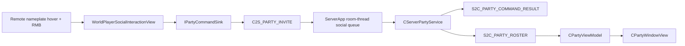

# 2026-08-15 G03 Server Party Invite / Roster 구현 계획서

## 0. 문서 상태와 전제

- 이 문서는 G02 구현과 자동 검증이 끝난 뒤 이어지는 다음 구현 단위 G03의 정본 구현 계획서다. G02의 수동 nameplate 시각 판정과 Bern navigation blocker는 [G02 RESULT](2026-08-15_G02_CHARACTER_CREATION_BERN_NAMEPLATE_RESULT.md)에 분리돼 있다.
- 직접 반영할 public 계약, 신규 H/CPP, 기존 함수 교체 지점과 project/filter 등록은 같은 폴더의 `2026-08-15_G03_SERVER_PARTY_INVITE_ROSTER_DETAIL_PLAN.md`가 소유한다.
- 구현·빌드·검증 위치는 `C:\Users\user\Desktop\LostArk` 실제 폴더 하나다.
- 다른 세션의 Effect 확장 변경은 읽기만 하고 reset, clean, stash, checkout 또는 전체 파일 덮어쓰기로 정리하지 않는다.
- G03은 Character Select를 다시 공용 room으로 만들지 않는다. Party 상호작용은 서로 만나는 `BERN`과 `VALTAN_ARENA`에서만 활성화한다.

### 0.1 2026-08-15 UI 담당 산출물 실측

현재 코드의 UI 기준선은 UI 작업자 변경 `768d8a8d`와 이를 합친 `202f1920`이다. 이 변경은 G03의 시각 shell을 제공하지만 social 기능을 구현한 변경은 아니다.

- `CChatWindowView`는 Bern/Valtan의 Enter/Escape 입력, 한/영 IME 표시, 최대 20줄 local echo, 30초 fade를 구현했다. `C2S_CHAT/S2C_CHAT`은 packet enum만 있고 DTO, codec, Server relay, Client consumer는 없다.
- 현재 Chat은 `m_bInputOpen == false`여도 `ImGui::InputText`를 그려 mouse focus와 `Is_Open()`이 어긋날 수 있다. G03에서 Party 변경과 섞어 고치지 않고 G04 Chat 재설계의 명시적 입력-state 결함으로 넘긴다.
- `CPartyWindowView`는 title/HP/leader/번호 art를 그리지만 constructor가 Warlord/LanceMaster/Artist/DimensionMaster 네 명을 seed한다. Server roster, view model, invite 결과와 연결되지 않았으며 초대 전에도 항상 보이는 placeholder다.
- 현재 Party 좌표는 reference 1280x720 기준 `PANEL_X=20`, `PANEL_Y=240`인 **왼쪽 패널**이다. 오른쪽 Party panel 구현은 코드, Git 이력, 리소스 어디에도 없다.
- remote hover, RMB target hit-test, `Invite/Cancel` popup, party packet/service는 아직 없다. G03이 이 부분을 새로 구현한다.
- `ChatWindowView.*`와 `PartyWindowView.*`는 `Client.vcxproj/.filters`에 이미 각각 한 번 등록돼 있다. G03은 기존 항목을 다시 등록하거나 같은 역할의 두 번째 view를 만들지 않는다.
- `Client/Bin/Resources/UI/Chat` 5개와 `UI/Party` 8개 PNG는 현재 코드의 Resources-relative ID와 일치한다. 이 폴더는 Git 제외된 팀 소유 물리 runtime 입력이므로 `Data/UI`나 프로젝트별 복사본으로 복제하지 않는다.
- `Data/UI/Chat`과 `Data/UI/Party` layout JSON, Invite/Cancel 전용 art는 없다. 따라서 기존 Party foreground draw와 G03의 임시 ImGui command surface를 기능 검증에 재사용하되 최종 `CUIObject` 제품 UI 완료로 기록하지 않는다.

실측 resource 계약은 다음과 같다.

| 영역 | Resources-relative ID | native size |
|---|---|---:|
| Chat | `UI/Chat/English Input.png` | 17x14 |
| Chat | `UI/Chat/Input Bar.png` | 293x30 |
| Chat | `UI/Chat/Korean Input.png` | 13x16 |
| Chat | `UI/Chat/LogPanelBg.png` | 368x228 |
| Chat | `UI/Chat/Normal Bar.png` | 96x32 |
| Party | `UI/Party/Party Hp Bg.png` | 207x26 |
| Party | `UI/Party/Party HP.png` | 206x24 |
| Party | `UI/Party/Party Leader Mark.png` | 20x16 |
| Party | `UI/Party/Party Name.png` | 248x28 |
| Party | `UI/Party/Party No.1.png` .. `Party No.4.png` | 7/9/9/10x15 |

별도 UI 정리 항목으로 `Data/UI/HUD/IdentityAnimation` JSON 23개는 물리 파일과 runtime consumer가 있지만 현재 `Client.vcxproj/.filters`의 `96.DataFiles\UI` 등록에서 빠져 있다. 이는 Chat/Party runtime 연결을 막는 G03 파일은 아니므로 G03 코드와 섞지 않고 별도 project-registration 검증 단위로 처리한다.

선행 상태는 다음과 같이 고정한다.

| 단계 | 상태 | G03이 소비하는 계약 |
|---|---|---|
| G00 | CLOSED | 4-player Valtan shared simulation, player HP snapshot |
| G01 | CLOSED | Character Select session-private, Bern/Valtan shared simulation |
| G02 | CLOSED (manual visual pending) | created/audition nickname, Bern/Valtan replicated nameplate, read-only replicated player view |
| G03 | NEXT | remote hover/RMB -> immediate invite -> Server roster -> left Party HP UI |

## 1. 최종 사용자 흐름

1. 두 명 이상의 Client가 Bern 또는 Valtan에 Server 승인을 받고 들어온다.
2. 각 캐릭터 머리 위에는 G02가 복제한 닉네임이 보인다.
3. 사용자가 다른 캐릭터의 nameplate 영역에 마우스를 올리고 우클릭한다.
4. 우클릭은 해당 프레임의 땅 이동 명령을 소비하고 `Invite`, `Cancel` 두 명령만 가진 임시 context surface를 연다.
5. `Cancel`은 popup만 닫고 Server packet을 보내지 않는다.
6. `Invite`는 현재 world와 대상 `NetEntityId`를 typed `IPartyCommandSink`로 제출한다.
7. Server는 초대한 session의 현재 world와 정확히 일치하는 target presentation을 resolve한다.
8. 이번 수직 슬라이스에서는 별도 Accept/Decline 대기 없이 초대를 즉시 roster에 commit한다.
9. Server가 최대 4명, leader, party slot, visible-state revision을 확정한 뒤 모든 party member에게 같은 roster를 broadcast한다.
10. Client는 roster revision을 적용하고 기존 `UI/Party/...` 리소스로 왼쪽 Party UI에 번호, leader mark, nickname, 현재 HP 비율을 그린다.
11. 같은 접속의 Bern <-> Valtan Server world transfer에서는 party identity, slot, leader가 유지되고 presentation binding만 새 `(WorldId, NetEntityId)`로 갱신된다.
12. Client 연결이 끊기면 Server가 해당 member를 제거하고 남은 member에게 새 revision을 보낸다. 1명만 남으면 party를 해산해 가짜 1인 roster를 남기지 않는다.



## 2. 핵심 결정

### 2.1 nickname과 NetEntityId는 Party identity가 아니다

- nickname은 중복 가능한 표시 문자열이다.
- `NetEntityId`는 room-local이며 Bern과 Valtan에서 같은 값이 재사용될 수 있다.
- Server는 접속 lifetime 동안만 유효한 전역 `SOCIAL_PLAYER_ID`를 별도로 발급한다.
- membership, leader, party slot은 `SOCIAL_PLAYER_ID`로 관리한다.
- 화면의 클릭 대상은 `(WORLD_ID, NET_ENTITY_ID)`로 식별하고 Server가 동일 world의 presence를 통해 social identity로 resolve한다.
- Client 재실행이나 계정 DB까지 유지되는 영구 social identity는 이번 G의 완료 주장이 아니다.

### 2.2 즉시 초대가 이번 G의 제품 규칙이다

사용자가 지정한 최소 흐름은 `Invite` 클릭 뒤 Party UI가 바로 나타나는 것이다. 따라서 G03은 초대 수락 대기열을 만들지 않는다.

- solo inviter가 remote target을 초대하면 새 party를 만들고 inviter를 leader/slot 1, target을 slot 2로 commit한다.
- 이미 party인 경우 leader만 추가 초대를 보낼 수 있다.
- target이 다른 party에 있으면 기존 roster를 건드리지 않고 typed failure를 보낸다.
- Accept/Decline, kick, promote, leave UI는 후속 social UX G의 범위다.

### 2.3 Party authority는 GameRoom이 아니라 ServerApp lifetime이다

Bern과 Valtan은 서로 다른 `CGameRoom`이므로 room-local party map은 transfer 순간 roster를 잃는다. `CServerPartyService`는 `CServerApp`의 room thread가 단독으로 갱신한다.

- receive thread: packet decode 후 bounded social command queue에 enqueue만 한다.
- game room: player의 현재 world/entity/class/nickname/HP를 read-only presence로 제공한다.
- room thread: 모든 simulation tick 뒤 presence를 stage/commit하고 party command를 처리한다.
- `CServerPartyService`는 Client GameObject, prototype tag, asset path를 알지 않는다.

### 2.4 HP는 Server 값만 표시한다

Party HP는 Client 캐릭터 transform이나 로컬 damage 예측을 읽지 않는다. Server의 `SERVER_PLAYER::iCurrentHp/iMaximumHp`를 presence에 반영하고 roster revision이 바뀔 때만 broadcast한다.

## 3. Shared wire 계약

`NETWORK_PROTOCOL_VERSION`은 새 packet type과 payload가 추가되므로 `19 -> 20`으로 올린다.

추가 packet:

- `C2S_PARTY_INVITE`
- `S2C_PARTY_COMMAND_RESULT`
- `S2C_PARTY_ROSTER`

핵심 wire DTO:

```cpp
using SOCIAL_PLAYER_ID = std::uint64_t;
using PARTY_ID = std::uint64_t;

inline constexpr SOCIAL_PLAYER_ID INVALID_SOCIAL_PLAYER_ID = 0u;
inline constexpr PARTY_ID INVALID_PARTY_ID = 0u;
inline constexpr std::size_t MAX_PARTY_MEMBERS = 4u;

struct C2S_PARTY_INVITE
{
    std::uint32_t iRequestSequence = 0u;
    WORLD_ID eTargetWorldId = WORLD_ID::END;
    NET_ENTITY_ID iTargetNetEntityId = INVALID_NET_ENTITY_ID;
};

struct PARTY_MEMBER_WIRE
{
    SOCIAL_PLAYER_ID iSocialPlayerId = INVALID_SOCIAL_PLAYER_ID;
    WORLD_ID eWorldId = WORLD_ID::END;
    NET_ENTITY_ID iNetEntityId = INVALID_NET_ENTITY_ID;
    CHARACTER_CLASS_ID eCharacterClass = CHARACTER_CLASS_ID::END;
    std::string strNickname;
    std::uint32_t iCurrentHp = 0u;
    std::uint32_t iMaximumHp = 0u;
    std::uint8_t iPartySlot = 0u;
    bool isLeader = false;
    bool isPresent = false;
};
```

`S2C_PARTY_ROSTER`는 `partyId`, connection-scoped strictly newer `stateRevision`, `selfSocialPlayerId`, 0 또는 2..4 member를 가진다. revision은 membership 전용이 아니라 화면에 보이는 전체 party 상태 revision이다. member, leader, slot, presence, world/entity, class/nickname, current/max HP 중 하나라도 바뀌면 한 번 증가하고 모든 member에게 같은 full snapshot을 보낸다. member 0개는 party 해산을 뜻하며 1-member roster는 codec과 Server validator가 거부한다.

현재 `CPacketWriter/CPacketReader`에는 U64 public API가 없으므로 같은 G에서 `Write_U64/Read_U64`를 추가한다. Party codec 안에 사설로 두 번째 endian 구현을 만들지 않는다.

`S2C_PARTY_COMMAND_RESULT`는 request sequence와 다음 결과 중 하나를 가진다.

- `ACCEPTED`
- `REJECTED_WRONG_WORLD`
- `REJECTED_SELF`
- `REJECTED_TARGET_NOT_FOUND`
- `REJECTED_NOT_LEADER`
- `REJECTED_ALREADY_MEMBER`
- `REJECTED_TARGET_IN_OTHER_PARTY`
- `REJECTED_PARTY_FULL`
- `REJECTED_STALE_REQUEST`

모든 reader는 local DTO에 decode/validate한 뒤 output에 commit한다. malformed packet은 기존 destination을 보존한다.

## 4. Server 설계

### 4.1 `ROOM_SOCIAL_PRESENCE`

`CGameRoom::Collect_SocialPresence()`는 room thread에서만 호출하며 현재 player를 다음 DTO로 복사한다.

```cpp
struct ROOM_SOCIAL_PRESENCE
{
    SESSION_ID iSessionId = INVALID_SESSION_ID;
    LostArk::Shared::WORLD_ID eWorldId = LostArk::Shared::WORLD_ID::END;
    LostArk::Shared::NET_ENTITY_ID iNetEntityId =
        LostArk::Shared::INVALID_NET_ENTITY_ID;
    LostArk::Shared::CHARACTER_CLASS_ID eCharacterClass =
        LostArk::Shared::CHARACTER_CLASS_ID::END;
    std::string strNickname;
    std::uint32_t iCurrentHp = 0u;
    std::uint32_t iMaximumHp = 0u;
};
```

이 API는 ServerApp mutex를 잡지 않고, GameRoom 밖에서 player container를 수정하지 않는다.

### 4.2 `CServerPartyService`

service가 소유하는 상태:

- `SESSION_ID -> SOCIAL_PLAYER_ID`
- `SOCIAL_PLAYER_ID -> session/presence`
- `(WORLD_ID, NET_ENTITY_ID) -> SOCIAL_PLAYER_ID`
- `PARTY_ID -> contiguous party-slot members + slot 1 leader + full visible-state revision`
- `SOCIAL_PLAYER_ID -> PARTY_ID`

불변식:

- 한 social player는 최대 한 party에만 속한다.
- party member 수는 2..4다.
- leader는 항상 contiguous roster의 slot 1 member다. leader disconnect 뒤에는 남은 첫 member가 slot 1과 leader를 함께 승계한다.
- `partySlot`은 1..memberCount에서 unique/contiguous다. world transfer는 slot을 바꾸지 않는다.
- member가 끊기면 남은 상대 순서를 보존한 채 slot을 1..N으로 compact하고, 기존 leader가 끊긴 경우 첫 member를 leader로 승격한다.
- Character Select/Training presence는 invite target lookup에 등록하지 않는다.
- 같은 Server tick의 전체 presence를 stage한 뒤 검증 성공 시 한 번에 commit한다.

### 4.3 command routing

`CServerApp::On_SessionFrame()`의 party branch는 codec 검증 뒤 `SERVER_SOCIAL_COMMAND`를 bounded queue에 넣는다. gameplay `ROOM_COMMAND`로 변환하지 않는다.

`Room_Loop()` 순서:

1. closed session ID를 room thread에서 drain/dedupe하고 party service에 idempotent disconnect commit
2. closed session stop/reap
3. 모든 shared/private simulation tick 1차 pass
4. 모든 simulation의 world transfer drain 2차 pass
5. 모든 room의 presence collect
6. `CServerPartyService::Synchronize_Presence`
7. bounded social command drain
8. changed roster/result frame enqueue

transfer target의 queued enter가 다음 tick에 처리되는 한 tick gap은 `isPresent=false`로만 표현한다. membership은 `SOCIAL_PLAYER_ID`로 유지하며 presence 부재를 disconnect로 해석하지 않는다. invite는 같은 tick에 commit된 world/entity/HP만 본다.

social queue는 capacity 256, per-tick drain 64로 고정한다. reliable invite enqueue 실패는 조용히 drop하지 않고 session close/failure로 끝낸다. party service는 room thread only이며 socket send를 직접 하지 않는다. typed outbound를 반환하고 ServerApp가 session strong pointer를 mutex 아래 복사한 뒤 mutex를 풀고 encode/`Send_Frame`한다.

## 5. Client 설계

### 5.1 Network boundary

- `IPartyCommandSink`: UI가 아는 유일한 명령 계약
- `CNetworkPartyCommandSink`: `CNetworkManager::Send_PartyInvite()`를 호출하는 유일한 구현
- `CNetworkManager`: connection lifetime request sequence를 소유하고 result/roster packet을 main-thread queue에 보관하며 typed consume API만 공개
- `CPartyViewModel`: strictly newer roster revision만 commit하고 stale/duplicate를 무시

UI, Level, `CCharacter`는 packet writer나 socket을 직접 include하지 않는다.

`Reset_WorldInboundState()`는 world transfer generation만 정리하고 party inbox/view state를 지우지 않는다. `NetworkManager.h`에는 public `Get_SocialConnectionGeneration()`과 private `Reset_SocialInboundState()`를 선언하고, 새 socket commit, `Fail_Protocol()`, `Close_ServerConnection()`의 receive-thread join 뒤에서만 social reset을 호출한다. MainApp-owned `CPartyViewModel`은 result와 roster를 `CNetworkManager::Update()` 직후 drain하고 connection generation이 바뀌면 revision, ghost roster, 이전 connection의 status를 함께 reset한다. Bern -> Valtan의 `Send_EnterWorld()`/`S2C_ENTER_ACCEPTED`에서는 social reset을 호출하지 않는다.

### 5.2 nameplate hover와 RMB 소비

G02의 `CWorldPlayerNameplateView`는 display owner로 유지한다. G03은 별도 `CWorldPlayerSocialInteractionView`를 추가해 다음만 담당한다.

- G02 `REPLICATED_PLAYER_VIEW`의 remote player만 projection
- 고정 reference-size nameplate hit rect와 view-space depth 생성
- cursor screen-space hit test
- RMB edge에서 target `(worldId, entityId, nickname)` stage
- popup open/close와 invite submit
- 겹친 rect는 가장 가까운 view-space depth, 그 다음 stable EntityId로 결정
- popup이 닫힌 뒤 물리 RMB와 Invite/Cancel LMB가 release될 때까지 gameplay suppression latch 유지

interaction은 block된 Engine mouse getter가 아니라 `GetAsyncKeyState(VK_RBUTTON/VK_LBUTTON)` raw state를 먼저 읽는다. Bern/Valtan Level은 controller update 전에 interaction update를 호출한다. RB는 interaction이 단독 소유해 반환된 mask를 그대로 적용한다. LB는 이미 MainApp의 MapTool world-picking block이 먼저 적용되므로 `CGameInstance::IsMouseButtonBlocked(DIM::LB)`로 현재 block을 읽고 `existing || consumed.left`로 합성한다. Level은 LB를 blind `false`로 지우지 않으며 다음 frame 시작에 MainApp가 MapTool source를 다시 확정한다. Level destructor/transfer는 interaction reset과 RB 해제만 수행하고 MainApp shutdown이 최종 LB/RB를 정리한다. Character Select에는 이 view를 만들지 않는다.

`GetAsyncKeyState`는 물리 release latch 갱신에만 raw로 사용한다. `CGameInstance::IsMouseInputBlocked()`가 true인 frame에는 Chat, Skill Window, Developer UI 또는 기존 ImGui popup이 pointer를 소유한 것이므로 새 world target을 획득하거나 새 Party popup을 열지 않는다. 이미 열린 popup의 Invite/Cancel과 버튼 release latch는 계속 처리한다.

### 5.3 Party HUD

기존 `CPartyWindowView`의 seed 4명을 삭제한다. 새 Party view를 만들지 않고 기존 왼쪽 좌표, image size, 간격과 `CUITextureCache`를 보존한 채 data owner만 MainApp-owned `CPartyViewModel` read-only binding으로 바꾼다. view는 member list와 마지막 command result status를 함께 소비한다. 실패 status는 다음 Server result 또는 connection generation reset까지 유지하지만 roster가 비었을 때 Party title/HP panel을 위조하지 않고 작은 status text만 별도로 표시한다. authoritative empty/disband roster는 이전 accepted status를 지운다. view는 다음 리소스를 그대로 쓴다.

- `UI/Party/Party Name.png`
- `UI/Party/Party Hp Bg.png`
- `UI/Party/Party HP.png`
- `UI/Party/Party Leader Mark.png`
- `UI/Party/Party No.1.png` .. `Party No.4.png`
- 가능한 class의 `UI/ClassSelect/<Class>/IdentitySymbol.png`

member와 status가 모두 비어 있으면 아무것도 그리지 않는다. member가 비고 failure status만 있으면 Party title/HP art 없이 status text만 그린다. member가 있을 때만 기존 Party panel을 표시한다. HP ratio는 `current / maximum`을 clamp하고 vector index가 아니라 Server `partySlot`이 번호 asset을 선택한다.

기존 ImGui foreground 기반 Party window는 이번 기능 검증용 현재 런타임으로 유지한다. Invite/Cancel context도 이번 G에서는 임시 command surface다. 최종 제품 popup/layout JSON 및 `CUIObject` 전환 완료를 주장하지 않는다.

`CMainApp`의 기존 `CChatWindowView` 생성, Enter/Escape 처리, Bern/Valtan render gate와 keyboard/mouse capture는 G03에서 그대로 보존한다. G03은 Chat packet이나 local echo 동작을 변경하지 않고 `CPartyViewModel` update와 Party render argument만 접합한다.

## 6. 실패와 rollback

- target hover 중 presentation 만료: popup을 열지 않는다.
- popup open 뒤 target despawn/transfer: Server가 target-not-found/stale로 거부하고 기존 roster 유지.
- self invite: packet 전송 전 Client가 막고 Server도 거부.
- malformed/unknown packet: protocol failure 정책 유지, partial party state commit 금지.
- duplicate request sequence: Server가 cached result를 idempotently 다시 보내고 roster mutation 금지. 이전 sequence는 stale로 거부.
- target other party/full/not leader: result만 갱신, roster revision 불변.
- roster decode 실패/stale revision: 기존 visible roster 유지.
- world transfer: membership/slot/leader 유지, optional presence만 갱신.
- disconnect: member 제거 후 roster broadcast; 1명만 남으면 party 해산 snapshot broadcast.
- Party UI texture 누락: 해당 art만 skip하며 party authority와 HP state는 유지.

## 7. 물리 파일 범위

### Shared

- 수정: `Shared/Public/Network/PacketType.h`
- 수정: `Shared/Public/Network/PacketWriter.h`, `Shared/Private/Network/PacketWriter.cpp`
- 수정: `Shared/Public/Network/PacketReader.h`, `Shared/Private/Network/PacketReader.cpp`
- 추가: `Shared/Public/Party/PartyContracts.h`
- 추가: `Shared/Public/Party/PartyMessages.h`
- 추가: `Shared/Private/Party/PartyMessages.cpp`
- 수정: `Shared/Default/Shared.vcxproj`, `.filters`

### Server

- 추가: `Server/Public/RoomSocialPresence.h`
- 추가: `Server/Public/ServerPartyService.h`
- 추가: `Server/Private/ServerPartyService.cpp`
- 수정: `Server/Public/GameRoom.h`, `Server/Private/GameRoom.cpp`
- 수정: `Server/Public/ServerApp.h`, `Server/Private/ServerApp.cpp`
- 수정: `Server/Private/ServerGameplayContractTests.cpp`
- 수정: `Server/Default/Server.vcxproj`, `.filters`

### Client

- 추가: `Client/Public/PartyCommandSink.h`
- 추가: `Client/Public/NetworkPartyCommandSink.h`
- 추가: `Client/Private/NetworkPartyCommandSink.cpp`
- 추가: `Client/Public/PartyViewModel.h`
- 추가: `Client/Private/PartyViewModel.cpp`
- 추가: `Client/Public/WorldPlayerSocialInteractionView.h`
- 추가: `Client/Private/WorldPlayerSocialInteractionView.cpp`
- 수정: `Client/Public/NetworkManager.h`, `Client/Private/NetworkManager.cpp`
- 수정: `Client/Public/PartyWindowView.h`, `Client/Private/PartyWindowView.cpp`
- 수정: `Client/Public/Level_Bern.h`, `Client/Private/Level_Bern.cpp`
- 수정: `Client/Public/Level_ValtanArena.h`, `Client/Private/Level_ValtanArena.cpp`
- 수정: `Client/Public/MainApp.h`, `Client/Private/MainApp.cpp`
- 수정: `Client/Default/Client.vcxproj`, `.filters`

`Client/Public|Private/ChatWindowView.*`는 G03 read-only 회귀 기준이며 수정하지 않는다. 기존 Chat/Party H/CPP project item은 이미 존재하므로 재등록하지 않고 위 신규 G03 파일만 추가한다.

### Engine input composition

- 수정: `Engine/Public/Input_Device.h`
- 수정: `Engine/Public/GameInstance.h`, `Engine/Private/GameInstance.cpp`

기존 per-button block을 덮어쓰지 않고 읽기 위한 `IsMouseButtonBlocked(DIM) const` getter만 추가한다. 입력 상태의 owner나 update 순서는 바꾸지 않는다.

### Harness/docs

- 수정: `Tools/NetworkProtocolHarness/Private/NetworkProtocolHarness.cpp`
- 수정: `Tools/ClientFrontendHarness/Private/ClientFrontendHarness.cpp`
- 수정: `Tools/ClientFrontendHarness/Default/ClientFrontendHarness.vcxproj`, `.filters`
- 수정: `Tools/CharacterSelectIsolationHarness/Private/CharacterSelectIsolationHarness.cpp`
- 수정: `.md/TEAM/TEAM_GAMEPLAY_INTERFACE_HANDBOOK.md`
- 추가: 대응 G03 RESULT

새 실행 프로젝트는 만들지 않는다. 기존 protocol/frontend/live isolation harness를 확장한다.

## 8. 구현 순서

1. Party contracts/messages + protocol version 20 + NetworkProtocolHarness
2. Server room presence DTO/API
3. `CServerPartyService` pure contract tests
4. ServerApp social queue/routing/send
5. NetworkManager + sink + ClientFrontendHarness
6. PartyViewModel + seeded roster 제거 + PartyWindow binding
7. world social interaction + RMB input consume
8. Engine per-button block getter + Bern/Valtan OR-composed integration
9. live harness: Bern invite, exact roster, Valtan transfer persistence, disconnect cleanup
10. public handbook/RESULT/build/regression

## 9. 자동·수동 완료 기준

자동:

- Engine Debug/Release + `UpdateLib.bat` Debug/Release
- Shared/NetworkProtocolHarness Debug/Release, failures 0
- Server Debug/Release + `--contract-test`, failures 0
- ClientFrontendHarness Debug/Release, failures 0
- CharacterSelectIsolationHarness Debug/Release live, failures 0
- Client Debug/Release 실제 link
- vcxproj/filters XML parse 및 changed/new C++ 등록 누락 0
- Chat 5개와 Party 8개 physical Resources-relative asset 존재 확인
- 기존 `ChatWindowView.*`/`PartyWindowView.*` project item이 각각 정확히 한 번만 존재하는지 확인
- `git diff --check`

live harness 최소 증거:

- Bern A가 B를 초대하면 A/B 모두 동일 partyId/revision/2-member slot을 수신
- duplicate/self/not-leader/full 실패가 기존 roster를 보존
- Bern -> Valtan transfer 뒤 membership/slot/leader 유지, world/entity binding만 갱신
- pure Server contract에서 HP 변화가 두 Client roster에 같은 revision/current/max로 도착하고 변화 없는 다음 tick은 outbound 0
- member disconnect 뒤 roster 갱신 또는 party 해산

사용자 수동 visual smoke:

```text
Bern 또는 Valtan 2 Client 진입
UI 폴더를 Client 실행 뒤 복사했다면 Client 재시작
초대 전 fake 4-member Party panel이 보이지 않는지 확인
remote nameplate hover
우클릭 -> Invite / Cancel
Cancel -> 이동/party 변화 없음
Invite -> 왼쪽 Party UI 표시
leader mark, party slot, exact nickname, HP 변화 확인
popup 위 우클릭이 땅 이동으로 전송되지 않는지 확인
Chat/Skill/Developer UI 위 우클릭이 world Party popup을 열지 않는지 확인
Bern <-> Valtan 이동 뒤 Party UI 유지 확인
Enter/Escape local Chat shell이 기존과 동일하게 열리고 닫히는지 확인(네트워크 Chat PASS 아님)
```

에이전트는 Client를 실행하거나 visual PASS를 대신 기록하지 않는다.

## 10. 명시적 비범위

- 초대 Accept/Decline 대기 UI
- kick, promote, leave, ready check, matchmaking
- PARTY/ROOM chat
- account/DB 영구 social identity
- nickname uniqueness
- 최종 제품 context popup art/layout JSON
- Party별 Valtan instance admission
- IOCP transport 교체
- Effect/collider/damage timeline

G03이 닫히면 다음 social 단계는 `ROOM/PARTY chat`이며, collider/effect timeline과 IOCP는 별도 검증 단위로 유지한다.

기존 `.md/GB/08-03/2026-08-03_G4_CHAT_VERTICAL_SLICE_PLAN.md`는 현재 typed UI boundary, G03 social identity와 현재 enum/command 확장을 반영하지 않은 과거 제안이므로 그대로 적용하지 않는다. G04는 기존 `CChatWindowView` shell을 보존하고 `IChatCommandSink`, ROOM/PARTY channel authority와 Server relay를 현재 코드 기준으로 다시 설계한다.
