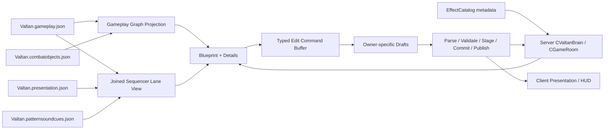

# Action Composition Workbench 구현 계획서

## 목표

기존 `CAnimation_Tool`에 Pattern·Effect·Sound·Server 제어 UI를 계속 누적하지 않는다.
F1에서 독립적으로 여는 `CActionCompositionWorkbench`를 추가하고, 다음 하나의 작업 흐름을
실제 정본과 기존 runtime consumer 위에서 제공한다.

```text
Pattern 선택
→ 연결 Animation / Effect / Sound / Camera / World 확인
→ 공통 playhead Sequencer에서 occurrence 선택·시간 조정
→ 오른쪽 typed Details에서 gameplay/presentation owner draft 편집
→ Save / Validate / Publish
→ canonical Product reload
→ Complete Play 또는 exact Restart
```

새 Workbench는 ImGui shell과 transaction orchestration만 소유한다. 별도 `sequence.json`,
두 번째 Effect/Animation runtime, generated Product 직접 Save는 만들지 않는다.

### 이번 결정

- 먼저 다른 세션의 EXE 수동 검토와 동일 revision 검증을 끝내고 PR→merge→`main` pull한다.
- 기본 편집은 단순한 일곱 lane이고, 복잡한 분기만 선택형 `Pattern Blueprint`에서 본다.
- Blueprint는 gameplay topology의 editor projection일 뿐 새 JSON이나 runtime VM이 아니다.
- Sequencer는 시간, Blueprint는 outcome, Details는 수치, domain Tool은 asset body, Server는 판정을
  각각 소유한다.
- Pattern 콘텐츠는 기반 merge 뒤 기존 schema 승격과 새 Server vertical slice를 구분해 한 개씩
  구현한다.

## 원래 시작 상태와 통합 전 WIP

### 원래 시작 상태

- `CAnimation_Tool`이 clip preview, Valtan canonical tree, Pattern Detail, Sound draft,
  joined lane까지 한 클래스에 소유해 모델/target 상태와 저작 UI가 강하게 결합돼 있다.
- 현재 joined lane은 time bar viewer이며 공통 playhead selection, drag/trim, owner-aware
  commit 상태가 완성돼 있지 않다.
- `Valtan.patternbindings.json`과 `Valtan.patterneffectcues.json`은 generated Product다.
  presentation 저작 정본은 `Data/Valtan/Valtan.presentation.json`이다.
- Server gameplay stage draft와 Save→Publish→Apply는 `CBalanceTool` typed boundary가 이미
  제공한다.
- Complete Play는 `CMainApp -> CBossTool -> CValtanPatternAuditionService`, Restart는
  `CBossTool -> CValtanPatternAuditionService`의 exact occurrence 계약을 사용한다.
- Create Pattern과 일반 typed patch는 같은 writer admission, generation journal,
  stage/validate/commit/rollback 계약을 사용해야 한다. 실행형 oracle이 source/Product
  동세대와 byte-identical rollback을 증명하지 못하면 Create/Apply를 차단한다.

### 2026-08-31 통합 전 기준선

이 문서는 목표 계약이다. 같은 작업 폴더에서 다른 세션이
`ActionCompositionWorkbench.cpp`를 계속 수정 중이므로, 현재 화면이나 RESULT의 과거 빌드
기록을 최신 구현 완료 증거로 간주하지 않는다. 특히 일곱 category lane과 window shell 일부가
코드에 보이더라도 `Edit` 제거, `Add Logic`, `Duplicate Stage Bundle`, 모든 block의
duplicate/delete/capability, 비동기 direct-child Resource cache가 끝났다고 가정하지 않는다.

2026-08-31 10:34 KST 실측은 `codex/action-composition-workbench`, HEAD `780fd0bd`,
`origin/main`보다 6 commit behind, 대규모 dirty/untracked 상태다. 이 값은 통합 전 스냅샷이며
PR 직전에는 branch/status/HEAD를 다시 측정해 RESULT의 증거 revision과 일치시킨다.

후속 Pattern 작업은 아래 기준선을 먼저 닫은 뒤 새 브랜치에서 시작한다.

1. 현재 구현 세션이 코드와 문서를 freeze하고 실제 변경 파일을 다시 실측한다.
2. 동일 commit revision에서 focused/native harness, Debug/Release Product와 필요한 Core 검증을
   다시 실행한다. 이전 revision의 PASS를 최신 증거로 재사용하지 않는다.
3. 사용자가 최신 EXE를 직접 실행해 F1 Workbench 진입, 독립 window resize, 일곱 lane,
   block 선택과 Details 전환, drag/trim, Save/Reload, Complete Play/Restart를 판정한다.
4. RESULT에는 동일 revision의 자동 검증과 사용자 수동 visual 판정을 분리해 교정한다.
5. 관련 변경만 scope별 commit/push하고 PR review를 받은 뒤 `main`에 merge한다.
6. merge 뒤 clean checkout에서 `git fetch`, `git switch main`, `git pull --ff-only`로 정본을
   동기화하고 PLAN/RESULT/실제 코드를 다시 읽는다.
7. 후속 구현은 `codex/valtan-pattern-blueprint-authoring` 같은 새 기능 브랜치에서 시작한다.

사용자 수동 판정 전에는 EXE visual PASS, PR-ready, Workbench 완료라고 기록하지 않는다.

## UI 계약

```text
Action Composition Workbench session
├─ Composition Patterns            Pattern/Stage/Create
├─ Composition Preview             local transport/Server state
├─ Composition Sequencer           shared playhead + seven category lanes
├─ Composition Details             selected typed owner editor
├─ Composition Resources           lazy Animation/Effect/Sound/Camera palette
└─ Composition Session/Validation  Save/Publish/Reload/Server commands
```

- 어느 window에도 `AlwaysAutoResize`, hard minimum/maximum을 사용하지 않는다.
- window별 첫 위치와 크기만 `ImGuiCond_FirstUseEver`로 제안하고 이후에는 ImGui layout state를
  그대로 사용한다.
- canonical/model/Server 실패는 패널을 없애는 early return이 아니다. 이전 admitted view는
  진단용으로 계속 보이되 모든 mutation과 Server action을 비활성화한다.
- raw filesystem 수만 건을 기본 UI에 표시하지 않는다. 선택 Pattern에서 실제 join된
  stable owner row와 exact source/Product path만 표시한다.

### 독립 domain window + 카테고리 lane 중심 최종 편집 화면

`Pattern Tuning Entry Points`의 Stage별 `Edit ...` 버튼 카드는 제거한다. 해당 버튼은 현재
선택 Stage와 Detail owner만 바꾸고 같은 패널을 다음 프레임에 교체하기 때문에, 사용자가
편집 대상과 결과를 추적하기 어렵다. 최종 화면에서는 block 단일 클릭이 곧 선택과 Detail
진입이며 별도의 의미 없는 `Edit` 중간 버튼을 두지 않는다.

하나의 거대한 Workbench `Begin/End` 안에 child를 중첩하지 않는다. Effect Tool의
`Effect Tool / Model View / Effect Detail / All Effects / Data Files` 분리처럼 Composition도
하나의 공유 session state를 소비하는 독립 ImGui window 여섯 개로 렌더한다.

```text
┌ Composition Patterns ─────────────┐  ┌ Composition Preview ────────────────────┐
│ Search Pattern...                 │  │ Valtan Model / Server playback state    │
│ ▾ Rotation                        │  │ [|<] [Play] [Pause] [Stop] [Loop]       │
│   3-roll-charge                   │  │ 1830 / 6200 ms                          │
│    01 WINDUP  900ms               │  │ Outcome [Normal / Counter -> Groggy]    │
│    02 ACTIVE 1700ms               │  │ [Claim Preview Owner]                   │
│    03 WAIT    350ms               │  └─────────────────────────────────────────┘
│ [+ Create Pattern]                │
└───────────────────────────────────┘  ┌ Composition Details ────────────────────┐
                                       │ Selected: Stage 02 / Animation          │
┌ Composition Sequencer ────────────────────────────────────────────────┐        │
│ Path [Default 6200 | Selected 7100 | Max 8300] ms  Zoom 120 Snap 10 │        │
│ Stage     [WINDUP────][ACTIVE────────][WAIT][GROGGY────]  [+ Stage]  │        │
│ Animation [roll_01][roll_01][roll_01][charge────────]    [+ Sequence]│        │
│ Effect         [dust] [dust] [dust] [charge aura────]    [+ Effect]  │        │
│ Sound          |roll| |roll| |roll| |charge|             [+ Sound]   │        │
│ Logic     [Counter Window -> GROGGY][Rush Target]         [+ Logic]   │        │
│ Collider                      [CONE hit────]|hit|          [+ Collider]│        │
│ Camera                          |shake|                    [+ Camera]  │        │
└───────────────────────────────────────────────────────────────────────┘        │
                                       │ Source start [0] ms                      │
┌ Composition Resources ────────────────────────────────────────────────┐        │
│ [Animation] [Effect] [Sound] [Camera] [Logic Templates]              │        │
│ Search current catalog... [Refresh Current]                          │        │
│ mesh_att_roll_01  620 ms  [Preview] [Add at Playhead]                │        │
│ only the opened typed catalog/folder is loaded                       │        │
└───────────────────────────────────────────────────────────────────────┘        │
                                       │ Play length [620] ms                    │
┌ Composition Session / Validation ────────────────────────────────────┐        │
│ [Reload] [Save+Validate+Publish] [Complete] [Restart] [Queue Next]  │        │
│ gameplay DIRTY | presentation CLEAN | sound CLEAN | Product PINNED  │        │
│ exact source/Product/Server revision and validation log              │        │
└───────────────────────────────────────────────────────────────────────┘        │
                                       │ [Duplicate] [Delete]                     │
                                       └──────────────────────────────────────────┘
```

각 window는 독립적으로 이동·resize할 수 있고 최대/최소 hard constraint를 두지 않는다. 최초
위치와 크기만 `ImGuiCond_FirstUseEver`로 제안한다. F1의 `Open Composition Workbench`는 여섯
window의 기본 visibility를 열고, `Windows` 메뉴에서 개별 window를 다시 열거나 숨긴다.
MainApp의 tool owner는 계속 단일 `DEBUG_TOOL::COMPOSITION`이며 window마다 새 runtime owner나
별도 draft를 만들지 않는다.

- `Pattern duration`은 별도 정본 필드가 아니다. linear `MANUAL_SERVER_AUDITION`만 Stage clock의
  순차 합을 단일 total로 표시하고 입력을 허용한다. 분기 Product는 `default path`, 현재 선택한
  outcome path, bounded DAG의 `max path` 시간을 따로 표시하며 event-entered GROGGY/PART_BREAK를
  자동 순차 합산하지 않는다. linear total 입력은 마지막 authoring `WAIT`를 조절하거나 명시적
  `WAIT / Gap` Stage 추가 preview로 변환한다. Stage와 모순되는 두 번째 duration을 저장하지 않는다.
- 카테고리는 `Stage`, `Animation`, `Effect`, `Sound`, `Logic`, `Collider`, `Camera`를 각각
  정확히 한 줄만 렌더한다. 같은 카테고리 occurrence가 여러 개여도 새 row를 만들지 않고 한
  lane 안에 여러 block으로 배치한다. World/Light 참조는 실제 typed item이 있을 때만 Camera
  또는 Logic 아래 subtype으로 표시하며 가짜 빈 lane을 만들지 않는다.
- block 단일 클릭은 playhead 이동 없이 stable occurrence를 선택하고 오른쪽 Detail을 즉시
  교체한다. ruler 클릭은 seek, block body drag는 시작 시간 이동, 오른쪽 handle drag는 길이,
  `Delete`는 exact occurrence 삭제다. 지원하지 않는 owner는 자물쇠와 사유를 표시한다.
- 기존 단일 window의 Detail `390px`, 상단 `160..300px`, Sequencer `280..680px` hard clamp와
  nested child layout을 제거한다. `Composition Sequencer`가 기본 focus window이며 선택 block을
  클릭하면 `Composition Details`가 같은 stable identity를 즉시 표시한다. Details가 숨겨져
  있으면 자동으로 다시 열고 focus한다.
- `Duplicate Clip`은 새 stable occurrence ID를 생성해 presentation occurrence만 복제한다.
  현재 3회 선행 동작처럼 한 Server WINDUP 안에서 animation만 세 번 재생하는 경우에는
  `Duplicate Clip x2`가 정답이다. 각 반복이 별도 motion/hit/Logic clock을 가져야 할 때만
  `Duplicate Stage Bundle`을 사용한다. 참조를 조용히 cascade 복사하지 않고 dependency
  validation을 통과한 bundle transaction만 commit한다. 진짜 무한 반복만
  `LOOP_TO_STAGE_END`를 사용하고 유한 반복을 숨은 loop count로 저장하지 않는다.
- `Stage`의 `+ Stage`는 manual audition에서 `ACTIVE`, `WINDUP`, `GROGGY`, `WAIT / Gap`을
  제공한다. `WAIT`는 Server enum이 아니라 `stageKind=ACTIVE + sequenceRole=WAIT +
  suppressAnimation + no hit/motion/action`으로 compile되는 authoring semantic이다. Product의
  branch-safe arbitrary insertion은 별도 topology transaction 전까지 비활성화한다. 기존 Stage
  공백은 Stage block 또는 오른쪽 `Gap after sequence` 수치로 조절한다.
- `Logic`은 top-level category이고 `Counter`는 그 안의 typed subtype이다. 고정 `Counter`
  lane을 하나 더 만들지 않는다. `+ Logic` 메뉴는 `Counter Window`, `Groggy Transition`,
  `Finite Repeat`, `Branch`, `Grab / Release`, `Portal Rush`, `Silence`, `Target / Anchor`처럼
  실제 schema가 지원하는 항목만 연다. 자주 쓰는 `+ Counter` quick action은 같은
  `Counter Window` transaction을 호출하는 단축 버튼일 뿐 별도 데이터 경로가 아니다.
- `Collider`는 Effect block에서 추출하지 않는다. 같은 Stage clock 위에 시각 Effect와
  Server-authority collider/hit schedule을 나란히 보여주고, Player Reaction의 push range,
  push duration, knockdown과 grab release velocity/yaw는 gameplay Detail에서 편집한다.
  PhysX는 Client debug mirror일 뿐 판정 정본으로 표시하지 않는다.
- Effect block Detail은 invocation timing, `WORLD/BOSS/TARGET/ATTACHMENT` anchor, local
  translation/rotation/scale, stop/repeat를 presentation source에 저장한다. Effect asset body의
  element/material 편집은 exact asset deep-link로 Effect Tool을 열며 invocation owner와 섞지
  않는다.
- Resource Drawer는 활성 tab을 처음 열거나 사용자가 `Refresh`를 누를 때만 해당 typed
  catalog snapshot을 만든다. Pattern/Stage 선택과 매 render frame에는 filesystem, JSON parse,
  hash, canonical admission을 실행하지 않는다. catalog generation이 바뀌기 전까지 search는
  in-memory index에만 수행한다.

## 상용 엔진식 책임 분리

Unreal과 Unity의 대표 workflow는 Timeline이 여러 typed track과 asset reference를 조율하되,
gameplay authority와 VFX/animation/camera asset body를 별도 subsystem에 둔다. 이를 이
프로젝트에 적용하면 선형 시간 편집기, 분기 graph, 각 domain asset, runtime authority를
분리하고 stable reference로 연결하는 것이 맞다는 설계 결론을 얻는다.

| 관심사 | Unreal / Unity의 대표 구조 | 이 프로젝트의 적용 |
|---|---|---|
| gameplay 분기와 권위 | Unreal [Gameplay Ability System](https://dev.epicgames.com/documentation/en-us/unreal-engine/understanding-the-unreal-engine-gameplay-ability-system)은 replicated ability lifecycle을, [StateTree](https://dev.epicgames.com/documentation/unreal-engine/overview-of-state-tree-in-unreal-engine?lang=en-US)는 state/task/transition 구조를 제공한다. Unity Netcode의 [NetworkTransform](https://docs-multiplayer.unity3d.com/netcode/current/components/networktransform)은 client-server topology에서 기본 server authority를 제공하되 다른 authority mode도 지원한다. | 실제 authority policy는 `Valtan.gameplay.json`과 Server fixed tick이 소유한다. |
| 시간 배치 | Unreal [Sequencer typed tracks](https://dev.epicgames.com/documentation/en-us/unreal-engine/sequencer-track-list-in-unreal-engine), Unity [Timeline 1.8](https://docs.unity3d.com/Packages/com.unity.timeline@1.8/manual/index.html) | Workbench의 일곱 lane은 서로 다른 owner를 같은 Stage clock에 투영한다. |
| animation | Unreal [Animation Montage](https://dev.epicgames.com/documentation/en-us/unreal-engine/animation-montage-in-unreal-engine), Unity Animation Track | animation asset body는 기존 Animation 경로가, Pattern occurrence는 `Valtan.presentation.json`이 소유한다. |
| effect | Unreal [Niagara](https://dev.epicgames.com/documentation/en-us/unreal-engine/overview-of-niagara-effects-for-unreal-engine), Unity VFX Graph | invocation timing/anchor는 presentation, element/material body는 `EffectCatalog.json -> Authored/*.effect.json`이 소유한다. |
| sound / camera | Sequencer·Timeline의 typed invocation track과 별도 asset | Sound는 `Valtan.patternsoundcues.json` 별도 CAS다. Camera invocation은 presentation source, body는 `ValtanCinematicCamera.json`에 두되 G13 runtime consumer 전에는 authoring-only다. |
| reusable data | Unreal Primary Data Asset, Unity [ScriptableObject](https://docs.unity3d.com/6000.1/Documentation/Manual/class-ScriptableObject.html) | `patternId/stageId/actionId/occurrenceId/assetId`만 reference로 사용한다. pointer, vector index, Prototype tag는 금지한다. |
| visual scripting | Unreal [Blueprint best practices](https://dev.epicgames.com/documentation/en-us/unreal-engine/blueprint-best-practices-in-unreal-engine), Unity [Visual Scripting 1.9](https://docs.unity3d.com/Packages/com.unity.visualscripting@1.9/manual/index.html) | 임의 script VM이 아니라 닫힌 typed Pattern Recipe node만 제공한다. parse, scan, simulation은 C++/publisher/Server가 수행한다. |

따라서 이 프로젝트의 상용 엔진식 대응은 다음과 같다.

```text
Pattern Blueprint = 왜 실행되고 어느 outcome으로 갈지
Composition Sequencer = 언제 시작하고 얼마나 지속할지
Composition Details = 선택한 owner의 허용 수치를 어떻게 조정할지
Animation / Effect / Sound / Camera Tool = asset body를 어떻게 만들지
Publisher + Server = 무엇이 실제 제품 계약이고 판정 권위인지
```

Effect sector의 모양과 Server sector collider가 같은 anchor/basis를 참조할 수는 있지만,
Effect geometry를 hit 판정으로 사용하지 않는다. `PhysX push`라는 저작 용어도 사용하지 않는다.
일반 hit reaction의 실제 튜닝 항목은 Server gameplay의 `pushRangeM`, `pushMs`, `knockdown`,
`downMs`다. grab release는 별도 event의 `speedMps`, `durationMs`, `yawOffsetDegrees`를 사용한다.
PhysX는 Client debug mirror다.

## Pattern Blueprint 설계

### 역할과 저장 경계

`Pattern Blueprint`는 새 `sequence.json`, `recipe.json`, ImGui node 배치 파일이나 runtime VM이
아니다. 기존 typed owner를 읽어 만든 in-memory graph projection이며, 편집 결과는 stable ID를
가진 typed command로 원래 owner draft에 materialize한다. 해석할 수 없는 기존 조합은
`Custom / Read-only`로 보존하고 손실 변환하지 않는다.



| 화면 요소 | 실제 owner | 저장과 runtime 소비 |
|---|---|---|
| Pattern Root / Stage / Outcome | `Data/Valtan/Valtan.gameplay.json` | Server Stage clock, branch, action, motion, hit schedule |
| Animation / Effect / Camera block | `Data/Valtan/Valtan.presentation.json` | Client presentation invocation |
| Sound block | `Data/Animation/Authored/Valtan/Valtan.patternsoundcues.json` | 별도 revision과 CAS Save |
| Combat Object occurrence / volley | `Data/Valtan/Valtan.gameplay.json` | 어느 Stage에서 어떤 object를 몇 개 spawn할지 |
| Combat Object definition | `Data/Valtan/Valtan.combatobjects.json` | origin, hit geometry/damage/delay와 optional lifetime |
| Combat Object visual | `Data/Actors/BossCatalog.json` | Client presentation asset reference |
| Effect Body link | `Data/Effects/EffectCatalog.json`, `Data/Effects/Authored/*.effect.json` | Effect Tool deep-link; Workbench에서는 read-only body reference |
| Camera Body link | `Data/Encounters/Valtan/ValtanCinematicCamera.json` | Camera Tool deep-link; Workbench에서는 invocation만 편집 |
| generated binding/cue/encounter product | publisher 산출물 | read-only badge와 exact revision만 표시 |

Save UI도 owner 경계를 숨기지 않는다. `Save Pattern`은 gameplay/presentation canonical
transaction을, `Save Sound`는 별도 Sound CAS를 실행한다. 각 Save command는 자신이 소유한
draft의 preflight가 모두 성공하기 전에는 commit하지 않으며, Pattern Save가 Sound를 함께
저장했다고 표시하지 않는다. commit 이후 publish/reload/Server apply 상태도 owner별로
정직하게 표시한다.

### 최소 UI

기본 사용자는 기존 여섯 window와 일곱 lane만 사용한다. topology와 outcome을 편집할 때만
`Composition Patterns`의 `[Open Blueprint]`로 선택형 일곱 번째 `Composition Blueprint`
window를 연다. Blueprint, Sequencer, Details는 동일
`{patternId, stageId, actionId/occurrenceId}` selection을 공유한다.

```text
┌ Composition Blueprint ─ Pattern: VALTAN_TRASH ─ Product r184 ────────────────┐
│ [Tree] [Graph]  [New from Animation] [Clone as Audition] [New from Recipe] │
│ [Save Pattern] [Save Sound] [Publish] [Server Audition]                    │
├ Resource / Recipe Palette ┬ Pattern Recipe Graph ───────────┬ Inspector ───┤
│ Animation                 │ [WINDUP] --counter.hit-->       │ Owner        │
│ Effect                    │              [GROGGY]            │ Stable ID    │
│ Sound                     │      `--timeout--> [CHARGE]      │ Duration     │
│ Logic Recipes             │                                 │ Branches     │
│  Counter / Groggy         │ solid = Server authority        │ Collider     │
│  Portal / Return Center   │ dashed = presentation-only      │ Validation   │
│  Grab / Combat Object     │                                 │ [Duplicate] │
│  Silence [DISABLED]       │                                 │ [Delete]    │
└───────────────────────────┴─────────────────────────────────┴───────────────┘

┌ Composition Sequencer ─ Total 0 ms ─────────────────────────────── 7420 ms ┐
│ Stage     │[WINDUP ][RUSH_CAPTURE        ][HOLD][RELEASE]                  │
│ Animation │[windup clip][rush clip         ][grab][throw]                  │
│ Effect    │[yellow cue: VISUAL ONLY------][impact]                         │
│ Sound     │      [charge]                 [hit]                            │
│ Logic     │ counter  retarget             captured -> hold                 │
│ Collider  │         [SERVER CONE=========]                                 │
│ Camera    │                                  [shake]                       │
└ Errors 0 | Warning: Effect bounds are not the Server collider ─────────────┘
```

Node 위치는 제품 데이터가 아니므로 Pattern JSON에 저장하지 않는다. 최초 layout은 stable ID로
결정적으로 계산하고, 사용 중 배치는 session-local UI state로만 유지한다. graph가 숨겨져 있어도
Sequencer와 Details의 편집 능력은 줄어들지 않는다.

### Node와 pin 계약

| Node | typed pin / 의미 |
|---|---|
| `Pattern Entry`, `Stage`, derived `End Pattern` | Entry는 Pattern `entryActionId`, Stage node는 `(stageId, actionId)`를 표시한다. `End Pattern`은 새 schema가 아니라 `defaultNextActionId/nextActionId == null` terminal sentinel |
| `Outcome Branch` | 현재 지원 enum `TIMEOUT`, `COUNTER_HIT`, `STAGGER_BROKEN`, `WALL_CONTACT`, `PART_DESTROYED`, `PROP_DESTROYED`, `SUMMON_DEAD`, `ALL_PLAYERS_GRABBED`, `ANY_PLAYER_GRABBED`, `NAVIGATION_BLOCKED`만 허용 |
| `Counter Window`, `Groggy / Part Break` | counter 가능 구간과 성공/실패 목적 Stage를 묶는 adapter |
| `Portal Leg`, `Retarget`, `Return Center` | target snapshot, delay, rush speed/distance, 기존 center action |
| `Stagger Window` | gauge enter/exit, broken, timeout branch |
| existing `Grab / Release` / future `Grab Topology` | capture hit의 `playerResponse=CAPTURE`, `attachmentSlot=BOSS_LEFT_HAND`, `ANY/ALL_PLAYERS_GRABBED`와 `TIMEOUT` branch를 조합한다. topology writer 전에는 기존 수치만 활성화 |
| `Collider` | Shared XZ shape, schedule, push/knockdown; Server fixed tick 권위 |
| `Combat Object Spawn` | gameplay occurrence/volley와 combat-object definition section을 owner별로 dispatch; radial writer 전에는 disabled |
| `Target / Anchor` | gameplay aim policy와 presentation anchor policy를 분리해 표시 |
| linked presentation badge | Stage의 Animation/Effect/Sound/Camera 연결 개수와 상태만 표시하고 선택 시 Sequencer block/deep-link로 이동 |

raw `Script`, `Packet`, `Socket`, 자유 문자열 `Add Action`, 무제한 loop/cycle node는 제공하지
않는다. `Finite Repeat`는 실행기 repeat count가 아니라 실제 Stage Bundle을 지정 횟수만큼
materialize한다.

### Logic 추가 UX

`Counter`는 별도 최상위 lane이 아니라 `Logic`의 subtype이다. 자주 쓰는 `+ Counter`는 같은
`Counter Window` typed transaction을 호출하는 shortcut이다.

```text
+ Logic
  Combat Response
    Counter Window
    Groggy / Part Break Branch
    Stagger Window
  Movement / Target
    Portal Leg
    Retarget Random Alive
    Return To Arena Center
  Encounter
    Spawn Combat Object / Volley
    Configure Existing Grab / Release
    Add Grab Retry Topology        [DISABLED: typed capture result 필요]
    Set Boss Flag / Phase          [DISABLED unless exact writer exists]
  Player Status
    Silence                        [DISABLED: typed apply action + Shared/Server/HUD 필요]
```

`New from Animation`은 선택 clip chain으로 manual audition Pattern을 만든다.
`Clone as Audition`은 제품 Pattern을 편집 가능한 새 stable ID로 복제한다. `New from Recipe`는
검증된 Stage/branch/occurrence 묶음을 실제 데이터로 펼친다. `Promote Audition`은 별도 승인과
publisher 검증을 거쳐 Product inventory에 올리며 원본 제품 Pattern을 조용히 덮어쓰지 않는다.

### 수치 튜닝과 Logic 편집의 경계

| Details에서 직접 조절할 수치 | 구조 변경이므로 typed Logic/Recipe가 필요한 항목 | 다른 domain Tool이 소유하는 본문 |
|---|---|---|
| Stage duration, WAIT/gap, portal delay/speed/distance | Stage 추가/삭제/순서, outcome branch와 종료 경로 | animation clip asset/body |
| collider range/angle/radius, hit offset/schedule | Counter/Stagger/Grab/Portal/Return Center adapter 추가 | Effect element/material/resource graph |
| hit `pushRangeM/pushMs/knockdown/downMs`, grab release `speedMps/durationMs/yawOffsetDegrees` | target/anchor policy, combat-object lifecycle/topology | Camera keyframe/FOV/shake body |
| stagger gauge/max/duration, 지원된 status duration | triple counter의 세 Stage, grab retry 수, wipe/part-break 분기 | Sound clip/body |
| animation/effect/sound/camera occurrence timing과 invocation transform | 새 status type, phase flag, Server action enum | generated Product |

slider나 숫자 입력은 기존 의미를 튜닝할 뿐 새 branch나 권위 규칙을 만들지 않는다. 반대로 Logic
node는 필수 field, 유효 target, cycle, dangling reference, 중복 ID를 preflight한 뒤 한 번의 typed
transaction으로만 추가·삭제한다.

## 구현 Gate

### G0. 기존 세션 EXE 검토, PR, merge, pull

- 현재 구현 세션 종료 시 코드와 RESULT를 freeze하고 동일 commit SHA에 귀속되는 검증만 남긴다.
- focused Python/native contract, Valtan audition harness, Debug/Release Product와 필요한 Debug Core를
  변경 domain에 맞게 실행한다. presentation/render/physics/protocol/Server 광역 변경이 PR에 남으면
  같은 SHA에서 `FullDiagnostic`도 실행한다. 실패, 미실행, 이전 revision 결과를 구분한다.
- 사용자가 최신 EXE에서 F1 → Action Composition Workbench를 직접 열고 다음을 확인한다.
  - 여섯 독립 window의 열기/닫기/resize와 같은 selection 유지
  - category당 한 lane, block 선택 시 Details 즉시 전환, total duration 의미
  - 지원된 drag/trim/duplicate/delete와 비지원 action의 disabled reason
  - Save/Validate/Publish/Reload 상태와 Complete Play/Restart의 Server revision
- 사용자 판정과 자동 검증을 반영해 RESULT를 교정한 뒤 scope가 닫힌 commit만 push/PR한다.
- review/merge 후 clean `main`에서 `git pull --ff-only`하고, 새 후속 브랜치에서 G9 이후를
  시작한다. merge 전 WIP 위에 Pattern 콘텐츠 수직 슬라이스를 계속 쌓지 않는다.

G1~G7은 현재 구현 세션 PR의 acceptance scope다. 아직 구현되지 않은 항목은 그 PR에서 억지로
완료 표시하지 않고, merge 후 재실측 결과에 따라 G9 이후 delta로 이관한다.

### G1. 독립 shell과 canonical read model

- 현재 WIP의 `ActionCompositionWorkbench.h/.cpp`와 Client project/filter 등록을 actual source에서
  확인하고 baseline acceptance에 포함한다.
- `CMainApp::DEBUG_TOOL::COMPOSITION`으로 독립 visibility/focus/input owner 제공.
- `Render()`는 frame당 한 번만 `Prepare_FrameView()`를 호출한 뒤
  `Render_PatternsWindow`, `Render_PreviewWindow`, `Render_SequencerWindow`,
  `Render_DetailsWindow`, `Render_ResourcesWindow`, `Render_SessionWindow`를 각각 독립
  `ImGui::Begin/End`로 렌더한다. 각 window가 canonical reload, JSON parse 또는 Timeline rebuild를
  중복 수행하지 않는다.
- 여섯 window는 하나의 `COMPOSITION_SELECTION {patternId, stageId, actionId, owner,
  stableOccurrenceId}`와 immutable frame view를 공유한다. 선택 변경은 identity만 publish하며
  Details, Timeline, Resources가 서로의 draft를 복사하지 않는다.
- 내부 visibility/focus state를 window별로 보존한다. F1 도구 focus 요청은 기본적으로 Sequencer를
  focus하고, Effect/Camera/Animation deep-link만 해당 외부 domain tool의 기존 owner로 전달한다.
- `CValtanPatternTree::Load` 하나만 사용해 Pattern/Stage semantic browser를 구성한다.
- no-model/rejected/stale 상태에서도 Browser·Details·Sequencer·Data 패널을 렌더한다.

### G2. Preview adapter

- `CAnimation_Tool`은 clip/model pose preview만 제공하는 좁은 public adapter를 노출한다.
- Workbench selection은 stable Pattern ID로 preview 시작/seek/stop을 요청한다.
- Animation Tool 창을 열지 않아도 preview update는 기존 MainApp update 경로에서 진행된다.

### G3. 공통 Sequencer

- Pattern 전체 stage clock과 `Stage/Animation/Effect/Sound/Logic/Collider/Camera` lane을 동일
  좌표계로 투영한다.
- block 클릭은 stable owner identity를 Details selection으로 전달한다.
- playhead seek, zoom, horizontal scroll, stage trim을 제공한다.
- drag/trim은 owner adapter가 있는 row만 허용한다. read-only Product row는 잠금 이유와
  정확한 source owner/deep-link를 표시한다.
- 로컬 draft 재생은 제품 runtime cache를 덮지 않는 preview session으로만 stage한다.
  Animation pose와 Server collider mirror, Effect preview 등 실제로 공통 playhead를 소비하는
  lane만 `PLAY`로 표시한다. seek/stop owner가 없는 Sound·Camera·World는 이를 갖출 때까지
  `INSPECT`로 표시하며 가짜 동기 재생을 주장하지 않는다.
- `TIMELINE_ITEM` occurrence마다 별도 row를 만드는 현재 렌더 구조를 typed
  `STAGE/ANIMATION/EFFECT/SOUND/LOGIC/COLLIDER/CAMERA` lane model로 교체한다. lane은 한 번만
  그리며 occurrence가 겹칠 때만 같은 lane 내부의 얇은 sub-row로 자동 적층한다.
- item identity는 `patternId + stageId + actionId + stableOccurrenceId`이고 vector index를 저장
  ID로 사용하지 않는다. 각 item은 source owner와
  `READ/EDIT/MOVE/TRIM/DUPLICATE/DELETE/PLAY` capability를 가진다. branch의 persisted target은
  같은 Pattern의 `nextActionId`이며 Stage vector 순서나 `stageId`를 target으로 쓰지 않는다.
- linear manual audition의 total duration 입력, block duplicate/delete, lane `+` 메뉴는 UI에서
  곧바로 JSON을 조작하지 않고 owner별 typed transaction으로 변환한다. 분기 Product duration은
  path별 read-only이며 adapter가 없는 action은 비활성화 사유를 표시한다.

### G3-A. frame 비용과 Resource Drawer cache

- Workbench render loop는 canonical/effective Pattern 및 Timeline을 매 프레임 재조립하지
  않는다. cache key를 `patternId + compositionGeneration + balanceDraftGeneration +
  soundDraftGeneration + shakeGeneration + previewPath`로 두고 key가 바뀔 때만 rebuild한다.
- Effect Tool의 전체 `Resources/Effect` 재귀 scan과 모든 authored Effect JSON eager parse를
  기본 Open 경로에서 제거한다. 최초 화면은 catalog/owner metadata만 읽고, 활성 Resource tab과
  사용자가 연 folder의 direct children만 비동기 index한다.
- Workbench는 Effect body JSON을 parse하지 않고 Effect owner가 제공한 admitted catalog metadata만
  소비한다. exact asset deep-link 뒤 Effect Tool이 Open, Play, Save, explicit Reload edge에서만
  selected body 하나를 parse한다. Workbench Render와 expanded row에서는 `exists/mtime/size`, file
  open, JSON parse, hash, recursive iterator를 호출하지 않는다.
- 한 개의 low-priority index worker가 `{requestGeneration, ownerKey/folderKey}` snapshot을
  stage하고 main thread는 최신 generation과 일치하는 immutable 결과만 commit한다. 취소·실패는
  이전 view를 read-only로 보존한다.
- native 진단 counter `directoryEntriesVisited/filesOpened/jsonBytesRead/documentsParsed/hashBytes`
  를 두고 warm idle 10,000 frame과 scroll·resize 각 300 frame에서 모두 정확히 0인지 검증한다.
  10,000 invalid file이 든 닫힌 folder fixture는 Tool Open 때 visit/parse 0이어야 하며, filter
  변경은 disk I/O 없이 in-memory view만 한 번 rebuild해야 한다.

### Pattern 중심 저작 모델

Workbench의 기본 선택 단위는 raw JSON 파일이나 clip index가 아니라 stable `Pattern ID`다.
Pattern을 선택하면 그 안의 stable `Stage ID`와 `Action ID`를 기준으로 아래 typed owner를
한 화면에 join한다.

```text
Pattern
└─ Stage (Server wall clock / Stage Role)
   ├─ Animation Sequence Slot occurrence[]
   ├─ Server Collider + Hit Schedule
   ├─ Counter success -> same-Pattern GROGGY Stage
   ├─ Player Reaction / Grab Release velocity·duration·yaw
   ├─ Effect invocation (presentation source)
   └─ Sound cue occurrence (typed Sound source)
```

- `Create New Pattern`은 선택한 Valtan animation chain을 stable Stage/occurrence ID를 가진
  manual Pattern으로 승격한다. 생성 뒤 Sequence resource를 Stage slot에 Replace/Append하고,
  reorder/remove/trim할 수 있어야 한다.
- `Stage Role`은 manual Pattern에서 `ACTIVE`, `WINDUP`, `GROGGY`를 명시한다. Counter는
  암묵적인 bool만 저장하지 않고 WINDUP Stage에서 같은 Pattern의 정확한 GROGGY
  Stage/action stable ID를 가리킨다.
- 공백은 animation 재생 길이와 Server Stage wall clock의 차이다. 선택 Stage의
  `durationMs`를 늘리면 마지막 occurrence 뒤 다음 Stage 전까지 `HOLD_LAST_POSE` trailing
  gap으로 저장된다. 임의 slot 사이 blank가 필요하면 별도 Stage로 모델링해야 하며,
  현재 지원하지 않는 임의 key 삽입을 지원한다고 표시하지 않는다.
- Collider는 Effect mesh에서 자동 추론하지 않는다. Effect와 같은 Stage를 선택해
  Server-authority hit shape와 hit schedule을 별도로 편집하며, UI는 두 row가 같은 Stage에
  연결됐음을 보여준다. 기존 canonical hit는 tune/remove할 수 있고 신규 Collider 추가는
  manual audition Stage에서만 허용한다.
- 잡기 후 날리기는 기존 `RELEASE_GRABBED_PLAYERS` action이 있는 Pattern에서 velocity,
  duration, local yaw를 typed gameplay source에 저장한다. 새 capture/grab topology 생성과
  기존 release 수치 튜닝은 서로 다른 기능으로 구분한다.

### Effect Tool V2와 Composition Workbench의 공용 Group 파이프라인

이 절은 목표 계약이다. 현재 source에 V2 leaf/group catalog, Group editor, Stage binding append와
Arena Clone 재생의 일부가 이미 있어도 아래 exact occurrence 편집과 중복 admission, cache refresh,
Server generation 경계가 모두 검증되기 전에는 공용 파이프라인 완료로 기록하지 않는다.

| owner | 소유하는 정본 | 소유하지 않는 것 |
|---|---|---|
| Effect Tool V2 | `Data/Effects/V2/Authored/*.effectv2.json` leaf body와 `Data/Effects/V2/Groups/*.effectv2group.json`의 `groupId`, group duration, ordered `children`, child-local start/duration/stop/offset/yaw/scale | Pattern/Stage, animation occurrence, Server stage clock |
| Composition Workbench | `Data/Effects/V2/Bindings/BOSS_VALTAN.effectv2bindings.json`의 exact binding occurrence와 선택 Stage/animation box 기준 start, anchor/follow/rotation/placement | leaf body, group child 배열, Effect material/particle 수치 |
| Product runtime | admitted binding → group → authored leaf를 펼쳐 현재 Server stage/clip clock에서 재생 | authoring draft 해석, Pattern JSON의 복제된 group body |

저장 그래프는 다음 한 방향만 사용한다.

```text
Effect Tool V2
  Authored leaf body
  + Group body / ordered children
             |
             v groupId reference
Composition Workbench
  BOSS_VALTAN.effectv2bindings.json exact occurrence
             |
             +-> local Arena Clone authoring preview
             `-> publish/build + world-entry presentation generation
                    -> saved Server-active Pattern playback
```

- Composition은 group을 선택해도 child를 `Valtan.gameplay.json`, `Valtan.presentation.json` 또는
  다른 Pattern JSON에 복사하지 않는다. group body/children의 변경은 Effect Tool V2 Save가
  계속 소유하고 Composition에는 같은 `groupId` reference만 남는다.
- 기본 Resource UX는 **groups-first**다. `boss.valtan.*` V2 Group을 기본 목록으로 제공하고,
  direct authored leaf는 `Advanced / Direct Leaves`를 명시적으로 연 경우에만 같은
  `boss.valtan.*` scope에서 선택할 수 있다. Esther/NPC/다른 owner leaf를 BOSS_VALTAN binding에
  편의상 노출하지 않는다.
- group binding이 펼치는 child leaf와 direct leaf가 같은 clock에 중복되면 저장을 거부한다.
  비교 clock은 같은 stage/clip owner에서
  `group binding startMs + child startMs == direct binding startMs`이고 effectId도 같은 경우다.
  UI append만이 아니라 C++ catalog cross-validation, Python V2 validator와 Product admission이
  같은 불변식을 검사해야 한다.
- `Add to selected animation box`는 선택 box의 stable clip occurrence와 Stage-local start를
  캡처해 group binding을 붙인다. 사용자가 다른 Stage/box를 선택한 뒤 command가 처리되거나
  baseline catalog generation이 바뀌면 stale command를 거부한다. vector ordinal은 binding
  identity가 아니다.
- Add/Move/Delete/Duplicate는 선택한 exact binding row 하나만 full-row baseline/CAS로 변경한다.
  Delete는 group body나 child leaf 파일을 지우지 않고 binding만 제거한다. Duplicate는 같은
  `groupId`와 placement를 새 exact occurrence로 복제하되 위 expanded-child 중복 validator를
  통과해야 한다.
- Composition timeline의 V2 Group block은 point처럼 0-width로 그리지 않고 group child의
  최대 end까지 display span을 넓힌다. 이 값은 표시/selection span일 뿐
  `Stage.durationMs`, group document의 semantic duration, Server action duration을 자동으로
  늘리거나 줄이지 않는다.
- successful Add/Move/Delete/Duplicate 뒤에는 Effect V2 catalog snapshot revision과 Product
  runtime binding/group/document cache를 함께 invalidation하고, 현재 Arena Clone의 같은 Pattern
  path/playhead를 새 snapshot으로 즉시 restage한다. 사용자가 Client를 재시작해야만 local preview가
  바뀌는 흐름은 authoring preview 계약이 아니다.

Arena Clone과 Product Server playback은 같은 Effect V2 runtime renderer를 재사용해도 admission
source가 다르다.

```text
local Arena Clone
  current authoring catalog snapshot + local Pattern draft
  -> immediate cache refresh/restage
  -> Server state, Server-active revision, world-entry manifest를 바꾸지 않음

saved Product / Server Valtan
  build/publish가 봉인한 immutable presentation generation
  + Server-active gameplay revision
  -> world re-entry 뒤 Complete Play / Restart
```

따라서 `Reload Complete Play Inventory`나 Effect V2 catalog reload는 local inventory/view만
갱신한다. 이미 입장한 world가 고정한 presentation manifest를 새 generation으로 승격하지 않으며,
binding/group/leaf bytes가 manifest와 달라졌다면 Complete Play는 계속 fail-closed해야 한다.
Product 확인은 필요한 publish/build, Server restart와 arena re-entry 뒤 exact generation이 다시
일치한 경우에만 가능하다.

### Pattern Save와 기존 Sound debt의 no-new-debt 검증

Pattern Sound가 없는 animation/Stage를 저장할 때, 전혀 바뀌지 않은 다른 Pattern의 기존 Sound
timing debt를 전체 graph strict re-admission해서 Save를 막지 않는다. 다만 Sound row의
`patternId/stageId/actionId/clipOccurrenceId` exact identity는 항상 검증한다.

- candidate가 해당 Sound Stage의 action ID, Stage duration 또는 animation occurrence timing/shape를
  바꾸지 않았으면 기존 timing window debt는 이번 transaction의 변경분이 아니므로 strict timing
  재검증을 생략한다.
- candidate가 Sound가 붙은 Stage의 위 필드 중 하나를 바꾸거나 Stage/occurrence를 삭제·중복시키면
  strict Sound timing admission을 반드시 다시 실행하고 실패 시 Pattern Save 전체를 거부한다.
- 이 정책은 legacy debt를 정상으로 승인하는 fallback이 아니다. 이번 변경이 debt를 만들거나
  확장하지 않는 `no-new-debt` 경계이며, Sound owner Save/CAS와 runtime apply는 계속 별도다.

### G4. 첫 typed authoring slice

- 도끼 Pattern의 내부 공백은 선택 Stage `durationMs`를 `CBalanceTool`의 동일 in-memory
  draft에서 편집한다.
- `Save + Validate + Publish`는 generated binding/cue 문서를 직접 저장하지 않는다.
  `CBalanceTool::Save_ValtanCanonicalProduct`를 통해 split gameplay/presentation source와
  projected Product를 하나의 writer generation으로 commit하고, 반환된 exact source
  revision을 다시 읽어 일치시킨다. 그 뒤 `CBossTool::Reload_CanonicalGraph` 및 Workbench
  reload가 모두 성공해야 로컬 저장 완료다.
- validation/publish/reload 중 하나라도 실패하면 성공으로 표시하지 않는다.
- 로컬 canonical reload 뒤에는 같은 source 세대에서 immutable runtime candidate도 자동
  publish한다. 현재 world-entry presentation과 byte-identical이면 기존 Server 2PC Apply를
  제출하고, 실제 presentation Product가 바뀌었으면 known-NACK를 보내지 않고
  `REENTRY_REQUIRED`로 종료한다. 두 경우 모두 source/Product 저장 완료와 Server runtime
  활성화 완료는 분리해 표시한다.
- `Complete Play`/`Restart`는 같은 immutable candidate revision이 Server-active로 관찰될
  때만 열린다. `Complete Play` wire도 Restart와 같이 expected active definition revision을
  포함해 Server가 boss/player reset 전에 exact CAS한다.

### G5. Pattern mechanics Details

- Counter/Groggy는 `CBalanceTool::VALTAN_COUNTER_WINDOW_EDIT` typed edge로 편집한다.
- Collider, hit schedule, push/knockdown, portal motion은 `PATTERN_STAGE_EDIT`의 기존 typed
  필드를 사용한다.
- Animation occurrence, Effect invocation, Sound cue, Camera/World는 각 source owner adapter가
  준비된 순서대로 inline edit을 추가한다. adapter 없는 lane은 deep-link read-only다.
- Effect invocation adapter는 exact clip occurrence, source start/end, stop/repeat, anchor/follow,
  local transform과 scale policy를 `Valtan.presentation.json`에 add/update/remove한다. Effect
  asset body는 이 adapter가 복사하지 않는다. Save/Publish/Reload되어 exact admitted Product
  occurrence가 된 row만 해당 `Data/Effects/Authored/*.effect.json`을 여는 deep-link를 제공한다.
- Pattern source Save와 Sound source Save는 owner를 숨겨 하나의 가짜 JSON로 합치지 않는다.
  Sound는 같은 read-generation admission과 occurrence dependency validation을 통과하지만 별도
  Sound CAS commit이다. UI에서 두 owner의 dirty/commit/runtime-apply 상태와 저장 순서를 각각
  명시하며 하나의 atomic multi-owner Save라고 표시하지 않는다.

### G6. Server playback

- Complete Play와 Restart는 선택 stable Pattern ID, admitted graph, Server-active revision을
  확인한 뒤 기존 typed service로 보낸다.
- Restart는 arena reset이 아니라 exact active/completed occurrence CAS만 사용한다.
- Fresh/Restore Arena는 별도 명령으로 유지한다.
- `Queue as Next`는 현재 occurrence를 reset하지 않고 기존 Server pending Pattern 경로에
  선택 Pattern을 예약한다. `Pattern Flow...`는 새 Flow 정본을 만들지 않고 기존 Boss Tool의
  canonical Flow editor를 연다.

### G7. 검증

- source-token UI 검사가 아니라 새 class의 native data model/selection/timeline unit과
  canonical graph native loader를 실행한다.
- Debug/Release `Product`, Debug `Core`, 관련 Valtan harness를 현재 revision에서 실행한다.
- Client는 사용자가 직접 F1→Action Composition Workbench를 열어 resize, Pattern 목록,
  Details, Sequencer, Complete Play/Restart 첫 화면을 판정한다.

### G8. 후속 범위와 dependency matrix 확정

G8은 구현 Gate가 아니라 merge 후 작업 범위를 확정하는 planning Gate다. 아래 표에서 기존
writer/consumer로 가능한 부분과 새 vertical slice가 필요한 부분을 분리하고, G9~G13 기반을
통과하기 전에는 콘텐츠 node나 mock 데이터를 추가하지 않는다.

#### 요청 Pattern별 Blueprint recipe와 추가 계약

| Pattern | Blueprint / Details에서 보일 본질 | 현재 계약으로 처리할 부분 | 먼저 닫아야 할 추가 수직 슬라이스 |
|---|---|---|---|
| 돌진 후 부위 파괴 / Counter 종료 | `COUNTER_HIT`와 `WALL_CONTACT`를 서로 다른 outcome으로 표시 | Counter→GROGGY, Stage/collider 수치 | 돌진 ACTIVE counter window, WALL GROGGY→part break와 COUNTER GROGGY→End의 명시적 분리 |
| 도끼 Pattern 공백 | 마지막 clip 뒤 trailing gap handle, `WAIT / Gap` Stage | Stage duration 편집 | 별도 gameplay 추가 없음; duration 축소 시 action/hit 침범 검증 |
| 회전 Pizza sector | random alive target snapshot, base yaw, rotate rate/step, sector angle/range | Effect invocation target anchor | Server rotating-sector schedule과 shared anchor basis; Effect는 visual-only |
| 4방향 돌 + 10초 폭발 | live boss root, count=4, yaw step=90, hit delay, lifetime, explosion cue | gameplay spawn/volley와 combat-object definition을 별도 표시 | `PER_ALIVE_PLAYER`가 아닌 live-boss radial origin/policy, `lifetime > hitDelay`, deterministic hit/despawn |
| 무력화 / 노란 gauge | gauge enter/exit, `STAGGER_BROKEN`, timeout | 기존 gauge/snapshot/HUD consumer 재사용 | Product Pattern 승격과 Workbench `Stagger Window` writer |
| Portal 반복 돌진 | retarget, 500ms delay, speed, distance, start/end Effect | 기존 Portal 수치와 target rush | v1 end cue는 도착 boss/root; target cue는 stage target generation이 복제된 뒤, 마지막 leg 종료/center 복귀 |
| 침묵 | 적용 대상, duration, refresh/stack, 적용/해제와 종료 branch | 없음; disabled node만 표시 | typed Stage action/hit response, Server apply/expire/cancel/death/leave cleanup, snapshot, skill reject, Client icon/HUD |
| 버러지 돌진/잡기 | charge→rush, Server cone, `ANY_PLAYER_GRABBED/TIMEOUT`, left-hand capture field, execute/release | 기존 grab/release/outcome 계약 재사용 | recharge→retry Stage의 branch-safe Product topology writer와 promotion |
| 3연속 Counter | 각 `CNT_1/CNT_2/CNT_3`의 success/failure port와 blue ring cue | 기존 Counter/outcome/hit/damage schema | reference→Product 승격; FAIL_1/2 knockdown, FAIL_3 lethal hit Stage와 harness |
| 잡기 후 날리기 | Server cone과 yellow Effect를 별도 overlay, left-hand anchor, release yaw/speed | 기존 grab cone, bone matrix, release 수치 | 잘못된 Effect bounds가 capture에 관여하지 않는 회귀 검증 |
| 3 Phase 중앙 이동 | 기존 `RETURN_TO_ARENA_CENTER`와 `boss.arena.center`, 별도 phase=3 action | 기존 return-center consumer 노출 | `SET_GAMEPLAY_PHASE`의 value 2 제한을 3 admission/Server/snapshot까지 확장하기 전 phase node disabled |

대표 graph는 다음처럼 명시적 outcome을 가진다.

```text
Charge / Part Break
[WINDUP] -> [CHARGE + Counter]
                | COUNTER_HIT -> [COUNTER_GROGGY] -> [END]
                | WALL_CONTACT -> [WALL_GROGGY]
                |                    | PART_DESTROYED -> [PART_BREAK] -> [END]
                |                    ` TIMEOUT -> [END]
                ` TIMEOUT -> [RECOVERY]

Triple Counter
[CNT_1] --COUNTER_HIT--> [CNT_2] --COUNTER_HIT--> [CNT_3]
    `TIMEOUT->[FAIL_1 knockdown]  `TIMEOUT->[FAIL_2 knockdown]
[CNT_3] --COUNTER_HIT--> [GROGGY] -> [END]
    `TIMEOUT -> [FAIL_3 lethal ACTIVE hit] -> [END]

Portal
[RETARGET_RANDOM_ALIVE] -> [WAIT 500ms] -> [TARGET_RUSH speed/distance]
 start portal@boss/root                  end portal@arrival boss/root
 repeated legs are materialized Stage Bundles; final -> [RETURN_CENTER]

Worm Grab
[RUSH + SERVER_CONE]
        | ANY_PLAYER_GRABBED -> [CAPTURE response / BOSS_LEFT_HAND]
        |                        -> [EXECUTE or RELEASE] -> [END]
        ` TIMEOUT -> [RETRY_01] -> [RETRY_02] -> [TERMINAL_TIMEOUT]
```

`WIPE`와 `ATTACH LEFT_HAND`를 새 action enum으로 만들지 않는다. 전자는 기존 damage profile을
가진 lethal ACTIVE hit Stage이고, 후자는 capture hit의 `attachmentSlot=BOSS_LEFT_HAND` field다.

Portal은 각 leg의 `RETARGET_RANDOM_ALIVE`로 대상이 바뀌면 현재 pattern-sequence
`pattern.target.snapshot`이 invalid될 수 있다. v1 도착 cue는 rush가 끝난 boss/root에서 재생한다.
target 위치에 고정된 도착 cue가 꼭 필요하면 `retargetGeneration/stageTargetSnapshot`을
Shared→Server→Client로 복제하고 그 generation에 pin된 invocation만 재생하는 별도 slice를 둔다.

Pizza는 현재 범용 shared anchor revision이 없으므로 새 slice에서 명시한 sector-basis generation을
통해서만 Server와 Client를 join하고 owner를 합치지 않는다.

```text
Server: targetPolicy/aimPolicy -> sectorBasis{patternSequence,generation,origin,baseYaw}
        -> fixed-tick rotating-sector evaluation
Client: replicated same sectorBasis generation -> grouped sector Effect invocation
```

Server sector 결과와 Effect element 회전이 어긋나면 visual mismatch이지 Effect가 판정을
대신하는 것이 아니다. Effect group/body 편집은 Effect Tool이 계속 소유한다.

Pizza의 첫 수직 슬라이스는 `TARGET_SNAPSHOT`을 random alive player에 고정한다. Workbench는
Effect invocation의 `WORLD/BOSS/TARGET/ATTACHMENT` 중 지원된 root anchor, local transform과
rotation만 편집한다. Effect Tool은 grouped effect body 안의 group pivot/reference axis와 개별
element local translation/rotation을 편집한다. Server는 새 typed sector basis의 `{origin,
baseYaw, generation}`만 gameplay schedule에 사용하며 Effect group이나 element transform을 읽지
않는다. 이후 Kakul 등에서 boss/world 기준 조합을 재사용할 때도 새 Effect runtime을 만들지 않고
anchor policy와 stable group reference만 확장한다.

### G9. Read-only Pattern Graph projection

- editor-only pure model `Client/Public/ActionCompositionGraphModel.h`와
  `Client/Private/ActionCompositionGraphModel.cpp`를 추가해 admitted gameplay snapshot을 stable
  node/edge로 투영한다. 새 파일은 `Client/Default/Client.vcxproj`와 `.filters`의 기존 물리
  폴더에 등록하고 UTF-8(BOM 없음)을 사용한다.
- graph model은 file I/O, JSON parser, Save, Server command, ImGui state를 소유하지 않는다.
  입력 generation과 immutable typed view만 받아 deterministic node/edge/validation 결과를 낸다.
- v1 graph는 gameplay Stage/outcome/typed Logic topology만 그린다. presentation occurrence는
  Stage의 linked-count badge와 Sequencer deep-link로만 표시하며 graph에서 add/move/trim하지 않는다.
- graph node identity는 `(patternId, stageId, actionId)` composite이며 branch edge는 persisted
  `nextActionId`를 보존한다. Stage/branch/action의 원래 canonical 순서도 projection에 유지한다.
- duration view는 default edge, 사용자가 고른 outcome edge, bounded DAG max path를 별도로 계산한다.
  event-entered GROGGY/PART_BREAK는 해당 outcome path에 들어올 때만 합산하고 vector 전체 합을
  Server runtime duration으로 표시하지 않는다.
- 외부 node-editor dependency를 추가하지 않는다. 첫 구현은
  `Client/Private/ActionCompositionWorkbench_Blueprint.cpp`의 native ImGui `ImDrawList` canvas로
  deterministic layout, pan/zoom, node/edge hit-test와 selection만 제공하고 project/filter에
  등록한다.
- parser가 인정한 enum이지만 Workbench typed adapter가 없는 action/outcome 조합은 exact owner
  path와 stable source identity를 보존한 read-only node로 남긴다. 진짜 unknown enum은 canonical
  admission에서 거부하므로 graph까지 전달하지 않는다.
- graph↔Sequencer↔Details 선택 동기화, invalid target, duplicate ID, dangling edge, 지원하지 않는
  cycle, layout/hit-test의 pure native model test를 먼저 통과시킨다.

### G10. Cache와 Resource 성능 선행

- G0에서 G3-A 구현 상태를 다시 측정하고 미완료 delta만 구현한다. Workbench frame에서는
  immutable `FrameView`만 읽으며 filesystem, JSON parse, hash, canonical admission, deep Pattern
  copy를 수행하지 않는다.
- `GraphKey = patternId + gameplayGeneration`으로 둔다. combat-object reference badge가 있으면
  `combatObjectGeneration`만 추가한다. `LaneViewKey = patternId + gameplayGeneration +
  presentationGeneration + soundGeneration`, `ResourceIndexKey = activeCatalog/folderGeneration`으로
  분리한다. Effect body generation은 graph/lane key에 넣지 않는다.
- Resource 기본 화면은 `Referenced by Current Pattern`과 semantic catalog만 보여준다. 사용자가
  folder를 열거나 `Refresh Current`를 눌렀을 때만 열린 폴더의 direct children을 background
  index한다. selected exact Effect body 하나만 Effect Tool에서 lazy parse한다.
- worker 결과는 request generation이 최신일 때만 commit하고 stale 결과는 폐기한다. 취소는
  cooperative cancel + bounded join을 사용하며 실패 시 이전 snapshot을 유지한다.
- warm idle 10,000 frame과 scroll·resize 각 300 frame의 `directoryEntriesVisited/filesOpened/
  jsonBytesRead/documentsParsed/hashBytes`는 정확히 0이어야 한다. 닫힌 10,000-file fixture도
  Open 때 0이다.

### G11. Sequencer 구조 편집 transaction

- G0에서 total duration, WAIT, `Duplicate Clip`의 실제 통과 상태를 먼저 확인하고 미완료 delta만
  구현한다. linear manual audition만 total duration 입력을 허용한다. 분기 Product는
  default/selected/max path duration을 read-only로 표시하고, 편집하려면 exact terminal path와
  Stage를 먼저 선택한다. 축소가 hit/action/occurrence를 침범하면 거부한다.
- `Add WAIT`는 manual audition에서 `ACTIVE + sequenceRole=WAIT + suppressAnimation + no
  hit/motion/action`을 만드는 기존 compiled form을 사용한다. Product arbitrary insertion은
  branch-safe topology writer가 준비되기 전까지 막는다.
- `Duplicate Stage Bundle`은 선택 Stage, Animation/Effect/Logic/Collider 연결과 내부 branch target을
  새 stable ID로 remap한다. 최소 `stageId`, `actionId`, Pattern `entryActionId`, 모든 branch
  `nextActionId`, presentation `stageId/actionId/occurrenceId`, counter reaction layer의
  `ownerStageId/window/success/failure actionId`를 함께 갱신하고 원래 순서를 보존한다.
- combat-object spawn Stage는 초기 Duplicate/Delete를 차단한다. G14에서 definition의 새 stable ID,
  `ownerPatternId/ownerStageActionId`와 gameplay spawn action을 함께 stage하는 coordinated canonical
  transaction이 생긴 뒤에만 연다.
- Sound-linked bundle이면 dependency-qualified Sound draft patch까지 preview/stage하되
  `Save Pattern`과 `Save Sound`는 별도 persistent commit임을 표시한다. Sound patch를 만들 수 없는
  linked bundle은 duplicate를 차단하고 조용히 Sound를 누락하지 않는다.
- `Delete`는 dependency preview에서 끊길 branch, occurrence, combat-object reference를 먼저
  보여주고 validator가 모두 통과할 때만 commit한다.
- undo/redo는 owner-local unsaved draft의 typed command/inverse만 저장한다. Save/Reload 때 history를
  비우고 cross-owner persistent undo는 제공하지 않는다. 각 owner transaction 실패 시 해당 owner
  source가 byte-identical인지 검증하며, 별도 Save의 partial success는 owner별 dirty/recovery 상태로
  표시한다.

### G12. 기존 Server 계약을 사용하는 Logic adapter

- 우선 기존 typed writer/consumer가 닫힌 `Counter Window`, `Portal Leg`, `Retarget`,
  `Return Center`, `Collider Reaction`, 기존 `Grab / Release`를 활성화한다. `Groggy / Part Break`와
  `Stagger Window`는 writer/publisher/Server/harness가 같은 변경에서 닫힌 뒤 활성화한다.
- 각 adapter는 생성 가능한 canonical Stage/action 조합, 필수 field, 허용 outcome, 삭제 조건과
  rollback을 소유한다. raw action editor나 모르는 enum fallback은 없다.
- Pattern recipe는 숨은 runtime logic이 아니라 검증된 Stage/action/occurrence 묶음을 실제 stable
  ID로 materialize한다.

### G12-A. Pattern 생성과 Product 승격 transaction

- 현재 `New from Animation` Create Pattern transaction을 먼저 재검증한다.
- `Clone as Audition`, `New from Recipe`, `Promote Audition`은 현재 UI 이름만 제안된 상태이므로
  각각 별도 typed service, writer admission, stable identity, rollback harness가 준비된 뒤 버튼을
  활성화한다.
- `Clone as Audition`은 원본 Product identity를 보존한 채 새 manual stable ID로 복제한다.
  `New from Recipe`는 validated finite Stage/action/occurrence 묶음을 실제 canonical draft로 펼친다.
  `Promote Audition`은 Product inventory/flow/canonical identity admission을 변경하므로 단순 Save가
  아니라 별도 publish와 충돌/rollback 검증을 요구한다.
- 버러지 finite retry, 3연속 Counter, stagger reference→Product 전환처럼 현재 Stage/outcome/action
  schema로 표현 가능한 콘텐츠는 새 Shared enum을 만들지 않고 이 Gate의 topology writer와
  promotion을 사용한다.

### G13. Presentation adapter 완결

- Animation/Effect invocation의 add/update/remove/trim을 `Valtan.presentation.json` transaction으로
  닫는다.
- Camera invocation은 authoring document/Tool view와 실제 `CValtan` 제품 재생 consumer가 연결되기
  전까지 `AUTHORING_ONLY`로 표시하고 `PLAY` capability를 주지 않는다. 완결 범위에는 Server
  pattern sequence에 맞춘 Client camera start/stop/interruption, level exit cleanup과 harness를
  포함한다.
- Camera shot body와 Effect element body는 각각 기존 domain Tool deep-link로만 연다.
- Sound는 별도 revision, dirty, CAS conflict, Save 결과를 표시하고 Pattern Save 성공으로 Sound
  Save를 위장하지 않는다.
- gameplay collider와 presentation Effect는 각각 실제 basis를 별도 행에 표시한다. 예를 들어
  `boss live pose`, `locked target snapshot`, `arena spawn center`를 구분하고 서로의 geometry를
  복사하지 않는다. 공통 basis generation은 Pizza처럼 새 Shared 계약이 있는 mechanic에서만
  표시한다.

### G14. Pattern 콘텐츠와 새 gameplay 수직 슬라이스

기존 schema로 표현 가능한 콘텐츠는 G12/G12-A writer와 promotion을 먼저 사용한다.

1. 돌진의 `COUNTER_HIT` 종료와 `WALL_CONTACT -> GROGGY -> PART_DESTROYED` 경로 분리
2. 도끼 trailing gap과 linear WAIT
3. Portal repeated leg, boss/root start/end cue, final Return Center
4. Stagger Window와 reference Pattern의 Product 승격
5. 버러지 `ANY_PLAYER_GRABBED/TIMEOUT` finite retry와 left-hand capture field
6. 3연속 Counter의 세 success/failure port, FAIL_1/2 knockdown, FAIL_3 lethal Stage

새 runtime 계약이 필요한 아래 항목은 UI node만 먼저 만들지 않고 각각
`Data -> publisher -> Shared -> Server -> Client presentation/HUD -> native harness`를 하나의
변경 단위로 닫는다.

1. Pizza random target snapshot/facing과 rotating-sector Server schedule
2. live-boss-root radial-4 volley policy, 10초 hit, explosion, deterministic despawn과 coordinated
   combat-object definition transaction
3. Silence 적용 대상/duration/refresh 정책을 가진 typed Stage action 또는 hit response, Server
   apply/expire/cancel/death/leave cleanup, snapshot, skill rejection, skill icon/HUD
4. `SET_GAMEPLAY_PHASE=3` action admission, Server consumer, snapshot과 selection policy
5. target 위치 Portal end cue가 필요할 때의 stage target generation replication

`RETURN_TO_ARENA_CENTER`와 `boss.arena.center` consumer는 기존 adapter로 노출하며 새 center
anchor를 만들지 않는다. phase 3에서 부족한 것은 phase value 2 제한을 3으로 확장하는 계약이다.

미완성 항목은 node palette에서 disabled reason과 필요한 vertical slice를 표시하며 저장 버튼만
있는 가짜 지원을 만들지 않는다.

### G15. Publish, Server audition, 검증

- graph edit은 기존 canonical writer admission을 거쳐 owner draft별
  `parse -> validate -> stage -> commit`을 수행한다. generated Product 직접 저장은 거부한다.
- publish된 exact definition revision만 Complete Play/Restart/Queue Next에 사용할 수 있다.
- 정상 graph 외에 잘못된 pin/outcome/ID, dangling branch, 무제한 cycle, CAS conflict,
  중간 commit 실패 rollback, stale worker generation을 실행형 harness로 검증한다.
- collider 수치 변경은 Server fixed-tick hit/push/knockdown을 바꾸고 Effect geometry 변경은 같은
  판정 결과를 바꾸지 않는 회귀 test를 둔다.
- exact commit SHA에서 Debug/Release Product, Debug Core, Valtan publisher/domain harness와
  `git diff --check`를 실행한다. presentation/render/physics/Server 광역 계약을 바꾼 slice는
  `FullDiagnostic`도 실행한다. 사용자는 최신 EXE에서 Blueprint/Sequencer/Details 선택 동기화,
  recipe 생성, Save/Reload/Server audition을 직접 판정한다.

### 변경 파일과 호출 흐름

merge 후 실제 정본을 다시 읽은 뒤 같은 역할의 기존 파일이 있으면 확장하고 중복 class를 만들지
않는다. 현재 기준 예상 변경점은 다음과 같다.

| Gate | 파일 | 책임 |
|---|---|---|
| G9 | `Client/Public/ActionCompositionGraphModel.h`, `Client/Private/ActionCompositionGraphModel.cpp` | gameplay topology의 pure projection, deterministic layout/hit-test input |
| G9 | `Client/Private/ActionCompositionWorkbench_Blueprint.cpp`, 기존 `ActionCompositionWorkbench.h/.cpp` | native ImGui canvas와 shared selection; JSON/Server 권위 없음 |
| G10 | `Client/Public/ActionCompositionResourceIndex.h`, `Client/Private/ActionCompositionResourceIndex.cpp` | direct-child worker, immutable snapshot, generation discard, I/O counters, bounded shutdown |
| G10 | 기존 `Client/Public/Effect_Tool.h`, `Client/Private/Effect_Tool.cpp` | 재귀 scan/eager body parse 제거, exact selected body lazy open |
| G11~G12-A | `Client/Public/ActionCompositionEditTransaction.h`, `Client/Private/ActionCompositionEditTransaction.cpp` | owner-local typed command/inverse, ID remap, dependency preview, unsaved rollback |
| G11~G13 | 기존 `BalanceTool.h/.cpp`, `ValtanPatternTree.h/.cpp`, `ActionPresentationTimeline.h/.cpp`, `ValtanPatternEffectCueAuthoring.*`, `ValtanPatternSoundCueDocument.*` | 실제 gameplay/presentation/sound owner adapter와 canonical validation |
| G13 | `ValtanCinematicCameraDocument.*`, `ValtanCinematicCameraController.*`, `Valtan.cpp` | invocation authoring과 실제 제품 camera playback/interrupt/cleanup을 분리해 연결 |
| G14 | `Data/Valtan/*.json`, `Data/Actors/BossCatalog.json`, 해당 `Tools/ValtanPipeline` publisher/validator | Pattern/Combat Object source와 generated Product 계약 |
| G14 | 필요 시 `Shared/.../PacketMessages.*`, `Server/.../GameplayCatalog.*`, `GameRoom.*`, `ValtanBrain.*` | 새 sector basis/status/phase/volley authority와 snapshot |
| G14 | `ClientReplication.*`, `Valtan.*`, `CombatObjectProjectionRuntime.*`, 전투 HUD/skill icon consumer | Server state의 presentation-only 소비와 cleanup |

새 C++ 파일은 모두 `Client/Default/Client.vcxproj`와 `.filters`에 물리 폴더 그대로 등록하고
UTF-8(BOM 없음)을 사용한다. 실제 호출 흐름은 아래 한 경로만 둔다.

```text
CActionCompositionWorkbench::Render_* user command
-> ActionCompositionEditTransaction::Stage (new, immutable source generation CAS)
-> owner adapter
   gameplay     CBalanceTool::Set_ValtanStageDraft / typed topology writer
   presentation CActionCompositionWorkbench::Apply_AnimationOccurrenceTiming /
                Apply_EffectOccurrenceTiming / new Camera typed adapter
   sound        CActionCompositionWorkbench::Apply_PatternSoundOccurrenceTiming
                -> CValtanPatternSoundCueDocument::Save_Atomic (separate command)
-> CBalanceTool::Validate_ValtanDraft
-> CActionCompositionWorkbench::Save_Publish_Reload
-> CBalanceTool::Save_ValtanCanonicalProduct
-> CValtanPatternTree::Load_WhileAdmitted
-> CBossTool::Reload_CanonicalGraph
-> CBossTool::Acquire_ServerPlaybackAdmission
-> Play_ServerPattern / Restart_ServerPattern / Queue_NextServerPattern
-> Server fixed tick consumer
```

오류는 command의 exact owner와 source generation을 보존해 Details/Session window가 소비한다.
어느 단계든 실패하면 기존 admitted view를 유지하고, 해당 command가 commit하지 않은 owner만
byte-identical rollback을 요구한다.

### 후속 Acceptance

1. graph 편집 뒤 기존 canonical owner만 변경되고 generic sequence/recipe 파일은 생기지 않는다.
2. 모든 node/block/Details에 owner, stable ID, source/Product revision과 capability가 보인다.
3. generated Product와 미지원 Logic은 편집할 수 없고 정확한 disabled reason이 보인다.
4. idle frame에서 filesystem/JSON/hash/graph rebuild가 0이고 Resource 실패 시 이전 view가 남는다.
5. Add/Duration/Duplicate/Delete 뒤 모든 branch와 occurrence reference가 유효하며 owner transaction
   실패 시 해당 source가 byte-identical이다.
6. 3연속 Counter와 유한 retry는 실제 Stage로 materialize되고 hidden repeat/cycle이 없다.
7. Effect body는 visual만 바꾸며 Server collider/hit 결과를 바꾸지 않는다.
8. automatic validation과 사용자 visual 판정이 RESULT에서 분리된다.

## PR 분리 기준

기존 세션 PR은 아래 1~6의 검증 가능한 기준선만 닫는다.

1. canonical source/Product writer와 reader generation gate
2. independent resizable Workbench shell과 semantic Pattern/Sequence browser
3. typed Stage authoring: Sequence slots, gap, Collider, Counter/Groggy, grab release
4. local draft preview adapter와 honest lane capability 상태
5. Create Pattern transaction과 one-shot Workbench refresh
6. exact Server revision activation, Complete Play, Restart

Portal visual carrier, unrelated character Effect, Level navigation은 위 계약과 같은 dirty
worktree에 존재하더라도 이 PR 검증 단위에 섞지 않는다.

merge/pull 뒤 후속 PR은 다음 순서로 나눈다.

1. read-only `ActionCompositionGraphModel`, native canvas와 Blueprint/Sequencer/Details selection 동기화
2. generation cache, direct-child Resource snapshot, render I/O counter와 성능 harness
3. total duration/WAIT, Duplicate Stage Bundle, dependency-aware Delete, undo/redo transaction
4. 기존 runtime을 소비하는 Counter/Portal/Grab/Return Center Recipe adapter
5. Pattern clone/recipe/promotion admission과 rollback
6. Animation/Effect invocation, Effect deep-link, Sound separate-CAS 경계 완결
7. Camera runtime playback/interrupt/cleanup 또는 authoring-only capability 정직화
8. dash dual-outcome Product 콘텐츠 승격
9. axe gap/WAIT Product 콘텐츠 승격
10. Portal repeated-leg Product 콘텐츠 승격
11. Stagger Window와 Product 콘텐츠 승격
12. 버러지 finite retry Product 콘텐츠 승격
13. 3연속 Counter Product 콘텐츠 승격
14. Pizza sector-basis와 rotating-sector 수직 슬라이스
15. live-boss radial-4 timed rock combat-object 수직 슬라이스
16. Silence typed apply/status/reject/HUD 수직 슬라이스
17. phase 3 action admission/snapshot 수직 슬라이스
18. target-pinned Portal end cue가 필요할 때의 stage target generation 수직 슬라이스

각 PR은 자신이 추가한 public contract, JSON/schema, project/filter 등록, publisher와 native
harness를 같은 변경 단위에 포함한다. 콘텐츠 여러 개를 하나의 거대한 PR에 묶지 않는다.

## 완료 표현

- shell/semantic browser/common playhead만 끝난 상태를 “완전한 Sequencer”라고 하지 않는다.
- 각 lane은 `READ`, `EDIT`, `SAVE`, `PUBLISH`, `RELOAD`, `PLAY` 상태를 따로 표시한다.
- 사용자 수동 화면 확인 전에는 UI visual PASS를 기록하지 않는다.
- 현재 수직 슬라이스에서 Camera/World key authoring, 일반 Effect block drag/trim/key 편집,
  Sound seek/stop transport, 다중 Collider와 신규 grab topology가 없으면 이를 Unreal/Unity형
  Sequencer 전체 완료로 부르지 않는다. 지원되는 각 row의 실제 consumer까지 닫힌 범위만
  완료로 기록한다.
