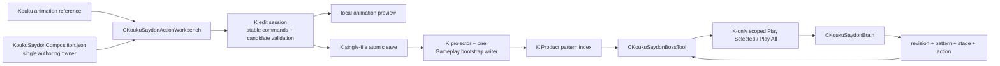

# 2026-09-05 KoukuSaydon Sequencer·Boss Tool 최소 수직 슬라이스 구현 계획서

> 문서 종류: 구현 계획서
>
> 상태: G06 전체 Animation·G07 공용 Workbench 코드 반영 / Product 빌드와 사용자 아레나 확인 대기
>
> 기준 브랜치와 commit: `codex/kouku-workbench-iteration` / `e61123d4`
>
> 상위 계획: `../09-04/2026-09-04_KAKUL_SAYDON_ENCOUNTER_BOSS_TOOL_LIGHTING_COMPANION_IMPLEMENTATION_PLAN.md`

## G04. 저작 반복 경로 단순화 — 현재 적용할 변경

사용자 요청에 따라 이전 절의 전체 oracle·publisher·Core/FullDiagnostic 종료 조건을 일상 저작의 필수 조건에서 제거한다.
이 절은 아래 P0-3 당시 설명보다 우선한다. 기준 브랜치는 `codex/kouku-workbench-iteration`이며 기존 dirty 변경을 보존한다.

- `Tools/Build/Invoke-BuildAndRegression.ps1`: 기본 Product는 Engine, Shared, Server, Client 컴파일·링크·배포만 수행한다. 전체 입력 해시와 광역 검증을 자동 실행하지 않는다. runtime 데이터 생성은 명시 publish로 유지한다.
- `KoukuSaydonCompositionDocument`: Composition 자체의 안전한 형태와 저장 충돌만 검사한다. 참고 파일의 revision·review 상태와 PRODUCT 투영 제약은 편집의 전제조건이 아니다. 손상 패턴은 오류와 원문을 보존하고 정상 패턴을 계속 편집·저장한다.
- `KoukuSaydonActionWorkbench`: 실제 `1관문` TreeNode, Resource 전체 목록, animation occurrence별 24px 행, Append/Add Animation Row, box 이동·양끝 trim·Stage 길이 drag, Animation Play Family와 Play Row를 연결한다. 행의 identity는 기존 occurrenceId다.
- `Animation_Tool`의 K preview: 기존 공용 preview actor에서 작성한 offset·trim·loop·빈 구간을 소비한다. 한 clip 오류는 그 occurrence만 건너뛰고 진단한다.
- `KoukuSaydonBossTool`: PRODUCT 목록의 개별 패턴 오류가 나머지 목록까지 지우지 않도록 읽기와 재생 가능 여부를 분리한다. Server revision·권위는 유지한다.

새 C++ 파일이나 저장용 row schema는 추가하지 않는다. 기존 project/filter 등록을 유지한다. Sound/Effect/Camera 등 아직 실행 consumer가 없는 family를 작동하는 항목처럼 표시하지 않는다.
검증은 Debug Product compile/link, JSON/XML/PowerShell 구문과 변경한 projector의 작은 계약 검사로 제한한다. Client 화면은 사용자가 `Server + Client`를 실행해 확인한다.

### 기존 Sequencer 기능을 보존하는 공용화 방향 — G05부터 단계 구현

사용자의 후속 확인으로 목표를 명확히 한다. 기존 Valtan 기능을 빠뜨린 작은 K 편집기를 완성 목표로 삼지 않는다.
`CValtanActionWorkbench::Render_SequencerWindow`, `Render_Timeline`, Composition Resources와
family별 편집·preview를 공용 UI로 옮겨 두 boss가 같은 편집 경험을 소비하도록 하는 것이 다음 변경이다.
발탄과 쿠크의 pattern/source identity, 저장 정본, Server command와 gameplay 권위는 각각 유지한다.
이 방향은 아래 과거 P0-3의 “발탄 도구를 공용화하지 않는다”는 범위 제한을 대체한다.

현재 실측한 차이는 별도 Sequencer 창, Sound/Effect/Logic/Collider/Camera owner 편집,
family transport와 playhead 조작이다. K의 현재 Animation 행·clip preview를 이 기능의 복원으로 보고하지 않는다.
공용화 시 기존 Valtan FULL_JOIN, Shake/Sound admission이 전체 목록과 편집을 막는 조건도 owner별 오류로 분리한다.
공용 화면·Animation Resources 연결은 G07에서 진행한다. Valtan 내부의 기존 전체 admission/다중 writer 이주는 별도이며 쿠크 session 진입에 재사용하지 않는다.

공용화의 구체적인 경계는 다음과 같다.

- `CSequencerTool`의 Kouku 조기 반환을 제거하고 Boss 선택을 독립 편집 session에 연결한다.
- `CValtanActionWorkbench`의 Resource 검색·트리, box 그리기·drag·trim, 행 배치, zoom/playhead를 재사용한다. 기존 편집 기능을 별도 작은 K UI로 다시 대체하지 않는다.
- 공용 화면은 selected boss와 family의 목록·선택·편집 명령만 전달한다. Valtan `Reload_Canonical`, `Save_Reload`, `FULL_JOIN`을 쿠크 진입의 전제조건으로 호출하지 않는다.
- Save는 실제 수정한 보스·패턴·family의 저장 owner에 전달한다. 원래 의도된 같은 Stage의 timing 참조는 유지하되, 관계없는 보스·패턴·family를 재검사·초기화하지 않는다.
- Resource의 공용 Physical Animation 목록은 선택 보스와 무관하게 여섯 몸체의 실제 clip을 표시한다. `Get_ActionCompositionSequenceCatalog`의 현재 두 보스 동시 load/all-or-nothing 결과를 그대로 공용 목록에 사용하지 않는다.
- Play Family는 선택 family의 실행기만 호출한다. Animation은 animation clock, Light/Profile은 해당 scene owner, Summon은 소환 명령 owner를 사용하며 한 family의 오류를 나머지 transport의 admission으로 쓰지 않는다.

현재 기존 발탄 기능의 실제 범위도 구분한다.

| Family | 기존 구현과 공용화 시 필요한 연결 |
|---|---|
| Animation | append·편집·Save·timeline transport 있음. 선택 보스의 모델/문서로 연결 |
| Effect V1/V2 | append·편집·Save·발탄 로컬 preview 있음. 보스별 binding/actor 연결 |
| Sound | append·편집·Save 있음. Workbench local timeline 재생은 추가 연결 필요 |
| Camera / Scene Profile / Light | 참조 표시·owner tool 연결 중심. 일반 row 추가·Save·family transport는 아직 없음 |
| Summon / Combat Object | 기존 발탄 일부 종류의 표시·수정·preview만 있음. 임의 summon row와 실행 연결은 아직 없음 |

기존 발탄에 모든 family의 `Play Family`가 이미 있다고 가정하지 않는다. row UI는 공유하되 실제 저장·실행 consumer가
있는 family부터 연결하며, profile/light/summon의 미구현 부분을 검증 체계나 placeholder로 대신하지 않는다.
일상 확인은 수정한 코드의 필요한 compile/link와 사용자가 대상 아레나에서 append → Save → reload/play를 확인하는 흐름이다.
광역 회귀의 미실행은 구현 완료 보고나 커밋을 막는 조건이 아니다.

---

이 문서는 상위 계획의 P0-3/G02 중 **지금 바로 구현할 최소 범위**만 고정한다. Sound, Effect V2, Light,
Camera, Screen/Post, Collider, Summon, Logic/Counter/Branch 편집은 이 슬라이스를 막지 않으며 뒤로 분리한다.

---

## G07. 하나의 Action Workbench와 보스별 독립 세션

사용자의 최종 지시로 별도 Valtan/Kouku Workbench 창을 최종 UI로 유지하지 않는다. CSequencerTool를
실제 공용 Workbench shell로 바꾸고 Boss selector가 내부 Valtan/Kouku edit session을 선택한다.
기존 read-only Composition descriptor/catalog 조회와 쿠크 early-return은 편집 진입에서 제거한다.

`ICompositionWorkbenchSession`의 Begin → pane rendering → End 계약에서 공용 shell은 기존 발탄의
Sequencer/Patterns/Resources/Box Detail/Preview/Boss Pattern 창 ID·배치·visibility를 소유한다.
각 session은 문서·draft·선택·저장 owner를 유지한다. Save/reload/선택 교체는 pane의 이전 포인터 사용이
끝난 뒤 처리한다. 보스를 바꾸는 것만으로 다른 session의 draft를 reload/reset하지 않는다.

CompositionTimeline의 ruler/box drawing/trim hit test와 CompositionResourceTree를 두 session이 실제로
공유한다. 발탄의 기존 family owner/editor는 보존하고, 이번에 확정한 쿠크 Animation 동작을 같은 창 구조에서 제공한다.
MainApp의 기존 V/K/Sequencer entry는 하나의 Action Workbench entry로 연결하고, hidden session의 Save/Publish
진행 poll은 유지한다. Animation Tool은 preview backend로 준비하며 명시적으로 열 때만 별도 창을 보인다.

### G07 파일과 소비 경계

- `Client/Public/CompositionWorkbenchSession.h`: pane enum, 창 열기 요청, 선택 session의 raw Animation Append 계약을 정의한다. 문서나 publisher를 소유하지 않는다.
- `Client/Public/CompositionAnimationResource.h`: body/model/package/clip identity, 원본 duration ticks·런타임 cooked clock과 ms 길이를 전달한다. 포인터나 vector index를 저장 ID로 사용하지 않는다.
- `Client/Public/CompositionTimeline.h`: 두 session의 ruler·box·양끝 trim hit test를 같은 함수로 그린다. 입력 commit과 저장 owner는 session에 남는다.
- `Client/Private/SequencerTool.cpp`: 공용 창과 Boss selector, 공용 Physical Animation 검색·선택·preview·Append 버튼을 소유한다. 기존 boss action 참고 목록과 family editor는 Resources pane 아래에서 선택 session에 위임한다.
- `Client/Private/MainApp.cpp`: 표시 없는 preview backend 준비, 공용 inventory 갱신과 preview/transport 요청을 기존 Animation Tool로 전달한다. K 진입 시 Balance 정본을 읽지 않도록 지연 생성한다.
- `Client/Private/ValtanActionWorkbench.cpp`, `ValtanActionWorkbench_Blueprint.cpp`: 기존 창 내용을 pane으로 분리하고 Save/선택/Append는 프레임 pointer 사용이 끝난 뒤 적용한다. raw Append는 선택 Pattern을 복사해 로컬 편집 조건을 확인하고 한 번 교체한다.
- `Client/Private/BalanceTool.cpp`: raw clip을 기존 Stage에 붙이거나 새 Stage와 함께 원자적으로 삽입한다. 모델 preview 상태, 다른 family admission을 raw Append 선행조건으로 쓰지 않는다. 기존 Save writer는 보존하고 자동 Server publish의 기본값은 끈다.
- `Client/Private/KoukuSaydonActionWorkbench.cpp`: 공용 pane/Append adapter가 기존 candidate commit과 단일 파일 CAS Save를 호출한다. pattern이 없거나 오류여도 raw preview transport를 표시한다.

공용 헤더 세 개는 `Client.vcxproj`와 `.filters`의 기존 `03.Tools\05.Sequencer`에 한 번씩 등록한다.
Engine의 `CWModelDecoder::Read_AnimationCatalog`는 기존 decoder 파일에 추가하므로 새 Engine project 항목은 없다.
Engine public header 변경이 있으므로 다음 Product 빌드는 Engine SDK 반영과 Client link를 포함해야 한다.
빌드를 이 작업에서 자동 실행하지 않고, 파일·연결 확인 결과를 보고한 뒤 사용자가 실행할 시점을 안내한다.

## G06. 발탄·쿠크 전체 Animation Resources와 모델별 preview

사용자는 전체 family 중 먼저 발탄·쿠크 Animation 전체 연결을 선택했다. 기존 Action 참고 트리뿐 아니라
실제 재생 대상 Valtan 본체/ghost, MN_RPCT_00/05/06, MN_RPCZ_00의 모든 native clip을 모델별로 표시한다.
RPCT_07은05의Action profile alias이므로물리모델을중복등록하지않고기존참고트리에서유지한다.

- Engine의 기존 WModel decoder에 이름·native timing만 읽는 metadata API를 추가한다. mesh/keyframe decode,
  모델 생성, 광역 검증과 파일 hash는 Resource 목록의 전제조건이 아니다.
- `CompositionAnimationResource.h`는 실제 목록과 preview 요청이 소비하는 값 타입이다. Client project/filter의
  기존 Sequencer 위치에 단일 등록한다. 기존 공용 Resource tree를 모델별 목록에도 사용한다.
- 모델별 donor AnimSet을 합쳐 실제 runtime clip 목록을 표시한다. 같은 이름이라도 target model이 다르면
  다른 Resource로 보존한다. 하나의 파일 실패는 해당 source의 상태로 보고하고 정상 source와 이전 목록을 유지한다.
- Valtan 참고 Sequence는 기존 읽기 전용 목록 API를 개별 호출해 네 분류(Valtan/Kouku/Large Kouku/Saydon)를
  제공한다. Valtan PatternTree·Balance draft admission을 쿠크 목록의 선행조건으로 호출하지 않는다.
- preview는 명시한 target asset과 값 snapshot을 기존 CharacterPreviewPanel/CModel 경로에 전달한다.
  양쪽 raid arena에서 등록된 여섯 body를 플레이어 주변에 배치한다. 다른 body의 clip을 현재 boss body로 재해석하지 않는다.
- 쿠크 Gate1 Composition의 Animation append 대상은 현재 body인 MN_RPCZ_00으로 유지한다. 다른 모델의
  애니메이션을 같은 body에 붙이는 것과 전체 모델을 browse/preview하는 것은 별개의 기능이다.
- 새 Engine public header는 Product의 UpdateLib 경로로 배포한다. 사용자의 빌드 가능 시점 보고 요청을 유지하여
  이번 연결 중 C++ 빌드·Client 실행은 자동으로 시작하지 않는다. 최소 구조/메타데이터 확인 후 빌드 준비 상태를 보고한다.

## G05. 공용 편집기 1단계 — 쿠크 Animation 편집 순환 완결과 첫 공용 부품

사용자 결정: 보스별 Action 데이터·편집 세션·저장·Server 명령은 분리하고 Sequencer·Resources·Pattern 목록·
Box Detail·transport는 공용 UI로 가져온다. Valtan 객체 전체를 재사용하지 않고 UI 부품을 추출한다.
첫 단계는 쿠크의 `Preview -> Append -> drag/trim -> Box Detail -> Save -> Reload -> 같은 시간대 재생` 순환을
완결하고, Resources 트리를 첫 공용 부품으로 뽑는 것이다.

### G05 검토 반영 상태

Resource tree 공용화는 실제 Valtan과 쿠크 호출까지 연결했다. 후속 검토에서 stable tree ID, cursor 포함 첫 preview
요청, Pattern별 playhead 구분, 역방향 gap seek, 끝점 transport, native 끝 이후 HOLD tail trim을 보완했다.
기존 47개 focused 검사와 project/filter XML·diff 확인을 통과했으며, 이번 수정 뒤 C++ 빌드는 사용자 요청에 따라
실행하지 않았다. 정확한 구현·미검증·후속 범위는 대응 RESULT 7절을 따른다.

공용 Animation Tool의 unsaved 문서 보호/PreviewPanel target lock은 남는다. 후속 분리는 이 lock을 단순 삭제하지
않고 보스별 문서 세션 보존과 preview target 전환을 분리한다. 전체 Sequencer·Box Detail·family rows 공용화는
Resource tree 추출 완료와 구분한다.

### 실측한 Valtan 병목

- draft를 `CBalanceTool`이 소유하고 Workbench는 canonical/authoring revision pin만 가진다. 하나라도 어긋나면
  STALE_PRESERVED 읽기 전용이다. (`CValtanActionWorkbench::Render`)
- 편집 허용이 canonical strict join, effective pattern, Save job·publish 부재를 한 값으로 묶는다. pattern 하나가
  quarantine되면 tree 전체가 REJECTED이고, source만 바뀌면 REPROJECTION_REQUIRED browse-only다. (`Reload_Canonical`)
- Stage drag/trim/gap 하나가 Animation Tool의 stage mutation 검증과 Pattern Sound dependency 검증을 모두 지나야
  draft가 바뀐다. (`SetValtanStageDraftWithSoundDependencyAdmission`)
- Append가 Animation Tool의 실제 모델 native duration과 마지막 slot loop 규칙을 요구하고 Replace는 HOLD fit까지
  요구한다. (`Apply_SelectedSequenceToStage`)
- Save가 dirty Pattern·Sound·Effect V2 owner의 비동기 job이며 receipt, exact reopen, 선택적 publish가 한 흐름이다.
  (`Update_SaveState`)

쿠크는 Workbench가 draft를 소유하고 명령마다 candidate 복사 → validate → commit, 단일 파일 CAS 저장, 별도 Publish,
Server revision은 Server Play 승인과 `[Live]`에만 쓴다. 이 구조를 유지한다.

### 변경 파일

| 파일 | 변경 |
|---|---|
| `Client/Public/CompositionResourceTree.h`, `Client/Private/CompositionResourceTree.cpp` (신규) | Valtan 익명 namespace의 tree 빌더·정렬·렌더러를 encounter 중립 공용 부품으로 이동. `03. Tools\05. Sequencer` filter에 등록 |
| `ValtanActionWorkbench.h/.cpp` | struct와 helper 정의 삭제, 공용 include. 호출부와 동작 변경 없음 |
| `KoukuSaydonAnimationActionDocument.h/.cpp` | `Resolve_ActionCategory` 단일 소유. `Animation_Tool`의 해석기는 위임 |
| `KoukuSaydonActionWorkbench.h/.cpp` | Resources: Category/Profile 트리에 네 profile 전부 browse·preview, Selected Action 패널(Preview Action, Append Action as Stages, Append Action to Selected Stage), Selected Clip 패널, Physical Clips 섹션, 대소문자 무시 검색. Box Detail: native clip 길이, play rate, end policy, Apply Playback. Timeline: Pause/Resume/Stop, ruler cursor·seek·scrub, playhead. drag/trim/append/bind에서 EXACT가 native를 넘으면 HOLD_LAST_POSE로 전환하고 상태에 남긴다 |
| `Animation_Tool.h/.cpp` | `KOUKU_COMPOSITION_PREVIEW_STATE`와 pause/seek/stop API. preview는 EXACT 초과 row를 건너뛰지 않고 마지막 pose를 hold |
| `MainApp.cpp` | transport 요청 라우팅과 preview state 반환. Workbench는 모델을 들지 않는다 |
| `Tools/KoukuSaydonPipeline/test_kouku_saydon_client_product_level_contract.py` | G05 구조 계약 |

### 호출 흐름

```text
Resources 클릭
  -> Queue_SlotPreview / Queue_ActionPreview (value copy)
  -> MainApp Consume_*PreviewRequest -> Animation Tool Preview_KoukuSaydonComposition*
  -> Start_PendingKoukuSaydonCompositionPreview -> row startOffset 기준 시간대 재생
Append / Bind / Trim / drag
  -> Is_AppendAdmitted -> candidate -> Normalize_EndPolicyForWindow -> Commit_Candidate(validate) -> dirty
Save -> Save_Atomic(CAS, temp verify, replace) -> LastGood reopen
ruler press/drag -> SEEK 또는 cursor -> Consume_PreviewTransportRequest -> MainApp
  -> Seek/Pause/Stop_KoukuCompositionPreview -> Get_KoukuCompositionPreviewState -> Set_PreviewState -> playhead
```

### 이번 G의 범위 밖

- Valtan `Render_Timeline` lane/drag widget 추출과 Valtan Resources의 공용 부품 채택
- Stage family rows(Effect/Sound/Camera/Profile/Light/Summon) formatVersion 2와 실제 재생·정리 consumer
- 오류 row가 있는 pattern만 이전 Product를 유지하는 projector 보류 규칙
- Valtan Save owner 축소

### 검증

Debug Product build, KoukuSaydon/Valtan pipeline 계약 테스트, `git diff --check`. 화면 판정은 사용자가
`Server + Client`를 실행해 확인한다.

## 0. 이번 구현의 본질

이번 P0-3은 다음 다섯 결과만 먼저 만든다.

1. KoukuSaydon 전용 Workbench에서 animation resource를 선택해 실제로 preview한다.
2. 이름 있는 Kouku Pattern을 생성하고 Stage/animation box를 timeline에서 편집·저장·재로드한다.
3. KoukuSaydon 전용 Boss Tool에 published Pattern 전체 목록을 표시한다.
4. `Play Selected`와 `Play All Patterns`가 실제 Server K runtime을 실행한다.
5. 현재 Server가 재생하는 Pattern/Stage를 K Boss Tool 목록에 `[Live]`로 표시한다.

공용 편집 UI는 기존 Valtan 도구의 기능을 재사용한다. 쿠크 문서·저장·재생 session은 Valtan PatternTree,
strict join, Sound/Effect/Flow admission을 요구하지 않는다. Kouku Boss Tool은 K Product pattern index만 읽는다.

---

## 1. 범위 안과 범위 밖

### 1.1 이번에 구현한다

| 영역 | 최소 기능 |
|---|---|
| Data | `KAKULSAYDON_G1_PIZZA`의 실제 Pattern/Stage/animation binding |
| Resources | Kouku animation profile/action/stage/clip 탐색과 single-click preview |
| Pattern | create, select, display name, delete, save, reload |
| Stage | add, select, reorder, duration 변경 |
| Animation box | bind, move, trim, duplicate, delete, Stage 간 이동 |
| Timeline | 24px lane, Stage + Animation 두 family, zoom/fit/maximize, master playhead |
| Local playback | 선택 animation과 선택 Pattern 전체 preview |
| Boss Tool | 전체 Product Pattern 목록, `Play Selected`, `Play All` |
| Live | Server gameplay revision + K source revision + pattern/stage/action exact ID를 표시 |
| Isolation | K source/draft/writer/request/Server state를 Valtan과 분리 |

### 1.2 후속 슬라이스로 미룬다

- Sound cue box와 재생/저장
- Effect V1/V2 group/leaf box와 재생/저장
- Camera/World Sequence box
- Light, Scene Profile multiplier, Screen/Post box
- Collider, Summon, judgement box
- Logic Flow 편집, Counter window, 조건 Branch 편집
- HP 기믹, safe sector, damage geometry와 밸런스
- Server runtime hot-apply
- encounter별 GameplayCatalog admission
- standalone 공용 Sequencer/graph framework 추출

후속 항목의 lane을 빈 placeholder로 미리 만들지 않는다. Stage/Animation 최소 슬라이스가 저장·재로드·Server 재생까지
통과한 뒤 실제 consumer를 한 family씩 추가한다.

---

## 2. 현재 구조에서 피할 회귀 지점

### 2.1 발탄 Boss Tool aggregate

`CValtanBossTool::Reload_Graph()`는 PatternTree, audition inventory, Next 목록, Flow, Encounter, Camera를 한 번에
stage한다. 하나가 실패하면 전체 command admission이 닫힌다. K Boss Tool은 이 경로를 복제하지 않고 generated K
Product의 Pattern/Stage index만 읽는다.

### 2.2 발탄 Workbench의 다중 owner 결합

`CValtanActionWorkbench` 한 객체가 gameplay, animation, Sound, Effect V2, shake, combat-object sound, preview,
save job을 모두 가진다. 이번 K Workbench는 Gameplay + Animation presentation 두 owner만 다룬다. Sound/Effect를
미리 Save participant로 넣지 않는다.

### 2.3 기존 K animation Pattern의 의미

현재 `CAnimation_Tool`이 가진 `*.patternbindings.json`은 `REFERENCE_ONLY` animation audition recipe다.
`kakulsaydon.<profile>.pattern.N`을 Server Product Pattern ID로 사용하지 않는다. Workbench는 resource reference를
읽어 `KAKULSAYDON_G1_PIZZA`의 Stage/animation occurrence로 명시적으로 bind한다.

K Pattern의 mutable UI owner는 Workbench 하나만 둔다. Animation Tool은 raw action/clip 찾기와 preview만 담당한다.

### 2.4 저장 시 지킬 최소 gotcha

- selection과 box identity는 vector index/pointer가 아니라 stable ID다.
- total duration 변경으로 숨은 WAIT Stage를 생성하지 않는다.
- Save edge에서 Gameplay와 Presentation의 baseline/candidate bytes를 고정한다.
- `parse -> validate -> stage -> CAS -> atomic replace -> reopen` 순서를 지킨다.
- commit 실패는 단일 source의 이전 bytes를 보존한다.
- commit 성공 후 reopen 실패는 이미 저장한 source를 다시 쓰거나 되돌리지 않는다.
- writer transaction을 UI timeout으로 강제 종료하지 않는다.
- 저장 성공, Product publish, Server 재생 성공을 한 상태로 뭉치지 않는다.

---

## 3. 최소 소유 구조



### 3.1 Workbench 소유

`CKoukuSaydonActionWorkbench`은 다음만 소유한다.

- K composition immutable baseline
- 한 open Pattern의 edit candidate
- Pattern/Stage/animation occurrence selection
- dirty owner와 candidate generation
- timeline cache와 local animation preview
- K 전용 Save job/receipt

### 3.2 Boss Tool 소유

`CKoukuSaydonBossTool`은 다음만 소유한다.

- generated K Product pattern index와 revision
- selected Pattern ID
- Play Selected/Play All request sequence와 lifecycle
- Server-replicated live Pattern/Stage/action

Workbench draft, dirty flag, preview handle, writer lock을 Boss Tool과 공유하지 않는다. `Edit Selected`가 필요하면
stable `patternId`만 MainApp route로 전달하고 Workbench가 자신의 snapshot에서 다시 찾는다.

### 3.3 Valtan과 허용하는 공유

이번 slice에서는 새 generic framework를 만들지 않는다. 이미 encounter-neutral인 stable ID helper, JSON parser,
network primitive, fixed-tick primitive를 사용할 수 있지만 Valtan class/type 이름을 K public header에 노출하지 않는다.

---

## 4. 최소 데이터 정본

직접 저작 파일은 하나다.

```text
Data/KoukuSaydon/Gate1/KoukuSaydonComposition.json
```

`lostark.kouku-saydon-composition` v1 root는 exact encounter/boss/placement/area, source revision,
`playAllPatternIds`, Pattern과 Stage, Stage 안의 animation occurrence만 소유한다. Pattern은
`DRAFT | PRODUCT`를 명시하며 projector는 `PRODUCT`만 Server/Client Product로 투영한다. 1관문 저작 시작점을
고정하기 위해 방패 무력화/진짜 쿠크세이튼 찾기/댄스타임/카드 맞추기는 빈 `DRAFT`, 피자(룰렛)는 검증된
6-Stage `PRODUCT` seed로 둔다. 빈 DRAFT는 Workbench에는 보이지만 Product/Boss Tool/Server에는 투영하지 않는다.

각 animation occurrence는 다음만 가진다.

```text
occurrenceId
profileId
sourceActionId
sourceStageId
sourceSlotId
referenceRevision
runtimeClip
startOffsetMs
sourceStartMs
playMs
playRate
endPolicy
```

`startOffsetMs`는 Stage 안 box의 배치이고 `sourceStartMs`는 원본 clip trim 시작이다. 둘을 한 값으로
겸용하지 않는다. Stage/occurrence와 immutable animation reference tuple이 정확히 join되어야 한다.
Effect/Sound/Camera/Light 배열을 빈 필드로 미리 넣지 않는다.

### 4.3 후속 family 확장 계약

v1의 `Pattern -> ordered Stage -> animationOccurrences` 골격과 stable ID는 유지한다. 후속 family는 실제
저장·재생 consumer가 완성되는 수직 슬라이스에서만 formatVersion을 올리고 Stage에 국소 추가한다.

| 후속 연출 | Rendering/Resource owner | Composition occurrence가 참조할 값 | 종료/실패 계약 |
|---|---|---|---|
| 쿠크 이동 | Server movement profile | occurrenceId, movementProfileId, startOffsetMs, durationMs | Server pose가 정답, 중단 시 현재 authority pose 유지 |
| 총 장착/해제 | Equipment/attachment catalog | occurrenceId, attachmentSetId, socketId, startOffsetMs | pattern 종료·despawn 시 base attachment 복구 |
| 탄환/투사체 | projectile/combat-object catalog | occurrenceId, projectileArchetypeId, spawnOffsetMs | Server spawn/despawn authority |
| 기본 관문 분위기 | Rendering Workbench SceneProfile | gate base profileId | Level 진입/퇴장 transaction으로 적용·복구 |
| 패턴 암전 | Rendering Workbench profile preset | occurrenceId, profileMultiplierId, blendInMs, holdMs, blendOutMs | complete/abort/death/world reset 모두 base profile 복구 |
| 맵 조명 연출 | Rendering Workbench MapLightGroup | occurrenceId, lightGroupId, targetWeight, blendMs | 같은 group의 base weight로 복구 |

Rendering Workbench는 directional/ambient/exposure/fog와 point/spot light의 색상·세기·Transform 및
MapLightGroup 원본을 소유한다. Composition은 그 값을 복제하지 않고 stable profile/light-group ID와 시간만
참조한다. 따라서 `Play Selected`/`Play All`의 한 Server Stage cursor로 Animation과 추가 family를 함께 검토하되,
조명 튜닝값의 저장 위치는 Rendering owner 하나로 유지한다. 소비자 없는 family가 `PRODUCT`에 들어오면
projector/Server admission이 거부해야 하며 unknown enum이나 silent fallback으로 정상 재생하지 않는다.

### 4.4 Pizza seed

`MN_RPCZ_00`, source action `4219714`의 확인된 여섯 Stage만 사용한다.

```text
WINDUP_A        3_01 2500ms
SECTOR_SWEEP_A  3_07 4667ms
RECOVERY_A      3_09 1000ms
WINDUP_B        3_01 2500ms
SECTOR_SWEEP_B  3_07 4667ms
RECOVERY_B      3_09 1000ms
```

이 단계에서는 sector 각도/반경/safe wedge/damage를 만들지 않는다. Server는 동일한 Stage clock과 animation action
identity를 진행하고 Client가 snapshot으로 animation을 표현한다. 실제 피해 판정은 후속 combat slice다.

### 4.5 Product blockers를 다루는 원칙

`MN_RPCZ_00`에는 입증된 별도 weapon WModel이 없다. 가짜 weapon asset을 넣거나 Valtan asset loader를 재사용하지 않는다.
K presentation의 최소 actor admission에서 optional weapon/embedded animation을 명시적으로 지원하되 Valtan의 body+weapon
계약은 건드리지 않는다.

첫 실행형 tuning anchor는 nav-valid인 `[22, -0.05, -62] / yaw 0`을 `PROJECT_TUNED` 기준으로 사용한다.
원본 raid의 최종 boss transform이라고 주장하지 않으며 이후 Map/Encounter 튜닝에서 별도 검증한다.

---

## 5. Sequencer 실제 동작

### 5.1 stable selection

```text
patternId
stageId
laneKind = STAGE | ANIMATION
occurrenceId
workspaceGeneration
```

reload, insert, delete, reorder 뒤 위 ID로 다시 resolve한다. 사라졌으면 선택만 해제하고 옆 vector row를 대신 선택하지 않는다.

### 5.2 명령

```text
CreatePattern
DeletePattern
RenamePatternDisplayName
AddStage
DeleteStage
MoveStage
SetStageDuration
BindAnimation
ReplaceAnimation
MoveAnimation
ResizeAnimation
DuplicateAnimation
DeleteAnimation
MoveAnimationToStage
```

UI는 source vector를 직접 수정하지 않는다. 각 명령이 candidate copy를 만들고 validate한 뒤 edit session에 commit한다.

### 5.3 box 규칙

- Stage box: 순서는 `MoveStage`, 길이는 `SetStageDuration`으로만 변경한다.
- Animation box body drag: Stage-local `startOffsetMs`만 변경한다.
- left/right trim: physical clip source range와 Stage duration 안에서만 허용한다.
- duplicate: 새 monotonic occurrence ID를 발급한다.
- delete: stable occurrence ID로 삭제한다.
- Stage 간 이동: 새 Stage 범위 안에 완전히 들어갈 때만 허용한다.
- Pattern total duration은 ordered Stage duration 합으로 계산한다.
- 숨은 Stage, 자동 WAIT, index 기반 ID 재사용은 금지한다.

### 5.4 화면

```text
Toolbar: Load | Validate | Save | published/server revision
Left:    Patterns / Animation Resources
Center:  Preview / 24px Stage + Animation Timeline
Right:   Pattern, Stage, Animation Details
```

- lane 높이 24px, padding 2px
- 장문 3줄 설명 없음
- Fit, horizontal zoom, Timeline Maximize
- resource single-click은 즉시 preview하지만 dirty/save를 만들지 않음
- `Bind`, `Replace`, drag/drop만 문서를 바꿈
- 선택 animation과 선택 Pattern 전체를 Animation Tool에서 local preview

---

## 6. 저장과 publish

### 6.1 버튼 의미

| 명령 | 완료 의미 |
|---|---|
| `Validate` | 현재 composition candidate와 animation reference join이 유효 |
| `Save` | 단일 source가 durable commit되고 exact revision으로 reopen됨 |
| `Publish` | K Product와 `Gameplay.bootstrap`이 생성·검증·commit됨 |
| Server Play | 실행 중 Server가 이미 load한 exact Product revision을 재생 |

runtime hot-apply는 이번 slice에 넣지 않는다. Publish 뒤 새 Product를 사용하려면 Server를 다시 시작한다. 이를 UI에
`Server restart required`로 정확히 표시한다. hot-apply는 revision stage/tick commit/rollback/snapshot closure를 별도
구현할 때만 추가한다.

### 6.2 Save transaction

```text
freeze one composition baseline + candidate bytes
-> parse candidate
-> validate exact schema + animation reference join
-> acquire K-only writer lock
-> baseline CAS
-> durable sibling temp
-> staged bytes reparse
-> atomic replace the one source file
-> post-commit verify
-> exact committed revision reopen
```

실패하면 원본과 현재 edit candidate를 보존한다. commit 성공 후 reopen 실패는
`COMMIT_SUCCEEDED_REOPEN_FAILED`로 표시하고 source를 다시 쓰지 않는 `Retry Reopen`만 제공한다.

---

## 7. KoukuSaydon Boss Tool

### 7.1 Product-only pattern index

K Boss Tool reader는 generated Encounter/bootstrap의 다음 값만 stage한다.

```text
sourceRevision
patternId / displayName
ordered stageId / actionId / duration
ordered Play All list
```

authoring Sound/Effect/Camera/Light 문서를 읽지 않는다. 따라서 후속 family 작업 중 오류가 생겨도 이미 load된 Product
Pattern 목록은 사라지지 않는다.

### 7.2 기본 UI

```text
revision/status 한 줄
전체 PRODUCT Patterns
선택 Pattern Stage 요약
Play Selected | Play All
Server lifecycle/result
```

Pattern row는 선택 상태와 Server-confirmed `[Live]`만 표시한다. Restart/Stop/queue 편집은 후속 lifecycle slice다.

### 7.3 Server command scope

모든 K request/result는 다음 exact tuple을 가진다.

```text
worldId
encounterId
bossPlacementId
bossArchetypeId
gameplayRevision
expectedSourceRevision
patternId 또는 playAll operation
requestSequence
```

K request에 Valtan ID/revision이 섞이면 Client와 Server가 모두 거부한다. Valtan audition state, queue, repeat,
predecessor CAS를 K가 읽거나 수정하지 않는다.

### 7.4 `[Live]`

K 전용 result/lifecycle message는 다음 값을 exact scope로 왕복한다.

```text
worldId
encounterId
bossPlacementId
gameplayRevision
pinnedSourceRevision
patternSequence
patternId
stageId
actionId
```

Boss Tool은 전체 scope, gameplay revision, K source revision이 모두 일치할 때만 `[Live]`를 표시한다. 마지막 클릭,
local preview, Client clock으로 추측하지 않는다. Workbench는 authoring 상태를 소유하며 `[Live]` 판정은 Boss Tool에 둔다.

### 7.5 Play Selected와 Play All

- `Play Selected`: 선택 Pattern 하나를 첫 Stage부터 실행한다.
- `Play All Patterns`: published ordered list를 Server가 pin하고 첫 Pattern부터 순서대로 실행한다.

Play All은 Client가 Pattern마다 packet을 보내는 loop가 아니다. Server가 한 operation과 한 pinned revision으로 순서를
소유한다.

---

## 8. 구현 순서

### P0-3A — single composition source와 Pizza

**반영**

- `KoukuSaydonComposition.json` exact schema와 Pizza 실제 row
- Pizza action 4219714 여섯 Stage exact animation join
- Python validator/projector candidate
- invalid version/ID/stage/reference/clock rollback fixture

**검증**

- Pizza source roundtrip
- unverified damage/effect/sound/light field 0건
- Valtan source bytes 변화 0건

### P0-3B — K edit session과 Sequencer core

**반영**

- K document reader/writer
- Workbench 내부 stable command/selection과 candidate-copy validation
- Stage + Animation timeline model
- single-file CAS atomic Save/reopen
- Python source/product contract와 Client compile 검증

**검증**

- create/delete/add/move/resize/duplicate source contract
- stale CAS와 중간 실패 rollback
- hidden WAIT/index ID 0건

### P0-3C — K Workbench UI와 animation preview

**반영**

- 별도 `CKoukuSaydonActionWorkbench`
- MainApp 별도 debug entry/unique_ptr/input owner
- Pattern/Resource/Preview/Timeline/Details 연결
- raw animation single-click preview와 Pattern local Play
- Animation Tool의 K mutable Pattern UI 제거 또는 read-only deep-link 전환

**검증**

- K/Valtan window와 draft 독립
- click 전후 source/draft generation 동일
- Save/reload 후 동일 box
- 사용자가 직접 preview와 24px 조작 확인

### P0-3D — Product와 K-only Server playback

**반영**

- K Product projection을 기존 한 Gameplay bootstrap writer의 final merge에 추가
- K-only Boss Product reader와 Boss Tool
- `CKoukuSaydonBrain` 최소 Stage clock
- scoped Play Selected/Play All/result/lifecycle와 K source revision pin
- Valtan exact oracle을 Valtan encounter tuple에만 한정

**검증**

- K/V scope 교차 요청 양방향 거부
- Play Selected/Play All lifecycle
- `[Live]` Pattern/Stage/action exact match
- Pizza가 Server fixed tick으로 Stage를 진행
- 변경한 K 명령의 대상 보스·패턴과 실행 결과 확인
- 필요한 Debug Product compile/link와 사용자 아레나 확인

### P0-3E — encounter별 admission

P0-3D 뒤 별도 commit으로 수행한다. invalid K encounter가 Valtan admission을 막지 않게 하되 global bootstrap
header/common table 오류는 계속 전체 fail-close한다.

---

## 9. 실제 파일 경계

실제 소비자가 생기는 slice에서만 파일을 추가한다.

```text
Data/KoukuSaydon/Gate1/KoukuSaydonComposition.json

Client/Public/KoukuSaydonCompositionDocument.h
Client/Private/KoukuSaydonCompositionDocument.cpp
Client/Public/KoukuSaydonActionWorkbench.h
Client/Private/KoukuSaydonActionWorkbench.cpp
Client/Public/KoukuSaydonBossTool.h
Client/Private/KoukuSaydonBossTool.cpp
Client/Public/KoukuSaydonPatternAuditionService.h
Client/Private/KoukuSaydonPatternAuditionService.cpp
Client/Public/KoukuSaydonPresentationAssetService.h
Client/Private/KoukuSaydonPresentationAssetService.cpp

Server/Public/KoukuSaydonBrain.h
Server/Private/KoukuSaydonBrain.cpp

Tools/KoukuSaydonPipeline/project_kouku_saydon_composition.py
Tools/KoukuSaydonPipeline/test_project_kouku_saydon_composition.py
Tools/KoukuSaydonPipeline/test_kouku_saydon_runtime_inputs.py
Tools/KoukuSaydonPipeline/test_kouku_saydon_client_product_level_contract.py

Data/Encounters/KoukuSaydon/KoukuSaydonEncounter.json                 # generated Product
Data/Animation/Authored/KoukuSaydon/KoukuSaydon.patternbindings.json # generated Product
```

새 C++ 파일은 실제 제품 소비자에 필요한 `.vcxproj`와 `.vcxproj.filters` 등록만 같은 변경 단위에 포함한다.
generated Product와 Server runtime bootstrap은 해당 데이터 배포 경로로 갱신한다.

---

## 10. 완료 조건

- 공용 Workbench에서 쿠크를 선택해도 Valtan source/PatternTree를 로드하지 않는다.
- animation resource single-click preview가 되고 문서를 변경하지 않는다.
- named Pattern을 만들고 Stage/animation box를 이동·trim·duplicate·delete할 수 있다.
- Save/reload 뒤 동일 stable ID와 box timing이 유지된다.
- Boss Tool에 published K Pattern 전체 목록이 나온다.
- `Play Selected`가 선택 Pattern 하나를 Server에서 실행한다.
- `Play All Patterns`가 Server-owned ordered operation으로 전체 목록을 실행한다.
- 현재 Pattern/Stage/action이 exact Server lifecycle과 pinned source revision 기반 `[Live]`로 표시된다.
- K request/save가 Valtan source, graph, selection, queue, runtime을 바꾸지 않는다.
- 필요한 compile/link가 성공하고, 사용자가 Client에서 변경한 preview/play/live를 직접 판정한다.

이 최소 조건이 끝난 뒤 Sound → Effect → Camera/Light → Collider/Summon → Logic/Counter/Branch 순서로 family를
한 개씩 추가한다. 앞 family가 깨져도 핵심 Pattern 목록과 Server 재생이 사라지지 않는 구조를 계속 유지한다.


## G08. Lobby 쿠크 입장과 Raid Entry 동영상 시간 연결

Lobby ImGui의 KoukuSaydon 버튼은 기존 CLobbyCommandService와 Server 승인 입장 흐름을 재사용한다.
LOBBY_STAGE에 KOUKU_SAYDON을 추가하고 Level_Lobby의 Resolve_Stage에서 기존 K world/level로 연결한다.
CharacterSelectionState는 쿠크 입장에도 발탄과 같은 선택 class/created 또는 audition nickname 규칙을 쓴다.
Character Select의 Enter KoukuSaydon Arena 버튼과 typed world transfer는 이미 존재하므로 그대로 유지한다.

RaidEntryPreviewView의 portrait 동영상은 현재 300장/30fps DDS flipbook이다. Render에서 사용하는
Timer_Default는 Client.cpp의 idle loop마다 갱신되므로 프레임 진행 시간으로 사용할 수 없다.
실제 MainApp Update에 전달되는 Timer_60으로 movie와 tab easing을 진행시킨다. 이미 정상적으로
같은 delta를 쓰는 실제 아레나 simulation/presentation은 근거 없이 시간 배율을 바꾸지 않는다.

새 C++ 파일·project/filter·데이터 포맷·Server protocol 변경은 없다. 변경 Client 컴파일과 가능 시
링크를 확인하며 실행 중 Client는 사용자가 종료한다. Lobby/Character Select 입장과 동영상 실제
속도·끊김은 사용자 수동 확인으로 구분한다. Core/FullDiagnostic은 실행하지 않는다.
