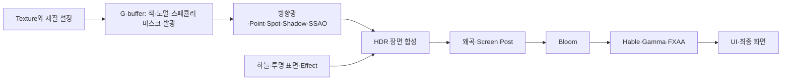

# Rendering Material Pipeline 전수 조사 결과와 튜닝 방향

작성일: 2026-09-07

대상: Character Select, KoukuSaydon을 포함한 현재 저장소의 맵·캐릭터·Deploy·Effect 렌더링.
조사 기준: `codex/kouku-gate-pattern-bundles`, HEAD `13fa34d7df9f37d1c697ddefe1e5e7aebfdafef9`와 당시 미커밋 working copy.
대응 계획: [조사 PLAN](/C:/Users/user/Desktop/LostArk/.md/GB/09-07/2026-09-07_RENDERING_MATERIAL_PIPELINE_AUDIT_PLAN.md).

최신 상태 안내(2026-09-08): G00~G11은 최초 조사 시점의 기록이다. 이후 쿠크 두 바닥의 선택적
원본 재질 계산과 Specular RGB 전달을 구현했으며, 실제 범위는
[바닥 복구 RESULT](2026-09-07_FLOOR_MATERIAL_RECOVERY_RESULT.md)를 따른다.
Character Select의 최초 원본 PNG 분석은 G12, 이후 사용자가 첨부한 모작·줌 비교와
실제 배치별 PBR 재질 누락 확인은 G13을 따른다. G13이 이번 후속 조사의 최신 결론이다.

## G00. 결론과 이번에 확인한 범위

**현재 차이는 색상 튜닝만으로 해결할 수 있는 상태가 아니다. 텍스처 파일은 대부분 잘 연결되어 있지만, 원본 재질의 의미와 계산·환경 조명 입력이 공통 셰이더로 단순화된 부분이 실제로 있다. 동시에 최종 톤 매핑과 광원 설정에도 색과 재질 대비를 바꿀 수 있는 조건이 있다.**

따라서 `원본 입력·계산 복원 → 조명과 합성 확인 → 최종 색감 튜닝`이 기본 방향이다. 작업 시작 시에는 현재 톤 매핑의 clipping을 먼저 분리해 재질을 제대로 비교할 수 있게 해야 한다. 전체 엔진 ABI를 한 번에 재현하는 것보다, 화면 기여도가 큰 material family부터 입력과 계산을 기존 `CModel → CMaterial` 경로에 연결하는 편이 검증 가능하다.

이번 전수 조사는 **현재 설치된 파일과 제품 코드의 분모를 정한 정적 조사**다. 원작의 모든 package/ShaderMap을 역어셈블한 조사, 모든 게임 상황의 GPU 실행 조사, 원작과의 시각적 동일성 판정은 아니다. 사용자의 비교 이미지나 실제 frame 수치는 이번 입력에 없으므로 “탈색의 몇 %가 어떤 원인”인지는 확정하지 않는다.

| 확인 대상 | 전수 분모 | 확인 결과 |
|---|---:|---|
| 설치 WModel | 4,157개 | Map 3,034 / Character 267 / Deploy 113 / Effect 743, metadata 읽기 성공 |
| Material table | 9,759행 | 그중 nonempty submesh가 참조하는 행 5,798개; 실제 frame draw 수와 다름 |
| Map catalog | 19파일 | 선언 행·모델 존재 확인, 중복 제거한 모델 1,965개 |
| 일반 모델이 참조하는 texture | 11,284파일 | 경로·헤더 확인; GPU 생성 및 전체 픽셀 decode는 미실행 |
| Shader source/include | 41파일 | HLSL 27 / HLSLI 14, Engine의 Client 복사본 포함 |
| Shader build producer | 24개 | Engine 2 / Client 22, Debug·Release 출력 조사 |
| C++/header shader 참조 검색 | 667파일 | 문자 참조 및 실제 주요 호출 경로 확인 |
| Rendering profile / Area | 8개 / 6개 | 저장값·선택·배수·publish 소비 경로 확인 |
| Map / Anchor light | 23개 / 2개 | Map은 Valtan Point 22, Kouku Spot 1 |
| Effect V1 | catalog 179문서 / 1,970 element | 설치 authored 전체는 181문서 / 1,972 element |
| Effect V2 | 171문서 / 29 group | 외부 Data·binding에서 연결되는 leaf 74 / group 14 |

빈 슬롯과 없는 파일을 구분했다. 일반 모델의 **비어 있지 않은 texture 경로에서 파일 부재·경로 해소 실패는 0건**이었다. 이것은 “원본이 요구하는 모든 슬롯이 채워졌다”는 뜻이 아니다. Effect 문서의 참조 자원도 V1 catalog 982개, V2 전체 150개 모두 존재했다.

## G01. 실제 재질 입력 전수 집계

아래 재질 수는 nonempty submesh가 참조하는 material row 기준이다. 원본 material의 고유 개수나 현재 Level에서 보이는 개수가 아니다. 같은 텍스처가 여러 행에서 사용되면 각 행에 집계한다.

| 물리 영역 | 모델 | 사용 재질 | Diffuse | Normal | Specular | Emissive | Opacity | ORM | AO | Dye |
|---|---:|---:|---:|---:|---:|---:|---:|---:|---:|---:|
| Map | 3,034 | 4,199 | 4,045 | 3,038 | 1,789 | 1,235 | 528 | 136 | 0 | 0 |
| Character | 267 | 490 | 420 | 413 | 263 | 68 | 0 | 38 | 20 | 25 |
| Deploy | 113 | 335 | 335 | 335 | 333 | 335 | 0 | 0 | 0 | 0 |
| 합계 | 3,414 | 5,024 | 4,800 | 3,786 | 2,385 | 1,638 | 528 | 174 | 20 | 25 |

Metallic·Roughness **개별 슬롯은 전부 비어 있다**. ORM 174행과 AO 20행은 실파일이 있지만 현재 일반 deferred 재질 바인딩/셰이더에서 사용하지 않는다. 따라서 사용자가 제기한 “resource는 있는데 계산에 들어가지 않는가”에 대해서는 **해당 입력에서 실제로 그렇다**고 답할 수 있다. 다만 ORM이라는 이름만으로 R=AO, G=Roughness, B=Metallic을 원본의 확정 계약으로 삼으면 안 된다.

Effect WModel은 별도 743개 / 사용 재질 774행이며 내부 nonempty 슬롯은 Diffuse 16, Normal 16, Specular 5, Emissive 1이다. Effect는 문서가 texture와 프로그램을 직접 지정하는 경우가 많으므로 나머지 빈 material row를 텍스처 누락 오류로 판정하지 않는다.

일반 모델 사용 재질에서 Diffuse가 빈 행은 224개다. 현 로더 규칙상 1개는 Emissive 대체 후보, 223개는 회색 1px 대체 후보다. 여기에는 별도 Effect 문서나 특수 pass가 표현을 소유하는 geometry도 포함될 수 있다. **이를 223개의 화면상 회색 버그로 환산하지 않는다.** 원본·실제 소비 pass와 연결되는 항목부터 따로 판정해야 한다.

근거: [Material 로드와 fallback](/C:/Users/user/Desktop/LostArk/Engine/Private/Material.cpp:317), [맵 바인딩](/C:/Users/user/Desktop/LostArk/Client/Private/MapAssetRenderUtils.cpp:508), [일반 deferred 바인딩](/C:/Users/user/Desktop/LostArk/Client/Private/DeferredMaterialRenderUtils.cpp:60).

### G01-1. 모든 Map catalog

동일 모델이 Bern의 여러 catalog에 중복되므로 아래 행을 합산해 물리 모델 수로 사용하지 않는다. 실제 Level은 registry의 load scope도 적용한다.

| Catalog 이름 | 모델 | 사용 재질 | D | N | S | E | O | ORM |
|---|---:|---:|---:|---:|---:|---:|---:|---:|
| BERNCASTLE_BASE | 94 | 138 | 128 | 105 | 62 | 15 | 0 | 0 |
| BERNCASTLE_LANDSCAPE | 42 | 45 | 45 | 45 | 0 | 0 | 0 | 0 |
| BERNCASTLE_SL00 | 222 | 360 | 350 | 298 | 171 | 15 | 0 | 0 |
| BERNCASTLE_SL01 | 422 | 598 | 592 | 542 | 330 | 7 | 0 | 0 |
| BERNCASTLE_SL02 | 300 | 454 | 445 | 402 | 249 | 18 | 0 | 0 |
| BERNCASTLE_SL03 | 273 | 382 | 374 | 330 | 217 | 13 | 0 | 0 |
| BERNCASTLE_SL04 | 368 | 544 | 539 | 490 | 322 | 18 | 0 | 0 |
| BERNCASTLE_SL05 | 124 | 162 | 159 | 152 | 122 | 12 | 0 | 0 |
| BERNCASTLE_SL06 | 301 | 433 | 424 | 378 | 243 | 14 | 0 | 0 |
| BERNCASTLE_SL07 | 291 | 425 | 421 | 376 | 243 | 11 | 0 | 0 |
| BERNCASTLE_SL08 | 251 | 395 | 392 | 352 | 213 | 6 | 0 | 0 |
| BERNCASTLE_SL09 | 317 | 495 | 486 | 435 | 237 | 17 | 0 | 0 |
| BERNCASTLE_SL10 | 16 | 19 | 17 | 16 | 3 | 0 | 0 | 0 |
| DEV_TRAINING_GROUND | 10 | 15 | 15 | 15 | 0 | 0 | 0 | 0 |
| LOBBY_CLASSSELECT_SL00 | 55 | 81 | 81 | 68 | 0 | 14 | 0 | 4 |
| LUT_HEARTRB_ED | 272 | 347 | 347 | 259 | 20 | 4 | 4 | 0 |
| LUT_HEARTRB_ED_LANDSCAPE | 6 | 6 | 6 | 6 | 0 | 0 | 0 | 0 |
| LUT_MIDNIGHTC_ED | 323 | 399 | 361 | 123 | 355 | 350 | 174 | 0 |
| SHS_RCARENA_D | 302 | 381 | 381 | 356 | 0 | 15 | 0 | 0 |

Character Select는 Normal 자체가 없는 장면이 아니다. 81개 사용 재질 중 68개에 있으며, Specular texture는 0개이고 ORM 4개가 미소비다. Kouku는 399개 중 Normal 123개, Specular 355개가 있으나, specular texture 연결이 원본 specular 계산을 보존한다는 뜻은 아니다.

맵 profile은 Character Select 55개, Kouku 323개 모두 specularIntensity=1 / specularPower=50이다. Kouku emissiveIntensity는 281개가 0, 37개가 1, 5개가 3이다. E texture가 350개 사용 재질에 있다는 수와 이 값은 서로 다른 분모다. 값 0이 의도인지 원본 누락인지 material별로 확인해야 한다.

### G01-2. 캐릭터와 보스

아래는 물리 폴더 전체이며 선택된 costume/무기·현재 생성 profile만의 집계가 아니다.

| 폴더 | 모델 | 사용 재질 | D | N | S | E | ORM | AO | Dye |
|---|---:|---:|---:|---:|---:|---:|---:|---:|---:|
| LanceMaster | 21 | 31 | 30 | 30 | 30 | 2 | 0 | 20 | 10 |
| GunSlinger | 12 | 23 | 23 | 22 | 19 | 2 | 0 | 0 | 0 |
| Slayer | 10 | 23 | 23 | 22 | 19 | 1 | 0 | 0 | 0 |
| Artist | 13 | 27 | 24 | 23 | 21 | 1 | 0 | 0 | 10 |
| DimensionMaster | 12 | 36 | 35 | 33 | 2 | 23 | 30 | 0 | 5 |
| Warlord | 14 | 20 | 19 | 19 | 17 | 0 | 0 | 0 | 0 |
| Valtan | 60 | 69 | 12 | 12 | 8 | 8 | 0 | 0 | 0 |
| KoukuSaton | 19 | 32 | 32 | 32 | 31 | 9 | 0 | 0 | 0 |
| NPC | 82 | 189 | 182 | 180 | 86 | 4 | 0 | 0 | 0 |
| Monster | 4 | 6 | 6 | 6 | 4 | 2 | 0 | 0 | 0 |

별도 무기·MN_* 등의 나머지 폴더까지 포함한 전체 267개 결과는 [행별 집계 요약](/C:/Users/user/Desktop/LostArk/out/RenderingAudit20260907/audit_summary.json)에 있다. DimensionMaster ORM 30행과 LanceMaster AO 20행은 캐릭터 재질 경로 확장의 우선 검토 대상이다. Valtan의 빈 슬롯 비율은 보스 본체의 fidelity 결함 비율이 아니다. 파생 geometry의 실제 Effect/특수 pass 소비를 먼저 확인한다.

물리 모델 중 문자 참조를 찾지 못한 것은 Map 1,066개, Character 71개다. 이는 관찰한 catalog·코드·Data 문자 참조 집합 밖이라는 뜻이며, 동적 경로 또는 도구 직접 선택을 배제하지 않는다. 삭제 대상으로 분류하지 않는다.

## G02. 현재 셰이더에서 무엇이 계산되고 무엇이 줄어드는가

현재 일반 표면의 흐름은 다음과 같다.



| 실제 경로 | 현재 소비 | 복원·튜닝 시 주의 |
|---|---|---|
| 일반 Map / instanced Map | D·N·S·E와 map profile | 공통 diffuse + Phong specular 계열, ORM/M/R/AO 미소비 |
| Binary animated Character | D·N·S·E, WMA3 염색 입력 | 원본 피부·머리·금속을 자동으로 서로 다른 shading model로 만들지 않음 |
| 일반 Map Alpha/Additive | D 색·tint·opacity mask 위주 | 해당 pass는 opaque의 N/S/E 조명식을 그대로 사용하지 않음 |
| Water | 움직이는 두 normal·Fresnel·2D reflection·왜곡 | 범용 물 구현; 원본 cubemap/SSR/재질 graph 동일성 없음 |
| Sky | unlit 색·tint | 방향광 튜닝만으로 하늘색을 조절할 수 없음 |
| Effect V1 | source profile / 유한 family / typed opcode 등 | element마다 실제 선택 경로와 입력 근거가 다름 |
| Effect V2 | base/noise/mask/emissive/dissolve 공통식 | normal·metallic·roughness 표면 조명 경로 없음 |
| Preview / Thumbnail | 고정 hemi·diffuse·rim 조명 | 게임 장면과 다른 조명·출력 경로이므로 색 기준으로 사용하지 않음 |
| Portrait / Cutin / Esther | 전용 offscreen/특수 pass | 일반 Character 표면과 분리해 검증 |
| UI | 최종 후처리 뒤 표시용 경로 | 월드 재질의 sRGB 정책을 일괄 적용하면 안 됨 |

**Normal은 연결되어 있다.** 현재 binary shader는 RGB를 방향으로 decode하고, B가 거의 0이면 RG로 Z를 재구성하는 조건을 사용한다. TBN 변환에서 binormal 부호도 조정한다. 그러나 원본 texture 압축 방식·normal Y 방향·tangent handedness·원본 bump 강도와의 일치는 별도다. Normal의 RGB는 색이 아니라 방향 성분이므로 RGB를 채도처럼 조절하면 안 된다. [일반 Map normal 계산](/C:/Users/user/Desktop/LostArk/Client/Bin/ShaderFiles/Shader_VtxMeshBinary.hlsl:198)

**Specular는 원본의 모든 채널 의미를 보존하지 않는다.** 일반 static/animated shader는 specular RGB를 `dot(rgb, (0.299, 0.587, 0.114))`로 한 값에 줄여 Normal RT의 A에 저장한다. texture A는 이 계산에 사용하지 않으며, 광택 지수는 별도 power 값이다. 원본이 RGB 반사색 또는 A에 gloss/mask를 저장했다면 현재 방식으로는 그 의미가 사라진다. 원본 A가 무엇인지는 material family별 증거가 필요하다. [Specular 마스크 계산](/C:/Users/user/Desktop/LostArk/Client/Bin/ShaderFiles/Shader_VtxMeshBinary.hlsl:221)

현재 조명은 개념적으로 `baseColor × diffuse/ambient 조명 + Phong specular + emissive`다. 원본 roughness를 임의로 현재 power에 대입하는 것은 같은 BRDF를 사용하는 것이 아니다. `roughness = 1 - gloss`조차 원본 gloss 정의가 확인되어야 한다. 전체를 GGX로 바꾸면 현대적인 질감은 얻을 수 있어도 원작 일치를 자동으로 보장하지 않는다.

현재 일반 경로에는 범용 metal/roughness GGX, 환경 irradiance·prefiltered cubemap·BRDF LUT 기반 IBL, 원본 lightmap 조합, 전체 화면 color-grading LUT의 소비 경로가 확인되지 않았다. Water의 reflection texture와 일부 Effect의 reflection 계열 계산은 이 일반 표면 기능과 구분한다.

WMA2는 이름과 texture 경로 중심이고 WMA3는 염색 입력을 더한다. 임의의 parent material graph, scalar/vector override, static switch, sampler, shader permutation을 모두 저장하는 형식은 아니다. 파일을 변환해 texture slot을 채운 것과 원본 material instance를 옮긴 것은 다르다.

일반 Map 입력 레이아웃은 UV0를 사용하며 lightmap UV·atlas scale-bias 소비가 없다. 조사한 일반 모델 3,414개에도 현재 형식의 vertex-color flag는 없었다. Effect 모델은 vertex color flag 2개, tangent handedness 보존 flag 7개가 존재하므로 “엔진 전체가 vertex color를 전혀 보관하지 않는다”고 일반화하면 안 된다.

## G03. 원본에 실제 남아 있는 복원 근거

Kouku의 기존 [material 변환 receipt](/C:/LostArkExtract/LV_LUT_MIDNIGHTC_ED_20260829/MaterialVariants/manifests/map_material_runtime_assets.json)에서 **292 asset ID가 현재 323개 catalog와 정확히 연결된다**. 당시 receipt는 292개 모두 materialComplete=false, textureSlotsComplete=true 255개 / false 37개로 기록한다.

이것은 과거 변환 시점의 판정이다. 현재도 292개 전부 미완료라고 그대로 인용하지 않는다. 다만 다음과 같은 source-only field가 남아 있고, 현재 일반 재질 경로가 임의의 원본 파라미터를 운반하지 않는다는 점은 직접 확인할 수 있다.

| 과거 receipt의 source-only field | material-slot 기록 횟수 |
|---|---:|
| specular_intensity | 249 |
| specular_power | 229 |
| bump_intensity / bump_offset | 각각 180 |
| diffuse_brightness | 108 |
| reflection_intensity | 106 |
| diffuse_saturation | 71 |
| uv_tiling | 22 |
| normal_intensity | 20 |

이 수는 고유 material family 수나 현재 shader 누락 판정 수가 아니다. parent에서 사용하지 않는 입력, null override, 후속 구현된 항목을 분리해야 한다. texture_overlay_diffuse, texture_reflection, texture_dead, texture_fx_panning 같은 texture 입력도 과거 receipt에 별도로 남아 있다.

구체적으로 [floor20a 원본 material props](/C:/LostArkExtract/LV_LUT_MIDNIGHTC_ED_20260829/MaterialVariants/material-source/MAT_4031C5E789CE2D13/materials/DAB286C5D558__bg_rad_koukusaton_floor20a_mi_rsh.props.txt)는 `uv_tiling=4`, `diffuse_brightness=0.6`을 가진다. 현재 [floor20a catalog](/C:/Users/user/Desktop/LostArk/Client/Bin/DataFiles/Map/LV_LUT_MIDNIGHTC_ED.mapassets:319)는 UV scale 1, tint 1의 공통 profile이다. 이것만 보고 즉시 UV=4/tint=0.6으로 바꿀 수는 없다. parent가 값을 적용하는 식과 변환 시 UV·색 bake 여부까지 확인해야 한다. 하지만 **전역 채도를 만지기 전에 원본 material 값과 현재 전달 계약을 비교해야 할 실제 사례**다.

또한 Kouku의 기존 UModel metadata 18 package를 집계했다. PS·SL01~05 export 목록에 **lightmaptexture2d 640개**, 방향광·Point·Spot·fog 관련 객체가 있다. EFPOSTPROCESS에는 postprocesschain 17, uberpostprocesseffect 16, ambientocclusioneffect 15개가 있다. 현재 제품이 이 640개 lightmap과 원본 post chain을 연결하여 계산하는 경로는 확인되지 않았다.

이 개수는 실제 전투 scope에 동시에 필요한 texture·광원 수가 아니다. 원본 활성 sublevel, placement, volume, 시간에 대한 association을 먼저 복원해야 한다. CS/Bern/Valtan의 원본 환경 metadata 전체까지 확보한 것은 아니다. package별 경로와 집계는 [lighting 상세 결과](/C:/Users/user/Desktop/LostArk/out/RenderingAudit20260907/lighting_report.md)에 있다.

기존 원본 추출 폴더에는 `pbr_base_opa`, character PBR 계열 props도 있다. 따라서 “원작이 UE3니까 전부 non-PBR”라는 가정은 부정확하다. 반대로 그 파일이 있다는 이유만으로 모든 원본 material을 metallic/roughness로 해석해서도 안 된다. target material의 parent와 실제 shader를 따라가야 한다.

## G04. 조명·후처리의 현재 실효값

모든 저장 quality의 White Point는 1, Display Gamma는 약 1.905다. 다음은 profile을 선택했을 때의 저장 설정 기반 실효값이며, 이번에 실행 중 GPU state를 읽은 값은 아니다.

| Profile | 실효 Exposure | 실효 Bloom intensity | 한 채널 clip 경계 | Shadow | Fog |
|---|---:|---:|---:|---|---|
| Bern neutral-day | 0.7300 | 2.6100 | 1.3699 | OFF | ON |
| Character Select warm-high-key | 0.6351 | 2.2185 | 1.5746 | ON | OFF |
| Development neutral | 0.7300 | 2.6100 | 1.3699 | OFF | OFF |
| Kouku find-true-dark | 0.4015 | 2.0880 | 2.4907 | OFF | OFF |
| Kouku g1.base | 0.7300 | 2.6100 | 1.3699 | OFF | OFF |
| Loading neutral | 0.7300 | 2.6100 | 1.3699 | OFF | OFF |
| Lobby neutral | 0.7300 | 2.6100 | 1.3699 | OFF | OFF |
| Valtan cool-low-key | 1.1315 | 2.2185 | 0.8838 | ON | OFF |

SSAO는 모두 ON이다. FXAA checkbox도 모두 ON이지만 **fxaaSubpixel=0이어서 실제 셰이더는 FXAA를 우회한다**. 색이 빠지는 직접 원인으로 단정할 항목은 아니지만, 윤곽·shimmering을 비교할 때 반드시 구분해야 한다. [FXAA 우회 조건](/C:/Users/user/Desktop/LostArk/Engine/Bin/ShaderFiles/Shader_Deferred.hlsl:1008)

품질 선택은 활성 Scene의 qualityOverride가 있으면 이를 우선하고, 없으면 Level 기본 qualityOverride, 마지막으로 global quality를 사용한다. 이후 활성 Scene의 exposure/Bloom multiplier를 곱한다. 따라서 Workbench에서 선택한 편집 대상과 현재 활성 Scene을 함께 기록해야 한다. [실효값 계산](/C:/Users/user/Desktop/LostArk/Client/Private/RenderingProfileService.cpp:813)

현재 Final은 다음 형태다. H는 현재 Hable 곡선이며 각 RGB 채널에 적용된다.

```text
X = SceneHDR + Bloom × effectiveBloomIntensity
DisplayRGB = saturate(H(X × effectiveExposure) / H(WhitePoint)) ^ (1 / Gamma)
채널 clip 경계 = WhitePoint / effectiveExposure
```

어떤 채널이 위 경계에 도달하면 최종 1로 잘린다. 서로 다른 밝은 RGB가 함께 1에 가까워지면 밝은 부분의 색 차이가 줄 수 있다. **실제 화면에서 잘리는 픽셀 비율은 아직 측정하지 않았다.** White Point=1이라는 설정만으로 탈색 원인이 확정되지는 않는다. [현재 Hable 구현](/C:/Users/user/Desktop/LostArk/Engine/Bin/ShaderFiles/Shader_Deferred.hlsl:979)


위 그림은 Client 캡처가 아니라 현재 식으로 계산한 그래프다. CS exposure 0.6351, gamma 1.905, Bloom OFF를 고정했다. White Point를 4 또는 11.2로 올리면 clipping 경계는 넓어지지만 같은 exposure에서는 중간 밝기도 내려간다. 이 숫자는 원작 정답이나 바로 적용할 preset이 아니다. **밝기를 맞춘 A/B가 필요하다.** Gamma 역시 1.905가 2.2보다 같은 선형 중간값을 더 어둡게 만드는 방향이므로 “gamma가 낮아서 무조건 뿌옇다”는 설명은 맞지 않는다.

조명 입력에서도 다음 경계가 확인됐다.

- Character Select 기본 방향광의 Specular RGB가 0이다. 재질 Specular만 조절해도 이 방향광의 specular 반사는 나오지 않는다.
- Kouku 기본 방향광 direction은 `(0, 0, 0.5)`다. 기하학적으로 수평인 바닥의 기본 N·L은 0이며, 바닥은 ambient와 별도 Spot에 크게 의존한다. normal-map의 기여까지 0이라는 뜻은 아니다.
- Kouku Map light는 사용자 저작 흰 Spot 1개다. brightness 4, range 76.2이고 현재 원본 전체 조명 복원의 결과가 아니다.
- Map·Anchor·Effect Point/Spot 제출에서 Specular RGB는 0이다. brightness를 올리는 조작은 해당 광원의 diffuse를 늘리며 specular 입력을 복구하지 않는다.
- Valtan은 원본 instance 기반 Point 22개이나 falloff는 inferred로 표시된다. CS/Bern/Development와 SHS editor Area에는 maplights layer가 없다. profile 방향광·ambient까지 없다는 뜻은 아니다.
- map light budget 56개는 현재 22/1개 자체로는 초과하지 않는다. Effect·Anchor 동시 제출까지 포함한 frame 상황은 미측정이다.

근거: [Map light 제출](/C:/Users/user/Desktop/LostArk/Client/Private/MapLightPresentationRuntime.cpp:111), [Anchor light 변환](/C:/Users/user/Desktop/LostArk/Client/Private/LightResourceCatalog.cpp:183), [Effect light](/C:/Users/user/Desktop/LostArk/Client/Private/Effect_LightPresentation.cpp:53).

## G05. Effect 복원은 어느 수준인가

**Effect Tool V1의 RuntimeMaterialV2 backend와 Effect Tool V2는 이름이 비슷해도 서로 다른 계약이다. V2라는 이름만으로 원본 ABI 복원 수준이 더 높다고 판단하면 안 된다.**

V1 catalog 179개는 외부 Data/animevents에 모두 문자 참조가 있다. 다만 활성 clip이나 현재 frame에서 재생된다는 증거는 아니다. 1,970 element 중 명시 execution.enabled는 83개이며 backend는 RuntimeMaterialV2 74, ArtistVisual 7, localDecal 2다. 나머지 element에 셰이더가 전혀 없다는 뜻은 아니며 기존 profile/generic 경로를 구분해야 한다.

sourceProfile.enabled는 1,189개이고 그중 grouped-translucent 949, reconstructed-standard 101, circle 67 등이 많다. “source profile이 붙었다”는 표시는 해당 material의 원본 shader·입력·blend가 전부 복원됐다는 증거가 아니다. 현재 저장 semantic status는 reconstructed_profile이다.

source texture lane 4,383건 중 **4,260건이 linear + legacy_default**이고, 원본 property/class-default 근거가 표시된 것은 123건이다. 이는 색 공간 검토의 넓은 우선순위이지 4,260개가 전부 잘못됐다는 판정은 아니다. normal/noise/mask라면 linear가 맞을 수 있다. 현재 loader는 명시 execution lane의 sRGB/linear 선택을 실제 FORCE/IGNORE_SRGB에 연결하므로, 원본 근거가 있는 입력부터 수정해야 한다.

Artist 31470 일부 registry에는 `EXACT_CACHE_DXBC_SEMANTIC_REPLAY`가 있다. 현재 코드 주석도 이를 “복원된 식을 제한된 HLSL로 재실행”하는 것으로 정의하고 raw DXBC binding/bytecode equality와 구분한다. 일부 원본 계산을 복원한 성과는 있지만 **그것이 전체 Effect와 전체 맵의 native shader ABI 실행 완료를 뜻하지는 않는다.** [registry의 정의](/C:/Users/user/Desktop/LostArk/Client/Private/Effect_Artist31470ShaderRegistry.cpp:24), [family별 고정 opcode 소비](/C:/Users/user/Desktop/LostArk/Client/Bin/ShaderFiles/Shader_EffectUe3MaterialFamilies.hlsli:4)

V2 전체 171문서는 Mesh 58, Decal 49, Particle 22, Texture 21, ScreenPost 15, Trail 6이다. 외부 Data/binding으로 연결되는 74 leaf와 독립 Tool에서 선택 가능한 나머지를 분리했다. Kouku prefix는 32문서이며 Alpha 24, Additive 8이다.

현재 V2 공통식의 핵심은 `base.rgb × colorMul × instanceColor + colorOffset`, `base.a × mask.r × dissolve × alpha`, 그리고 emissive RGB·rim의 가산이다. noise RG로 UV/왜곡을 만들고 scene depth로 soft fade를 계산한다. dissolve는 texture R를 smoothstep의 threshold에 사용한다. 이 경로에는 normal/roughness/metallic texture를 통한 표면 조명이 없다. **V2의 BloomIntensity는 이 식에서 emissive 배수이기도 하므로 전역 Bloom과 같은 손잡이로 해석하면 안 된다.** [V2 공통 픽셀 계산](/C:/Users/user/Desktop/LostArk/Client/Bin/ShaderFiles/Shader_EffectV2_Common.hlsli:219)

Effect의 선명함은 색 외에도 spawn 수·크기·lifetime·particle color·dynamic parameter·UV 시간·alpha coverage·blend 방식·scene color/depth·왜곡·정렬에 좌우된다. Alpha와 Additive를 잘못 선택하면 동일 texture라도 배경과 섞이는 색이 달라진다. normal/M/R을 모든 effect에 붙이는 방향은 이 문제를 해결하지 못한다.

## G06. 색 공간·정밀도·선명도와 Benchmark

일반 CMaterial의 Diffuse·Emissive는 sRGB 입력을 강제한다. Normal·Specular·기타 data 슬롯은 기본 DDS 정책을 사용한다. 현재 조사한 일반 참조 DDS 10,214개는 모두 legacy DDS이며 명시적인 sRGB flag가 없어 실제 슬롯별 로더 정책이 중요하다. 이것만으로 double-gamma 오류가 확인됐다고 말할 수는 없다. UI는 최종 표시 경로에 맞춰 IGNORE_SRGB를 사용하므로 일괄 변경 대상이 아니다. [Material texture 정책](/C:/Users/user/Desktop/LostArk/Engine/Private/Material.cpp:145)

일반 참조 DDS **10,214개**, Effect 물리 DDS **4,091개 모두 저장 mip 수는 1**이었다. 두 집합의 중복을 제거한 전체 DDS 수로 합산하지 않는다. TGA material loader도 mipLevels=1로 만든다. 이는 원거리 질감 안정성·shimmering·texture sampling에 별도 영향을 줄 수 있다. 색이 빠지는 현상을 전부 설명하지는 않지만, 마지막 AA만으로 해결할 수 없는 선명도 문제다. 향후 mip 생성 시 normal 재정규화와 alpha coverage 등 texture 용도별 처리를 함께 검토한다.

Renderer의 주요 RT는 다음과 같다. [RT 생성](/C:/Users/user/Desktop/LostArk/Engine/Private/Renderer.cpp:143)

| RT | 포맷 / 의미 | 확인할 경계 |
|---|---|---|
| Diffuse | R8G8B8A8_UNORM | 0~1 범위, 어두운 선형값 정밀도와 1 초과 값 보존 한계 |
| Normal | R16G16B16A16_UNORM | RGB 방향, A scalar specular mask; 원본 다채널 specular 대체 아님 |
| Shade / Specular / Emissive / SceneHDR / Distortion | FP16 | HDR 저장은 있지만 이후 tone map에서 clipping 가능 |
| Depth / Pick position | R32G32B32A32_FLOAT | 후처리·soft depth 입력 계약 확인 |
| SSAO | half-resolution R16_FLOAT | 표면 AO texture·baked indirect light를 대체하지 않음 |
| Bloom | half-resolution R11G11B10_FLOAT | threshold·intensity·합산 순서가 결과에 영향 |

일반 투명 object는 transform 원점 거리로 뒤에서 앞으로 정렬한다. “정렬이 전혀 없다”는 것은 아니지만 per-triangle 정렬과는 다르다. 투명 mesh 자체의 겹침과 particle 내부 순서는 occurrence별 확인 대상이다.

현재 [RenderingBenchmark](/C:/Users/user/Desktop/LostArk/Client/Private/RenderingBenchmark.cpp)는 CPU/GPU 시간·draw·instance·index·PS invocation 등 성능을 측정한다. 원작의 색 오차, clipping 비율, material 입력 누락을 측정하는 시스템은 아니다. 품질 요약에도 White Point·Gamma·full light RGB·실효 scene 배수 등이 모두 들어가지는 않는다. **Benchmark 결과가 좋아지거나 여러 번 튜닝했다는 사실만으로 fidelity 개선을 판정할 수 없다.**

## G07. 복원해야 하는 것은 ABI만이 아니다

원본과 맞추려면 다음 다섯 층이 이어져야 한다.

| 층 | 확보할 내용 | 현재 자료만으로 대체할 수 없는 것 |
|---|---|---|
| Material identity | mesh material slot → child → parent → static switch/permutation | texture 이름이 비슷하다는 추측 |
| 입력 의미 | RGBA swizzle, sRGB, sampler, scalar/vector override와 default, UV·vertex color | D/N/S 슬롯 이름만 채우기 |
| 계산 | 색 보정·normal decode·specular/gloss·Fresnel·emissive·opacity·WPO | 전역 brightness/roughness 기본값 |
| 장면 입력 | light/lightmap·shadow·reflection·camera·scene color/depth·시간 | 공통 ambient와 Point 밝기만 올리기 |
| 출력/합성 | blend·depth·MRT 역할·fog·post chain·tone map | 같은 texture가 보인다는 확인 |

원본 compiled shader를 직접 실행하려면 texture/sampler register, constant buffer layout와 실제 값, vertex factory 입력, render target·blend·depth 상태를 맞춰야 한다. 이것이 ABI 복원의 핵심이다. Reflection으로 binding 구조를 얻을 수는 있지만 원본 화면의 모든 상수·시간·활성 light/volume까지 자동으로 얻어지지는 않는다. [Microsoft Shader Reflection 문서](https://learn.microsoft.com/en-us/windows/win32/api/d3d11shader/nn-d3d11shader-id3d11shaderreflection)

추천 방식은 **원본 계산과 effective parameter를 material family 단위로 확인해 기존 경로에서 재현**하는 것이다. 먼저 props와 parent graph로 결정되는 단순 식을 복원하고, 그 정보가 부족하거나 원본만의 연산 때문에 차이가 남는 family를 compiled ShaderMap/DXBC와 binding까지 추적한다. 기존 Effect의 bounded semantic replay 방식은 이 단계의 참고가 된다. native ABI 실행 여부, 식의 근거, 실제 visual 승인은 별도 상태로 관리한다.

UE3 material은 texture 외에도 다양한 수식과 파라미터를 조합할 수 있고, texture의 sRGB·normal 설정과 별도 color grading 단계가 있다. 이는 복원 시 조사할 일반 구조의 근거이며 LostArk의 특정 원본 값에 대한 증거는 아니다. [UDK Material 문서](https://docs.unrealengine.com/udk/Three/MaterialsCompendium.html), [Texture 속성](https://docs.unrealengine.com/udk/Three/TextureProperties.html), [Color Grading](https://docs.unrealengine.com/udk/Three/ColorGrading.html)

## G08. 구현과 튜닝의 권장 작업 순서

### G08-1. 비교 기준 고정과 HDR clipping 분리

첫 작업은 현재 값을 버리는 것이 아니라 baseline을 보존하는 것이다. 동일 카메라·해상도·class/costume·장면 시각·패턴 시각, 선택 Level quality와 활성 Scene, 원작 측 그래픽 설정을 기록한다. 기존 Benchmark의 성능 결과와 시각 비교 결과도 구분한다.

Bloom을 끈 고정 장면으로 Exposure/White Point 영향을 먼저 본다. White Point 1·4·11.2는 곡선 형태를 분리하기 위한 실험 후보일 뿐이다. Exposure를 함께 조정하여 중간 밝기를 맞춘 뒤, 흰색으로 뭉개지는 밝은 표면과 색 경계가 개선되는지 사용자가 비교한다. Gamma까지 동시에 움직이지 않는다. 더 선명해 보인다는 이유만으로 global saturation을 먼저 올리지 않는다.

기존 Workbench/Renderer에 필요한 범위의 진단을 더한다면 material ID·base-color-only·normal·specular mask·emissive·조명-only·최종 전 HDR의 확인과 채널 clipping 비율·중간 밝기 분포가 유효하다. **이번에는 이 진단 기능을 구현하거나 픽셀 통계를 측정하지 않았다.** 별도 광역 하네스를 만드는 것보다 현재 소비 경로에서 한 대상의 입력/출력을 볼 수 있게 하는 것이 우선이다.

완료 기준: 저장한 baseline과 실효 설정을 다시 불러올 수 있고, 재질 자체의 색과 후처리로 생긴 차이를 분리해 설명할 수 있어야 한다.

### G08-2. 대표 material부터 원본 식과 입력 연결

첫 묶음은 Character Select의 넓은 바닥·벽/장식, 캐릭터의 피부·옷·금속, Kouku의 바닥·주요 장식·발광 표면으로 잡는다. 전체 texture 파일 수보다 실제 화면 면적과 재사용되는 parent family를 우선한다.

각 대표 항목에서 `placement → model → submesh → 원본 child/parent → effective parameter → shader 입력/출력`을 한 줄로 연결한다. 원본 diffuse brightness/saturation, tint, UV, normal decode/강도, specular RGB/A·power, emissive 식부터 비교한다. ORM은 channel 의미를 확인한 family만 소비하도록 연결한다. normal map을 곱셈 하나로 진하게 만들거나 모든 metallic/roughness 값을 임의의 상수로 채우지 않는다.

현재 맵의 asset 단위 공통 profile만으로 submesh별 원본 material instance 차이가 표현되지 않는 경우에는 기존 CMaterial의 재질별 계약을 확장한다. 새 CModel 대체 경로나 두 번째 모델 런타임은 만들지 않는다. 일반 opaque와 Alpha/Additive가 다른 pass를 사용하는 사실까지 포함해 구현한다.

완료 기준: 선택한 source material의 필요한 입력이 보존되고 실제 shader가 소비하며, 원본 근거와 프로젝트 조정값을 구분할 수 있어야 한다. 원본값이 있어도 식을 모르면 단순 대입을 완료로 처리하지 않는다.

### G08-3. 원본 장면 조명과 간접광 복원

Character Select는 방향광 specular=0 상태와 재질 response를 먼저 분리해서 확인한다. Kouku는 바닥을 비추는 방향광·ambient·Spot 각각의 기여를 분리한다. Point brightness를 크게 올려 모든 면을 밝히는 방식은 반사·그림자·접촉 대비를 동시에 맞추기 어렵다.

원본 Kouku PS·전투 sublevel의 활성 광원과 fog부터 association을 확인하고, lightmap이 필요한 넓은 정적 표면을 대표 대상으로 선정한다. lightmap texture만 추가하는 것으로 끝나지 않는다. mesh UV, atlas scale-bias, 계수/방향성, placement 연결과 shader decode를 함께 운반해야 한다. baked direct light를 소비하는 경우 같은 direct contribution을 동적 광원으로 다시 더하지 않도록 원본 조합을 확인한다.

반사 또한 원본 cubemap 또는 별도 reflection 식이 있는 family부터 복원한다. PBR/IBL 전체 도입은 그 결과가 필요한 범위를 확인한 뒤 결정한다. Map/Anchor local light specular 확장은 현재 데이터·변환·light shader 소비를 함께 연결하는 구현 작업이다.

완료 기준: 원본 광원/환경 입력의 대상 association과 현재 조정값을 구분하고, diffuse·specular·baked/ambient 기여가 중복되거나 사라지지 않아야 한다.

### G08-4. Effect는 발생 조건과 합성을 묶어서 조정

대표적인 Alpha 연기·Additive 발광·mesh/trail·decal·왜곡을 하나씩 고른다. source material과 연결되는 element의 texture lane color space, coverage 채널, particle color/dynamic parameter, 시간과 UV, blend·depth를 확인한다. V1의 grouped-translucent 비중이 큰 family와 색 공간 근거가 legacy_default인 항목 중 실제 화면 기여가 큰 것부터 정리한다.

Kouku V2는 수동 저작 공통식으로 조절되는 범위와 원본 family 식이 필요한 범위를 구분한다. V2 emissive 배수와 전역 Bloom을 동시에 올리지 않는다. 크기·개수·겹침·수명이 다른 effect를 RGB만으로 원작과 맞추려 하지 않는다.

완료 기준: 특정 occurrence의 시작·끝·coverage·배경 합성과 색이 설명 가능한 입력으로 연결되고 사용자가 실제 재생을 비교할 수 있어야 한다. 실행 가능한 문서 수를 source-exact 복원 수로 보고하지 않는다.

### G08-5. 최종 색보정·AA·성능 확정

재질과 장면의 상대 밝기가 안정된 뒤 Hable/Exposure/Gamma, 원본 post chain에 근거한 color grading, Bloom threshold/intensity를 정한다. 원작의 tone curve와 LUT가 확보되면 현재 Hable을 계속 수동 보정할지, 해당 출력 변환을 구현할지 근거로 선택한다. 모든 맵에 단일한 “더 쨍한 preset”을 강제하지 않는다.

그 다음 texture mip·필터링, FXAA의 실효 Blend와 가장자리 손실을 확인한다. 필요하다면 더 나은 AA는 독립 개선으로 다룬다. 마지막에 기존 Benchmark로 CPU/GPU·draw cost와 설정별 성능을 확인한다. 성능이 나빠지면 먼저 고비용 기여를 찾고 fidelity를 얻은 입력 전체를 일괄 제거하지 않는다.

권장 첫 구현 묶음은 **실효값/중간 출력 진단 + Character Select 대표 재질 1 family + Kouku 바닥 1 family**다. 여기서 어느 차이가 재질·조명·후처리에 속하는지 확인한 뒤 공통 family와 다른 맵으로 확장한다. 전체 원본 ABI 복원을 먼저 끝내야만 화면을 개선할 수 있는 것은 아니다.

## G09. 지금 기존 Tool로 할 수 있는 것과 구현이 필요한 것

| 대상 | 현재 가능한 경로 | 저장·적용 |
|---|---|---|
| Level quality | F1 → LostArk Developer Tools → Rendering Workbench → Selected Level Quality | Save Authored → Publish Runtime → Reload Runtime |
| 방향광 / Scene multiplier / shadow / fog | Light Resources → Map Profile → Default Directional Light 또는 Scene Profile → Light Detail | Save Light → Publish Light → Reload Light; 활성 Scene 별도 확인 |
| Kouku Map light | 해당 Level의 Map light → Light Detail | Save Light → Publish Light, 현재 Kouku Level의 map light reload 연결 |
| Character/Boss Anchor light | Light Resources의 해당 resource | Save Light → Publish Light; Reload Light는 authored 읽기 |
| 실제 패턴의 LIGHT/Scene occurrence | Action Workbench 및 해당 presentation 저장 경로 | 단일 Light Sequencer preview와 실제 패턴 저장을 구분 |
| ORM/AO·원본 scalar·lightmap·일반 local specular·원본 LUT | 현재 공통 설정만으로 연결 불가 | 기존 model/material/profile/renderer의 데이터와 shader 소비 구현 필요 |

Light Resources의 Level 선택은 편집 대상을 바꾸며 실제 Level 이동이 아니다. Reload Selected Draft는 runtime reload가 아니다. Valtan maplight v1은 현재 Workbench에서 읽기 전용이고 Kouku와 같은 live reload를 제공하지 않는다. maplights가 없는 Area에서 Create만 눌러 제품 데이터 연결이 끝나는 것도 아니다. 세부 버튼별 의미는 [조명 조사 결과](/C:/Users/user/Desktop/LostArk/out/RenderingAudit20260907/lighting_report.md)에 기록했다.

## G10. 검증 상태와 조사 산출물

제품 C++·HLSL·Data·Resources와 현재 튜닝값은 이번 조사에서 수정하지 않았다. 다른 작업의 미커밋 변경을 보존했고 stage/commit/push도 하지 않았다. 추가한 것은 이 PLAN/RESULT, 분석 그래프와 `out/RenderingAudit20260907`의 일회성 조사 자료다. 새 C++ 파일이나 project/filter 등록은 없다.

- WModel metadata·nonempty submesh material index·texture 경로/헤더·catalog 선언 개수의 교차 합계 확인을 수행했다. 일반 모델 3,414개와 Effect 743개의 metadata 오류는 0건이었다.
- 생성 JSON을 다시 parse하고 catalog 모델 존재, used material index 참조, Effect element 수를 대조했다. texture pixel 전체 decode·GPU resource creation은 하지 않았다.
- RenderingProfiles / LightResources / Valtan·Kouku maplights의 authoring/runtime JSON 의미는 네 쌍 모두 일치했다. 파일이 같다는 것은 실행 중 객체의 reload 완료 증거와 다르다.
- 주요 shader·renderer·profile 입력 hash를 다시 읽었으며 source 변화는 없었다. CSO 배포 결과는 동시 빌드 가능성이 있어 아래 최종 관찰값으로 별도 기록한다.
- 제품 소스 변경이 없어 컴파일은 실행하지 않았다. 기존 CSO 존재·복사본 비교를 재컴파일 성공으로 보고하지 않는다.
- Client/UI 실행·조작·화면 캡처·실제 pixel 통계·원본 fidelity 판정은 하지 않았다. 최종 시각 판정은 사용자의 실제 아레나 관찰이 필요하다.

최종 배포·문서 검증 결과는 이 문서 하단의 확인 기록에 적는다.

| 산출물 | 용도 |
|---|---|
| [audit_summary.json](/C:/Users/user/Desktop/LostArk/out/RenderingAudit20260907/audit_summary.json) | 영역·catalog·캐릭터 폴더별 요약과 원본 receipt join |
| [materials_census.json](/C:/Users/user/Desktop/LostArk/out/RenderingAudit20260907/materials_census.json) | 일반 모델·실제 사용 재질·모든 slot·texture·참조의 행별 목록 |
| [effects_census.json](/C:/Users/user/Desktop/LostArk/out/RenderingAudit20260907/effects_census.json) | V1/V2 전체·catalog·외부 참조·family·color-space 분리 |
| [effects_elements.json](/C:/Users/user/Desktop/LostArk/out/RenderingAudit20260907/effects_elements.json) | V1 catalog 1,970 element의 행별 목록 |
| [effects_models.json](/C:/Users/user/Desktop/LostArk/out/RenderingAudit20260907/effects_models.json) | Effect 모델·DDS metadata |
| [lighting_census.json](/C:/Users/user/Desktop/LostArk/out/RenderingAudit20260907/lighting_census.json) | 모든 profile·map/anchor light·caller·원본 export 목록·입력 hash |
| [pipeline_census.json](/C:/Users/user/Desktop/LostArk/out/RenderingAudit20260907/pipeline_census.json) | 모든 shader·producer·출력·참조·수학적 tone-map 예시 |
| [tone-map SVG](/C:/Users/user/Desktop/LostArk/.md/GB/09-07/assets/2026-09-07_RENDERING_AUDIT/tonemap_response.svg) | 확대 가능한 현재 식의 분석 그래프 |

`out` 자료는 이 PC의 일회성 분석 산출물이다. 원본 binary나 Resources payload를 Git에 추가하지 않았다. 이 조사의 metadata 성공을 immutable resource pack이나 별도 하네스 통과 요구로 확대하지 않는다.

사용자 실행 준비 기준: LAN 동기화 결과는 `server-host`, TCP 7777 LocalSubnet ready였고 endpoint는 `not-listening`이었다. 실제 화면 비교는 사용자가 `Server + Client` profile을 `Ctrl+F5`로 시작하고 Lobby에서 Character Select 또는 KoukuSaydon에 진입한 뒤 위 Workbench 경로를 사용한다. 이번 조사에서는 Server/Client를 시작하지 않았다.

### G10-1. 최종 확인 기록

- 재집계 후 모델 4,157 / material table 9,759 / 사용 material 5,798의 합계가 유지됐다. catalog 선언·모델 존재·material index·texture header와 Effect element 합계 확인에 오류가 없었다.
- 소유 JSON 재parse, 새 PLAN/RESULT의 로컬 파일 링크·줄 번호 범위·trailing whitespace·conflict marker 검사를 수행했다. 주요 source hash의 조사 중 변화는 0개였다. 상세 결과는 [verification.json](/C:/Users/user/Desktop/LostArk/out/RenderingAudit20260907/verification.json)에 있다.
- `git diff --check` exit code 0. 기존 다른 작업 파일들의 LF/CRLF 변환 안내만 있었으며 해당 파일을 이번 조사에서 정리하지 않았다. 새 untracked 문서는 별도로 위 문서 검사를 적용했다.
- 24 shader producer의 Debug/Release 출력 48건이 모두 존재했다. 최종 Engine producer와 Client consumer CSO의 복사본 불일치는 0건이다. 조사 도중 Debug `Shader_Cell`·`Shader_Deferred` 복사본 차이가 한 차례 있었으나 최종 재확인에서 해소됐다. 동시 작업 중 배포 상태를 고정된 결함으로 판정하지 않았다.
- source mtime이 기존 CSO보다 새로운 항목은 Release 5건이다: Engine `Shader_Deferred`, Client `Shader_VtxAnimMeshBinary`, `Shader_VtxEffectDecal`, `Shader_VtxMeshBinary`, `Shader_VtxTex`. 해당 configuration으로 비교할 때에는 정상 빌드·배포 후 실행 상태를 기준으로 삼아야 한다. timestamp와 복사본 hash는 source-to-bytecode 동일성이나 현재 소스 빌드 성공의 증거가 아니다.
- 이번 변경은 조사 문서·그래프·일회성 분석 자료까지 완료다. 재질·조명·후처리 개선 구현, GPU 결과 검증, 사용자의 원본 비교 승인은 후속 작업으로 남아 있다.

## G11. 후속 요청: Character Select와 쿠크 1·3관문 바닥에 한정한 복구 출발점

사용자가 첫 복구 대상을 바닥으로 좁힌 뒤 추가 조사한 결과다. 아래에서는 전수 조사에서 발견한 일반 위험과 해당 바닥에 실제로 해당하는 입력 차이를 구분한다. 제품 구현·튜닝값 변경은 아직 수행하지 않았다.

### G11-1. Character Select는 한 재질이 아니다

현재 설치된 floor/bridge 후보 18모델·144배치에 대한 CPU geometry 조사에서 중앙 주변의 다음 표면이 확인됐다. 9개 XZ 표본의 바닥 높이 범위에서 삼각형 교차를 확인했으며, 카메라 가시성·화면 면적 측정은 아니다. [CS 바닥 대응 자료](/C:/Users/user/Desktop/LostArk/out/RenderingAudit20260907/floor_cs_mapping.json)

| 표면 | 실제 material | 현재 texture 슬롯 |
|---|---|---|
| 중앙 BRIDGE01E | bg_elg_aryanorb_bridge01a_mi_khy 등 | D/N |
| 주변 FLOOR12_SM_WINGART | bg_elg_aryanorb_floor12_mi_wingart | D/N |
| FLOOR22 | bg_elg_aryanorb_floor21_01_mi_hht | D/N |
| MAGICFLOOR03D 문양 | bg_gdogods_magicfloor01b_mi_ksr | D/N/ORM 슬롯의 P texture |

CS의 ORM 4행은 pillar01b·pillar01c·decoillusion02·magicfloor03d다. 따라서 ORM 미소비를 CS 일반 바닥 전체의 원인으로 확정하면 안 된다. 특히 P texture가 ORM 슬롯에 들어갔다는 현재 변환 결과와 원본 P texture의 RGBA 의미는 별도다.

FLOOR12 normal은 ATI2/BC5, BRIDGE normal은 TGA여서 decode 계약도 확인해야 한다. 이번 검색에서 위 CS 재질의 원본 parent/graph는 확보하지 못했다. 과거 문서의 Resource_LostArk 추출 경로도 현재 존재하지 않는다. CS 첫 작업은 위 stable asset/material을 기준으로 원본 child/parent·texture 속성을 확보하는 것이며, 근거가 확보된 Kouku 바닥 복구와 병행할 수 있다.

### G11-2. 현재 1·3관문 세이튼 위치의 바닥과 원본 override

현재 [Gameplay의 1관문 세이튼](/C:/Users/user/Desktop/LostArk/Data/Worlds/LV_LUT_MIDNIGHTC_ED/Gameplay.world.json:580)과 [3관문 세이튼](/C:/Users/user/Desktop/LostArk/Data/Worlds/LV_LUT_MIDNIGHTC_ED/Gameplay.world.json:619)은 같은 `(-0.07, 1.32, 942.33)` 위치를 사용한다. 별도의 g1.kouku 배치 `(22, -0.05, -62)`까지 같은 바닥이라고 일반화하지 않는다.

공유 위치의 주 바닥은 다음 두 placement다. 메시에 원래 붙은 이름을 그대로 원본 material로 선택하면 틀린 child를 사용할 수 있다.

| 현재 배치 | 모델 asset 끝부분 | 실제 배치 override의 원본 material | parent family |
|---|---|---|---|
| 12451899878577673092 / SL05 export 380 | FLOOR08_SM_OVR_04DCDAA75173 | lv_lut_midnightc.mat.bg_rad_koukusaton_floor09b_mi | bg_seamless-specular_msk |
| 10472891450652540488 / SL05 export 342 | FLOOR08A_SM_OVR_84D65232B541 | lv_lut_midnightc.mat.bg_rad_koukusaton_floor08b_mi | bg_base_msk |

두 설치 WModel의 SHA-256이 해당 변환 receipt의 모델 SHA-256과 일치했다. 모델명 FLOOR08의 기본 material floor08_mi에서 찾은 값과 실제 배치 override floor09b_mi의 값은 다르다. 이전 G03의 floor20a 사례도 이 공유 관문 바닥의 identity가 아니다. [Kouku 바닥 대응·원본 경로·hash·texture 수치](/C:/Users/user/Desktop/LostArk/out/RenderingAudit20260907/floor_kouku_mapping.json)

| 입력 | 아래 바닥 floor09b child | 위 바닥 floor08b child | 현재 제품 |
|---|---:|---:|---|
| diffuse_brightness | 0.6 | 0.7 | 원본 scalar 전달 없음, 공통 tint 1 |
| normal_intensity | 0.5 | 0.5 | 원본 scalar 전달 없음 |
| specular_intensity | 0.2 | 0.2 | 공통 profile 1 |
| specular_power | 30 | 100 | 공통 profile 50 |
| reflection_intensity | 0.2 | 0.2 | 일반 opaque에서 해당 원본 reflection 입력 미소비 |
| texture_reflection | ambientreflection_15 | ambientreflection_15 | 물리 파일은 설치됨, WMA 슬롯/일반 shader 연결 없음 |

이는 원본 child의 기록값과 현재 전달 계약 비교다. 파라미터를 원본에서 적용하는 순서, parent default/static switch, 좌표계·sampling 의미까지 복원하기 전에는 이 숫자를 현재 slider에 그대로 넣고 완료로 부를 수 없다. 예를 들어 기존 전역 light specular가 0이면 material specular를 되살려도 해당 광원은 반짝임을 만들지 않는다.

### G11-3. 바닥 texture 자체에서 확인한 채널 차이

추가로 아래 바닥의 texture 세 개를 CPU에서 decode하여 byte 통계를 확인했다. 이는 GPU frame이나 화면 캡처 분석이 아니다.

- floor08_s DDS의 평균 RGB는 약 `(97.04, 86.59, 73.58)/255`다. RGB 최대·최소 차이가 2 byte보다 큰 픽셀이 약 99.25%라서 단순한 동일 RGB 회색 texture는 아니다. 현재 shader의 RGB→luminance 축약은 이 색 차이를 보존하지 않는다. 다만 원본 graph가 그 RGB를 최종 specular color로 쓰는지는 parent 연산 추적으로 닫아야 한다.
- 이 Specular texture의 A는 모든 픽셀 255다. 따라서 **이 표면에서는 S.A 미소비를 가변 roughness/gloss 손실의 근거로 삼을 수 없다**. 앞선 전수 조사에서 언급한 가능성이 모든 재질에 해당하는 것은 아니다.
- floor08_n TGA의 A는 0~255로 변한다. 현재 normal 계산은 RGB만 소비한다. A가 원본에서 height·mask·다른 값인지, 또는 사용하지 않는 채널인지는 미확정이다. A를 바로 roughness나 opacity로 해석하지 않는다.
- ambientreflection_15의 평균 RGB는 약 `(111.46, 91.35, 59.79)/255`다. 색이 있는 reflection 입력이 실제 설치되어 있다. 이를 되살릴 때 원본의 reflection 좌표식·normal 의존·contrast·색 공간·강도 계산을 함께 연결해야 한다.

### G11-4. 첫 복구 묶음

1. 위 placement/material identity를 고정하고 원본 effective parameter를 합성한다. parent 기본값 위에 child override를 적용하고 static switch로 활성화된 입력을 판별한다.
2. Kouku 두 family의 diffuse/UV, normal decode·강도, specular 채널/색·강도·power, reflection 식을 기존 CMaterial과 static·instanced 경로에서 소비하도록 연결한다. 현재 G-buffer의 scalar specular mask만으로 RGB 반사색을 보존할 수 없으므로 저장 layout와 deferred light 소비까지 함께 설계한다.
3. CS는 일반 D/N 바닥과 P texture 문양을 구분하여 원본을 확보한다. ORM 통상 채널 순서를 추측해서 전체 바닥에 적용하지 않는다.
4. 고정된 비교 광원에서 base color·normal·specular·reflection 기여를 분리해 확인한 후 실제 장면 조명으로 합성한다. lightmap/post 복구는 재질 입력 차이를 확인한 다음 순서로 진행한다.
5. 사용자가 같은 위치·카메라에서 결과를 비교한 뒤 Exposure/White Point/Bloom을 조정한다. 한 장면의 색을 맞추기 위해 원본 material 값을 전역 보정값으로 덮어쓰지 않는다.

추가 조사 중 일회성 `materials_census.py`의 catalog profile token 시작 위치가 한 칸 어긋난 것을 수정하고 재집계했다. 이전 본문에 기록한 specularIntensity=1/power=50은 catalog 원문으로 확인했던 값이므로 그대로 유효하다. 모델·slot·사용 재질 집계도 유지됐다. 행별 JSON의 profile/sourceEvidence 필드는 수정된 parser 결과를 사용한다.

## G12. 2026-09-08 Character Select 원본 PNG 분석과 현재 경로 재확인

이 절은 모작 PNG가 도착하기 전의 조사 기록이다. 이후 두 실행의 사용자 이미지와 실제
배치 override를 확보한 결과는 G13에서 갱신한다. 특히 모델 기본 재질과 원본 배치 재질을 구분한다.

### G12-1. 입력과 실제 관찰

사용자가 지정한 [CharacterSelect.png](C:/Users/user/Desktop/로스트아크_렌더링/CharacterSelect.png)를
원래 해상도 2548×1884로 직접 열람했다. 지정 폴더에는 이 PNG 한 장만 있다. 원작 UI가 포함된
원본 화면으로 식별했으며, 모작의 대응 PNG는 확보하지 못했다. 아래는 원본 이미지 관찰과
모작 코드·데이터 대조다. 두 실행 화면의 직접 A/B, 픽셀 오차 측정, visual PASS가 아니다.

| 원본에서 보이는 특징 | 사용자에게 설명할 의미 |
|---|---|
| 넓은 바닥은 밝은 아이보리·회색이고 장식은 옅은 금빛이다 | 전체 saturation이 높은 장면은 아니다 |
| 밝은 석재 안에서도 가는 홈의 밝은 쪽과 어두운 쪽, 작은 입자가 구분된다 | 평균 밝기뿐 아니라 작은 명암 차이가 보존돼 있다 |
| 장식 가장자리의 좁은 밝은 선과 어두운 면이 석재와 다른 질감으로 읽힌다 | 표면별 빛 반응이 재질 구분에 기여한다 |
| 캐릭터와 그 그림자가 밝은 바닥 위에서 분리된다 | 배경·캐릭터·접촉부의 명암 배치가 또렷함에 기여한다 |

사진에서 보이는 홈과 음영이 geometry, normal, diffuse에 들어 있는 음영, lightmap, AO 중
어느 경로에서 만들어졌는지는 PNG만으로 확정할 수 없다. 정지 PNG는 이동 중 잔선의 떨림이나
원본의 AA 기법을 증명하지 않는다. 원본과 비교할 때는 해상도뿐 아니라 카메라 각도·거리와
문양/캐릭터가 차지하는 화면 크기도 맞춰야 한다.

### G12-2. 현재 저장 설정에서 확인된 차이

원본 이미지를 만든 게임의 설정값을 추정한 표가 아니다. 모작의 저장된 authoring/runtime
RenderingProfiles revision 18을 다시 읽었고 globalQuality와 CS profile의 의미가 일치했다.
사용자가 저장하지 않은 실행 중 조절값은 이 검사에 포함되지 않는다.

| 항목 | 현재 확인 | 결과 또는 한계 |
|---|---|---|
| CS 방향광 Specular RGB | `[0,0,0]` | 이 광원이 만드는 정반사 하이라이트는 0이다. Normal의 diffuse 음영까지 꺼진다는 뜻은 아니다 |
| FXAA | Enabled=true, Blend=0 | 최종 shader의 early return으로 실효 OFF다. UI 체크 상태만으로 적용됐다고 판단하면 안 된다 |
| CS 기본광 | Diffuse RGB 약 `[.715,.78,.98]` | blue가 상대적으로 강하다. 프로필 이름의 warm과 현재 RGB를 혼동하지 않는다 |
| 간접광 표현 | 기본 ambient 상수에 SSAO를 곱하는 경로 | 장소별 반사광 색·방향·차폐를 저장한 원본 조명 데이터와 같은 입력은 아니다 |
| CS 원본 재질 정의 | MapCatalog에 sourceMaterials/materials 없음 | 쿠크에 추가한 원본 표면식의 선택 적용 대상이 아니다 |
| CS 원본 배치 광원 정의 | MapCatalog에 sourceLights/lights 없음 | 현재 scene profile만으로 원본의 배치 광원 구성을 복구했다고 볼 수 없다 |
| Fog | OFF | 현재 저장 상태의 탈색 원인을 fog로 지목할 근거가 없다 |
| 톤 매핑 | 실효 Exposure=.6351, White Point=1, Gamma≈1.905 | 밝은 값이 잘릴 수 있는 수학적 조건은 있으나 실제 바닥 clipping 양은 미측정이다 |

원본 재질 계산을 연결한 쿠크에는 새 `Target_MaterialSpecular` RGB 경로가 있다. 따라서 최초
조사의 “specular RGB가 회색으로 줄어든다”는 설명을 현재 모든 표면으로 일반화하지 않는다.
CS는 선택 적용 밖이고, 조사한 일반 바닥들은 D/N을 참조한다. Specular texture가 없다는
사실만으로 원본에 정반사가 없었다고 단정할 수 없다. 원본이 상수나 D.rgb 등 다른 입력에서
반사색을 만들 수도 있으므로 실제 parent/활성 분기를 확인해야 한다.

ORM은 AO·roughness·metallic을 한 이미지의 채널에 넣는 방식이다. 원본의 채널 계약을 확인하지
않고 모든 재질이 그 방식을 쓴다고 가정할 수 없다. CS의 기존 ORM 4행과 넓은 D/N 바닥을
구분하며, P 또는 Normal.A를 이름만 보고 roughness로 연결하지 않는다.

White Point=1에서 Bloom 합산 후 선형 채널 약 1.5746 이상은 현재 최종식의 saturate에 걸린다.
하지만 수평 흰 바닥에 기본 방향광과 ambient만 넣은 단순 입력은 노출 전 약
`[.784,.847,1.054]`로 그 경계 아래다. 이 값만으로 “흰 바닥 전체가 날아간다”고 결론 내리지 않는다.

### G12-3. 텍스처 축소 처리와 재질 좌표계

FLOOR12·BRIDGE01E·CUBEFLOOR01이 참조하는 D/N 10개를 실제 읽었다. DDS 8개는 header의
raw mipMapCount가 0이며 기본 크기 한 단계로 사용된다. TGA 2개도 현재 LoadTgaTexture가
MipLevels=1로 생성한다. DDS 로드는 context 없는 overload이고 이 경로에는 추가 mip 생성이 없다.
기본 sampler는 Linear/Wrap이며 anisotropic 설정이 아니다.

Mip은 바닥 문양을 작게 표시할 때 사용할 축소본이다. 축소본과 적절한 필터링이 없으면 화면의
한 픽셀보다 작은 문양·normal 변화가 불안정하게 표본화될 수 있다. 이 조사에서 축소본 부재는
확인했지만, 모작 화면에서 발생하는 떨림·거침의 정도는 관찰하지 않았다. FXAA가 이 입력 정보를
만들어 주지는 않으며, FXAA만 세게 적용하면 작은 무늬도 부드러워질 수 있다.
[Microsoft의 mipmap 설명](https://learn.microsoft.com/en-us/windows/uwp/graphics-concepts/texture-filtering-with-mipmaps)

### G12-4. 같은 GPU·DirectX에서도 화면이 달라지는 이유

DirectX는 렌더링 단계를 구성하고 shader를 실행하는 API다. 픽셀 색은 애플리케이션이 전달한
텍스처·상수·정점 입력과 shader 계산, 합성 상태에 의해 정해진다. 동일 GPU를 사용해도 이
입력과 계산이 다르면 결과가 다르다. 현재 코드에서도 광원 반사 RGB를 0으로 넘기면 GPU는
금속 반짝임을 자동으로 보충하지 않는다.
[Microsoft Direct3D 11 pipeline](https://learn.microsoft.com/en-us/windows/win32/direct3d11/overviews-direct3d-11-graphics-pipeline)

엔진의 차이에는 shader뿐 아니라 미리 계산해 저장한 조명 자료도 포함된다. 예를 들어 UE3
Lightmass는 빛의 재반사와 부드러운 그림자를 lightmap으로 저장하는 기능을 제공한다.
이는 “실행 중 같은 GPU를 쓴다”는 조건 밖에서 이미 준비될 수 있는 입력이다. 이 원본 CS
화면이 정확히 어떤 Lightmass 설정이나 조명 경로를 썼는지는 별도 확인이 필요하다.
[Epic UE3 Lightmass](https://docs.unrealengine.com/udk/Three/Lightmass.html)

사용자의 “쿠크는 주황색 Spot을 조절하니 비슷해졌다”는 관찰은 장면을 지배하는 광원 색을
맞추는 것이 도움이 됐다는 근거다. 이는 원본 재질·그림자까지 일치했다는 검증과는 구분한다.
이 CS 사진은 밝고 채도가 낮은 넓은 표면이 많아, 작은 음영과 재질 반응 차이가 특히 잘 드러나는
비교 대상이다. 주황색을 전체에 더하는 것으로 같은 인상을 보장할 수 없다.

### G12-5. 다음 작업의 순서와 Tool 경계

먼저 현재 설정을 기준으로 하나씩 바꾸는 진단을 하고, 그 뒤 표면 입력과 장면 조명을 연결한다.
아래는 후속 방향이며 이번 분석에서 제품에 적용하거나 사용자 화면으로 검증한 사항이 아니다.

| 순서 | 할 일 | 기존 Tool로 가능한 범위 | 판별할 결과 |
|---|---|---|---|
| 비교 조건 | 원본과 모작의 카메라·화면 크기·해상도를 맞춘다 | 사용자 직접 조작 | 단순 축소/구도 차이를 재질 문제와 분리 |
| 설정 진단 | CS 기본광 Specular RGB만 조절한 뒤 기준값 복귀, 별도로 FXAA Blend만 비교 | Rendering Workbench의 Light Detail/Quality | 하이라이트 부재와 외곽선 거침이 각각 얼마나 기여하는지 |
| 입력 복구 | 대표 D/N 바닥의 normal 좌표계와 mip/filter를 확인·수정한다 | 현재 slider만으로는 불가 | 정상 방향으로 반응하는 홈과 안정적인 축소 표현 |
| 재질 복구 | 실제 CS material parent·상수·활성 shader 분기와 필요한 반사 입력을 연결한다 | 기존 CModel→CMaterial 선택 적용 경로를 확장 | 석재·장식의 반응이 원본 근거로 구분되는지 |
| 장면 조명 | 기본광·ambient·그림자와 필요한 원본 간접광 자료를 맞춘다 | 기존 광원값 조절은 가능, 누락 자료 연결은 구현 필요 | 접촉부·그림자·장면 전체 밝기 관계 |
| 최종 조정 | Exposure/White Point/Bloom을 각각 비교하고 최종 색을 맞춘다 | Rendering Workbench | 밝은 영역 무늬 보존과 캐릭터 대비 |

최초 구현 단위는 전체 엔진 ABI보다 CS 대표 바닥에서 “입력 방향·축소 처리·원본 표면식이
끝까지 전달되는가”로 잡는다. 원본 shader ABI 추적은 채널 의미나 계산이 불명확한 해당 재질에
한정해 사용한다. 조명값과 FXAA를 조절하는 데 원본 전체 ABI 복원이 선행될 필요는 없다.

현재 Floor Materials debug는 복구 대상으로 marker가 찍힌 표면용이다. CS 전체 normal이나
base color를 이미 그 메뉴로 확인할 수 있다고 안내하지 않는다. CS 진단을 연결하려면 그
대상의 선택 적용·표시 범위를 함께 확장해야 한다.

### G12-6. 이번 분석의 검증 상태

- 원본 사용자 PNG 직접 열람, 현재 source/runtime JSON parse 및 CS/globalQuality 의미 일치 확인.
- RenderingProfiles와 Engine/Client Deferred shader 해시가 중단 전 조사와 같음. 셰이더 배포본도 일치.
- 설정의 실제 소비 분기, material loader와 sampler, MapCatalog의 CS/Kouku 연결 차이를 직접 확인.
- 조사 범위의 제품 C++/HLSL/JSON/Resources 수정, publish, 빌드, Client/UI 실행·조작·캡처는 수행하지 않음.
- 사용자의 두 화면 비교와 이동 중 경계 안정성 판정은 남아 있음. visual PASS 또는 원작 일치율 미기록.

세부 경로·설정·해시는 [조명 재확인](C:/Users/user/Desktop/LostArk/out/CharacterSelectVisualReview20260908/lighting_findings.md),
모델과 텍스처의 당시 측정치는 [재질 snapshot](C:/Users/user/Desktop/LostArk/out/CharacterSelectVisualReview20260908/material_snapshot.json)에 보존한다.

## G13. 사용자 모작·줌 비교와 원본 배치 재질 재확인

### G13-1. 두 화면에서 확인되는 차이

사용자가 모작이라고 명시한 PNG와 추가 원거리·근거리 PNG를 모두 원래 크기로 열람했다.
재개 시에도 자료가 남도록 다음 복사본을 out에 저장했고 원본 파일과 SHA-256 일치를 확인했다.
이미지 편집·리샘플·에이전트 화면 캡처는 하지 않았다.

- [원작](C:/Users/user/Desktop/LostArk/out/CharacterSelectVisualReview20260908/images/original.png)
- [모작](C:/Users/user/Desktop/LostArk/out/CharacterSelectVisualReview20260908/images/mock_base.png)
- [모작 원거리](C:/Users/user/Desktop/LostArk/out/CharacterSelectVisualReview20260908/images/mock_zoom_out.png)
- [모작 근거리](C:/Users/user/Desktop/LostArk/out/CharacterSelectVisualReview20260908/images/mock_zoom_in.png)

| 비교 항목 | 원작/근거리에서 보이는 것 | 모작/원거리에서 보이는 것 | 코드·데이터와 연결되는 진단 |
|---|---|---|---|
| 중앙 바닥 무늬 | 밝은 석재 문양과 장식이 분리됨 | 교차하는 넓은 bridge 무늬가 중앙을 지배함 | 실제 배치 override와 다른 기본 texture 사용을 아래에서 확인 |
| 표면의 밝기·재질 구분 | 밝은 석재 안에도 세부 음영, 장식에 좁은 하이라이트가 있음 | 어둡고 회청색이며 장식 반응이 단조로움 | 잘못된 재질 입력·누락된 원본 PBR 식·주광원 specular=0을 구분해야 함 |
| 거리별 잔선 | 근거리에서는 긴 문양선이 연속적으로 보임 | 원거리에서는 문양선이 점선·지그재그로 갈라져 보임 | 실제 D/N에 mip chain 없음; texture/normal minification aliasing과 강하게 부합 |
| 외곽 경계 | 가까운 큰 난간에서도 일부 계단 모양은 남음 | 먼 난간과 얇은 선에서 계단이 더 눈에 띔 | 텍스처 mip과 geometry AA는 별도; 저장 상태의 FXAA Blend=0 |

각 PNG의 카메라·위치·줌과 이미지 크기는 다르다. 첨부 PNG 크기를 실제 렌더 타깃 해상도로
단정하거나 동일 pixel 위치의 오차율을 계산하지 않았다. 원거리/근거리 차이는 mip 부재의
기여를 지지하지만 모든 잡티가 mip 하나 때문이라는 증거는 아니다. 이동 중 떨림의 정량 측정도 아니다.

### G13-2. 핵심 확정: 모델 기본 재질과 실제 배치 재질은 다르다

원본 `LV_LOBBY_CLASSSELECT_SL00` UPK의 component를 현재 mapplacement의 sourceId로 연결하고,
그 placement가 쓰는 WModel material table과 대조했다. 원본 export 번호는 zero-based다.
별도 에이전트의 결론을 인용하는 데 그치지 않고 root도 `source_placement_probe.py`를 재실행해
10개 component join과 아래 네 override 조합을 확인했다.

| 실제 배치 | 원본 BG_PCSELECT15 material override | 현재 사용 |
|---|---|---|
| FLOOR12 export 336 | `bg_elg_aryanorb_floor12_01_mi_wingart` | 모델 기본 `bg_elg_aryanorb_floor12_mi_wingart` |
| FLOOR12 export 371 | `bg_elg_aryanorb_floor17_mi_ksr_02` | 위와 같은 모델 기본 재질 |
| BRIDGE01E export 410/490 | slot 0 `bg_elg_aryanorb_bridge01a_02_mi_khy_01` | 기본 bridge01a/01b |
| BRIDGE01E export 411/495 | slot 0/1 `bg_rad_abrelshud_landmark03b_01_mi_psy_02` | 위와 같은 기본 bridge01a/01b |

`410/490` override 배열에는 한 항목만 있다. slot 1까지 같은 재질로 복제하지 않고 원본
ordered override와 기본 슬롯 상속을 유지해야 한다. 같은 WModel을 쓰는 배치끼리 다른 override를
공유 Material에 덮어쓰지 않도록 기존 `build_map_material_variants.py`의 variant 경로를 사용한다.

이 네 실제 override의 parent는 **PBR opaque/seamless opaque 계열**이다. 앞서 모델 기본 MIC에서
발견한 Specular texture와 옛 specular/reflection family는 이 배치의 실제 입력을 대신하지 못한다.
기본 FLOOR12의 S texture 누락을 이번 실제 바닥의 최우선 원인으로 쓰지 않는다.

원본 `BG_PCSELECT15`의 tagged texture/scalar를 직접 읽어 다음 차이도 확인했다.

- export 336: 실제 diffuse는 `bg_rad_koukusaton_g.tex.bg_rad_koukusaton_tile_floor01_d_pcs`이며,
  현재 기본 `bg_elg_aryanorb_floor12_d_wingart`와 다르다. 원본 scalar 기록은 UV tiling≈3.8,
  brightness=2, saturation≈.35다. 이 숫자는 원본 재질 함수의 입력이며 전역 Exposure 값이 아니다.
- export 411/495: 역시 위 tile diffuse를 참조하고 UV tiling=5, saturation=.25다.
- export 410/490: normal은 `lv_elg_aryanorb.tex.bg_elg_aryanorb_bridge01_n_khy`다. 현재
  `bg_elg_aryanorb_b`의 동명 normal과 package가 다르다. 원본 선택 texture는 1024²이고 현재 기본은 512²다.
  별도 detail normal과 reflection texture도 원본 parameter로 존재한다.
- export 371: diffuse는 `lv_lut_valhatrond_02.tex.bg_pap_sforest_floor01c_d_ksr`, normal은
  `bg_anh_common_a.tex.bg_anh_common_bm01_03_n_old`를 참조한다. 기본 FLOOR12 D/N을 그대로 쓰는 것과 다르다.

즉 평균 밝기만 맞춰도 바닥 무늬·재질 반응이 원작과 같아질 수 없는 실제 입력 차이가 있다.
원본 metallic/roughness의 intensity/power는 이름이 비슷한 현대 PBR slider에 그대로 대입하지 않고
선택된 원본 shader의 채널·연산 순서와 함께 소비한다.

### G13-3. 바닥 존재·깊이·그림자와 노멀 경계

중앙 XZ 7개 표본에서 FLOOR12의 실제 삼각형이 존재했다. 그 위로 bridge들이 수 cm 높이 차이로
겹쳐 놓여 있다. stone 메시 자체가 없다는 가설이나 넓은 bridge를 삭제하는 수정은 채택하지 않는다.
실제 원본 opaque 재질을 투명 재질로 바꾸는 방식도 근거가 없다.

현재 authoring/runtime의 9개 Y 보정은 08-09~08-29 결과에 기록된 값과 해시가 같다.
추가 coplanar 후보는 발견했으나 일부는 더 높은 bridge에 가려질 수 있어 첨부 화면의 원인으로
단정하지 않았다. 기존 사용자가 확인한 깊이 보정과 배치를 보존한다.

중앙 bridge 네 component는 원본 `castshadow=false`, `bcastdynamicshadow=false`,
`bcaststaticshadow=false`가 명시돼 있다. 현재 map 배치에는 이 선택이 전달되지 않는다.
또 336/410/490에는 `PBREnvironmentMapOverrides=lv_lut_valhatrond_04.tex.lv_lut_valhatrond_04_hdr01`이 있다.
원본 환경반사의 실제 소비 pass·decode는 별도 식 확인 대상이며, 임의의 ambient RGB와 같은 입력이 아니다.

Root가 `verify_material_basis.py`를 재실행해 FLOOR12 560 triangle의 UV 기준 부호 +280/-280,
BRIDGE01E 두 submesh의 +340/-340 및 +108/-108을 확인했다. 저장 tangent.w는 모두 +1이다.
정점별 incident sign 충돌은 없었다. 전역 binormal 반전만으로 양쪽 UV 섬을 맞출 수 없다는
현재 geometry 내부 근거다. 이후 FLOOR12를 한 object만 새로 추출해 root도
`verify_floor12_source.py`를 실행했다. source→runtime 변환 뒤 629정점의 P/N/UV0/T.xyz는
순서와 바이트가 모두 같고 topology/winding도 일치했다. 실제 source w는 runtime 기준
`+317/-312`여서 현재 all+1과 312정점이 다르다. 앞의 UV 미분 추정 +315/-314를 직접 패치하지
않고 실제 source 값을 사용해야 한다. source UV1 629개는 모두 UV0와 다르지만 현재 cooker는
보존하지 않으며, COLOR0는 추출물에 없다. 기존 cooker가 중복 1개를 합치는 것도 확인해
정점·인덱스 순서 보존 adapter가 필요하다는 경계를 남긴다. 제품 모델은 교체하지 않았다.

원본 SL00 조명도 root가 인벤토리 조회와 `source_scene_lighting_probe.py` 재실행으로 확인했다.
Point component 6개, Spot component 1개, LightMapTexture2D 58개이며, 이 package에는
Directional/Sky/PostProcessVolume export가 없다. 다른 level/global runtime에도 없다는 뜻은 아니다.
중앙 가까운 warm Point는 위치 약 `[-772.750,-137.533,198.933]`, 원본 RGB `[255,236,207]`,
Brightness=.65, 반경 기본 환산 약15.66m이고 lightmap에 구워졌다는 태그가 있다.
원본 Spot은 중앙에서 약21.29m 떨어져 있고 반경 기본 환산8m, cone2°/7°라 중앙 주광으로
임의 이동시키는 것은 원본 배치 복구가 아니다. 일부 Point는 꺼져 있거나 Static/Dynamic
채널이 꺼져 있어 모두 바닥광원으로 켜지 않는다. 원본 Brightness와 현재 slider의 단위는
동일하다고 검증하지 않았다.

### G13-4. 복구 우선순위와 현재 상태

후속 복구는 기존 바닥 구현 PLAN G06에서 배치별 원본 재질 연결, 실제 texture·원본 표면식,
normal/mip, shadow/environment, 최종 조명 비교를 순서대로 다룬다. 사용자 조명 조절 중이므로
RenderingProfiles와 카메라 저장값을 덮어쓰지 않는다.

이번 절까지 완료한 것은 이미지 관찰, 실제 UPK→component→MIC→texture 연결 조사와 수치 재현이다.
제품 재질·shader·Resources·조명 설정은 아직 변경하지 않았다. 새 빌드·사용자 visual PASS도 없다.
원본과 정확히 같아지는지는 최종 조명·카메라·화면 비교까지 남는다.

상세 근거: [배치·coverage 조사](C:/Users/user/Desktop/LostArk/out/CharacterSelectVisualReview20260908/coverage_findings.md),
[원본/runtime 재현 JSON](C:/Users/user/Desktop/LostArk/out/CharacterSelectVisualReview20260908/source_placement_overrides.json),
[실제 네 MIC tagged 값](C:/Users/user/Desktop/LostArk/out/CharacterSelectVisualReview20260908/source_placement_materials.json),
[실제 PBR 식·환경 입력 경계](C:/Users/user/Desktop/LostArk/out/CharacterSelectVisualReview20260908/source_material_findings.md),
[원본 광원·lightmap 조사](C:/Users/user/Desktop/LostArk/out/CharacterSelectVisualReview20260908/source_scene_lighting.md),
[노멀·mip 재현](C:/Users/user/Desktop/LostArk/out/CharacterSelectVisualReview20260908/material_findings.md).

조사 산출물 JSON 5개 parse와 수정 PLAN/RESULT의 `git diff --check`를 확인했다.
해당 검사는 문서·조사 산출물 검증이며 G06 제품 구현·빌드 완료를 뜻하지 않는다.

### G13-5. 이후 구현과 맵 동일성 조사

2026-09-08 후속 작업에서 위에서 확인한 여섯 배치의 원본 material 선택, 두 PBR family 계산,
UV1/lightmap·환경반사·mip/normal과 CS map light 소비자를 실제 제품에 연결했다.
G13-1~G13-4의 미반영 문장은 조사 당시 상태다. 현재 구현·배포·자동 검증·근사는
[바닥 복구 RESULT G08~G11](2026-09-07_FLOOR_MATERIAL_RECOVERY_RESULT.md#g08-character-select의-실제-반영-범위)을 따른다.

사용자가 제기한 중앙 바닥 구성 차이는 별도 문제로 남는다. 원본 PNG의 완전한 원판·방사형 무늬와
모작의 중앙을 관통하는 bridge를 같은 재질의 명암 차이라고 단정할 수 없다. 제품은 SL00를
사용하지만 원본 설치 자료에는 관련 prefix 패키지 14개와 별도 SL01도 있다. 대조한 세 중앙
mesh의 정확한 import/local export는 SL00에만 있다. SL01은 BG_SHS_RCARENA 계열의 별도
환경이며 현재 중앙 원판의 대체 배치라는 근거가 없다. SL00의 중앙 세 mesh 계열에 명시적인
HiddenGame/Layer/ForcedLOD 태그도 없었다. 따라서 다른 SL 선택이나 숨김 flag 하나를 원인으로
확정하지 않는다. 현재 자료만으로 PNG와 제품 맵의 전체 동일성이 확인된 것은 아니다.
