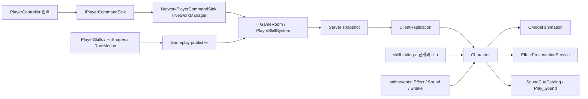

# 캐릭터 Action Composition과 조작감 개선 구현 계획서

작성일: 2026-09-11. 2026-09-12 후속 요청으로 G05의 일반 클릭 이동 예측을 구현한다. 다른 G는 기존 설계 범위이며 실제 완료·빌드 상태는 대응 RESULT에서 구분한다.

09-11 최초 요청은 설계 계획이었다. 09-12에는 G05 일반 클릭 이동의 실제 구현을 요청받았고, 캐릭터 크기와 다른 G는 향후 적용 대상으로 남긴다. 최초 조사 기준은
`codex/pr360-main-resource-sync`, HEAD `89477fd78b24e111789a6dd0aabbcc57c50c08fd`의 현재 working copy다.
조회 당시 origin/main보다 3 commit 앞서 있고, 다른 작업의 staged/unstaged 변경이 함께 있다.
아래 설계는 현재 미커밋 코드를 포함한 조사 결과이며 해당 HEAD 단독의 구현 상태를 뜻하지 않는다.

## G00. 최초 조사 당시 입력과 재생 구조를 먼저 이해한다

이 절은 09-11 구현 전 기준이다. 일반 이동 예측의 09-12 변경은 G05와 대응 RESULT를 따른다.

### 실제 호출자와 데이터 정본



`PlayerController::Request_MoveToPoint`는 명령 송신과 클릭 표시를 요청한다. 이 함수에서 캐릭터 위치를
미리 이동시키지 않는다. `NetworkManager::Send_MoveGoal`의 성공은 송신 성공이지 Server 승인 성공이 아니다.
Server가 이동·스킬·피해를 결정하고, `ClientReplication`이 snapshot을 `Character`에 전달한다.

현재 **Client Side Prediction은 없다.** `Character`는 자기 캐릭터도 network transform 보간으로
표현한다. 30Hz 기준 2 tick, 약 66.7ms의 보간 지연이 있으며 네트워크 송수신과 Server tick 대기는 별도다.
이 숫자를 현재 PC에서 측정한 총 입력 지연으로 부르지 않는다.

| 의미 | 현재 정본 / 소비자 |
|---|---|
| class·입력 슬롯 → skill ID | `Data/Balance/PlayerSkills.json` → `CPlayerSkillCatalog` |
| action 종료·hit·combo 입력창·다음 BA 시점 | 같은 JSON → Gameplay publisher → `CGameplayCatalog / CPlayerSkillSystem` |
| skill → Server stage별 ordered clips | `Data/Animation/Authored/<Asset>/<Asset>.skillbindings.json` → `CAnimationSkillBindingDocument / CCharacter` |
| source 시작·잘라 쓸 길이·배속 | 각 binding clip의 `sourceStartMs / playMs / playRate` |
| 실제 모델 재생 길이 | 설치된 WModel → `CAnimation / CModel`의 runtime duration과 tick rate |
| Effect·Sound 발생 시점 | 현재 `<Asset>.animevents` → `CAnimationEffectCueDocument / CCharacter` |
| Effect 모양·element·재질·particle 운동 | `Data/Effects/EffectCatalog.json`, `Data/Effects/Authored/*.effect.json` |
| Sound event → 실제 음원 variants | `Data/Sound/CharacterSoundCatalog.json` → `CSoundCueCatalog` |
| 실제 스킬 전진과 판정 | `Data/Animation/RootMotion`, `HitShapes`, projectile source → publisher → Server |

`playMs`는 배속 적용 후의 화면 시간이 아니라 사용할 source 시간 구간이다. 유효 source 길이를
`playRate`로 나눈 값이 표현 시간이다. 여러 clip은 그 값을 순서대로 합산한다. 현재 cooked model은
헤더의 24 ticks/s를 그대로 재생하지 않고 `CAnimation::COOKED_TICK_RATE=30`을 사용한다.
Workbench도 헤더만 나누어 길이를 계산하지 않고 **제품 runtime과 같은 시간 계산**을 사용해야 한다.

### 차원술사와 창술사의 BA 실측

아래는 설치된 두 WModel의 duration ticks, 현재 binding, PlayerSkills와 실행 bootstrap을 대조한 값이다.
화면 측정값이 아니라 현재 runtime 식으로 계산한 시간이다. Server 실행 경계에는 30Hz tick 양자화가 더해진다.

| 캐릭터 / 단계 | 실제 clip | source 사용 길이 ms | 배속 | 표현 시간 ms | Server actionDurationMs | comboAdvanceMs |
|---|---|---:|---:|---:|---:|---:|
| 차원술사 BA1 | `pc_sp_m_00_sk_att_battle_1_01` | 1400, 원본 4000에서 trim | 2 | 700 | 1400 | 1400 |
| 차원술사 BA2 | `pc_sp_m_00_sk_att_battle_1_03` | 1066.667 | 2 | 533.333 | 1067 | 1067 |
| 차원술사 BA3 | `pc_sp_m_00_sk_att_battle_1_04` | 1700 | 2 | 850 | 1700 | 마지막 단계 |
| 창술사 BA1 | `flm_att_identity1_1_01` | 1633.333 | 1 | 1633.333 | 1633 | 470 |
| 창술사 BA2 | `flm_att_identity1_1_02` | 1366.667 | 1 | 1366.667 | 1367 | 356 |
| 창술사 BA3 | `flm_att_identity1_1_03` | 1533.333 | 1 | 1533.333 | 1533 | 451 |
| 창술사 BA4 | `flm_att_identity1_1_04` | 1566.667 | 1 | 1566.667 | 1567 | 마지막 단계 |

차원술사는 clip을 끝내고도 단계별 약 700 / 534 / 850ms가 남는다. `Character::Update_Chain`은
이 구간에서 마지막 pose를 유지한다. 현재 차원술사 BA는 입력창을 가진 3-stage COMBO다.
앞의 두 입력창은 `100..1400 / 93..1067ms`이며, hold repeat가 다음 입력을 보낸다.
현재 pending 이동은 지금 stage의 전체 actionDuration까지 기다린다. 세 단계를 항상 자동 완주하는 구조는 아니다.
**클립 2배속만 바꾸면 이동 잠금과 자동 연계 정책은 빨라지지 않는다.**

창술사는 다음 BA로는 470 / 356 / 451ms에 연계할 수 있지만, 이동은 현재 stage의 전체 action duration을
기다린다. 공격에서 공격으로 넘어가는 시간과 공격에서 이동으로 넘어가는 시간이 이미 다르다.

현재 ACTIVE/HOLD/COUNTER 중 일반 이동 요청은 버리고, COMBO 중에만 최신 MOVE/SKILL 하나를
`PendingCommand`에 보관한다. RMB hold는 50ms 간격 외에도 이전 목표와 0.25 이상 차이가 있어야
다시 보내므로, ACTIVE 중 버려진 목표를 계속 누르고 있어도 종료 후 자동 재전송하지 않을 수 있다.
후딜 개선에는 시간 값과 함께 **입력 보관·실행 규칙**을 바꿔야 한다.

### 반복 수정이 효과 없었던 이유로 확인한 범위

- 08-21 변경은 당시 4단 BA의 timing과 COMBO command buffer를 다뤘다. 독립 이동 취소 시점을 만들지 않았다.
- 09-11 변경은 현재 3단 BA의 `playRate=2`만 적용했다. Server timing과 root motion은 그대로다.
- 3-stage Server 정의와 4-stage binding을 섞으면 `Load_ClipChains`의 전체 검증이 실패하는 경로가 있다.
  현재 데이터는 3/3으로 맞는다. 당시 사용자 실행 로그가 없어 과거 모든 실패의 원인으로 확정할 수 없다.
- 기존 WModel 진단의 24Hz metadata 길이를 runtime 길이로 사용하면 실제보다 25% 길게 계산한다.
- 저장 파일, 메모리에서 적용된 binding, 실행 중 Server bootstrap은 수명이 다르다. 저장 성공만 표시하면
  사용자가 실제로 바꾼 값이 어느 실행에 적용됐는지 알 수 없다.

관련 근거는 [BA 2배속 PLAN](C:/Users/user/Desktop/LostArk/.md/GB/09-11/2026-09-11_DIMENSIONMASTER_BA_DOUBLE_SPEED_IMPLEMENTATION_PLAN.md),
[BA 2배속 RESULT](C:/Users/user/Desktop/LostArk/.md/GB/09-11/2026-09-11_DIMENSIONMASTER_BA_DOUBLE_SPEED_RESULT.md),
[command buffer PLAN](C:/Users/user/Desktop/LostArk/.md/GB/08-21/2026-08-21_DIMENSIONMASTER_BA_COMMAND_BUFFER_IMPLEMENTATION_PLAN.md),
[command buffer RESULT](C:/Users/user/Desktop/LostArk/.md/GB/08-21/2026-08-21_DIMENSIONMASTER_BA_COMMAND_BUFFER_IMPLEMENTATION_RESULT.md)다.
과거 문서의 4단 구성은 이 계획의 현재 연결로 재사용하지 않는다.

## G01. Action Workbench에 Character 세션과 Composition Actions를 연결한다

### 화면과 선택의 책임

도구 이름은 **Action Workbench**를 유지한다. 상단에 `Boss / Character`를 두고 Character 모드의
목록 창은 **Composition Actions**로 표시한다. 보스 모드의 Composition Patterns와 기존 draft는 유지한다.
캐릭터를 `COMPOSITION_WORKBENCH_BOSS` enum에 보스로 추가하지 않는다.

```text
Action Workbench    Target: Character    Class: DimensionMaster

Composition Actions       Composition Preview            Action Detail
  LMB · 2050010           몸체 + 장비 + 무기              선택한 실제 clip/occurrence
    BA1 / BA2 / BA3       Play / Pause / Step / Seek       Source 시작·길이·배속
  Q · 실제 skill ID      root / bone / 시전 위치 표시    이동 가능 시점 / 다음 스킬 시점
  W ...                                                  연결 Effect / Sound / 파일 열기

Composition Resources     Composition Sequencer
  실제 model clips       Animation     [BA1 clip-----------]
  연결/미연결 Effect     Server action [---------------------------]
  Sound event/variants   Move allowed                | 이후 이동 가능
                         Hit / Projectile    |  |
                         Effect / Sound      [----] |  [tail------]

적용 상태: 편집 중 / 파일 저장됨 / Client 적용됨 / Server 적용됨
실행 관찰: 입력 접수 → 보관/거절 → 이동 실행 tick → 예측 위치 / Server 위치
```

목록은 여섯 playable class와 실제 PlayerSkills를 사용한다. 선택 주소는
`characterClass + skillId + Server stage + clipOccurrenceId`다. 장비·스킬 이름으로 class를 추측하지 않는다.
clip과 cue의 영속 ID가 생기기 전 G01은 조회·미리보기만 제공한다.

현재 Animation Tool에는 `Scene Character → Key -> Skill Animation`의 clip 연결·순서 편집은 있지만
player `sourceStartMs / playMs / playRate` 편집과 Server 후딜 통합 timeline은 없다.
기존 `EffectAuthoringSequencer::Select_CharacterSkill`은 실제 binding으로 sequence를 만들지만,
`Save Sequence`는 Effect sequence를 저장한다. 이를 제품 스킬 저장 버튼으로 연결하지 않는다.
`Select_CharacterSkill`만 호출하면 모델 clip sequence만 준비된다. 새 Workbench caller는 같은 Product
cue reader와 Sound catalog를 join해 선택 skill/stage의 Effect·Sound·Shake를 기존 sequencer의 임시 track으로
stage해야 한다. Source window/배속/anchor/stop을 보존하고, 모든 track과 target generation이 맞은 뒤
한 번 교체한다. 실패하면 이전 preview를 유지한다. 이 임시 track을 별도 Effect sequence 파일에 자동 저장하지 않는다.

### 파일과 실제 재사용 위치

| 파일 | 계획한 책임 |
|---|---|
| `Client/Public/CompositionWorkbenchSession.h` | 기존 pane/session 계약 위에 Character target 선택 경계를 추가 |
| `Client/Public/SequencerTool.h`, `Client/Private/SequencerTool.cpp` | Boss/Character 세션 선택과 모드별 창 제목; 공용 창 배치 유지 |
| 신규 `Client/Public/CharacterActionWorkbench.h`, `Client/Private/CharacterActionWorkbench.cpp` | `ICompositionWorkbenchSession` 구현. 선택 class·skill, joined view, draft, 편집 명령을 소유 |
| `Client/Private/MainApp.cpp`와 대응 헤더 | Character 세션 생성·연결, 기존 preview 사용권과 명령 처리 |
| `Client/Public/CharacterPreviewPanel.h`, `Client/Private/CharacterPreviewPanel.cpp` | 기존 `CPlayableCharacterAssetService → CCharacter` 생성과 target generation 재사용 |
| `Client/Public/AnimationTargetService.h`, `Client/Private/AnimationTargetService.cpp` | scene/preview의 실제 model·bone·root와 실패 이유 제공 |
| `Client/Private/EffectAuthoringSequencer.cpp` | 이미 있는 Character skill timeline 구성·재생 경로를 공용 호출자로 연결 |
| `Client/Private/Animation_Tool.cpp`와 대응 헤더 | Scene-only binding writer 접근을 typed authoring target으로 분리해 두 UI가 같은 owner 호출 |

`CCharacterActionWorkbench`는 게임 캐릭터·network authority·Effect renderer를 새로 소유하지 않는다.
`CompositionTimeline`, `CompositionResourceTree`, 공용 CharacterPreviewPanel과 기존 Effect/Sound 재생을 쓴다.
선택한 class의 실제 body/장비/무기를 함께 준비하고, 준비 실패 시 이전 target와 draft를 보존한다.
Scene Character와 선택 preview class가 달라도 편집할 수 있지만, 단순히 기존 Scene-only guard를 삭제하지 않는다.
class·asset·model metadata·target generation이 일치하는 typed target으로 검증한다.

Preview와 실제 Server Play는 실행 의미를 표시한다. 로컬 preview는 pose·cue·anchor 비교용이며
승인된 게임 캐릭터를 이동시키거나 Server 피해를 만들지 않는다. 실제 조작감 확인은 기존 Character Select
진입 후 사용자가 물리 입력으로 수행한다. Workbench의 character 선택 자체는 Server class-change 명령이 아니다.

### 사용자가 반드시 볼 수 있어야 하는 진단

| 선택 항목 | 표시할 실제 값 |
|---|---|
| 캐릭터 전체 | binding admission 성공/실패, 정확한 실패 skill/clip/field, 적용 generation |
| clip | 실제 모델 상대 ID, clip 이름, stored TPS / runtime TPS, source 범위, 배속, 계산된 종료 |
| 스킬 | Server action/콤보 진행 방식·현재 stage·종료·이동 잠금·대기 command |
| Effect | 실제 asset ID와 authored 경로, stable element, spawn/skip/failure, 선택 owner와 최종 transform |
| Sound | event 이름, variant 목록, 실제 선택 WAV, source 발생 시점과 배속 적용 후 발생 시점 |
| 적용 상태 | Disk / Draft / Client-applied / Server-active, 파일 저장과 runtime 적용의 차이 |

전체 class load가 실패해도 목록을 빈 화면으로 지우지 않는다. 실패한 행과 원인을 read-only로 남기고
유효하게 읽은 행은 조회할 수 있게 한다. 이 진단 view를 runtime의 부분 admission 성공으로 간주하지 않는다.
missing/corrupt binding으로 기존 정상 Character·이전 draft를 지우지 않는다.

## G02. 클립·cue 편집의 영속 ID와 저장 owner를 닫는다

현재 player clip에는 `clipName/sourceStartMs/playMs/playRate`만 있고 별도 occurrence ID가 없다.
Effect/Sound cue에도 stable cue ID가 없다. 현재 Character와 Effect preview가 조립하는 stage/clip/cue
ordinal 문자열은 실행 중 식별일 뿐, 드래그·순서 변경 후 보존할 저장 ID로 사용하면 안 된다.

`*.skillbindings.json`의 다음 format에 clip별 `clipOccurrenceId`를 저장한다. 기존 clip name은 실제
WModel 조회 키이며 occurrence ID와 구분한다. 같은 clip을 두 번 쓰면 서로 다른 ID를 가진다.
순서 변경은 ID를 유지하고 복제는 새 ID를 발급한다. Server combo stage 수를 UI의 Append로 늘리지 않는다.

새 cue 편집은 JSON을 정본으로 하며 `.animevents`의 임시 payload token을 더 늘리는 설계로 만들지 않는다.
기존 `CAnimationEffectCueDocument` owner를 확장해 asset event 전체의 JSON 읽기·검증·저장을
담당하게 한다. EFFECT/SOUND만 떼어 두 정본으로 만들지 않고 다음 경계로 이전한다.

- 신규 `Data/Animation/Authored/<Asset>/<Asset>.animevents.json`은 asset별 `events[]`와 영속
  `eventId`를 가진다. 기존 모든 event kind, source provenance, clip 이름, 시간, 원본 payload와
  typed anchor/Effect/Sound/Shake 값을 의미 그대로 이관한다. `eventId`가 cue 편집의 stable ID다.
- skillbinding에 없는 locomotion·voice clip 행도 보존한다. event의 기본 owner는 model clip이며
  특정 반복 clip에만 연결할 때는 optional `clipOccurrenceId`로 범위를 좁힌다. 해당 경우에는
  binding 존재와 asset 일치를 검증하고 default/occurrence-specific 중복 발화를 거부한다.
- 여섯 class의 기존 파서 결과와 모든 행·순서·시간·SOUND/HIT/EFFECT 결과를 대조한 뒤 한 변경에서
  소비자를 전환한다. `.animevents`는 read-only 이관 근거로 보존하고 legacy parser는 명시 import에만 쓴다.
  runtime에서 JSON 실패 뒤 legacy fallback이나 양쪽 병합을 하지 않는다.
- 이관 원본은 runtime 필터를 통과한 cue 목록이 아니라 전체 `ANIM_EVENT` 행이다. `Import_Notifies`도
  기존 imported 행을 모두 지우고 재생성하지 않고, 변하지 않은 source occurrence의 eventId는 유지한다.
  새 occurrence만 새 ID를 받고 중복으로 유일 대응이 불가능하면 해당 import를 거절해 기존 행을 보존한다.
- HIT/CANCEL/MOVE 등 저작·intake도 같은 event JSON을 읽는다. Server의 실제 판정 정본인
  HitShapes/RootMotion과 publisher는 유지하며, JSON 저장만으로 Server timing이 바뀐다고 표시하지 않는다.
- Character 초기화, `PlayableCharacterAssetService`와 `Level_Loading` prewarm, Animation Tool,
  `Effect_Tool`의 직접 `.animevents` 읽기 두 곳, `EffectAuthoringSequencer`를 같은 loader에 연결한다.
  `validate_effect_sources.py`, 실제 사용하는 intake/materializer의 경로·codec도 같이 전환한다.
  별도 `.projectiles.json` 소비와 Effect의 동일 asset ID는 유지한다.

이 event JSON은 Effect element나 Sound variant, Server timing을 복제하지 않는다. Effect는 asset ID,
Sound는 catalog의 `soundEventName`을 참조하고 세부 편집은 기존 Effect Tool 및 Sound catalog owner로 연결한다.
이는 event JSON의 행 ID인 `eventId`와 다른 식별자다.
현재 배속은 Sound cue 시작 시각을 당기지만 `Play_Sound(path, 1.f)`에 음원의 배속/pitch를 전달하지 않는다.
첫 구현은 그 의미를 유지한다. timeline seek는 과거 one-shot 음원을 재발화하지 않고, 재생 시작 시 정확한
cue crossing에서 한 번 재생한다. 효과음 preview channel은 해당 preview의 Stop/전환에서만 정리한다.

저장은 기존 binding `Save_Atomic`과 cue의 parse→validate→stage→atomic replace를 재사용한다.
binding/cue를 함께 바꾸면 baseline을 고정하고 두 candidate와 상호 참조를 먼저 검증한 뒤 교체한다.
중간 실패는 이미 교체한 해당 파일을 compare-and-swap으로 복구하고 기존 메모리 문서를 보존한다.
외부 편집으로 baseline이 달라졌으면 덮어쓰지 않고 실패 행을 보여 준다.
Effect asset 내부 편집과 Sound catalog 편집은 별도 owner 저장으로 표시하며 같은 atomic Save라고 설명하지 않는다.

새 C++ 파일은 G01의 한 쌍을 Client `.vcxproj`의 ClInclude/ClCompile 및 기존 Tool filter에 등록한다.
새 event JSON은 Client `96.DataFiles`의 None으로만 등록한다. 별도 generated CharacterComposition,
두 번째 preview loader, 새로운 Resource manifest는 만들지 않는다.

## G03. 후딜을 Server 이동·다음 스킬 취소 시점으로 편집한다

### 시간 필드의 의미와 writer

후딜 편집 화면은 action 시작부터 경과한 ms를 정본으로 한다. 사람이 편하게 입력할
`클립 종료 후 추가 대기 ms`는 편집 보조값이고, 계산한 절대 취소 시각과 Server tick 반올림 결과를 함께 보여 준다.
배속 slider만으로 Server 피해·이동 시계를 몰래 바꾸지 않는다.

| 필드 | owner / 단위 / 조건 |
|---|---|
| `sourceStartMs`, `playMs`, `playRate` | 기존 skillbinding; clip source 시간과 양의 배속 |
| `actionDurationMs` | 기존 PlayerSkills; 취소 입력이 없을 때의 자연 action 종료 |
| 제안 `moveCancelMs` | PlayerSkills의 skill 또는 Server combo stage; 이 시점 이후 명시 MOVE가 회수 동작을 취소 |
| 제안 `skillCancelMs` | 같은 owner; 이 시점 이후 다른 명시 skill로 전환 가능 |
| 제안 `moveBufferMs`, `skillBufferMs` | 같은 owner; 각 cancel 시점 직전 접수할 입력창 길이. 0이면 사전 보관 없음 |
| 제안 `explicitCancelPolicy` | `DISABLED / RECOVERY_ONLY`; 해당 stage가 명시 취소를 허용하는지. 시간 0을 비활성 표식으로 쓰지 않음 |
| `comboAdvanceMs`, `inputOpenMs`, `inputCloseMs` | 기존 owner 유지. 같은 BA 연계와 다른 skill 전환을 구분 |

새 취소 시각은 `0 ≤ cancelMs ≤ actionDurationMs`이며 첫 적용은 현재 stage의 마지막 필수 caster hit,
반복 hit 및 projectile spawn 이후로 제한한다. 자연 종료보다 이른 값은 **의도적 회수 동작 취소**다.
HOLD의 release/channeling, COUNTER 등 특별한 구간은 해당 정책을 유지하고 회수 구간에서만 허용한다.
모르는 skill kind를 일반 ACTIVE로 fallback하지 않는다.

`클립 종료에 맞추기`는 현재 runtime clip 종료 + 추가 대기로 candidate를 만들고, 마지막 필수 판정이 더
늦으면 해당 hit/spawn ID와 함께 거절한다. 값을 몰래 올리거나 타격을 삭제하지 않는다.
차원술사 700 / 534 / 850ms는 첫 비교 기준이며, 전체 hit/projectile/Server motion과 겹침을 표시한 뒤
사용자가 튜닝할 값이다. 세 수치를 검증 없이 확정 balance로 기록하지 않는다.
자동 COMBO의 중간 stage는 초기 이관에서 `DISABLED`로 두어 기존 마지막 stage까지의 실행을 보존한다.
사용자가 해당 stage를 `RECOVERY_ONLY`로 명시 변경했을 때만 중간 취소를 허용한다.
HOLD 시작/loop와 COUNTER guard 역시 취소 불가 정책을 명시하고, 본래 release/guard 전이를 유지한다.

`PlayerSkills.json → CBalanceTool authoring → Publish-GameplayBalance → Server CGameplayCatalog`에
필드를 수직으로 연결한다. 기존 parser의 정확한 property 검사를 함께 확장하고, 기존 skill의 초기값은
현재 duration과 같게 명시 이관해 동작을 보존한다. 공식 provenance receipt의 바뀐 필드는 기존 동기화 경로로
`PROJECT_TUNED`에 반영한다. UI는 Balance owner의 typed 편집 API를 호출하며 JSON과 Server 메모리를 직접 덮지 않는다.

### 입력 보관과 실제 취소 순서

기존 `SERVER_PLAYER::PendingCommand`를 확장해 ACTIVE 회수 구간에서도 최신 명시 MOVE/SKILL 하나를
보관한다. class·target·sequence·action occurrence와 만료 경계를 값으로 소유한다. HOLD 채널을 임의 해제하거나
사망·경직·강제 이동 입력을 보관하지 않는다. 사전 입력창은 `[max(0, cancelMs-bufferMs), cancelMs)`이며
cancel 이후는 즉시 실행 검증 대상이다. 초기 이관은 COMBO의 현재 stage 전체 보관을 명시 값으로 보존하고,
새 ACTIVE 회수 보관창은 200ms를 시작값으로 제안한다. 사용자가 툴에서 해당 값을 조절할 수 있다.
대체된 pending에는 `SUPERSEDED`, action/epoch 종료에는 `EXPIRED` 또는 해당 reset 이유를 보내고 제거한다.
`WINDOW_NOT_OPEN`일 때만 아직 같은 RMB press를 유지한 목표를 제한 재시도한다. `INVALID_PATH`, 사망 등
권위 상태 거절은 같은 press에서 무한 재전송하지 않는다. hold 중 보관 성공을 받으면 같은 목표 재송신은 멈춘다.
스킬 시작 때 발급한 `actionInstanceId`와 `movementEpoch`를 pending 소유자로 두고, deadline은 그 안의
현재 Server stage와 stage-start tick에 고정한다. 현재 `actionStartTick`은 stage마다 바뀌므로 이것 하나를
전체 cast ID로 쓰지 않는다. 취소 불가 automatic stage의 보관은 같은 actionInstanceId 안에서 기존처럼
다음 stage로 이월하되 deadline을 새 stage 정책으로 다시 계산한다. 다른 cast/action 교체에는 이월하지 않는다.

1. 수신 시 session/class/유효 좌표·명령 순서를 검사하고 `BUFFERED / REJECTED / APPLIED`를 구분한다.
2. 같은 tick에서 사망·강제 이동·상태 취소를 먼저 처리한다. 필수 hit/spawn 완료 마스크를 반영한다.
3. moveCancelMs/skillCancelMs에 도달하면 최신 pending 명령을 실행 시점 상태로 다시 검증한다.
4. MOVE는 최종 Server 위치에서 navigation path를 stage한다. 유효 path 준비가 성공한 뒤 action과
   남은 Server root motion을 종료하고 이동을 commit한다. path 실패는 기존 action과 위치를 유지한다.
5. SKILL은 cooldown/resource/stance/target을 검사해 다음 action과 비용을 stage한 뒤 교체한다.
   전환 실패 때문에 기존 action이나 비용이 부분 변경되지 않는다.
6. 명시 취소가 허용된 stage에서 MOVE/SKILL이 실행되면 아직 시작하지 않은 BA 후속 stage를 취소한다.
   automatic 중간 stage는 명시적으로 허용한 경우에만 기존 마지막까지의 연계를 중단한다.
7. 이미 발사한 projectile은 기존 `Update_Projectiles`에서 원래 수명과 피해를 유지한다.
   취소 이후의 미발생 caster hit·미발사 projectile·미실행 root motion을 새 위치에서 실행하지 않는다.
8. death, disconnect, class/world 변경, teleport·강제 이동에서는 pending과 예측 history를 함께 무효화한다.

명령 우선순위는 `강제 상태 전환 > 실행 가능한 최신 명시 MOVE/SKILL > BA continuation > 자연 종료`다.
후속 command sequence와 release 의미를 유지하고, 같은 목표를 누른 입력도 보관 결과에 따라 처리한다.
Server가 거절했는데 Client가 송신 성공만 보고 영구히 재전송을 막는 경로를 없앤다.

Character는 취소가 반영된 snapshot을 받아 locomotion/다음 action으로 전환한다. clip이 끝났다는 이유만으로
Client 단독 action을 NONE으로 만들지 않는다. 모델 root translation suppression을 유지하며, Server motion을
애니메이션 배속과 함께 바꾸려면 별도 명시 편집으로 trajectory time을 재표본화하고 displacement를 검증한다.

수정 대상은 `PlayerSkills.json`, 기존 Gameplay publisher, `GameplayCatalog.h/.cpp`, `ServerPlayer.h`,
`GameRoom.h/.cpp`, `PlayerSkillSystem.h/.cpp`, `PlayerSkillCatalog.h/.cpp`, `BalanceTool.h/.cpp`,
`PlayerController.h/.cpp`, `Character.h/.cpp`와 관련 Shared 명령 결과/snapshot이다.
생성 bootstrap은 publisher만 쓴다. 일반 player balance의 live hot reload는 현재 없으므로
**Save → Publish → Server 재시작**을 적용 절차로 유지한다. 실행 중 숫자를 바꾸는 기능은 이 단계의 완료로 표시하지 않는다.

## G04. 이펙트의 시전 위치·본 추적·particle space를 분리해서 보여 준다

차원술사 BA outer cue는 현재 세 개 모두 `root / follow / action_facing / natural`이다.
그 아래 element는 다음처럼 섞여 있다. `screenPost`처럼 particle이 아닌 행도 포함한 문서 element 수다.

| 현재 Effect | 전체 element | 본 follow attachment | 시작 때 root를 snapshot하는 attachment |
|---|---:|---:|---:|
| `2050010.ba0.full.restore` | 18 | 1, 오른발 | 17 |
| `2050010.ba2.full.restore` | 9 | 0 | 9 |
| `2050010.ba3.full.restore` | 34 | 12, spine2와 screenPost 포함 | 22 |

현재 이 문서들의 `detail.particle.localSpace=true`만으로 모든 효과가 캐릭터를 따라간다고 판단할 수 없다.
`Effect_Playback`은 `actionCueAttachment.follow=false`인 element의 root를 **그 element가 시작되는 순간**
캡처한다. frozen parent를 사용하는 local-space 입자는 결과적으로 그 고정 위치를 기준으로 움직인다.
반대로 cue를 SNAPSHOT으로 바꾸어도 source-bone anchor는 별도로 갱신될 수 있다.

따라서 Detail은 다음 세 층을 각각 표시한다.

| 층 | 보여 줄 값과 편집 의미 |
|---|---|
| 스킬 cue | root / target / bone, follow/snapshot, action-facing, local TRS, stop policy |
| element attachment | 실제 bone, follow 여부, root 캡처 시점과 캡처 위치 |
| particle simulation | local/world, birth root, 현재 parent와 최종 world 위치 |

후딜을 줄이면 늦게 생성되는 snapshot element가 이동 후 위치에서 처음 생길 수 있다.
시전 위치에 남겨야 하는 효과에는 `action 시작 root`와 `element 시작 root` 중 캡처 기준을 명시적으로
선택하는 정책을 기존 Effect attachment에 추가한다. 기존 문서의 생략값은 현재 element-start 의미를 유지한다.
이를 저장·decode·CPU playback·source anchor·preview 모두가 소비해야 하며 UI 토글만 추가하지 않는다.
현재 actionStartTick만으로 과거 시전 위치를 복원할 수는 없다. Server는 스킬/단계 승인 시점의 시작 위치·방향을
action occurrence에 고정하고 기존 skill target과 함께 snapshot으로 보낸다. Client는 그 승인 seed를
Character→Effect spawn descriptor→active Effect에 전달한다. 늦은 snapshot의 현재 위치를 시전 위치라고
캡처하지 않는다. preview는 재생 시작 시 같은 형태의 임시 seed를 만들며 rewind/restart 때 새 occurrence를 쓴다.
따라서 이 정책에는 `ServerPlayer / PlayerSkillSystem / Shared snapshot / ClientReplication / Character`도
직접 소비자로 포함하며, Server에는 clip·Effect asset 경로를 전달하지 않는다.

무기 궤적·손발 부착은 필요한 동안 follow를 유지한다. 장판·폭발·발사된 투사체 표현은 선택한 cast/target
위치를 유지한다. 스킬 전부의 localSpace를 false로 바꾸거나 본 부착을 일괄 끊지 않는다.
action 취소 때에는 아직 발생하지 않은 cue를 취소하고, 이미 생성된 natural tail과 cue-end 종료 정책을
구분한다. 살아남는 tail이 종료된 action의 다음 pose를 잘못 따라가지 않도록 detach 시각과 anchor를 명시한다.
현재 `Stop_Owner`는 캐릭터의 모든 Effect를 제거하므로 이 용도로 호출하지 않는다. Character가 action identity를
지우기 전에 기존 EffectPresentationService에 **해당 action의 종료 사유**를 통지하는 player API를 추가한다.
자연 종료·회수 취소·강제 종료를 구분해 미발생 cue 중단, natural tail 보존, cue-end 종료를 처리한다.
bone-follow tail을 분리할 때는 outer root와 source bone anchor의 마지막 실제 transform을 함께 동결한다.
이전 action tail에 새 캐릭터 pose가 유입되는지, 다른 action Effect까지 제거되는지 회귀로 확인한다.

사용자는 Preview에서 `시전 위치 고정 표시`, `캐릭터 root 이동 비교`, `선택 element Solo`, `본/최종 위치 표시`로
비교한다. 기존 Character preview·Effect playback을 사용하며 이동 비교는 authoring target에만 적용한다.
제품 visual 판정은 사용자가 실제 스킬 시전 뒤 이동하며 수행한다.

수정 대상은 `AnimationEffectCueDocument.h/.cpp`, G02의 event JSON owner, `Effect_AuthoringDocument.h`,
`Effect_DocumentCodec.cpp`, `Effect_Playback.cpp`, `Effect_PresentationService.cpp`와 기존 Tool Detail이다.
이 단계는 공용 attachment 정책과 연결 진단을 소유한다. 과거 모든 차원술사 재질·renderer 결함의 해결이나
원작 visual fidelity 완료를 이 기능의 결과로 선언하지 않는다.

## G05. 일반 클릭 이동의 즉시 표시와 Server 보정 — 2026-09-12 구현 범위

### 현재 실측과 목표

구현 전 첫 RMB 입력은 지연 없이 CPlayerController::Request_MoveToPoint에서 송신하지만 CCharacter는 자기 캐릭터도 30 Hz 2 tick 보간으로 표시한다. 약 66.7 ms 보간 대기에 통신과 tick이 추가된다. 0.3초는 사용자 체감이며 자동 실측값이 아니다. 구현 전 TCP 양쪽 socket에 TCP_NODELAY가 없어 작은 패킷 전송 대기 가능성도 있다.

일반 이동 가능한 내 캐릭터는 송신 직후 기존 CNavigation/CNavPathFollower로 경로를 준비하고 RUN을 요청한다. Engine의 ObjectUpdate가 Level 입력보다 먼저이므로 위치 전진과 모델 갱신은 다음 ObjectUpdate부터 진행하며 Server 응답을 기다리지 않는다. Server 처리 전에는 최신 클릭 경로를 표시하고, 처리 뒤에는 Server 위치·다음 경유점·실효 속도로 짧게 예측하며 작은 차이는 표시 offset으로 보정한다. 다른 플레이어는 기존 보간을 유지한다.

### 파일과 호출 흐름

- PlayerController.cpp: Request_MoveToPoint의 typed sink 송신 성공 뒤 Character의 예측 시작을 호출한다. 송신 실패면 새 예측을 만들지 않는다. Controller는 패킷이나 서버 위치를 조작하지 않는다.
- Character.h/.cpp: 로컬 캐릭터의 예측 상태, 임시로 준비한 기존 path follower의 commit, 즉시 RUN 전환과 프레임 표시를 소유한다. source snapshot buffer는 그대로 보존한다.
- LocalMovePrediction.h: 표준 C++만 사용하는 처리 sequence·freshness·보정 상태다. 명령 전송이나 navigation query는 하지 않는다. 새 header는 Client.vcxproj와 filters에 등록한다.
- ClientReplication.cpp: 일반 snapshot과 지연 class 교체의 두 소비자에 같은 예측 입력을 전달한다. Character 교체·world 종료는 객체 수명으로 이전 예측을 폐기한다.
- PacketMessages.h/.cpp, PacketType.h: protocol 81 snapshot에 처리한 이동 sequence, 실효 이동 속도, 일반 이동 가능 여부, 활성 이동 목표 여부와 다음 경유점을 싣는다. 수신 ACK는 승인과 다르며, 현재 권위 이동 상태로 거절/정지/기존 이동 지속을 구분한다.
- GameRoom.cpp: 기존 Server navigation·collision·action gate를 유지하고 snapshot의 예측용 read-only view만 생성한다.
- NetworkManager.cpp, ClientSession.cpp: gameplay TCP socket에 TCP_NODELAY를 적용하고 실패 이유를 기존 연결 오류 경계에 보존한다.

명령 송신 성공 → 로컬 경로 stage → 예측/경로 commit → RUN → 서버 처리 sequence와 상태 수신 → 미처리 최신 명령은 보존 / 처리된 명령은 서버 이동 상태로 보정 순서다. local 경로 준비 실패는 송신한 명령을 취소하지 않고 기존 표시 상태를 보존한다.

### 보정과 실패 경계

미확인 최신 클릭은 오래된 IDLE snapshot으로 덮지 않는다. 서버 다음 경유점을 넘어서 외삽하지 않으며 외삽은 최대 0.15초, 입력과 snapshot의 무응답 예측은 최대 0.35초로 제한한다. 작은 오차는 약 0.08초 표시 보정으로 소거하고 이동 불가·강제 이동·불연속 위치는 예측을 버리고 권위 위치로 맞춘다. 도착·거절은 RUN을 무한 유지하지 않는다. stale tick/sequence와 wrap을 검사한다.

기존 Client navigation은 짧은 미승인 표시 예측용이며 서버 정답으로 보내지 않는다. 서버 navgrid·navpolicy·정적 collision과 장애물 판정은 계속 Server가 소유한다. 방어 태세 등의 속도는 Client의 6.f 생성 기본값 대신 Server가 복제한 실제 속도를 사용한다. 스킬/피격/사망/잡힘/마리오/강제 이동/관전 전용 상태는 canPredictMove=false로 일반 클릭 예측에서 제외한다.

이 범위는 정상 클릭 이동의 anticipation와 서버 경유점 기반 bounded prediction이다. 이전 확장 설계의 스킬 취소 deadline, 전역 inputOrder, BUFFERED/APPLIED action 결과, navigation revision을 공유하는 전체 고정 tick 재시뮬레이션은 이번 일반 이동 변경에 포함하지 않는다. 이를 구현 완료로 기록하지 않는다.

### 검증과 사용자 실행

기존 NetworkProtocolHarness에서 새 snapshot 필드 roundtrip/잘못된 값 거절을 확인한다. 기존 ClientPresentationPrimitiveContractTests에서 첫 프레임 위치 전진, ACK 이전 IDLE, 방향 재클릭, ACK·거절·속도·정지·timeout·stale·불연속 reset을 실행한다. 관련 Shared/Server/Client 최소 Debug 컴파일, project XML parse와 변경 diff를 확인한다. 다른 작업의 dirty diff와 실행 중인 Client/Server는 보존한다.

Server+Client는 protocol 81로 함께 다시 빌드하고 재시작해야 한다. 사용자가 Server + Client profile → Ctrl+F5 → Lobby → Character Select/Bern/KoukuSaydon에서 직접 클릭·급회전·벽·스킬 직후를 확인한다. 에이전트는 Client/UI를 실행·조작·캡처하지 않으며 최종 체감과 화면 판정은 사용자 확인 대기다.

### G05-01. 실행 후 보고된 경로·보정·회전·카메라 회귀 교정

사용자 EXE 확인에서 반대 클릭의 우회·위아래 이동, 순간 위치 보정과 얼굴 급회전을 보고했다.
현재 Server는 제한 yaw의 heading으로 위치도 회전시켜 이동하고, Client는 waypoint 직선으로
예측한다. 일반 MOVE의 위치는 Server waypoint XZ로 전진시키고 최단 yaw 회전은 독립적으로
유지한다. 스킬 이동·collision·도착 판정과 Server 권위는 그대로 사용한다.

Engine의 segment walkability는 등간격 샘플이 서로 다른 cell 경계 통과를 한 대각선으로 합쳐
지나지 않는 막힌 cell을 요구하는 사례가 있다. 기존 경로 검사에 정확한 grid-cross DDA를 적용해
불필요한 꺾임을 제거하고 실제 막힌 모서리와 높이 제한은 유지한다. CNavPathFollower는 XZ 속도로
전진한 현재 위치의 지면을 샘플링한다. 먼 waypoint의 Y를 향해 미리 오르거나 내리지 않는다.

맵별 step 제한도 기존 publisher가 양쪽에 배포한 navpolicy로 맞춘다. 제품 Loader가 검증한
정책 값을 CNavigation prototype/Clone에 보존하고 Character의 예측 경로 요청에 전달한다.
명시적인 raw/editor factory는 기존 기본값을 유지하며 월드별 높이 상수를 새로 만들지 않는다.

Character는 예측에서도 기존720도/초 최단 회전을 공통 함수로 소비한다. ACK 뒤 일반 이동의
표시 방향은 실제 경유점 방향이며 helper에서 각도를 다시 보간하지 않는다. 작은 위치 보정의
기본 80ms에 오차/이동속도 하한을 함께 적용해 보정 속도를 제한한다. 연속 Server 위치와
10m 초과 큰 잘못된 표시·명시적 위치 불연속을 구분한다.
예측의 높이는 현재 지면을 사용하고 먼 경유점 Y를 외삽하지 않는다.

SPACE는 카메라 중심 키가 아니라 기존 typed skill 입력이다. 일반 예측에서 Server SKILL 보간으로
넘어갈 때만 현재 표시 위치의 잔여 차이를 짧게 줄여 첫 승인에서 되감기지 않게 한다. 강제 이동·
사망·잡힘과 실제 teleport의 즉시 권위 전환은 보존한다. ClientReplication의 두 snapshot 소비자가
같은 action 정보를 전달하며 스킬 실행·속도·거리는 Server가 계속 결정한다.

KoukuSaydon/CharacterSelect camera profile의 followResponse0을12로 바꾸고 기존 exponential
추적을 활성화한다. Camera_Free는 실제 dt를 사용하고 cinematic override 동안 추적 상태를 섞지
않는다. 일반 SPACE 이동은 감쇠 추적하고 target/world/free 전환·큰 warp는 별도로 초기화한다.

기존 helper 검사만으로 완료 처리하지 않는다. 실제 Server 이동 블록, 설치 Client/Server navgrid,
PathFollower·Character 회전 소비자와 카메라 메서드의 재현 검사를 사용한다. 변경 TU의 격리
컴파일 후 제품 빌드를 진행하며 실행 중 Client/Server와 사용자 화면 검증 경계는 유지한다.

## G06. 캐릭터 외형은 기존 presentationScale로 1.7배를 적용한다

현재 차원술사 정본은 사용자가 언급한 2배가 아니라 `presentationScale=1.5`다.
이전 실행에서 2배를 보았는지는 확인하지 않았다. 목표는 합성 scale 0.017로 고정한다.

| 클래스 | 기존 model 단위 변환 | 현재 presentationScale | 목표 presentationScale | 목표 합성 scale |
|---|---:|---:|---:|---:|
| 차원술사 | 0.01 | 1.5 | 1.7 | 0.017 |
| 도화가 | 0.0001 | 기본 1 | 1.7 | 0.00017 |
| 워로드 | 0.0001 | 기본 1 | 1.7 | 0.00017 |

향후 수정은 `Data/Actors/CharacterCatalog.json`의 세 row다. `PlayableCharacterAssetService`의 model
단위 변환을 바꾸지 않는다. `Character::Get_PresentationWorldMatrix`가 배율을 한 번 적용하고 body·장비·무기·
동적 장비 교체·공용 preview가 이를 소비한다. Server body radius·이동 속도·피해 범위는 외형 배율과 별개다.
root Effect는 gameplay world 크기를 유지하고 bone Effect는 확대된 본 위치를 사용한다.

기존 [크기 PLAN](C:/Users/user/Desktop/LostArk/.md/GB/09-09/2026-09-09_CHARACTER_SCALE_AND_MATERIAL_PARITY_IMPLEMENTATION_PLAN.md)의
G02~G04 경로를 재사용한다. 같은 [RESULT](C:/Users/user/Desktop/LostArk/.md/GB/09-09/2026-09-09_CHARACTER_SCALE_AND_MATERIAL_PARITY_RESULT.md)에
기록된 과거 모델 AABB 높이를 현재 설치 리소스의 실측 키로 복사하지 않는다.
JSON parse와 세 row의 의미 diff가 최소 검증이며 C++ 변경·publisher는 필요 없다. catalog는 첫 초기화 뒤
재사용하므로 Client 재시작 후 세 class를 사용자가 확인한다. **이번 문서 작성에서는 세 값 모두 바꾸지 않았다.**

## G07. 구현 순서와 종료 증거

먼저 G01의 조회·preview로 차원술사의 현재 연결과 시간차가 화면에 보이게 한다. 그 다음 G02에서
영속 ID·저장 owner를 닫고, G03 후딜/입력 보관과 G04 anchor 정책을 함께 확인한다.
09-12 G05 일반 클릭 이동은 기존 처리 sequence와 권위 이동 상태에 먼저 연결했다. 스킬 취소 예측은 G03 취소 계약을 구현한 뒤 별도로 연결한다. 작은 G06 외형 변경은 그와 독립된 변경 단위다.
캐릭터 도구 첫 화면을 보기 위해 CSP 전체 구현을 기다리게 만들지 않는다.

| 단계 | 필요한 자동 확인 | 사용자가 확인할 결과 |
|---|---|---|
| G01 | 현재 두 BA의 실제 model clip·stage·cue join, 실패 행 보존; 변경 Client 최소 컴파일 | class 선택 후 몸·무기와 실제 clip/Effect/Sound가 보임 |
| G02 | 기존 cue migration 의미 보존, stable ID reorder/duplicate, invalid save rollback, prewarm/runtime 동일 입력 | 저장·재열기 후 같은 연결과 시각; applied 상태 구분 |
| G03 | 기존 Server contract에 cancel 이전/당일 tick/이후, ACTIVE 입력 보관, automatic BA 탈출, 불가 goal 실패 보존, 비용·projectile 보존 추가 | BA/ACTIVE 뒤 같은 지점 RMB를 누르고 있으면 정한 시점에 이동 |
| G04 | 실제 bone·owner·birth transform과 start-delay snapshot, action 취소 tail 수명; 기존 focused Effect 검사 | 시전 뒤 이동해도 장판은 남고 의도한 무기 궤적은 부착됨 |
| G05 | 기존 protocol/presentation 검사에 처리 sequence·재클릭·거절·속도·경유점·timeout·불연속 reset; 관련 Shared/Server/Client 빌드 | 자기 이동은 즉시 반응하고 벽·급회전·스킬 직후에 과도한 되감김이 없음 |
| G06 | JSON parse, 세 class 배율만 변경, `git diff --check` | 차원술사·도화가·워로드의 몸·장비·무기 크기 |

빌드는 각 단계에 필요한 최소 프로젝트만 수행한다. Engine API가 실제 바뀌면 Engine→Client와 SDK
배포를 포함한다. Shared가 바뀌면 Server/Client와 protocol 검사를 같이 수행한다. Data 배포는 해당 publisher를
명시 실행하며 전체 oracle이나 신규 하네스 생성을 단계 완료의 선행조건으로 추가하지 않는다.

구현 때 갱신할 팀 문서는 `ANIMATION_TOOL_OWNER_HANDOFF.md`의 실제 도구/저장 계약,
`TEAM_GAMEPLAY_INTERFACE_HANDBOOK.md`의 입력·취소·예측 계약, 필요 시 `CLAUDE.md`의 사용 경로다.
HANDOFF에 남은 과거 차원술사 4-stage/manual과 animevents v4 설명은 현재 코드에 맞춰 해당 구역을 교정한다.
확인된 재사용 anchor/clock 원리는 렌더링 복원 V2와 gotchas의 해당 구역에만 반영한다.
**설계 단계에서는 public 계약 문서를 구현된 것처럼 갱신하지 않는다.**

모든 단계에서 다른 작업의 dirty 변경을 보존하고 main 직접 작업·자동 광역 stage를 하지 않는다.
구현 결과와 실행한 검증은 향후 대응 RESULT에 기록하며, 계획서 존재를 구현 완료로 처리하지 않는다.
Client/UI 실행·조작·캡처와 visual PASS는 사용자 전용이다. 이 PC의 현재 준비 경로는 Visual Studio
`Server + Client` profile → Ctrl+F5 → Lobby → Character Select다. G01 구현 후에는 F1 → Action Workbench
→ Character → DimensionMaster → LMB/2050010이 도구 경로가 된다. **그 Character 모드는 현재 아직 없다.**

## 조사한 주요 코드 위치

- [입력 송신](C:/Users/user/Desktop/LostArk/Client/Private/PlayerController.cpp:1439), [network sink](C:/Users/user/Desktop/LostArk/Client/Private/NetworkPlayerCommandSink.cpp:117), [송신 성공 의미](C:/Users/user/Desktop/LostArk/Client/Private/NetworkManager.cpp:1154)
- [Server 이동과 보관](C:/Users/user/Desktop/LostArk/Server/Private/GameRoom.cpp:2908), [action 중 pending skill](C:/Users/user/Desktop/LostArk/Server/Private/PlayerSkillSystem.cpp:313), [자동 BA pending 정책](C:/Users/user/Desktop/LostArk/Server/Private/PlayerSkillSystem.cpp:1214)
- [snapshot 소비](C:/Users/user/Desktop/LostArk/Client/Private/ClientReplication.cpp:4080), [보간과 마지막 pose 대기](C:/Users/user/Desktop/LostArk/Client/Private/Character.cpp:1059), [cooked runtime 시계](C:/Users/user/Desktop/LostArk/Engine/Private/Animation.cpp:39)
- [현재 Workbench 선택](C:/Users/user/Desktop/LostArk/Client/Private/SequencerTool.cpp:195), [기존 player binding UI](C:/Users/user/Desktop/LostArk/Client/Private/Animation_Tool.cpp:13595), [기존 Character skill sequence](C:/Users/user/Desktop/LostArk/Client/Private/EffectAuthoringSequencer.cpp:213)
- [player clip 계약](C:/Users/user/Desktop/LostArk/Client/Public/AnimationSkillBindingDocument.h:18), [cue 계약](C:/Users/user/Desktop/LostArk/Client/Public/AnimationEffectCueDocument.h:41), [Sound 발화](C:/Users/user/Desktop/LostArk/Client/Private/Character.cpp:649)
- [element root 캡처](C:/Users/user/Desktop/LostArk/Client/Private/Effect_Playback.cpp:3950), [attachment parent 선택](C:/Users/user/Desktop/LostArk/Client/Private/Effect_Playback.cpp:6970), [source anchor와 outer follow](C:/Users/user/Desktop/LostArk/Client/Private/Effect_PresentationService.cpp:5538)
- [현재 외형 배율](C:/Users/user/Desktop/LostArk/Data/Actors/CharacterCatalog.json:4704), [model 단위 변환](C:/Users/user/Desktop/LostArk/Client/Private/PlayableCharacterAssetService.cpp:234), [presentation root](C:/Users/user/Desktop/LostArk/Client/Private/Character.cpp:1321)

위 줄 번호는 조사 시점 working copy 기준이며 이후 다른 작업의 편집으로 이동할 수 있다.
