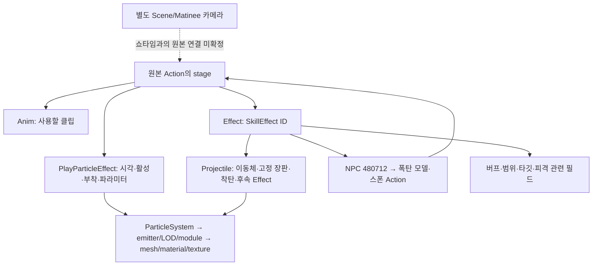

# 쿠크세이튼 쇼타임 원본 리소스·연출 전수조사

사용자의 요청으로 조사를 종료했다. 아래는 종료 시점까지 확인한 결과이며 미확정 항목에 대한 추가 조사와 구현은 진행하지 않았다.

## 사용자 애니메이션 구성과 V1 이펙트 협업 방식

이 역할 분리는 가능하다. 사용자는 패턴의 애니메이션 순서·반복·로직을 구성하고, 이펙트 작업자는 원본 Action과 stage를 근거로 V1 이펙트 문서를 준비한다. 사용자는 그 문서를 해당 패턴의 타임라인에 append하여 배치한다. 클립명이 같은 stage라도 원본 이펙트 구성은 달라질 수 있으므로 클립명만으로 자동 결정하지 않는다.

현재 확인한 Workbench 경로는 `Effect → V1 → 전체 V1_EFFECT 또는 개별 V1_ELEMENT → Append Effect at Cursor → Box Detail → Apply / Save`다. Start, Lifetime, Position, Rotation, Scale, Anchor, Follow를 편집하는 흐름이 이미 있다. V1 전체 문서가 여러 요소와 내부 타이밍을 소유하므로 그 문서 자체를 하나의 이펙트 묶음으로 사용할 수 있다. V2로 변환할 필요는 없다.

근거는 [V1 append UI](<C:/Users/user/Desktop/LostArk/Client/Private/KoukuSaydonActionWorkbench.cpp:7733>), [패턴에 occurrence 추가](<C:/Users/user/Desktop/LostArk/Client/Private/KoukuSaydonActionWorkbench.cpp:7092>), [V1 실제 생성 경로](<C:/Users/user/Desktop/LostArk/Client/Private/KoukuSaydonPresentationPlayer.cpp:1373>)다. 이 줄 번호는 조사 시점의 기존 WIP 파일 기준이다.

| 구분 | 현재 확인 또는 협업 시 유지할 경계 |
| --- | --- |
| 묶음 단위 | V1 전체 문서 또는 개별 요소를 자식 Pattern에 append. 현재 상위 Bundle은 공통 Camera/Scene Profile만 허용 |
| 애니메이션 | 사용자가 순서·반복·재생 속도와 패턴 로직을 구성 |
| 이펙트 | 원본 Action/stage/Notify와 간접 Projectile 참조를 근거로 준비하고, 위치·시각은 occurrence에서 조절 |
| 시간 | 현재 V1은 occurrence 시작으로부터의 age로 외부 샘플링. 애니메이션 속도 변경과 자동으로 같이 재조정되는 계약까지 확인한 것은 아님 |
| 수명 | occurrence Lifetime을 늘리는 것만으로 내부 emission이 늘어나거나 반복되지는 않음. occurrence 종료 시에는 Stop 처리 |
| Fade/Dissolve | 공통 UI 필드는 있으나 현재 V1 생성 경로에는 V2와 같은 override 값이 전달되지 않음 |
| 장판·유도탄·폭탄 | 직접 클립 PPE 외의 참조가 존재. 이펙트 배치와 이동·생성·피격 로직을 함께 완료한 상태로 혼동하지 않음 |

따라서 기존 V1 append 기반으로 역할을 나누는 방향은 적합하다. 이 조사에서 쇼타임 V1 문서를 새로 복원하거나 애니메이션에 자동 연결하는 기능을 구현하지는 않았다.

2026-09-11. 원본 Action/Projectile/SQLite 테이블, 추출된 ParticleSystem·재질 그래프와 현재 저장소를 대조한 조사 결과다. 구현·복원·빌드·Client 실행 결과가 아니다. 현재 코드 기준은 `codex/kouku-gate1-sequence-playback@bba47ad00269c91e0b97391c14ce0f2fed660f09`와 조사 당시의 미커밋 파일이다. 동시에 진행되는 작업의 변경은 수정하지 않았다.

원본에는 애니메이션과 이펙트의 연결 정보가 존재한다. 다만 애니메이션 파일 하나에 쇼타임 전체가 들어 있는 형태는 아니다. Action stage의 Notify가 직접 파티클을 호출하고, 다른 Notify는 SkillEffect 테이블을 거쳐 투사체·장판·버프·NPC를 생성한다. 카메라는 이 목록과 별도로 확인해야 한다.

## 조사 결과 파일

- [모든 Action Notify: 클립·발생 시각·수명·활성 여부·원본 위치 CSV](<C:/Users/user/Desktop/LostArk/.md/GB/09-11/2026-09-11_KOUKU_SHOWTIME_RESOURCE_INVENTORY_NOTIFIES.csv>)
- [모든 ParticleSystem: 재질·텍스처·mesh·현재 authored 대응 CSV](<C:/Users/user/Desktop/LostArk/.md/GB/09-11/2026-09-11_KOUKU_SHOWTIME_RESOURCE_INVENTORY_PARTICLES.csv>)
- [Action별 전체 1,390개 Notify를 읽는 상세표](<C:/Users/user/Desktop/LostArk/out/KoukuShowtimeInventory20260911/actions.md>)
- [이펙트별 전체 리소스와 미확보 참조 상세표](<C:/Users/user/Desktop/LostArk/out/KoukuShowtimeInventory20260911/effects.md>)
- [카메라·총·현재 시퀀스 대조표](<C:/Users/user/Desktop/LostArk/out/KoukuShowtimeInventory20260911/camera_props.md>)
- [Action 원본 payload·분기 근거 JSON](<C:/Users/user/Desktop/LostArk/out/KoukuShowtimeInventory20260911/actions.json>), [SkillEffect → Projectile/NPC/Buff 연결 JSON](<C:/Users/user/Desktop/LostArk/out/KoukuShowtimeInventory20260911/gameplay.json>), [모든 emitter/LOD/module/재질·색 분포 JSON](<C:/Users/user/Desktop/LostArk/out/KoukuShowtimeInventory20260911/effects.json>)

CSV의 `scope`는 본편, 리허설, 확정된 폭탄 스폰, 같은 모델의 폭발 후보를 구분한다. 후보를 본편 사용 확정으로 합산하지 않았다. JSON의 원본 byte offset과 payload는 해석을 다시 검토할 때 사용하는 근거다.

## 1. 전체 구조

`Effect`라는 원본 Notify 이름은 항상 눈에 보이는 이펙트를 의미하지 않는다. 범위 판정, 버프, Projectile, NPC 생성 등 원본 gameplay 지시도 포함한다. 아래의 PS는 실제 `ParticleSystem` 원본 참조를 뜻한다. 보고서의 P01 같은 번호는 비교용 별칭이며 제품 저장 ID가 아니다.

| 범위 | Action / stage | Anim Notify | 직접 PPE 활성 / 비활성 | 고유 PS | Effect Notify / ID |
| --- | --- | --- | --- | --- | --- |
| 본편 시작·소환수 이름의 Action·공격 | 3 / 41 | 39 | 224 / 14 | 15 | 457 / 30 |
| 본편 + 리허설 | 4 / 55 | 53 | 312 / 19 | 15 | 661 / 30 |
| 위 + 확정 폭탄 스폰 | 5 / 57 | 55 | 316 / 19 | 17 | 662 / 31 |

본편의 고유 보스 클립은 16종이다. 본체 Action → SkillEffect에서 바로 연결되는 Projectile 9종과 후속 callback에서 연결되는 2종을 합쳐 11종이다. 폭탄 스폰의 별도 stage에서 가리키는 안내용 Projectile 4800100은 이 11종과 분리했다. 리허설·분기·비활성 레코드를 포함한 수량은 한 번 재생될 때의 호출 횟수가 아니다.

## 2. 카메라와 쇼타임 이름의 현재 시퀀스

| 항목 | 확인된 내용 |
| --- | --- |
| 현재 boss_showtime | WorldSequence 5,030 ms. rpct00_evt2_rpct_showtime_01 하나를 재생 |
| 현재 카메라 연결 | 총 27개 CameraShot 중 boss_showtime instance 연결 0개 |
| 해당 시퀀스 track | animation 1개. transform/visibility/effect track 0개. 별도 camera/sound 연결도 확인되지 않음 |
| 배우 | animated.prop → Deploy placement 5. stable ID DEPLOY_BOSS_MN_RPCT_00 |
| 모델 상태 | HEAD의 MN_RPCT_00을 MN_RPCT_05로 바꾸는 기존 WIP가 현재 파일에 존재 |
| 본체 전투 Action | 4219939. 위의 5.03초 이벤트 애니메이션과 별도의 원본 Action |
| 원본 카메라 후보 | Action4219912의 Event_01, 4219939의 Event_10, 원본 Scene UPK의 Matinee/Director export는 존재 |
| 미확정 | 해당 event가 어느 Director/Move/FOV/camera key를 호출하는지 원본 property 연결 미확보 |

팝업북 `2Stage.book`는 37.8초, 카메라 60 key를 가진 별도 연출이다. 이 카메라를 쇼타임 카메라로 간주하지 않았다. 전투 Action의 ViewShake도 카메라 위치/FOV 시퀀스와 다르다. 원본 카메라가 없다는 결론은 내릴 수 없다.

## 3. 쇼타임 때 드는 총

| 항목 | 원본 또는 현재 값 |
| --- | --- |
| 원본 방식 | Bazooka / Bazooka_Loop / Bazooka_end의 mesh particle로 생성·유지·종료 |
| 원본 mesh | MN_RPCT_05.Mesh.wp_mn_rpct_07l_mesh |
| 원본 재질 | WP_MN_RPCT_07.Mat.wp_mn_rpct_08_mi |
| 실제 텍스처 | WP_MN_RPCT_07_D / _N / _S. 재질의 08과 텍스처의 07은 원본도 동일한 조합 |
| 부착 | Gun1 → B_WP_1, Gun2 → B_WP_2, FOLLOW. 원본 Gun1/Gun2 PPE 48레코드 |
| 현재 모델 | Effect/KoukuSaydon/WorldObjects/SaydonShowtimeGun/SaydonShowtimeGun.wmodel |
| 현재 실물 | 292,920 bytes; submesh 1개; 5,265 vertices / 15,174 indices; D/N/S 실물 존재 |
| 현재 등록 | 왼손·오른손 WorldObject 2개, Composition world.16 / world.17 |
| 현재 사용 | 기존 Composition 30개 패턴에서 이 두 총 WORLD occurrence 사용 0개 |
| 재질 복원 상태 | 해당 static WorldObject의 native override / inline materialProfile은 0개. mesh·텍스처 존재와 원본 shader 복원은 구분 |

현재 총 모델을 손 본에 부착하는 것만으로 원본 mesh particle의 생성·소멸과 파라미터 변화까지 재현된 상태가 되지는 않는다. 총 모델, 총구 발사 이펙트, Projectile의 착탄은 원본에서 각기 다른 참조를 사용한다.

## 4. 모든 본편 애니메이션과 직접 연결 PS

아래는 본편 16종 전체다. clip 길이는 원본 Action에 기록된 값이며 stage 유지 시간과 같다고 가정하지 않았다. 클립명이 같은 stage라도 발생 시각·파라미터·Effect ID가 다를 수 있어 CSV는 stage별 occurrence를 보존했다. P번호의 전체 PS 경로는 6절에 있다.

| 원본 clip | 길이 초 | Action: stage | 직접 연결 PS | 이 clip에서 비활성만 존재 |
| --- | --- | --- | --- | --- |
| Att_Battle_24_03 | 1 | 4219939: 9,26 | P13, P14, P27 | 없음 |
| Att_battle_28_01 | 3.3 | 4219912: 0 | P03, P16, P18, P34 | 없음 |
| Att_Battle_28_02 | 0.033333 | 4219912: 1 | P03, P16, P31, P34 | 없음 |
| Att_Battle_28_03 | 2.66667 | 4219912: 2,3 | P03, P17 | 없음 |
| Att_Battle_28_05_End | 1.4 | 4219939: 14,31 | P09, P13 | P13 |
| Att_Battle_28_05_Loop_A | 3.16667 | 4219939: 2,19 | P02, P09, P13, P14, P27, P28 | 없음 |
| Att_Battle_28_05_Loop_B | 3.16667 | 4219939: 3,20 | P02, P09, P13, P14, P27, P28 | 없음 |
| Att_Battle_28_05_Start | 0.933333 | 4219939: 1,18 | P07, P09, P13, P28 | P07, P13, P28 |
| Att_Battle_28_06 | 9.73333 | 4219939: 4,21 | P02, P09, P13, P14, P27, P28 | 없음 |
| Att_battle_28_07 | 9.73333 | 4219939: 5,22 | P02, P09, P13, P14, P27, P28 | 없음 |
| Att_battle_28_08 | 4.83333 | 4219939: 6,7,15,16,23,24,32,33 | P02, P08, P09, P13, P14, P15, P27, P28 | 없음 |
| Att_battle_28_09 | 2.23333 | 4219939: 8,25 | P02, P03, P09, P13, P14, P27, P28 | 없음 |
| Att_battle_28_10_End | 1.13333 | 4219937: 2; 4219939: 12,29 | P03, P13 | 없음 |
| Att_battle_28_10_Loop | 3.33333 | 4219937: 1; 4219939: 11,28 | P02, P09, P13, P14, P27, P28 | 없음 |
| Att_battle_28_10_start | 2.33333 | 4219937: 0; 4219939: 10,27 | P03, P13, P14, P27 | 없음 |
| Att_battle_28_11 | 2.4 | 4219939: 13,30 | P03, P13 | 없음 |

`4219937`의 원본 이름은 ‘군단장 시그니쳐 소환수 스킬’이지만, 실제 레코드는 28_10 Start/Loop/End 애니메이션 3개뿐이다. 이름만으로 폭탄 생성 Action으로 판단하지 않았다.

`4219939`는 34 stage다. 0~16과 17~33은 presentation tuple이 대응되는 두 묶음이다. 실제 variant 선택과 전체 전이 대상이 해석되지 않았으므로 34개를 순서대로 잇는 한 타임라인으로 만들지 않았다. 리허설 `4219985`의 14 stage도 본편 일부 stage와 presentation이 대응한다.

다음은 첫 17-stage 묶음 전체이며, 뒤쪽 묶음의 세부 Notify도 CSV/상세표에 모두 있다.

| stage | clip | 직접 PPE 활성/비활성 | SkillEffect ID | 전이 Notify 시각(초) |
| --- | --- | --- | --- | --- |
| 0 | 없음 | 0/0 | 421991248 | MonsterMoveNextStageConditionChangeTarget @ 0.5 |
| 1 | Att_Battle_28_05_Start | 2/4 | 421981203, 421991215, 421991217, 421991221 | MonsterMoveNextStageConditionProbability @ 0.8333 |
| 2 | Att_Battle_28_05_Loop_A | 8/0 | 421991212, 421991217 | MonsterMoveNextStage @ 3.06 |
| 3 | Att_Battle_28_05_Loop_B | 8/0 | 421991212, 421991217 | MonsterMoveNextStage @ 3.2 |
| 4 | Att_Battle_28_06 | 8/0 | 421991211, 421991215, 421991219, 421991221, 421991241 | MonsterMoveNextStageConditionChangeTarget @ 9.63 |
| 5 | Att_battle_28_07 | 8/0 | 421991211, 421991215, 421991219, 421991221, 421991243 | MonsterMoveNextStageConditionChangeTarget @ 9.63 |
| 6 | Att_battle_28_08 | 9/0 | 421991211, 421991212, 421991235, 421991236, 421991237, 421991238, 421991239, 421991242 | MonsterMoveNextStage @ 4.73 |
| 7 | Att_battle_28_08 | 11/0 | 421991211, 421991212, 421991217, 421991219, 421991221, 421991235, 421991236, 421991237, 421991238, 421991239 | MonsterMoveNextStage @ 4.73 |
| 8 | Att_battle_28_09 | 10/0 | 41600004, 41600006 | MonsterMoveNextStage @ 2.13 |
| 9 | Att_Battle_24_03 | 3/0 |  | MonsterMoveNextStage @ 3 |
| 10 | Att_battle_28_10_start | 7/0 | 41600005, 41600007, 421991209, 421991213, 421991229 | MonsterMoveNextStage @ 2.23 |
| 11 | Att_battle_28_10_Loop | 8/0 | 421991207, 421991223, 421991244, 421996301, 421996302 | MonsterMoveNextStage @ 10 |
| 12 | Att_battle_28_10_End | 2/0 | 41600004, 41600006 | MonsterMoveNextStage @ 1.03 |
| 13 | Att_battle_28_11 | 2/0 | 41600005, 41600007, 421981204, 421991847 | 없음 |
| 14 | Att_Battle_28_05_End | 2/1 | 421991219 | MonsterMoveNextStage @ 1.3 |
| 15 | Att_battle_28_08 | 11/0 | 421991211, 421991212, 421991217, 421991221 | MonsterMoveNextStageConditionProbability @ 4.73 |
| 16 | Att_battle_28_08 | 7/2 | 421991241 | MonsterMoveNextStageConditionChangeTarget @ 1 |

`Att_battle_28_10_Loop`의 클립 길이는 약 3.333초지만 같은 stage의 전이 Notify는 10초다. `Att_Battle_24_03`도 클립 1초, 전이 3초다. 원본은 클립 길이·stage 시간·개별 파티클 수명을 별도로 가진다. 일부 이펙트가 보이지 않는 원인을 클립 길이 하나로 단정할 수 없다.

별도 이벤트 clip `rpct00_evt2_rpct_showtime_01`과 폭탄의 `Respawn_1`도 존재한다. 원본 폭탄의 공격 후보들은 모두 `Att_Battle_1_01`을 사용하며, 어떤 공격이 쇼타임에 선택되는지는 8절의 미확정 경계를 따른다.

## 5. 총알·장판·착탄·공습의 간접 연결

원본 Projectile에는 `CEFSequenceSummonsProjectileTrace`뿐 아니라 `CEFSequenceSummonsProjectileFixArea`도 있다. 따라서 이 폴더에서 움직이는 탄체 외에 고정 조준 표시, 네이팜 장판, 범위 폭발도 나온다. callback의 SkillEffect ID는 typed class 문자열 뒤 필드와 DB PrimaryKey를 대조했으며, callback 실행 시각·조건까지 전부 해석한 것은 아니다.

| Projectile | 참조 분류 / 구조 | PS | 다음 SkillEffect callback |
| --- | --- | --- | --- |
| 421991201 | 낙하탄·착탄 / FixArea | P03, P12, P21, P30, P33 | 421991204 |
| 421991203 | 고정 조준 표시 + 후속 낙하탄/네이팜 / FixArea | P23 | 421991203, 421991205 |
| 421991205 | 추적체·타깃 표시·종료 / Trace | P24, P25, P29 | 421991210 |
| 421991206 | 네이팜 장판 / FixArea | P22 | 421991206 |
| 421991207 | 원형 화염 폭발 / FixArea | P02, P26, P32 | 421991218 |
| 421991208 | 원형 폭발 01 / FixArea | P02, P19, P34 | 421991220 |
| 421991209 | 원형 폭발 03_1 / FixArea | P02, P20, P34 | 421991222 |
| 421991210 | 공습 탄체·착탄 / FixArea | P02, P10, P11, P32 | 421991225, 421991226, 421991227 |
| 421991214 | 원형 화염 폭발의 별도 정의 / FixArea | P02, P26, P32 | 421991218 |
| 421991215 | 원형 폭발 03_1의 별도 정의 / FixArea | P02, P20, P34 | 421991222 |
| 421991216 | 고정 조준 표시의 별도 정의 / FixArea | P23 | 421991203 |

대표적인 실제 데이터 연결:

- Action의 Effect `421991207` → Projectile `421991203` → callback Effect `421991203` → Projectile `421991201` → 낙하탄·착탄 PS.
- 같은 Projectile `421991203` → callback Effect `421991205` → Projectile `421991206` → `Napalm_area_01_LOC_INT`.
- Projectile `421991206` → Effect `421991206` → ChainIndex `421991216` → Buff `4219980`(용암 화상). ChainType의 정확한 실행 조건은 미해석.
- Action의 Effect `421991223` → Projectile `421991210` → `AirStrike_Missile_02`, `AirStrike_Exp_01_LOC_INT`와 후속 범위 Effect.

숫자 접두사만 같은 Projectile 421991211/212/213/217/218은 이 연결에서 도달하지 않아 본편 확정 목록에서 제외했다. 원본에 파일이 있다는 사실과 이 Action에서 사용하는지는 별도다.

## 6. 확정된 데이터 참조의 전체 ParticleSystem 목록

본체 직접 15종에 위 간접 경로와 폭탄 스폰 참조를 합친 PS는 34종이다. 일부 branch·비활성·단일 모드 안내 참조를 포함하므로 모두 항상 동시에 출력되는 목록은 아니다. 원본 대소문자는 비교를 위해 아래 표에서 소문자로 정규화했다.

| 번호 | 전체 원본 PS 경로 | 경로 | emitter | 현재 authored 대응 |
| --- | --- | --- | --- | --- |
| P01 | `fx_cm_00.dust.par_d_dust_007_pr` | 폭탄 스폰 | 2 | 5개 공용/기존 문서 |
| P02 | `fx_cm_02.light.par_mp_light_01` | 본체 Action, INDIRECT_CONFIRMED_PROJECTILE_LITERAL | 1 | 72개 공용/기존 문서 |
| P03 | `fx_cm_02.light.par_mp_light_05_l` | 본체 Action, INDIRECT_CONFIRMED_PROJECTILE_LITERAL | 1 | 13개 공용/기존 문서 |
| P04 | `fx_cm_04.sys.par_t_singlemode_guide_01` | INDIRECT_CONFIRMED_BOMB_HELPER_PROJECTILE_LITERAL | 그래프 미확보 | 없음 |
| P05 | `fx_cm_04.sys.par_t_singlemode_guide_01_s` | INDIRECT_CONFIRMED_BOMB_HELPER_PROJECTILE_LITERAL | 그래프 미확보 | 없음 |
| P06 | `fx_mn_rhcn_01.par_x_rhcn_saprkloop_01` | 폭탄 스폰 | 그래프 미확보 | 없음 |
| P07 | `fx_mn_rpct_07_v.par_v_rpct_07_bazooka` | 본체 Action | 2 | 없음 |
| P08 | `fx_mn_rpct_07_v.par_v_rpct_07_bazooka_end` | 본체 Action | 1 | 없음 |
| P09 | `fx_mn_rpct_07_v.par_v_rpct_07_bazooka_loop` | 본체 Action | 1 | 없음 |
| P10 | `fx_mn_rpct_07_v.par_v_rpct_airstrike_exp_01_loc_int` | INDIRECT_CONFIRMED_PROJECTILE_LITERAL | 16 | 없음 |
| P11 | `fx_mn_rpct_07_v.par_v_rpct_airstrike_missile_02` | INDIRECT_CONFIRMED_PROJECTILE_LITERAL | 1 | 없음 |
| P12 | `fx_mn_rpct_07_v.par_v_rpct_atk_exp_02_loc_int` | INDIRECT_CONFIRMED_PROJECTILE_LITERAL | 15 | 없음 |
| P13 | `fx_mn_rpct_07_v.par_v_rpct_ballread_exp_01_loc_int` | 본체 Action | 11 | 없음 |
| P14 | `fx_mn_rpct_07_v.par_v_rpct_bazooka_mesh_01` | 본체 Action | 1 | 없음 |
| P15 | `fx_mn_rpct_07_v.par_v_rpct_gun_shot_decal_01_loc_int` | 본체 Action | 3 | 없음 |
| P16 | `fx_mn_rpct_07_v.par_v_rpct_handswing_trail_03_loc_int` | 본체 Action | 6 | 없음 |
| P17 | `fx_mn_rpct_07_v.par_v_rpct_jump_exp_01_loc_int` | 본체 Action | 10 | 없음 |
| P18 | `fx_mn_rpct_07_v.par_v_rpct_light_cast_01_01_loc_int` | 본체 Action | 5 | 없음 |
| P19 | `fx_mn_rpct_07_v.par_v_rpct_magiccircle_prj_exp_01_loc_int` | INDIRECT_CONFIRMED_PROJECTILE_LITERAL | 13 | 없음 |
| P20 | `fx_mn_rpct_07_v.par_v_rpct_magiccircle_prj_exp_03_1_loc_int` | INDIRECT_CONFIRMED_PROJECTILE_LITERAL | 14 | 없음 |
| P21 | `fx_mn_rpct_07_v.par_v_rpct_missiledrop_01_loc_int` | INDIRECT_CONFIRMED_PROJECTILE_LITERAL | 5 | 없음 |
| P22 | `fx_mn_rpct_07_v.par_v_rpct_napalm_area_01_loc_int` | INDIRECT_CONFIRMED_PROJECTILE_LITERAL | 7 | 없음 |
| P23 | `fx_mn_rpct_07_v.par_v_rpct_realtarget_01_loc_int` | INDIRECT_CONFIRMED_PROJECTILE_LITERAL | 4 | 없음 |
| P24 | `fx_mn_rpct_07_v.par_v_rpct_realtarget_02_loc_int` | INDIRECT_CONFIRMED_PROJECTILE_LITERAL | 3 | 없음 |
| P25 | `fx_mn_rpct_07_v.par_v_rpct_realtarget_end_01_loc_int` | INDIRECT_CONFIRMED_PROJECTILE_LITERAL | 3 | 없음 |
| P26 | `fx_mn_rpct_07_v.par_v_rpct_round_fire_exp_01_loc_int` | INDIRECT_CONFIRMED_PROJECTILE_LITERAL | 11 | 없음 |
| P27 | `fx_mn_rpct_07_v.par_v_rpct_signalshot_01_loc_int` | 본체 Action | 11 | 없음 |
| P28 | `fx_mn_rpct_07_v.par_v_rpct_signature_01_1_loc_int` | 본체 Action | 11 | 없음 |
| P29 | `fx_mn_rpct_07_v.par_v_target_shot_01_loc_int` | INDIRECT_CONFIRMED_PROJECTILE_LITERAL | 7 | 없음 |
| P30 | `fx_pc_fbmm_03.par_w_lastde06` | INDIRECT_CONFIRMED_PROJECTILE_LITERAL | 그래프 미확보 | 없음 |
| P31 | `fx_post.fx_par.par_c_filmnoise_01` | 본체 Action | 1 | 15개 공용/기존 문서 |
| P32 | `fx_post.fx_par.par_c_zoomblur_01` | INDIRECT_CONFIRMED_PROJECTILE_LITERAL | 1 | 6개 공용/기존 문서 |
| P33 | `fx_post.fx_par.par_c_zoomblur_02` | INDIRECT_CONFIRMED_PROJECTILE_LITERAL | 1 | 2개 공용/기존 문서 |
| P34 | `fx_post.fx_par.par_c_zoomblur_03` | 본체 Action, INDIRECT_CONFIRMED_PROJECTILE_LITERAL | 1 | 10개 공용/기존 문서 |

공용 Light/ZoomBlur/Dust가 다른 캐릭터·패턴 authored 문서에 있다는 사실은 쇼타임이 연결됐다는 증거가 아니다. 쇼타임 전용 Signature/Bazooka/GunShot/SignalShot 등의 원본 PS 경로가 연결된 authored 복원 문서는 찾지 못했다.

이름과 그래프로 읽을 수 있는 시각 구성은 다음과 같다. 최종 게임 화면과의 일대일 대응을 승인한 표는 아니다.

| 구성 | 주요 PS·자료 |
| --- | --- |
| 총 생성·유지·종료 | 07_Bazooka, 07_Bazooka_Loop, 07_Bazooka_end; mesh emitter |
| 발사·총구·궤적 | Signature_01_1, signalShot_01, Bazooka_mesh_01, BallRead_Exp_01 |
| 바닥 총격 표시 | Gun_shot_Decal_01; 실제로는 AxisLock sprite emitter 3개 |
| 조준·유도 | RealTarget_01, RealTarget_02, target_shot_01, RealTarget_end_01 |
| 지속 장판 | Napalm_area_01 |
| 원형·범위 폭발 | Round_fire_exp_01, MagicCircle_Prj_Exp_01 / 03_1 |
| 공습·낙하·착탄 | AirStrike_Missile_02, AirStrike_Exp_01, MissileDrop_01, Atk_Exp_02 |
| 시작 동작 | HandSwing_Trail_03, light_cast_01_01, jump_Exp_01 |
| 화면 보조 | Light_01/05_L, ZoomBlur_01/02/03, FilmNoise_01; ViewShake Notify도 별도 존재 |
| 해골 폭탄 스폰 | SaprkLoop_01, Dust_007_PR; 별도 stage의 SingleMode_Guide_01_S / 01 |

## 7. 노란 sector와 바닥 장판의 확인 범위

원본 SkillEffect에는 부채꼴에 해당할 수 있는 각도·거리·방향 필드가 실제로 있다. 아래는 추정 변환 없이 원본 값을 그대로 기록한 것이다. `AreaAngle`이 전체 각인지 반각인지, `AreaRange` 단위와 rendering sector의 관계는 이 조사에서 확정하지 않았다.

| SkillEffect | Key / ValueA | AreaType | AreaRange | AreaAngle | AreaOffsetAngle |
| --- | --- | --- | --- | --- | --- |
| 421991211 | 1 / 17400 | 3 | 1100 | 15 | 0 |
| 421991212 | 1 / 21750 | 3 | 1100 | 45 | 0 |
| 421991238 | 7 / 4220011 | 3 | 1100 | 90 | 0 |
| 421991239 | 7 / 4220010 | 3 | 1100 | 270 | 180 |

`Gun_shot_Decal_01`의 원본은 지면 방향으로 고정된 sprite 3개이며 RGB가 `(10, 3, 0.2)`, `(10, 0.5, 0.1)` 계열이다. 이것만으로 사용자가 말한 ‘노란 부채꼴’과 같은 것이라고 결론 내릴 수는 없다. 최종 색은 재질·텍스처·파라미터와 합성에 의존한다. `RealTarget`도 원본 색 필드는 확인되지만 일부 재질 참조가 미확보다.

따라서 네이팜·원형 폭발·조준 표시의 실제 원본 PS 연결은 확인됐고, 화면의 특정 노란 sector와 특정 PS를 일대일로 묶는 부분은 미확정이다. 파일명에 Decal이 들어 있다고 projector decal 구현이라고 가정하지도 않았다.

## 8. 생성되는 해골 폭탄

명시적으로 확인되는 생성 경로는 `4219939 → Effect421991241/242/243 → Npc480712`다. 원본 NPC의 이름은 **해골이 그려져있는 폭탄_군단장스킬**이다.

| 원본 필드 | 값 |
| --- | --- |
| SkillEffect | Key 15 / ValueA 480712. 241·242·243에는 서로 다른 위치 관련 원본 값이 있음 |
| Model | EFDLChar_MN_RHCN_01.MN_RHCN_01 |
| SkeletalMesh / AnimSet | MN_RHCN_01.Mesh.MN_RHCN_01_SK / MN_RHCN_01.Ani.MN_RHCN_01_Ani |
| Material | MN_RHCN_01.Mat.MN_RHCN_01_MI; 별도 MI_Dead 존재 |
| OriginalActionObjectGroupName | MN_RHCN_01 |
| SummonSpawnSkillId | 4223107 |
| AiIndex / Skill1~8 | 6223101 / 모두 0 |
| 스폰 애니메이션 | Respawn_1, 2초. 원본 스폰 Action에 stage 2개 |
| 스폰 PS | FX_MN_RHCN_01.Par_X_RHCN_SaprkLoop_01: 0초/2초; FX_CM_00.Dust.Par_D_Dust_007_PR: 약 0.617188초/0초 |
| 별도 스폰 stage의 안내 | Effect4800111 → Projectile4800100 → SingleMode_Guide_01_S / SingleMode_Guide_01 및 위험 안내 AkEvent |

이 안내 Projectile은 고정 영역 정의이며, stage 선택·SingleMode 조건은 해석되지 않았다. 일반 쇼타임에서 매번 표시되는 안내라고 단정하지 않는다.

같은 폭탄 모델의 원본 공격 Action은 아래 6개다. 클립·PS·타이밍은 확보했지만 NPC480712가 어떤 것을 선택하는지 AI 연결 근거를 찾지 못했다. 따라서 ‘쇼타임 폭발 후보’로 남긴다.

| Action | 원본 기획 이름 | clip | 직접 PS |
| --- | --- | --- | --- |
| 4223101 | 해골 폭탄_광역폭발_원형_250uu | Att_Battle_1_01 | fx_mn_rhcn_01.par_x_rhcn_exp_01 fx_mn_rhcn_01.par_x_rhcn_spark_02_1 |
| 4223102 | 해골 폭탄_광역폭발_원형_1500uu | Att_Battle_1_01 | fx_mn_rhcn_01.par_x_rhcn_exp_02 fx_mn_rhcn_01.par_x_rhcn_spark_02_2 fx_post.fx_par.par_c_zoomblur_02 |
| 4223103 | 해골 폭탄_광역폭발_십자폭발 | Att_Battle_1_01 | fx_mn_rhcn_01.par_x_rhcn_exp_01 fx_mn_rhcn_01.par_x_rhcn_spark_02_3 fx_mn_rhcn_01.par_x_rhcn_waveexpl_01 fx_post.fx_par.par_c_zoomblur_02 |
| 4223104 | 해골 폭탄_광역폭발_원형_250uu_횡스크롤 | Att_Battle_1_01 | fx_mn_rhcn_01.par_x_rhcn_exp_01 fx_mn_rhcn_01.par_x_rhcn_spark_02_1 |
| 4223105 | 해골 폭탄_광역폭발_원형_1500uu_리허설 버전 | Att_Battle_1_01 | fx_mn_rhcn_01.par_x_rhcn_exp_02 fx_mn_rhcn_01.par_x_rhcn_spark_02_2 fx_post.fx_par.par_c_zoomblur_02 |
| 4223106 | 해골 폭탄_광역폭발_원형_1500uu_헬전용 | Att_Battle_1_01 | fx_mn_rhcn_01.par_x_rhcn_exp_02 fx_mn_rhcn_01.par_x_rhcn_spark_02_2 fx_post.fx_par.par_c_zoomblur_02 |

본편 사용이 확정되지 않은 폭발 PS는 6절 합계에 넣지 않았다. Action/Notify CSV에는 후보임을 표시하고 전부 보존했다. 폭탄 모델이 MarioProps 등 현재 리소스에 있다는 사실만으로 쇼타임 소환·폭발이 연결됐다고 판정하지 않았다.

## 9. 버프·타깃·소리·기타 연출

아래는 본체 Action과 후속 Projectile/ChainIndex에서 도달한 원본 SkillBuff이다. Duration/Interval은 원본 DB 숫자를 그대로 남겼으며 현재 Server의 제품 수치를 수정하거나 원본으로 덮어쓰지 않았다.

| Buff | 원본 DmgFontComment | Duration | FirstInterval / Interval | Key / ValueA |
| --- | --- | --- | --- | --- |
| 4219854 | 보호 상태 | -1 | 0 / 0 | 0 / 0 |
| 4219963 | 칼날 발사 신호 | 2000 | 0 / 0 | 0 / 0 |
| 4219979 | 미사일 폭격 | 6000 | 3000 / 4000 | 35 / 421991207 |
| 4219980 | 용암 화상 | 3000 | 500 / 1000 | 20 / 1 |
| 4220006 | 포격을 위한 버프 | 3000 | 0 / 0 | 0 / 0 |
| 4220010 | 큰 폭발 | 5000 | 0 / 0 | 0 / 0 |
| 4220011 | 작은 폭발 | 5000 | 0 / 0 | 0 / 0 |
| 4220068 | 3관문 쿠크세이튼 군단장 스킬 주타겟 체크 버프 | 30000 | -1 / 0 | 0 / 0 |
| 414841084 | 0 | -1 | -1 / 0 | 86 / 0 |
| 414841085 | 0 | -1 | -1 / 0 | 47 / 3 |

Buff4219979의 Key35 / ValueA421991207은 원본 필드로 보존했지만, 이 ValueA의 namespace·실행 semantics가 완전히 해석되지 않아 별도 확정 호출선을 추가하지 않았다.

본편의 소리 AkEvent 72개, ViewShake 12개, HidePawn 14개, PawnMaterialParam 18개, LookTarget 10개, EmitTriggerSignal 4개도 전체 Notify CSV에 포함했다. generic Notify의 기본 `enabled=True`는 기존 도구의 상수일 수 있어 활성 판정 근거로 사용하지 않았다. 활성/비활성 확정은 원본 bool을 읽은 PlayParticleEffect에만 적용했다. HidePawn의 세부 대상과 작업, 전체 재질 파라미터 semantics, branch 실행 여부는 추가 해석이 필요하다.

본편과 확정 Projectile/폭탄 안내의 AkEvent 원본 경로 전체:

| AkEvent | Action/stage@초 또는 Projectile |
| --- | --- |
| S_Interface.UI_STRING_SMARTPINGS_DANGER1 | Projectile 4800100 |
| S_Mob_G_KoukuSatan1.G_KoukuSatan1_Attack03_Cast2 | 4219939/8@1.77, 4219939/12@0.9, 4219939/25@1.77, 4219939/29@0.9 |
| S_Mob_G_KoukuSatan1.G_KoukuSatan1_Attack03_Cast3 | 4219939/10@0.001, 4219939/13@2.2, 4219939/27@0.001, 4219939/30@2.2 |
| S_Mob_G_KoukuSatan1.G_KoukuSatan1_Attack09_Cast1 | 4219912/0@0.001 |
| S_Mob_G_KoukuSatan1.G_KoukuSatan1_Attack09_Cast2 | 4219912/0@1 |
| S_Mob_G_KoukuSatan1.G_KoukuSatan1_Attack09_Shot1 | 4219912/0@2.9 |
| S_Mob_G_KoukuSatan1.G_KoukuSatan1_Attack09_Shot2 | 4219912/2@0.05, 4219912/3@0.05 |
| S_Mob_G_KoukuSatan1.G_KoukuSatan1_Attack09_ShotVox1 | 4219912/0@0.001 |
| S_Mob_G_KoukuSatan1.G_KoukuSatan1_Attack11_ProjExp1 | Projectile 421991201 |
| S_Mob_G_KoukuSatan1.G_KoukuSatan1_Attack23_Cast1 | 4219939/1@0, 4219939/18@0 |
| S_Mob_G_KoukuSatan1.G_KoukuSatan1_Attack23_Cast2 | 4219939/4@8.39, 4219939/5@8.39, 4219939/6@3.5, 4219939/7@3.5, 4219939/14@0.2, 4219939/15@3.5, 4219939/21@8.39, 4219939/22@8.39, 4219939/23@3.5, 4219939/24@3.5, 4219939/31@0.2, 4219939/32@3.5 |
| S_Mob_G_KoukuSatan1.G_KoukuSatan1_Attack23_Cast3 | 4219939/2@1, 4219939/3@1, 4219939/4@1, 4219939/5@1, 4219939/6@1, 4219939/7@1, 4219939/8@1, 4219939/10@1, 4219939/11@1, 4219939/15@1, 4219939/19@1, 4219939/20@1, 4219939/21@1, 4219939/22@1, 4219939/23@1, 4219939/24@1, 4219939/25@1, 4219939/27@1, 4219939/28@1, 4219939/32@1 |
| S_Mob_G_KoukuSatan1.G_KoukuSatan1_Attack23_Proj1 | Projectile 421991206 |
| S_Mob_G_KoukuSatan1.G_KoukuSatan1_Attack23_Proj2 | Projectile 421991205 |
| S_Mob_G_KoukuSatan1.G_KoukuSatan1_Attack23_Shot1 | 4219939/2@0.001, 4219939/3@0.001, 4219939/19@0.001, 4219939/20@0.001 |
| S_Mob_G_KoukuSatan1.G_KoukuSatan1_Attack23_Shot2 | 4219939/4@0.001, 4219939/5@0.001, 4219939/21@0.001, 4219939/22@0.001 |
| S_Mob_G_KoukuSatan1.G_KoukuSatan1_Attack23_Shot3 | 4219939/6@1.48, 4219939/7@1.48, 4219939/8@0.001, 4219939/15@1.48, 4219939/23@1.48, 4219939/24@1.48, 4219939/25@0.001, 4219939/32@1.48 |
| S_Mob_G_KoukuSatan1.G_KoukuSatan1_Attack23_Shot4 | 4219939/11@0.001, 4219939/28@0.001 |
| S_Mob_G_KoukuSatan1.G_KoukuSatan1_Attack23_ShotVox1 | 4219939/1@0.001, 4219939/18@0.001 |
| S_Mob_G_KoukuSatan1.G_KoukuSatan1_Attack23_ShotVox2 | 4219939/10@0.001, 4219939/27@0.001 |
| S_Mob_G_KoukuSatan1.G_KoukuSatan1_Attack23_ShotVox3 | 4219939/13@2.2, 4219939/30@2.2 |
| S_Mob_G_KoukuSatan1.G_KoukuSatan1_Attack33_ProjExp1 | Projectile 421991210 |
| S_Mob_G_KoukuSatan1.G_Satan1_Attack05_Proj1 | Projectile 421991210 |
| S_Mob_G_KoukuSatan1.G_Satan1_Attack05_ProjExp1 | Projectile 421991207, Projectile 421991214 |
| S_Mob_G_KoukuSatan1.G_Satan1_Attack06_ProjExp1 | Projectile 421991208, Projectile 421991209, Projectile 421991215 |

## 10. 현재 구현과 조사 한계

| 항목 | 현재 판정 |
| --- | --- |
| 본편 16개 클립 | MN_RPCT_05.wmodel의 실제 WANM 목록과 대조. 원본 클립 존재와 패턴 로직 연결은 별도 |
| boss_showtime 이벤트 | 5.03초 animation-only 시퀀스 존재. 전투 쇼타임 카메라/공격 완성 근거 아님 |
| 총 | 물리 모델·텍스처·양손 WorldObject 등록 존재. 해당 30패턴에서 사용 0개 |
| 본편 쇼타임 패턴 | 현재 Composition의 30패턴에 sourceAction4219912/4219937/4219939/4219985 연결 없음 |
| Effect Tool V1 | 쇼타임 전용 원본 PS의 authored 복원 연결을 찾지 못함. 공용 PS는 다른 스킬에 사용 중 |
| 카메라 | 원본 Matinee/Director 존재는 확인. 쇼타임 event → 원본 카메라 key 연결 미확정 |
| 노란 sector | 각도·거리 필드 및 시각 후보는 확보. 사용자가 말한 화면 요소의 일대일 대응 미확정 |
| 폭탄 폭발 | NPC 및 스폰 Action은 확정. 6종 공격 중 원본 AI의 선택 미확정 |

시각 리소스 조사에서 PS 그래프는 30/34종을 확보했다. 그래프가 없는 참조는 `fx_cm_04.sys.par_t_singlemode_guide_01`, `fx_cm_04.sys.par_t_singlemode_guide_01_s`, `fx_mn_rhcn_01.par_x_rhcn_saprkloop_01`, `fx_pc_fbmm_03.par_w_lastde06`다. 원본 참조가 없다는 뜻이 아니라 현재 추출 corpus에서 그래프 본문을 확보하지 못했다는 뜻이다.

확보된 그래프의 emitter는 169개, 재질 참조는 88개이며 이 중 속성·부모를 읽은 재질은 64개다. 텍스처 142개는 현재 따라간 부모·expression을 포함한 전체 참조 집합이다. override 때문에 사용하지 않는 부모 입력도 들어갈 수 있어 실제 runtime sampler 수와 같지 않다. mesh 참조는 10개다. 누락된 재질·모듈·mesh 참조는 JSON에 별도로 남겼다.

기존 전체 패턴 조사에서 ‘Skill/NPC 테이블 미확보’라고 기록한 부분은 이번 조사 기준으로 갱신된다. 이 PC의 WorldObjectExtraction 폴더와 설치 게임 LPK에서 SkillEffect/Npc/SkillBuff 원본을 읽었고, 본체 Action의 gameplay Effect 30 ID와 후속 12 ID를 모두 실제 DB 행에 연결했다. 범위 전체의 branch/AI/Matinee 의미까지 해석이 끝났다는 뜻은 아니다.

## 11. 검증과 실행 상태

- 원본 LOA와 선택 Notify payload 1,390건을 바이트 대조했고 불일치가 없었다.
- 본체 직접 SkillEffect 30 ID, 후속 callback/chain을 포함한 42 ID의 DB 대조에서 누락이 없었다. 폭탄 스폰 Effect4800111은 별도 helper로 보존했다.
- 현재 시퀀스·카메라·Composition·총 모델과 원본 Action JSON의 조사 hash를 다시 확인했다.
- 조사 JSON parse, 생성 CSV 행 수·scope·PS 참조 대응을 검증했다. 본편 16종 클립과 이벤트 clip은 실제 wmodel 섹션 대조 결과를 별도 JSON에 보존했다.
- 이 작업에서 작성한 것은 이 보고서·CSV와 out 조사 산출물뿐이다. 제품 코드/데이터/Resources 수정, 빌드, publish, EXE/UI 실행, PR/merge는 수행하지 않았다. 시각 품질을 PASS로 판정하지 않았다.
- 구현이나 실행을 위한 다음 단계는 진행하지 않았다. 원본 카메라 연결, 노란 sector 대응, 폭탄 AI 선택은 조사 미확정 항목으로 남는다.

## 부록: 실제 모델의 애니메이션 존재 확인

[모델 경로·clip section·길이의 원본 대조 JSON](<C:/Users/user/Desktop/LostArk/out/KoukuShowtimeInventory20260911/actions.json>)

본체 MN_RPCT_05에는 WANM 249개가 있고 요청한 본편 16종과 이벤트 clip이 모두 있다. 이벤트 clip 자체는 150 ticks / 30 = 5초이며 시퀀스 문서 duration 5.03초와 별도다. 폭탄 모델은 5개 clip을 가지며 `Bomb_respawn_1`이 60 ticks / 30 = 2초다. 원본 `Respawn_1`과 runtime 접두사 차이는 명시적인 연결 시 확인할 항목이다.
