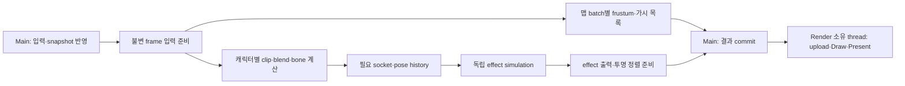

# 워로드 ALT V 사용자 캡처와 현재 Profiler 분석

> 이 보고서의 “현재/미계측”은 사용자 v2 캡처를 분석한 확장 전 상태다. 이후 요청한 실제 CPU/GPU 계측과 F1 패널의 구현 범위는 [Composition Profiler 결과](2026-09-11_PROFILER_CPU_GPU_STAGE_MEASUREMENT_RESULT.md)에 별도로 기록한다. 과거 캡처 수치는 새 구현의 성능 측정값이 아니다.

## G00. 실제 확인한 범위와 결론

사용자가 저장한 2026-09-11 18:08:48 캡처의 246~269번 24프레임은 CPU 평균 90.230ms, 그 역수는 11.083FPS다. 이 구간에서 가장 큰 명명된 실행 비용은 `Effect.Particle.Simulate` 평균 30.788ms이며, 최악의 재생 프레임 268에서는 67.037ms다. 입자 시뮬레이션의 직렬 실행과 느린 프레임 뒤 고정 스텝 따라잡기가 이번 하락을 설명하는 우선 조사 대상이다. 같은 구간의 `Effect.Particle.Render` CPU 제출도 평균 7.621ms다.

GPU 전체 프레임 값은 평균 90.573ms지만, 현재 timestamp 배치가 CPU Update 전부터 Present 뒤까지를 감싼다. CPU의 명령 공급 공백과 제출 지연을 포함할 수 있어 이 숫자만으로 GPU가 90ms 동안 연산으로 포화됐다고 확정할 수 없다. 실제 GPU pass별 실행 시간은 아직 측정하지 않는다.

이 문서는 기존 C++·JSON과 사용자가 저장한 기록을 읽고 분석한 보고서다. Profiler·JobSystem·GPU 최적화를 구현한 결과나 사용자 화면 PASS를 뜻하지 않는다. 에이전트는 Client/UI를 실행·조작하거나 화면을 캡처하지 않았다. 조사 시작 기준은 `codex/kouku-gate1-sequence-playback`, HEAD `2d7b96693fb93c397a26632c221d5d29bf4a2ae1`이며 여러 기존 작업의 dirty 변경을 보존했다. 아래 소스 위치는 이 작업 중 읽은 현재 파일 기준이다.

관련 선행 결과는 [공통 이펙트 성능 결과 G08](C:/Users/user/Desktop/LostArk/.md/GB/09-09/2026-09-09_EFFECT_SHADER_BUILD_AND_PLAY_ALL_PERFORMANCE_RESULT.md:424)과 [베른 프레임 회복 결과](C:/Users/user/Desktop/LostArk/.md/GB/09-11/2026-09-11_BERN_FRAME_TIME_RECOVERY_IMPLEMENTATION_RESULT.md)다. 이미 반영한 sprite/native mesh instancing, 준비된 module/distribution 조회, 업로드 재사용을 새 제안처럼 중복하지 않는다.

## G01. 캡처 원문과 비교 분모

| 기록 | 프레임 | 의미 |
|---|---:|---|
| [18:08:38 frame244](C:/Users/user/Desktop/LostArk/Client/Bin/ProfilerCaptures/profiler_20260911_180838_663_frame244.json) | 1~244, 244개 | 첫 저장 시점까지의 이력 |
| [18:08:48 frame438](C:/Users/user/Desktop/LostArk/Client/Bin/ProfilerCaptures/profiler_20260911_180848_723_frame438.json) | 1~438, 438개 | 첫 기록을 포함하는 같은 세션의 후속 저장 |

앞 244프레임의 `cpuFrameMs`, `cpuScopes`, `counters`는 두 파일에서 모두 같다. 첫 저장에서 pending이던 마지막 4개 GPU 결과가 후속 저장에서는 채워졌다. 두 파일을 독립된 반복 측정으로 합치지 않는다. 04:41:09의 1,200프레임은 이전 베른 문제 기록이므로 이번 ALT V의 비교 표본에서 제외했다.

후속 파일의 schema는 `LostArkProfilerCapture.v2`, mainThreadId는 `44732`, QPC 주파수는 `10,000,000 ticks/second`다. CPU scope 이름 36개, 샘플 25,239개이며 모든 관측 샘플은 thread 44732에서 끝났다. `droppedCpuScopes=0`, `droppedGpuFrames=0`이고 GPU 434프레임은 모두 latency 4, 마지막 4프레임은 pending이다. pending의 `gpuFrameMs=0`은 GPU 비용이 0이라는 뜻이 아니다.

JSON에는 class, skillId, effectId, clip, 카메라, viewport, render quality, 실행 빌드/EXE 식별자가 없다. 따라서 사용자 설명에 해당하는 기록으로 분석하되, 캡처 자체가 ALT V의 식별을 증명한다고 기록하지 않는다. 현재 데이터의 WARLORD ALT_V는 [PlayerSkills.json의 skillId 17250](C:/Users/user/Desktop/LostArk/Data/Balance/PlayerSkills.json:1614)이고, [Warlord.skillbindings.json](C:/Users/user/Desktop/LostArk/Data/Animation/Authored/Warlord/Warlord.skillbindings.json:99)의 두 clip은 `wgl_sk_super_guardianofprotection_01`, `wgl_sk_super_guardianofprotection_02`다.

| 후속 파일의 창 | 프레임 수 | CPU 평균 | CPU 중앙값 | CPU P95 | GPU 평균 | 1000 / CPU 평균 |
|---|---:|---:|---:|---:|---:|---:|
| 전체 1~438 | 438 | 44.845ms | 39.535ms | 79.459ms | 45.218ms | 22.299FPS |
| 이펙트 시뮬레이션이 없는 1~180 | 180 | 36.096ms | 35.552ms | 42.242ms | 36.683ms | 27.704FPS |
| 재생 221~280, 저장 프레임 245 제외 | 59 | 76.970ms | 74.610ms | 114.644ms | 77.448ms | 12.992FPS |
| 약 11FPS의 밀집 구간 246~269 | 24 | 90.230ms | 86.990ms | 116.110ms | 90.573ms | 11.083FPS |

P95는 정렬된 표본의 `floor((N-1)*0.95)` 위치를 사용했다. FPS 열은 CPU 측정 구간 평균의 역수이며 ImGui의 FPS 표시와 같은 통계는 아니다. 전체 GPU 평균은 valid 434개만 사용했다. 가시 map instance와 pipeline 수가 변하므로 이 표를 같은 카메라의 최적화 전후 고정 benchmark로 읽으면 안 된다. CPU 측정 밖의 메시지 처리와 60Hz 게이트 대기도 FPS 열에는 포함되지 않는다.

### Effect_Playback.cpp의 실제 비용

| scope | 1~180 평균 ms/frame | 246~269 평균 ms/frame | 246~269 calls/frame |
|---|---:|---:|---:|
| Client.Update | 13.664 | 56.013 | 1.00 |
| Effect.Service.Update | 0.000 | 35.762 | 1.00 |
| Effect.Playback.Update | 관측 없음 | 35.417 | 1.71 |
| Effect.Playback.FixedStep | 관측 없음 | 31.632 | 9.58 |
| Effect.Particle.Simulate | 관측 없음 | 30.788 | 19.17 |
| Effect.Playback.FrameRebuild | 관측 없음 | 3.989 | 1.83 |
| Client.Render | 22.403 | 34.187 | 1.00 |
| Render.Draw | 10.667 | 18.169 | 1.00 |
| Render.SceneHDR | 0.253 | 9.980 | 1.00 |
| Effect.Occurrence.Render | 관측 없음 | 9.710 | 3.42 |
| Effect.Particle.Render | 관측 없음 | 7.621 | 107.42 |
| Render.NonBlend | 6.330 | 3.970 | 1.00 |
| Render.Lights | 3.293 | 3.197 | 1.00 |
| ImGui.DeveloperTools | 1.897 | 2.104 | 1.00 |

이 값은 inclusive다. `Service.Update → Playback.Update → FixedStep → Particle.Simulate`는 포함 관계라 네 행을 더하면 같은 시간을 반복해서 센다. Render 쪽도 `Client.Render → Render.Draw → SceneHDR → Occurrence.Render → Particle.Render`가 중첩된다. `Effect.Particle.Simulate` 자체에는 현재 더 작은 profiler scope가 없어 그 30.788ms가 이 계측상 self time이기도 하다. `Client.Update`와 `Client.Render`의 계측되지 않은 self는 밀집 구간에서 각각 평균 12.662ms, 13.914ms다. 그 합 약 26.576ms의 세부 원인도 아직 구분되지 않았다.

`Effect.Particle.Simulate`는 [Step 내부 발생 처리](C:/Users/user/Desktop/LostArk/Client/Private/Effect_Playback.cpp:3899)와 [입자 Update 처리](C:/Users/user/Desktop/LostArk/Client/Private/Effect_Playback.cpp:4062) 두 블록이 같은 이름을 쓴다. 따라서 19.17 calls/frame을 19개의 emitter나 19개의 시뮬레이션 스텝으로 해석하면 안 된다. 두 블록을 별도 이름으로 분리해야 spawn과 update 중 어느 쪽이 큰지 알 수 있다.

### 고정 스텝 증폭과 저장 동작

| 프레임 | CPU | 주요 관측 |
|---:|---:|---|
| 220 | 77.079ms | Effect.Spawn.Commit 33.011ms. 시작 준비의 일시 비용 |
| 232 | 88.425ms | Particle.Simulate 24.929ms, FixedStep 5회 |
| 244 | 75.670ms | Particle.Simulate 24.897ms, FixedStep 5회 |
| 245 | 170.852ms | ImGui.DeveloperTools 90.577ms, Client.Render 124.594ms |
| 246 | 116.110ms | Particle.Simulate 54.507ms, FixedStep 10회 |
| 265 | 114.644ms | Particle.Simulate 55.244ms, FixedStep 9회, Playback.Update 2회 |
| 268 | 120.116ms | Particle.Simulate 67.037ms, FixedStep 13회, Particle.Render 10.150ms |
| 269 | 117.649ms | Particle.Simulate 62.141ms, FixedStep 15회, Particle.Render 12.404ms |

[Update](C:/Users/user/Desktop/LostArk/Client/Private/Effect_Playback.cpp:3563)는 전달받은 delta를 accumulator에 더하고 1/60초씩 소비하며, 한 Update의 상한은 [60스텝](C:/Users/user/Desktop/LostArk/Client/Private/Effect_Playback.cpp:30)이다. 느린 프레임 뒤에는 다음 프레임에 처리할 스텝이 늘어난다. 268의 FixedStep 13회는 Playback.Update 2회에 걸친 합계다. 여러 이펙트의 중첩인지 다른 호출 조건인지 캡처만으로 각 인스턴스를 구분할 수 없다.

[ProfilerTool의 Save JSON](C:/Users/user/Desktop/LostArk/Client/Private/ProfilerTool.cpp:109)은 UI 호출 안에서 Snapshot 전체 복사와 JSON 직렬화·파일 쓰기를 동기 실행한다. 첫 파일이 frame244까지 담고, 바로 다음 frame245의 DeveloperTools가 90.577ms이므로 저장이 이 프레임을 늘렸다는 해석이 강하게 뒷받침된다. 전용 저장 scope가 없어 90.577ms 전체를 파일 저장만의 확정 시간으로 부르지는 않는다. frame246의 따라잡기 증가도 이 간섭을 포함할 수 있다. 다만 저장 전 232~244와 저장 후 265~269에도 시뮬레이션 비용이 크므로 저장 오버헤드만 제거하면 해결된다고 결론내릴 수 없다.

## G02. 현재 Profiler의 측정 경계

[Client.cpp](C:/Users/user/Desktop/LostArk/Client/Default/Client.cpp:160)는 `Begin_Frame → Client.Update → Client.Render → End_Frame` 순서로 측정한다. CPU는 QPC로 잰 벽시계 경과 시간이다. CPU가 계산한 시간, OS에 의해 멈춘 시간, API 안에서 기다린 시간을 구분하지 않는다. Profiler 창의 `% CPU`도 코어 점유율이 아니라 scope inclusive / 측정된 CPU frame 합계다.

[CProfiler](C:/Users/user/Desktop/LostArk/Engine/Public/Profiler.h:116)는 최대 1,200프레임의 history를 보존한다. GPU query ring은 8개, 기본 read latency는 4프레임이다. [Resolve_GpuFrames](C:/Users/user/Desktop/LostArk/Engine/Private/Profiler.cpp:473)는 DONOTFLUSH로 준비된 결과만 읽어 의도적인 GPU 완료 대기를 하지 않는다. thread별 open scope는 최대 64개, 프레임 사이에 수집하는 완료 scope는 최대 4,096개다. 8ms 이상 long operation을 별도 256개 ring으로 보존하지만 이 별도 ring은 현재 JSON snapshot 구조에 포함되지 않는다.

worker scope는 시작 프레임이 아니라 끝난 프레임에 전체 시간으로 귀속된다. 긴 worker scope의 ms/frame 또는 % CPU가 커도 main thread stall과 같지 않다. frame을 가로질러 끝난 부모·자식은 같은 history frame에 있지 않을 수 있어 현재 frame 내부 nesting으로 계산하는 self time의 해석에도 주의해야 한다. 이번 기록에서는 worker sample이 없었으므로 그 상황은 관측하지 않았다.

창의 `Window (frames)`와 필터는 집계 표시를 제어한다. [Save_Json](C:/Users/user/Desktop/LostArk/Client/Private/ProfilerCaptureIO.cpp:75)은 Snapshot에 든 전체 history를 저장하며 화면에서 선택한 창이나 필터만 저장하지 않는다. live 표는 가장 최근 CPU/counter와 가장 최근 valid GPU를 함께 표시한다. [Get_LiveStats](C:/Users/user/Desktop/LostArk/Engine/Private/Profiler.cpp:235)가 GPU frame number를 따로 보존하므로 이 두 값은 보통 4프레임 다르다. JSON은 원래 해당 frame에 결과를 붙인다.

### 현재 소스의 전체 CPU scope 이름

현재 제품 C++의 `CProfilerScope` 호출 지점은 61곳, 고유 이름은 60개다. 아래는 소스에 존재하는 전체 이름이다. 실제 후속 캡처에는 이 중 36개만 등장한다. scope가 소스에 있다는 사실과 이번 재생에서 그 경로를 실행했다는 사실을 구분한다.

| 소유 파일·시작 위치 | 실제 scope 이름 |
|---|---|
| [Client.cpp:165](C:/Users/user/Desktop/LostArk/Client/Default/Client.cpp:165) | `Client.Update`, `Client.Render` |
| [GameInstance.cpp:172](C:/Users/user/Desktop/LostArk/Engine/Private/GameInstance.cpp:172) | `Engine.PriorityUpdate`, `Engine.ObjectUpdate`, `Engine.Physics`, `Engine.PostPhysicsUpdate`, `Engine.LevelUpdate`, `Engine.LateUpdate` |
| [Renderer.cpp:511](C:/Users/user/Desktop/LostArk/Engine/Private/Renderer.cpp:511) | `Render.Draw`, `Render.SubmitFrameProviders`, `Render.Shadow`, `Render.NonBlend`, `Render.SSAO`, `Render.Lights`, `Render.SceneHDR`, `Render.SceneColorSnapshot`, `Render.ScreenPosts`, `Render.Bloom`, `Render.Final`, `Render.DisplayOverlays`, `Render.UI`, `Render.Debug` |
| [ClientReplication.cpp:243](C:/Users/user/Desktop/LostArk/Client/Private/ClientReplication.cpp:243) | `Replication.Update` |
| [Effect_Playback.cpp:3547](C:/Users/user/Desktop/LostArk/Client/Private/Effect_Playback.cpp:3547) | `Effect.Playback.Update`, `Effect.Playback.HistoryUpdate`, `Effect.Playback.FixedStep`, `Effect.Particle.Simulate`(2곳), `Effect.TrailAfterimage.Simulate`, `Effect.Playback.FrameRebuild` |
| [Effect_Object.cpp:859](C:/Users/user/Desktop/LostArk/Client/Private/Effect_Object.cpp:859) | `Effect.Occurrence.Update`, `Effect.Occurrence.LateUpdate`, `Effect.Occurrence.Render` |
| [Effect_DocumentRenderer.cpp:20334](C:/Users/user/Desktop/LostArk/Client/Private/Effect_DocumentRenderer.cpp:20334) | `Effect.Particle.Render`, `Effect.Trail.Render` |
| [Effect_PresentationService.cpp:3201](C:/Users/user/Desktop/LostArk/Client/Private/Effect_PresentationService.cpp:3201) | `Effect.Prewarm.Advance`, `Effect.Spawn.Commit`, `Effect.Spawn.CommitWorldRoots`, `Effect.Service.Update`, `Effect.FollowAnchors.Update` |
| [Effect_Tool.cpp:3872](C:/Users/user/Desktop/LostArk/Client/Private/Effect_Tool.cpp:3872) | `EffectTool.Render`, `EffectTool.InitialIndexStep`, `EffectTool.AuthoringWindow`, `EffectTool.ModelViewWindow`, `EffectTool.DetailWindow`, `EffectTool.AllEffectsWindow`, `EffectTool.DataFilesWindow`, `EffectTool.ThumbnailTrim`, `EffectTool.ResourceGrid`, `EffectTool.DocumentLoad`, `EffectTool.DocumentLoad.Parse`, `EffectTool.DocumentLoad.ValidateDrawable`, `EffectTool.DocumentLoad.CanonicalBaseline`, `EffectTool.ArtistF.SourcePreparation`, `EffectTool.ArtistF.MaterialPreparation` |
| [Loader.cpp:220](C:/Users/user/Desktop/LostArk/Client/Private/Loader.cpp:220) | `Loader.LevelLoad`, `Loader.EffectPreparation` |
| [MainApp.cpp:2166](C:/Users/user/Desktop/LostArk/Client/Private/MainApp.cpp:2166) | `ImGui.DeveloperTools` |
| [ValtanActionWorkbench.cpp:1794](C:/Users/user/Desktop/LostArk/Client/Private/ValtanActionWorkbench.cpp:1794) | `Tool.Composition.ReloadCanonical`, `Tool.Composition.SaveReload` |
| [ValtanBossTool.cpp:1051](C:/Users/user/Desktop/LostArk/Client/Private/ValtanBossTool.cpp:1051) | `Tool.ValtanBossTool.ReloadCanonicalGraph` |

이번 캡처에서 관측한 36개 이름은 다음과 같다.

```text
Client.Update
Engine.PriorityUpdate
Engine.ObjectUpdate
Engine.Physics
Engine.PostPhysicsUpdate
Engine.LevelUpdate
Replication.Update
Engine.LateUpdate
Effect.Prewarm.Advance
Effect.Spawn.Commit
Effect.FollowAnchors.Update
Effect.Service.Update
Client.Render
Render.Draw
Render.SubmitFrameProviders
Render.Shadow
Render.NonBlend
Render.SSAO
Render.Lights
Render.SceneHDR
Render.ScreenPosts
Render.Bloom
Render.Final
Render.DisplayOverlays
Render.UI
Render.Debug
ImGui.DeveloperTools
Effect.Playback.FrameRebuild
Effect.Playback.FixedStep
Effect.Particle.Simulate
Effect.TrailAfterimage.Simulate
Effect.Occurrence.Update
Effect.Occurrence.LateUpdate
Effect.Playback.Update
Effect.Occurrence.Render
Effect.Particle.Render
```

### 21개 counter와 실제 기록자

정의는 [Profiler.h:17](C:/Users/user/Desktop/LostArk/Engine/Public/Profiler.h:17), JSON 이름은 [ProfilerCaptureIO.cpp](C:/Users/user/Desktop/LostArk/Client/Private/ProfilerCaptureIO.cpp:13)다. 매 프레임 끝에 값을 가져오고 0으로 초기화한다.

| JSON counter | 실제 writer | 읽는 의미·한계 |
|---|---|---|
| `drawCalls` | VIBuffer.cpp, VIBuffer_Instance.cpp, VIBuffer_ParticleRect.cpp, Mesh.cpp | 해당 Engine wrapper를 통과한 실제 Draw 제출 수 |
| `instancedDrawCalls` | VIBuffer_Instance.cpp, VIBuffer_ParticleRect.cpp, Mesh.cpp | 해당 instanced Draw 수 |
| `instances` | 위 세 instanced 경로 | 제출된 instance 수의 합. 고유 object 수가 아님 |
| `indices` | 위 네 draw 경로 | index 수, instanced는 index × instance. 고유 vertex나 고유 triangle 수가 아님 |
| `renderSubmissionsPriority` | 현재 writer 없음 | 선언·출력 키만 존재. 0을 실제 queue가 비었다는 근거로 쓰지 않음 |
| `renderSubmissionsShadow` | 현재 writer 없음 | 위와 같음 |
| `renderSubmissionsNonBlend` | 현재 writer 없음 | 위와 같음 |
| `renderSubmissionsBlend` | 현재 writer 없음 | 위와 같음 |
| `mapPlacements` | MapAssetObject::Late_Update, MapStaticBatchObject::Late_Update | 전체 해당 placement 수. 가시 draw 수가 아님 |
| `mapVisibleInstances` | MapAssetObject 및 MapStaticBatchObject의 가시 제출/업로드 경로 | 해당 경로가 센 visible instance 합. 고유 object/화면 pixel 수가 아님 |
| `mapBatchCount` | MapStaticBatchObject::Late_Update | 존재하는 batch object 수. 실제 가시 draw call 수가 아님 |
| `mapFallbackObjects` | MapAssetObject::Late_Update | batch 밖 개별 map object 수. 전부 화면에 보인다는 뜻이 아님 |
| `textureRequests` | 현재 writer 없음 | 0을 texture load가 없었다는 증거로 쓰지 않음 |
| `texturePathHits` | 현재 writer 없음 | cache hit rate 미측정 |
| `textureContentHits` | 현재 writer 없음 | cache hit rate 미측정 |
| `textureUniqueSrvs` | 현재 writer 없음 | SRV 수 미측정 |
| `textureEstimatedGpuBytes` | 현재 writer 없음 | VRAM 사용·budget을 측정하지 않음 |
| `navigationQueries` | Engine NavPathFollower::Set_Destination | Client 경로의 호출 수. Server navigation과 별개 |
| `navigationExpandedNodes` | 위 경로 | 탐색 확장 노드 합 |
| `navigationQueryMicroseconds` | 위 경로 | Find_Path 벽시계 시간 합, 단위 µs |
| `navigationPathCells` | 위 경로의 SUCCESS 분기 | 반환 waypoint 수의 합 |

writer의 대표 위치는 [VIBuffer.cpp:28](C:/Users/user/Desktop/LostArk/Engine/Private/VIBuffer.cpp:28), [Mesh.cpp:231](C:/Users/user/Desktop/LostArk/Engine/Private/Mesh.cpp:231), [ParticleRect.cpp:142](C:/Users/user/Desktop/LostArk/Engine/Private/VIBuffer_ParticleRect.cpp:142), [MapStaticBatchObject.cpp:91](C:/Users/user/Desktop/LostArk/Client/Private/MapStaticBatchObject.cpp:91), [MapAssetObject.cpp:139](C:/Users/user/Desktop/LostArk/Client/Private/MapAssetObject.cpp:139), [NavPathFollower.cpp:46](C:/Users/user/Desktop/LostArk/Engine/Private/NavPathFollower.cpp:46)다. renderSubmissions 4개와 texture 5개는 현재 Engine/Client 제품 소스에서 writer가 없다.

Engine counter는 모든 D3D 호출을 가로채는 계측기가 아니다. 예를 들어 [ImGui backend의 직접 DrawIndexed](C:/Users/user/Desktop/LostArk/Engine/External/imgui/backends/imgui_impl_dx11.cpp:325)는 위 draw counter를 갱신하지 않는다. GPU pipeline query의 기하량과 Engine counter가 정확히 같은 분모일 것이라고 가정하면 안 된다. `CopyResource`도 draw counter로 나타나지 않는다.

### GPU pipeline 항목

`iaVertices`, `iaPrimitives`, `vsInvocations`, `gsInvocations`, `gsPrimitives`, `clipperInvocations`, `clipperPrimitives`, `psInvocations`, `hsInvocations`, `dsInvocations`, `csInvocations` 11개다. D3D11 pipeline statistics를 전체 query 구간에서 센다. 각 stage의 호출·처리량이며 stage별 시간이나 GPU 사용률이 아니다.

1~180의 PS 호출은 평균 약 2억 7,707만, 밀집 구간 246~269는 평균 약 2억 5,529만이고, 밀집 구간 최대는 약 3억 6,720만이다. 평균 PS 수가 오히려 줄어드는 구간에서도 CPU 시간이 늘어났다. 카메라·가시 집합 변화와 여러 pass가 섞였으므로 ALT V의 overdraw 기여를 이 전체 합에서 단독 분리할 수 없다. PS 수가 크다는 것은 pixel 처리량 조사를 진행할 근거지만 GPU 포화나 특정 shader 원인의 확정 증거는 아니다.

## G03. Profiler가 아직 구분하지 못하는 부분

| 경계 | 현재 보이는 상위 값 | 필요한 구분 |
|---|---|---|
| 입자 발생·갱신 | Particle.Simulate 합계 | spawn/update 분리, active/born/dead 입자 수, element/effect ID, module별 비용, fixed-step 수와 backlog |
| 이펙트 제출 | Occurrence.Render/Particle.Render | mesh/sprite/decal/afterimage, material bind, shader Apply, upload/Map, 실제 draw 및 fallback 이유 |
| 애니메이션 | ObjectUpdate/LateUpdate 내부 | clip sampling, blend, bone world, skin palette, socket/history, character별 bones·tracks |
| 맵 | NonBlend + map counter | cull/bounds, visible-list 작성, sort, material bind, instance upload, opaque와 shadow 실제 제출 |
| 조명 | Render.Lights CPU | scene/transient 광원 수, light별 화면 면적, forward/deferred 비용, GPU pass별 시간 |
| 네트워크 | Replication.Update 일부 | NetworkManager.Update, 수신 queue/drain/decode, RTT·jitter·bytes, Server tick/navigation/combat |
| main의 남은 시간 | Client.Update/Render self | picking/input/audio, camera, ImGui backend draw, text rendering, Present의 CPU 대기 |
| CPU 하드웨어·스케줄러 | scope 벽시계 | 실제 thread CPU 사용, context switch, ready/wait, lock 경합, cache miss, allocation, SIMD 효율 |
| GPU | frame timestamp + pipeline | pass timestamp, GPU busy/idle, shader 병목, texture bandwidth, overdraw, VRAM budget/residency, 복사·업로드 비용 |
| 실행 조건 | 저장 안 함 | build/revision, adapter, viewport, render quality, debug layer, scene/skill/effect ID |

`Render.SSAO`, `Render.Bloom`, `Render.Lights`가 각각 0.1ms/0.05ms/3ms처럼 보여도 이것은 CPU가 그 pass 명령을 제출한 시간이다. GPU가 그 pass를 실행하는 시간은 별도 query가 있어야 한다. [GPU 시작](C:/Users/user/Desktop/LostArk/Engine/Private/Profiler.cpp:449)과 [종료](C:/Users/user/Desktop/LostArk/Engine/Private/Profiler.cpp:466) timestamp 사이에는 Update와 Render, [Present(0,0)](C:/Users/user/Desktop/LostArk/Engine/Private/Graphic_Device.cpp:144)가 들어간다. VSync 인자가 0이어도 Present/driver 대기가 0이라는 보장은 없고 현재 별도 scope도 없다.

### SceneColor 복사의 현재 코드와 계측 구멍

[Renderer.cpp:576](C:/Users/user/Desktop/LostArk/Engine/Private/Renderer.cpp:576)의 `Render.SceneColorSnapshot`은 초기 snapshot 호출 한 군데만 감싼다. 현재 [Effect_DocumentRenderer.cpp:22325](C:/Users/user/Desktop/LostArk/Client/Private/Effect_DocumentRenderer.cpp:22325)는 scene-color를 요구하는 각 occurrence 앞에서 `Refresh_SceneColorSnapshot`을 호출한다. [Refresh → Capture](C:/Users/user/Desktop/LostArk/Engine/Private/Renderer.cpp:985)는 전체 HDR target 복사와 MRT/SRV 해제·복구를 수행하지만 그 함수 자체에는 scope/counter가 없다.

따라서 occurrence별 refresh는 `Effect.Occurrence.Render` 또는 `Render.SceneHDR`의 self에 묻힌다. 복사 횟수·bytes·GPU 시간은 현재 JSON에서 알 수 없다. 이번 scopeNames에 `Render.SceneColorSnapshot`이 없다는 사실로 복사 0회라고 단정하지 않는다. 과거 문서의 프레임당 1회 설명을 현재 경로에 그대로 적용하지 않는다. 이 복사는 앞서 그린 투명 occurrence를 다음 occurrence가 읽는 순서 의미가 있으므로 무조건 프레임당 1회로 합치면 시각 결과가 바뀔 수 있다.

### 멀티스레드 계측 전에 정리할 Profiler 자체 비용

[Begin_Scope](C:/Users/user/Desktop/LostArk/Engine/Private/Profiler.cpp:145)는 매 호출 `Intern_Name`을 거치며, [Intern_Name](C:/Users/user/Desktop/LostArk/Engine/Private/Profiler.cpp:418)은 문자열 key 생성과 전역 mutex 획득을 한다. [End_Scope](C:/Users/user/Desktop/LostArk/Engine/Private/Profiler.cpp:174)도 같은 mutex를 잡아 공유 vector에 넣는다. 현재 25,239개의 관측 샘플이 모두 main thread였으므로 이것이 기존 worker 경합의 실측 증거는 아니다. 이후 작업을 잘게 나누어 worker마다 scope를 넣으면 Profiler가 공통 lock 병목이 될 수 있으므로 사전 등록한 scope ID와 thread-local sample buffer의 프레임 합류를 함께 검토한다. 실제 계측 오버헤드를 on/off 비교하여 확인한다.

counter 값은 atomic이지만 [m_FrameActive](C:/Users/user/Desktop/LostArk/Engine/Public/Profiler.h:196)는 일반 bool이고 Add/Set_Counter가 이를 읽는다. 현재 main 중심 writer를 worker로 옮길 경우에는 frame 귀속·동기화 계약을 먼저 정해야 한다. thread-safe scope 지원과 모든 counter/frame API의 임의 thread 사용을 같은 계약으로 생각하면 안 된다.

## G04. 현재 증거에 맞는 개선 우선순위

| 순서 | 기존 코드에서 할 작업 | 개선 판정에 사용할 증거 |
|---:|---|---|
| 1 | Profiler 저장을 프레임의 동기 직렬화에서 분리하고, immutable snapshot의 쓰기를 제한된 worker에 맡김. 실패 이유·최종 파일 rename 계약 보존 | 저장 전용 scope, gameplay frame과 저장 frame의 분리, 저장 중 clock 간섭 감소 |
| 2 | 기존 Particle.Simulate를 Spawn/Update로 나누고 active particle·fixed steps·backlog·effect ID 추가 | 밀집 구간 30~67ms가 어디에 쓰이는지 확인 |
| 3 | CEffectPlayback의 기존 준비된 데이터와 element state를 실행 index/연속 배열로 개선하고, 독립 element/occurrence 계산을 묶은 작업으로 병렬화 | 같은 seed/time/원본 입자 수·순서·RNG·event 결과 유지, 같은 구간의 시뮬레이션 ms 감소 |
| 4 | FrameRebuild 및 Particle.Render에서 반복 material 준비·upload·fallback·snapshot을 분리 계측하고 기존 instancing 범위를 확인 | draw 수만이 아니라 CPU 제출 시간·bytes·Map 횟수·실제 출력 비교 |
| 5 | Render/Present CPU scope와 pass별 GPU timestamp를 추가한 뒤 큰 광원·투명면·복사·후처리를 순위화 | 같은 카메라/해상도/품질의 CPU와 GPU pass p50/p95, PS 수·복사량 동반 기록 |
| 6 | 애니메이션·맵 culling/제출을 세분화한 뒤 JobSystem 공유 | 각 subsystem의 실제 독립 일감·join 대기와 프레임 임계 경로 확인 |

우선순위 3은 particle lifetime이나 step을 버려서 빨라 보이게 만드는 방향이 아니다. 원본 state, RNG, event 전달, attachment, 프레임 출력의 기존 계약을 유지하며 독립 계산과 데이터 접근을 바꾸는 작업이다. GPU compute 이관도 현재 범용 source module과 CPU-side attachment/event가 실제로 이관 가능한지 분리한 뒤 추진한다. Work stealing deque만 추가하면 현재의 메모리 조회·직렬 의존·GPU 제출이 자동으로 해결되지는 않는다.

현 시점에서 확정한 것은 사용자 기록의 느린 창, 명명된 CPU 비용, 고정 스텝 증가, 계측 writer의 유무다. GPU 포화의 정도, 특정 material/shader의 기여율, particle module별 비용, scene-color 복사 횟수, DOD/JobSystem 적용 후 실제 FPS는 미확정이다. 임의 개선율이나 60FPS 보장치를 쓰지 않는다.

조사 중 현재 PC를 WMI로 읽은 결과는 Intel Core i5-13500(14코어/20 logical processor), NVIDIA GeForce RTX 4070, 표시 driver version 32.0.15.9186, 물리 RAM 68,448,337,920 bytes(약 63.75GiB)다. 이것은 현재 PC 정보이며 JSON에 저장된 실행 당시 metadata는 아니다. WMI AdapterRAM의 제한된 값으로 실제 VRAM 용량이나 메모리 포화를 추정하지 않았다.

## G05. 수행한 검증과 다음 사용자 측정

두 최신 JSON을 parse하고 앞 244프레임의 CPU/scopes/counters 동일성을 확인했다. 후속 캡처의 frame별 inclusive/self 시간, calls/frame, 평균·중앙값·P95, GPU valid/latency, thread·drop 수를 계산했다. 현재 CProfilerScope 호출과 counter writer를 제품 소스에서 조회했고, 이전 성능 구현 결과와 현재 Renderer의 SceneColor 경로를 대조했다. 이 보고서 작성 외의 제품 소스는 수정하지 않았다.

다음 성능 비교에서는 사용자가 같은 위치·카메라·해상도·품질에서 F1 → Profiler → Reset/Capture를 사용하고, 잠시 대기한 뒤 ALT V를 한 번 실행해 효과가 끝날 때까지 기록한다. 효과가 끝난 다음 Capture를 끄고 Save JSON을 누르면 현재 동기 저장의 간섭을 재생 구간 밖으로 분리할 수 있다. 이는 후속 사용자 측정 경로이며 에이전트가 Client/UI를 대신 실행하거나 결과를 관찰한 기록이 아니다.

## G06. DOD로 바꿀 데이터와 유지할 소유권

DOD는 객체 이름을 바꾸는 작업이 아니라, 같은 계산이 필요한 값을 메모리에 연속으로 놓고 같은 순서로 처리하는 설계다. 현재 [CEffectPlayback의 particle 상태](C:/Users/user/Desktop/LostArk/Client/Public/Effect_Playback.h:229)는 많은 필드와 문자열을 가진 AoS이고 element state는 문자열 key map을 사용한다. 준비된 module/distribution 조회와 sprite/native mesh instancing은 이미 있으므로, 그 다음 반복 비용을 줄이는 방향으로 이어간다.

| 대상 | 현재 경로에서 바꿀 내용 | 보존할 계약 |
|---|---|---|
| 문서 준비 | stable element/material ID를 Stage에서 dense 실행 index로 resolve하고 module 종류별 실행 목록을 미리 구성 | JSON 저장 ID는 계속 stable ID. index를 파일에 저장하지 않음 |
| 입자 상태 | position/velocity/age/lifetime/color/size처럼 매 스텝 쓰는 값과 source 이름/저작 metadata를 분리. module별 SoA 또는 SIMD 폭의 AoSoA를 측정해 선택 | 필요한 field만 이전하고 기존 material/attachment 의미 유지 |
| 할당 | 예상 최대 입자와 출력량에 맞춰 vector capacity·scratch를 재사용. 불필요한 string 복사와 frame 중 capacity 증가를 계측·제거 | 최대치 초과 시 명확한 성장/실패 처리. 입자를 조용히 버리지 않음 |
| 생존 목록 | 죽은 입자 제거와 살아 있는 출력 모으기를 연속 pass로 처리 | event/provider index 또는 투명 순서가 의미를 가지면 무조건 swap-remove하지 않음 |
| 실행 kernel | 같은 source module 조합을 묶어 반복 type switch와 hash lookup 감소 | class별 두 번째 시뮬레이터를 만들지 않고 기존 CEffectPlayback 내부 실행 계획을 개선 |
| 프레임 출력 | worker별 count → prefix sum → 할당된 구간 쓰기 → stable merge | worker 완료 순서가 draw/event/RNG 순서로 유출되지 않음 |

SoA가 모든 곳에서 자동으로 빠른 것은 아니다. 여러 field를 항상 함께 쓰는 작은 입자군은 AoS도 유리할 수 있고, 너무 많은 배열은 접근과 관리 비용을 늘린다. Spawn/Update 분리 계측과 대표 source module 집합에서 비교한 뒤 결정한다. 문자열 lookup 제거, capacity 재사용, 반복 불변 계산 이동은 병렬화 전에 적용하기 좋은 범위다.

[provider 참조](C:/Users/user/Desktop/LostArk/Client/Private/Effect_Playback.cpp:4997)는 다른 emitter 상태를 읽는다. 따라서 `for element`를 그대로 ParallelFor로 감싸면 같은 프레임의 원본 값 대신 이전 값 또는 작성 중인 값을 읽을 수 있다. Stage에서 provider/event/attachment 의존성을 수집하고, 독립 occurrence를 우선 병렬화한다. 한 occurrence가 대부분의 비용이면 의존 그래프의 독립 단계 또는 한 emitter의 독립 particle update 구간으로 더 나눈다. 같은 emitter의 RNG는 공유 generator를 여러 worker가 임의 순서로 소비하지 않도록 기존 순서대로 입력을 준비하거나 명시적으로 검증한 결정적 스트림 계약을 사용한다.

fixed-step 상한 60을 낮추거나 delta를 버리는 것은 성능 문제의 첫 해결책으로 삼지 않는다. 순간 backlog, 실제 소비 step, 출력 시간 지연을 먼저 기록한다. cosmetic catch-up 정책을 바꿀 때도 event·lifetime·seek 결과가 바뀌는지 별도로 확인해야 한다. 서버 gameplay step이나 damage 판정을 Client 효과 성능에 맞춰 바꾸지 않는다.

## G07. JobSystem과 Scheduler를 연결할 위치

현재 Engine/Client 제품 소스에는 범용 JobSystem/Scheduler/Chase–Lev work-stealing pool이 없다. Loader thread, NetworkManager receive thread, PhysX dispatcher 2개는 존재하지만 이펙트·animation·map의 공통 frame 작업을 나누는 pool은 아니다. `Effect_LoadPreparationJob`도 준비 결과의 epoch/mailbox 관리이며 frame 계산 scheduler와 구분한다.

JobSystem은 짧은 계산 단위와 실행 pool을 제공하고, Scheduler는 의존성이 끝난 job을 실행 가능 상태로 만드는 역할을 맡긴다. GameObject Update 전체를 무작정 worker로 보내면 Transform, Layer, shared service, D3D state에 대한 현재 직렬 가정이 깨진다. 아래는 제안하는 의존 순서이며 이번 작업에서 구현한 구조가 아니다.



| 작업 | 처음 나눌 단위 | worker에서 하지 않을 동작 |
|---|---|---|
| Animation | 서로 다른 character/model의 pose. 한 skeleton 안에서는 parent 순서 보존 | live CModel/Transform을 다른 reader와 동시에 수정, 동일 FX11 shader 변수 설정 |
| Effect | 독립 occurrence 또는 의존 그래프 단계의 emitter. 큰 independent particle 배열은 구간 분할 | shared vector push_back, unordered_map 동시 수정, shared RNG 소비, 즉시 D3D 호출 |
| Map | 기존 static batch의 placement 구간별 bounds/frustum 판정 및 가시 index 작성 | CGameObject layer 삽입/삭제, 공유 render queue에 경쟁적으로 push |
| 업로드 준비 | worker별 연속 instance/palette/constant 데이터 작성 | immediate context Map/Draw/Apply, GPU 결과를 기다리는 동기 GetData |
| 파일 저장 | immutable profiler snapshot 직렬화·파일 저장을 제한된 별도 작업으로 실행 | gameplay 계산 pool의 모든 worker를 blocking I/O로 점유 |

worker는 게임 시작 시 만든 고정 pool을 재사용한다. 프레임마다 thread 생성·join을 하지 않는다. i5-13500의 20 logical processor를 모두 20개 동등한 전용 worker로 보는 설정도 피한다. main/render, 네트워크, PhysX, Server 동시 실행과 P/E core 차이가 있으므로 작은 worker 수부터 늘려 main의 p95와 전체 frame 임계 경로로 고른다. 작업량이 작은 effect까지 job으로 쪼개지 않고 연속 구간을 batch로 묶는다. 적절한 chunk 크기는 queue 비용, cache locality, 가장 늦은 job의 시간을 함께 측정해 조정한다.

프레임 데이터는 main이 snapshot을 고정한 뒤 worker가 읽고, job 완료 후 main이 결과를 commit한다. double buffer 또는 frame arena는 해당 frame의 job이 전부 끝나기 전에 재사용하지 않는다. 문서 reload·level 종료는 generation/epoch로 늦은 결과를 거부하고 협력 취소와 bounded join을 사용한다. GPU 작업이 CPU job 완료보다 오래 살 수 있으므로 CPU arena 종료와 GPU buffer 재사용의 완료 조건도 분리한다.

### Chase–Lev deque와 work stealing의 실제 역할

각 worker가 자기 deque의 bottom에 push/pop하고, 남는 worker가 다른 deque의 top에서 작업을 훔친다. local 작업은 최근 작업부터 실행해 locality를 얻고, thief는 오래된 독립 일을 가져가 부하를 나눈다. 여러 producer가 같은 bottom에 넣는 일반 MPMC queue가 아니므로 main/network 등 외부 제출은 별도 injection queue 또는 소유 worker로 전달하는 경로가 필요하다. 이 소유권이 핵심이다. [Chase–Lev 원 논문](https://www.cs.wm.edu/~dcschmidt/PDF/work-stealing-dequeue.pdf)

구현에서 확인할 것은 다음과 같다.

1. 마지막 원소에 대한 owner pop과 thief steal의 경쟁은 원자적 승자 한 명만 보장해야 한다. top/bottom의 memory order를 추측해 relaxed로 바꾸지 않는다. 검증된 C++ 구현의 가정과 용량/overflow 계약부터 검토한다.
2. ring을 키운 뒤 thief가 아직 이전 배열을 읽을 수 있다. 성장한 순간 old buffer를 free하지 않고 수명 관리 방식까지 포함한다. 초기 고정 용량을 택한다면 overflow 때 유실 없이 injection/확장으로 처리하는 계약이 있어야 한다.
3. top/bottom과 worker 통계의 false sharing을 줄이고, job payload는 작은 참조·index 중심으로 둔다. cache line 정렬만으로 전체 데이터 경쟁이 해결되지는 않는다.
4. thief는 victim 선택을 분산하고 빈 큐를 무한히 훑지 않는다. 짧게 탐색한 뒤 event/semaphore로 park하며, publish와 sleep 사이 wakeup 유실을 막는다. spin 시간은 실측으로 정한다.
5. worker가 같은 pool의 자식 job을 기다리며 모두 block되면 아무도 남은 일을 실행하지 못한다. dependency counter와 continuation으로 후속 job을 준비하거나, 대기 중 실행 가능한 일을 돕는 방식이 필요하다.
6. 완료 순서는 비결정적이어도 simulation 결과 순서는 기존 계약으로 정렬한다. 재현성을 deque의 실행 순서에 기대지 않는다.

Profiler에는 job 수·실행 시간·enqueue-to-start 대기·성공/실패 steal·worker idle·join 대기·가장 긴 dependency chain을 추가해야 한다. 성공 steal이 많다는 것 자체는 목표가 아니다. cache 이동과 작은 job의 queue 오버헤드가 커지면 steal 수는 늘어도 frame은 느려질 수 있다. 공유 Profiler mutex도 G03처럼 함께 개선해야 병렬 작업을 계측하는 도구가 병목을 새로 만들지 않는다.

평균 90.230ms 중 30.788ms 부분만 가상으로 4배 빨라지고 나머지가 모두 같다고 놓으면 단순 계산은 약 67.139ms, 14.90FPS다. 이는 예상 성능이 아니라 나머지 직렬 비용을 무시할 수 없다는 설명이다. 실제로는 fixed-step backlog 감소, 겹친 작업, 메모리 대역폭과 합류 대기 때문에 이 계산과 달라진다. 11FPS에서 60FPS까지의 차이를 deque 하나의 개선으로 약속할 근거는 없다.

### Fiber를 넣을 시점과 Winters 비교

사용자가 설명한 Winters의 작은 계산량과 달리 이번 기록에는 시뮬레이션만 평균30.8ms·최악67ms가
있다. worker를 매 프레임 생성하지 않고 고정 pool에서 큰 독립 계산 구간을 재사용하면 분배 비용을
상쇄할 가능성이 높다. 다만 이것은 Winters 소스를 직접 대조한 결론이 아니라 사용자 설명과
이번 LostArk 실측을 비교한 판단이다. 한 occurrence가 부하 대부분이면 occurrence만 job으로
나눠서는 한 worker에 긴 작업이 남으므로 그 안의 의존 단계/입자 구간 분할까지 필요하다.

Fiber는 자기 stack을 보존한 채 job의 의존성 대기 지점에서 실행을 양보하고, 같은 worker에서
다른 준비된 job을 처리하게 하는 수단이다. 코어를 늘리거나 계산량 자체를 줄이지는 않는다.
처음에는 dependency counter와 continuation으로 runnable job을 연결하고, 중첩된 동기 형태의
대기를 많이 유지해야 할 때 fiber를 평가할 수 있다. blocking 파일 I/O를 fiber 안에서 호출하면
명시적인 비동기 연계가 없는 한 실행 thread도 함께 막힌다.

Windows fiber는 실행 중인 thread의 TLS를 사용하므로 worker 이동이 허용된 fiber에서
thread-local scratch·scope stack·thread 소유 자원을 이전 thread의 값이라고 가정하면 안 된다.
필요 상태는 job/fiber context 또는 FLS로 관리하고, D3D immediate context·Present 등 thread 소유
작업은 해당 thread에 고정한다. stack pool의 크기·재사용·취소·shutdown 수명도 scheduler가
관리해야 한다. [Microsoft fiber 실행·TLS/FLS 계약](https://learn.microsoft.com/en-us/windows/win32/procthread/fibers)

현재 CProfiler의 thread-local open scope를 켜 둔 채 fiber가 suspend/migrate하면 같은 worker의
다른 job과 nesting이 섞이거나 대기 시간이 실행 시간에 합쳐질 수 있다. fiber 도입 시 jobId·parentId,
실행 segment, suspend/resume과 wait 시간을 분리해서 기록한다. 최초 목표는 fiber/deque의 기능 수가
아니라 시뮬레이션 p95, 고정 step backlog와 frame 임계 경로의 감소다.

## G08. 애니메이션과 맵의 구체적인 최적화 후보

[CAnimation](C:/Users/user/Desktop/LostArk/Engine/Private/Animation.cpp:99)과 [CModel](C:/Users/user/Desktop/LostArk/Engine/Private/Model.cpp:1059)의 clip/blend/bone 처리는 현재 직렬이다. 서로 다른 캐릭터부터 job으로 나누고, 같은 skeleton의 bone world는 parent 선행 순서를 지킨다. pose 계산이 끝난 뒤 필요한 socket을 한 번 뽑아 effect에 전달한다. SIMD나 bone level별 병렬화는 캐릭터별 job만으로 부하가 충분히 나뉘지 않을 때 평가한다.

[pose history sampling](C:/Users/user/Desktop/LostArk/Engine/Private/Model.cpp:459)은 일부 anchor만 필요한 요청에도 전체 skeleton vector를 다루며 Debug 경로에는 live-state 복사와 두 번째 sample 검증이 있다. 이 비용을 먼저 측정하고 같은 model/clip/time/revision sample의 재사용, 필요한 ancestor closure만 계산하는 선택을 검토한다. Debug 검증을 삭제한 결과를 제품 최적화 성과로 섞지 말고 동일 조건의 Debug/Release 수치를 따로 남긴다. 이번 ALT V 캡처에는 pose 전용 scope가 없으므로 이 항목이 ALT V의 확정 원인이라는 뜻은 아니다.

[Mesh의 bone palette](C:/Users/user/Desktop/LostArk/Engine/Private/Mesh.cpp:162)는 mesh/pass마다 큰 행렬 배열을 준비하고, body와 shadow에서 관련 작업이 반복된다. animation pose revision과 mesh bone-remap 조합으로 palette를 재사용해 CPU 복사와 constant upload 횟수를 줄일 수 있다. frame이 같다는 이유만으로 cache를 재사용하면 같은 프레임의 pose 변경을 놓칠 수 있으므로 revision이 필요하다. 화면 밖 캐릭터의 animation LOD도 socket·gameplay presentation·history 소비 여부를 따져 낮춰야 한다.

맵은 [CMapStaticBatchObject](C:/Users/user/Desktop/LostArk/Client/Private/MapStaticBatchObject.cpp:422)에 instancing, frustum culling, camera revision cache, 변하지 않은 upload 건너뛰기가 이미 있다. 다음 후보는 batch별 culling job, 큰 공간 범위의 cluster 분할, opaque/shadow용 가시 목록 구분, geometry/material/state별 제출 정리다. 화면 밖을 계속 계산하는지, batch가 너무 커서 일부만 보여도 전체를 보내는지 측정한다. 기존 CModel → CMaterial 경로와 MAP_LOAD_SCOPE를 유지하며 별도 map renderer를 만들지 않는다.

occlusion culling은 frustum 안이지만 벽 뒤인 물체를 추가로 제외한다. D3D11 occlusion query를 쓴다면 결과를 나중 프레임에 비동기 소비하고 보수적으로 유지해야 한다. 물체마다 query를 발행한 뒤 즉시 GetData로 기다리면 CPU/GPU 동기 대기가 더 커질 수 있다. 카메라 이동과 가림 해제 때 pop-in 여부도 사용자 확인 대상이다.

## G09. GPU를 처음 볼 때의 구분과 이 프로젝트의 적용 순서

CPU는 애니메이션·입자 위치를 계산하고 GPU에 그릴 명령과 자료를 보낸다. GPU는 대략 vertex 처리 → 삼각형을 화면에 펼치기 → pixel shader → 깊이/색 합성 순서로 이미지를 만든다. 프레임 비용은 삼각형 수 하나로 결정되지 않는다. 작은 원 하나도 화면을 크게 덮고 투명하게 여러 번 겹치면 많은 pixel 연산이 생긴다. 반대로 draw가 많아도 GPU 연산이 가벼우면 CPU의 명령 제출이 먼저 한계에 도달할 수 있다.

| 병목 종류 | 쉬운 의미 | 이번 프로젝트에서 먼저 측정할 것 |
|---|---|---|
| CPU 제출/공급 | GPU에게 다음 일을 주기까지 CPU가 늦음 | Render self, Apply/bind, Map, Present CPU, GPU 구간 사이 idle |
| Geometry | 많은 정점·삼각형·skinning을 처리 | VS/IA count, shadow 반복, model LOD, pose palette |
| Pixel/overdraw | 같은 화면 위치를 여러 투명면·빛·후처리가 반복 처리 | pass별 GPU timestamp, PS invocation, 화면 점유 면적 |
| Texture/메모리 대역폭 | texture·render target을 많이 읽고 씀 | SceneColor copy 횟수/bytes, RT format, sampling, GPU cache/bandwidth |
| Synchronization | CPU와 GPU 또는 읽기/쓰기 자원이 서로 기다림 | Map/GetData/Present, copy, read/write hazard, 자원 재사용 |
| VRAM residency | 필요한 texture/buffer가 GPU 메모리 budget을 넘나듦 | DXGI budget/current usage 및 eviction, 실제 resource 크기 |

현재 전체 query에 더해 Shadow, Opaque, SSAO, Lights, Effects, SceneColorCopy, Bloom, Final, UI에 GPU timestamp를 배치하고 disjoint/frequency로 유효성을 확인한다. query는 ring으로 몇 프레임 뒤 DONOTFLUSH로 읽는다. 처음에는 pass 단위만 측정하고 필요할 때 무거운 occurrence로 좁혀 query 자체의 비용을 제한한다. timestamp는 그 구간의 GPU 시간이고 pipeline statistics는 호출 수다. 어느 쪽도 단독으로 shader가 ALU·texture·bandwidth 중 어디에 묶였는지 설명하지는 못한다. [D3D11 query 정의](https://learn.microsoft.com/en-us/windows/win32/api/d3d11/ne-d3d11-d3d11_query)

### 이펙트에 적용할 GPU 기법

첫째, 현재 sprite는 [instance ring buffer](C:/Users/user/Desktop/LostArk/Engine/Private/VIBuffer_ParticleRect.cpp:80)를 이미 사용한다. native mesh도 [occurrence 안의 submesh instancing](C:/Users/user/Desktop/LostArk/Client/Private/Effect_DocumentRenderer.cpp:20176)이 있다. 다음은 native mesh의 반복 WRITE_DISCARD/동적 buffer 성장, material 상수 준비, 호환 occurrence 간 batch 범위다. frame 중 필요한 capacity를 준비하고 append upload를 검토하되 GPU가 읽는 구간을 덮어쓰지 않는다. constant buffer의 NO_OVERWRITE 지원은 D3D11.1 feature 확인이 필요하며 vertex buffer와 무조건 같은 규칙으로 쓰지 않는다. [Microsoft dynamic resource 문서](https://learn.microsoft.com/en-us/windows/win32/direct3d11/how-to--use-dynamic-resources)

둘째, 투명 이펙트는 입자 수뿐 아니라 화면을 덮는 넓이와 겹치는 층 수를 줄여야 한다. 불필요하게 큰 sprite bounds, 거의 투명한 넓은 영역, 원본보다 중복 발생한 emitter부터 찾는다. instancing은 CPU Draw 호출을 줄여도 같은 투명 pixel을 그리는 GPU 비용은 그대로 남는다. opaque는 가까운 것부터 그려 early depth rejection을 돕고, alpha blend는 기존 뒤→앞 순서를 유지한다. material별 무조건 재정렬은 scene-color/합성 결과를 바꿀 수 있다.

셋째, 넓고 부드러운 연기·안개는 별도 작은 render target에 그린 뒤 합성하는 방식을 검토할 수 있다. 가로·세로 절반이면 대상 pixel 수는 1/4이지만 depth 축소·합성 비용과 경계 artifact가 생긴다. 날카로운 원형 표시, 화살표, 파편, 텍스트에는 같은 방법을 일괄 적용하지 않는다. scene-color sampling을 쓰는 재질도 별도 정합성 확인이 필요하다. [NVIDIA GPU Gems의 화면 입자 기법](https://developer.nvidia.com/gpugems/gpugems3/part-iv-image-effects/chapter-23-high-speed-screen-particles)

넷째, G03의 SceneColor occurrence별 전체 HDR 복사를 직접 계측한다. 앞의 투명 결과를 읽을 필요가 같은 구간만 snapshot을 공유하고, 명확한 layer 경계가 있는 경우 복사 시점을 제한한다. 전체 snapshot을 무조건 한 장으로 바꾸거나 부분 사각형만 복사하면 왜곡 UV가 참조하는 범위와 이전 투명 결과를 잃을 수 있다. copy 횟수뿐 아니라 실제 크기와 format을 기록해야 한다.

다섯째, [Light_Manager](C:/Users/user/Desktop/LostArk/Engine/Private/Light_Manager.cpp:85)와 [Light](C:/Users/user/Desktop/LostArk/Engine/Private/Light.cpp:145)의 light별 fullscreen 처리를 측정한다. 작은 point light까지 화면 전체를 반복 계산한다면 보수적인 scissor/light volume로 범위를 제한하는 것이 후보며, 광원이 더 많아진 뒤 tile/cluster 기반 목록을 평가한다. ordinary/source-character 분리 의미는 유지한다. [Renderer의 depth 정보 RT](C:/Users/user/Desktop/LostArk/Engine/Private/Renderer.cpp:150)는 RGBA32F이므로 bandwidth 후보지만 어느 channel을 consumer shader가 읽는지 확인하지 않고 format을 줄이지 않는다.

여섯째, shader별 texture fetch·분기·register pressure·불필요한 계산을 GPU profiler로 좁힌다. 높은 occupancy는 숨길 수 있는 latency를 늘릴 수 있지만 register를 줄이는 변경이 instruction이나 memory access를 늘리면 손해일 수 있다. occupancy 숫자만 최대화하지 말고 해당 pass 시간을 비교한다. [AMD의 occupancy 설명](https://gpuopen.com/learn/occupancy-explained/)

### Render 멀티스레드와 GPU particle의 경계

D3D11 device의 자원 생성 API와 device context의 명령 제출은 다른 동시성 계약이다. 현재 immediate context와 Present는 한 소유 thread에서 유지한다. FX11 clone들이 [uniform state를 공유](C:/Users/user/Desktop/LostArk/Engine/Public/Shader.h:50)하고 renderer scratch도 직렬 사용을 전제로 하므로 기존 Render를 여러 worker에서 동시에 호출하면 context lock 하나만으로 해결되지 않는다. [Microsoft D3D11 multithreading 소개](https://learn.microsoft.com/en-us/windows/win32/direct3d11/overviews-direct3d-11-render-multi-thread-intro)

먼저 CPU의 pose·simulation·culling·instance data 준비를 병렬화한다. 그 뒤에도 Draw 제출이 크다면 worker마다 독립 deferred context와 독립 shader/state를 가진 command list 기록을 검토한다. 완성한 command list는 immediate context에서 순서대로 Execute한다. scene-color 의존과 투명 정렬은 기록 단위 사이에도 보존해야 한다. deferred context는 CPU의 명령 기록을 나누는 방법이며 GPU가 모든 pass를 동시에 처리한다는 뜻이 아니다. [Microsoft deferred rendering 계약](https://learn.microsoft.com/en-us/windows/win32/direct3d11/overviews-direct3d-11-render-multi-thread-render)

GPU particle은 position/velocity/age 갱신을 compute shader로 옮겨 CPU simulation과 매 프레임 upload를 줄이는 장기 후보다. 단순한 독립 sprite부터 같은 CEffectPlayback/backend 계약 안에서 선택하고, Source module·seed·lifetime·bounds·event·attachment가 지원되는지 명시한다. CPU가 매 프레임 결과를 readback하면 이득을 잃기 쉽다. GPU에 유지한 alive list와 draw arguments를 사용하되, 다른 emitter가 읽는 provider나 본 history·scene-color carrier까지 일괄 이전하지 않는다. 현재 D3D11에 D3D12의 독립 async-compute queue를 그대로 가정하지 않는다.

이 분석 이후 요청한 profiler 계측 확장과 F1 패널은 [별도 구현 결과](2026-09-11_PROFILER_CPU_GPU_STAGE_MEASUREMENT_RESULT.md)에 반영했다. DOD/JobSystem/Chase–Lev/GPU particle은 적용 제안으로 남아 있으며 World marker 연결이나 계측 추가가 성능 문제를 해결했다고 기록하지 않는다.
