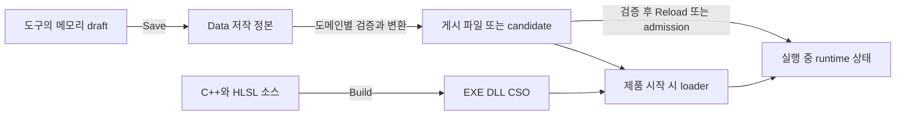

# LostArk의 Save → Publish → Runtime 구조 이해

## G01. 먼저 세 가지 상태를 분리한다

Save는 편집한 저작 정본을 디스크에 보존한다. Publish는 제품이 읽을 수 있는 데이터 세트를
검증·변환하여 게시한다. Reload 또는 별도 admission은 실행 중 메모리의 상태를 바꾼다.
파일 게시 성공만으로 이미 실행 중인 Client와 Server가 새 데이터를 쓴다고 말할 수 없다.
C++/HLSL 컴파일은 또 다른 작업이다.

이 구분은 잘못된 참조·다른 schema·부분 저장본이 제품 상태를 망가뜨리지 않게 하는 경계다.
다만 모든 도메인에 중간 generated 파일이 필요한 것은 아니다. Effect V1은 G05의 직접 소비 경로를 쓴다.

## G02. Rendering: 내용은 같아도 Save와 Publish는 다른 단계다

| 단계 | 실제 파일 또는 함수 |
|---|---|
| 저작 정본 | `Data/Rendering/Authored/RenderingProfiles.json` |
| Save | `Client/Private/RenderingProfileService.cpp::Save_Authored` |
| 게시자 | `Tools/RenderingPipeline/Publish-RenderingProfiles.ps1` |
| 제품 파일 | `Client/Bin/DataFiles/Rendering/RenderingProfiles.runtime.json` |
| 메모리 적용 | `RenderingProfileService.cpp::Reload_Runtime` |

2026-10-02 디스크 검사에서 두 JSON은 revision 90, 29 profiles이며 파싱 결과가 같다.
저작본은 130,037 bytes, 게시본은 883,807 bytes다. 직렬화 서식 때문에 byte 크기는 다르다.
따라서 Publish를 항상 압축이나 binary 변환이라고 설명하면 틀린다.

게시자는 중복 JSON key와 문서 계약을 검사한 뒤 임시 출력의 roundtrip 검증을 거쳐 교체한다.
Reload는 활성 scene과 quality profile을 확인하고 성공한 상태를 적용한다.
현재 실행 메모리가 디스크와 같은지까지 이 파일 대조로 증명한 것은 아니다.
Workbench의 세션 비교와 영구 scene quality 편집은 구분해야 하며, 각 profile의 현재 FXAA 저장값은 유지한다.

현재 `Publish_Runtime`은 외부 PowerShell을 호출한 뒤 UI 경로에서 120초 timeout으로 동기 대기한다.
시간 초과 시 프로세스 종료를 위한 대기가 최대 5초 추가된다.
창이 멈춰 보이는 문제와 publisher 자체의 실행 시간이 긴 문제는 다르다.
비동기 호출은 응답성을 개선할 수 있지만 검증·변환 비용을 자동으로 줄이지는 않는다.

## G03. Map과 Gameplay: 편집 자료를 제품 계약으로 변환한다

`Data/Maps/MapCatalog.json`은 Area마다 source와 runtime 경로를 함께 선언한다.
예를 들어 `LV_LUT_MIDNIGHTC_ED`는 Imported `.mapassets`와 Authoring `.mapplacements`를
대응 `Client/Bin/DataFiles/Map` 출력에 연결한다.

`MapTool_Placements.cpp::Save_Placements`는 object/batch와 transform을 검증하여 authoringPath에 저장한다.
`Publish-MapAuthoring.ps1`은 catalog·placement·material·resource·sequence 참조를 확인하고 정규화 bytes를 만든다.
Validate/Check/Publish는 같은 직렬화 결과를 사용하며 Check는 출력 비교, Publish는 staging과 교체를 수행한다.
교체 도중 실패하면 이전 파일을 역순 복구한다. 모든 파일의 crash-atomic 교체라고 과장하지 않는다.
제품 `CMapAssetCatalog::Load_Area`도 별도 staged catalog를 성공 후 commit한다.

Gameplay는 Balance·PlayerSkills·DamageProfiles·Encounter·RootMotion·HitShapes 등의 관계를 확인하여
`Server/Bin/DataFiles/Gameplay/Gameplay.bootstrap`을 만든다. 현재 실물은 v38,
109,866 rows, 32,214,003 bytes이며 `Shared/Public/GameplayDataRevision.h`의 v38 및
최대 131,072 rows·67,108,864 bytes 계약 안에 있다. 이 헤더 대조는 전체 의미 검증을 대신하지 않는다.

Gameplay publisher는 destination mutex 안에서 stage를 생성한 뒤 기존 출력과 hash를 비교한다.
같으면 기존 파일을 유지하고, 다르면 `File.Replace`한다. Server의 `CGameplayCatalog::Load`는
임시 catalog에 byte·version·row·revision 검사를 수행하고 성공 후 교체한다.

## G04. Valtan: Source Save, candidate, 파일 게시, live 적용

| 상태 | 실제 동작 | 성공이 뜻하지 않는 것 |
|---|---|---|
| Source Save | Workbench → typed patch → SourceOnly/CommitOnly, baseline CAS·journal·readback | 제품이나 실행 상태 변경 |
| Candidate 생성 | strict projection과 Server/Client 산출물을 revision별 immutable candidate로 구성 | active runtime 교체 |
| Full DataOnly 게시 | Valtan projection 및 FullDiagnostic domain 실행, 전후 source revision 대조 | 실행 중 Server에 자동 적용 |
| Live admission | Debug Server와 Client의 stage·READY/NACK·coordinator COMMITTED | 요청 제출만으로 성공 |

저작 정본은 `Data/Valtan/Valtan.gameplay.json`, `.presentation.json`, `.combatobjects.json`,
`.worldeventsets.json`이다. SourceOnly 성공은 `runtimeActivation=NOT_ACTIVATED`, candidate 생성은
`activeRuntimeChanged=false`, 전체 파일 게시 뒤 Workbench 상태는 `PUBLISHED_RESTART_REQUIRED`다.

`Run-FullPipeline.ps1 -DataOnly`는 Valtan 파일 하나만 게시하는 명령이 아니다.
모든 FullDiagnostic domain을 순회하므로 다른 domain의 비용과 실패도 포함될 수 있다.
Source revision은 지정 저작 경로와 LF 정규화 내용의 identity이며 Git HEAD나 Resources 전체 hash가 아니다.
SourceOnly도 validation과 source manifest를 만들므로 검증 없는 단순 저장으로 설명하지 않는다.

이 구조는 작성 중인 source를 보존하면서 마지막 정상 제품과 실행 표현을 유지하려는 설계다.
근거는 [09-09 RESULT](../09-09/2026-09-09_VALTAN_COMPOSITION_AUTHORING_PARITY_RESULT.md)와
현재 `Tools/ValtanPipeline/promote_valtan_animation_chains.py`, `valtan_tuning_pipeline.py`,
`Client/Private/BalanceTool.cpp`, `Server/Private/ServerApp.cpp`다.

## G05. Effect V1은 저작 정본을 직접 읽는다

`Data/Effects/EffectCatalog.json`의 DIRECT_AUTHORED_DOCUMENT는 `Data/Effects/Authored`를
제품 loader에 직접 연결한다. `Effect_Tool_DocumentIo.cpp`는 baseline CAS 저장과 reload 실패 복구를 수행한다.
새 결과는 다음 spawn부터 사용하며 이미 실행 중인 occurrence는 기존 immutable resource를 유지한다.

이중 generated copy가 정본과 어긋나는 문제 때문에 별도 Publish-Effects 경로가 제거됐다.
Map·Navigation·Gameplay의 변환 계약까지 제거한 것은 아니다. 또한 `BuildDomains.json`의
effect.v2는 publisher가 아니라 validation domain이다.
근거: [Effect 직접 정본 소비 RESULT](../08-25/2026-08-25_EFFECT_SAVE_IS_RUNTIME_CANONICAL_IMPLEMENTATION_RESULT.md).

## G06. Publish가 오래 걸릴 수 있는 실제 위치

`BuildDomainPipeline.psm1`은 manifest의 inputs·tools·resource refs·outputs·action을 내용 hash로 묶는다.
기록된 mtime 자체는 freshness identity가 아니다. domain lock 뒤 다시 검사하여 유효한 receipt가 있으면
action 전체를 재사용한다. 작업 전후 source closure가 다르면 완료 receipt 발행을 거부한다.

이 캐시의 단위는 개별 파일보다 넓은 domain이다. `map.kakulsaydon`은 Imported·Authoring·MapCatalog와
여러 출력 종류를 묶고 `gameplay.balance`는 Balance뿐 아니라 Valtan/Kouku·Animation·Effect·Composition까지 포함한다.
따라서 작은 수정도 domain 전체 action을 다시 실행할 수 있다. 직접 publisher 호출은 이 캐시를 자동 사용하지 않는다.

| 측정할 비용 | 현재 코드에서 확인한 이유 |
|---|---|
| freshness 판정 | 입력·도구·출력 content hash를 읽는 I/O |
| parse/validate | 큰 JSON과 여러 stable ID·resource·schema의 교차 검증 |
| projection/bake | 저작 의미를 runtime 표현으로 변환 |
| serialize/stage | Map은 같은 bytes도 staging하며 Gameplay는 동일 출력 판정 전에 stage를 생성 |
| commit/lock | writer 대기·교체·rollback 준비 |
| 호출 범위 | Full DataOnly가 전체 FullDiagnostic domain을 순회 |

receipt의 elapsedMs는 action 시간이고 호출 결과의 전체 시간은 lock·hash 비용까지 포함할 수 있다.
둘을 같은 분모로 비교하지 않는다. 이번 노트북에서 어느 항목이 주 병목인지 아직 측정하지 않았다.

## G07. 이미 있는 최적화와 오늘 확인한 증거

[09-20 RESULT](../09-20/2026-09-20_RUNTIME_PUBLISH_BUILD_DELIVERY_RESULT.md)는 Navigation의
1,395,182셀 처리 루프를 PowerShell에서 내장 C# helper로 옮겨 142.809초 → 7.612초,
반복 7.072초로 줄이고 84개 출력 SHA를 유지했다고 기록한다.
당시 raw 성능 로그는 이 노트북에 없으므로 오늘 재현한 수치로 쓰지 않는다.

현재 Composition receipt는 452개 source와 4개 제품의 hash·size를 보유하지만 시간 필드가 없다.
조사 시 `out/BuildPipeline/receipts`에 domain receipt JSON은 없었다.
오늘 생성된 Product build evidence는 C++ compile/deploy와 runtime 입력 검사 근거이며 Publish 측정이 아니다.

기본 Product 빌드는 Engine → Shared → Server → Client 컴파일과 배포를 수행한다.
`LostArkPublishRuntimeData=true`를 명시하지 않은 기본 빌드에서 전체 publisher를 반복하지 않는다.
이 노트북은 같은 코드 snapshot의 게시 DataFiles를 받아 사용했고 Debug Product의 42개 runtime checks가 통과했다.
이는 모든 저작 후보의 검증이나 모든 게임 화면의 성공을 뜻하지 않는다.

첫 설명 연습은 G02의 Rendering JSON 두 개를 직접 열어 같은 revision과 profile을 확인한 다음,
Save·Publish·Reload가 각각 어느 상태를 바꾸는지 본인의 말로 설명하는 것이다.
