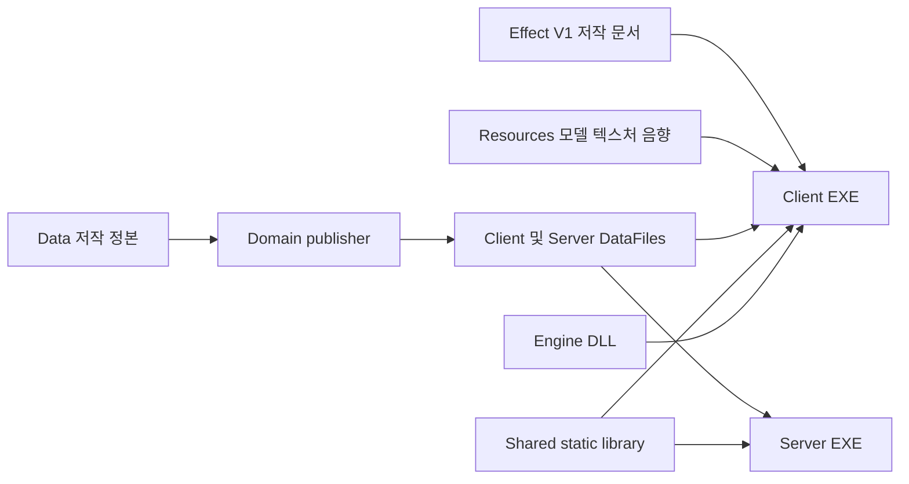

# Visual Studio 필터로 읽는 LostArk와 WintersEngine 코드 지도

이 문서는 솔루션 탐색기에서 파일을 열어 실제 구현을 따라가기 위한 출발점이다.
창 이름을 외우는 대신 **필터 위치 → 파일 → 타입과 소유 상태 → 호출자 → 자료구조와 알고리즘
→ 저장 파일 → 실행 소비자 → 실패 처리** 순서로 읽는다. 영상과 기술 소개서도 이 순서로
근거를 연결한다. 한 기능의 헤더와 CPP는 같은 필터 안에서 함께 확인한다.

LostArk는 현재 PC의 main 렌더링 변경과 기존 캐릭터 슬롯 작업을 통합한 소스를 기준으로 했다.
WintersEngine은 바탕화면의 실제 소스를 읽었다. Unreal 5 소스는 현재 PC에 없으므로
아래 비교에서 Unreal 부분은 Epic 공식 문서 근거이며, 로컬 구현을 확인한 것으로 표시하지 않는다.
전수 파일 색인은 프로젝트 등록 항목을 대상으로 한다. 모든 함수·리소스·스킬을 실행 검증했다는 뜻은 아니다.

## G01. 솔루션 탐색기와 물리 폴더를 구별한다

| 파일 또는 폴더 | 무엇을 결정하는가 |
|---|---|
| `Framework.sln` | 프로젝트 목록, 솔루션 구성, 프로젝트 간 빌드 연결 |
| `*.vcxproj` | 실제 컴파일·헤더·데이터·셰이더 등록, 구성별 옵션과 배포 target |
| `*.vcxproj.filters` | 솔루션 탐색기에 표시되는 사용자 정의 필터와 파일의 표시 위치 |
| `*.vcxproj.user` | 이 PC의 debugger 실행 경로·환경 등 개인 설정. 사용자 정의 필터 파일과 다름 |
| `Public`, `Private`, `Bin/ShaderFiles`, `Data` | 실제 디스크 파일 위치. 필터 변경으로 이동하지 않음 |

Visual Studio의 filters는 프로젝트 옆의 MSBuild 형식 XML이며 사용자 정의 이름과 파일
분류를 저장한다. [Microsoft 문서](https://learn.microsoft.com/en-us/cpp/build/reference/vcxproj-filters-files?view=msvc-170)

이번 변경은 네 `.vcxproj.filters`에 적용했다. `.vcxproj`의 컴파일 등록과 물리 파일 경로는
필터 정리로 변경하지 않았다. 예외적으로 Client의 옛 UI `None` 표시 경로 두 개는 실제 존재하는
`Data/UI/RaidEntry` 경로로 교정했다. 기존에 열린 VS가 옛 표시를 유지하면 진행 중인 편집을 저장한 뒤
프로젝트를 다시 로드해 확인한다. 프로젝트 보기에서 확인하며 디스크 폴더 보기와 혼동하지 않는다.

- [Engine 필터](C:/Users/tnest/Desktop/LostArk/Engine/Default/Engine.vcxproj.filters)
- [Client 필터](C:/Users/tnest/Desktop/LostArk/Client/Default/Client.vcxproj.filters)
- [Server 필터](C:/Users/tnest/Desktop/LostArk/Server/Default/Server.vcxproj.filters)
- [Shared 필터](C:/Users/tnest/Desktop/LostArk/Shared/Default/Shared.vcxproj.filters)
- [전체 필터 트리와 항목 수](2026-10-03_VISUAL_STUDIO_FILTER_TREE.md)
- [전체 등록 파일 색인](2026-10-03_VISUAL_STUDIO_FILE_INDEX.json)

색인에는 프로젝트, item 종류, 필터, 실제 저장소 상대 경로를 기록했다. 같은 파일의
`ClInclude`/`ClCompile` 분류와 Data의 `None`, shader의 `FxCompile`/`None`을 함께 본다.
필터에 보이는 것과 컴파일되는 것을 같게 해석하지 않는다.

## G02. 제품 네 프로젝트를 먼저 읽는다

Engine은 DirectX 장치·Object/Component·모델·렌더러·공용 측정을 제공한다. Client는
LostArk의 Level, 입력, 연출, 제품 UI와 저작 도구를 연결한다. Shared는 packet과
공통 gameplay 계약을 제공한다. Server는 명령 검증, room simulation, 판정과 복제를 소유한다.
Client는 Engine과 Shared를 참조하며 Server는 Shared를 참조한다.
[프로젝트 연결](C:/Users/tnest/Desktop/LostArk/Client/Default/Client.vcxproj:1339),
[Server 연결](C:/Users/tnest/Desktop/LostArk/Server/Default/Server.vcxproj:108)

`Data`는 저작 입력, `Client/Bin/DataFiles`와 `Server/Bin/DataFiles`는 게시된 실행 입력이다.
그러나 모든 domain이 같은 publisher를 거치는 것은 아니다. Effect V1의 직접 저작 문서 소비처럼
예외가 있으므로 실제 reader를 확인한다. `Resources`는 Git 밖에서 관리하는 모델·텍스처·음향
payload이며, `EngineSDK`와 구성별 EXE/DLL/CSO는 빌드 산출물이다.

`Tools`의 extractor/converter/publisher는 오프라인 데이터 흐름이다. 실제 도구 창인
`CSequencerTool`이나 `CEffectTool`과 이름이 비슷해도 process와 호출 시점이 다르다.
`out`은 로컬 검사·빌드 증거, `.md/TEAM`은 현재 팀 계약, 날짜별 PLAN/RESULT는 당시 변경과
검증 증거다. 과거 PLAN의 설계를 현재 구현보다 먼저 정답으로 삼지 않는다.

## G03. 새 Client 필터에서 읽는 순서

| 필터 | 먼저 볼 파일과 질문 |
|---|---|
| `00.MainApp` | `MainApp.h/cpp` — 무엇을 소유하며 어떤 순서로 연결하는가 |
| `01.Levels` | `LevelRegistry`, `LevelTransitionService`, `Loader` — 진입·준비·활성화의 책임은 어디인가 |
| `02.GameObjects` | `Character`, `Part_Body`, `MapAssetObject`, UI 하위 domain — 실제 화면 객체는 무엇인가 |
| `03. Tools` | Map, Boss, Effect, Animation, Sequencer, V2, Profiler, Rendering, AI — 사용자가 편집하는 owner는 무엇인가 |
| `04. Network` | Transport, Commands, Replication — typed 입력이 어떻게 서버로 가고 화면 상태로 돌아오는가 |
| `05.Presentation` | Assets, EffectsV1/V2, ActionTimelineAndCues, Cinematics, Rendering, World, CombatAndBoss — 실행 표현과 공용 문서 |
| `06.DataAccess` | `ProjectDataRoot`, `DataJson`, UserSettings — 경로·JSON·개인 설정의 경계 |
| `96.DataFiles` | 저작 domain과 Authored/Imported/Reference 등 실제 디스크 계층 |
| `97.ShaderFiles` | RenderPipeline, Materials, Effects, UIAndDebug, Common — shader 입력과 실행 program |
| `98.Default`, `99.Defines` | 진입점·resource script·PCH와 Client 공통 선언 |

Effect JSON은 class/boss/사용 범주, 원본 source 묶음으로 나눠 탐색한다. 이 분류는 편의를 위한
VS 표시이며 Effect Catalog의 admission, 실제 보스 identity, 복원 성공 여부를 변경하지 않는다.
shader 역시 파일 이름의 Artist라는 역사적 접두사만으로 실제 native family를 판단하지 않고
wrapper의 include 대상까지 확인한다.

Engine은 기존 `00.GameInstance → 01.System → 02.Utility` 구조를 유지했다. Renderer,
Model/Material, Profiler를 먼저 보고 `03.ShaderFiles`에서 Deferred, SourceCharacter,
SourceMap을 따라간다. Server는 Main→Network→Room→World→NavigationCollision→Combat→AI→
Boss→Economy→Generation 순서로 정리하고 검사는 Tests로 구분했다. Shared는 Network와
Protocol, Gameplay, Revision을 나눴다. 각 필터가 별도 DLL이나 독립 컴파일 모듈이라는 뜻은 아니다.

## G04. 프로그램 시작부터 한 프레임까지

Client의 [wWinMain](C:/Users/tnest/Desktop/LostArk/Client/Default/Client.cpp:277)은 창과
사용자 설정을 준비하고 `CMainApp::Create`를 호출한 뒤 Win32 메시지를 처리하는 loop를 돈다.
매 frame은 Client의 연결 작업과 Engine update/render를 거친다. 시작 Level과 전환 권한은
`CMainApp`, `CLevelTransitionService`, Level registry의 현재 계약을 함께 읽는다.

[CGameInstance::Update_Engine](C:/Users/tnest/Desktop/LostArk/Engine/Private/GameInstance.cpp:192)의
실제 주요 순서는 입력·음향 → Priority Update → 카메라 → Object Update → Physics →
Post Physics → Level Update → Late Update다. Level이 Server snapshot의 transform을 반영한 뒤
Late Update가 최종 culling과 render 제출을 하도록 순서가 정해져 있다.

[CGameInstance::Render](C:/Users/tnest/Desktop/LostArk/Engine/Private/GameInstance.cpp:266)는
`CRenderer::Draw`와 Level render를 호출한다. Renderer 내부의 MRT, opaque, light, combined,
screen-space lighting, 투명·후처리 순서는 [렌더링 코드 가이드](2026-10-03_RENDERING_SHADER_PROFILER_CODE_GUIDE.md)의
G01에서 이어 읽는다. 함수 이름 목록만 외우기보다 각 단계가 읽고 쓰는 texture와 render state를 적는다.

Server의 [Room_Loop](C:/Users/tnest/Desktop/LostArk/Server/Private/ServerApp.cpp:2705)은
1/30초 고정 step으로 `Tick_GameplaySimulations`를 호출한다. Client의 렌더 frame과 같은 시계가
아니다. 네트워크 command sequence, Server tick, animation age, Effect particle age,
Profiler frame ID를 각각 누가 증가시키고 어떻게 조인하는지 확인해야 한다.

## G05. Action Workbench와 Sequencer를 읽는다

[Action Workbench 코드 가이드](2026-10-03_ACTION_WORKBENCH_CODE_GUIDE.md)는 다음을 실제 선언,
함수, JSON 예제와 함께 설명한다.

1. `CSequencerTool`의 공통 창과 `ICompositionWorkbenchSession`의 domain별 owner.
2. Composition의 reusable resource, timeline occurrence, stable ID와 revision.
3. 쿠크 단일 파일 3-way merge·CAS·임시 파일 재검증·원자 교체.
4. Character의 binding→cue→arrangement 순차 저장과 조건부 rollback.
5. `CWorldSequencePlayer`의 instance 수명, key 구간 검색, Lerp/Slerp, 시간과 seed 기반 motion.
6. `CompositionResourceTree`의 cache와 transfer, SHADOW 문서와 실제 실행 경로의 차이.

첫 실습은 Character의 한 skill ID를 고정하여 `CCharacterActionWorkbench::Open_Composition`
→ `Stage_CharacterAction` → preview → `Save_Composition` → skillbindings/animevents/arrangement
파일로 이동한다. 도구의 Collider preview를 Server 피해 판정과 구분하고, 독립 쿠크 Sequence의
Save·preview를 Boss Product publish와 동일하게 설명하지 않는다.

## G06. 물과 스킬 셰이더에서 픽셀까지 읽는다

[렌더링 셰이더와 Profiler 가이드](2026-10-03_RENDERING_SHADER_PROFILER_CODE_GUIDE.md)는
`CMapAssetObject/CModel/CMaterial → shader variables → pass → draw → render target`의 연결을 다룬다.
물은 범용 `PS_MAIN_WATER`와 source water program38~43 경로를 나눠 설명한다.

스킬은 입력 슬롯에서 곧바로 shader로 가지 않는다. skill ID, animation binding, cue의 Effect asset ID,
문서의 element와 material program, evaluated frame, geometry adapter, shader binding을 지나간다.
이때 CPU의 자료구조가 어떤 상수·texture·vertex 속성으로 전달되는지가 핵심 API 계약이다.

이번 main의 SSGI/SSR은 MapPBR 수신면에 적용하는 화면 공간 가산 실험이다. 기본 OFF이고,
Lumen의 surface cache·장면 전체 GI·시간 누적이나 ray tracing 가속구조를 구현한 것은 아니다.
기존 조명과 사용자 저장 설정을 보존하면서 어느 pass를 추가했는지 코드로 설명한다.

## G07. Profiler의 기록과 비교를 읽는다

Engine `CProfiler`는 수집, Client `ProfilerTool`은 표시, `ProfilerCaptureIO`는 저장과
비교 reader를 소유한다. CPU scope의 포함 시간과 Self, GPU 비동기 pending과 원래 frame 귀속,
draw counter와 상세 표본의 상한을 구별한다. interval을 GPU utilization으로 해석하지 않는다.

실험 영상은 같은 카메라·해상도·quality·profile·capture detail에서 A/B를 수집해야 한다.
Rendering Workbench의 세션 overlay는 authored profile Save와 별개이며, profiler capture JSON도
런타임 렌더링 설정이 아니다. 실제 capture가 없는 개선 배율을 코드 수정만으로 만들지 않는다.

## G08. WintersEngine 및 Unreal과 비교한다

[WintersEngine과 Unreal 비교 가이드](2026-10-03_WINTERS_UNREAL_COMPARISON_CODE_GUIDE.md)는
Winters의 실제 VS 필터에서 시작한다. `00.Core`, `01.Runtime`, `02.RHI`, `03.Renderer`,
`04.Resource`, `05.ECS`, `12.Cinematic`과 물리 파일·대표 심볼을 연결한다.

| 비교 대상 | 비교할 책임과 질문 |
|---|---|
| LostArk Prototype/Clone · Winters entity/component · Unreal UObject/Actor | 생성, 소유, 파괴, identity, reflection의 실제 역할 |
| LostArk domain 세션 · Winters CSequenceAsset/Player · Unreal MovieScene/Sequencer | 저장 asset, binding, track/key, clock, 평가, seek, 복구 |
| LostArk CRenderer · Winters RHI/renderer · Unreal RHI/RDG | 장치 추상화와 pass 의존성·자원 수명 관리의 차이 |
| Catalog/Publish · Winters resource/definition pack · Unreal AssetRegistry/Cook | 검색 metadata, load cache, 플랫폼 변환, 실행 활성화 |
| 세 프로젝트의 profiler | event producer, 수집 비용, thread/frame 귀속, 저장·분석, 누락과 상한 |

Winters의 `CSequenceAsset::SaveToJson`은 현재 직접 파일 쓰기이며 쿠크의 CAS 저장과 다르다.
Winters의 Cubic 보간도 해당 코드에서는 smoothstep이다. 이런 구체적인 차이가 기술서의
비교 근거이며 상용 엔진과 동급이라는 포괄적인 표현을 대신한다.

Unreal 소스를 받은 뒤 `Engine/Build/Build.version`과 commit을 고정하고 MovieScene, Sequencer,
CoreUObject, AssetRegistry, RenderCore/RDG, Trace와 UnrealBuildTool의 실제 소스를 다시 대조한다.
원작 Lost Ark의 cooked UE3 자료를 복원하는 작업과 Unreal5 소스를 연구하는 작업도 구별한다.

## G09. Unreal 소스 저장소에 다시 접근한다

로그인한 GitHub에서 [EpicGames/UnrealEngine](https://github.com/EpicGames/UnrealEngine)을 먼저 연다.
접근이 되면 기존 연동을 다시 할 필요가 없다. 404가 나오면 Epic 계정의 **APPS & ACCOUNTS →
Accounts → GitHub Connect**를 확인하고 **Authorize EpicGames**, 이메일의 **Join @EpicGames**
초대 수락까지 완료한다. 공식 안내의 초대 유효기간은 7일이다.
[Epic 공식 연결 안내](https://www.unrealengine.com/ue-on-github?lang=en-US)

계정 권한이 확인되면 연구할 release/tag를 선택해 다운로드하거나 clone한다. 코드 열람을
시작하는 데 전체 엔진 빌드가 선행 조건은 아니다. Setup/GenerateProjectFiles와 실제 build는
선택한 버전의 [Epic 소스 다운로드 안내](https://dev.epicgames.com/documentation/en-us/unreal-engine/downloading-source-code-in-unreal-engine)를
따른다. 이번 작업은 사용자 계정 연결·초대 수락·대용량 clone을 대신 수행하지 않았다.

## G10. 코드 이해를 영상과 기술 소개서로 연결한다

각 기능은 다음 질문에 답하는 한 단위로 작성한다. 보이는 장면은 무엇인가, 어떤 입력을 받는가,
누가 상태를 소유하는가, 어떤 자료구조와 알고리즘을 쓰는가, 어디에 저장되는가, 누가 다시 읽는가,
실패할 때 무엇이 보존되는가. 그 뒤 상용 엔진의 대응 책임과 현재 부족한 기반을 비교한다.

첫 재촬영 순서는 Lobby/입장 → Character skill → 같은 skill의 Workbench와 Resources →
World sequence → 물/조명 → Profiler A/B로 잡을 수 있다. 실제 타임코드는 재촬영본을 받은 뒤
정한다. 각 컷에는 결과 화면, 도구 작업, 소스 심볼, 저장 파일, 검증 기록 중 필요한 증거를 연결한다.
현재 MP4의 장면을 재확인하거나 새 화면을 촬영한 것으로 기록하지 않는다.

200쪽 기술서의 아래 배분은 집필 설계이며 완성된 PDF가 아니다. 내용과 검증이 모인 후 분량을 조정한다.

| 예정 페이지 | 본문 주제 |
|---|---|
| 1–16 | VS·물리 구조·프로젝트 소유권 |
| 17–30 | 시작·frame·Level·loader |
| 31–48 | 객체·component·모델·수명·메모리 |
| 49–68 | 데이터·identity·Save/Publish/Reload |
| 69–98 | Workbench·Sequencer·Resources·보간과 평가 |
| 99–124 | Effect simulation·material ABI·skill shader |
| 125–146 | 물·조명·deferred·SSGI/SSR와 한계 |
| 147–162 | Profiler·캡처·비교·측정 해석 |
| 163–176 | Server authority·명령·tick·snapshot |
| 177–190 | Unreal·Winters·LostArk 책임별 비교 |
| 191–200 | 재현 사례·영상 근거·회고와 개선 |

자기소개서는 이 기술서에서 본인의 기여가 확인된 사례를 추린다. 기능 목록만으로 개인 기여,
실제 성능 향상, 상용 수준의 완성도를 확정하지 않는다. 기존
[영상 기술서 조사](../10-02/2026-10-02_VIDEO_TECHNICAL_PORTFOLIO_AUDIT_RESULT.md)와
이번 코드 지도를 함께 사용한다.

## G11. 이번 작업의 검증과 후속 범위

필터 적용·main 통합·실행한 빌드·XML 검증의 최종 결과는
[필터 정리 RESULT](2026-10-03_VISUAL_STUDIO_DOMAIN_FILTERS_RESULT.md)에 둔다.
전체 교체 XML은 [PLAN](2026-10-03_VISUAL_STUDIO_DOMAIN_FILTERS_PLAN.md)에 보존한다.

이번 지도는 파일과 핵심 호출·데이터 흐름의 첫 정리다. 모든 함수·변수의 전수 해설,
Unreal 로컬 소스 대조, 사용자 도구 시연·화면 판단, 새 촬영·SRT, 자기소개서와 제출용 PDF,
200쪽 본문은 각각 별도 검증과 집필을 이어갈 범위다.
