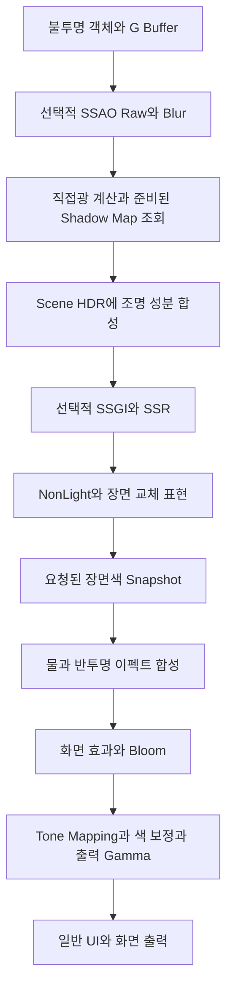

# LostArk 렌더링 기술소개서 해설

2026년 10월 9일 기준. 기술소개서 11~14쪽의 설명을 현재 LostArk의 코드·저장 데이터·기존 검증 기록에 연결한다. PBR과 IBL의 수식, SSAO가 음영을 만드는 과정, 베른 물 재질, 캐릭터와 차원술사 이펙트의 복원 사례를 먼저 이해하고, GI와 광선 추적의 추가 적용을 판단하는 데 사용한다.

기준 소스 HEAD는 `45faba4ba0806cbfbcfd02b213404fb98901b961`이다. 수치가 나오는 곳마다 현재 저장값, 가정을 둔 계산, 과거 실행 측정을 구분한다. 저장된 설정은 실행 중 사용자의 Video 설정·지역·연출 override까지 합친 화면의 실효값과 다를 수 있다.

## G00 기술소개서 11~14쪽의 설명 범위

원본은 [기술소개서.pptx](C:/Users/tnest/Desktop/Interview/기술소개서/기술소개서.pptx)다. 전체 37쪽 중 11~14쪽은 다음 주제의 텍스트 초안이며 해당 슬라이드에 직접 연결된 그림은 없다. PPTX는 수정하지 않는다.

| 슬라이드 | 현재 주제 | 설명을 완성하는 데 필요한 근거 |
|---|---|---|
| 11 | PBR, BRDF, IBL, 환경광과 구운 조명 | 재질 채널의 실제 해석, 직접광 식과 간접광 식, GPU에 전달되는 입력 |
| 12 | 캐릭터와 이펙트, LUT와 반사 강도, GI와 Ray Tracing | 캐릭터 재질과 반투명 합성 경로, 실제 값의 소유자, 구현된 기능과 향후 기능의 구분 |
| 13 | 물 셰이더 | 실제 물 material program 하나의 UV·법선·반사·장면색·깊이·opacity 계산 |
| 14 | Unreal과의 비교 및 마이그레이션 | 같은 기능을 구현하는 입력·재질·렌더 패스의 비교, 이식 비용과 아직 하지 않은 작업 |

선배 영상의 설명은 개념을 공부하는 출발점이다. 그 설명의 채널 배치, 표본 수, 조명 계수를 우리 구현의 사실로 그대로 옮기면 안 된다. 특히 다음 표현을 구분한다.

| 초안 또는 질문의 표현 | 정확하게 정리할 내용 |
|---|---|
| Physicall Based Rendering | **Physically Based Rendering**, 물리 기반 렌더링 |
| Bidirectional Reflectional/Distributional Function | **Bidirectional Reflectance Distribution Function**, 양방향 반사 분포 함수 |
| Image Based Rendering으로서의 IBL | 여기서 IBL은 **Image Based Lighting**, 이미지 기반 조명 |
| Specular 텍스처의 G/B가 곧 Roughness/Metallic | 현재 선택 MapPBR은 ORM의 G/B를 입력으로 쓴다. 모든 Specular 텍스처의 공통 규칙은 아니며 family별 실제 소비식을 확인한다 |
| Roughness × 사전 필터링 맵 × BRDF 맵 | 일반적인 split-sum에서 roughness는 주로 조회 좌표와 필터 폭을 정한다. 단순히 최종 색에 곱하는 값이 아니다 |
| SSAO에서 랜덤 방향을 14번 검사 | 현재 기본 SSAO는 12표본이며 선택값은 4/8/12다. 별도 Horizon AO는 방향당 4개 깊이 표본을 사용한다 |
| LUT를 2배로 하여 캐릭터 반사를 2배로 표현 | 색 보정 LUT, BRDF LUT, exposure, specular 계수는 다른 입력이다. 현재 값과 소비자를 각각 확인해야 한다 |
| GI, Ray Tracing, Lumen을 순서대로 켜면 원작과 같아진다 | GI는 빛의 간접 전달 현상, ray tracing은 광선을 이용하는 계산 방법, Lumen은 Unreal의 구체적인 시스템이다. 원작 일치는 입력과 합성의 정합을 별도로 검증해야 한다 |

## G01 현재 한 프레임에서 렌더링이 진행되는 순서

출발 파일은 [Renderer.cpp의 Draw](C:/Users/tnest/Desktop/LostArk/Engine/Private/Renderer.cpp:870)다. `CModel → CMesh/CMaterial`로 연결된 객체가 렌더 그룹에 제출되고, Renderer가 패스 순서와 render target을 관리한다. 재질 함수 하나의 반환값이 곧 모니터에 보이는 최종 색은 아니다.



이 그림은 핵심 장면 경로를 축약한 것이다. shadow 준비, picking용 depth 보존, 별도 portrait와 cinematic UI 같은 경로는 코드에서 따로 다룬다. 불투명 재질은 색·법선·깊이·재질 정보를 G-buffer에 기록하고 나중에 조명을 합성하는 deferred 경로를 사용한다. 물이나 일부 반투명 표현은 이미 만들어진 배경과 자신의 출력을 결합해야 하므로 forward 경로와 장면색 입력이 필요하다.

HDR 장면색을 FP16에 누적하는 이유는 1보다 큰 빛과 발광 값을 tone mapping 이전까지 유지하기 위해서다. 중간에 8bit 표시색으로 잘라 버리면 이후 bloom과 색 보정에 필요한 밝기 관계가 사라질 수 있다. 현재 `Draw`는 SceneHDR 합성, 화면 효과와 Bloom을 거친 뒤 `Render_Final`에서 최종 tone/gamma 처리를 수행한다.

같은 오브젝트도 바닥의 구운 조명, 동적 직접광, 환경 반사, 반투명 이펙트, 최종 LUT를 통해 결과가 달라진다. 화면 차이를 조사할 때는 어느 단계에서 차이가 생기는지 분리해야 한다.

## G02 PBR과 BRDF를 읽는 데 필요한 개념

### 표면의 색과 조명은 다른 입력이다

Base Color는 표면 재질의 색 성질이다. Light Color와 Light Intensity는 들어오는 빛의 색과 세기다. Normal은 표면이 향하는 방향이며, Roughness는 미세한 표면 방향이 얼마나 퍼져 있는지를 표현한다. Metallic은 금속형 반사와 비금속형 반사를 구성하는 데 사용한다. Metallic을 높이는 일을 모든 재질을 더 밝게 만드는 조절로 이해하면 안 된다.

확산 반사는 빛이 넓은 방향으로 퍼져 보이는 성분이고, 정반사는 시점과 빛의 방향에 따라 하이라이트나 주변 환경이 나타나는 성분이다. 거친 금속도 금속이며, 매끈한 비금속도 강한 정반사를 보일 수 있다. Roughness와 Metallic은 서로 대신할 수 없다.

식에 자주 등장하는 `saturate(x)`는 0~1 제한, `lerp(A,B,t)`는 `A×(1-t)+B×t`, `dot`은 내적, `normalize`는 길이를 1로 만드는 연산이다. RGB끼리 곱하는 표기는 채널별 곱을 뜻한다. `pow(x,p)`는 거듭제곱이며 `reflect(I,N)`은 주어진 법선에 대한 반사 방향을 구한다.

normal map은 표면의 tangent·bitangent·normal을 기준으로 한 방향을 저장하는 경우가 많다. 이를 world나 view 공간으로 옮겨 시선·광원 방향과 같은 기준에서 계산한다. UV는 texture를 읽는 좌표이고 world position은 장면에서의 위치이므로 서로 대신할 수 없다. 이 기준이 잘못 연결되면 수식 자체가 맞아도 하이라이트·물 반사·이펙트 방향이 틀어진다.

### BRDF는 들어오는 방향과 나가는 방향을 연결한다

BRDF의 두 방향은 표면에서 광원을 바라보는 방향 `L`과 카메라를 바라보는 방향 `V`다. 법선 `N`이 같아도 카메라가 이동하면 정반사가 달라지는 이유가 여기에 있다. `H = normalize(L + V)`는 두 방향의 중간 벡터다.

렌더링 방정식을 간단히 쓰면 다음과 같다.

\[
L_o(x,V)=L_e(x,V)+\int_{\Omega^+} f_r(x,L,V)\,L_i(x,L)\,\max(N\cdot L,0)\,d\omega
\]

`Li`는 표면으로 들어오는 radiance, `Lo`는 시점 방향으로 나가는 radiance, `Le`는 표면이 직접 내는 빛이다. `fr`이 BRDF다. `N·L`은 비스듬히 들어오는 빛이 넓은 면적에 퍼지는 효과를 반영한다. BRDF는 단순한 0~1 반사율 스칼라와도 다르며, 특정 방향에서 값이 1을 넘는 것 자체가 에너지 보존 위반은 아니다. 방향에 대해 적분한 반사 에너지를 봐야 한다. [PBRT의 표면 반사 설명](https://www.pbr-book.org/4ed/Radiometry,_Spectra,_and_Color/Surface_Reflection)

실시간 직접광에서는 위 적분을 장면의 광원 목록에 대한 합으로 근사한다. 널리 사용하는 microfacet 모델의 개념식은 다음과 같다.

\[
f_r=f_d+f_s,\qquad f_d=k_D\frac{C_{base}}{\pi},\qquad
f_s=\frac{D(N,H)\,F(V,H)\,G(N,L,V)}{4\max(N\cdot L,0)\max(N\cdot V,0)}
\]

- `D`는 미세한 표면 법선이 하이라이트 방향에 얼마나 모이는지 나타낸다. GGX는 이 분포를 표현하는 모델 중 하나다.
- `F`는 Fresnel 항이다. 보는 각도에 따라 반사 비율이 달라지는 성질을 나타낸다.
- `G`는 미세 표면들이 서로 빛과 시야를 가리는 효과를 나타낸다. 화면 공간 SSAO와는 계산 대상과 규모가 다르다.

이 식은 개념을 읽기 위한 기준이다. 현재 원본 복원 셰이더에는 원본의 거칠기 변환, visibility 근사, 보정값과 상한이 있으므로 이 식 하나로 모든 native 재질의 실제 계산을 대신 설명하지 않는다.

### 같은 PBR이라는 이름으로도 화면이 달라지는 이유

PBR은 하나의 최종 이미지가 아니라 재질과 조명을 계산하는 방법의 범주다. 같은 GGX를 사용해도 normal/tangent가 틀리거나 roughness 채널을 반대로 읽으면 하이라이트의 위치와 폭이 달라진다. 환경 cubemap과 구운 조명이 다르면 물체에 들어오는 빛 자체가 달라진다. 마지막 exposure와 tone mapping도 밝기 관계를 바꾼다.

색 공간은 작은 구현 차이가 큰 화면 차이를 만드는 예다. 표준 sRGB에서 저장값 0.5를 선형 공간으로 변환하면 약 **0.214041**이다. 이를 선형 0.5로 계산하는 경우와 같지 않다. 색 텍스처, 법선과 mask 데이터, RGBM 환경맵의 해석을 구분해야 한다. 단, 원본의 특정 연산이 gamma 공간을 전제로 했다면 그 구간까지 임의로 선형화하는 것도 복원 오류다. texture format과 shader의 실제 계약을 따라야 한다. [Microsoft 색 공간 안내](https://learn.microsoft.com/en-us/windows/win32/direct3ddxgi/converting-data-color-space)

선배 영상과 현재 프로젝트의 품질 차이는 같은 장면·카메라·원본 입력을 확보하여 비교해야 원인을 분리할 수 있다. 지금의 근거로는 원본 재질식, SH/RNM, native BRDF와 환경 입력을 연결한 사실을 설명할 수 있다. 특정 복구 하나가 차이의 몇 퍼센트를 만들었다는 결론은 별도 A/B 측정이 필요하다.

## G03 현재 프로젝트의 PBR 표면값과 직접광 수식

### 데이터가 실제 셰이더 입력이 되는 경로

관련 파일은 [MapAssetRenderUtils.cpp](C:/Users/tnest/Desktop/LostArk/Client/Private/MapAssetRenderUtils.cpp:1260), [Material.cpp](C:/Users/tnest/Desktop/LostArk/Engine/Private/Material.cpp:1479), [Shader_MapMaterialSurface.hlsli](C:/Users/tnest/Desktop/LostArk/Client/Bin/ShaderFiles/Shader_MapMaterialSurface.hlsli:497)다.

맵 authoring의 `mapmaterials.json`은 material override와 배치별 `placementLighting`을 저장한다. 게시 데이터를 catalog가 읽고 기존 `CModel → CMaterial`에 연결한다. `CMapAssetRenderUtils`는 선택된 program에 맞는 texture·scalar·lightmap·환경 입력을 바인딩한다. `CMaterial::Bind_SurfaceLighting`은 source 간접광이 활성인 경우 native cube와 BRDF lookup을 선택하고, 그렇지 않으면 이전 환경 입력을 선택한다.

따라서 texture가 디스크에 있다는 사실만으로 적용을 확정할 수 없다. 현재 material이 그 texture를 참조하는지, 선택된 program이 그 slot을 읽는지, shader 분기가 활성인지까지 연결해야 한다.

### 선택 MapPBR의 ORM 해석

이 절은 선택 MapPBR family의 식이다. 캐릭터와 모든 맵 재질의 공통 규칙은 아니다. `safePow(x,p)`는 `abs(x)<10^-6`이면 0을 반환하고 그 밖에는 `abs(x)^p`를 계산한다.

```text
m  = saturate(safePow(ORM.b × metallicIntensity, metallicPower))
r0 = nativeIndirect ? 0.045 : minimumRoughness
r  = saturate(max(r0, safePow(ORM.g × clamp(roughnessIntensity,0,100),
                             roughnessPower)) + diagnosticRoughnessOffset)
AO = saturate(safePow(ORM.r × aoIntensity, aoPower))
albedo = saturate(reflectedDiffuse × lerp(nonmetallicBrightness,metallicBrightness,m))
F0 = lerp(0.08 × saturate(specularPBRIntensity), albedo, m)
```

ORM의 R은 재질 AO, G는 roughness, B는 metallic 입력이다. 채널을 읽은 뒤에도 강도·지수·하한을 적용한다. 여기서 재질 AO는 texture에 저장된 값이며 뒤에서 설명할 화면 공간 SSAO와 별도다.

[현재 Character Select FLOOR12 첫 재질](C:/Users/tnest/Desktop/LostArk/Data/Maps/Authoring/LV_LOBBY_CLASSSELECT_SL00/LV_LOBBY_CLASSSELECT_SL00.mapmaterials.json:6)은 metallicIntensity=0, metallicPower=0, roughnessIntensity=1.25, roughnessPower=1, specularPBRIntensity=0.5다. `safePow`의 0 처리 때문에 metallic은 0이고 비금속 `F0=0.04`가 된다.

**계산 예:** texture의 G를 설명용으로 0.5, diagnostic offset을 0이라고 가정하면 `r=0.5×1.25=0.625`다. 0.5는 이번에 읽은 실제 DDS texel값이 아니다. 저장 scalar가 같아도 texel과 variant가 달라지면 roughness도 달라진다.

### 실제 직접광 함수가 교과서 식에서 달라지는 부분

[Evaluate_MapSourcePBRDirect](C:/Users/tnest/Desktop/LostArk/Engine/Bin/ShaderFiles/Shader_Deferred.hlsl:373)는 원본 방향광 PS에 대응하는 계산이다. `NoH`, `NoV`, `NoL`, `VoH`는 각각 법선·시선·광원·중간 벡터의 내적에서 만든 값이다. `NoV`에는 `abs`와 작은 양수 보정이 들어가며 분모에는 0 방지가 있다.

GGX 분포 항은 다음과 같다. `α=r²`라고 설명하면 분자의 `α²`가 코드의 `r⁴`와 대응한다.

\[
D=\frac{r^4}{\pi\left[(N\cdot H)^2(r^4-1)+1\right]^2}
\]

현재 직접광은 geometric normal로 `VoH`를 보정한 뒤 Fresnel을 계산하고, visibility와 색 휘도에 따른 peak cap도 적용한다.

```text
geometricLight = min(dot(normalize(geometricNormal),L)+1, 1)
correctedVoH = min(VoH+1-geometricLight, 1)
t = (1-correctedVoH)^5
F = F0×(1-t) + t×saturate(50×F0.g)×(max(F0,1-r)-F0)

denom = NoL×[NoV×(1-r²)+r²] + NoV×[NoL×(1-r²)+r²]
sourcePeak = 0.5×D / max(denom, tinyPositive)
peak = min(sourcePeak, 3/[dot(F,(0.3,0.59,0.11))+0.0001])
diffuseWeight = (1-m)×(1-F)×NoL
specularContribution = F×peak×NoL×π
```

이 함수의 diffuse에는 원본의 `1/π`와 마지막 광원 scale의 `π`가 상쇄되는 계약이 있다. 그래서 교과서의 `albedo/π`를 보고 위 결과에 다시 나누기를 추가하면 값이 달라진다. 실제 albedo는 G-buffer에 남겨 Combined에서 곱한다. 광원색, 거리 감쇠, 그림자도 이후 연결되므로 이 중간 결과를 최종 RGB로 부르면 안 된다.

**계산 예:** `r=0.5`, `NoH=1`이면 `D≈5.092958`이다. 이는 분포 함수 값이다. 밝기가 5배라는 뜻이 아니다. 또 이 PBR 직접광은 입사광색으로 `light.diffuse`를 사용하므로 legacy의 `light.specular` 설정만 0으로 만드는 실험은 PBR 반사 OFF와 같지 않다.

## G04 IBL과 Irradiance 그리고 현재 복원된 간접광

### Irradiance는 표면에 도착하는 빛을 방향에 대해 모은 값이다

Irradiance `E`는 단위 면적에 입사하는 복사 에너지의 시간당 양이며 물리 단위는 W/m²다. 각 방향의 radiance를 입사각의 cosine으로 가중하여 표면 위 반구에서 적분한다.

\[
E(N)=\int_{\Omega^+}L_i(L)\max(N\cdot L,0)\,d\omega
\]

Lambert 표면의 diffuse 출사 성분은 `albedo×E/π`로 표현할 수 있다. irradiance map을 미리 만들면 매 프레임 모든 방향을 다시 적분할 필요 없이 법선 방향으로 사전 계산 결과를 조회할 수 있다. 단, 파일이 E 자체를 저장하는지 E/π를 저장하는지는 생성기와 소비자 사이의 약속이다. 이름만 보고 π를 추가하거나 제거하면 안 된다. [PBRT Radiometry](https://pbr-book.org/4ed/Radiometry%2C_Spectra%2C_and_Color/Radiometry)

우리 코드에서 SH 계수와 texture RGB는 shader 계산의 입력이다. 물리적으로 보정한 조명 측정 자료가 없으므로 값을 lux나 W/m²의 실측으로 환산할 수 없다.

### Diffuse와 specular의 사전 계산은 역할이 다르다

넓게 퍼지는 diffuse 환경광은 낮은 주파수의 방향 정보를 담은 irradiance map이나 SH로 근사할 수 있다. SH는 방향 함수를 몇 개의 계수와 기저함수의 합으로 나타낸 것이다. 모든 방향의 원본 이미지를 그대로 보존하는 방식은 아니므로 날카로운 반사 무늬를 같은 저차 SH로 표현하기는 어렵다.

specular IBL은 시선과 roughness에 따라 반사 무늬와 퍼지는 폭이 달라진다. 일반적인 split-sum은 다음 두 자료를 미리 계산한다.

1. 환경맵을 roughness별로 필터링하여 저장한 cubemap mip.
2. roughness와 `N·V`를 입력으로 BRDF 적분 계수를 조회하는 2D LUT.

대표적인 개념식은 `PrefilteredEnvironment(R,r) × [F0×A(NoV,r)+B(NoV,r)]`다. 거칠기는 cubemap mip와 LUT 조회에 참여한다. “roughness 수치를 두 이미지에 곱한다”로 설명하면 이 의미가 사라진다. 이 근사는 runtime 적분 비용을 줄이지만 시점에 따른 정확한 반사 lobe와 환경·재질의 결합을 단순화한다. [Epic의 Real Shading in Unreal Engine 4](https://cdn2.unrealengine.com/Resources/files/2013SiggraphPresentationsNotes-26915738.pdf)

### 현재 native IBL은 일반 split-sum과 세부 계약이 다르다

[Shader_MapMaterialSurface.hlsli의 native 간접광](C:/Users/tnest/Desktop/LostArk/Client/Bin/ShaderFiles/Shader_MapMaterialSurface.hlsli:672)은 다음 입력을 사용한다.

- 화면상 인접 픽셀의 법선·시선 내적 변화량으로 roughness를 보정한다. `nv=dot(tangentNormal,tangentView)`, `roughnessAA=saturate(r+0.3×length(float2(ddx_coarse(nv),ddy_coarse(nv))))`다. 시간 변화율이 아니며 이 `nv`는 signed 내적이다.
- native BRDF LUT는 `(lookupView,roughnessAA)`를 읽으며 **R=Fresnel 계수, G=base 계수**다. `lookupView`에도 반사 방향 보정이 있다.
- cube는 반사 방향과 원본 회전 기준으로 조회하고 `LOD=roughnessAA×5`를 사용한다.
- RGBM 환경색은 `RGB×A×6×environmentColor.rgb+environmentColor.w`로 해석한다. Alpha가 투명도라는 뜻이 아니다.
- BRDF 응답, RNM/hemisphere 기반 specular irradiance와 specular AO를 함께 사용한다.

native lookup 소비의 중심식은 다음과 같다. `F0`는 코드의 `surface.specular`다.

```text
fresnelDelta = saturate(50×F0.g) × (max(1-roughnessAA,F0)-F0)
reflectionBRDF = (lookup.g×F0 + lookup.r×fresnelDelta)
                 × [1+F0×(1/max(lookup.g,0.000001)-1)]
```

이 선택 MapPBR 경로에 연결된 native BRDF는 **128×32 RG16_UNORM**이다. 과거 프로젝트의 128×128 비교용 lookup과 구분한다. 원본 generator/slice와 4,096×2 채널이 bit-exact였다는 기존 검증은 [09-22 결과 G13](C:/Users/tnest/Desktop/LostArk/.md/GB/09-22/2026-09-22_CHARACTER_SELECT_MATERIAL_RESTORE_IMPLEMENTATION_RESULT.md:391)에 기록돼 있다. 이번 문서 작성에서 그 generator를 다시 실행한 것은 아니다.

### RNM은 배치별 구운 조명의 방향 응답이다

RNM은 Radiosity Normal Mapping이다. 이미 구워진 조명에 normal map의 방향을 반영한다. 여기서 새 광선으로 실시간 장면의 모든 간접광을 다시 계산하지 않는다.

[현재 RNM 함수](C:/Users/tnest/Desktop/LostArk/Client/Bin/ShaderFiles/Shader_MapMaterialSurface.hlsli:526)는 다음 세 tangent-space 기저를 사용한다.

```text
b0 = ( 0,          0.81649658, 0.57735027)
b1 = (-0.70710678,-0.40824829, 0.57735027)
b2 = ( 0.70710678,-0.40824829, 0.57735027)
w(n) = Σ directionalCoefficient[i] × saturate(dot(n,bi))²
atlasUV = UV1×coordinateScale+coordinateBias
```

평평한 tangent normal `(0,0,1)`을 가정하면 각 기저의 제곱 가중치가 약 1/3이므로 `w≈(c0+c1+c2)/3`이다. 실제 texture가 있는 atlas의 어느 영역을 읽을지도 배치별 scale/bias로 정한다.

[현재 CS 배치 export336](C:/Users/tnest/Desktop/LostArk/Data/Maps/Authoring/LV_LOBBY_CLASSSELECT_SL00/LV_LOBBY_CLASSSELECT_SL00.mapmaterials.json:37708)은 scale `(0.234375,0.46875)`, bias `(0.3828125,0.015625)`다. 설명용 `UV1=(0.5,0.5)`를 대입하면 `atlasUV=(0.5,0.25)`다. 실제 그 위치의 texel을 읽지 않고 최종 RNM 색을 추정해서는 안 된다.

### 실제 저장 SH 계수로 한 번 계산하기

[FLOOR12의 native SH 입력](C:/Users/tnest/Desktop/LostArk/Data/Maps/Authoring/LV_LOBBY_CLASSSELECT_SL00/LV_LOBBY_CLASSSELECT_SL00.mapmaterials.json:83)은 packed float4 7개, rotation `(0,1)`, color `(1,1,1,0)`을 사용한다. 아래는 **실제 계수에 가정 world normal `N=(0,1,0)`을 대입한 계산**이다.

[MapSourcePBRSHColor](C:/Users/tnest/Desktop/LostArk/Client/Bin/ShaderFiles/Shader_MapMaterialSurface.hlsli:572)에서 이 법선의 `q=(0,1,0,1)`, 교차항은 0, `qx²−qy²=-1`이다.

```text
R = π×(0.0049363570 + 0.0846234262 − 0.0003794599) = 0.28016825
G = π×(0.0052814516 + 0.0940424725 − 0.0004535054) = 0.31061058
B = π×(0.0062601995 + 0.1098109558 − 0.0005049418) = 0.36306197
```

이 RGB는 현재 셰이더의 **간접광 색 multiplier**이며 실측 irradiance나 최종 화면색이 아니다. native diffuse 간접항에는 아래 성분도 들어간다.

```text
albedo × (averageLightmap×RNMweight + hemisphere)
       × multiBounceMaterialAO × SHColor × (1-metallic) × (1-reflectionBRDF)
```

현재 첫 재질의 upper/lower sky는 0이다. 이 값이 비어 보인다는 이유로 다른 임의 ambient를 더하면 원본에서 구워졌거나 제외된 성분을 중복할 수 있다. 최종 픽셀값을 계산하려면 실제 texture 표본, 법선, 시점, 배치와 광원 입력이 더 필요하다.

별도 `RGBM6_LAMBERT_SH3` 프로젝트 근사도 코드에 존재하지만, 현재 CS profile은 `useSourcePBRIndirect=true`, `cubeDiffuse.intensity=0`이다. Renderer도 native 모드에서 근사 cube diffuse를 억제한다. 과거 실험의 intensity=1을 현재 기본값으로 소개하지 않는다.

## G05 베른 발탄 쿠크의 실제 적용 범위와 후처리

### 같은 렌더러를 사용해도 같은 재질식은 아니다

현재 authoring JSON을 재집계한 결과는 다음과 같다. material 행은 실제 화면의 객체 수나 draw 수가 아니며, `sourceIndirect`는 앞 절의 특정 native MapPBR 입력 블록이다.

| Area | material 행 | placementLighting 행 | sourceIndirect 행 | 읽어야 하는 차이 |
|---|---:|---:|---:|---|
| Bern | 23,200 | 49,089 | 0 | BG·foliage·grass·landscape·water 등 여러 원본 family가 공존 |
| Valtan | 4,512 | 11,076 | 0 | 원본 BG와 overlay를 포함하며 보스·무기·동적 효과는 별도 소비자 |
| Kouku | 1,734 | 2,368 | 0 | 원본 BG와 선택 specular family, 관문별 환경·LUT |
| Character Select SL00 | 280 | 775 | 181 | native MapPBR SH·BRDF를 설명하기 좋은 구체적인 사례 |

Bern·Valtan·Kouku의 0은 모든 간접광이나 환경 반사가 없다는 뜻이 아니다. 다른 family의 RNM, 2D reflection, native program과 모델의 상속 재질이 존재한다. 또한 현재 load scope 밖의 행도 집계에 포함된다. 실제 가시 픽셀의 재질을 확정하려면 그 장면의 draw와 material을 따라가야 한다.

Kouku의 [선택 specular 분기](C:/Users/tnest/Desktop/LostArk/Client/Bin/ShaderFiles/Shader_MapMaterialSurface.hlsli:866)는 S.rgb 또는 해당 분기의 D.rgb를 specular색으로 사용한다. 앞의 ORM G/B 규칙으로 바꾸면 원본 의미가 사라진다. 캐릭터의 [legacy skinned 경로](C:/Users/tnest/Desktop/LostArk/Client/Bin/ShaderFiles/Shader_VtxAnimMeshBinary.hlsl:321)는 S.rgb를 휘도로 줄여 specular mask를 저장하며, source-character는 다시 program별 ABI를 따른다.

### 현재 저장된 기본 scene profile

[LevelRegistry](C:/Users/tnest/Desktop/LostArk/Client/Private/LevelRegistry.cpp:154)가 선택하는 기본 profile과 [RenderingProfiles.json](C:/Users/tnest/Desktop/LostArk/Data/Rendering/Authored/RenderingProfiles.json:82)을 대조했다. authoring와 게시 runtime은 revision 93, profile 29개이며 파싱 결과가 같다. 표는 저장값이며 실행 중 실효값이 아니다.

| 항목 | Bern neutral-day | Valtan cool-low-key | Kouku g1.base |
|---|---|---|---|
| exposure | 1 | 약 0.73 | 2 |
| source tone | ON | ON | ON |
| toneScale / range / toe | 1 / 8 / 1 | 1 / 8 / 1 | 약 0.85 / 8 / 1 |
| 저장 grading LUT 경로 | 비어 있음 | `Map/Lighting/Valtan/lv_lut_heartrb_lut.dds` | 비어 있음, region에서 달라질 수 있음 |
| Bloom | OFF | OFF | OFF |
| SSAO | ON | OFF | OFF |
| FXAA enabled | ON | ON | OFF |
| Fog | OFF | ON | ON |

Bern과 Valtan은 FXAA enabled가 ON이어도 저장 subpixel=0이며 현재 shader가 조기 반환하는 조건이다. ON/OFF bool만 보고 필터가 실제로 작동한다고 설명하면 안 된다. Mario1~4의 OFF와 Bern fog OFF를 포함한 팀장 설정은 이번 정리에서 변경하지 않았다.

이 세 기본 profile에는 CS와 같은 scene environment block이 없다. 그렇다고 material-owned 환경 입력까지 없는 것은 아니다. 조명 RGB도 Bern diffuse 약 `(2.4,2.3153,2.2024)`, Valtan 약 `(0.8647,0.8329,0.7765)`, Kouku `(0.8,0.8,0.8)`로 다르다. RGB는 저장된 shader 입력이며 물리 단위 광원 세기 실측이 아니다.

### 캐릭터의 반사와 LUT를 구분하기

캐릭터의 body·장비·hair·skin은 서로 다른 원본 material program과 vertex 입력을 사용할 수 있다. 텍스처와 tangent basis를 복구한 결과, 원본 specular 입력을 연결한 결과, 최종 tone/LUT를 바꾼 결과를 각각 설명해야 한다. 캐릭터 전체가 하나의 표준 PBR 함수만 통과한다고 단순화하지 않는다.

[현재 Final 경로](C:/Users/tnest/Desktop/LostArk/Engine/Bin/ShaderFiles/Shader_Deferred.hlsl:1718)는 HDR와 Bloom을 합친 뒤 exposure를 적용한다. source postprocess가 켜져 있으면 UE3_CUSTOMIZABLE tone과 source grading 경로를 사용한다. 꺼져 있으면 Hable·white point·display gamma 경로를 사용한다. source tone 뒤에 fallback의 gamma를 한 번 더 적용하는 구조로 설명하면 안 된다.

BRDF LUT는 roughness와 시선에 대한 반사 응답을 저장한다. **색 보정 LUT는 tone 처리된 RGB를 다른 RGB로 대응시키는 자료**다. native grading LUT는 16³ 색 격자를 256×16 atlas로 표현하고 blue 축의 인접 slice를 보간한다. 둘 다 LUT라는 이름을 쓰지만 좌표와 출력의 의미가 다르다.

현재 LUT layer weight는 0~1이고 합계 1로 검증된다. 확인된 Kouku의 2는 **exposure=2**다. tone mapping이 비선형이므로 이것도 최종 화면을 정확히 두 배 밝게 만든다는 뜻은 아니다. PPT의 “LUT 2배”, “캐릭터 반사 2배”는 특정 material 입력과 변경 이력을 확인하기 전에는 발표 문장으로 사용하지 않는다.

## G06 SSAO에서 차폐를 검사한다는 뜻

### 차폐는 주변 구조가 빛이 들어올 방향을 막는 것이다

평평하게 열린 바닥보다 벽과 바닥이 만나는 구석은 주변 구조에 가려진 방향이 많다. AO는 이런 곳이 환경광을 덜 받을 것이라고 근사한다. SSAO는 그 판단에 현재 화면의 depth와 normal을 사용한다. 광원에서 시작한 정확한 그림자를 계산하거나 다른 표면의 색이 반사되어 번지는 간접광을 계산하는 것은 아니다.

depth buffer에는 카메라에서 보이는 가장 앞쪽 표면의 깊이가 들어 있다. 화면 뒤에 가려진 면과 화면 밖의 물체 전체를 알려 주지 않는다. SSAO의 화면 의존성과 얇은 구조 누락은 이 정보 제약에서 나온다.

### 현재 코드는 화면 주변의 표면점을 복원해 비교한다

파일은 [Shader_Deferred.hlsl의 SSAO](C:/Users/tnest/Desktop/LostArk/Engine/Bin/ShaderFiles/Shader_Deferred.hlsl:880), 실행자는 [Renderer.cpp](C:/Users/tnest/Desktop/LostArk/Engine/Private/Renderer.cpp:1448)다.

1. 현재 픽셀의 depth와 inverse projection으로 view-space 위치 `P`를 복원한다. normal도 view 공간으로 옮기고 필요한 경우 시선 쪽으로 방향을 맞춘다. 서로 다른 공간의 위치와 법선을 내적하면 안 된다.
2. 월드/뷰 거리 반경을 현재 깊이와 projection에 따라 화면 반경으로 바꾸고 1~64픽셀로 제한한다.
3. 픽셀 좌표의 고정 hash로 방향 분포를 회전한다. 매 프레임 무작위로 3D 광선을 생성하는 방식은 아니다.
4. 주변 화면 좌표 4/8/12개에서 depth를 읽고 표면점 `Q`를 복원한다. 화면 밖·배경·너무 가깝거나 반경 밖인 점은 제외한다.
5. `Q-P`가 중심 표면의 법선 쪽으로 얼마나 솟아 있는지와 거리를 이용해 가림 기여를 구한다.
6. 가중 평균을 AO로 변환하고, 먼 거리에서는 1로 되돌린다. AO=1은 이 성분으로 어둡게 하지 않는다는 뜻이다.

선배 설명의 “법선 원점에서 반직선을 쏘아 가장 가까운 픽셀을 구한다”는 문장은 여러 AO 알고리즘을 압축한 표현으로 읽는 편이 좋다. **우리 기본 SSAO는 주변 screen UV의 depth에서 표면점을 재구성하는 방식**이다. 전체 삼각형 장면에 실제 광선을 쏘아 첫 교차를 구하는 ray tracing과 구분해야 한다.

현재 기본 raw의 중심 계산은 다음과 같다. `d=Q-P`, `distance=length(d)`다.

```text
hemisphere = saturate((dot(N,d)-bias)/max(distance,0.001))
rangeWeight = saturate(1-distance/max(radius,0.001))
sampleWeight = rangeWeight × radialWeight
occlusion = Σ(hemisphere×sampleWeight) / Σ(sampleWeight)
AO = pow(saturate(1-occlusion×intensity),power)
```

모든 유효 weight가 거의 0이면 occlusion은 0이다. 이후 center depth에 따른 distance fade가 AO를 1 쪽으로 보간한다. `bias`는 같은 표면이 스스로 가렸다고 판정되는 것을 줄이는 입력이고, `power`는 가림 결과의 대비를 바꾼다.

**설명용 계산:** `N=(0,1,0)`, `d=(0.2,0.1,0)`, CS 저장 bias=0.025, radius=0.7을 사용하면 거리≈0.223607, hemisphere≈0.335410, rangeWeight≈0.680562다. 실제 최종 AO에는 다른 표본과 radial weight, 정규화가 모두 참여한다. 반대로 같은 평면의 `d=(0.2,0,0)`이면 이 normal 기준 `dot(N,d)=0`이어서 bias가 양수일 때 가림 기여가 0이다. 이 차이가 단순히 깊이가 가까운 점을 모두 검게 만드는 방식과 다른 부분이다.

### 절반 해상도와 경계를 보존하는 Blur

SSAO Raw와 Blur는 가로·세로를 각각 절반으로 만든 R16_FLOAT texture를 쓴다. 최종 5×5 bilateral blur는 공간 거리뿐 아니라 깊이 차이와 normal 내적을 가중치로 사용한다. `pow(saturate(dot(Ncenter,Nsample)),16)`으로 법선이 다른 면의 혼합을 억제한다. 음수 내적을 제곱하기 전에 0으로 제한하는 순서가 중요하다.

표본 수를 줄이면 비용을 줄일 여지가 있지만 잡음과 누락이 커질 수 있다. blur는 이를 완화하지만 세부 음영을 흐릴 수 있다. half 해상도는 출력 픽셀을 약 1/4로 줄이지만 작은 접촉부와 얇은 물체를 표현하기 어렵게 한다. bias와 반경을 키우는 일도 무조건적인 품질 향상이 아니다.

| 현재 저장 profile | SSAO | Radius | Bias | Intensity | Power | Fade |
|---|---|---:|---:|---:|---:|---:|
| Bern neutral-day | ON | 0.04 | 0 | 0.69 | 2.1 | 132.5 |
| Character Select warm-high-key | ON | 0.7 | 0.025 | 1 | 1.4 | 132.5 |
| Valtan cool-low-key | OFF | 0.04 | 0 | 0.69 | 2.1 | 132.5 |
| Kouku g1.base | OFF | 0.75 | 0.025 | 1 | 1.25 | 60 |

표본 기본값 12는 [Engine_RenderTypes.h](C:/Users/tnest/Desktop/LostArk/Engine/Public/Engine_RenderTypes.h:146)에 있으며 표의 profile 값과 소유 위치가 다르다. session 실험의 4/8/12 선택을 현재 JSON에 영구 저장된 옵션이라고 설명하지 않는다.

### AO가 실행돼도 모든 조명 성분이 어두워지는 것은 아니다

[Combined](C:/Users/tnest/Desktop/LostArk/Engine/Bin/ShaderFiles/Shader_Deferred.hlsl:1220)에서 marker3 MapPBR의 간접광에는 screenAO가 적용된다. BG RNM에는 AO 적용 뒤에 별도로 더해지는 성분이 있고, native character도 같은 입력 구조가 아니다. emissive까지 최종 색 전체에 AO를 일괄 곱하는 방식으로 설명하면 틀리다.

따라서 특정 바닥에서 SSAO ON/OFF의 차이가 약하면 먼저 그 재질과 간접광이 AO를 실제로 받는지 확인한다. sample 수와 intensity를 크게 바꾸기 전에 수신 경로를 확인해야 한다.

## G07 베른 물 셰이더의 실제 입력과 계산

### 대표 물 재질 하나를 끝까지 따라간다

현재 Bern에는 water-38~43의 6개 source family, 고유 sourceMaterial 17개, material variant 83행이 있다. 현재 화면에 물 객체가 83개 있다는 뜻은 아니다. Base는 program38~43으로 나누고, 원본에 해당 PS가 있는 program40~43은 RNM 입력에 따라 Baked를 선택한다. 직접광도 원본 Light PS가 확인된 조합만 연결한다. 같은 물이라는 이름으로 식을 하나로 합치지 않는다.

대표는 [Bern 물 재질](C:/Users/tnest/Desktop/LostArk/Data/Maps/Authoring/LV_BER_BERNCASTLE/LV_BER_BERNCASTLE.mapmaterials.json:34633)의 `MAP_43A8B6503530_LV_MODULE_WATER01_1024`, MIC `lv_ber_berncastle_water_01_mi`, family `source.map.water-41.v1`이다. CPU 입력은 [SourceMapWaterMaterialParameters.h](C:/Users/tnest/Desktop/LostArk/Client/Public/SourceMapWaterMaterialParameters.h:112), 원본 연산 번역은 [SourceMapWater41](C:/Users/tnest/Desktop/LostArk/Client/Bin/ShaderFiles/Shader_SourceMapWaterPrograms.hlsli:848), 좌표와 scene 입력 adapter는 [Shader_SourceMapForwardPrograms.hlsli](C:/Users/tnest/Desktop/LostArk/Client/Bin/ShaderFiles/Shader_SourceMapForwardPrograms.hlsli:910)에서 읽는다.

| 현재 입력 | 저장값 |
|---|---|
| 큰 normal 강도 / detail normal 강도 | 약 0.005 / 0.1 |
| 큰 normal tiling·panning 4성분 | `(0.01,0.014,0.45,0.45)` |
| detail normal tiling·panning 4성분 | `(0.1,0.2,0.05,0.05)` |
| diffuse RGB | 약 `(0.059256,0.146067,0.041686)` |
| Fresnel power / intensity | 1 / 1 |
| reflection intensity / reflection UV | 0.5 / 0.5 |
| screen distortion intensity | 0.5 |
| depth bias | -50, 원본 cm 공간 입력 |
| opacity / opacity power | 약 0.85 / 0.6 |
| specular intensity / power | 약 0.7 / 100 |

이 물은 `Map/LV_BER_BERNCASTLE/SourceMaterials/` 아래 `59c613ecef2b_t_snow_normal.dds`, `b4f00267eea1_waterbump_tex.dds`, `563add8e349d_crystal_bluegray_blur.dds`, `c33002370964_lv_common_wet_04_d.dds` 네 texture를 참조한다. 앞의 두 입력은 linear 데이터이고 뒤의 두 입력은 sRGB다. 파일명만으로 용도를 확정하지 않고 native texture slot과 연산을 함께 읽는다.

### 여러 레이어라는 설명을 실제 연산으로 풀기

큰 normal을 다른 배율과 방향으로 sample하고 detail normal을 더한다. 시간과 원본 월드 위치로 UV를 움직여 물결의 반복을 줄인다. 변형된 normal과 tangent-space 시선은 반사 texture를 읽는 좌표와 배경색을 읽는 offset에 참여한다.

반사 texture는 주변이 비치는 색을 제공하고, SceneColor를 이동하여 읽는 항은 물 아래 배경이 흔들리는 모습을 만든다. SceneDepth와 수면 깊이 차이는 지형과 만나는 곳의 투명도 전이를 만든다. 직접광과 RNM은 별도의 조명 성분이다. PPT의 “여러 레이어”는 이런 texture와 계산 성분의 합성으로 풀어 설명하는 것이 적절하며, 여러 물 geometry를 겹쳤다는 뜻으로 사용하지 않는다.

현재 native41에서 읽을 수 있는 **부분식**은 다음과 같다. 전체 물색 계산의 대체식은 아니다.

```text
F = saturate(abs(1-normalize(tangentView).z)^fresnelPower × fresnelIntensity)
d = saturate((linearSceneDepth-surfaceClipW)/max(1-depthBias,0.001))
aDepth = d^opacityPower           // 매우 작은 d는 원본 분기에서 0
sceneTransmission = 1-saturate(aDepth×opacity)
```

현재 adapter의 opacity identity가 1일 때 출력 alpha는 `aDepth`다. 저장 opacity=0.85를 곧바로 최종 alpha=0.85라고 설명하면 안 된다.

**실제 계수와 가정 거리로 계산:** depthBias=-50이면 분모는 원본 공간 51cm다. 깊이 차이를 25.5cm라고 가정하면 `d=0.5`, `aDepth=0.5^0.6≈0.659754`, scene transmission 계수는 `1−0.659754×0.85≈0.439209`다. 이는 실제 픽셀을 읽은 값이 아니라 부분식을 이해하기 위한 계산이다.

### 물이 배경을 읽기 위해 필요한 렌더러 작업

[CMapAssetObject](C:/Users/tnest/Desktop/LostArk/Client/Private/MapAssetObject.cpp:179)가 scene 입력을 요청하면 Renderer는 불투명 조명 합성 뒤, 반투명 draw 전에 snapshot을 만든다. 그 뒤 map material과 scene color/depth, light·fog·RNM을 바인딩해 forward 물 셰이더에 전달한다.

반투명은 순서에도 영향을 받는다. [Render_Blend](C:/Users/tnest/Desktop/LostArk/Engine/Private/Renderer.cpp:2187)는 priority와 카메라 거리로 안정 정렬한다. 객체 단위 정렬이므로 서로 관통하는 모든 삼각형의 투명 문제를 완전히 해결하는 알고리즘은 아니다. snapshot 역시 뒤에 그릴 투명 물체를 모두 포함하는 재귀 굴절 장면은 아니다.

현재 water40/41와 해당 Baked 함수는 SceneColor를 직접 읽는다. water42 ocean은 7개 texture lane과 depth를 사용하지만 같은 직접 SceneColor sample은 없다. 원본 반사 texture를 사용한 물을 SSR이나 hardware ray tracing 반사로 소개하지 않는다.

### 실제 문제와 복구 근거

water42에는 시선 계산에 절대 위치와 원점 0을 함께 넣어 실제 카메라 대신 월드 원점 쪽을 바라보게 만든 문제가 있었다. 현재 adapter는 원본 좌표 변환 `S(x,y,z)=100×(x,−z,y)`를 사용하여 `S(world)−S(camera)`와 `S(camera)`를 구분해 전달한다. cm로 식의 입력을 복원하는 일과 게임 월드 전체 배율을 100배로 바꾸는 일은 다르다. [당시 복구 결과](C:/Users/tnest/Desktop/LostArk/.md/GB/09-27/2026-09-27_MAHARAKA_MAP_RESTORATION_RESULT.md:24)

[Bern native water 검증 기록](C:/Users/tnest/Desktop/LostArk/.md/GB/09-11/2026-09-11_BERN_NATIVE_WATER_IMPLEMENTATION_RESULT.md)은 Base 153조건, 156,672픽셀에서 nonfinite 0, 상대오차 0.001 초과 0, 최대 상대오차 약 5.89207×10^-6을 기록한다. 이는 동일 입력에서 원본 PS와 번역 함수의 수치 정합이다. 원작 CPU 입력 전체와 최종 화면, GPU 비용의 동등성을 증명하는 수치는 아니다.

## G08 차원술사와 반투명 이펙트의 복원 사례

### 재질식과 입력 전달과 합성을 나누어 읽는다

[Effect family/runtime ABI 가이드](C:/Users/tnest/Desktop/LostArk/.md/TEAM/EFFECT_FAMILY_RUNTIME_ABI_RESTORATION_GUIDE.md:66)의 핵심은 원본 cooked ShaderMap/DXBC의 **연산과 입력 계약**을 함께 연결하는 것이다. 원본 C++ 엔진 소스나 작성 당시의 HLSL 원문을 확보했다는 뜻은 아니다.

```text
skill cue → effect asset → 실제 occurrence
 → Sprite/Mesh/Trail/Decal carrier
 → material descriptor와 선택 program
 → texture·상수·UV·particle 입력
 → RT 출력과 blend/depth 상태 → 장면 후처리
```

같은 program을 서로 다른 texture·상수로 여러 occurrence가 재사용할 수 있다. “이펙트 하나마다 HLSL 하나”로 설명하지 않는다. 여기서 ABI는 constant buffer의 row/lane, texture slot, UV와 particle parameter, render target 출력처럼 CPU·geometry·shader가 서로 값을 전달하는 약속이다.

### Alpha와 additive는 다른 합성이다

[현재 공용 Effect blend](C:/Users/tnest/Desktop/LostArk/Client/Bin/ShaderFiles/Shader_EffectCommon.hlsli:2536)의 RGB는 다음 계약을 사용한다.

```text
Alpha:    Cout = Cs×alpha + Cd×(1-alpha)
Additive: Cout = Cs×alpha + Cd
```

`Cs`는 효과의 색, `Cd`는 기존 배경이다. 현재 공용 경로를 premultiplied alpha라고 부르면 안 된다. premultiplied는 색에 alpha를 미리 곱한 별도 계약이며 blend factor도 맞아야 한다. distortion의 누적 target, bloom 기여와 화면색 출력 역시 서로 다른 성분이다.

### 사례 1 RGB가 밝아도 입력 alpha가 0이면 보이지 않는다

차원술사 S의 V69 splitline은 다음 형태로 alpha를 만든다.

```text
alpha = floor(texture.r + Dynamic.z) × uv.y × particleAlpha
```

Dynamic 모듈이 없는 occurrence에 0을 넣으면 대부분의 `texture.r<1`에서 floor 결과가 0이다. shader의 RGB를 밝게 바꾸어도 여전히 보이지 않는다. 원본 기본값과 선택 VS의 입력 계약을 대조한 뒤 모듈 부재 시 `(1,1,1,1)`을 공급하도록 연결했다. [현재 입력 처리](C:/Users/tnest/Desktop/LostArk/Client/Private/Effect_Playback.cpp:2783)

[당시 검증](C:/Users/tnest/Desktop/LostArk/.md/GB/09-09/2026-09-09_DIMENSIONMASTER_S_MATERIAL_FORENSIC_RESULT.md:30)은 117조건의 alpha가 0에서 양수로 복구되고 다른 855조건과 모든 RGB는 변하지 않았다고 기록한다. 기술소개서에서는 “밝기 보정으로 복원”보다 **원본 수식을 보존하면서 누락된 기본 입력을 복구했다**고 설명하는 것이 정확하다.

### 사례 2 궤적 geometry가 있어도 UV 계약이 틀리면 사라진다

Valtan native2379는 `TEXCOORD0.zw`로 noise·emissive·dissolve를 읽는데 adapter가 0을 넣던 문제가 있었다. 현재 [Resolve_NativeTrailUV](C:/Users/tnest/Desktop/LostArk/Client/Bin/ShaderFiles/Shader_VtxEffectTrail.hlsl:56)는 AnimationTrail에 coverage UV와 거리 UV를 구분해 전달한다. WaterRibbon 계열은 필요한 순서가 다르다.

coverage는 살아 있는 Trail 길이에서 0~1 위치를 나타내고, distance UV는 texture 반복을 위한 거리다. 끝을 가늘게 만드는 식에 반복 거리 UV를 넣으면 내부가 잘록해지거나 검은 영역만 읽을 수 있다. 이를 무조건 wrap sampler나 흰색 texture로 바꾸면 원래 계산을 잃는다.

[09-17 결과 G01](C:/Users/tnest/Desktop/LostArk/.md/GB/09-17/2026-09-17_TRAIL_RIBBON_NATIVE_RESTORATION_IMPLEMENTATION_RESULT.md:22)은 native2379의 UV1 누락 교정을 원본 PS·같은 DDS와 9조건으로 대조해 최대오차 0을 기록한다. 이후 coverage/거리 UV 분리와 WaterRibbon 소비는 같은 결과의 G05에서 별도로 다룬다. 원본 CPU vertex stream 전체를 확보한 것은 아니므로 해당 shader consumer의 입력 충족과 전체 원작 geometry 동등성은 구분한다.

### 사례 3 Q CubeSample은 배경 HDR에 따라 크게 달라진다

[Shade_EffectCubeSampleScene](C:/Users/tnest/Desktop/LostArk/Client/Bin/ShaderFiles/Shader_EffectCubeSampleScene.hlsli:22)의 주요 흐름은 다음과 같다.

```text
V = normalize(tangentView)
facing = abs(V.z), grazing = 1-facing
screenUV = pixel/viewport + 0.1×distortion×grazing×V.yx
C = Read_EffectSceneColor(screenUV)
body = lerp(5×C^5, C, facing)
caustic = texture(V.xy×3) × grazing^7 × causticStrength
RGB = ((body+caustic)×MIC.rgb×MIC.a + edge×particleRGB)×emissive
alpha = saturate(particleAlpha)
```

단색 입력을 가정하면 `C=0.5`일 때 `5C^5=0.15625`, `C=2`일 때는 160이다. 배경 HDR이 식에 비선형으로 들어가기 때문에 texture와 particle 값이 같아도 장면에 따라 결과가 크게 달라진다. 높은 값이 tone mapping의 밝은 영역에서 함께 눌리면 면과 edge의 대비도 달라질 수 있다.

현재 optional `project_clarity_strength`는 원본 복원과 구분한 **PROJECT_TUNED** 보정이다. 최종 면 발광 계수는 `0.0875+0.0525×grazing²`다. 이전 단계의 `0.25+0.15×grazing²`를 현재 값으로 인용하지 않는다. 기존 결과에는 초기 보정으로 황금색이 사라졌다는 사용자 판단과 후속 gain 0.35 조정이 함께 남아 있다. [Q 가독성 보정 결과](C:/Users/tnest/Desktop/LostArk/.md/GB/09-21/2026-09-21_DIMENSIONMASTER_Q_CUBE_CLARITY_IMPLEMENTATION_RESULT.md)

이 함수는 원본 선택 PS의 RT0 adapter이며 native fog와 일부 보조 MRT 출력은 함수 경계 밖이다. 전체 물리 유리 시뮬레이션이나 ray-traced refraction으로 소개하지 않는다.

### 장면 LUT 때문에 같은 이펙트의 색이 달라질 수 있다

unlit 효과도 SceneHDR에 합쳐진 뒤 장면의 tone/LUT를 받을 수 있다. 자체 RGB로 색을 만드는 것과 장면 색 보정을 우회하는 것은 다른 일이다.

Q 결과 G07에는 **PROJECT_TUNED purple rim의 예시 입력** `(0.48,0.12,0.90)`을 다음 세 조건으로 계산한 기록이 있다. 실제 원본 효과의 추출 RGB라는 뜻은 아니다.

| 과거 WARP 조건 | display RGB | hue |
|---|---|---:|
| CS 중성 | `(0.704687,0.372120,0.825670)` | 283.995° |
| 쿠크 G3 LUT01과 desaturation 0.125 | `(0.271858,0.541973,0.715555)` | 203.473° |
| G3 LUT OFF, tone/desaturation 유지 | `(0.681170,0.385589,0.787601)` | 284.115° |

보라가 청색으로 변하는 원인을 shader의 texture만으로 찾으면 이 후처리 단계를 놓칠 수 있다. 이 표는 기존 수치 재현이며 이번에 사용자의 현재 G3 화면을 관찰한 결과는 아니다.

Glasshole02 초기 복원에서도 정확한 float bit와 texture/constant/output 배선을 맞춘 WARP 13조건 오차 0 기록이 있다. 하지만 당시 남아 있던 sampler·VS·전체 MRT·제품 화면 경계를 모든 glass 계열의 완료로 확대하지 않는다. [초기 ABI 복원 결과](C:/Users/tnest/Desktop/LostArk/.md/GB/08-22/2026-08-22_MISSING_EFFECT_FAMILY_ABI_RECOVERY_RESULT.md)

## G09 GI와 Ray Tracing을 추가할 때 해결해야 하는 문제

### GI와 광선 추적과 Lumen의 관계

GI는 Global Illumination이다. 직접광만으로는 설명되지 않는 표면 사이의 빛 전달을 포함한다. 예를 들어 붉은 벽에 닿은 빛이 흰 바닥에 붉게 번지는 현상은 AO로 만들 수 없다. AO는 주변 가림의 근사이고 GI bounce는 다른 표면에서 들어오는 빛의 기여다.

Ray tracing은 광선과 장면의 교차를 계산하는 방법이다. 그림자, 반사, 간접광 중 어느 기능에 사용할지에 따라 입력과 비용이 달라진다. 광선을 사용했다는 사실만으로 모든 간접광과 투명체가 처리되는 것은 아니다.

Lumen은 Unreal의 동적 GI와 반사 시스템이다. screen trace와 장면 추적을 결합하고 Surface Cache 등으로 교차 지점의 조명을 다룬다. software 방식은 distance field를, hardware 방식은 지원 장치의 triangle tracing을 사용할 수 있다. 따라서 Lumen을 특정 GPU의 RT 스위치 하나와 동일시하지 않는다. [Epic Lumen 개요](https://dev.epicgames.com/documentation/en-us/unreal-engine/lumen-global-illumination-and-reflections-in-unreal-engine), [Lumen 기술 상세](https://dev.epicgames.com/documentation/unreal-engine/lumen-technical-details-in-unreal-engine)

### 우리 프로젝트에는 이미 선택형 SSGI와 SSR이 있다

실제 구현은 [Shader_ScreenSpaceLighting.hlsl](C:/Users/tnest/Desktop/LostArk/Engine/Bin/ShaderFiles/Shader_ScreenSpaceLighting.hlsl:77), 실행은 [Render_ScreenSpaceLighting](C:/Users/tnest/Desktop/LostArk/Engine/Private/Renderer.cpp:1900), 초기값은 [Engine_RenderTypes.h](C:/Users/tnest/Desktop/LostArk/Engine/Public/Engine_RenderTypes.h:149)에 있다.

| 기법 | 현재 구현 | 기본 상태와 범위 | 얻는 점과 제한 |
|---|---|---|---|
| 기존 SSAO | half Raw와 bilateral Blur | profile에 따라 ON/OFF, 기본 12표본 | 접촉 음영을 근사하지만 색 번짐·화면 밖 구조를 알지 못함 |
| 자체 Horizon AO | 4/8/12방향×방향당 4표본 | 기본 OFF, 기존 AO raw 대체 | 화면 깊이의 horizon으로 가림을 추정하며 표본 비용 증가, GTAO/HBAO+ 구현으로 부르지 않음 |
| SSGI | full gather 또는 half gather와 full resolve | 기본 OFF, marker3 MapPBR 수신 | 현재 화면 radiance의 diffuse bounce를 추가하지만 화면 밖·가려진 표면은 누락 |
| SSR | depth ray march와 선택형 교차 세분·roughness 필터 | 기본 OFF, marker3 MapPBR 수신 | 현재 보이는 표면의 반사를 추가하지만 화면 경계와 가려진 물체의 한계가 있음 |
| Hardware DXR | 현재 확인한 D3D11 제품 경로에 연결되지 않음 | 향후 별도 backend 작업 | 가속 구조·재질·동기화 비용이 필요하며 GI·반사를 적은 표본으로 계산하면 denoise 비용도 고려 |
| Lumen | 현재 자체 엔진의 실행 기능이 아님 | Unreal 이관 시 별도 평가 | 엔진의 GI·반사 시스템을 활용하되 자산 변환과 지원 범위·비용 검증 필요 |

현재 SSGI는 4/8/16개의 cosine-weighted 반구 ray를 사용하고 각 ray가 최대 8step을 진행한다. 기본 8ray면 수신 픽셀당 최대 64march 반복이다. 화면 밖이나 교차 성공 시 일찍 종료할 수 있다. half 모드는 약 1/4 픽셀에서 gather한 뒤 전체 해상도에서 2×2 depth/normal resolve를 한다. 전체 비용이 정확히 1/4이 된다는 뜻은 아니다.

SSR은 16/32/64step을 선택하고 기본값은 32다. 선택적 교차 보정은 연속 표면의 교차를 최대 6회 세분하며, roughness filter는 주변 radiance를 3×3/5×5 범위에서 모은다. 후자는 완전한 물리 BRDF convolution과 구분한다. 현재 두 기법에는 motion vector를 이용한 history 축적과 temporal denoising이 없다.

두 기법은 opaque Combined 뒤의 같은 원본 radiance를 읽으며 기존 RNM/IBL 위에 가산한다. 완전한 에너지 보존형 교체도, 다중 bounce도 아니다. `strength=0`과 기능 OFF는 비용상 같지 않다. ray 탐색이 줄어도 선택된 패스와 공통 복사는 남을 수 있다.

### Bern Valtan Kouku에서는 수신 재질 연결이 먼저다

현재 SSGI/SSR receiver는 G-buffer marker3이다. native character marker5, Landscape14, BG RNM을 같은 albedo·roughness 입력으로 해석하면 안 된다. 앞의 material 표에서 보듯 CS의 특정 PBR 복구를 세 맵 전체 적용으로 확대할 근거가 없다.

그러므로 다음 구현은 “새 GI를 하나 더 추가”하기 전에 **현재 문제 픽셀이 어떤 family이고, 이미 있는 SSGI/SSR이 그 입력을 올바르게 읽을 수 있는지**부터 확인한다. 다른 family로 확대하려면 법선·albedo·roughness·금속성·기존 간접광의 의미를 정하고, GI를 더할 때 구운 조명이 중복되지 않게 조합해야 한다. 반투명 물과 이펙트는 opaque depth만으로 해결되지 않는 별도 범위다.

### DXR 도입은 렌더링 기반 구조의 확장이다

현재 [Graphic_Device.cpp](C:/Users/tnest/Desktop/LostArk/Engine/Private/Graphic_Device.cpp:31)는 D3D11 장치를 만든다. Microsoft DXR은 D3D12 API다. 실제 도입에는 지원 tier, 하나 이상의 geometry를 담는 BLAS, BLAS instance와 각 transform을 모아 장면을 구성하는 TLAS, build/update용 메모리, material hit 처리와 자원 수명·동기화가 필요하다. 움직이는 skin geometry와 instance 변환도 가속 구조 갱신 비용에 영향을 준다.

전통적인 DXR pipeline은 state object·shader table·DispatchRays를 사용한다. inline ray query는 별도의 shader table을 반드시 요구하는 방식은 아니다. 어느 방식이든 현재 HLSL 파일이나 DLL 하나를 추가하는 작업으로 끝나지 않는다. [Microsoft DXR 규격](https://microsoft.github.io/DirectX-Specs/d3d/Raytracing.html)

D3D12 backend에서는 command list/queue, descriptor, PSO, fence와 resource 상태를 직접 관리하는 범위가 커진다. 제어권과 병렬 제출 가능성을 얻는 대신 구현·검증 부담이 증가한다. D3D12로 바꾸는 것만으로 FPS가 좋아진다고 약속할 수 없다. [Microsoft D3D11과 D3D12의 차이](https://learn.microsoft.com/en-us/windows/win32/direct3d12/important-changes-from-directx-11-to-directx-12)

### 원작과의 차이를 줄이는 순서

1. **비교 장면을 고정한다.** 같은 카메라·시간·캐릭터·pose·해상도에서 원작과 현재 결과를 비교한다. 최종 화면 판정은 사용자가 한다.
2. **현재 입력의 정합을 확인한다.** geometry·UV·normal/tangent·native mip·texture 색 공간·material program·환경과 조명 입력·tone/LUT를 확인한다. 잘못된 입력을 추가 GI로 덮지 않는다.
3. **남은 차이를 이름 붙인다.** 접촉부 음영인지, 화면 밖 간접광인지, 반사 누락인지, 밝은 발광의 대비인지 구분한다. 각각 필요한 방법이 다르다.
4. **기존 경로에서 한 항목씩 실험한다.** AO, source indirect, SSGI, SSR을 수신 가능한 재질에서 독립 비교하고 RNM/IBL의 중복 기여를 확인한다.
5. **화면 공간의 한계가 실제로 남을 때 장면 표현을 확장한다.** probe·사전 계산 입력, history/denoise, D3D12/DXR 또는 Unreal 이관을 요구사항과 예산으로 비교한다.

원본 복원과 새 품질 효과는 각각의 기준 화면으로 평가한다. 원작과 같은 방향의 변화인지 확인한 뒤 비용을 비교해야 하며, 더 강한 반사나 더 어두운 AO 자체를 원작 일치로 판정하지 않는다.

## G10 비용을 실제로 계산하고 기록하는 방법

### 표본 수에서 계산할 수 있는 작업량

다음은 **1920×1080이라는 설명용 조건**의 구조 계산이다. GPU 시간 측정이나 실제 memory bus traffic 측정이 아니다.

| 항목 | 계산 | 해석 |
|---|---|---|
| half AO 한 장의 픽셀 | 960×540 = 518,400 | Raw와 Blur 각각의 출력 크기 |
| SSAO 12표본 후보 반복 | 518,400×12 = 6,220,800 | 배경·범위·화면 밖 거절 전의 최대 후보 반복 |
| 5×5 Blur 후보 반복 | 518,400×25 = 12,960,000 | 한 반복에서 depth·normal·AO 등 여러 값을 읽음 |
| Horizon 12방향×4표본 | 518,400×48 = 24,883,200 | raw 후보 수이며 전체 GPU 시간이 4배라는 뜻은 아님 |
| R16_FLOAT AO 두 장 payload | 518,400×2byte×2 = 2,073,600byte | 약 1.98MiB, 기타 G-buffer와 자원 정렬은 제외 |

candidate loop, texture fetch, pixel shader invocation은 다른 수치다. blur의 한 표본은 여러 texture를 읽고 bilinear sampling도 참여할 수 있다. 실제 branch, cache, ALU, memory 접근과 GPU occupancy가 시간에 영향을 준다.

### 물과 이펙트의 장면색 복사 비용

[Capture_SceneColorSnapshot](C:/Users/tnest/Desktop/LostArk/Engine/Private/Renderer.cpp:2107)은 HDR와 Bloom의 RGBA16F 두 texture를 복사한다. RGBA16F는 픽셀당 8byte다.

```text
1080p 두 장의 복사 payload = 1920×1080×8×2
                          = 33,177,600byte ≈ 31.64MiB / 호출
논리 read+write 합        = 66,355,200byte ≈ 63.28MiB / 호출
4K 두 장의 복사 payload   = 3840×2160×8×2 ≈ 126.56MiB / 호출
```

현재 `SceneColorCopyBytes`는 payload를 센다. 읽기+쓰기를 이미 포함한 수치로 다시 설명하면 두 배 오류가 생긴다. 위 논리량은 cache·압축·driver 처리를 반영한 실제 DRAM 전송량이 아니며 ms로 바로 환산할 수 없다.

SSGI/SSR의 최종 scene+bloom commit에도 두 CopyResource가 있다. 효과 snapshot과 다른 호출이다. 둘 중 하나만 끄면 나머지 사용자가 공통 복사를 유지할 수 있으므로 기능별 비용을 합산할 때 중복을 주의한다.

반투명에서는 같은 화면 픽셀을 여러 번 계산하는 overdraw도 비용이다. 큰 면적의 복잡한 shader 한 장이 작은 particle 여러 개보다 비쌀 수 있다. effect element 개수, texture 개수, HLSL 코드 줄 수만으로 GPU 비용을 판단하지 않는다.

### 기존 프로파일러 캡처에서 확인한 실제 시간

아래는 [2026-10-07 기존 raw 캡처](C:/Users/tnest/Desktop/LostArk/Client/Bin/ProfilerCaptures/profiler_20261007_112004_306_frame390_3504_7.json)를 이번에 재집계한 관측값이다. **새 성능 시험이나 기능 ON/OFF 비교 결과가 아니다.**

저장 시점 metadata는 Debug, D3D debug layer ON, AMD Radeon 840M, 1920×1080, SSAO ON·12표본, SSGI/SSR OFF이며 `clientWindowForeground=false`다. 파일은 `sampledAtExport=true`이며 이 metadata가 과거 모든 프레임의 카메라·설정·foreground 상태를 보증하지 않는다고 명시한다. 저장된 390프레임 중 GPU valid 386, pending 4이며 scope drop은 0이다.

P50/P95는 `sorted[ceil(p×N)-1]`의 nearest-rank로 통일했다. pass duration은 유효 프레임 내 같은 이름의 scope를 합산한 inclusive 시간이다.

| 기존 관측 항목 | 표본 | P50 ms | P95 ms |
|---|---:|---:|---:|
| CPU frame | 390 | 234.04130 | 740.91110 |
| GPU frame | 386 | 235.90987 | 743.12124 |
| Render.NonBlend | 386 | 31.98688 | 52.89480 |
| Render.Lights | 386 | 148.60060 | 661.91028 |
| Render.SSAO | 386 | 18.27512 | 22.94132 |
| Render.Shadow | 386 | 2.87856 | 3.73600 |
| Render.SceneHDR | 386 | 13.87964 | 79.50248 |
| Render.Final | 386 | 2.00096 | 2.54144 |

이 캡처의 SSAO 범위는 0.94628~27.27324ms이고, Lights draw는 29~99, NonBlend draw는 17~799로 변한다. **SSAO의 현재 일반 비용이 18.28ms라고 결론내리거나 개선률을 계산할 수 없다.** 당시 실행에서 무슨 비용이 관측됐는지를 보여 주고 다음 조사의 우선순위를 정하는 자료다.

SSAO의 유효 386프레임은 draw 2회, PSInvocations 1,036,800으로 half Raw+Blur의 출력 픽셀 수와 일치한다. 하지만 이 invocation 수는 위의 1,900만 개 수준 후보 반복 수와 같은 단위가 아니다. SSGI/SSR GPU 표본은 0개이며, 이것을 기능 비용 0ms로 기입하지 않는다.

CPU와 GPU 시간은 겹쳐 진행되므로 더해서 frame 시간을 만들지 않는다. GPU timestamp의 elapsed에도 GPU 명령 공급의 빈 구간 등이 포함될 수 있어 순수 ALU 수행량과 같지 않다. 부모·자식 inclusive scope도 중복 합산하지 않는다.

### 다음 비교에서 기록할 비용

현재 [RenderingBenchmark](C:/Users/tnest/Desktop/LostArk/Client/Private/RenderingBenchmark.cpp:950)는 warmup과 ABBA, 조건 지문, 유효 GPU 회수를 사용한다. Debug Rendering Workbench에서 같은 카메라·region·해상도·pose·profile·light·노출을 유지하고 한 항목만 바꾼다. 실제 GPU, Debug/Release, D3D debug layer, profiler 상세 계측 조건도 같아야 한다.

| 비교 | A와 B의 의미 | 반드시 함께 볼 값 |
|---|---|---|
| 원본 재질 비교 | 현재 geometry/texture를 유지한 지원 fallback과 source 식 | 지원 family와 실제 수신 픽셀, 장면의 시각 차이 |
| source indirect | 동일 material의 이전 입력/식과 native SH·BRDF | 단순 GI OFF 비교가 아님, 원본 입력 보유 여부 |
| SSAO OFF/ON | Raw+Blur 생략과 실제 실행 | SSAO GPU ms, 전체 GPU ms, 접촉부·halo·가시 기여 |
| AO 4/8/12 | 동일 반경·bias에서 표본 수 변경 | 잡음/누락과 Raw+Blur 비용 |
| SSGI full/half | 같은 ray 설정의 gather와 resolve 구조 비교 | GatherHalf·ResolveHalf·Copy·전체 frame |
| SSR OFF/ON | 기존 IBL 유지 상태에서 추가 SSR | 교차/누락·roughness 품질과 pass/copy 비용 |
| 물/효과 scene input | 실제 소비자와 coverage를 고정한 해당 경로 비교 | SceneColorCopy·Blend·overdraw·CPU 제출 비용 |

계산은 `Δt=tB−tA`, 변화율은 `100×Δt/tA`로 하되 동일한 통계와 유효 표본 조건을 사용한다. 예를 들어 **가상의** 추가 비용 2ms는 60FPS의 16.667ms 예산에서 약 12%다. 이 값은 실제 구현의 측정치가 아니다. 30FPS 예산은 33.333ms다.

P50은 보통의 프레임, P95/P99는 느린 구간을 설명하는 데 도움이 된다. 전체 GPU frame 변화와 특정 패스 변화가 다르면 cache·다른 패스·CPU 공급 병목을 조사한다. shader compile/load 시간, CPU draw 제출, GPU pass, VRAM도 서로 다른 비용으로 기록한다.

SSAO·SSGI·SSR의 기존 WARP와 fixture 성공은 수치·경계·연결 검증이다. 실제 게임의 화질이나 GPU 비용 개선률은 별도다. 지금 자료로 통제된 water·Glasshole·SSGI·SSR의 추가 ms나 절감률을 확정하지 않는다.

## G11 기술소개서에 옮길 수 있는 발표 문장 초안

아래 문장은 현재 구현 범위 안에서 설명하기 위한 초안이다. 새 GI·DXR·Unreal 이관의 완료 성과를 포함하지 않는다. 최종 PPT에는 실제 비교 이미지와 유효 A/B 수치가 확보된 항목을 함께 배치한다.

### 11쪽 PBR과 원본 간접광

> 선택 MapPBR 재질에서 ORM 채널과 원본 scalar·power를 해석하여 roughness, metallic, F0를 구성했습니다. 직접광은 GGX 형태의 분포와 원본 Fresnel·visibility 보정을 사용합니다. Character Select의 해당 재질에는 packed SH, 배치별 RNM, RGBM cubemap과 128×32 native BRDF lookup을 연결하여 원본 간접광 입력을 복구했습니다.

함께 설명할 그림은 material 입력 → 표면값 → 직접광/간접광 → HDR 합성이다. 모든 맵과 캐릭터가 동일 ORM이나 BRDF를 사용한다는 문장을 피한다. 기본 구현과 원본 입력 복원은 나누고, 현재 자산을 유지한 A/B를 과거 EXE 전체의 재현이라고 소개하지 않는다.

### 12쪽 캐릭터와 이펙트의 실제 복원

> 복원 대상으로 확인한 캐릭터·이펙트 재질에서 원본 material program별 texture·constant·vertex 입력과 출력 상태를 연결했습니다. 차원술사 splitline은 Dynamic 기본값 누락으로 alpha가 0이 되는 문제를 입력 복구로 해결했습니다. 장면색을 읽는 Q 효과는 배경 HDR과 최종 tone/LUT에 따라 결과가 달라져, 원본 연산과 프로젝트 가독성 보정을 구분해 관리했습니다.

“LUT 2배”는 삭제하거나 정확한 변경 대상이 확인된 표현으로 바꾼다. 기존 SSGI/SSR을 넘어서는 추가 간접광·장면 추적 방식과 DXR·Lumen은 다음 단계의 비교 후보로 분리한다. 한 장에 캐릭터·유리·트레일을 모두 상세히 설명하기 어렵다면 하나의 실제 실패 사례를 중심으로 발표하고 나머지는 부록으로 둔다.

### 13쪽 베른 물 재질

> 베른 물은 원본 물 material program별 normal·UV·시선·깊이·장면색 입력을 기존 CModel과 CMaterial 경로에 연결했습니다. 대표 water41은 움직이는 normal과 detail normal, 반사 texture, SceneColor distortion, 깊이 기반 opacity 및 RNM을 결합합니다. 원본 PS와 동일 입력의 수치 비교를 수행한 기록과 실제 장면의 화면·비용 검증을 구분했습니다.

그림에는 큰 물결/잔물결, 반사, 배경 왜곡, 깊이 경계의 기여를 각각 표시한다. 실제 물이 사용하는 native41을 기준으로 설명하고 공용 간이 물 함수로 대체하지 않는다. 비용은 snapshot payload와 유효 GPU A/B를 별도로 기입한다.

### 14쪽 Unreal과의 비교 및 향후 구현

> 자체 DX11 엔진의 source material·RNM·IBL·화면 공간 효과가 어떤 입력과 한계를 갖는지 정리했습니다. Unreal 이관에서는 같은 자산의 재질 입력, 조명, 카메라와 후처리를 맞춘 뒤 Lumen 또는 다른 간접광·반사 방식의 품질과 비용을 비교할 계획입니다. 현재 자체 SSGI/SSR과 향후 Unreal/DXR 구현은 별도 성과로 관리합니다.

| 비교 축 | 현재 자체 엔진에서 확인할 것 | Unreal 이관에서 검증할 것 |
|---|---|---|
| 재질 | source program, texture 채널, sRGB/linear, F0/roughness 변환 | Material 입력·함수·shading model로 같은 의미를 표현할 수 있는지 |
| 간접광 | RNM·SH·cube·native BRDF와 선택 SSGI | 기존 구운 입력의 처리와 Lumen 등 새 조명 기여의 중복 여부 |
| 반투명 | carrier, scene snapshot, blend/depth, 원본 특수식 | translucent material·scene texture 접근과 지원 범위 |
| 데이터 | stable asset/material/placement ID와 publisher | import/reimport 시 ID·scale·UV·normal·instance 관계 보존 |
| 비용 | CPU/GPU frame, pass, copy, overdraw, VRAM | 같은 장면·목표 화질·출력 해상도에서 동일 지표 측정 |

PPT14의 “셰이더 50%”를 GPU 비용이나 이식 진행률로 사용하지 않는다. [10월 7일 구조 조사](C:/Users/tnest/Desktop/LostArk/.md/GB/10-07/2026-10-07_PROJECT_STRUCTURE_AUDIT_RESULT.md)는 당시 추적 코드 파일 바이트 중 HLSL/HLSLI 비율 약 49.76%를 기록했다. 생성·복사된 shader 분량도 포함한 코드 크기 통계이며 실행 시간의 비중과 다르다.

## G12 코드를 직접 읽으며 설명을 완성하는 순서

1. **Renderer.cpp의 Draw**에서 render target과 패스의 호출 순서를 읽는다. 어떤 출력이 다음 입력인지 연결한다.
2. **FLOOR12 첫 material 행 → MapAssetRenderUtils → MapMaterialSurface → Deferred**를 따라 실제 scalar와 shader 식을 연결한다. G03의 m=0, F0=0.04, 가정 r=0.625를 직접 계산한다.
3. **RNM과 SH 함수**에서 좌표계·UV1·배치 scale/bias를 확인하고 G04의 atlasUV와 SH RGB를 재계산한다. 가정 입력과 실제 texel을 구분한다.
4. **SSAO raw와 blur**에서 P와 Q의 공간, dot·bias·거리 가중을 읽는다. 세부 구조를 더 보이게 하는 설정과 halo를 만드는 설정의 trade-off를 설명한다.
5. **water41 descriptor → CPU packing → forward adapter → native PS**를 읽는다. G07의 깊이와 alpha가 어느 단위인지 확인한다.
6. **V69 Dynamic 입력과 Q CubeSample**을 읽는다. shader 함수의 정확성과 engine 입력의 정확성을 따로 설명한다.
7. **Final의 tone/LUT와 RenderingBenchmark**를 읽고 같은 장면에서 한 항목만 비교할 준비를 한다. 사용자가 직접 촬영·재생한 결과와 조건이 맞는 GPU 측정이 확보되면 발표 문장을 갱신한다.

이번 문서의 범위는 현재 구현 해설과 비교 기준의 정리다. 제품 코드·렌더링 설정·PPTX를 변경하거나 GI/RT를 새로 구현한 결과는 아니다. 새로운 기능은 수신 재질과 기준 장면, 성공 판정과 비용 예산이 정해진 뒤 기존 경로를 확장하는 별도 구현으로 진행한다.
