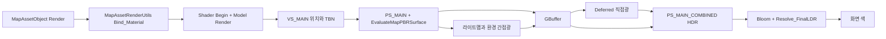

# 셰이더 호출 흐름과 빌드 비용 학습

2026-10-09 현재 코드와 기존 측정 기록을 구분해 읽는 자료다. 기존 [렌더링 기술 정리](C:/Users/tnest/Desktop/LostArk/.md/GB/10-09/2026-10-09_RENDERING_TECHNICAL_STUDY.md)를 대체하지 않는다. 제품 코드와 PPT는 변경하지 않았다. 아래 원본 줄 번호는 조사 시점 기준이며, 학습 사본의 추가 주석 때문에 사본 줄 번호는 다르다.

## G01. PPT의 50%와 빌드의 15분을 구분하기

### 기술소개서.pptx의 50%

[기술소개서.pptx](<C:/Users/tnest/Desktop/Interview/기술소개서/기술소개서.pptx>) 14쪽의 “50% 규모의 셰이더”를 뒷받침하는 기존 집계는 다음과 같다.

| 2026-10-07 집계 항목 | 값 | 분모와 의미 |
|---|---:|---|
| 추적 코드 확장자 파일의 실제 바이트 | 156,924,941 bytes | 해당 집계가 포함한 코드 파일 바이트 합계 |
| HLSL/HLSLI 파일의 실제 바이트 | 78,086,130 bytes | 위 분모의 **49.76%** |
| HLSL/HLSLI 물리 줄 수 | 1,343,936줄 | 해당 코드 물리 줄 합계의 43.60%, 주석·빈 줄 포함 |

계산은 `78,086,130 / 156,924,941 × 100 ≈ 49.76%`다. native program별 큰 include와 동일 내용 복사분 17,763,166 bytes가 포함된다. GitHub Linguist의 generated/vendor 판정까지 재현한 값은 아니다. **GPU 실행 시간, 성능 개선율, 개발 기여도, Unreal 이전 완료율로 설명할 근거가 없다.** 전체 파일을 이번 작업에서 새로 집계한 수치도 아니다. [당시 구조 조사 RESULT](C:/Users/tnest/Desktop/LostArk/.md/GB/10-07/2026-10-07_PROJECT_STRUCTURE_AUDIT_RESULT.md:34)

면접에서는 다음 정도가 정확하다.

> 프로젝트의 추적 코드 파일 바이트를 집계했을 때 HLSL/HLSLI가 약 49.76%였습니다. 이는 코드 규모 지표입니다. 복원한 재질별 셰이더와 공용 include가 비중을 차지하며, GPU 성능은 별도 프로파일러 측정으로 판단합니다.

### 15분은 무엇을 재었는가

2026-09-29 통합 뒤 Product 빌드 기록에 다음 값이 있다. 현재 PC에서 이번 작업으로 재측정한 값이 아니다.

| 기록 구간 | 경과 시간 |
|---|---:|
| 전체 Product 빌드 | 20분 47.210초 |
| FXC task | 15분 45.697초 |
| 기본 Mesh 셰이더 command → CSO 저장 성공 | 15분 45.500초 |
| 기본 AnimMesh 셰이더 command → CSO 저장 성공 | 13분 58.379초 |
| C++ 첫 CL → 마지막 CL | 3분 0.929초 |
| Link | 36.949초 |

개별 shader 시간은 **명령 로그부터 출력 저장 로그까지의 벽시계 경과**다. optimizer 순수 CPU 시간이나 특정 함수의 비용을 측정한 값은 아니다. 병렬 작업이 겹치므로 Mesh와 AnimMesh 시간을 더해 전체 빌드 시간으로 쓰면 안 된다. 당시 FXC 항목 224개 중 실제 실행은 36개였고, 기존 출력 경로를 사용했으므로 전체 cold build 기록도 아니다. [당시 빌드 RESULT](C:/Users/tnest/Desktop/LostArk/.md/GB/09-29/2026-09-29_RELEASE_RAID_PR_INTEGRATION_RESULT.md:292)

당시 공용 include의 checkout 수정 시각 변화가 증분 상태를 무효화한 근거도 있다. 다만 “거대한 특정 함수 하나가 15분을 만들었다”까지 입증된 것은 아니다. 실제 FXC 병렬 설정, 여러 VS/PS가 들어 있는 Effects 입력, include와 전처리 분기를 함께 확인해야 한다. [증분 무효화와 컴파일 범위](C:/Users/tnest/Desktop/LostArk/.md/GB/09-29/2026-09-29_RELEASE_RAID_PR_INTEGRATION_RESULT.md:312)

### CModel과 AnimMeshBinary는 같은 종류의 파일이 아니다

| 실제 파일 | 조사 시점 크기 / 줄 수 | 책임 |
|---|---:|---|
| [Model.h](C:/Users/tnest/Desktop/LostArk/Engine/Public/Model.h) | 33,588 bytes / 649줄 | CModel의 모델·재질·애니메이션 API와 상태 선언 |
| [Model.cpp](C:/Users/tnest/Desktop/LostArk/Engine/Private/Model.cpp) | 163,681 bytes / 3,443줄 | 모델 로드, 재질 연결, 애니메이션, mesh draw 호출 |
| [Shader_VtxMeshBinary.hlsl](C:/Users/tnest/Desktop/LostArk/Client/Bin/ShaderFiles/Shader_VtxMeshBinary.hlsl) | 55,993 bytes / 1,295줄 | 비스키닝 모델용 VS와 여러 PS/pass |
| [Shader_VtxAnimMeshBinary.hlsl](C:/Users/tnest/Desktop/LostArk/Client/Bin/ShaderFiles/Shader_VtxAnimMeshBinary.hlsl) | 52,097 bytes / 1,166줄 | 스키닝 모델용 VS와 여러 PS/pass |

`Engine/`, `Client/`의 H/CPP에서 `CAnimMeshBinary`라는 클래스는 확인하지 못했다. 실제 이름은 `Shader_VtxAnimMeshBinary.hlsl`이다. 또한 본체 HLSL 줄 수에는 포함하는 HLSLI 전문이 들어 있지 않으므로 위 1,166줄만으로 FXC 입력 규모를 판단하지 않는다.

런타임 모델 로딩은 [CModel::Ready_BinaryModel](C:/Users/tnest/Desktop/LostArk/Engine/Private/Model.cpp:2575)이 디코더로 asset을 읽고 Bones/Meshes/Materials/Animations를 준비하는 경로다. `Model.Load.Binary`, `Model.Load.Decode`, `Model.Load.Meshes`, `Model.Load.Materials` 같은 CPU scope가 이를 나눠 잰다. 여기서 HLSL을 FXC로 컴파일하지 않는다.

런타임 셰이더 로딩은 [CShader::Initialize_Prototype](C:/Users/tnest/Desktop/LostArk/Engine/Private/Shader.cpp:210)이 실행 모듈 기준 CSO를 읽고 `D3DX11CreateEffectFromMemory`를 호출한 뒤 변수·pass·input layout을 준비하는 경로다. scope도 `Shader.Load`, `Shader.ReadBytecode`, `Shader.CreateEffect`, `Shader.BuildBindings`로 나뉜다. **소스 컴파일, 런타임 CSO 로드, 모델 asset 로드, 매 프레임 GPU 실행은 네 가지 다른 비용이다.** 이번 조사에서는 이 로드 scope의 새 실측 시간을 얻지 않았다.

## G02. CPU에서 PBR 셰이더까지 한 경로 따라가기

이번 대표 경로는 `CMapAssetObject`의 비인스턴싱 deferred map PBR이다. 모든 모델이 이 경로를 사용하지 않는다. 정적 batch, 캐릭터 source program, 물·반투명, debug view는 별도 분기를 가진다.

### 함수별 책임과 실제 호출 순서

| 원본 위치 | 한 줄 책임과 다음 소비자 |
|---|---|
| [CMapAssetObject::Render](C:/Users/tnest/Desktop/LostArk/Client/Private/MapAssetObject.cpp:359) | mesh마다 `Bind_Material → CShader::Begin → CModel::Render` 순서로 제출한다. |
| [CMapAssetRenderUtils::Bind_Material](C:/Users/tnest/Desktop/LostArk/Client/Private/MapAssetRenderUtils.cpp:1004) | 모델 재질과 인스턴스·환경 값을 해당 Effect 변수/텍스처 이름에 연결한다. |
| [g_SurfaceProgram 바인딩](C:/Users/tnest/Desktop/LostArk/Client/Private/MapAssetRenderUtils.cpp:1256) | source material 사용 여부와 재질 family로 분기를 고른다. 기본 변수 값만으로 실제 분기를 결정할 수 없다. |
| [PBR 입력 바인딩](C:/Users/tnest/Desktop/LostArk/Client/Private/MapAssetRenderUtils.cpp:1440) | normal/detail/ORM SRV와 metallic·roughness·AO 등의 숫자를 전달한다. |
| [CMaterial::Bind_SurfaceLighting](C:/Users/tnest/Desktop/LostArk/Engine/Private/Material.cpp:1479) | 재질이 소유한 라이트맵·환경 cube·BRDF lookup 텍스처를 연결한다. |
| [CShader::Begin](C:/Users/tnest/Desktop/LostArk/Engine/Private/Shader.cpp:750) | 선택 pass와 input layout/상태를 적용한다. 자체적으로 mesh를 그리지는 않는다. |
| [CModel::Render](C:/Users/tnest/Desktop/LostArk/Engine/Private/Model.cpp:1084) | mesh buffer를 bind하고 mesh draw를 호출한다. |
| [VS_MAIN](C:/Users/tnest/Desktop/LostArk/Client/Bin/ShaderFiles/Shader_VtxMeshBinary.hlsl:107) | 위치를 클립 공간으로, 법선·접선 기저를 월드 공간으로 전달한다. |
| [PS_MAIN](C:/Users/tnest/Desktop/LostArk/Client/Bin/ShaderFiles/Shader_VtxMeshBinary.hlsl:313) | `EvaluateMapSurface`가 선택한 표면 상태를 GBuffer에 저장한다. |

바인딩 함수는 `HRESULT` 실패를 검사한다. `CMapAssetObject::Render`의 해당 draw 체인은 바인딩/Begin 실패 시 뒤 draw를 실행하지 않고 실패 경로로 나간다. CPU가 정상 값을 바인딩했다는 사실과 실제 화면이 기대대로 나왔다는 사실은 별도 검증이다.

### 자주 읽을 변수

| 변수 | 입력과 의미 | 색에 도달하는 지점 |
|---|---|---|
| `g_DiffuseTexture`, diffuse color/brightness/saturation | mesh 재질의 diffuse texel과 색 조절 계수 | albedo를 만들고 직접광 diffuse에 곱한다. |
| `g_NormalTexture`, detail normal, normal intensity | 접선 공간 표면 방향 | 월드 normal로 변환되어 광원/시선 내적과 반사 방향을 바꾼다. |
| `g_SurfaceORMTexture` | R=AO, G=roughness, B=metallic | 간접광 차폐, specular 분포, diffuse/specular 배분에 쓰인다. |
| `g_SurfaceSpecularPBRIntensity` | 비금속 정면 반사율 계수 | `F0 = lerp(0.08 × intensity, albedo, metallic)`의 비금속 끝값이다. |
| `g_EnvironmentCubeTexture` | 반사 방향별 환경색 | roughness에 따른 mip를 읽어 환경 specular를 만든다. |
| `g_EnvironmentBRDFLookupTexture` | 시선·roughness에 따른 반사 가중치 표 | IBL BRDF 가중치 계산용이며 화면 색보정 LUT와 다르다. |
| `g_fToneMapExposure`, source curve 또는 whitepoint/gamma | CRenderer가 저장 설정에서 바인딩 | HDR 합성 뒤 화면 범위로 바꾸는 최종 단계다. |

## G03. 입력 변수에서 화면 RGB까지 식 읽기

### Shader_MapMaterialSurface.hlsli: 텍스처를 표면 상태로 바꾼다

[EvaluateMapPBRSurface](C:/Users/tnest/Desktop/LostArk/Client/Bin/ShaderFiles/Shader_MapMaterialSurface.hlsli:447)의 순서는 UV → texel → normal → reflection 혼합 → ORM → albedo/F0다. 아래 표기는 실제 코드의 읽기용 축약이며 독립 구현용 대체 수식은 아니다.

1. `tiledUV = meshUV × uvTiling`으로 texture 좌표를 잡는다. normal의 RG를 `2 × RG − 1`로 복원하고 Z를 `sqrt(max(1 − x² − y², 0))`로 구한다. 강도를 적용한 detail XY와 섞어 normalize한 뒤 TBN 기저로 월드 normal을 얻는다.
2. `Y = dot(diffuse.rgb, (0.3, 0.59, 0.11))`, `baseDiffuse = lerp(Y, diffuse.rgb, saturation) × diffuseColor × brightness`다.
3. `q = reflection × reflectionColor × (1 + contrast) − contrast`, `w = normalAlpha × reflectionIntensity`일 때 `reflectedDiffuse = clamp((baseDiffuse + w × saturate(q)) × (1 − w × saturate(−q)), 0, 999)`다. 이 2D reflection 혼합은 환경 cube IBL과 별도다.
4. `metallic = saturate(SafePow(ORM.b × metallicIntensity, metallicPower))`, `AO = saturate(SafePow(ORM.r × AOIntensity, AOPower))`다. roughness도 ORM.g와 intensity/power로 구하고 최소값·진단 offset을 적용한다. source indirect 모드의 최소값은 0.045다.
5. `albedo = saturate(reflectedDiffuse × lerp(nonmetalBrightness, metalBrightness, metallic))`, `F0 = lerp((0.08 × saturate(specularPBRIntensity)).xxx, albedo, metallic)`다. [ORM와 F0 실제 식](C:/Users/tnest/Desktop/LostArk/Client/Bin/ShaderFiles/Shader_MapMaterialSurface.hlsli:497)

normal 강도를 두 배로 하면 표면 방향이 변한다. reflection 계수를 두 배로 하면 이 혼합식의 한 항이 변한다. 어느 경우도 최종 RGB나 GPU 시간이 정확히 두 배라는 뜻은 아니다.

### Shader_VtxMeshBinary.hlsl: 조명이 읽을 형태로 보관한다

PBR 경로는 다음 payload를 쓴다. 이 구조는 [PS_MAIN의 실제 기록](C:/Users/tnest/Desktop/LostArk/Client/Bin/ShaderFiles/Shader_VtxMeshBinary.hlsl:332)과 deferred의 읽는 쪽이 맞아야 한다.

| 필드 | PBR 값 |
|---|---|
| `vDiffuse.rgb` | albedo |
| `vNormal.rgb / .a` | `worldNormal × 0.5 + 0.5` / roughness |
| `vDepth.z / .w` | material AO / PBR 분기 표식 3 |
| `vMaterialSpecular.rgb / .a` | F0 / metallic |
| `vPickPos` | 월드 위치와 부호화한 기하법선·정적 그림자 정보 |
| `vCharacterGeometry.rgb` | 이 경로가 계산한 간접광 반환값 |
| `vCharacterSurface.rgb` | 환경 specular 부분을 별도 보존한 값 |
| `vEmissive.rgb` | 발광 |

[EvaluateMapSourceIndirectLighting](C:/Users/tnest/Desktop/LostArk/Client/Bin/ShaderFiles/Shader_MapMaterialSurface.hlsli:642)은 라이트맵 평균/방향, hemisphere, SH, AO 보정, 환경 cube와 BRDF lookup을 조건에 따라 사용한다. 반환값에는 환경 specular가 포함될 수 있다. `vCharacterSurface`의 환경 specular를 반환값에 다시 더하면 중복 합산이 된다. 별도 채널은 기여도 표시 등에 쓰이므로 저장량만 보고 합성식을 추측하지 않는다.

### Shader_Deferred.hlsl: 직접광과 간접광을 HDR 색으로 합친다

[Evaluate_MapSourcePBRDirect](C:/Users/tnest/Desktop/LostArk/Engine/Bin/ShaderFiles/Shader_Deferred.hlsl:373)는 `n=normal`, `v=시선 방향`, `l=광원 방향`, `h=normalize(v+l)`을 쓴다. `NoL`, `NoH`, `VoH`는 해당 벡터 내적이다. 현재 식에는 기하법선에 따른 Fresnel 보정, roughness 보정, 반사 peak 상한이 있으므로 일반 Cook–Torrance 식 한 줄과 동일하다고 설명하지 않는다.

거칠기를 `r`이라 하면 분포 항은 `D = r⁴ / [π × (NoH² × (r⁴ − 1) + 1)²]`다. 코드의 visibility denominator와 peak 제한을 거친 뒤 `diffuseWeight = (1 − metallic) × (1 − Fresnel) × NoL`, `specularContribution = Fresnel × cappedPeak × NoL × π`가 된다. [직접광의 반환식](C:/Users/tnest/Desktop/LostArk/Engine/Bin/ShaderFiles/Shader_Deferred.hlsl:397)

[Resolve_MapPBRLight](C:/Users/tnest/Desktop/LostArk/Engine/Bin/ShaderFiles/Shader_Deferred.hlsl:414)가 광원색·감쇠·그림자를 곱해 Shade와 Specular에 기록한다. 라이트맵이 있는 PBR 픽셀에는 프로젝트 ambient를 중복으로 더하지 않는다. AO를 모든 직접광에 일괄 곱하는 구조도 아니다.

[PS_MAIN_COMBINED](C:/Users/tnest/Desktop/LostArk/Engine/Bin/ShaderFiles/Shader_Deferred.hlsl:1206)의 중심은 `Lit = albedo × Shade + Specular`다. PBR 표식이면 별도 간접광과 cube diffuse를 해당 그림자·screen AO 경로로 추가한다. Lit에 안개를 적용한 뒤 발광을 더해 HDR 출력과 bloom 입력을 만든다. 이것이 아직 display RGB는 아니다.

### Resolve_FinalLDR: HDR을 화면 색으로 바꾼다

CPU 쪽은 [CRenderer::Render_Final](C:/Users/tnest/Desktop/LostArk/Engine/Private/Renderer.cpp:2737)에서 SceneHDR/Bloom SRV, exposure, source curve/LUT 또는 whitepoint/gamma 등을 전달한다. 실제 셰이더 선택은 [Resolve_FinalLDR](C:/Users/tnest/Desktop/LostArk/Engine/Bin/ShaderFiles/Shader_Deferred.hlsl:1739)에서 확인한다.

- 먼저 `SceneWithBloom = SceneHDR + Bloom × bloomTint`다.
- source post process가 켜져 있으면 `SourceGradingLUT(SourceToneCurve(SceneWithBloom × exposure))`를 반환한다.
- 다른 경로는 `Hable(SceneWithBloom × exposure) / Hable(whitepoint)`를 0~1로 제한한 뒤 `pow(color, 1 / gamma)`를 적용한다. 선택적인 후속 보정도 이 분기에 있다.

source tone curve는 이미 gamma 성격의 항을 포함하며 그 분기에서 반환한다. 거기에 fallback gamma를 다시 적용하는 순서로 설명하면 안 된다. 화면 색보정 LUT는 RGB를 2D slice에 펼쳐 이웃 slice를 보간하는 표다. IBL의 BRDF lookup과 이름은 비슷해도 입력과 역할이 다르다. FXAA/debug/portrait 선택 분기는 추가로 존재하며 이번 조사에서는 어떤 사용자 옵션도 바꾸지 않았다.

## G04. 먼저 읽을 전체 주석 사본 3개

전체 native include 수십만 줄을 처음부터 복사하지 않고, 한 PBR 경로가 연결되는 본체 3개를 골랐다. 전체 원본 내용을 유지하고 한국어 주석만 추가했다. 폴더 구조는 `Study/CodeWalkthrough/Reference/<원본 상대 경로>`다. include와 상태 선언도 보존했지만 필요한 모든 include를 복제한 독립 빌드 패키지는 아니다.

| 권장 순서 | 주석 사본 | 원본 → 사본 줄 수 | 먼저 볼 지점 |
|---|---|---:|---|
| 1 | [Shader_MapMaterialSurface.hlsli](C:/Users/tnest/Desktop/LostArk/Study/CodeWalkthrough/Reference/Client/Bin/ShaderFiles/Shader_MapMaterialSurface.hlsli:478) | 893 → 967 | `EvaluateMapPBRSurface`: 변수·normal·ORM·F0를 연결한다. |
| 2 | [Shader_VtxMeshBinary.hlsl](C:/Users/tnest/Desktop/LostArk/Study/CodeWalkthrough/Reference/Client/Bin/ShaderFiles/Shader_VtxMeshBinary.hlsl:353) | 1,295 → 1,353 | `PS_MAIN`: 계산한 값을 어떤 GBuffer 채널에 쓰는지 확인한다. |
| 3 | [Shader_Deferred.hlsl](C:/Users/tnest/Desktop/LostArk/Study/CodeWalkthrough/Reference/Engine/Bin/ShaderFiles/Shader_Deferred.hlsl:387) | 2,434 → 2,506 | 직접광 → combined → 최종 tone/LUT 순서로 색을 완성한다. |

원본 합계는 **4,622줄 / 209,761 bytes**, 주석 사본 합계는 공백 정리 후 4,823줄이다. 다음 단계로 [MapAssetRenderUtils.cpp](C:/Users/tnest/Desktop/LostArk/Client/Private/MapAssetRenderUtils.cpp:1256) 1,488줄을 읽으면 CPU 입력을 연결할 수 있고, [Shader.cpp](C:/Users/tnest/Desktop/LostArk/Engine/Private/Shader.cpp:210) 827줄을 읽으면 CSO 로드와 Effect pass 적용을 이해할 수 있다. 이 두 C++ 파일은 이번 셰이더 사본 묶음에 추가하지 않았다.

`CModel`은 재질·애니메이션·로딩까지 여러 책임이 들어 있어 첫 읽기부터 3,443줄 전문을 외우기보다 `Ready_BinaryModel`, `Bind_SurfaceLighting`, `Render`를 먼저 연결한다. AnimMesh는 이 흐름을 이해한 다음 본 행렬을 받아 정점을 스키닝하는 차이를 읽는 순서가 낫다.

## G05. 확인된 검증과 남은 경계

[shader-copy-manifest.json](C:/Users/tnest/Desktop/LostArk/Study/CodeWalkthrough/shader-copy-manifest.json)에 파일별 원본/사본 SHA-256, 인코딩, 줄 수, 바이트 수, 추가 주석 위치와 원본→사본 줄 매핑을 저장했다.

- 3개 원본 모두 UTF-8 BOM 없음이며 원본의 줄바꿈을 유지했다.
- 주석·공백을 제외한 코드 토큰은 원본과 일치한다. `Shader_Deferred.hlsl` 사본은 통합 전에 후행 공백과 끝의 빈 줄을 정리했으므로 추가 주석만 제거한 바이트 복원 대상에서는 제외한다. 나머지 두 셰이더 사본은 추가한 주석 블록만 제거하면 원본 바이트와 일치한다.
- 문자열을 보존하는 lexer로 주석을 제외한 토큰 배열 동일성을 확인했다.
- 사본 생성 전후 원본 hash가 동일하다.
- 학습 사본은 프로젝트에서 컴파일하지 않는 읽기 자료로만 취급한다. FxCompile 등록 대상이 아니다.

제품 C++/HLSL, PPT, 렌더 옵션, Data/Resources를 변경하지 않았다. Client/UI 실행, shader 재컴파일, 새 GPU/모델 로드 측정, 화면 판정은 하지 않았다. 토큰 동일성은 설명용 복사본이 원본 연산을 바꾸지 않았다는 증거이며 시각 품질이나 GPU 성능 검증은 아니다.

GPU 비용을 설명할 때는 같은 장면·해상도·설정의 유효한 timestamp sample을 비교해야 한다. CPU render scope는 GPU 시간과 다르고, 비활성·미완료 GPU sample의 0을 실제 0ms로 설명하면 안 된다. 기존 캡처의 구체적 scope와 제한은 [렌더링 기술 정리 G10](C:/Users/tnest/Desktop/LostArk/.md/GB/10-09/2026-10-09_RENDERING_TECHNICAL_STUDY.md:540)을 따른다. 이번 자료는 49.76%를 실행 시간 비중으로 변환하거나 빌드 경과를 런타임 성능 개선으로 환산하지 않았다.
