# 이펙트 툴 저작 방식과 원작 스킬 복원 방향

## 1. 결론

이번 프로젝트의 방향은 다음 두 방식 중 하나를 버리는 것이 아니다.

1. 원작 스킬 이펙트가 어떤 파츠와 리소스를 사용하는지 먼저 추출한다.
2. 추출 결과를 우리 `Effect Document`의 여러 `Element`로 변환해 초안을 만든다.
3. 참고한 이펙트 툴처럼 각 Element의 Mesh와 Base, Noise, Mask, Emissive,
   Dissolve 슬롯을 확인하고 `Effect Detail`에서 값을 조절한다.
4. 여러 Element를 합친 최종 스킬 이펙트 하나를 `Data Files`에 저장한다.
5. Animation cue에 그 최종 Effect asset ID를 연결하고 실제 캐릭터 애니메이션과
   함께 재생해 검수한다.

즉, **원작 데이터 추출은 시작점을 만드는 방법**이고, **이펙트 툴은 추출한
파츠를 고치고 합쳐 최종 결과를 만드는 편집기**다.

모든 스킬을 빈 화면에서 임의의 텍스처로 다시 만드는 방식은 기본 경로로 삼지
않는다. 원본을 복구할 수 없는 파츠나 의도적으로 재해석할 파츠만 수동으로 만든다.

---

## 2. 참고 이미지의 이펙트 툴 방식

이 절은 첨부 이미지에서 직접 확인되는 UI와 그 UI가 의미하는 저작 흐름을
정리한다. 참고 툴의 실제 소스 코드와 저장 포맷은 없으므로, 저장 단위처럼
이미지만으로 확정할 수 없는 부분은 우리 프로젝트의 계약과 구분한다.

### 2.1 Effect Type

화면에는 다음 다섯 종류가 있다.

| 참고 툴 이름 | 우리 이름 | 본질 |
|---|---|---|
| Mesh | Mesh | 정해진 3D Mesh 표면에 텍스처와 셰이더 값을 적용한다. |
| Texture | Sprite | 사각형 면에 텍스처를 붙여 불꽃, 섬광, 문양 같은 카드를 만든다. |
| Particle | Particle | 작은 Sprite들을 시간에 따라 여러 개 방출한다. |
| Decal | Decal | 바닥이나 표면에 무늬를 투영한다. |
| Trail | Trail | 움직이는 두께 있는 띠를 시간 순서대로 이어 그린다. |

`Mesh`만 별도의 Mesh 모양을 선택한다. Sprite, Particle, Decal, Trail은
각자의 생성 방식으로 정점을 만들기 때문에 `Mesh Model` 슬롯을 요구하지 않는다.

### 2.2 Mesh Element를 만드는 흐름

참고 이미지의 `Ring0`은 현재 선택한 Mesh 모양이다. 그 아래 다섯 장의 카드는
선택한 Mesh에 연결되는 텍스처 슬롯이다.

| 슬롯 | 역할 | 필수 여부 |
|---|---|---|
| Base | 최종 색과 알파의 기본 무늬다. 흔히 Diffuse라고 부르는 자리다. | 기본적으로 필요 |
| Noise | 일정한 무늬를 깨고 흔들거나 Dissolve 경계를 불규칙하게 만든다. | 선택 |
| Mask | 효과가 보일 영역과 강도를 흑백 값으로 제한한다. | 선택 |
| Emissive | 빛나야 할 부분을 따로 정하고 Bloom 입력을 만든다. | 선택 |
| Dissolve | 시간이 흐르며 나타나거나 사라질 경계 패턴을 제공한다. | 선택 |

작업자는 다음 순서로 파츠 하나를 만든다.

```text
Mesh Type 선택
  -> Ring 같은 Base Mesh 선택
  -> Base / Noise / Mask / Emissive / Dissolve 선택
  -> Effect Detail 값 조절
  -> Preview 확인
  -> 파츠 확정
```

다섯 텍스처를 항상 모두 채워야 하는 것은 아니다. 원본 Material이 쓰는 슬롯만
채우는 것이 우선이며, 없는 슬롯은 흰색 또는 검은색 기본값으로 처리한다.

### 2.3 Mesh가 아닌 Element

- Sprite는 Base 텍스처가 붙은 한 장의 카드다. Billboard를 켜면 카메라를 본다.
- Particle은 Base 텍스처가 붙은 여러 카드를 방출한다. 개수, 수명, 속도,
  가속도와 크기 변화가 추가된다.
- Decal은 Base 텍스처를 월드 표면에 투영한다. 크기와 깊이가 추가된다.
- Trail은 Base 텍스처가 붙은 동적 띠다. 점 수명, 샘플 간격, 너비가 추가된다.

이 네 종류도 Base, Noise, Mask, Emissive, Dissolve를 사용할 수 있지만 Mesh
모양을 고르는 단계는 없다.

### 2.4 Effect Detail

`Effect Detail`은 선택한 파츠 하나의 숫자를 편집하는 곳이다. Position,
Rotation, Scaling, Velocity, Color Multiply, Color Clip, Bloom, UV, Life Time,
Start Delay, After Image, Billboard, Trail Vertex, Pass Name 등을 조절한다.

중요한 점은 이 값들이 최종 스킬 전체에 한 번 적용되는 값이 아니라는 것이다.
불꽃 파츠, 원형 Mesh 파츠, Trail 파츠가 있다면 각 파츠가 자기 값을 따로 가진다.

### 2.5 Data Files와 All Effects

참고 화면에서는 `Data Files`에 `Slayer_Rage_FuriousClaw1`,
`Slayer_Rage_FuriousClaw2`, `...Trail` 같은 이름이 나열되고, `All Effects`에는
`Effect_4_T`, `Effect_5_T` 같은 항목이 나열된다. 따라서 화면상 작업 감각은
다음과 같다.

```text
파츠를 만들고 저장/불러오기
  -> 여러 파츠를 목록에 올림
  -> 시간과 위치를 서로 맞춤
  -> 하나의 재생 가능한 이펙트로 조합
```

다만 참고 툴이 `Data Files` 한 행을 파츠 하나로 직렬화했는지, 여러 파츠가 든
파일로 직렬화했는지는 이미지로 확정할 수 없다. 우리 프로젝트는 이 모호함을
없애기 위해 아래 저장 단위를 명시적으로 사용한다.

---

## 3. 우리 프로젝트의 용어와 저장 단위

### 3.1 Element

`EFFECT_ELEMENT_DESC` 하나는 화면에 그려지는 **시각 파츠 한 겹**이다.

예:

- 검 모양 Mesh 한 겹
- 바닥 원형 Decal 한 겹
- 순간 섬광 Sprite 한 겹
- 흩어지는 먼지 Particle 한 겹
- 무기를 따라가는 Trail 한 겹

각 Element는 자기 Type, 리소스 슬롯, 렌더 프로필, Transform, Color, UV,
Timing과 Type별 세부 값을 소유한다.

### 3.2 Effect Document

`EFFECT_DOCUMENT_DESC` 하나는 여러 Element를 합친 **완성 Effect asset 하나**다.

예를 들어 차원술사 T 하나가 아래 다섯 겹으로 보인다면 저장 구조는 다음과 같다.

```text
effect.dimensionmaster.skill.2050510
  - charge_glow        [Sprite]
  - weapon_trail       [Trail]
  - thrust_mesh        [Mesh]
  - impact_particles   [Particle]
  - ground_mark        [Decal]
```

이 다섯 파츠를 파일 다섯 개로 흩어 최종 스킬로 취급하지 않는다. 최종 저장은
Elements 다섯 개가 들어 있는 **동일한 Effect Document 한 개**다.

### 3.3 현재 UI의 역할

현재 구현은 `Published Effects` 저작 UI를 제거하고 다음 역할로 분리한다.

| 창 | 최종 역할 |
|---|---|
| All Effects | class와 input slot 기준 완성 스킬 문서, Kind 그룹, Element를 트리로 표시 |
| Selected Element | 선택한 Element의 Mesh shape와 Material input 썸네일 슬롯 표시 |
| Resource Library | Element 선택 없이도 domain별 `.wmodel` 또는 `.dds`를 썸네일 그리드로 탐색하고, 슬롯 선택 시 같은 화면에서 binding |
| Effect Detail | 선택한 Element의 숫자와 Type별 세부 값 편집 |
| Preview | 완성 Effect 전체 또는 선택 Element만 캐릭터 애니메이션과 함께 재생 |
| Data Files | `Data/Effects/Authored`의 완성 Effect 문서 생성·저장·불러오기 |
| Model View | 캐릭터, 무기, 애니메이션과 Effect pivot/anchor를 함께 검수 |

따라서 현재 `Data Files`는 파츠 보관함이 아니다. **완성 문서 보관함**이다.
재사용 가능한 파츠 프리셋이 실제로 필요해지면 나중에 `Element Presets`를 별도
개념과 경로로 추가한다. Data Files의 의미를 중간에 바꾸지는 않는다.

완성 문서 내부의 Element는 다음 흐름으로 수정한다.

```text
Data Files 또는 All Effects에서 완성 스킬 문서 선택
  -> All Effects 트리에서 Kind 그룹을 펼침
  -> Element 하나 선택
  -> 선택 Element의 Mesh/Material 썸네일 슬롯 표시
  -> 슬롯 하나 선택
  -> Resource Browser에서 리소스 썸네일 선택
  -> Effect Detail 수정
  -> 완성 Effect 또는 선택 Element Preview
  -> 문서 전체 Save
```

### 3.4 Element와 Resource Slot은 다른 계층이다

Mesh, Sprite, Particle, Decal, Trail은 `Resource Slot`이 아니라 독립적인
`Element Kind`다. 따라서 이 종류들을 `EFFECT_RESOURCE_SLOT` enum에 추가하지
않는다.

```text
완성 Effect Document
  -> N개의 Element
       -> 선택 Element가 사용하는 Resource Slot
```

스킬 하나에 Mesh 세 개, Particle 여덟 개, Decal 두 개, Trail 한 개가 있어도
`Elements` vector에 각각 들어간다. All Effects 트리는 이를 Kind별로 묶어
표시할 뿐이다.

Mesh Element를 선택하면 레퍼런스 툴처럼 다음 카드가 표시된다.

```text
Mesh Shape
[ Mesh Thumbnail ]

Material Inputs
[ Base ] [ Noise ] [ Mask ] [ Emissive ] [ Dissolve ]
```

Particle은 TypeDataMesh 원본을 표현할 수 있으므로 Mesh Shape를 선택적으로 함께
소유한다. Sprite, Decal, Trail은 Material Input 카드만 표시한다. `.dds`는 실제
이미지 썸네일로 표시한다. `.wmodel`은 현재의 `WMODEL`
문자 버튼을 최종 UI로 인정하지 않고, 최소 기능의 offscreen Mesh preview 또는
미리 생성한 Mesh thumbnail로 교체한다. 고급 조명과 품질 고도화는 범위 밖이지만
Mesh의 형상을 구분할 수 있는 썸네일은 툴 완성 범위다.

### 3.5 표준 다섯 슬롯과 가변 Material Template

모든 Element는 우선 레퍼런스와 같은 표준 다섯 Material input을 사용한다.

```text
Base / Noise / Mask / Emissive / Dissolve
```

그러나 원본 Material Instance가 `Base0`, `Base1`, `Noise0`, `Noise1`,
`Distortion`처럼 더 많은 입력을 실제로 사용한다면 enum 값만 계속 늘리지 않는다.
최종 확장 단위는 `Material Template`이다.

```text
Material Template
  -> stable slot ID
  -> semantic role
  -> 화면 표시 이름
  -> HLSL binding 이름
  -> 허용 resource kind
```

표준 Template은 다섯 카드를 만든다. 원본 근거가 있는 별도 Template은 필요한
수만큼 카드를 만든다. UI가 슬롯을 가변 표시하는 것만으로는 렌더링되지 않으므로,
각 추가 슬롯은 반드시 실제 HLSL 변수와 Render Profile 연결을 가져야 한다.
차원술사 T 추출에서 표준 다섯 개를 넘는 실제 입력이 확인되기 전에는 추측으로
Custom slot이나 Shader를 만들지 않는다.

### 3.6 All Effects 트리의 정본 필드

ImGui 배치나 Element 이름 분석이 카테고리의 정본이 되어서는 안 된다. importer가
원본 근거를 바탕으로 다음 authoring metadata를 만든다.

```text
elementId   = q_impact_spark_01
displayName = Impact Spark 01
kind        = particle
groupId     = impact
sourceNode  = OriginalEmitter_07
```

All Effects는 `kind`로 Mesh/Sprite/Particle/Decal/Trail을 묶고, 필요할 때
`groupId`로 Charge/Slash/Impact/Aftermath 같은 의미 그룹을 한 번 더 묶는다.
이름은 사람이 읽는 참고 표시일 뿐 분류 근거가 아니다.

Imported 문서에서 Particle 수는 수동 튜닝 과제 수가 아니라 deterministic playback layer 수다.
차원술사 F는 `7 source system -> 83 converted emitter -> 97 runtime layer`이고 10개 emitter만
시간별 Burst 때문에 둘 이상의 layer로 나뉜다. Imported baseline을 먼저 complete 재생하고 문제가
보이는 emitter/layer만 audition한다. 현재 Kind 아래 평면 layer 표시는 실행 구조이며, 원본 저작 탐색의
다음 경계는 기존 `groupId/sourceNode`를 쓰는 `Source System -> Emitter -> Burst Layer` view와 group
audition/filter다. 이 UI가 없다는 이유로 추출을 버리거나 Effect를 처음부터 수동 재제작하지 않는다.

### 3.7 Published와 검증 레거시 정리 경계

저작 UI에서는 다음을 제거한다.

- `Published Effects` 구역
- `Reload Published Effects` 버튼
- 중복된 `Load Selected Effect` 경로
- G06/G07 같은 개발 단계 문구
- 성공할 때마다 길게 표시되는 검증 상태 문구

All Effects는 `PlayerSkills.json`과 `Data/Effects/Authored`를 기준으로 class,
input slot, 완성 Effect 문서 계층을 직접 구성한다. 런타임이 현재 사용하는
`CEffectCatalog` lookup은 월드 재생 소비자가 있으므로 UI 정리와 함께 무조건
삭제하지 않는다. 별도 direct authored runtime loader로 교체하고 실제 월드 spawn을
검증하기 전까지는 내부 runtime 경계로만 남긴다.

다음 최소 검증은 레거시가 아니다. 화면 전면에서 숨기고 실패 시 Status 한 줄이나
팝업으로만 보여 주되 내부에는 유지한다.

- Resources-relative 경로와 루트 이탈 거부
- 지원 version
- 중복 Effect/Element ID
- 선택 Type에 필요한 Mesh/Base binding
- Load 실패 시 기존 Document와 Preview 보존

이 경계를 제거하면 손상된 authoring 파일 하나가 다시 Client 실행 실패나 부분
commit으로 이어질 수 있다.

---

## 4. 현재 11/11 상태의 정확한 의미

현재 차원술사에는 다음 열한 Effect Document가 있다.

| 입력 | Skill ID | Effect asset ID |
|---|---:|---|
| LMB | 2050010 | `effect.dimensionmaster.skill.2050010` |
| Q | 2050110 | `effect.dimensionmaster.skill.2050110` |
| W | 2050150 | `effect.dimensionmaster.skill.2050150` |
| E | 2050220 | `effect.dimensionmaster.skill.2050220` |
| R | 2050190 | `effect.dimensionmaster.skill.2050190` |
| A | 2050240 | `effect.dimensionmaster.skill.2050240` |
| S | 2050210 | `effect.dimensionmaster.skill.2050210` |
| D | 2050200 | `effect.dimensionmaster.skill.2050200` |
| F | 2050500 | `effect.dimensionmaster.skill.2050500` |
| T | 2050510 | `effect.dimensionmaster.skill.2050510` |
| V | 2050540 | `effect.dimensionmaster.skill.2050540` |

`11/11 runtime 연결`은 다음 연결이 열한 스킬 모두에 존재한다는 뜻이다.

```text
PlayerSkills.json의 skillId
  -> effectId
  -> EffectCatalog.json
  -> Data/Effects/Authored/*.effect.json
  -> Animation .animevents의 시작 시각과 anchor
  -> CEffectPresentationService
  -> 월드 CEffectObject 재생
```

실제 파일도 `Data/Effects/Authored`에 저장돼 있다. F와 T는 이번 complete assembly에서
원본 추출 결과를 승격했다. F는 97 Elements와 Dimension Summon model cue 1개,
T는 111 Elements를 소유한다. 나머지 아홉 문서는 아직 기능 검증용 placeholder이므로
`11/11 연결`과 `11/11 원작 시각 복원`을 같은 뜻으로 쓰지 않는다.

즉, 현재 상태는 다음과 같이 표현해야 정확하다.

- 기능 연결: 11/11
- 실행 가능한 원작 파츠 변환: F/T 2/11
- 원작 시각 튜닝 완료: 0/11에서 별도 A/B 검수
- 툴에서 수동 수정·저장하는 기반: 있음

---

## 5. 차원술사 F/T Complete Effect 현재 상태

현재 애니메이션 연결은 다음과 같다.

```text
Animation : pc_sp_m_00_sk_sk_dimensionthrust_01
Start     : 0 ms
Anchor    : b_wp_swm_m_1
Follow    : follow
Stop      : natural
Effect    : effect.dimensionmaster.skill.2050510
```

T의 Authored 문서는 101 source emitter partition 중 78개를 111 Elements로 변환했다.
Particle 110, Decal 1이며 그중 mesh-backed Particle은 60개다. Light 1,
screen-space post 3, runtime Base binding을 만들 수 없는 emitter 19는 변환 영수증에
Unsupported로 남겼다. T에는 Dimension Summon model cue가 없다.

F의 Authored 문서는 97 Elements와 다음 model cue를 함께 소유한다.

```text
Character/DimensionMaster/DimensionMaster_DimensionSummon.wmodel
  -> sk_swp_dms_00_sk_sk_dimensionprison
  -> 5.458333 s
```

F/T Imported Element의 `startDelaySeconds`가 이미 원본 global timeline을 소유하므로
admitted Effect cue는 0ms에서 한 번만 시작한다. 늦은 원본 사건을 개별 runtime
Effect cue로 중복 생성하지 않는다.

현재 문서 포맷에는 다른 Effect Document를 자식으로 참조하는 중첩 Effect 기능이
없다. F/T 모두 필요한 Element를 한 문서가 직접 소유한다. v7 `modelCues`는 다른
Effect를 중첩하는 기능이 아니라 근거가 있는 animated CModel을 같은 complete
timeline에 결합하는 명시적 경계다.

---

## 6. 맵 복원과 같은 점, 다른 점

후자의 방향이 맞지만 `ImportTable`만 읽으면 이펙트가 완성되는 것은 아니다.

맵에서 다음 두 증거가 모두 필요했다.

```text
ImportTable  = 어떤 Mesh/Material을 의존하는가
Export 속성  = 그 Mesh를 어디에 어떤 Transform으로 배치했는가
```

이펙트도 동일하다.

```text
ImportTable / dependency = 어떤 Mesh, Material, Texture를 사용하는가
Effect export / graph     = 어떤 파츠가 언제, 어디서, 어떻게 재생되는가
```

ImportTable만으로 알 수 있는 것은 리소스 후보와 직접 의존 관계다. 다음 값은
Effect graph나 export property를 추가로 복구해야 한다.

- 파츠의 Type과 계층/재생 순서
- 시작 시각과 수명
- 위치, 회전, 크기와 속도
- 캐릭터 root 또는 무기 bone anchor
- follow 또는 snapshot 정책
- Material Instance의 실제 텍스처 슬롯
- Blend/Pass, 양면, Depth read/write
- UV scroll, tile sequence, dissolve와 color curve
- Particle 방출량, Trail 너비와 샘플 간격

파일명이나 분위기가 비슷한 텍스처를 고르는 방식은 복원이 아니다. 원본
Material Instance가 직접 참조한 텍스처와 슬롯을 우선 사용한다.

---

## 7. 확정한 원작 스킬 이펙트 복원 파이프라인

```mermaid
flowchart LR
    A["PlayerSkills의 실제 skillId"] --> B["원작 skill/effect object 식별"]
    B --> C["ImportTable과 Effect graph 복구"]
    C --> D["Mesh/Material/Texture 직접 의존 추출"]
    D --> E["wmodel/dds와 Resources 상대 ID로 변환"]
    C --> F["각 원본 node를 Element로 변환"]
    E --> F
    F --> G["Imported 초안 Effect Document"]
    G --> H["Effect Tool에서 파츠별 튜닝"]
    H --> I["Authored 최종 Effect Document 저장"]
    I --> J["PlayerSkills + animevents + runtime lookup 연결"]
    J --> K["Model View와 실제 월드에서 A/B 검수"]
```



### 7.1 대상 Skill 확정

작업 목록은 기억으로 적은 `BA Q W E R A S D F V`가 아니라
`Data/Balance/PlayerSkills.json`의 `(characterClass, inputSlot, skillId)`를
정본으로 만든다. 같은 키라도 class와 stance에 따라 Skill ID가 다를 수 있다.

### 7.2 원본 Effect object 식별

스킬 패키지, 애니메이션 notify/cue, Effect package의 참조를 따라 실제 Effect
object를 찾는다. 이름이 비슷하다는 이유만으로 후보를 확정하지 않는다.

### 7.3 Dependency와 graph 복구

각 원본 파츠에 대해 다음 receipt를 남긴다.

- 원본 package/object 경로
- 원본 node ID와 Type
- 부모 또는 재생 순서
- 직접 참조 Mesh, Material Instance, Texture
- 시작/종료 시각
- Transform과 anchor/follow
- Material slot과 Pass/Blend
- 우리 포맷으로 옮기지 못한 field

### 7.4 물리 리소스 변환

원본 Mesh와 Texture는 기존 엔진 경로가 읽는 `.wmodel`과 `.dds`로 변환한다.
Effect JSON에는 절대 경로나 UPK 경로가 아니라 다음처럼 `Resources` 상대 asset
ID만 기록한다.

```text
Effect/DimensionMaster/Meshes/....wmodel
Effect/DimensionMaster/Textures/....dds
```

새로운 두 번째 Mesh 런타임을 만들지 않고 기존 `CModel -> CMaterial` 경로를 쓴다.

### 7.5 Imported 초안 생성

원본 node 하나를 `EFFECT_ELEMENT_DESC` 하나로 변환한다. 자동 변환 결과는 바로
정본이라고 부르지 않고 검수 전 초안으로 구분한다.

권장 구분은 다음과 같다.

```text
Data/Effects/Imported/   자동 추출·변환한 초안과 receipt
Data/Effects/Authored/   툴에서 검수하고 저장한 최종 문서
```

현재 authoring 정본은 `Authored`다. `Imported` 경로와 importer는 아직 구현되지
않았으므로 이 원본 추출 세션에서 source receipt와 함께 추가한다. 저작 툴은 이를
열어 검수한 뒤 `Authored` 완성 문서로 저장한다.

### 7.6 툴에서 파츠별 수정

초안 문서를 열면 `Active Effect Elements`에 원본 파츠들이 나열된다. 작업자는
파츠 하나를 선택하고 다음만 수정한다.

1. Type과 Mesh/텍스처 직접 의존이 올바른지 확인한다.
2. Base, Noise, Mask, Emissive, Dissolve 썸네일을 확인한다.
3. Effect Detail에서 Transform, Color, UV, Timing, Lerp와 Type별 값을 조정한다.
4. 같은 시간의 원작 영상과 Model View를 A/B 비교한다.
5. 모든 파츠가 맞으면 문서 전체를 `Authored`에 저장한다.

Importer가 채우는 수치는 완성 정답이 아니라 다음 세 등급의 **튜닝 시작값**이다.

- `EXACT`: 원본 상수, 단순 범위, 단일 시각과 현재 필드가 같은 의미다.
- `APPROXIMATION`: 원본 다중 곡선이나 Material parameter를 현재 Start/End,
  UV Speed, Dissolve Start 같은 더 단순한 필드로 줄였다.
- `UNSUPPORTED`: 현재 Particle Rect, 정적 Mesh, 단순 Trail/Decal로 의미를 보존할
  수 없다. 값을 억지로 넣지 않고 원본 node와 이유를 표시한다.

따라서 작업자는 `EXACT`를 먼저 고정하고 `APPROXIMATION`만 원작과 A/B 비교해
Effect Detail에서 조정한다. `UNSUPPORTED`는 값 튜닝으로 감추지 않고 런타임 확장
목록으로 남긴다.

### 7.7 런타임 연결

최종 문서 저장 뒤 `PlayerSkills.effectId`, `.animevents`의 시작 시각과 anchor,
실제 월드 spawn이 사용하는 runtime lookup을 연결한다. 저작 UI에는 `Published`
단계를 노출하지 않는다. 한 스킬을 눌렀을 때 Animation과 Effect가 같은 Server 승인
action을 표현해야 한다. Effect Tool만 보이고 실제 월드에서 나오지 않으면 완료가
아니다.

---

## 8. 클래스 진행 범위

현재 프로젝트의 playable roster 정본은 다음 다섯 class다.

- Lance Master
- Gunslinger
- Slayer
- Artist
- Dimension Master

이 문서 확정 이후 **원본 Effect 추출 세션의 대상은 차원술사, 창술사, 워로드,
도화가 네 class**다. Warlord는 현재 playable roster에 없지만 원본 package,
Effect graph, Material binding과 리소스 추출 대상에는 포함한다. Warlord를 실제
키 입력과 월드 재생까지 연결하려면 Character Class, PlayerSkills, Animation
binding과 presentation을 함께 추가하는 별도 class onboarding이 필요하며, 추출
완료만으로 runtime playable 완료라고 기록하지 않는다.

우선순위는 다음으로 고정한다.

1. 차원술사 T 하나에서 원본 graph와 Material binding 추출 포맷을 확정한다.
2. 같은 파이프라인으로 차원술사 11개의 원본 구성요소를 추출한다.
3. 창술사와 도화가를 실제 PlayerSkills/stance 슬롯 기준으로 추출한다.
4. Warlord는 원본 구성요소와 리소스를 추출하되 runtime onboarding과 구분한다.
5. 추출 receipt를 완성 툴 세션이 소비할 Imported 초안으로 전달한다.

Lance Master는 stance에 따라 같은 Q/W/E/R/A/S가 다른 Skill ID를 사용하므로
단순한 키 열 개 목록으로 작업량을 계산하지 않는다.

---

## 9. 차원술사 T 적용 결과와 다음 튜닝 순서

1. `2050510`의 14 source system과 직접 Mesh/Material Instance/Texture 의존을 확정했다.
2. 외부 Module closure 753/753을 해결하고 unresolved 0으로 닫았다.
3. 78 emitter를 111 Elements로 변환하고 23 unsupported를 receipt에 보존했다.
4. 임시 `thought_trail` placeholder를 제거하고 canonical Authored 문서를 승격했다.
5. T body 첫 clip의 0ms에서 문서를 한 번 시작하고 기존 `b_wp_swm_m_1` follow anchor를
   유지했다.
6. Effect Tool에서 Element별 thumbnail, Detail, Solo/Mute와 complete replay를 검수한다.
7. 원작 영상과 같은 시각을 나란히 비교해 시작/수명/크기/색/UV를 맞춘다.
8. 19개 fallback binding과 Light/Post/unsupported 23개는 근거를 확인한 뒤 교정하거나
   별도 지원 결정을 남긴다.

---

## 10. 완료 조건

스킬 하나는 다음 조건을 모두 만족해야 복원 완료다.

- 원본 Effect object와 직접 의존 리소스의 근거가 남아 있다.
- 복구한 모든 원본 node가 Element로 매핑되거나 미지원 사유가 명시돼 있다.
- Mesh는 실제 직접 의존 Mesh를 사용한다.
- Base/Noise/Mask/Emissive/Dissolve는 실제 Material slot 근거가 있다.
- 저장 후 다시 불러와도 Element 순서, 리소스와 Detail 값이 같다.
- Model View의 올바른 class, weapon, animation, anchor에서 재생된다.
- 실제 월드의 승인된 스킬 action에서도 같은 Effect asset이 재생된다.
- 누락 리소스나 임의 fallback으로 화면만 비슷하게 보이게 하지 않는다.
- 원작 영상과 같은 시각의 A/B 캡처에서 파츠 누락과 큰 timing 오차가 없다.

전체 툴은 다음이 가능해야 완료다.

- 다섯 Element Type 선택
- Mesh와 다섯 텍스처 슬롯의 썸네일 선택
- Element별 Effect Detail 편집
- 여러 Element의 동시 Preview
- 완성 Effect Document 저장·불러오기
- All Effects 트리에서 class, input slot, Element를 선택
- Model View의 class/weapon/animation/anchor Preview
- 실제 월드 Effect 재생

렌더링 품질 고도화는 이 기능 계약을 닫은 뒤 별도 단계로 둔다.

---

## 11. 하지 않을 것

- 원작 추출 없이 비슷해 보이는 리소스를 임의 조합해 4개 class 전체를 먼저 채우지 않는다.
- ImportTable만 보고 Effect timing과 파츠 배치를 복원했다고 기록하지 않는다.
- 파일명 유사도로 Material texture slot을 추측하지 않는다.
- Element 하나와 완성 Effect Document 하나를 같은 저장 단위로 부르지 않는다.
- `Data Files`를 중간에 파츠 프리셋 저장소로 바꾸지 않는다.
- raw UPK/WFX를 읽는 두 번째 제품 런타임을 만들지 않는다.
- 툴 Preview만 확인하고 실제 캐릭터 스킬 연결을 완료 처리하지 않는다.

이 문서의 북극성은 다음 한 문장이다.

> 원작 스킬 Effect graph를 근거로 여러 시각 파츠를 복구하고, 각 파츠를 우리
> Effect Tool에서 수정한 뒤, 하나의 Effect Document로 저장하여 Animation과
> 실제 월드 스킬 재생에 연결한다.

---

## 12. 최종 ImGui 화면 정본

### 12.1 All Effects와 Preview

```text
┌──────────────────────────── All Effects ────────────────────────────┐
│ Class: [Dimension Master ▼]   Search: [__________________________] │
│                                                                    │
│ ▼ Q  예고                       effect.dimensionmaster.skill.2050110│
│   ▶ Model Cues (0)                                               │
│   ▼ Mesh (2)                                                     │
│     ● q_slash_mesh             [Base Thumbnail]                   │
│       q_impact_ring            [Base Thumbnail]                   │
│   ▼ Sprite (1)                                                   │
│       q_flash                  [Base Thumbnail]                   │
│   ▼ Particle Layers (2) | Mesh-backed 1 | Budget 64             │
│       q_slash_particle         [Base Thumbnail]                   │
│       q_impact_particle        [Base Thumbnail]                   │
│   ▼ Decal (1)                                                    │
│       q_ground_crack           [Base Thumbnail]                   │
│   ▼ Trail (1)                                                    │
│       q_weapon_trail           [Base Thumbnail]                   │
│                                                                    │
│ ▶ W  공간 베기                                                     │
│ ▶ E  일점 관통                                                     │
│ ▶ R  진공                                                         │
└────────────────────────────────────────────────────────────────────┘

┌────────────────── Model / Effect Preview ──────────────────────────┐
│ Character [Dimension Master ▼]  Weapon [Sword ▼]                  │
│ Animation [pc_sp_m_00_sk_sk_dimensionthrust_01 ▼]                 │
│ Sequence: dimensionthrust_01 -> dimensionthrust_02 (1/2)          │
│ Anchor [b_wp_swm_m_1 ▼]   Follow [Follow ▼]                       │
│                                                                    │
│                         3D PREVIEW                                │
│                                                                    │
│             Character + Animation + Complete Effect               │
│                                                                    │
│ [◀] [Play/Pause] [▶]  Time [──────●────────] 1.250 / 2.800       │
│ [✓] Preview Complete Effect   [ ] Solo Selected Element           │
│ [ ] Mute Selected Element     [Reset]                             │
└────────────────────────────────────────────────────────────────────┘
```

완성 스킬 행을 선택하면 전체 Document를 열고 Preview한다. 하위 Element 행을
선택해도 기본 Preview는 완성 Effect를 유지한다. `Solo Selected Element`를 켰을
때만 선택한 파츠 하나를 격리해 본다.

### 12.2 선택 Element의 레퍼런스형 썸네일 슬롯

```text
┌──────────────────── Selected Element ──────────────────────────────┐
│ q_slash_mesh                                      Kind: Mesh      │
│ Group: slash                                     Visible: [✓]     │
│                                                                    │
│ Mesh Shape                                                        │
│ ┌──────────────┐                                                   │
│ │ Mesh Preview │  fm_a_slash_arc_01.wmodel                        │
│ │  Thumbnail   │                                                   │
│ └──────────────┘                                                   │
│                                                                    │
│ Material Inputs                                                   │
│ ┌────────┐ ┌────────┐ ┌────────┐ ┌────────┐ ┌────────┐           │
│ │ Base   │ │ Noise  │ │ Mask   │ │Emissive│ │Dissolve│           │
│ │ thumb  │ │ thumb  │ │ thumb  │ │ thumb  │ │ thumb  │           │
│ └────────┘ └────────┘ └────────┘ └────────┘ └────────┘           │
│              ▲ Selected                                            │
│                                                                    │
│ Material Template [effect.standard ▼]                             │
│ Render Profile    [Additive / Two Sided / Depth Read ▼]           │
├──────────────────── Resource Library ──────────────────────────────┤
│ Authoring Category [DimensionMaster ▼]                            │
│ Library [Meshes] [Textures]  Folder [All ▼]                       │
│ Search [_______________________________________________________]  │
│                                                                    │
│ [thumb] [thumb] [thumb] [thumb] [thumb]                           │
│ [thumb] [thumb] [thumb] [thumb] [thumb]                           │
│ [thumb] [thumb] [thumb] [thumb] [thumb]                           │
│                                                                    │
│ [Bind Selected] [Clear Slot]                                      │
├────────────────────── Effect Detail ───────────────────────────────┤
│ ▼ Transform                                                       │
│   Position       [ 0.0 ][ 0.0 ][ 0.0 ]                           │
│   Rotation       [ 0.0 ][ 0.0 ][ 0.0 ]                           │
│   Scale          [ 1.0 ][ 1.0 ][ 1.0 ]                           │
│                                                                    │
│ ▼ Color                                                           │
│   Color Multiply [ 1.0 ][ 1.0 ][ 1.0 ][ 1.0 ]                    │
│   Color Clip     [ 0.0 ]                                          │
│   Bloom          [ 1.0 ]                                          │
│                                                                    │
│ ▼ UV                                                              │
│   UV Start       [ 0.0 ][ 0.0 ]                                   │
│   UV Speed       [ 0.0 ][ 0.0 ]                                   │
│   Sequence       [ ]   Loop [✓]                                   │
│                                                                    │
│ ▼ Timing                                                          │
│   Start Delay    [ 0.000 ]                                        │
│   Life Time      [ 1.500 ]                                        │
│                                                                    │
│ [Apply Detail] [Revert Detail] [Audition Selected]                │
│ Applied to active Document memory; Save required to persist.      │
└────────────────────────────────────────────────────────────────────┘
```

Element를 선택하지 않아도 Resource Library에서 domain의 Mesh/Texture 전체를
탐색할 수 있다. 슬롯 카드를 누르면 해당 카드에 선택 테두리를 표시하고 Library의
file kind를 WModel 또는 DDS로 맞춘다. 리소스 썸네일을 누른 뒤 `Bind Selected`를
누르면 선택 Element의 해당 binding만 바꾼다. 파일 이름만으로 Base/Noise/Mask/
Emissive/Dissolve 의미를 확정하지 않는다.
Effect Detail의 연속 수치는 좌우 drag 중 local draft를 기존 `CEffectObject`에
live-stage해 바로 비교한다. 이때 active Document는 바꾸지 않으며 Apply 뒤에만
완성 Document memory에 commit한다. Revert는 active Document 값을 다시 stage한다.
`Audition Selected`는 선택 Element만 Solo로 만들고 해당 Element의 `startDelaySeconds`로
seek해 재생한다. 여러 body clip이 binding된 스킬은 첫 clip만 반복하지 않고 목록 순서대로
non-loop 재생한 뒤 첫 clip로 돌아간다.

### 12.3 Data Files

```text
┌──────────────────────────── Data Files ────────────────────────────┐
│ Active: effect.dimensionmaster.skill.2050110         [DIRTY]      │
│ Particle Layers 95 | Mesh-backed 31 | Budget 886                  │
│ Asset ID     [effect.dimensionmaster.skill.2050110____________]   │
│ Display Name [예고_____________________________________________]   │
│                                                                    │
│ [New] [Save] [Save As] [Promote to Authored Skill]               │
│ [Reload] [Discard]                                                 │
│ Status: Saved Data/Effects/Authored/...                            │
└────────────────────────────────────────────────────────────────────┘

┌──────────────────── Unsaved Effect Changes ───────────────────────┐
│ Current: effect.dimensionmaster.skill.2050500                     │
│ Load:    effect.dimensionmaster.skill.2050510                     │
│ [Save & Load] [Discard & Load] [Cancel]                           │
└────────────────────────────────────────────────────────────────────┘
```

All Effects는 의미 중심 스킬/Element 탐색기이고, Data Files는 물리 문서의 수명과
저장 명령을 소유한다. 둘 다 같은 완성 Document를 가리키지만 역할은 겹치지 않는다.
dirty 상태에서 어느 쪽으로 다른 문서를 선택해도 같은 transaction modal을 사용한다.
target parse/validate/stage가 실패하면 현재 Document와 Preview를 유지한다.

---

## 13. 세션 분업과 인수인계 계약

### 13.1 Effect Tool 완성 세션

별도 구현 세션은 이 문서를 정본으로 읽고 **렌더링 품질 고도화를 제외한 저작
도구 기능 완성**을 맡는다.

- `Published Effects` 저작 UI와 중복 명령 제거
- All Effects의 class/input slot/Kind/Element 트리
- Element 선택과 Add/Delete/Clear
- Mesh Shape와 Base/Noise/Mask/Emissive/Dissolve 썸네일 카드
- Element 선택과 독립된 domain별 Mesh/Texture Resource Library, 선택 슬롯 binding
- Texture thumbnail 유지, 식별 가능한 최소 Mesh thumbnail 추가
- Effect Detail Apply/Revert와 선택 변경 보호
- dirty 문서 전환의 Save & Load/Discard & Load/Cancel transaction modal
- 다중 body clip skillbinding의 순차 Preview와 target/manual override 해제
- 선택 Element의 Solo + 시작 시각 seek audition, Apply-memory/Save-required 상태 표시
- Particle Layers/Mesh-backed/conversion budget summary
- 완성 Effect와 선택 Element Solo/Mute Preview
- Data Files New/Save/Save As/Reload/Discard
- executable Imported 문서의 검증된 Authored skill 승격과 atomic replace rollback
- Model View의 class/weapon/animation/anchor 연결
- authoring 문서 저장·재로드와 실제 월드 Effect 재생
- v7 model cue를 기존 `CEffectObject` timeline에 결합하는 animated `CModel` 경계
- 표준 다섯 슬롯을 기본 Template으로 유지하고, 추출 근거가 도착하면 가변
  Material Template을 연결할 수 있는 데이터 경계 마련

완성 범위에서 제외한다.

- 원작과 픽셀 단위로 맞추는 Shader 품질 조정
- 고급 조명, post process, distortion 품질과 최적화
- 근거 없는 Custom Material slot/Shader 선행 구현
- 네 class의 원본 package 추출

### 13.2 이 원본 추출 세션

현재 세션은 차원술사, 창술사, 워로드, 도화가의 Effect 구성요소와 직접 의존
리소스를 최대한 완전하게 복구한다.

#### 차원술사 F Dimension Summon의 고정 배경

Animation Tool의 가장 아래 `Dimension Summon (2 clips)` 항목에서 원작과 같은
Mesh 결합 애니메이션을 확인했다. 정확한 모델은 다음 파일이다.

```text
Character/DimensionMaster/DimensionMaster_DimensionSummon.wmodel
  -> Mesh 4개
  -> sk_swp_dms_00_sk_sk_dimensionprison
  -> sk_swp_dms_00_sk_sk_dimensionprison_1
```

현재 스킬 정본에서 포탈 계열 기준은 T가 아니라 F다.

```text
F / 2050500 / 업의 경계
  -> Character body clip: pc_sp_m_00_sk_sk_dimensionprison

T / 2050510 / 일념
  -> Character body clip: pc_sp_m_00_sk_sk_dimensionthrust_01
  -> Character body clip: pc_sp_m_00_sk_sk_dimensionthrust_02
```

`Dimension Summon`은 Animation Tool에서 독립 선택·재생된다. F Complete Effect는
이 CModel을 Effect root에 생성해 F body skillbinding과 길이가 일치하는 주 clip
`sk_swp_dms_00_sk_sk_dimensionprison` 하나를 재생하고, Effect Document의 97 Elements를
그 위에 겹친다. `_1` clip은 현재 F skillbinding 근거가 없으므로 순차 재생을 추측하지
않는다. Summon의 네 Mesh와 bone animation을 Effect Mesh Element로 다시 만들거나
중복 렌더링하지 않는다.

```text
Animation / CModel 소유
  -> DimensionMaster_DimensionSummon.wmodel
  -> sk_swp_dms_00_sk_sk_dimensionprison
  -> 원작과 동일한 Summon Mesh 애니메이션

Effect 추출 세션 소유
  -> Particle
  -> Texture / Sprite
  -> Trail
  -> Distortion / Post Effect
  -> ParticleSystem 내부 TypeDataMesh emitter
```

마지막 항목은 캐릭터의 결합 Mesh와 다르다. ParticleSystem이 자체적으로 생성하는
ring, helix, crack 같은 Mesh emitter이므로 Effect 구성요소로 추출한다.

T는 별도 스킬의 Cascade graph와 body animation을 검증하는 좋은 표본으로 계속
사용하지만, `Dimension Summon` 복원 완료 판정의 golden case는 F `2050500`이다.

각 스킬에서 다음을 남긴다.

- class, input slot, skill ID와 원본 skill/effect object
- 원본 graph의 모든 node ID, node type, 부모/순서
- Mesh/Sprite/Particle/Decal/Trail 분류 근거
- Material Instance와 parameter binding
- Mesh, Material, Texture의 직접 의존 경로
- timing, transform, color/UV curve, anchor/follow
- 우리 Element와 Resource Slot으로의 대응
- 변환하지 못한 원본 field와 이유

같은 이름은 참고 자료일 뿐이다. 분류 정본은 원본 Effect graph의 node type과
Material Instance의 parameter binding이다.

자동 분류가 불가능한 원본 node는 억지로 기존 Kind나 다섯 슬롯에 넣지 않는다.

```text
Unsupported / Unresolved
├─ source_beam_node_03
└─ gpu_particle_emitter_02
```

각 미지원 node에는 원본 ID, class/type, 직접 의존, 직렬화된 속성, 미지원 이유를
남긴다. 그 증거를 바탕으로 기존 Element/Shader로 변환할지, 새 Material Template
또는 별도 Element Kind가 필요한지 결정한다.

### 13.3 두 세션이 만나는 데이터

```text
원본 추출 세션
  -> source receipt
  -> normalized node graph
  -> direct resource bindings
  -> Unsupported / Unresolved 목록
  -> Imported Effect Document 초안

Effect Tool 완성 세션
  -> Imported 초안 Load
  -> All Effects/Element 트리 표시
  -> 썸네일 Resource binding
  -> Effect Detail 조정
  -> Authored 완성 Document 저장
```

추출 세션은 툴 내부 구조를 우회하는 별도 runtime을 만들지 않는다. 툴 세션은
원본 근거가 도착하지 않은 Material slot을 추측해 확장하지 않는다.

### 13.4 차원술사 F/T Complete Assembly 적용 상태

차원술사 `F / 2050500 / 업의 경계`는 첫 실행 가능한 Imported 골든 케이스로
변환했다. 상세 구현과 수동 튜닝 경계는 다음 두 문서를 정본으로 사용한다.

- [차원술사 이펙트 리소스 추출·Imported 초안 적용 계획](08-06/2026-08-06_DIMENSIONMASTER_EFFECT_RESOURCE_EXTRACTION_PLAN.md)
- [차원술사 F 이펙트 리소스 추출·Imported 초안 적용 결과](08-06/2026-08-06_DIMENSIONMASTER_EFFECT_RESOURCE_EXTRACTION_RESULT.md)

현재 F 결과는 `88 LOD0 Emitter -> 83 변환 + 5 미지원 -> Burst 분할 후 97 Element`다.
이 97 Elements를 canonical Authored 문서로 승격하고 Dimension Summon 주 clip model cue를
결합했다. 툴 표시는 `Particle Layers 95 | Mesh-backed 31 | Budget 886`이다.

현재 T 결과는 `101 Emitter partition -> 78 변환 + 23 미지원 -> 111 Element`다.
외부 Module 참조는 753/753 해결됐고, 110 Particle와 1 Decal 중 60개 Particle이
Mesh Shape를 가진다. 툴 표시는 `Particle Layers 110 | Mesh-backed 60 | Budget 1,250`이다.
T에는 Summon cue를 넣지 않았고 body binding의 `_01 -> _02` sequence를 순서대로 Preview한다.

두 Imported 문서와 conversion receipt는 provenance로 유지한다. All Effects의 F/T
skill 행과 Data Files의 corresponding Authored 문서는 같은 complete Document를
로드하고 0초부터 자동 재생한다. 남은 항목은 GPU 화면 A/B 튜닝, 19개 T fallback
binding 교정, F Light/Post 5개와 T Light/Post/미지원 23개의 별도 지원 결정이다.
