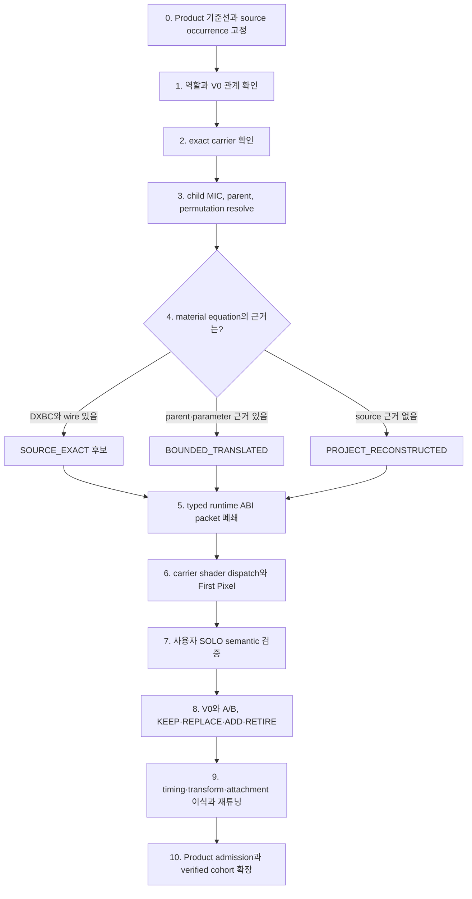

# 이펙트 핵심 원리 — 60줄 요약

복원 단위는 shader 파일이 아니라 stable occurrence `o`다.

```text
Binding(o) = (Program p, Layout l, Descriptor d, Adapter a)
Pixel(o,t) = a.state · p(l.pack(d(o,t)), a.varyings(o,t))
Product(o) = BindingClosed(o) ∧ CompositionClosed(o) ∧ UserApproved(o)
```

- `Program`: pixel 계산식. equation/static permutation이 다르면 다른 Program이다.
- `Layout`: texture/sampler/CB/DynamicParameter/scene-input의 GPU ABI다.
- `Descriptor`: occurrence가 Layout에 넣는 실제 DDS와 scalar/vector 값이다.
- `Adapter`: Sprite/Mesh/Decal/Trail의 몸, VF, pass, MRT, blend/depth/cull이다.
- `Composition`: cue, timing, transform, attachment와 Product 선택이다.

```text
재사용 가능 ⇔ p₁=p₂ ∧ l₁=l₂ ∧ a₁=a₂
값만 다름   ⇒ Descriptor만 추가
식이 다름   ⇒ Program 추가
ABI가 다름  ⇒ Layout 추가
몸/pass가 다름 ⇒ Adapter 추가
```

도화가 F의 `S6/M3/D14`는 한 공식이 아니다.

```text
S6  = Sprite Adapter × RuntimeMaterialV2 opcode 6
M3  = Mesh Adapter   × RuntimeMaterialV2 opcode 3
D14 = Decal Adapter  × LocalDecal opcode 14
```

따라서 모든 Sprite가 `S6`인 것이 아니다. 몸 `S`는 공유해도 식이 다르면 `S17` 또는 새 Program이다.

```text
DXBC  = 원본 compiled Program oracle
.hlsli = 한 Program의 식·ABI guard·검증 가능한 번역
.hlsl  = carrier VS/PS entry, VF, pass, MRT/state bridge
```

169개 번역 HLSLI는 각각 `b0/t0/s0`를 선언하므로 한 mega-switch에 전부 include하면 충돌한다.
SOURCE_EXACT은 `sealed DXBC pixel Program + 호환 Adapter bridge`이고, HLSLI 재컴파일본은 동등성 봉인 전 bounded다.
opcode는 backend 안의 stable 식별자이지, 169-way runtime switch를 강제하는 번호가 아니다.

```text
Bindable(o) = Equation ∧ Layout ∧ Values ∧ Sampler ∧ VF/Pass ∧ MRT/State
```

식이 있어도 Descriptor 값, static permutation, scene CB, MRT, WPO, carrier가 하나라도 없으면 막힌 행이다.
WPO는 vertex Program이고, Light/ScreenPost/ModelCue는 pixel material이 아닌 presentation이다.
669행 전수 ledger는 669 opcode가 아니다. 같은 Program을 dedupe하고 occurrence별 blocker를 보존한다.
Program library 완료와 Product 복원 완료도 다르다. 마지막 화면 판정은 사용자의 서면 승인만 닫는다.

---

## 질문 답변: family, DXBC replay, bounded equation, fail-closed는 같은 것인가

### 먼저 한 문장으로 답하면

**전부 다른 개념이다.** 위 28행의 `DXBC/HLSL/material family`는 “어떤 수학식인가”라는
질문에 필요한 세 층을 한 칸에 압축한 표현이지, 세 용어가 같은 뜻이라는 의미가 아니다.

```text
DXBC                         번역된 HLSL                    Material family
원본 compiled program 증거  우리가 실행할 수 있게 쓴 식   그 식과 ABI를 재사용하는 단위
        │                           │                              │
        └──── fidelity를 판정 ──────┴──── occurrence가 family를 선택 ┘
```

더 정확히 분리하면 다음과 같다.

| 용어 | 무엇인가 | 답하는 질문 |
|---|---|---|
| `DXBC` | 특정 cooked shader permutation의 실행 bytecode와 input/output/resource signature | 원본 program이 어떤 명령을 어떤 register와 slot에 사용했는가? |
| translated `HLSL` / typed equation | DXBC나 parent evidence를 사람이 읽고 runtime이 컴파일할 수 있게 다시 쓴 실제 계산식 | 우리 renderer가 pixel을 어떻게 계산할 것인가? |
| `Material family` | 같은 의미의 equation과 ABI를 공유하는 재사용 집합 | 여러 occurrence 중 어느 것들이 같은 program/layout을 재사용할 수 있는가? |
| `ShaderMap` | parent, effective static set, platform, VF/pass에 맞는 cooked permutation을 선택하는 배선 문맥 | 이 occurrence에서는 어느 permutation을 골라야 하는가? |
| `Descriptor / ABI packet` | 실제 texture, channel, sampler, CB, DynamicParameter, scene input 값 | 선택한 식의 각 입력에 무엇을 넣는가? |
| `Carrier adapter / dispatch` | Sprite, Mesh, Decal, Trail 등의 draw를 program/layout/pass에 연결하는 실행 경계 | 그 식을 어느 몸과 pass에서 어떻게 실행하는가? |
| fidelity | 복원식이 원본 증거에 얼마나 강하게 묶여 있는지 나타내는 등급 | 이 구현을 어디까지 원본과 같다고 주장할 수 있는가? |
| admission | Tool 또는 Product에서 실제 draw를 허용할지 나타내는 상태 | 지금 실행해도 되는가? |

DXBC가 `t0`, `s0`, `cb0`, 입출력 register와 instruction을 보여 주더라도, `t0`에 실제로
어느 DDS를 넣는지는 ShaderMap, child override와 descriptor를 함께 보아야 한다. 반대로 parent의
parameter 이름과 기본값만 알아도 bounded 식은 만들 수 있지만, 그 식을 `SOURCE_EXACT`라고 부를
수는 없다.

### 도화가 F의 `7 + 22 + 4 + 2`가 실제로 분류한 것

도화가 F의 숫자는 **35개 material family의 종류가 아니라, legacy registry에 있던 35개
source occurrence 각각의 fidelity와 실행 판정**이다.

| occurrence 판정 | 행 수 | 정확한 뜻 | family인가? |
|---|---:|---|---|
| `EXACT_CACHE_DXBC_SEMANTIC_REPLAY` | 7 | exact cache/DXBC에서 회수한 pixel equation의 의미를 translated HLSL로 재생 | 아니오. occurrence의 근거 등급 |
| `BOUNDED_EXPLICIT` | 22 | texture/channel/CB/output 식을 명시했지만 native VF/pass/sampler/fog/MRT 등의 경계를 남김 | 아니오. typed equation과 그 근거 한계를 함께 나타낸 판정 |
| `UNRESOLVED_FAIL_CLOSED` | 4 | 안전하게 실행할 equation·packet·adapter tuple이 닫히지 않아 draw를 차단 | 아니오. 실패 안전 상태 |
| `NON_CORE_FORBIDDEN` | 2 | Light와 ScreenPost를 core material evaluator에 넣지 않고 별도 presentation 경로로 보냄 | 아니오. material fidelity는 `NOT_APPLICABLE` |

즉 다음 식으로 읽어야 한다.

```text
7 exact + 22 bounded + 4 fail-closed + 2 typed presentation
= 35 occurrence decisions
≠ 35 material families
```

실제 registry를 family ID로 다시 세면 exact 7행은 4개 family, bounded 22행은 16개 family를
참조한다. 이 둘을 더해서 전체 family 수라고 해도 안 된다. 같은 family가 서로 다른 occurrence
상태에 걸칠 수 있기 때문이다. 예를 들어 같은 `material-family-d0f9...`를 참조해도 두 occurrence는
unresolved이고 다른 occurrence 하나는 bounded다. family의 의도된 equation은 같아도 child/static
permutation, descriptor, carrier, pass와 scene input closure가 occurrence마다 다르기 때문이다.

근거는
[`Effect_Artist31470ShaderRegistry.h`](../../Client/Public/Effect_Artist31470ShaderRegistry.h)에서
`strFamilyId`, `eFidelity`, backend/opcode, native admission, draw admission을 서로 다른 field로 둔
것과
[`Effect_Artist31470ShaderRegistry.cpp`](../../Client/Private/Effect_Artist31470ShaderRegistry.cpp)의
35행 registry와 정적 검증에서 확인할 수 있다.

### `exact semantic replay`는 DXBC 자체인가

아니다. 관계는 다음 순서다.

```text
exact ShaderMap / DXBC evidence
        ↓ disassemble하고 register·sample·연산 순서를 해독
translated HLSL equation
        ↓ typed layout과 descriptor로 입력을 공급
semantic replay
```

따라서 `EXACT_CACHE_DXBC_SEMANTIC_REPLAY`는 “raw DXBC 파일을 runtime이 그대로 실행한다”는 뜻도,
“native BasePass 전체가 bit-exact하다”는 뜻도 아니다. **선택한 pixel program의 연산 의미를 exact
DXBC 근거로 복구했다**는 역사적 Artist F registry 등급이다.

이 등급과 현재 전역 ledger의 `SOURCE_EXACT`도 완전히 같은 범위로 읽으면 안 된다.
현재 팀 정본의 `SOURCE_EXACT`는 equation뿐 아니라 ShaderMap selection, native wire,
VF/pass/state와 수치 A/B까지 닫은 더 넓은 exact tuple이다. 도화가 F의 exact 7행은 강한 pixel
equation 증거이지만, 그 사실만으로 `NATIVE_PARITY`가 끝난 것은 아니다.

### `bounded typed equation`은 material family인가

아니다. 이것은 두 말을 합쳐 부른 표현이다.

```text
typed equation : 입력 lane과 출력 의미가 명시된 실행식이 있다
bounded        : 다만 무엇이 원본 exact인지와 아직 모르는 경계를 정직하게 제한한다
```

예를 들어 parent material의 texture parameter, scalar/vector 기본값, blend, masked/two-sided,
DynamicParameter 이름은 있지만 해당 permutation DXBC가 없을 수 있다. 이 정보로 Base RT0 식과
packet을 닫았다면 `BOUNDED_TRANSLATED`로 실행할 수 있다. 별도의 family ID는 그 식과 ABI를
재사용하기 위해 붙인다.

따라서 한 occurrence는 최소한 다음 축을 동시에 가진다.

```text
Occurrence
├─ 역할              core material | light | screenPost | model cue
├─ carrier            Sprite | Mesh | Decal | Trail | ...
├─ family/program     어떤 equation/layout을 재사용하는가
├─ fidelity           SOURCE_EXACT | BOUNDED_TRANSLATED
│                     | PROJECT_RECONSTRUCTED | NOT_APPLICABLE
├─ descriptor/adapter 실제 입력 배선과 draw 연결이 닫혔는가
├─ admission          NOT_ADMITTED | TOOL_ONLY | PRODUCT_ADMITTED
└─ visual review      PENDING | USER_APPROVED | USER_WAIVED
```

family 하나만 찾았다고 복원이 끝나지 않고, DXBC 하나만 찾았다고 해당 family의 모든 occurrence가
자동 복원되지 않는 이유가 바로 이것이다.

### DXBC가 없으면 반드시 fail-closed인가

**아니다. DXBC 유무와 fail-closed는 일대일 관계가 아니다.**

- DXBC가 없어도 parent graph/parameter/default/texture-role 증거가 충분하면
  `BOUNDED_TRANSLATED`로 equation과 packet을 닫을 수 있다.
- source 증거가 없더라도 프로젝트가 의도적으로 식을 저작하고 provenance와 사용자 승인을 남기면
  `PROJECT_RECONSTRUCTED`가 될 수 있다.
- DXBC가 있어도 필요한 child/static permutation, concrete texture binding, sampler/CB packet,
  VertexFactory, pass, SceneDepth/SceneColor, MRT 또는 carrier adapter가 없으면 fail-closed다.
- Light와 ScreenPost는 DXBC 없는 material 실패가 아니다. material equation이 적용되지 않는 별도
  typed presentation 문제다.

도화가 F에도 PS/VS DXBC가 있으면서 SceneDepth, fog, auxiliary MRT carrier가 닫히지 않아
fail-closed인 occurrence가 있다. 반대로 exact DXBC identity가 있어도 native LocalDecal 전체가 아니라
RT0 projection만 재생하므로 bounded로 남은 occurrence가 있다. 이 두 사례만으로도
`DXBC 있음 = exact 완료`, `DXBC 없음 = fail`이라는 공식은 성립하지 않는다.

### 그렇다면 도화가 Z처럼 어려운 이펙트는 fail이 더 많아지는가

**초기 unresolved와 fail-closed가 많아질 가능성은 높지만, 이유는 “DXBC가 적어서” 하나가 아니다.**
복합 이펙트일수록 occurrence 수, distinct family/permutation, carrier 종류, DynamicParameter,
attachment, scene input, Light/ScreenPost 같은 presentation lane이 함께 늘어나므로 닫아야 할 tuple이
많아진다.

현재 main의 도화가 Z(`31050`, 저무는 달)는 이를 수치로 보여 준다.

```text
변환된 source emitter                         23
현재 Product particle occurrence              10
  ├─ 현재 bounded/typed 경로로 실행되는 행       4
  └─ dormant fail-closed 행                     6
Product에서 빠져 Tool 후보로만 복구한 occurrence 13
  ├─ harmony 본체                               8
  ├─ trail                                      2
  ├─ Light                                      1
  └─ ScreenPost                                 2
```

이 상태는
[`2026-08-22_WARLORD_A_CHAIN_AND_ARTIST_Z_CARRIER_RESTORATION_RESULT.md`](08-22/2026-08-22_WARLORD_A_CHAIN_AND_ARTIST_Z_CARRIER_RESTORATION_RESULT.md)와
`effect.artist.skill.31050.restoration-candidate`에서 확인한다.

여기서 중요한 점은 **빠진 13행을 13개의 material fail이라고 세면 안 된다는 것**이다.

- 13행은 아직 Product에 선택·삽입하지 않은 source-derived candidate다.
- 그중 3행은 Light/ScreenPost이므로 material family가 아예 적용되지 않는다.
- 나머지 10 particle occurrence도 parent/static set, family, carrier와 descriptor를 조사하기 전에는
  exact/bounded/project/fail 중 어느 것으로 끝날지 확정할 수 없다.
- 현재 Product의 4행이 Z 전용 exact DXBC 없이도 bounded 경로로 실행된다는 사실 자체가
  “DXBC가 없어서 전부 fail”이라는 가설의 반례다.

Z의 현재 첫 병목은 `DXBC 파일 수`가 아니라 다음 네 가지가 겹친 것이다.

```text
23 → 10 occurrence 손실
+ Product 안의 dormant fail-closed 6행
+ Light/ScreenPost Product presentation 0행
+ exact 또는 bounded runtime packet/admission 미완료
```

### 구현 순서는 어떻게 잡아야 하는가

모든 DXBC를 먼저 모으거나 모든 occurrence를 한 번에 연결하지 않는다. **대표 occurrence 하나에서
완전한 수직 tuple을 닫고, 동일한 tuple에만 수평 확장**한다.

1. **분모 고정** — source receipt, 현재 Product, V0 retirement를 대조해 stable occurrence ledger를 만든다.
2. **역할 분리** — material-capable occurrence와 Light/ScreenPost/ModelCue를 먼저 갈라낸다.
3. **carrier 확정** — Sprite, Mesh, Decal, Trail과 geometry/simulation을 원본 기준으로 확정한다.
4. **family clustering** — parent 이름만 보지 말고 effective static set, program/layout, descriptor와
   carrier/pass 요구까지 비교해 재사용 집합을 만든다.
5. **대표 canary 선택** — 화면 기여도가 크고 같은 tuple의 재사용 행이 많은 occurrence 하나를 고른다.
6. **fidelity 경로 결정**
   - exact ShaderMap/DXBC가 있으면 instruction, signature, resource register를 번역한다.
   - DXBC가 없고 parent 증거가 충분하면 bounded RT0 equation을 만든다.
   - 증거가 없으면 `PROJECT_RECONSTRUCTED`로 명시 저작하거나 unresolved로 남긴다.
7. **typed equation 구현** — UV, sample, coverage, color, emissive, dissolve, distortion의 식을 닫는다.
8. **runtime ABI packet 구현** — texture/channel, sampler, CB, DynamicParameter와 scene input을 닫는다.
9. **carrier dispatch 구현** — VF, pass, MRT, blend/depth/cull과 stage/commit/rollback을 닫는다.
10. **First Pixel과 사용자 SOLO** — 먼저 한 occurrence만 보이게 하여 식·배선·carrier를 검증한다.
11. **V0 A/B와 composition 복원** — KEEP/REPLACE/ADD를 정하고 timing, transform, attachment를 이식·조정한다.
12. **Product admission과 cohort 확장** — 사용자가 승인한 뒤 같은 exact tuple만 descriptor로 확장하고
    다른 family/carrier는 새 canary로 되돌아간다.

도화가 Z에서는 현재 Product의 visible fail-closed 행 가운데 이미 `SIMPLE02` typed profile이 있는
대표 행 하나를 먼저 canary로 삼는 것이 합리적이다. 우선 `BOUNDED_TRANSLATED` RT0로 열어 SOLO를
확인하고, native exact tuple은 `NATIVE_PARITY` backlog로 분리한다. 이 canary가 통과한 뒤 harmony
본체 8행을 family×carrier cohort로 나누고, trail 2행, Light 1행, ScreenPost 2행을 각각의 typed
경로로 처리한다.

### 이펙트 구현의 핵심 병목

가장 큰 병목은 **DXBC 추출량이 아니라 occurrence별 실행 tuple closure**다.

```text
Material equation
        ×
Runtime ABI packet
        ×
Carrier shader dispatch
        ×
Composition / Product admission
= 실제로 검증할 수 있는 한 occurrence
```

실무에서는 특히 다음 두 곳에서 가장 오래 막힌다.

1. **ABI packet closure** — texture가 base인지 mask인지 noise인지, 어느 channel인지, sampler와
   color space가 무엇인지, scalar/vector/DynamicParameter가 어느 CB lane인지 확정하는 일
2. **carrier adapter closure** — 올바른 geometry/VF/pass/scene input/MRT/render state로 program을
   dispatch하고 실패 시 generic fallback 없이 안전하게 막는 일

DXBC는 첫 번째 식과 register 배선을 매우 강하게 알려 주는 oracle이지만, carrier를 고르거나 누락된
occurrence를 Product에 넣거나 Light/ScreenPost를 구현하거나 사용자의 시각 승인을 대신하지 않는다.
그러므로 진행률도 “DXBC 몇 개 복원”보다 다음 수치로 관리한다.

```text
source occurrence 분모
→ carrier resolved
→ family/program classified
→ equation fidelity classified
→ ABI packet closed
→ dispatch closed
→ First Pixel
→ 사용자 SOLO/A-B
→ Product admitted
```

---

## V1 이펙트 복원 운영 파이프라인

기준일: 2026-08-22

분석 기준선: `origin/main@bc395406` (PR #156)

이 아래 내용은 위 일곱 질문을 실제 작업 순서, 실패 진단법, 4캐릭터·Valtan 확장법으로 바꾼 것이다.
현재 runtime 구조와 admission 용어의 팀 정본은
[`EFFECT_FAMILY_RUNTIME_ABI_RESTORATION_GUIDE.md`](../TEAM/EFFECT_FAMILY_RUNTIME_ABI_RESTORATION_GUIDE.md),
과거 ShaderMap/DXBC 발견 과정과 실패 원인은 [`이펙트복원문서.md`](이펙트복원문서.md)에서 함께 본다.

### 1. 결론부터: 복원 대상은 shader가 아니라 source occurrence다

하나의 최종 이펙트는 다음 곱이다.

```text
최종 이펙트
= 언제·어디서 생성되는가                  Composition
× 어떤 몸과 시뮬레이션으로 그리는가        Carrier
× 어떤 수학식으로 pixel을 계산하는가        Material Program
× 어떤 texture·값·sampler를 그 식에 넣는가 Material Descriptor / Runtime ABI
× 어떤 pass·state·render target에 출력하는가 Renderer Adapter
```

따라서 복원 단위는 `스킬`, `DDS`, `parent 이름`, `DXBC 한 개` 중 어느 하나가 아니다. 실제 단위는
다음 exact tuple을 소비하는 **stable occurrence 한 행**이다.

```text
Occurrence
× CompositionVariant
× CarrierVariant
× MaterialProgramVariant
× DescriptorVariant
× RenderVariant
```

이 관계를 작업 순서로 그리면 다음과 같다.



핵심은 화살표를 건너뛰지 않는 것이다. `DXBC 번역 완료`, `HLSL 컴파일 완료`, `첫 pixel 출력`,
`Product publish`, `사용자 승인`은 서로 다른 checkpoint다.

### 2. 위 일곱 질문을 실제 gate로 바꾸기

| 기준 질문 | 먼저 확인할 정본 | 닫혔을 때의 산출물 | 닫히지 않았을 때 돌아갈 층 |
|---|---|---|---|
| 어느 source occurrence인가? | cue, effect asset, stable element ID, source node/emitter/order | occurrence card와 source↔V0 crosswalk | cue/catalog/source join |
| Carrier는 정확한가? | `rendererShape`, TypeData, WModel, geometry binding, projector/history owner | Sprite/Mesh/Decal/Trail/CModel/Light/Screen 중 exact carrier | carrier·simulation |
| Material program은 어느 fidelity인가? | child/parent/static set, ShaderMap, DXBC 또는 parent parameter evidence | `SOURCE_EXACT`, `BOUNDED_TRANSLATED`, `PROJECT_RECONSTRUCTED`, `NOT_APPLICABLE` | material evidence |
| Texture/CB/sampler 배선은 닫혔는가? | named ABI, native wire, default/non-parameter texture, channel/color space | 검증된 descriptor와 packet/layout | runtime ABI |
| Tool-only인가 Product인가? | admission receipt, catalog/publisher, sealed runtime selector | `TOOL_ONLY` 또는 `PRODUCT_ADMITTED` | admission/publish |
| 사용자가 SOLO를 봤는가? | 한 stable occurrence의 default-off canary | semantic 결함 기록 또는 `USER_APPROVED` | 관찰 증상에 해당하는 equation/ABI/carrier 층 |
| 실제 skill timing/attachment를 봤는가? | animevent/pattern cue, root/bone/weapon attachment, V0 A/B | occurrence 전체 승인 | composition |

이 질문에는 한 번에 하나씩 답한다. 예를 들어 풀끝이 빛나지 않는다고 해서 곧바로 DXBC를 찾지
않는다. 먼저 tip occurrence가 따로 존재하는지, 같은 Sprite carrier인지, emissive가 texture인지
PointLight인지, material emissive가 맞다면 어느 lane/channel과 HDR scalar를 쓰는지를 순서대로 본다.

### 3. 혼동하면 안 되는 소유권

| 층 | 소유하는 것 | 소유하지 않는 것 |
|---|---|---|
| cue / composition | spawn 시점, 수명, loop, transform, attachment, action-facing | pixel 계산식과 GPU register |
| `SourceRecipe` | Cascade emitter, burst, module, particle simulation, renderer shape | typed material equation |
| carrier | geometry, billboard/mesh/projector/history, vertex/instance 입력 | texture가 가진 시각적 의미 |
| material program/family | UV, radiance, coverage, emissive, dissolve, distortion 식 | 어느 스킬에서 몇 초에 생성되는지 |
| material descriptor/runtime ABI | texture/channel/color space, CB, sampler, DynamicParameter, state | geometry와 source timing |
| renderer adapter/dispatch | VF, pass, scene input, RT/MRT, bind/draw/state restore | occurrence의 역할과 Product 포함 여부 |
| Product admission | 어떤 stable tuple이 실제 sealed runtime에서 선택되는지 | source fidelity와 사용자 시각 판정 |

현재 Product는 JSON에서 임의 HLSL이나 shader graph를 받아 runtime compile하지 않는다. Element가
검증된 `backend + opcode + pass + texture/scalar/vector descriptor`를 선택하고, C++ renderer가 이를
typed packet으로 pack한다. 미리 컴파일된 Sprite/Mesh/Decal/Trail/Rect carrier shader가 opcode에 맞는
family HLSL evaluator를 dispatch한다.

즉 지금 진행하는 세 축은 다음처럼 정확히 연결된다.

```text
typed family equation   = 재사용 가능한 pixel 계산식
runtime ABI packet      = 그 식에 넣을 exact 입력 계약
carrier shader dispatch = 그 packet과 식을 실제 geometry/pass draw에 연결하는 실행 경계
```

세 축 중 하나라도 빠지면 HLSL 파일이 있어도 복원이 아니다.

### 4. DXBC는 전부 복원해야 하는가

아니다. **필요한 것은 모든 파일의 선번역이 아니라, Product가 실제 사용하는 distinct
`program + layout + carrier/VF/pass` tuple의 폐쇄다.**

- family 하나는 static set, platform, VF/pass에 따라 여러 DXBC를 가질 수 있다.
- DXBC 하나의 equation/layout을 여러 family·skill·occurrence가 재사용할 수 있다.
- element 200개가 같은 program/layout을 쓰면 HLSL 200개가 아니라 descriptor 200개와 shared program
  하나가 필요할 수 있다.
- 반대로 parent 이름이 같아도 CB/SRV/sampler/VF/pass가 다르면 같은 exact tuple로 확장하면 안 된다.

DXBC는 다음을 알려 주는 강한 oracle이다.

- 실제 산술과 branch/discard
- input/output signature
- 사용한 constant/resource/sampler register
- sample 순서와 channel 사용

하지만 다음은 DXBC 한 개로 알 수 없다.

- 그 bytecode가 어느 source occurrence에서 실제 선택됐는지
- 올바른 Sprite/Mesh/Decal/Trail carrier가 무엇인지
- cue timing, transform, root/bone attachment
- native wire 밖의 asset identity와 Product 포함 여부
- 사용자가 원작으로 인정하는 최종 composition

따라서 fidelity는 다음처럼 기록한다.

| fidelity | 정확한 의미 |
|---|---|
| `SOURCE_EXACT` | exact occurrence에 대해 program, wire, carrier/adapter와 필요한 parity 증거가 닫힘 |
| `BOUNDED_TRANSLATED` | DXBC 전체는 없지만 parent parameter/group/default, texture 역할과 제한된 식 근거로 재구성 |
| `PROJECT_RECONSTRUCTED` | source equation 증거가 없어 프로젝트 판단으로 만든 typed 식 |
| `NOT_APPLICABLE` | Light, ScreenPost command, ModelCue처럼 material equation 등급을 적용하지 않는 presentation |

`SOURCE_EXACT`는 V1의 유일한 완료 형태가 아니다. source program이 없는 occurrence도 typed ABI,
fail-closed Product admission과 사용자 승인을 닫으면
`V1_TYPED_PRODUCT + PROJECT_RECONSTRUCTED`로 완료할 수 있다. 반대로 DXBC를 번역했어도 Tool-only이고
사용자가 보지 않았다면 Product 복원이 아니다.

현재 `main@bc395406`에는 tracked DXBC가 11개다. 중앙 `Data/Effects/CookedShaders`의 6개와 Valtan
FrontBackFront evidence의 PS 5개다. 저장소 밖 색인이나 다른 worktree의 추출 후보 수는 evidence
coverage이지 현재 main의 Product coverage가 아니다. 숫자를 섞어 “DXBC가 많으니 복원 완료” 또는
“6개뿐이니 아무것도 못 한다”고 판단하지 않는다.

### 5. 현재 main에서 정확히 어디까지 왔는가

PR #156은 발탄 V1 완성이 아니라 **잘못된 V0 carrier 기준선을 폐기하고 exact carrier 기준선을 다시
세운 작업**이다.

```text
reviewed source occurrence
  -> exact carrier projection 660행
  -> current Valtan catalog 46 assets / Product 669행
```

이 중 새 3연격 `effect.valtan.carrier-v1.attack.front-back-front.active.clip-01`은 108행이며
Sprite 72, Mesh 28, Decal 8이다. 그러나 이 새 stable occurrence들은 아직
`material.execution.enabled = false`, `sourceProfile.enabled = false`다. PR #145에서 만든 Ground,
Crack, Dissolve typed family canary는 과거 stable ID를 대상으로 한다.

그러므로 발탄의 현재 병목은 “DXBC를 더 많이 뜯는 일”보다 먼저 다음 join을 닫는 것이다.

```text
PR #156 exact carrier occurrence
+ 이미 번역한 family equation/ABI evidence
-> 새 Carrier V1 stable ID별 typed descriptor join
-> Sprite/Mesh/Decal adapter별 canary
-> 사용자 SOLO/A-B
-> Product admission
```

4캐릭터도 같은 상태다. typed canary와 일부 Product seed는 있으나 공용 renderer/HLSL 변경 뒤 사용자
회귀가 많이 밀려 있다. 도화가 F는 다시 돌아가서 새로 만드는 대상이 아니라, 공용 변경이 golden을
깨뜨리지 않았는지 확인하는 **regression control**이다.

### 6. 0~10 상세 공정

#### 0. 기준선과 분모를 동결한다

현재 Product cue, catalog, authored document와 V0 손튜닝값의 hash를 먼저 봉인한다. 고정할 대상은
asset/element stable ID, transform, timing, attachment, `SourceRecipe`, resource identity와 현재 Product
포함 여부다.

이 단계의 산출물은 “몇 스킬을 했다”가 아니라 다음 열을 가진 occurrence ledger다.

```text
domain / skill-or-pattern / action / clip / effectAssetId / elementId
sourceOccurrence / role / currentV0 / carrier / material tuple
merge state / architecture / fidelity / admission / visual review
```

V0를 먼저 삭제하거나 전체 JSON을 regenerate하지 않는다. 이후 stage에서 expected V0 hash가 달라지면
CAS처럼 해당 stage를 거부하고 최신 문서를 보존한다.

#### 1. 역할과 source occurrence를 고정한다

`PlayerSkills.json`과 class animevent/skillbinding, 또는 Valtan pattern cue에서 실제 Product
`cue -> effect asset -> stable element`를 resolve한다. 그 다음 source system/emitter/node/order까지
연결한다.

각 occurrence의 역할을 `body`, `tip`, `glow`, `slash`, `decal`, `trail`, `light`, `screen`, `model`처럼
분리한다. 같은 DDS를 쓴다는 이유로 같은 역할이나 중복으로 취급하지 않는다. 같은 texture가 여러
위치·크기·수명으로 겹치면 각각 의미 있는 occurrence일 수 있다.

여기서 join이 끊기면 material을 고치지 않는다. “스킬을 눌러도 아무것도 안 나옴”의 1차 원인은
대개 cue/catalog/effect ID 또는 timing reachability다.

#### 2. exact carrier와 source↔V0 관계를 판정한다

source occurrence, 현재 V0 element, 새 V1 tuple을 full outer join한다. source의 `rendererShape`,
TypeData, geometry binding, WModel과 simulation owner를 근거로 carrier를 판정한다.

| 판정 | 조건 | Product 처리 |
|---|---|---|
| `KEEP` | V0의 역할과 carrier가 source와 맞음 | 같은 stable 행에서 material/ABI만 승격 |
| `REPLACE` | 역할은 맞지만 Sprite/Mesh/Decal/Trail 또는 attachment가 틀림 | exact carrier를 Tool-only로 만들고 승인 때 원자 교체 |
| `ADD` | source에는 있으나 V0 pruning에서 빠졌고 독립 역할이 있음 | default-off 후보로 복구 후 승인 때만 추가 |
| `RETIRE` | 중복·무의미·근거 부재·지원 불가능 상태가 확정됨 | 이유와 source identity를 receipt에 보존 |

Sprite에 decal DDS를 넣어 projector로 부르거나, system 안에 mesh emitter 하나가 있다는 이유로 모든
emitter에 같은 WModel을 복사하지 않는다. 특히 Valtan Mesh는 source evidence가 요구하는
`modelPreScale=0.01`을 잃으면 100배로 보인다.

#### 3. child MIC에서 exact program 후보까지 내려간다

순서는 다음과 같다.

```text
child MIC overrides
-> parent Material와 GUID
-> effective static parameter set
-> platform ShaderMap
-> 실제 VF/pass program
-> DXBC 또는 bounded evidence
```

parent 이름이나 `Translucent`, `Masked`, `Additive` suffix만으로 family를 정하지 않는다. child path가
사라졌다면 family 부재가 아니라 child→parent intake join 유실일 수 있다. 현재 이 join을 복원하면서
과거 “발탄은 근거가 거의 없다”는 결론도 뒤집혔다.

#### 4. typed family equation과 확장 단위를 결정한다

아래 의사결정만 사용한다.

| 실측 결과 | 구현 선택 |
|---|---|
| equation과 layout이 같고 texture/scalar만 다름 | 기존 HLSL·adapter 재사용, descriptor만 추가 |
| equation이 다르고 carrier/VF/pass/layout은 같음 | 같은 adapter에 새 program/opcode 추가 |
| equation은 같지만 packet/register layout이 다름 | 새 typed layout 또는 compatible layout adapter |
| VF/pass/scene input/RT topology가 다름 | 새 carrier technique/adapter |
| Light/ScreenPost/ModelCue임 | material family가 아닌 typed presentation slice |

Program ID에 class, skill ID, filename, occurrence ID를 넣지 않는다. program identity는 material/static
permutation과 실제 equation/layout이 소유하고, occurrence는 검증된 descriptor를 선택한다.

#### 5. runtime ABI packet을 닫는다

각 lane을 다음 항목까지 명시한다.

- exact asset ID와 byte/hash
- texture register와 sampler register
- source channel과 `linear/sRGB`
- filter, address U/V/W, mip/bias
- UV source, tiling, pan, rotation, time origin
- CB group/lane, scalar/vector default
- ParticleColor와 DynamicParameter consumed/suppressed 의미
- radiance, coverage, emissive, dissolve의 결합 순서
- blend, cull, depth/stencil, coverage/discard

`t0=Base`, `t1=Noise`, `base.a=coverage` 같은 관습을 근거 없이 적용하지 않는다. expression 나열 순서와
실제 register wire 순서도 다를 수 있다. child에 override가 없더라도 parent default나 graph-hardcoded
texture가 실제 input이면 descriptor에 들어가야 한다.

#### 5a. SourceRecipe을 authored Detail로 옮길 때의 무손실 규칙

정확히는 **SourceRecipe을 일반 authored Detail로 바꾸는 것이 기본 공정이 아니다.**

`SourceRecipe`은 emitter/simulation이고 `material.sourceProfile`은 legacy material 실행,
`material.execution`은 typed pixel 실행이다. typed material로 승격할 때 상호배타로 내릴 대상은
주로 legacy `sourceProfile`이지, particle `SourceRecipe` 전체가 아니다.

`sourceRecipe.enabled=false`는 한 축의 switch가 아니라 simulator 전체 교체다. 현재 실측상 source-owned
particle 4,609개 중 일반 authored schema가 모든 module 의미를 표현할 수 있는 것은 109개뿐이다.
나머지는 rotation, mesh rotation, camera offset, SubUV, orbit, acceleration, DynamicParameter 등이 있어
일괄 flip하면 문서에는 값이 남아도 화면에서는 사라진다.

다음 절차를 모두 통과한 축만 authored Detail로 내린다.

1. 원본 `SourceRecipe` bytes/hash와 V0 semantic hash를 동결한다.
2. module과 property를 전수 나열하고 실제 runtime 소비 여부를 확인한다.
3. 각 property를 `SOURCE_DECODED`, `DETERMINISTIC_CONVERSION`, `METADATA_ONLY`, `UNRESOLVED`로 분류한다.
4. authored schema가 표현하지 못하는 축은 schema/typed source atom을 먼저 확장한다.
5. source 실행과 materialized 실행의 spawn/update/timing/geometry parity를 비교한다.
6. 모든 소비 축이 표현될 때만 recipe ownership을 내린다.
7. 일부 축만 손튜닝해야 하면 recipe를 유지하고 `sourceScale` 같은 축별 multiplier를 합성한다.
8. Save→Reload deep-equal, invalid input reject, write-before-validate 금지와 rollback을 검증한다.

즉 누락 방지는 “인지시킨다”는 문장으로 끝나지 않는다. **module/property coverage ledger가 100% 설명되지
않으면 변환 도구가 destination을 쓰지 못하게 하는 계약**이어야 한다.

#### 6. carrier shader dispatch와 First Pixel을 닫는다

typed descriptor를 한 stable occurrence에만 연결한다. Tool에서는 default OFF이고, exact tuple stage가
실패하면 generic/white fallback으로 숨기지 않고 fail closed한다.

자동 gate는 다음을 본다.

- backend↔carrier와 opcode/layout 호환
- resource prewarm, stage, commit과 중간 실패 rollback
- Debug/Release shader compile와 Client build
- 실제 draw submission과 nonzero first-pixel witness
- lane/channel/time 변화에 대한 sensitivity
- draw 뒤 state 복구와 다음 ordinary draw 회귀

First Pixel은 “GPU까지 배선됐다”는 증거다. 색, 모양, 깊이, timing이 맞다는 증거는 아니다.

#### 7. 사용자가 SOLO semantic을 본다

사용자가 Effect Tool에서 canary 한 행만 켜고 다음 순서로 본다.

1. silhouette와 carrier 모양
2. coverage와 카드 경계
3. color/radiance와 emissive
4. noise, UV flow, dissolve와 lifetime
5. depth intersection, decal projection, refraction
6. trail/history 또는 particle motion

한 행을 보지 않고 수십 스킬로 확장하면 어느 축이 틀렸는지 알 수 없다. 에이전트의 draw proof나
자동 화면 캡처는 사용자 `USER_APPROVED`를 대체하지 않는다.

#### 8. source·V0·V1을 A/B하고 terminal decision을 닫는다

세 화면의 역할이 다르다.

```text
source evidence = 원래 무엇이 있었는가
V0             = 현재 게임에서 손튜닝해 보이던 기준선
V1 candidate   = 정확한 carrier와 typed equation/ABI를 연결한 교체안
```

V0가 원작 정답은 아니지만 현재 Product composition과 사용자의 손튜닝을 보존하는 rollback 기준이다.
사용자가 같은 cue/camera/timing에서 비교한 뒤 occurrence별로 `KEEP`, `REPLACE`, `ADD`, `RETIRE`를
확정한다. `PENDING`은 terminal decision이 아니다.

#### 9. timing·transform·attachment를 이식하고 재튜닝한다

기본 소유권은 다음과 같다.

```text
source identity·carrier·material evidence -> source occurrence
matched transform·timing·attachment       -> 현재 V0 손튜닝
pixel equation·runtime ABI                 -> V1 typed registry/descriptor
Product 포함 여부·최종 수치               -> 사용자 승인
```

V0에 대응 행이 있으면 그 행의 transform, timing, attachment와 조정 가능한 source recipe multiplier를
deep-equal로 보존한다. V0에 없던 ADD 후보는 source 값을 시작점으로 쓰고 별도 튜닝한다. family 전체에
전역 rotation/offset을 적용하지 않는다. Sprite billboard, Mesh pivot, Decal projector, Ribbon tangent와
CModel root/bone은 각자 좌표 계약이 다르다.

#### 10. Product로 승격하고 동일 tuple cohort만 확장한다

Product 승격은 다음 조건을 한 transaction으로 닫는다.

- 승인된 stable element ID만 selective mutation
- typed program/layout/descriptor ID와 fidelity를 별도 기록
- publisher Validate와 sealed runtime 생성
- 최신 Product data를 재시작 뒤 실제 runtime이 소비
- Tool-only selector와 debug toggle이 Product에서 0
- 실패 시 직전 catalog/document generation 보존

한 canary 성공 뒤에는 `(program + layout + carrier/VF/pass + descriptor 의미 + state)`가 구조적으로 같은
cohort만 데이터로 확장한다. texture/scalar 값만 다른 경우는 C++/HLSL을 추가하지 않는다. CB/SRV/sampler,
VF/pass, scene input, RT가 하나라도 다르면 새 canary로 돌아간다. fidelity와 사용자 review는 cohort가
아니라 occurrence별로 유지한다.

### 7. 문제가 생겼을 때 어디로 돌아갈 것인가

| 화면 증상 | 먼저 의심할 층 | 확인할 증거와 조치 |
|---|---|---|
| 스킬을 눌러도 draw가 없음 | cue/Product reachability | `PlayerSkills`, animevent/pattern cue, catalog, effect/element ID, visible와 timing 확인 |
| Tool에는 보이나 Product에는 없음 | admission/publish | Product selector, catalog runtime, publisher, restart, Tool-only flag 확인 |
| 흰색·회색·보라색 사각 카드 | coverage/ABI 또는 carrier | base alpha를 가정하지 말고 coverage channel, BC format, SubUV, billboard/VF, missing-lane fail-close 확인 |
| 모양 자체가 틀림 | carrier | `rendererShape`, WModel, projector, trail history, CModel owner와 geometry binding 확인 |
| Mesh가 100배 큼 | geometry scale | source WModel과 `modelPreScale`, 특히 Valtan exact Mesh의 `0.01` 확인 |
| noise mask가 깨지거나 전혀 안 움직임 | texture/sampler/time ABI | exact t/s wire, parent default texture, channel, linear/sRGB, wrap/clamp, panner time와 DynamicParameter 확인 |
| dissolve 방향·경계가 이상함 | equation/coverage | mask와 dissolve lane 교환 여부, threshold/softness, lifetime envelope, sampler 확인 |
| tip emissive가 없거나 전체가 하얗게 뜸 | radiance/emissive | emissive texture/channel, HDR scalar curve, particle color, blend와 bloom을 분리. PointLight는 별도 presentation |
| UV 시작점·속도가 다름 | program/CB/composition time | UV domain, time origin, per-frame CB, DynamicParameter ordinal, wrap와 normalized life 확인 |
| texture는 맞는데 색이 다름 | descriptor/equation/state | color space, vector/scalar, ParticleColor, radiance와 coverage 결합 순서, blend 확인 |
| decal이 평면 카드이거나 지면에 안 붙음 | carrier/adapter | LocalDecal projector, decal VF/pass, depth/scene input. Sprite에 decal DDS를 넣은 것은 decal이 아님 |
| glass에 색만 있고 굴절이 없음 | scene feedback/RT | scene color/depth, scene CB, refraction 식, MRT topology와 adapter 확인 |
| trail이 0길이·가시·폭발 형태 | history geometry | point history, tangent/facing, width, distance UV, capacity와 attachment sampling 확인 |
| 위치·회전·수명만 틀림 | composition | source module, root/bone/weapon attachment, coordinate basis, pivot, emitter delay/life 확인 |
| Save 후 수치가 안 먹음 | ownership | `sourceRecipe.enabled`와 Detail gate, 실제 Product document인지, sourceScale/typed source axis 필요 여부 확인 |
| 단일 스킬은 좋았는데 대량 승격 후 무너짐 | cohort/admission 범위 | descriptor tuple이 다른 행까지 확장했는지, stable ID/hash를 덮었는지, V0 timing/attachment를 regenerate했는지 확인 |
| crash 또는 다음 draw 오염 | packet/transaction | layout size, missing lane, resource stage, state restore, rollback과 prior generation 보존 확인 |

특히 noise 문제는 DDS 한 장을 눈으로 보는 것으로 끝나지 않는다. 같은 grayscale 값도 coverage,
radiance, emissive, dissolve, UV distortion 중 어디에 연결되는지에 따라 전혀 다른 결과가 된다. 순서는
`asset bytes -> channel/color space -> t/s register -> sampler -> UV/time -> equation에서의 소비 역할`이다.

### 8. 어떤 resource에서 어떤 정보를 얻는가

| 질문 | 저장소 정본·도구 |
|---|---|
| 이 스킬/패턴이 무엇을 호출하는가 | `Data/Balance/PlayerSkills.json`, `Data/Animation/Authored/<Class>/*.animevents`, `*.skillbindings.json`, Valtan `Valtan.patterneffectcues.json` |
| 현재 Product/V0는 무엇인가 | `Data/Effects/EffectCatalog.json`, `Data/Effects/Authored/*.effect.json` |
| 원본 occurrence와 carrier는 무엇인가 | `Data/Effects/Imported/<Domain>/CurrentCombat`, Converted source receipts, element `sourceRecipe`, geometry receipt |
| 발탄 source occurrence는 무엇인가 | `Data/Effects/Imported/Valtan/Valtan.source-occurrence-inventory.v1.json`, CarrierV1 migration/materialization receipt |
| child와 parent가 무엇인가 | FourClass/Valtan source-material evidence와 child-parent resolution contract |
| family parameter/default는 무엇인가 | `Data/Effects/Contracts/effect-family-manifest.v1.json` |
| 어느 ShaderMap/program인가 | `effect-family-shader-map-index.v1.json`, `effect-family-cooked-pixel-shaders.v1.json` |
| CB/SRV/sampler wire는 무엇인가 | `effect-family-named-abi.v1.json`, texture-sampler closure와 uniform evaluation receipt |
| 번역된 식과 parity는 무엇인가 | `effect-family-hlsl-translations.v1.json`, `effect-family-time-varying-parity.v1.json`, cooked DXBC와 translated HLSL |
| runtime schema와 packet은 무엇인가 | `Client/Public/Effect_AuthoringDocument.h`, `Effect_MaterialTemplate.h` |
| C++ stage/dispatch/rollback은 어디인가 | `Client/Private/Effect_DocumentRenderer.*`, `Effect_Playback.*` |
| 실제 carrier shader는 어디인가 | `Shader_VtxEffectParticle.hlsl`, `MeshPreview`, `Decal`, `Trail`, `RectPreview`와 family `.hlsli` |
| 자동 gate는 무엇인가 | `Tools/EffectPipeline/Test-EffectPipeline.ps1`, focused builder/materializer test, `Publish-Effects.ps1 -Mode Validate` |

`effect-family-manifest.v1.json`은 discovery inventory이고 Product admission registry가 아니다.
`ue3-material-family-registry.v1.json`도 현재 thin registry이며 full ABI로 오해하지 않는다. generated
`Client/Bin/DataFiles` 결과는 publisher 산출물이므로 직접 고치지 않는다.

### 9. 고난도 도화가 S/T/V는 무엇을 더 열어야 하는가

#### 도화가 S 31420 풀끝 emissive

Imported source는 `Particle 32 + ScreenPost 4 = 36행`이고, 현재 Product는 source-owned particle 1행과
project-tuned Sprite Rect body/tip 2행뿐이다. source 36행을 bulk restore하는 작업이 아니다. 풀 몸통과 끝은
하나의 universal material이 아니라 같은 carrier를 재사용하는 서로 다른 descriptor다.

- body: `fx_o_grass_04` coverage, `fx_o_grass_03` dissolve
- tip: 두 mask 역할을 교차하고 `fx_d_fluid_007` emissive를 사용
- DXT1/BC1의 고정 alpha를 실제 색 alpha로 오해하지 않음
- tip HDR intensity `6 -> 0`, body/tip은 absolute visual time `1.5318s`에 함께 종료
- 실제 PointLight는 아직 별도 presentation이며 material emissive와 혼합하지 않음

필요한 다음 gate는 body SOLO, tip SOLO, 도화가 A control, 전체 composition 순의 사용자 확인이다.
“끝이 빛난다”가 맞아도 카드 경계, dissolve와 timing이 틀리면 완료가 아니다.

#### 도화가 T 31950 묵법: 미르 새김

Imported source는 25행(`Particle 22 + Decal 1 + Light 1 + ScreenPost 1`)이고, 현재 main 문서는
23행(`Particle 21 + Decal 1 + Trail 1`)이며 11행 visible, 12행 hidden이다.
MakeFlow03 Mesh 3행은 strict profile 16, Ribbon 1행은 typed opcode 20 seed가 있지만 사용자 visual과
native topology는 미완료다. 미르 새김은 material family 하나로 닫히지 않는다.

```text
effect helix 3행      = MakeFlow03 MeshParticle material/ABI
source ribbon         = CascadeRibbon geometry/history와 material
용 본체               = source combined mesh animation의 CModel/clip owner
attachment/timing     = animation cue와 root/bone 계약
```

source receipt는 용 본체를 Animation/CModel owner로 두고 `reconstructCombinedMeshAsEffectElement=false`로
명시한다. 용 본체를 MakeFlow particle로 대체하면 carrier가 틀린다. 진행 순서는
`helix pixel equation/ABI -> ribbon topology -> CModel model/clip/trajectory -> attachment/timing -> 전체 A/B`다.
Mesh material과 CModel animation을 같은 family나 같은 renderer로 합치지 않는다.
source Light는 typed Light, FilmNoise는 ScreenPost, SHAKE/FOV는 animation composition의 camera envelope로
각각 분리한다. 이들은 material HLSL이 아니며 fidelity는 `NOT_APPLICABLE` presentation 축이다.

#### 도화가 V 31910 절기: 몽유도원

Imported source는 78행(`Particle 68 + Decal 7 + Light 3`)이고, 현재 main 문서는
46행(`Particle 43 + Decal 3`)이며 typed material execution은 0행이다. 그중 복구한
donor 5행의 occurrence/recipe/resource는 source evidence지만 중앙 집결 TargetAttractor는
`PROJECT_TUNED`다. V는 material, simulation, presentation이 동시에 많은 composition이다.
source에는 particle/decal/light가 현재 V0보다 더 많고, 도깨비불 궤도·중앙 집결, distortion,
light, camera/screen layer가 서로 다른
소유권을 가진다.

분리할 vertical slice는 다음과 같다.

1. CircleSurface/Vortex 같은 source spawn/update atom
2. root-local target attractor와 orbit/convergence motion
3. 각 Sprite/Mesh/Decal의 material equation과 ABI
4. distortion/refraction의 scene input과 RT/MRT
5. typed Light presentation
6. ScreenPost/camera envelope
7. 실제 cue timing과 전체 composition

attractor가 잘 움직인다고 V 전체가 복원된 것이 아니다. 현재 attractor는 source-exact module이 아니라
명시적인 `PROJECT_TUNED` layer이며, runtime publish와 사용자 전체 화면 승인이 별도다.

### 10. 4캐릭터 V0를 V1로 올리는 확장 순서

클래스별로 모든 DXBC를 먼저 처리하지 않는다. **필요 capability lane별 대표 canary**를 닫고 동일
tuple occurrence로 확장한다.

| lane | 대표 문제 | 주요 대상 |
|---|---|---|
| Standard coverage/radiance/dissolve | 카드 경계, mask channel, emissive | 도화가 A/S, 창술사 Q/A, 워로드 impact/chain, 차원술사 standard slash |
| LocalDecal/projector | Sprite와 projected decal 혼동 | 도화가 R/F, 워로드 T, Valtan ground/decal |
| UV flow/masked/dragon/helix | time origin, DynamicParameter, masked clip | 창술사 V/T/F, 도화가 T, Valtan wave/smoke/dissolve |
| Glass/refraction/MRT | scene depth/color, shard, RT topology | 차원술사 W/F와 구조적으로 증명된 glass cohort |
| Trail/Ribbon | history geometry와 material 분리 | 도화가/창술사/Valtan trail |
| Light/ScreenPost | material이 아닌 presentation ABI | 도화가 V, 워로드 F/T, 차원술사 F, Valtan |
| ModelCue/CModel | model/clip/trajectory/root·bone | 도화가 D/E/T, 차원술사 summon |

각 lane은 다음 작은 transaction을 반복한다.

```text
대표 occurrence 1개
-> family equation/packet/adapter
-> First Pixel
-> 사용자 SOLO
-> V0 A/B와 terminal decision
-> Product 1개
-> structural-equal cohort만 확장
```

과거 도화가 F에서 성공한 뒤 수십 스킬 승격에서 무너진 이유는 golden 결과를 복사하지 못해서가 아니다.
occurrence별 carrier/ABI/timing 차이를 닫기 전에 “비슷해 보이는 family”로 대량 묶고, V0 또는 source
소유 필드를 regenerate하며, 사용자 canary gate를 건너뛴 것이 문제였다. 확장은 행 수가 아니라
검증된 tuple 수로 관리한다.

#### 4캐릭터별로 주로 열어야 하는 구조

| domain | V0에서 보존할 것 | V1에서 주로 닫을 것 |
|---|---|---|
| Artist | A/S/R 손튜닝, F golden, D/E/T/V composition | coverage/emissive, decal, flow/dragon, ribbon, Light/Screen, CModel |
| Warlord | chain/shield/impact timing, action-facing, 기존 T/F composition | WPO vertex path, LocalDecal, masked/electric material, RGBNoise/Light/ScreenPost |
| LanceMaster | exact row 선택, Q/A/D/F timing과 기존 trail/mesh 배치 | slash coverage, Water/MissileTrail, MakeFlow/dragon/helix, trail VF/material |
| DimensionMaster | BA timing, action-facing, ground target, 현재 F/W composition | Glass/refraction/MRT, Fluid, world/screen shard와 overlay presentation |

WPO는 pixel DXBC만으로 열리지 않는 대표 사례다. 정점을 미는 식이므로 vertex shader와 carrier VF를
별도로 복원해야 한다. 반대로 Light/ScreenPost/ModelCue는 HLSL family 수에 포함해 억지로 해결하지 않는다.

### 11. Valtan도 같은 원리로 복원한다

Valtan은 별도 이론이 아니다. 같은 0~10 공정을 pattern/action/ordered clip occurrence에 적용한다.
다만 composition 분모가 크고 Sprite/Mesh/Decal/Trail/Light/Screen이 한 패턴에 섞여 있어 다음 규칙을
더 엄격하게 지킨다.

- ParticleSystem 단위가 아니라 emitter occurrence 단위로 carrier를 고정한다.
- `pattern + action + ordered clip + source occurrence + carrier` full key로 join한다.
- 660 exact carrier projection은 `Sprite 455 + Mesh 173 + Decal 32`이고, 그중 657행을 common
  translucent로 보이게 한 것은 기준선이지 family fidelity 완료가 아니다.
- PR #145 typed equation/ABI evidence를 PR #156의 새 stable ID에 다시 descriptor join한다.
- 3연격 108행 전체를 한 번에 켜지 말고 Sprite, Mesh, Decal 대표 canary를 각각 닫는다.
- server-authoritative action/phase timing과 Client effect cue timing을 분리해 검증한다.
- pattern/effect 단위 Product 문서를 stage하고 전체 성공 뒤에만 atomic publish한다.

첫 목표는 “발탄 모든 DXBC 확보”가 아니라 **새 exact carrier baseline과 이미 가진 family capability의 첫
Product join**이다. 이 join이 하나 닫히면 같은 tuple cohort로 확장하고, 다른 family/layout은 새 canary로
남긴다.

### 12. 거시 타임라인과 오늘의 미시 루프

#### 거시 타임라인

1. **Baseline/ledger**: main의 4캐릭터와 Valtan Product, source, V0 hash와 merge state를 동결한다.
2. **공용 foundation**: family program/layout registry, packet binder, carrier adapter와 fail-closed rollback을 닫는다.
3. **대표 canary**: standard, decal, flow, glass, trail, presentation, model lane에서 하나씩 First Pixel과 사용자 승인을 얻는다.
4. **4캐릭터 cohort**: V0 matched 행을 selective replacement하고 삭제됐던 source 행은 Tool-only 후보로 복구한다.
5. **고난도 composition**: 미르 새김 CModel/ribbon, 몽유도원 attractor/light/screen, glass MRT처럼 material 밖 capability를 닫는다.
6. **Valtan cohort**: exact carrier baseline에 family/ABI를 join하고 pattern별 atomic admission을 반복한다.
7. **V0 exit**: 모든 active Product row가 typed architecture, known fidelity, Product admission과 사용자 review를 갖게 한 뒤 compatibility fallback을 Product에서 제거한다.

현재 위치는 1단계의 상당 부분과 2~3단계의 여러 seed가 존재하지만, 사용자 review와 cohort Product
join이 닫히지 않은 상태다. 핵심 병목은 다음 세 가지다.

1. exact carrier stable ID와 typed family/ABI descriptor의 join 부족
2. SourceRecipe·presentation처럼 ordinary material family가 소유하지 않는 축의 구조 부족
3. 공용 renderer 변경 뒤 누적된 사용자 SOLO/A-B admission backlog

#### 오늘 occurrence 하나를 처리하는 미시 루프

```text
[ ] 실제 Product cue와 stable element ID를 한 개 선택했다
[ ] source occurrence와 역할을 기록했다
[ ] V0 대응 행과 KEEP/REPLACE/ADD 후보를 기록했다
[ ] exact carrier와 geometry/simulation owner를 확인했다
[ ] child/parent/static/ShaderMap 또는 bounded 근거를 확인했다
[ ] 기존 family/packet/adapter 재사용 여부를 결정했다
[ ] texture/CB/sampler/channel/time/state closure를 닫았다
[ ] SourceRecipe module coverage를 보존했고 일괄 ownership flip을 하지 않았다
[ ] default-off fail-closed canary와 D/R First Pixel/rollback을 통과했다
[ ] 사용자가 SOLO를 보고 증상을 기록했다
[ ] V0 A/B 뒤 terminal decision과 timing/attachment를 확정했다
[ ] selective Product publish/restart 뒤 같은 tuple cohort만 다음 대상으로 열었다
```

발탄 3연격이라면 오늘의 가장 작은 올바른 단위는 새 108행 전체가 아니라, 새 stable ID 중 이미 번역된
family evidence와 정확히 join되는 Sprite 또는 Mesh 또는 Decal occurrence **한 행**이다.

### 13. 완료 판정

현재 완료 이름은 다음처럼 분리한다.

```text
V1_COMPLETE
= 올바른 carrier
+ family별 RT0 Base HLSL
+ texture / channel / scalar / DynamicParameter 배선
+ blend / depth
+ attachment / timing
+ Effect Tool 편집·저장
+ 사용자 육안 승인
```

```text
NATIVE_PARITY  (별도 장기 backlog)
= native VertexFactory / BasePass
+ exact cooked child permutation
+ MRT 0/2/3/4/5 전체 의미
+ scene feedback, hardware sampler, raw VS spatial parity
```

Native parity를 모두 끝내야 V1을 시작할 수 있는 것은 아니다. 그러나 native parity가 없는 결과를
자동으로 `SOURCE_EXACT`라고 부르지도 않는다. 최종 ledger는 다음 다섯 축을 독립적으로 기록한다.

```text
runtime architecture : V0_COMPATIBILITY | V1_TYPED_CANDIDATE
                       | V1_TYPED_PRODUCT | V1_TYPED_PRESENTATION_PRODUCT
disposition          : LIVE_PRODUCT | AUDITION_ONLY | LEGACY | RETIRED
                       | DISABLED_WITH_RECEIPT
fidelity evidence    : SOURCE_EXACT | BOUNDED_TRANSLATED
                       | PROJECT_RECONSTRUCTED | NOT_APPLICABLE
runtime admission    : NOT_ADMITTED | TOOL_ONLY | PRODUCT_ADMITTED
visual review        : NOT_REQUIRED | USER_REVIEW_PENDING
                       | USER_APPROVED | USER_WAIVED
```

`USER_WAIVED`는 review가 닫혔다는 뜻이지 visual fidelity PASS가 아니다. “완벽 복원”은 required
composition이 `USER_APPROVED`를 받고 실제 Product에서 같은 결과를 낼 때만 선언한다.

### 14. 이 문서로 effect 하나를 진단하는 순서

특정 effect가 잘못 보이면 “무슨 shader가 없지?”부터 묻지 않는다. 아래 순서로 첫 `NO`를 찾는다.

```text
Q1 source occurrence와 역할이 맞는가?
  NO -> cue/catalog/source join
  YES
Q2 exact carrier인가?
  NO -> KEEP이 아니라 REPLACE/ADD candidate
  YES
Q3 equation fidelity가 명시됐는가?
  NO -> ShaderMap/DXBC/parent evidence 조사
  YES
Q4 texture/CB/sampler/time/state ABI가 닫혔는가?
  NO -> descriptor와 packet
  YES
Q5 carrier shader가 그 packet을 실제 dispatch하는가?
  NO -> adapter/first-pixel/rollback
  YES
Q6 사용자가 SOLO semantic을 봤는가?
  NO -> 확장 금지
  YES
Q7 실제 cue timing/attachment로 V0 A/B를 봤는가?
  NO -> Product 승격 금지
  YES -> terminal decision, selective Product admission, cohort 확장
```

이 방식이면 결과가 틀렸을 때 “복원 전체가 실패했다”가 아니라 `occurrence`, `carrier`, `equation`,
`ABI`, `adapter`, `composition`, `admission` 중 어느 층이 문제인지 정확히 말할 수 있다.
