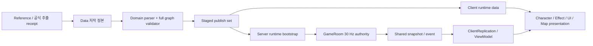
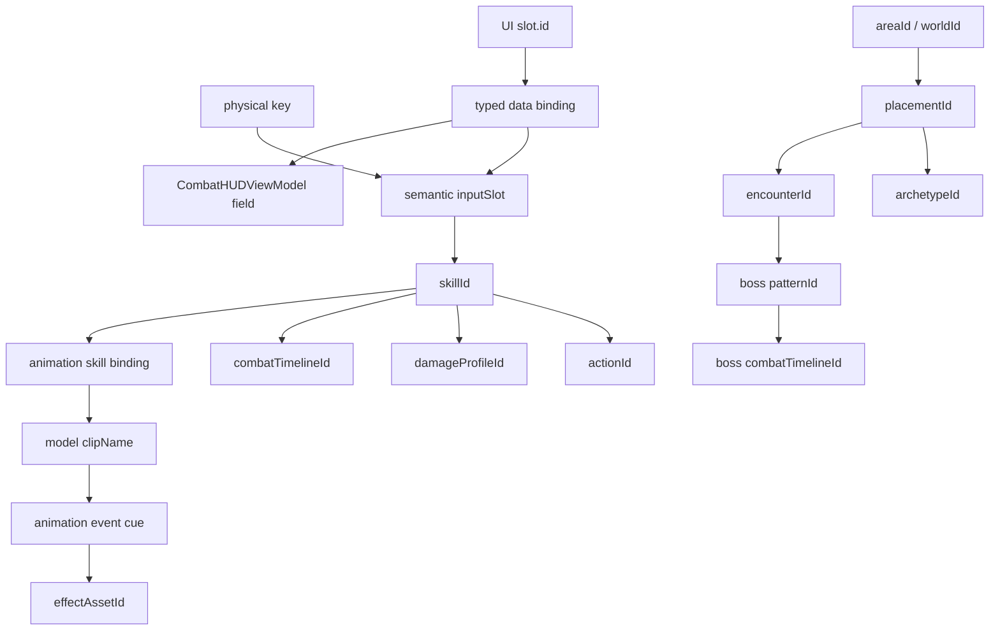
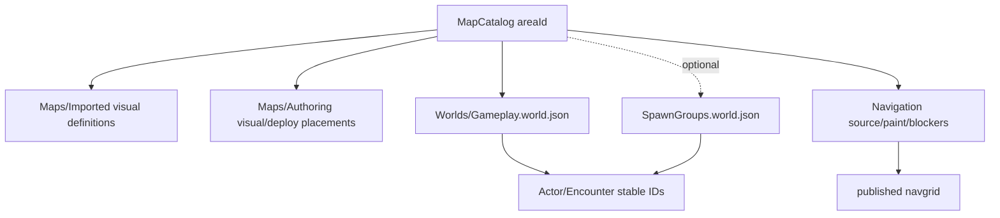

# LostArk 통합 데이터 관리 아키텍처

작성일: 2026-08-05
문서 역할: 팀 전체 데이터 소유권, stable ID 연결, 저작·publish·runtime 수명과 확장 순서의 정본

## 1. 한 줄 결론

LostArk의 데이터는 하나의 거대한 JSON이나 Tool별 사본으로 합치지 않는다. 각 담당이 소유하는 작은
정본을 stable ID로 연결하고, publisher가 전체 참조 그래프를 검증해 Server와 Client가 읽을 immutable
runtime snapshot을 만든다.

```text
원작·추출 Reference
        ↓ 검토와 변환 근거 기록
Git Data Authoring/Catalog
        ↓ parse -> validate full graph -> stage -> atomic commit
Published Runtime Data
        ↓ Server authority / Client presentation
Runtime State + Snapshot
        ↓
Character · Effect · UI · Map presentation
```

이 구조의 목표는 파일 수를 줄이는 것이 아니다. 한 값을 한 곳에서만 소유하고, 다른 영역은 그 값을
복사하지 않고 stable ID로 참조하게 만드는 것이다.

## 2. 문서 상태 표기

이 문서는 현재 구현과 목표 구조를 섞어 완료 처리하지 않는다.

| 표기 | 의미 |
|---|---|
| `CURRENT` | 현재 코드·데이터·publisher·runtime consumer가 실제로 연결됨 |
| `PARTIAL` | 저장 또는 Server/Client 한쪽만 존재해 수직 슬라이스가 닫히지 않음 |
| `TARGET` | 팀이 다음 구현에서 따라야 할 승인된 구조. 아직 파일이나 consumer가 없을 수 있음 |
| `REFERENCE` | 원작 추출·비교 자료. runtime 권위가 아님 |

`TARGET` 스키마를 문서에 적었다는 이유로 빈 catalog, placeholder enum, 소비자 없는 파일을 먼저 만들지
않는다. 첫 실제 actor, status effect, monster, trigger를 추가할 때 Data → publisher → Shared/Server →
Client → harness를 같은 변경 단위로 구현한다.

## 3. 목표 불변식

아래 항목은 모든 신규 schema와 migration이 도달해야 할 고정 불변식이다. 현재 모든 loader/publisher가
이미 전부 만족한다는 뜻은 아니다. 현재 예외는 바로 아래 표와 21절에서 `PARTIAL`로 관리한다.

1. 동일 의미의 값은 한 정본만 소유한다. key, cooldown, damage, clip, effect, collider timing을 한 행에
   중복 저장하지 않는다.
2. 연결에는 stable ID를 사용한다. pointer, prototype tag, vector index, ImGui label, 파일 내 행 번호는
   저장 ID가 아니다.
3. Server는 물리 key, model, animation clip, effect asset, UI widget을 모른다.
4. Client는 damage, cooldown 승인, hit 여부, boss phase, navigation 위치를 확정하지 않는다.
5. Tool은 `Data` authoring만 저장한다. `Client/Bin/DataFiles`, `Server/Bin/DataFiles`, 실행 중 Server
   구조체를 직접 덮어쓰지 않는다.
6. 모든 load와 publish는 `parse -> validate -> stage -> commit`이다. 실패하면 기존 document/runtime
   snapshot을 유지한다.
7. JSON은 unknown property도 오류로 처리하는 exact schema를 기본으로 한다. 조용한 기본값과 identity
   fallback을 만들지 않는다.
8. 시간 저장 단위는 millisecond다. frame은 Tool 표시값이고 Server 실행은 fixed tick으로 양자화한다.
9. 좌표와 거리의 기준계·단위·authority를 필드와 문서에 명시한다.
10. 원작 추출값, 원작에서 유도한 값, 프로젝트 축소값, 직접 튜닝값을 같은 의미의 “공식 수치”로 부르지
    않는다.
11. Runtime은 매 프레임 JSON을 읽지 않는다. Level/Server 기동 또는 승인된 revision commit에서만
    immutable 정의를 교체한다.
12. Resources 바이너리와 Data 정의를 분리한다. JSON에는 Resources-relative asset ID만 저장한다.

현재 확인된 기반 부채:

| 불변식 | 현재 예외 | migration 완료 조건 |
|---|---|---|
| 실패 시 기존 runtime 유지 | `CWorldBootstrap::Load`가 parse 전에 기존 state를 비움 | local staged bootstrap을 완전히 검증한 뒤 한 번에 member 교체 |
| unknown property 거부 | `CActorCatalog`은 required field는 검사하지만 extra property를 거부하지 않음 | Character/Boss/NPC exact-property validator와 negative harness |
| 전체 output set 원자 승격 | navigation 등 일부 publisher는 Area/Client/Server 파일 단위 promotion | 16.4의 revision directory, journal, active manifest와 crash recovery |

## 4. 전체 수명 구조



### 4.1 다섯 수명

| 수명 | 위치 | 편집 주체 | 내용 |
|---|---|---|---|
| 원본/Reference | 외부 추출 workspace, `Data/*/Reference` | 추출기, 조사 담당 | 원작 DB·notify·clip·LookInfo에서 얻은 증거. runtime 미사용 |
| Authoring/Catalog | repository `Data/` | ImGui Tool 또는 사람이 검토 | 팀이 합의한 정본 JSON/전용 line format |
| Published | `Client/Bin/DataFiles`, `Server/Bin/DataFiles` | publisher만 | 검증된 결정적 runtime 입력. 직접 편집 금지 |
| Runtime Definition | `CGameplayCatalog`, Client catalog/view definition | Loader/Server startup | immutable definition snapshot |
| Runtime State | `GameRoom`, replication, ViewModel, GameObject | Server tick / Client frame | HP, cooldown end tick, current action, phase, transform 등 저장하지 않는 상태 |

## 5. Data 루트와 역할

### 5.1 현재 정본

| 루트 | 현재 역할 | 상태 |
|---|---|---|
| `Data/Actors` | Character/Boss/NPC 생성 가능 정의와 Resources-relative model ID | Character/Boss `CURRENT`; NPC schema만 있고 admitted actor 0개라 `PARTIAL` |
| `Data/Animation/Authored` | `.animevents`, `skillbindings.json` | `CURRENT` |
| `Data/Animation/Reference` | `.skilltiming/.clipmap/.animnotify/.clipseq` | `REFERENCE` |
| `Data/Balance` | Player/Boss profile, skill, damage | `CURRENT`, formatVersion 2 |
| `Data/Encounters` | Encounter authoring과 pattern 정의 | `PARTIAL`; Valtan 첫 pattern의 range/timing/damage만 publish, `states[]`는 runtime 미소비 |
| `Data/Items` | Item catalog(`itemId`/`displayName`/`maxStack`) 정의 | `CURRENT`; Debug F1 give-item 슬라이스만 소비, drop/trade/stat 효과는 미구현 |
| `Data/Maps/Imported` | 추출 catalog/shard 기준 | `CURRENT` |
| `Data/Maps/Authoring` | MapTool visual/deploy placement 정본 | `CURRENT` |
| `Data/Navigation` | nav source/paint/blocker 또는 uniform grid | `CURRENT` |
| `Data/UI` | HUD/Screen/Loading layout | `CURRENT`; runtime skill binding과 방사형 cooldown은 미구현 |
| `Data/Worlds` | playerSpawn/NPC/Boss gameplay placement schema | playerSpawn/Boss `CURRENT`; NPC는 admitted actor가 없어 `PARTIAL` |

### 5.2 실제 요구가 생길 때 추가할 목표 루트

| 목표 루트 | 역할 | 생성 조건 |
|---|---|---|
| `Data/Combat/Timelines/Player` | skill별 Server action/hit/collider/movement/combo timeline | 첫 multi-hit/collider Server 슬라이스 |
| `Data/Combat/Timelines/Boss` | boss pattern별 Server action/hit/status timeline | Valtan 원작 pattern parser와 함께 |
| `Data/Balance/StatusEffectProfiles.json` | stun, knockback, invulnerability 등 Server 상태이상 정의 | 첫 실제 상태이상과 Server consumer가 함께 생길 때 |
| `Data/Effects/Authored` | Effect Tool 저작 문서 | 현재 Tool Save 경로이며 첫 admitted runtime effect와 함께 Git 정본화 |
| `Data/Effects/EffectCatalog.json` | publish 가능한 EffectAssetId와 dependency/content hash | 첫 effect runtime consumer와 publisher가 생길 때 |
| `Data/Worlds/<AreaId>/SpawnGroups.world.json` | monster wave/group와 spawn anchor 연결 | 첫 실제 Monster archetype/brain/replication과 함께 |
| `Data/Balance/Reference/Official` | raw payload가 아닌 field provenance receipt | 공식 수치 자동 재추출을 저장소에서 재현할 때 |

빈 미래용 파일은 만들지 않는다. optional layer는 MapCatalog 또는 publisher input set에 경로가 실제로
등록된 Area만 요구한다.

## 6. Stable ID 그래프



### 6.1 ID 소유권

| ID | 발급·정본 | 의미 |
|---|---|---|
| `characterClass` | Shared enum + `CharacterCatalog` | network gameplay class identity |
| `archetypeId` | `Data/Actors` | 생성 가능한 actor definition |
| `inputSlot` | `PlayerSkills.json` | Q/W/E/R/A/S/D/F/T/V/LMB 같은 의미 슬롯. 물리 key code가 아님 |
| `skillId` | `PlayerSkills.json` | Server skill identity. 원작 ID를 쓸 수 있으나 프로젝트 계약은 publisher 승인 후 성립 |
| `actionId` | `PlayerSkills`/Encounter | snapshot이 표현 계층에 전달하는 semantic action |
| `damageProfileId` | `DamageProfiles.json` | damage 계산 profile |
| `combatTimelineId` | 목표 `Data/Combat/Timelines` | Server action-relative event sequence |
| `animationAssetId` | `CharacterCatalog`/Animation document owner | 어떤 cooked model clip 집합을 쓰는지 식별 |
| `clipName` | cooked `CModel` | animation asset 내부 stable clip 이름 |
| `effectAssetId` | 목표 `EffectCatalog` | publish/admission된 Client effect definition |
| `areaId` | `MapCatalog.json` | visual/gameplay/navigation layer를 묶는 Area |
| `placementId` | `Gameplay.world.json` | Area 안 gameplay instance identity |
| `runtimePlacementId` | map/deploy placement publisher | 시각 placement identity. gameplay `placementId`와 다른 domain |
| `encounterId`, `patternId`, `phaseId` | `Data/Encounters` | Server encounter graph identity |
| `slot.id` | `Data/UI` | runtime widget identity |
| `conditionId` | 목표 `.navblockers`와 trigger event | 동적 navigation 조건 identity. 현재 발탄 blocker row/Server consumer는 없음 |
| `visualAssetId`, `animationSetId` | Actor catalog의 Client presentation metadata | 실제 registry consumer가 있을 때만 유지하는 Client-only ID |

현재 `BossCatalog.serverProfileId`는 Server consumer가 없고, `clientPresentationId`는 Valtan 문자열을 Client
코드가 직접 비교하는 과도기 필드다. 목표 schema에서는 `archetypeId`를 BossProfile/Encounter/Client
presentation의 유일 cross-domain join으로 사용한다. 두 필드는 제거하거나 실제 ID registry와 publisher
validation을 갖춘 뒤에만 존속한다. `visualAssetId`와 `animationSetId`도 parser가 읽기만 하는 상태를
runtime 사용 완료로 보지 않는다.

같은 문자열이 우연히 같아도 ID domain은 다르다. 예를 들어 UI `Skill_Q`는 inputSlot `Q`가 아니며,
layout의 typed binding이 둘을 명시적으로 연결해야 한다.

## 7. 공통 schema 계약

### 7.1 JSON envelope

모든 JSON 정본은 최소한 다음을 가진다.

```json
{
  "schema": "lostark.<domain-name>",
  "formatVersion": 1
}
```

- `formatVersion`은 문법과 의미가 깨지는 변경에서만 올린다.
- 사람이 수정하는 revision은 instance document에만 둔다. 숫자가 바뀌었다고 자동으로 runtime revision이
  되는 것은 아니다.
- runtime `dataRevision`은 publisher가 전체 입력 content hash로 생성한다.
- loader는 지원하지 않는 version, duplicate ID, unknown enum/property, NaN/Infinity, unsafe path를 거부한다.
- migration은 old version parse → staged current document → 명시 Save로 수행한다. load만으로 원본을
  덮어쓰지 않는다.

### 7.2 단위 이름

| suffix/이름 | 단위 |
|---|---|
| `*Ms` | millisecond, action 또는 clip 시작 기준 |
| `*Tick` | Server fixed tick. authoring에 직접 쓰지 않고 publish/runtime에서 사용 |
| `*Percent` | 100 = 100% |
| `*Degrees` | degree |
| `position`, `distance`, `range` | 프로젝트 world unit, 오른손/왼손 좌표계 여부는 domain parser와 Tool에서 일치 |
| `rate` | 0..1 normalized presentation progress일 때만 사용. damage rate는 `damageRatePercent` |

시간을 `frame`으로 저장하지 않는다. Tool은 `frame = round(ms * clipTickRate / 1000)`으로 표시하고 Save는
ms로 되돌린다. Server publisher는 `ceil(ms * fixedTickHz / 1000)` 규칙을 한 곳에서 적용한다.

### 7.3 참조와 삭제

- 참조 대상이 있는 definition은 대상보다 먼저 삭제할 수 없다.
- rename은 새 ID 추가 → 모든 참조 migration → validate → old ID 삭제 순서다.
- alias fallback은 기본 금지다. 외부 원작 ID migration에 한해 versioned migration table을 publisher가
  한 번 소비하고 runtime에는 alias를 남기지 않는다.
- disabled placement도 lazy spawn template처럼 참조될 수 있으므로 publisher 검증 대상이다.

## 8. Authority와 담당 경계

| 데이터 | Authoring owner | Runtime authority | Client 소비 |
|---|---|---|---|
| HP/공격력/방어/이동속도 | Balance Tool/Gameplay | Server | snapshot/ViewModel |
| cooldown/resource/cost | Balance Tool/Gameplay | Server | ViewModel/UI |
| skill hit/collider/movement timing | Combat Timeline authoring | Server fixed tick | debug overlay와 hit result 표현 |
| physical input → semantic slot | Input | Client command 생성 | `CPlayerController` |
| class+slot → skillId | `PlayerSkills.json` | Server admission + Client definition | Controller/HUD/Animation Tool |
| skillId → clip chain/BA stage | Animation Tool | Server가 stage를 선택, Client가 clip을 표현 | Character |
| clip time → effect/sound/trail cue | Animation Tool | Client presentation | Effect/Audio runtime |
| Effect element/simulation/material | Effect Tool | Client presentation | 단일 Effect runtime |
| boss phase/pattern selection | Encounter/Gameplay 목표; 현재 전이는 `CValtanBrain` | Server | semantic action/phase 표시 |
| map visual placement | MapTool | Client map runtime | map objects |
| spawn/trigger/destroyable placement | MapTool | Server | replication/presentation |
| navigation walkability | MapTool + publisher | Server | Client는 표현/피킹용 보조만 사용 |
| HUD rect/style/binding | UI Tool | Client presentation | typed ViewModel binding |

## 9. Player skill 데이터 구조

### 9.1 현재 연결

```text
Data/Balance/PlayerProfiles.json
Data/Balance/PlayerSkills.json
Data/Balance/DamageProfiles.json
        ↓ Publish-GameplayBalance.ps1
Server Gameplay.bootstrap
        ↓ CGameplayCatalog
CPlayerSkillSystem / GameRoom 30 Hz
        ↓ S2C_WORLD_SNAPSHOT
CClientReplication -> CCombatHUDViewModel / CCharacter
```

현재 `PlayerSkills.json` formatVersion 2는 identity와 함께 `cooldownMs`, `actionDurationMs`,
`hitTimeMs`, `resourceCost`, `movementDistance`, `maximumRange`, `serverDamageProfileId`, `effectId`,
`comboStages`까지 소유한다. 단일 hit/action에는 동작하지만 multi-hit, 여러 collider window, projectile,
status effect와 여러 effect cue를 한 행으로 표현할 수 없다.

#### 현재 숫자 기준선

| class | max HP | resource | regen/s | attack | defense | move speed | skill definitions |
|---|---:|---:|---:|---:|---:|---:|---:|
| Lance Master | 5,500 | 1,000 | 25 | 100 | 105 | 2.95 | ACTIVE 9 + COMBO 1 |
| Gunslinger | 5,000 | 1,000 | 25 | 100 | 95 | 2.95 | ACTIVE 11 + COMBO 1 |
| Slayer | 5,500 | 1,000 | 25 | 100 | 110 | 2.95 | ACTIVE 10 + COMBO 1 |
| Artist | 5,000 | 1,000 | 25 | 100 | 90 | 2.95 | ACTIVE 8 + COMBO 1 |
| DimensionMaster | 5,250 | 1,000 | 25 | 100 | 100 | 2.95 | ACTIVE 10 + COMBO 1 |

현재 합계는 skill definition 53개, damage profile 54개다. ACTIVE cooldown 범위는 6,000~300,000ms다.
move speed와 class 체력·방어 비율은 원작 계수를 근거로 하지만 절대 HP/resource/attack/defense 규모는
프로젝트가 정한 축소 기준이다. 각 skill의 실제 cooldown/cost/range/rate는 이 문서에 복제하지 않고
`PlayerSkills.json`과 `DamageProfiles.json`을 직접 정본으로 사용한다.

### 9.2 목표 분리

| 정본 | 목표 소유 정보 |
|---|---|
| `PlayerProfiles.json` | class 최대 HP/resource, regen, attack, defense, move speed |
| `PlayerSkills.json` | skill identity, class, semantic inputSlot, displayName, actionId, skillKind, cooldown, resourceCost, `combatTimelineId` |
| `DamageProfiles.json` | damage formula/rate와 향후 defense/element policy |
| `Data/Combat/Timelines/Player/<Class>.skilltimelines.json` | stage duration, input window, movement, hit volume, damage/status event |
| `skillbindings.json` | skillId → ordered model clips/Server combo stage clip |
| `.animevents` | clip-local effect/sound/trail/shake cue |

`PlayerSkills.effectId`는 한 스킬에 여러 effect가 존재하는 현실과 맞지 않으므로 목표 구조에서 제거한다.
효과는 clip cue마다 `effectAssetId`를 참조한다. `hitTimeMs`, `movementDistance`, `maximumRange`,
`comboStages`도 combat timeline이 전 skill을 완전히 덮는 migration에서만 제거한다. 일부 skill만 옮긴
혼합 runtime을 만들지 않는다.

### 9.3 목표 combat timeline 예시

다음은 목표 문법의 의미 예시다. 실제 파일은 Server parser/publisher/harness를 구현하는 수직 슬라이스에서
처음 생성한다.

```json
{
  "schema": "lostark.player-combat-timelines",
  "formatVersion": 1,
  "characterClass": "DIMENSIONMASTER",
  "timelines": [
    {
      "timelineId": "combat.player.2050110",
      "skillId": 2050110,
      "stages": [
        {
          "stageIndex": 0,
          "durationMs": 2100,
          "inputWindow": null,
          "events": [
            {
              "eventId": "hit.01",
              "kind": "HIT_VOLUME",
              "startMs": 1451,
              "endMs": 1518,
              "shape": {
                "kind": "CAPSULE",
                "offset": [0.0, 0.9, 2.0],
                "radius": 0.8,
                "halfHeight": 2.0
              },
              "damageProfileId": "damage.player.2050110",
              "repeatCount": 1,
              "repeatIntervalMs": 0,
              "maximumTargets": 8
            }
          ]
        }
      ]
    }
  ]
}
```

불변식:

- `stageIndex`는 0부터 연속이며 COMBO stage 수와 일치한다.
- event 시간은 stage 범위 안에 있어야 한다.
- `HIT_VOLUME`은 Server만 소비하고 effect ID나 clip 이름을 가지지 않는다.
- shape는 caster action 시작 transform 기준 local volume이다. bone index를 저장하지 않는다.
- repeat hit는 동일 event 안의 count/interval로 표현하고 damage 적용 횟수를 harness에서 검증한다.
- status effect는 실제 Server status system이 생긴 뒤 `statusProfileId`를 추가한다. 문자열로 임의 상태를
  실행하지 않는다.
- projectile은 별도의 projectile runtime이 생기기 전까지 shape kind로 위장하지 않는다.

### 9.4 Server runtime 구조

현재 `CGameplayCatalog`의 `PLAYER_RUNTIME_PROFILE`, `PLAYER_SKILL_DEFINITION`,
`BOSS_RUNTIME_PROFILE`, damage rate map은 유지할 시작점이다. 목표 publisher는 다음 정의를 하나의
immutable snapshot으로 stage한다.

| runtime 정의 | key | 소비자 |
|---|---|---|
| Player profile | `characterClass` | spawn/resource regen/movement |
| Skill definition | `skillId` | command admission/cooldown/resource |
| Damage profile | `damageProfileId` | `Resolve_Damage` |
| Combat timeline | `combatTimelineId` | `CPlayerSkillSystem::Update` |
| Boss profile | `archetypeId` | world entity initialization |
| Encounter profile | `encounterId` | boss brain/phase/pattern selection |

Server runtime state에는 definition 전체를 복사하지 않는다. 현재 action이 시작할 때 적용 revision과 필요한
definition reference를 고정하고, 진행 중 action은 끝까지 같은 revision을 소비한다.

### 9.5 Shared runtime state

Shared snapshot은 Data definition 전문을 전송하지 않고 실행 결과만 전달한다.

| payload | 현재 핵심 상태 |
|---|---|
| Player snapshot | entity/class, transform, HP/resource, action, skillId, actionStartTick, comboStage, skill별 cooldownEndTick |
| World entity snapshot | entity/archetype, transform, action/actionId, HP, phase |
| Damage event | target entity, amount, hit 당시 world anchor, outgoing/incoming |

Client는 이 값과 같은 revision의 local presentation definition을 join한다. 향후 Hot Reload에서만
`dataRevision`을 snapshot/handshake에 추가한다. model path, clip name, effect path, UI slot ID는 packet에
싣지 않는다.

## 10. Key → Skill → Animation → Effect 연결

### 10.1 저장 연결

```text
Q physical input
  -> semantic inputSlot "Q"                       Client Input
  -> (DIMENSIONMASTER, Q) = skillId 2050110        PlayerSkills.json
  -> approved action/skillId                       Server snapshot
  -> skillId 2050110 = ordered clips               skillbindings.json
  -> clip + local ms = effectAssetId cue            .animevents
  -> EffectAssetId definition                       Data/Effects/Authored + Catalog
```

Animation Tool 화면에는 `Q - 2050110 - 예고`처럼 보이지만 `skillbindings.json`에는 key를 다시 저장하지
않는다. key/slot은 `PlayerSkills.json`, animation 문서는 `skillId → clips`만 소유한다. key 편성이 바뀌어도
animation mapping이 갈라지지 않는 이유다.

현재 physical key → semantic inputSlot은 `CPlayerController`의 제품 입력 계약이다. Animation Tool의
`Q/W/E/R/A/S/D/F/T/V` 표시는 이 mapping과 `PlayerSkills.json`을 join한 결과이며 Save 대상이 아니다.
향후 key remapping이 필요하면 `Data/Input/DefaultBindings.json`은 제품 기본값만 소유하고 사용자 개인
binding은 Git 밖 user setting에 저장한다. 어느 경우에도 physical scan code를 animation/effect/combat
timeline에 복사하지 않는다.

### 10.2 Animation Tool Save

현재 구현 계약:

- `Data/Animation/Authored/<Asset>/<Asset>.skillbindings.json`
- 현재 class의 Server skill을 정확히 한 번씩 포함
- ACTIVE는 1개 이상의 ordered clip
- COMBO는 Server `comboStages` 수와 clips 수 일치
- 현재 cooked model에 없는 clip, duplicate/missing/unknown skillId 거부
- sibling temp → flush → strict reload/validate → atomic replace
- action 도중 reload는 다음 action 경계에서 반영

물리 key, cooldown, damage, resource, collider는 이 파일에 추가하지 않는다.

### 10.3 Animation event와 Effect cue

현재 `.animevents`는 clip-local ms의 HIT/CANCEL/SUPERARMOR/INVULN/MOVE/SOUND/EFFECT/SHAKE marker를
저장한다. 현재 EffectAssetId admission/runtime은 아직 닫히지 않았다.

이 중 현재 `HIT`, `CANCEL`, `SUPERARMOR`, `INVULN`, `MOVE`와 `HIT_PARAMS`는 원작 비교와 Tool debug
overlay용 authoring/reference다. `CPlayerSkillSystem`이 이를 읽지 않으므로 Server 판정 정본이 아니다.
Combat Timeline publisher가 생기기 전에는 runtime admission을 금지한다. migration이 끝나면 combat 의미를
Combat Timeline으로 옮기고 `.animevents`에는 Client presentation cue만 남기거나, reference row임을 schema로
명시해 제품 runtime이 절대 소비하지 않게 한다.

목표 EFFECT cue는 다음 의미를 소유한다.

```text
clipName + startMs/endMs
effectAssetId
anchorKind + stable anchorSlotId
local position/rotation/scale
followPolicy + stopPolicy
```

- burst/impact는 point cue다.
- weapon trail은 start/end가 있는 window cue다.
- beam/tether는 source/end 두 anchor를 명시한다.
- world coordinate나 현재 mouse 위치를 Effect asset에 저장하지 않는다.
- Server는 cue와 EffectAssetId를 모른다.

### 10.4 Collider와 Effect frame을 함께 작업하는 방법

Animation Tool은 세 timeline을 한 화면에 겹쳐 표시한다.

| lane | 저장 정본 | Save 권한 |
|---|---|---|
| Clip/BA chain | `skillbindings.json` | Animation Save |
| Effect/Sound/Trail | `.animevents` | Animation Event Save |
| Server Hit/Collider/Move | 목표 `Data/Combat/Timelines` | Combat Timeline Save + publisher 검증 |

같은 화면에서 조정하더라도 한 Save로 서로 다른 권위를 섞지 않는다. collider와 effect가 같은 시각이어야
하는 경우 Tool이 clip chain offset을 이용해 action-relative ms와 clip-local ms를 함께 보여 준다. 의도적으로
effect를 hit보다 먼저 보이게 할 수도 있으므로 publisher가 두 시각의 강제 동일성을 요구하지는 않는다.
대신 둘 다 action/clip duration 안에 있는지, Server tick 양자화 뒤 hit 횟수가 유지되는지를 검사한다.

## 11. Effect 데이터

### 11.1 현재 상태

현재 Effect Tool의 실행 계약은 `lostark.effect-authoring` v2다.

```text
EffectAssetId + displayName
-> elements[]
   -> id, kind(MESH/SPRITE/PARTICLE/DECAL/TRAIL)
   -> typed resource slot + Resources/Effect relative asset ID
```

resource binding과 atomic Save/Load는 있으나 emitter simulation, material/render profile 전체, admitted
Effect catalog, 제품 runtime cue player는 아직 닫히지 않았다. 계획서에 있는 이후 v3/v4 전문은 현재 구현
정본으로 간주하지 않는다.

### 11.2 목표 구조

| 문서 | 소유 정보 |
|---|---|
| `Data/Effects/Authored/<EffectAssetId>.effect.json` | element/module/local transform/lifetime/render property/resource dependency |
| `Data/Effects/EffectCatalog.json` | admitted EffectAssetId, authoring content hash, runtime status/dependency set |
| `Client/Bin/DataFiles/Effect/*` | publisher가 생성한 runtime effect definition |
| `Client/Bin/Resources/Effect/*` | texture/model binary payload |
| Animation `.animevents` | 언제, 어디에, 어떤 attachment 정책으로 EffectAssetId를 호출하는지 |

Effect Tool은 Active Document를 `parse -> validate -> stage -> commit`하고 Preview도 제품과 같은 Effect
runtime을 사용한다. Preview 전용 두 번째 emitter 구현을 만들지 않는다. Save 성공은 authoring 저장 완료일
뿐이며, Catalog admission/publish/runtime smoke가 끝나기 전에는 제품 effect 연결 완료가 아니다.

### 11.3 Effect와 damage 분리

- Effect 크기를 키워도 Server hit volume은 바뀌지 않는다.
- hit volume을 키워도 effect asset transform은 자동 변경되지 않는다.
- 연결 검토는 Animation/Combat Timeline overlay가 돕지만 판정 정본은 Server combat timeline이다.
- hit 결과에 따른 hit effect, damage font, shake는 Server `DAMAGE_EVENT`를 받은 Client가 표현한다.

## 12. UI/HUD 데이터

### 12.1 UI가 읽는 단일 runtime 경계

제품 UI는 `CCombatHUDViewModel`만 읽는다.

```text
Server snapshot
-> CClientReplication
-> CCombatHUDViewModel
-> runtime UI widgets
```

UI가 `PlayerSkills.json`, packet, socket, Character, Valtan GameObject를 매 프레임 직접 읽지 않는다.
정의 초기화 단계에서 display name과 cooldown duration을 준비하고, runtime state는 snapshot으로 갱신한다.

### 12.2 현재 공백

- `HUD_SKILL_STATE`에는 cooldown duration/end tick과 표시 damage가 있다.
- `S2C_WORLD_SNAPSHOT`에는 Server가 확정한 `DAMAGE_EVENT`가 있다.
- 현재 `HUD_Layout.json` 84 slot에는 explicit `inputSlot` binding이 없다.
- `CHUDRuntimeView`는 slot ID/type을 gameplay binding으로 소비하지 않는다.
- `CCombatHUDViewModel`에는 `Find_SkillBySlot`과 normalized cooldown progress 함수가 없다.
- radial cooldown과 damage font Client consumer는 아직 없다.

### 12.3 목표 UI layout binding

`slot.id`는 widget identity로 유지하고, formatVersion을 올릴 때 명시적 typed binding을 추가한다.

```json
{
  "id": "SkillSlot_Primary_01",
  "widgetKind": "RADIAL_COOLDOWN",
  "binding": {
    "kind": "PLAYER_SKILL_SLOT",
    "inputSlot": "Q"
  },
  "rect": [1000, 620, 52, 52],
  "clockwise": true,
  "startDegrees": -90.0,
  "overlayTint": [0.0, 0.0, 0.0, 0.65]
}
```

`binding.kind`는 runtime registry의 enum으로 해석하며 C++ 함수명, packet opcode, arbitrary property path를
저장하지 않는다. `inputSlot`은 현재 class의 skill을 ViewModel에서 찾는 semantic key다.

### 12.4 쿨타임 원형 sweep

Server clock만 정답이다.

```text
signedDelta = int32(cooldownEndTick - serverTick)
remainingTicks = max(0, signedDelta)
progress = clamp(remainingTicks / cooldownDurationTicks, 0, 1)
startAngle = -PI / 2
endAngle = startAngle + 2 * PI * progress
```

runtime widget은 `sin/cos(angle)`로 중심과 arc vertex를 만든 triangle fan을 그린다. segment 수는 widget
크기와 각도에 따라 상한을 둔 고정 scratch buffer를 사용해 매 frame heap allocation을 피한다. cooldown이
시작할 때 progress 1로 전체를 덮고 0으로 줄어들며 사라진다. 시각 보간은 가능하지만 end tick과 ready
판정은 바꾸지 않는다. 모든 허용 cooldown은 `2^31` tick보다 짧다는 계약 아래 signed modular delta를
사용해 `uint32_t` Server tick wrap에서도 ready 판정이 역전되지 않게 한다. duration이 0이면 나눗셈 전에
즉시 progress 0을 반환한다.

UI 담당자가 소비할 목표 ViewModel API 의미:

```text
Find_SkillBySlot(inputSlot) -> skill definition/runtime state or null
Get_CooldownProgress(inputSlot) -> 0 ready, 1 just started
Has_ResourceFor(inputSlot) -> 현재 Server snapshot resource로 지불 가능 여부
Get_DisplayDamage(inputSlot) -> 정의 표시값, 실제 hit 결과가 아님
```

### 12.5 데미지 폰트

damage number의 값과 world anchor는 Server `DAMAGE_EVENT`가 소유한다. Client는 이를 한 번 소비해
presentation instance를 만든다.

```text
DAMAGE_EVENT {targetNetEntityId, amount, worldPosition, isOutgoing}
-> DamageNumber presentation queue
-> world-to-screen projection
-> font/style/lifetime/float curve
-> expire
```

폰트, 색상, scale, lifetime, 이동 curve는 목표 `Data/UI/HUD/DamageNumberStyle.json`이 소유할 수 있다.
amount나 hit 판정은 style 문서에 저장하지 않는다. snapshot을 놓쳐도 HP 정합은 유지되고 숫자 하나만
표현되지 않는 edge-triggered presentation이다.

## 13. Boss, pattern, phase, 상태이상

### 13.1 현재 분리

| 정본 | 현재 소유 정보 |
|---|---|
| `BossProfiles.json` | HP, attack, collision radius, engage distance, move speed, phase 2 threshold |
| `ValtanEncounter.json` | `states[]` authoring과 한 개 pattern의 range/timing/damage profile. 현재 runtime은 첫 pattern만 소비 |
| `BossCatalog.json` | model과 semantic action → presentation clip |
| `DamageProfiles.json` | pattern damage rate |
| `CValtanBrain` | target/chase/pattern state, phase, damage application |

현재 `states[]`는 Server 상태 머신 정본이 아니다. publisher가 state ID를 검증하지만 bootstrap에는 첫
pattern만 직렬화하고 실제 `IDLE/CHASE/PATTERN_*` 전이는 `CValtanBrain` C++에 있다. 따라서 state graph를
runtime에서 소비하기 전까지는 dormant authoring이며, C++ 전이와 JSON을 두 정본으로 동시에 확장하지 않는다.

### 13.2 목표 확장

Boss 기본 profile은 신체·기본 수치만 소유하고 phase 조건은 Encounter로 이동한다.

```text
BossProfile
  archetypeId, HP, attack, defense, collision, movement, stagger base

Encounter
  encounterId
  phases[]
    phaseId, entryConditions, patternSet, transitionConditions
  patterns[]
    patternId, semantic actionId, selection conditions, combatTimelineId

Boss Combat Timeline
  telegraph/action/recovery, hit volume, damage/status events

BossCatalog
  semantic actionId -> model clips/effects presentation
```

- phase 전이는 Server HP/condition/tick만으로 결정한다.
- pattern selection이 난수를 쓰면 room seed와 deterministic sequence를 Server가 소유한다.
- 상태이상은 `StatusEffectProfiles.json`의 stable ID를 combat event가 참조하고 Server가 적용한다.
- super armor, invulnerability, stagger/counter도 실제 Server state와 snapshot/harness가 생기기 전에는
  animation marker만으로 활성화하지 않는다.
- Boss pattern timeline에는 clip/effect ID를 넣지 않는다.

### 13.3 발탄 공식 데이터의 현재 사실

현재 날짜별 공식 밸런스 계획에 기록된 `REFERENCE_UNVERIFIED` 기준:

- NPC ID `480007`, BalanceLevel `1415`, StatScaleKey `NormalCommander_S2_BOSS_1`
- 기준 HP `136,015,677`, HP 배율 `545%`, HP bar `160`
- SkillDamage `27,204`, defense `7,401`, stagger gauge `40,000`
- move speed `260`, pursuit/war/sight range `2000/2200/4000`
- model size `140%`, damage font Z rate `5000`

현재 프로젝트 runtime은 원작 절대값을 그대로 쓰지 않는다. `BossProfiles.json`은 HP 60,000, attack 100,
move speed 2.6, phase threshold 50%의 축소·튜닝 기준이다. `damage.valtan.basic-swing` 350은 현재 프로젝트
baseline이며 원작 pattern damage 공식화가 아니다.

2026-08-05 field-level receipt가 source build ID, LPK/DB/action hash, extractor hash, table/key/column,
변환식과 result를 고정한다. publisher는 현재 authoring의 1,058 field가 receipt와 정확히 일치하는지
검사한다. 이 목록 전체가 공식이라는 뜻은 아니며, receipt basis가 `OFFICIAL_EXTRACTED`,
`OFFICIAL_DERIVED`, `OFFICIAL_SCALED`인 field만 공식 근거를 가진다. 발탄 basic swing과 pattern timing은
계속 `PROJECT_TUNED`다.

발탄 pattern별 공식 timing/damage를 올리려면 `MN_RPBF_01-1.loa` notify/action을 파싱해
`Data/Animation/Reference/Valtan`과 provenance receipt를 만든 뒤 Boss Combat Timeline으로 검토 승격해야
한다. Client table만으로 알 수 없는 값을 “공식”이라고 채우지 않는다.

## 14. MapTool, world, spawn, trigger, destroyable, navigation

### 14.1 Area는 여러 독립 layer의 묶음



- visual catalog은 생성 가능한 map asset을 소유한다.
- visual/deploy placement는 시각 instance transform을 소유한다.
- gameplay world는 Server가 알아야 할 placement와 stable actor/encounter 참조만 소유한다.
- navigation은 walkable geometry와 condition region을 소유한다.
- balance 수치를 Area에 복사하지 않는다.

### 14.2 현재 gameplay kind

현재 `lostark.world-gameplay` authoring은 formatVersion 4다. 제품 publisher/runtime admission은
`playerSpawn`, `npc`, `boss`, 단일 typed action의 `triggerBox`, 정적 `collisionBox`를 지원하며 Valtan은 별도 `SpawnGroups.world.json`을 함께 소비한다.

- `playerSpawn`: class-neutral transform, `archetypeId: null`, `encounterId: null`
- `npc`: NpcCatalog archetype 참조. 현재 `NPC_BEDA` 한 presentation 지원
- `boss`: BossCatalog/BossProfile/Encounter 참조
- disabled boss placement는 Character Select lazy Valtan template처럼 Server 명령으로 활성화 가능

### 14.3 승인된 target: triggerBox, collisionBox와 destroyable

별도 trigger/collision 파일을 만들지 않고 `Gameplay.world.json` formatVersion 4의 authoring 구조로 kind를 확장한다.

| kind | 핵심 필드 | authority |
|---|---|---|
| `triggerBox` | placementId, transform, halfExtents, triggerOnce, typed events | Server 진입 판정 |
| `collisionBox` | placementId, transform, halfExtents, enabled | Server player 이동 차단 |
| `destroyable` | placementId, `deployRuntimePlacementId`, initialState | Server 상태, Client deploy presentation |

제품 trigger event는 다음 typed command를 지원한다.

```text
MOVE_PLAYER(targetPosition, durationSeconds, arcHeight)
CHANGE_LEVEL(targetWorldId)
ACTIVATE_SPAWN_GROUP(spawnGroupId)
ACTIVATE_ENCOUNTER(targetPlacementId)
```

`CHANGE_LEVEL` target은 Bern과 Valtan Arena만 허용하며 Server room transfer와 새
`S2C_ENTER_ACCEPTED` 뒤 Client typed transition으로 실행한다. Spawn group activation은 같은 Area group ID만, encounter activation은 disabled boss placement ID만 허용한다.

함수명이나 animation clip 문자열을 저장하지 않는다. destroyable 시각 transform은 deploy placement가
소유하고 gameplay row는 stable `deployRuntimePlacementId`를 참조한다. publisher는 두 anchor 위치의 오차를
검증한다.

`deployRuntimePlacementId`는 `.deployplacements`가 발급하는 `runtimePlacementId`와 같은 uint64 identity를
참조하는 gameplay field 이름이다. 기존 08-05 TARGET PLAN의 `deployPlacementId` 명칭은 구현 전에 이 이름으로
교정해 `placementId` domain과 혼동을 없앤다.

`CWorldGameplayDocument`는 formatVersion 4의 `triggerBox`, `collisionBox`, `destroyable`을 strict parse/validate/atomic
save할 수 있고 네 Area authoring 문서도 v4로 이관됐다. uint64 deploy identity는 JSON double 손실을
막기 위해 decimal string으로 저장한다. Debug Development MapTool은 action이 없는 `triggerBox`를
disabled draft로 배치·선택·크기 편집·저장/재로드하며 3D wire OBB로 표시한다. 다만 publisher,
Server trigger authority까지 닫힌 `triggerBox`와 Server 이동 차단까지 닫힌 `collisionBox`만 제품
publisher가 admission한다. `destroyable`은 dynamic navigation, Shared replication, Client deploy
presentation이 한 수직 슬라이스로 닫히지 않았으므로 계속 fail-closed다.

#### 14.3.1 Debug destruction simulation sidecar

`Data/Maps/Authoring/<AreaId>/<AreaId>.destructionsimulation.json`은 MapTool이 소유하고 Debug
audition만 소비하는 sidecar다. 제품 World publisher 입력이 아니다.

```text
WorldEvents groupId
  -> simulation profile.groupId
  -> element.sourceRuntimePlacementId
     + element.suppressionAliasPlacementIds (suppress-only)
  -> runtime-generated <elementId>.fragment.NN
```

WorldEvents member 집합과 simulation의
`sourceRuntimePlacementId + suppressionAliasPlacementIds` 합집합은 정확히 일치해야 한다. source만
debris emitter이고 alias는 중복 벽을 함께 숨기는 stable placement ID라 actor를 추가 생성하지 않는다.
fragment ID는 vector index나 Prototype tag가 아니며 element stable ID와 고정 ordinal에서 결정한다.
현재 v2는 emitter 공통 direction/speed/gravity/lifetime/trigger와 suppression alias를 저장하고 fragment
model/state/pose/velocity는 runtime projection이다. activation부터 fragment lifetime 만료 뒤까지 source와
alias를 숨기며 Reset/Clear에서 이전 상태를 복원한다. v1은 자동 추측 이관 없이 fail-closed하고 v2로
다시 authoring해야 한다. 이 sidecar가 존재해도 Server destroyable admission이 열린 것은 아니다.

### 14.4 Monster와 wave 확장

Valtan 일반 Monster 수직 슬라이스는 다음 경로로 구현되어 있다.

```text
real MonsterCatalog row + model/presentation
-> MonsterProfile/skill/timeline
-> SpawnGroups.world.json
-> trigger event ACTIVATE_SPAWN_GROUP
-> Server brain/entity/replication
-> Client presentation
-> MapTool authoring
-> protocol/server/client harness
```

`Gameplay.world.json`에는 monster를 여러 번 복제한 wave 수치를 넣지 않는다. optional
`SpawnGroups.world.json`은 다음을 소유한다.

```text
spawnGroupId
spawn anchors(placementId 또는 명시 transform)
waves[]: waveId, entries(archetypeId, count, anchorId, delayMs)
activation/repeat/completion policy
```

MapTool은 한 Area workspace에서 world placement와 spawn group을 함께 편집하지만 각각의 Dirty/Save 상태를
분리한다. publisher는 unknown archetype/anchor/prerequisite cycle을 거부하고 Server는 maxAlive, wave clear, prerequisite를 권위 있게 처리한다.

### 14.5 NPC

NPC definition은 `NpcCatalog`, instance는 `Gameplay.world.json`에 둔다. display name/model/idle semantic
presentation은 catalog, 위치와 yaw는 placement가 소유한다. 대화, 상점, quest는 각각 실제 runtime
consumer가 생길 때 별도 stable profile을 참조한다. placement에 대화 문자열이나 C++ callback을 넣지 않는다.

현재는 `NpcCatalog.json` schema와 world/publisher kind만 있고 catalog row가 0개이며 제품 Client
presentation도 없다. 따라서 NPC는 `PARTIAL`이고, 실제 model admission → Server spawn → replication →
`CNpc` presentation smoke가 끝난 첫 actor부터 `CURRENT`로 전환한다.

### 14.6 Navigation

| authoring | 용도 |
|---|---|
| `<AreaId>.navsource` | bake geometry 결과, dimensions/origin/cell/height |
| `<AreaId>.navpaint` | 수동 walkable 보정 |
| `<AreaId>.navblockers` | conditionId 기반 동적 region |
| `<AreaId>.navgrid.json` | 단순 uniform Area |

`Publish-ServerNavigation.ps1`이 Client/Server `.navgrid`를 결정적으로 만든다. playerSpawn/boss는 walkable
cell과 height를 검증한다. trigger/destroyable은 walkable cell 위일 필요가 없다. 동적 blocker는 Server가
condition state를 소유하며 condition 변경 tick에 player/boss path를 재계산한다. Client navigation
결과를 Server 정답으로 보내지 않는다.

### 14.7 MapCatalog count와 경로

`MapCatalog`의 `placementCount/assetCount`는 검증 metadata일 뿐 placement 정본이 아니다. 실제 authoring
header/count와 다르면 publisher/Audit가 실패해야 하며 어느 쪽도 조용히 다른 값을 채택하지 않는다.
source 경로는 `Data`, runtime 경로는 `Client/Bin/DataFiles`로 분리한다.

## 15. Balance Tool 설계

### 15.1 역할

Debug F1의 Balance Tool은 다음 Data를 편집·검증하는 authoring UI다.

- Player Profiles
- Player Skills
- Damage Profiles
- Boss Profiles
- Encounter/Pattern
- Combat Timeline과 향후 Status Effect

Tool이 실행 중 Server 구조체를 직접 수정하거나 Client HUD 값만 덮어쓰지 않는다. 현재 Debug F1에
`Balance Tool`이 구현되어 있으며 character/boss 선택, stats·movement·skill/combo·pattern 편집,
provenance 표시, Server snapshot/damage event 확인을 제공한다.

### 15.2 작업 흐름

```text
Open Data set
-> strict parse into staged editor model
-> field edit + domain validation
-> Save Authoring atomically
-> Validate Full Data Graph
-> Publish runtime set
-> current: Server restart
-> future: Server staged revision + room tick commit
```

Tool 화면에는 각 값의 단위, stable ID, 참조 대상, provenance를 보여 준다. 예를 들어 damage row에는
`OFFICIAL_EXTRACTED`, `OFFICIAL_SCALED`, `PROJECT_TUNED` 중 근거를 receipt에서 읽어 표시한다. Tool UI의
콤보 선택 목록은 실제 catalog ID에서 만들고 자유 문자열로 잘못된 참조를 만들지 않게 한다.

### 15.3 현재와 Hot Reload

현재 구현된 안전한 적용은 JSON Save → changed field의 receipt `PROJECT_TUNED` 동기화 → publisher
Validate/Publish → Server 재기동이다. Hot Reload는 다음 전체가
구현되기 전까지 버튼을 활성화하지 않는다.

1. content hash 기반 `dataRevision`
2. Server 별도 catalog stage와 전체 참조 검증
3. `GameRoom::Tick` 시작 경계 commit
4. 진행 중 action/pattern의 시작 revision pinning
5. snapshot revision
6. Client definition/ViewModel의 같은 revision commit
7. 실패 rollback과 두 Client 정합 harness

## 16. 통합 publisher와 runtime revision

### 16.1 현재 publisher

```text
Publish-GameplayBalance.ps1
Publish-WorldGameplay.ps1
Publish-BalanceRuntimeSet.ps1   # 위 두 domain의 Server output 5종 통합 promotion
Publish-ServerNavigation.ps1
Publish-MapAuthoring.ps1
```

각 publisher의 domain parser는 유지한다. 현재 `Publish-BalanceRuntimeSet.ps1`은 gameplay bootstrap 1종과
world bootstrap 4종을 sibling staging에 만든 뒤 한 rollback set으로 promotion한다. 중간/마지막 failure
injection은 저장소 내 임시 OutputRoot에 기존 runtime 5개를 복사한 뒤
`Publish-BalanceRuntimeSet.ps1 -Mode Publish -FailureAfterPromote <n>`을 직접 실행해 기존 5개 hash 복원과 transaction 잔재 0건을 검증한다. Navigation, Client
presentation, UI/effect까지 포함한 전체 data generation은 아래 목표 orchestrator 범위로 남는다.

### 16.2 목표 publish 순서

```text
1. JSON/line-format syntax와 exact schema
2. Actor/Effect/UI asset ID와 Resources manifest 참조
3. Balance ID와 공식 provenance 규칙
4. Skill -> damage/timeline -> animation binding -> effect cue graph
5. Encounter -> boss/timeline/damage graph
6. Area -> world -> actor/encounter -> navigation/deploy/spawn graph
7. 모든 runtime output을 sibling staging root에 생성
8. content hash/dataRevision 계산
9. Client/Server output set atomic promotion
10. promotion 실패 시 기존 전체 set 복원
```

목표 `Tools/DataPipeline/Invoke-DataGraphValidation.ps1`은 위 publisher를 호출하고 결과 manifest를 묶는
orchestrator로만 둔다. 각 domain 해석을 다시 구현하지 않는다.

### 16.3 revision

`dataRevision`은 단순 증가 숫자를 사람이 편집하는 값이 아니라 publisher input set의 canonical content
hash에서 만든 stable revision이다. Server snapshot에는 Hot Reload가 활성화될 때 이 revision을 싣는다.
Client는 같은 revision의 presentation definition이 준비되기 전에는 새 definition을 commit하지 않는다.

### 16.4 Crash-recoverable publish transaction

Client와 Server의 서로 다른 output root는 단일 filesystem rename으로 동시에 교체할 수 없다. 목표 publish는
파일별 덮어쓰기 대신 다음 generation 계약을 사용한다.

```text
Client/Bin/DataFiles/Revisions/<dataRevision>/...
Server/Bin/DataFiles/Revisions/<dataRevision>/...
각 root의 generation.manifest.json
각 root의 active-revision.json
publisher transaction journal + writer lock
```

1. relative path를 ordinal 정렬하고 canonical bytes를 `path + NUL + length + NUL + content` 순서로 SHA-256
   해 동일한 `dataRevision`을 계산한다. JSON canonicalization과 line ending 정책은 validator 한 곳에 둔다.
2. 두 root의 immutable revision directory와 manifest를 먼저 완성하고 전 파일 hash를 재검증한다.
3. journal에 old/new revision과 `STAGED`를 durable write하고 두 active pointer를 교체한다.
4. 첫 pointer 뒤 process가 죽으면 다음 publisher/startup이 journal과 두 manifest를 읽어 activation을
   완료하거나 둘 다 old revision으로 복구한다. journal 정리 전 old revision을 삭제하지 않는다.
5. Server/Client handshake와 snapshot revision이 다른 generation 조합을 거부한다.
6. writer lock은 동시 publisher 두 개를 거부한다. stale lock 복구도 journal/owner process 검증을 거친다.

현재 Balance+World Server output 5종의 process-local rollback transaction은 구현됐다. 그러나 navigation과
Client output, crash-recovery journal/revision handshake까지 포함한 generation 계약은 아직 아니므로 “전체
Client/Server set atomic”을 PASS로 기록하지 않는다.

## 17. 공식 데이터와 provenance

### 17.1 세 단계

```text
Raw source outside Git
-> derived Reference receipt in Git
-> reviewed project Authored value
-> published runtime value
```

원본 LPK/UPK/SQLite payload는 Git과 Resources pack에 넣지 않는다. Git receipt에는 필요한 numeric/string
결과, source table/key, 추출기 version/hash, 변환식과 최종 target만 기록한다.

### 17.2 목표 receipt 예시

```json
{
  "schema": "lostark.balance-provenance-receipt",
  "formatVersion": 1,
  "sourceBuildId": "local-client-build-id",
  "extractorSha256": "...",
  "entries": [
    {
      "targetId": "damage.player.34120",
      "targetField": "damageRatePercent",
      "basis": "OFFICIAL_EXTRACTED",
      "source": {
        "table": "EFTable_SkillEffect",
        "primaryKey": "341200",
        "secondaryKey": "10",
        "column": "ValueA"
      },
      "sourceValue": 361,
      "transform": "identity",
      "resultValue": 361
    }
  ]
}
```

`sourceBuildId`에 개인 절대 경로를 넣지 않는다. raw source hash나 합법적으로 공유 가능한 build identifier만
기록한다.

### 17.3 basis 의미

| basis | 의미 |
|---|---|
| `OFFICIAL_EXTRACTED` | 원작 table/action에서 변환 없이 얻음 |
| `OFFICIAL_DERIVED` | 여러 원작 row join 또는 명시 계산식으로 유도 |
| `OFFICIAL_SCALED` | 원작 비율을 유지하되 프로젝트 규모로 축소 |
| `PROJECT_TUNED` | 게임플레이 목적의 팀 결정 |
| `REFERENCE_ONLY` | 검토 자료이며 runtime admission 금지 |

현재 receipt는 5 player profile, 53 skill definition, 54 damage profile, Valtan boss/encounter를 합쳐
1,058 field를 모두 덮는다. publisher가 COMBO stage를 전개한 72 runtime skill row와 53 authoring
definition을 혼동하지 않는다. 모든 field에 receipt가 있다는 사실과 모든 field가 공식이라는 주장은
구분한다. 현재 분류는 `OFFICIAL_EXTRACTED` 207, `OFFICIAL_DERIVED` 29, `OFFICIAL_SCALED` 12,
`PROJECT_TUNED` 810이다.

## 18. 담당자별 실제 작업법

### 18.1 UI 담당

1. UI Tool에서 stable `slot.id`, rect, draw order, image와 typed binding을 저장한다.
2. runtime에서는 ViewModel의 HP/resource/skill cooldown/damage/boss state만 읽는다.
3. cooldown 원형 sweep은 normalized progress만 소비한다.
4. damage font는 Server `DAMAGE_EVENT` presentation을 소비한다.
5. packet/socket/Character와 Data JSON per-frame read는 하지 않는다.

### 18.2 Animation 담당

1. `PlayerSkills.json`에서 Tool이 보여 주는 key/skill row를 선택한다.
2. `skillbindings.json`에 ordered clip/BA stage를 저장한다.
3. `.animevents`에 effect/sound/trail cue를 clip-local ms로 저장한다.
4. Combat Timeline lane에서 collider/hit ms를 조정할 수 있으나 별도 Gameplay Save/publish를 거친다.
5. Server Arena에서 실제 command → snapshot → clip/effect를 확인한다.

### 18.3 Effect 담당

1. Effect Tool에서 EffectAssetId와 element/module/resource를 저작한다.
2. Save는 `Data/Effects/Authored`, binary는 Resources pack workflow로 관리한다.
3. Catalog admission과 Effect publisher 검증 뒤 Animation cue에서 ID를 선택한다.
4. collider/damage timing은 Effect 문서에 저장하지 않는다.
5. Preview와 제품은 같은 Effect runtime을 사용한다.

### 18.4 Gameplay/Balance 담당

1. profile/skill/damage/encounter/combat timeline을 편집한다.
2. 공식 수치는 receipt와 변환 근거를 확인한다.
3. full graph Validate와 Server contract를 통과시킨다.
4. 현재는 Server를 재기동해 적용한다.
5. UI나 Character에 수치를 하드코딩하지 않는다.

### 18.5 Map/Encounter 담당

1. MapCatalog에서 Area를 선택한다.
2. visual, gameplay, navigation, optional spawn layer의 Dirty를 각각 관리한다.
3. actor/encounter/condition/deploy를 stable ID combo로 연결한다.
4. Save 뒤 해당 publisher를 실행한다.
5. generated map/world/navgrid를 직접 편집하지 않는다.

### 18.6 Server 담당

1. published runtime data만 strict load한다.
2. definition을 immutable catalog로 stage하고 room state와 분리한다.
3. command admission, fixed tick, damage/cooldown/phase/navigation을 확정한다.
4. snapshot에는 semantic ID와 runtime state만 넣는다.
5. model/clip/effect/UI 경로를 Server 구조체에 추가하지 않는다.

## 19. 검증 행렬

| 변경 | 최소 자동 검증 | runtime smoke |
|---|---|---|
| Profile/Skill/Damage | Gameplay publisher, BalanceRuntimeSet Validate/rollback fixture, Server contract | skill 승인/거부, HP/resource/cooldown/damage |
| Combat Timeline | timeline parser 오류, tick 양자화, multi-hit 횟수, rollback | collider debug와 실제 Server hit event |
| Animation binding | duplicate/missing skill, bad clip, combo count, atomic Save | key → snapshot → 지정 clip |
| Animation Effect cue | bad EffectAssetId/anchor/time, dirty rollback | clip scrub와 실제 Effect spawn/stop |
| Effect asset | resource path/dependency/schema, preview/runtime parity | effect preview와 gameplay cue |
| UI binding | duplicate slot, bad typed binding, missing class slot | 모든 class cooldown/resource/damage font |
| Boss encounter | phase transition, pattern selection, damage once, bad reference | Valtan phase/pattern/death |
| World placement | kind exact fields, actor/encounter/deploy ref, rollback | spawn/lazy spawn/disconnect |
| Trigger/destroyable | event target, once/edge, replicated state | trigger 진입, fracture, late join |
| Navigation | source/paint/blocker, spawn projection, hash parity | move/chase/path invalidation |
| Monster spawn group | wave ordering/count/unknown actor/rollback | activation, late join, completion |

모든 public schema는 정상 사례뿐 아니라 wrong version, unknown ID/property, duplicate, unsafe path, 중간
promotion 실패와 기존 runtime 보존을 검증한다.

## 20. 구현 순서

현재 프로젝트에서 가장 작은 안전한 수직 슬라이스 순서다.

1. UI layout typed `inputSlot` binding + ViewModel cooldown API + radial cooldown widget
2. `DAMAGE_EVENT` Client consumer + damage font style/presentation
3. Effect authoring schema/runtime/catalog/publisher 한 개 admitted fixture
4. Animation EFFECT point cue → Effect runtime, 이후 anchor/window trail
5. Player Combat Timeline + Server hit volume/multi-hit publisher
6. Balance Tool의 offline Save/Validate/Publish
7. Valtan action reference 추출 + Boss Combat Timeline + Encounter phase graph
8. triggerBox/destroyable/navigation condition 수직 슬라이스
9. 첫 실제 NPC presentation
10. 첫 실제 Monster + SpawnGroups + trigger activation
11. 마지막에만 dataRevision 기반 Server-authoritative Hot Reload

각 단계는 이전 단계의 문서를 미리 빈 파일로 만들지 않고 실제 consumer와 harness를 포함한다.

## 21. 현재 구현 상태 요약

| 영역 | 현재 판단 |
|---|---|
| 5 class profile/skill/damage format v2 | `CURRENT` |
| Server damage event 생성과 protocol | `CURRENT` |
| Damage event Client consumer | `CURRENT`: ViewModel 최근 128건 ring, Balance Tool 실측 |
| Damage font Client 표시 | `PARTIAL`: 제품 world-space renderer 없음 |
| Cooldown Server tick/ViewModel 필드 | `CURRENT` |
| UI skill slot binding/radial sweep | `PARTIAL`: layout binding과 renderer 없음 |
| Key/skill animation binding Save | `CURRENT` |
| COMBO Server stage → clip | `CURRENT` |
| Animation EffectAssetId runtime | `PARTIAL`: admission/runtime 없음 |
| Effect Tool v2 resource authoring | `PARTIAL`: 제품 effect runtime/catalog 없음 |
| 단일 hit 시각·거리 판정 | `CURRENT`의 `hitTimeMs`/`maximumRange`; shape collider 계약은 아님 |
| multi-hit/shape/status combat timeline | `TARGET` |
| Valtan 첫 pattern 수치와 C++ phase threshold | `CURRENT`; Encounter `states[]`는 `PARTIAL` |
| Player defense 감산 | `CURRENT`: `raw*100/(100+defense)`, `PROJECT_TUNED` |
| 원작 Valtan pattern timeline | `REFERENCE 추출 선행 필요` |
| playerSpawn/Boss world kind | `CURRENT` |
| NPC world kind/catalog | `CURRENT`: `NPC_BEDA` Server world entity + Client presentation |
| Character Select lazy Valtan | `CURRENT` |
| triggerBox/destroyable authoring schema v4 | `CURRENT` triggerBox 4 actions + collisionBox, `PARTIAL` destroyable |
| trigger runtime/dynamic blocker/replication | `CURRENT` OBB trigger + static collisionBox; dynamic blocker는 `TARGET` |
| 일반 Monster/wave | `CURRENT`: Valtan 4 actor, 3 groups, Server AI/combat/despawn, Client presentation |
| Balance Tool offline editor | `CURRENT`: Save/provenance/Validate/Publish, Server restart 방식 |
| Server Hot Reload | `TARGET`, 마지막 단계 |

## 22. 금지 체크리스트

- UI JSON에 damage/cooldown 정답을 복사하지 않는다.
- Effect JSON에 collider/damage를 넣지 않는다.
- Animation binding JSON에 inputSlot/cooldown을 복사하지 않는다.
- Server bootstrap에 model/clip/effect path를 넣지 않는다.
- Map gameplay placement에 runtime NetEntityId/HP/phase를 저장하지 않는다.
- Area마다 Player/Boss balance를 복제하지 않는다.
- `Client/Bin/DataFiles`를 Tool Save 대상으로 삼지 않는다.
- Reference 추출 파일을 runtime에서 직접 읽지 않는다.
- Client-only JSON reload를 Hot Reload라고 부르지 않는다.
- 첫 소비자가 없는 Monster/Status/Trigger placeholder를 추가하지 않는다.

## 23. 연결 문서

- 담당별 C++/runtime 인터페이스: `TEAM_GAMEPLAY_INTERFACE_HANDBOOK.md`
- Animation/Effect/Preview 저작 경계: `ANIMATION_TOOL_OWNER_HANDOFF.md`
- F1 Balance Tool과 공식 receipt 작업법: `BALANCE_TOOL_OWNER_HANDOFF.md`
- Area별 현재 데이터 layer와 MapTool 정책: `AREA_DATA_LAYER_GUIDE.md`
- Balance 적용과 Hot Reload 조건: `BALANCE_TUNING_AND_HOT_RELOAD_CONTRACT.md`
- 빌드·리소스·런타임 구조: `../../CLAUDE.md`
- 팀 금지 경계와 완료 조건: `../../AGENTS.md`

이 문서는 위 세부 문서를 대체하지 않는다. 전체 데이터 graph와 domain ownership이 바뀔 때 이 문서를 먼저
갱신하고, 각 세부 문서는 실제 public interface나 Tool 운영 절차가 바뀐 부분만 갱신한다.
