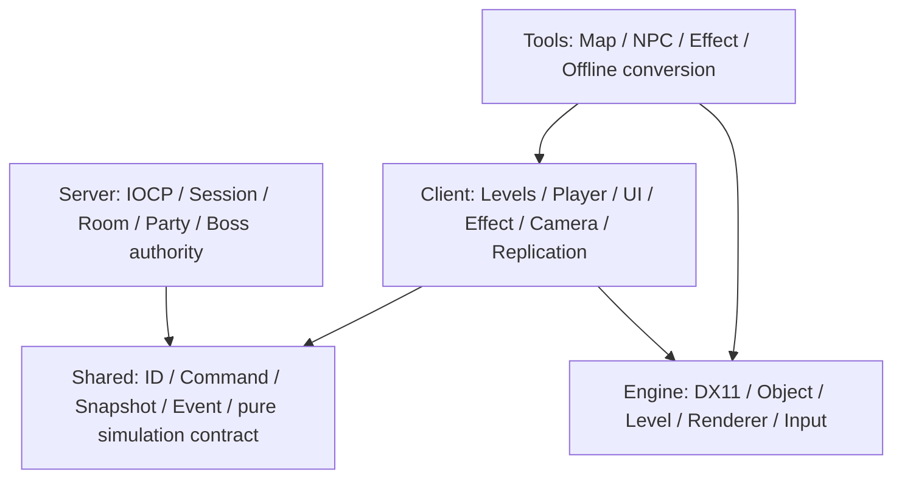
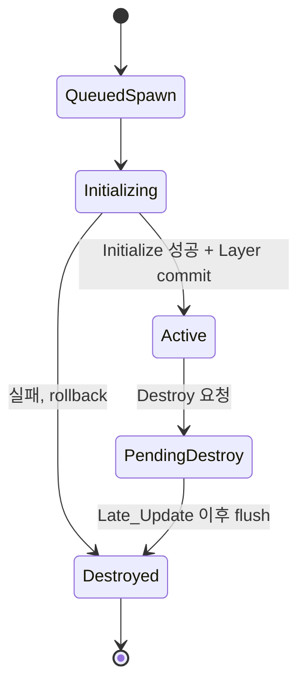
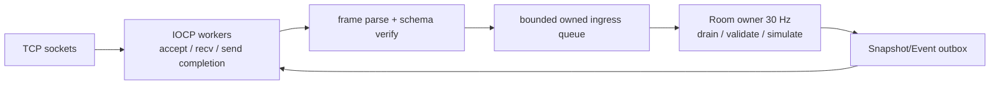
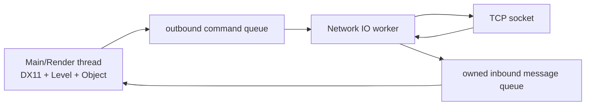
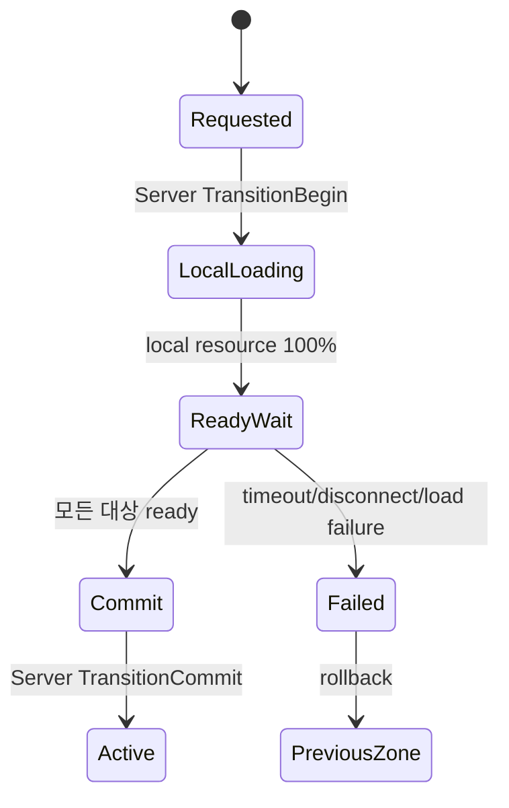
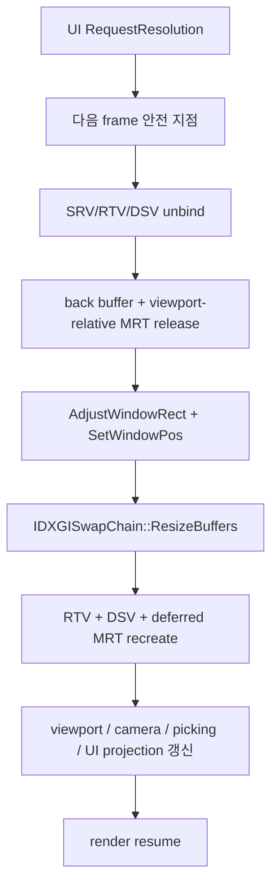

# LostArk 북극성

작성일: 2026-08-01  
상태: 팀 공용 아키텍처 정본 v1  
대상: 건보·주승·태준·찬영 4인 팀  

관련 문서:

- [사용자 원문 보존본](C:/Users/user/Desktop/LostArk/.md/GB/08-01/2026-08-01_LOSTARK_REFERENCE_TEAM_PORTFOLIO_RAW_TRANSCRIPT.md)
- [참고 영상 분석본](C:/Users/user/Desktop/LostArk/.md/GB/08-01/2026-08-01_LOSTARK_REFERENCE_TEAM_PORTFOLIO_VIDEO_ANALYSIS.md)
- [즉시 실행 마스터 계획서](C:/Users/user/Desktop/LostArk/.md/GB/08-01/2026-08-01_LOSTARK_FRAMEWORK_FOUNDATION_MASTER_PLAN.md)
- [현재 저장소 설명](C:/Users/user/Desktop/LostArk/CLAUDE.md)
- [Winters 아키텍처 Compass](C:/Users/user/Desktop/Winters/.md/architecture/WINTERS_CODEBASE_COMPASS.md)

---

## 1. 한 문장 북극성

> **클라이언트는 입력과 표현을 담당하고, 서버의 Room owner가 게임 결과의 유일한 정본이 되며, 모든 팀 기능은 안정 ID·명령·스냅샷·이벤트·명시적 수명 계약을 통해 하나의 기존 Prototype/Clone/Level/Layer 경로에 연결한다.**

이 문장에 맞지 않는 코드는 지금 만들지 않는다.

### 지금 가장 중요한 결론

1. 서버 전체를 먼저 완성하지 않는다. `이름 입력 → 접속 → 두 플레이어 생성 → 이동 → 채팅`이라는 베른성 수직 슬라이스를 먼저 끝낸다.
2. 내부 Manager를 종류별로 전부 만들지 않는다. 먼저 owner가 반드시 필요한 네 가지 계약만 만든다.
   - 안정 ID와 오브젝트 지연 생성·지연 파괴
   - Client/Server 공용 명령·스냅샷·이벤트 계약
   - IO 스레드와 게임 월드 사이의 소유된 메시지 큐
   - 레벨 전환 요청·로딩 진행률·파티 준비 barrier
3. 최종 레벨 다섯 개를 빈 껍데기로 먼저 만들지 않는다. `SERVER_SELECT → CHARACTER_SELECT → BERN`을 실제 접속 흐름으로 완성한 뒤 `CHAOS_DUNGEON`, `VALTAN_RAID`를 붙인다.
4. 보스·몬스터·플레이어 클래스가 socket이나 패킷 클래스를 직접 호출하지 않는다. 게임 객체는 typed command/event만 알고 transport는 모른다.
5. 렌더링 고급 기능과 PhysX 천 물리는 플레이 가능한 온라인 수직 슬라이스 뒤의 포트폴리오 확장이다.

---

## 2. 이 문서에서 사실과 목표를 구분하는 법

| 표식 | 뜻 |
|---|---|
| **현재** | 2026-08-01 LostArk 코드에서 직접 확인한 사실 |
| **참고** | 타 팀 영상 또는 Winters에 존재하는 구현 |
| **목표** | LostArk에 새로 채택할 설계 |
| **후속** | 현재 완료 게이트를 통과한 뒤 검토할 기능 |

타 팀이 했다는 이유만으로 우리 코드에 이미 있다고 쓰지 않는다. Winters에 동작하는 코드가 있다는 이유만으로 우리가 이해하거나 검증했다고 쓰지 않는다.

---

## 3. 현재 LostArk 실측 진단

| 영역 | 현재 확인된 구조 | 당장 생기는 문제 |
|---|---|---|
| 실행 프로젝트 | `Engine.dll`과 `Client.exe` 2개 | `Shared`, `Server` 프로젝트가 아직 없다. |
| 오브젝트 소유 | `CObject_Manager[level][layer] → CLayer → list<shared_ptr<CGameObject>>` | 저장/네트워크에 쓸 안정 ID가 없고, 외부 `shared_ptr`가 파괴 시점을 연장할 수 있다. |
| 오브젝트 조회 | 레이어 태그와 순번 `iIndex` | 파티원·관전 대상·네트워크 엔티티를 순번으로 저장하면 삭제/삽입 시 다른 객체를 가리킨다. |
| 파괴 | 즉시 `list::erase`인 `Remove_GameObject_from_Layer` | Update 순회 중 호출하면 iterator 안전 계약이 없다. |
| 레벨 전환 | 기존 레벨 resource clear 후 새 `CLevel`로 교체 | stage/commit과 rollback 계약이 약하며 실패 시 기존 상태 보존이 명시되지 않는다. |
| 로딩 | worker 1개, 문자열과 `bool m_isFinished` | 실제 백분율이 없고 완료 플래그의 원자성·오류 전달·취소 계약이 없다. |
| 해상도 | `Client_Defines.h`의 1280×720 상수 | 스왑체인, DSV, deferred MRT, viewport, camera, picking, UI를 다시 만드는 경로가 없다. |
| 툴 | Debug의 `CMainApp`이 Map/Effect/Animation/HUD 도구를 소유 | 올바른 단일 owner는 이미 있으므로 두 번째 Tool runtime을 만들 이유가 없다. |
| 네트워크 | LostArk 코드에 게임 네트워크 경로 없음 | 플레이어·파티·레벨·보스의 권위를 합의할 공용 계약부터 필요하다. |
| 보스 | AssetTest의 `CValtan`과 파츠/이동 실험 | 온라인 보스 권위 상태와 Client visual proxy가 분리되지 않았다. |

근거가 되는 핵심 파일:

- [Object_Manager.h](C:/Users/user/Desktop/LostArk/Engine/Public/Object_Manager.h)
- [Layer.cpp](C:/Users/user/Desktop/LostArk/Engine/Private/Layer.cpp)
- [GameInstance.cpp](C:/Users/user/Desktop/LostArk/Engine/Private/GameInstance.cpp)
- [Level_Manager.cpp](C:/Users/user/Desktop/LostArk/Engine/Private/Level_Manager.cpp)
- [Loader.cpp](C:/Users/user/Desktop/LostArk/Client/Private/Loader.cpp)
- [Graphic_Device.cpp](C:/Users/user/Desktop/LostArk/Engine/Private/Graphic_Device.cpp)
- [Renderer.cpp](C:/Users/user/Desktop/LostArk/Engine/Private/Renderer.cpp)
- [Client_Defines.h](C:/Users/user/Desktop/LostArk/Client/Public/Client_Defines.h)

---

## 4. 타 팀과 Winters에서 가져올 것, 가져오지 않을 것

### 4.1 정확한 용어 정리

- Google Protobuf의 schema 확장자는 `.proto`다.
- `.fbs`는 Google FlatBuffers schema다.
- 둘 다 schema로 C++ 코드를 생성하지만 서로 다른 직렬화 라이브러리다.
- 참고 영상 팀은 설명상 **Protobuf**를 사용했다.
- Winters의 [Command.fbs](C:/Users/user/Desktop/Winters/Shared/Schemas/Command.fbs), [Snapshot.fbs](C:/Users/user/Desktop/Winters/Shared/Schemas/Snapshot.fbs)는 **FlatBuffers**다.

LostArk v1은 **FlatBuffers를 의도적으로 선택**한다. 이유는 이미 Winters에서 schema 생성·검증·Command/Snapshot/Event 분리를 확인할 수 있고, 팀이 같은 자료를 학습 자산으로 재사용할 수 있기 때문이다. 단, “Protobuf를 썼다”고 소개하지 않으며 Winters의 거대한 schema를 복사하지 않는다. 최초 schema는 베른성 수직 슬라이스에 필요한 필드만 가진다.

### 4.2 채택/거절 표

| 참고 구현 | LostArk 판단 | 이유 |
|---|---|---|
| TCP + IOCP | 채택 | Windows/DX11 팀 포트폴리오 경계와 맞고 다중 클라이언트 accept/recv/send를 비동기로 처리할 수 있다. |
| 서버 5 worker, 클라이언트 2 worker 고정 | 거절 | 스레드 수는 정답이 아니다. 서버 2~4, 클라이언트 1부터 측정한다. |
| 모든 경쟁 구간에 spin lock | 거절 | 먼저 single-owner queue로 경쟁 자체를 없앤다. 짧고 실측된 구간에만 lock을 선택한다. |
| Deadlock profiler | 후속 | lock ordering과 owner thread를 먼저 고정하고, 실제 복수 lock이 생길 때 Debug 추적을 붙인다. |
| 파티장을 vector 0번으로 구분 | 거절 | `leaderPlayerId`를 명시한다. 순번은 저장 ID가 아니다. |
| 파티 UI가 매 Tick 서버 정보를 갱신 | 수정 채택 | 서버는 변경 이벤트/스냅샷을 보내고 UI는 local view model을 매 frame 그린다. |
| 몬스터 위치를 spawn 때만 전송하고 양쪽 AI를 동일 실행 | v1 거절 | 부동소수점, 타깃, 충돌, 플레이어 입력으로 쉽게 갈라진다. 서버 snapshot 보정을 먼저 쓴다. |
| Client Input → Command → Server truth → Snapshot/Event → Client visual | 채택 | Winters에서 가장 중요한 권위 경계다. |
| 서버와 Client가 동일 `CGameObject`를 공유 | 거절 | Server는 DX/Renderer/Client에 의존하지 않는 순수 simulation state를 가진다. |
| 스킬/보스가 socket에 직접 packet 전송 | 거절 | typed command/event를 생성하고 network adapter가 전송한다. |

Winters에서 복사할 것은 클래스 수가 아니라 다음 화살표다.

```text
Client Input
  -> typed Command
  -> transport/session
  -> Room owner fixed tick
  -> validate + simulation truth mutation
  -> Snapshot / one-shot Event
  -> Client replication
  -> animation / effect / UI / camera
```

---

## 5. 제품 범위와 완료 화면

### 5.1 레벨 구성

```text
BOOT
  -> SERVER_SELECT      배경 영상, 서버 접속 상태
  -> CHARACTER_SELECT   4캐릭터, 닉네임, 게임 시작
  -> LOADING
  -> BERN               다중 플레이어, 이름표, 채팅, 파티
  -> LOADING + PARTY_BARRIER
  -> CHAOS_DUNGEON      몬스터, 진행도, 보상
  -> BERN
  -> LOADING + RAID_BARRIER
  -> VALTAN_RAID        보스, 파츠, 무력화, 에스더, 사망/관전
  -> BERN
```

네트워크에는 Client의 `LEVEL` enum 정수값을 보내지 않는다. 서버는 안정된 `ZoneId`를 보내고 Client의 `CLevelFlow`가 현재 빌드의 `LEVEL`로 변환한다. enum 순서 변경이 wire protocol을 깨뜨리면 안 된다.

### 5.2 포트폴리오 최소 완료선

최소 완료선은 다음 4개 영상이 끊기지 않고 이어지는 상태다.

1. 두 Client가 서로 다른 이름과 캐릭터로 접속해 베른성에서 서로를 본다.
2. 채팅과 파티 초대/수락 후 파티원이 같은 카오스 던전으로 이동한다.
3. 몬스터 처치가 서버 권위로 반영되고 던전 진행도와 보상이 표시된다.
4. 파티가 발탄에 입장해 최소 한 페이즈, 무력화/갑옷 파괴/에스더 중 한 세트를 공략하고 마을로 복귀한다.

고급 셰이딩 전부, PhysX cloth, 강화 시스템 전부가 없어도 이 네 흐름이 먼저 완성되어야 한다.

---

## 6. 팀 역할과 경계

| 담당 | 결과물 owner | 공용 계약과 만나는 지점 | 하지 않는 일 |
|---|---|---|---|
| 주승 | 플레이어 controller, 직업별 상태/스킬 표현, 카메라, 궁극기/시퀀스 | `GameplayCommand`, `PlayerSnapshot`, `ActionEvent`, `EffectCue`, `CameraCue` | socket 직접 호출, 원격 플레이어 truth 계산, 서버 HP 직접 변경 |
| 태준 | 시작/캐릭터 선택, UI/UX, 채팅/파티/HUD/인벤토리, NPC 및 NPC 툴 | read-only ViewModel, UI Command, `NpcPlacementId`, `ZoneTransitionState` | UI Tick에서 파일 읽기, UI가 서버 truth 소유, vector index 저장 |
| 찬영 | 맵 scene data, 몬스터/보스 행동 콘텐츠, 발탄 패턴/파츠, collision/telegraph 데이터 | `PlacementId`, Server AI action, BossEvent, Map trigger, EffectCue | 보스 클래스에서 packet 직접 전송, Client 전용 Collider를 서버 판정 정본으로 사용 |
| 건보 | Engine framework, object lifetime, Shared contract, Server/IOCP, replication, Effect runtime, Renderer/해상도 | 모든 안정 public contract와 build/harness | 다른 팀원의 스킬·UI·보스 콘텐츠를 대신 소유, 두 번째 runtime 경로 생성 |

### 공용 파일 수정 원칙

- 건보가 공용 계약을 먼저 작게 제시하고 팀원은 그 계약을 소비한다.
- 팀원이 필요한 field를 임의로 공용 packet에 추가하지 않고 사용 사례와 writer/reader를 적어 요청한다.
- `Engine/Public`, `Client_Defines.h`, `Loader`, `MainApp`, `.vcxproj/.filters`는 충돌 고위험 파일로 취급한다.
- 한 기능 PR은 자기 도메인 파일과 필요한 공용 계약 최소 변경만 포함한다.

---

## 7. 목표 프로젝트 구조와 의존 방향

`Shared`와 `Server`는 목표 구조이며 현재는 존재하지 않는다.

```text
LostArk/
├─ Engine/                 DX11, 입력, 렌더, Prototype/Clone/Level/Layer, 범용 수명
├─ Shared/                 순수 C++ ID, command/event/snapshot, GameSim 계약, schema
├─ Server/                 TCP/IOCP, session, room, party, authoritative simulation
├─ Client/                 LostArk Level/GameObject/UI/Controller/Replication/ToolHost
├─ Tools/                  오프라인 converter/extractor/validator
└─ Client/Bin/DataFiles/   검증된 runtime data
```



금지 의존:

```text
Engine  -X-> Client / Server / LostArk boss types
Shared  -X-> Engine / DirectX / ImGui / WinSock / Client
Server  -X-> Client / Renderer / CModel / ImGui
Client  -X-> Server private implementation
```

---

## 8. 권위와 데이터 종류

| 데이터 | 정본 owner | Client 역할 | 전송 형태 |
|---|---|---|---|
| 닉네임/선택 직업 | Server session/player profile | 표시 | session accept/snapshot |
| 플레이어 위치·회전·상태 | Server Room | local prediction 가능, 최종 보정 | Snapshot |
| 스킬 사용 요청 | Client controller의 의도 | Command 생성 | Command |
| 피해·HP·사망 | Server GameSim | UI/애니/FX 표현 | Snapshot + Event |
| 몬스터/보스 타깃과 패턴 | Server AI/Encounter | 보간·telegraph·animation | Snapshot + Event |
| 파티/공대장 | Server Party | ViewModel 표시 | PartyState/Event |
| 던전 진행도/보상 | Server Dungeon | 게이지/인벤토리 표시 | Progress/Reward Event |
| Effect asset 정의 | Client DataFiles/Effect catalog | 재생 | 서버는 stable EffectAssetId cue만 전송 |
| 맵 배치 | Client scene document + Server collision/trigger pack | 렌더/피킹 | 동일 PlacementId 기반 cook 결과 |
| 카메라 컷신 | Client presentation data | 재생 | 서버/게임플레이는 CameraCue 의미만 전송 |
| 해상도/창 모드 | Client local settings | 적용/저장 | 전송하지 않음 |

핵심 규칙은 `서버가 결과를 정하고 Client가 예쁘게 보여준다`다. 이펙트가 보였다는 사실은 공격 적중의 증거가 아니며, 서버의 피해 이벤트가 truth다.

---

## 9. 안정 ID 계약

| ID | 수명/범위 | 생성자 | 저장/네트워크 사용 |
|---|---|---|---|
| `AssetId` | 프로젝트 전체의 생성 가능한 정의 | catalog/cook | 저장 가능, 필요 시 전송 |
| `PlacementId` | scene 문서의 배치 인스턴스 | Map/NPC tool | 저장 가능, server cook과 매칭 |
| `ObjectHandle(slot,generation)` | 한 process의 runtime clone | Object Manager | 저장/네트워크 금지 |
| `NetEntityId` | 한 server room의 replicated entity | Server Room | 네트워크 사용 |
| `PlayerId` | 접속 플레이어 identity | Server | 파티/인벤토리/관전 |
| `PartyId` | 파티 수명 | Party Manager | 네트워크/서버 저장 |
| `ItemInstanceId` | 획득한 장비 인스턴스 | Server inventory | 네트워크/저장 |
| `TransitionToken` | 한 번의 파티 레벨 전환 | Server Room | loading barrier |

Prototype tag, raw pointer, `shared_ptr`, layer list index, vector index는 저장 ID도 network ID도 아니다.

---

## 10. 오브젝트 수명 설계

기존 Prototype/Clone/Layer 경로는 유지한다. 두 번째 ECS world를 Engine에 만들지 않는다.

### 10.1 목표 소유권

```text
CPrototype_Manager
  owns unique_ptr<Prototype>
        |
        | Clone
        v
CObject_Manager
  owns Layer
    owns shared_ptr<CGameObject>

외부 Level/Controller/Replication
  keeps ObjectHandle 또는 weak_ptr observer
```

### 10.2 상태 전이



### 10.3 프레임 경계

```text
1. Input/OS message 갱신
2. Network ingress를 Client main-thread command로 변환
3. 이전 프레임 spawn/destroy command flush
4. Priority_Update
5. Update
6. Late_Update와 render queue 등록
7. 이번 프레임 destroy command flush
8. Render
```

Update 중 `list::erase`, 네트워크 worker에서 `Add_GameObject_to_Layer`, UI callback에서 즉시 레벨 clear를 금지한다.

### 10.4 NetEntity 매핑

Client replication은 다음 두 map만 소유한다.

```text
NetEntityId -> ObjectHandle
ObjectHandle -> NetEntityId (필요할 때만)
```

spawn event는 prototype/visual definition을 고르고 Object Manager에 spawn command를 넣는다. despawn event는 handle을 찾아 destroy command를 넣는다. mapping은 commit 성공 뒤 추가하고 destroy flush와 함께 제거한다.

---

## 11. 네트워크와 스레드 설계

### 11.1 IOCP를 쉬운 말로

IOCP worker는 “게임을 계산하는 스레드”가 아니다. socket의 accept/recv/send가 끝났다는 Windows 완료 통지를 받아 **소유된 바이트 메시지**로 바꾸는 운반자다. 게임 월드를 바꾸는 사람은 Server Room owner 한 명이다.

### 11.2 Server



- IOCP worker: socket/OVERLAPPED/session transport 수명만 다룬다.
- Room owner: 플레이어, 파티, 몬스터, 보스, 던전 진행도 truth를 고정 30 Hz에서 변경한다.
- 파일 IO, schema generation, Effect load, 렌더 API는 Room lock 안에서 하지 않는다.
- queue에는 event 개수와 byte 상한을 둔다. 무한 queue는 느린 Client 하나로 서버가 죽는 구조다.
- 초기 worker 수는 서버 2~4, Client 1이다. `5/2`는 참고 영상의 선택일 뿐 규칙이 아니다.

### 11.3 Client



DX11 immediate context, Level, Layer, GameObject, UI ViewModel은 main thread만 변경한다. Network worker는 `shared_ptr<CGameObject>`를 보관하지 않는다.

### 11.4 Lock 정책

1. single owner와 queue로 먼저 해결한다.
2. session registry처럼 transport 공유 표에만 짧은 mutex를 쓴다.
3. mutex를 잡은 채 send, file IO, callback, room mutation을 하지 않는다.
4. 두 lock이 반드시 필요해지는 시점에 lock order를 문서화하고 Debug lock trace를 붙인다.
5. spin lock은 임계구역이 매우 짧다는 profiler 증거가 있을 때만 검토한다.

---

## 12. Wire protocol과 FlatBuffers 최소 계약

TCP는 메시지 경계를 보존하지 않는다. 한 번의 recv에 반쪽 packet 또는 여러 packet이 올 수 있으므로 envelope와 누적 frame parser가 필수다.

### 12.1 Envelope

```text
magic       2 bytes
version     2 bytes
packetType  2 bytes
flags       2 bytes
payloadSize 4 bytes
sequence    4 bytes
payload     N bytes (FlatBuffers)
```

수신 순서:

```text
append recv bytes
-> header가 모였는지 확인
-> magic/version/type/size 상한 검증
-> payload 전체가 모일 때까지 대기
-> FlatBuffers verifier
-> owned typed message 생성
-> ingress queue publish
```

### 12.2 최초 schema 다섯 개

| schema | 최초 payload |
|---|---|
| `Session.fbs` | protocol hello, nickname, selected character, assigned PlayerId/NetEntityId |
| `Command.fbs` | move target/direction, action/skill 요청, target id, client tick/sequence |
| `Snapshot.fbs` | server tick, entity id, transform, HP, state, action id/start tick |
| `Event.fbs` | spawn/despawn, chat, action start, damage/death, effect cue |
| `Zone.fbs` | transition token, ZoneId, party member ready/commit/fail |

Party, inventory, enhancement, Valtan 전용 payload는 해당 수직 슬라이스가 시작될 때 추가한다. 빈 미래 필드를 미리 수십 개 넣지 않는다.

### 12.3 Command / Snapshot / Event 구분

- Command: “Q 스킬을 이 방향으로 쓰고 싶다.” Client 의도다.
- Snapshot: “서버 tick 1200에서 NetEntity 7의 위치와 HP는 이 값이다.” 현재 truth다.
- Event: “tick 1200에서 갑옷이 파괴됐다.” 한 번만 재생해야 하는 사실이다.

Effect나 camera cutscene은 Event에 stable cue만 담고 texture/model/bone pointer는 보내지 않는다.

---

## 13. Client gameplay framework

### 13.1 Player Controller

```text
Raw Input
-> CPlayerController
-> GameplayCommand
-> CClientNetwork outbox
-> Server validation
-> Snapshot/ActionEvent
-> CClientReplication
-> local/remote CCharacter visual state
```

- local player와 remote player가 다른 Tick 함수를 갖는 것은 가능하지만 class 전체를 복제하지 않는다.
- local controller는 입력과 약한 prediction만 소유한다.
- remote visual proxy는 snapshot interpolation과 action event를 소비한다.
- 직업 전환/건슬링어 총 교체는 입력 binding profile을 바꾸되 서버가 허용한 identity state가 truth다.

### 13.2 Root Motion

Client animation의 RootBone 값을 그대로 authoritative 위치로 쓰면 각 Client의 frame과 clip 상태가 달라질 때 갈라진다.

목표 흐름:

```text
Skill command
-> Server action state + 검증된 motion distance/curve
-> Server collision/movement truth
-> ActionStartEvent(startTick, actionId, motion policy)
-> Client animation 시작
-> Snapshot으로 위치 보정
```

RootBone 항등화와 월드 행렬 반영은 Client 시각 처리로 사용할 수 있지만 서버의 결과를 대체하지 않는다.

### 13.3 이름표와 텍스트 캐시

```text
서버 UTF-8 nickname
-> Client player presentation model
-> 문자열이 바뀔 때만 text texture 갱신
-> 매 frame model의 Name/Effect bone world matrix 조회
-> world-to-screen
-> cached texture UI draw
```

문자열 texture는 변경 시에만 갱신하지만 bone transform과 screen position은 캐릭터가 움직이므로 매 frame 갱신한다.

---

## 14. Party, 채팅, 로딩 barrier

### 14.1 Party model

```text
Party
  partyId
  leaderPlayerId
  members[]: playerId, classId, name, hp summary, ready state
```

리더는 `members[0]`가 아니라 `leaderPlayerId`다. UI 순서를 바꿔도 권위가 바뀌면 안 된다.

### 14.2 Party command

```text
Invite(targetPlayerId)
Accept(invitationId)
Reject(invitationId)
LeaveParty()
StartZoneTransition(zoneId)
UseSidereal(skillId, aim)
```

Server가 검증하고 `PartyStateChanged`를 보낸다. UI는 local `PartyViewModel`을 매 frame 그릴 뿐 매 Tick 서버에 재조회하지 않는다.

### 14.3 Chat

- Win32/ImGui 입력을 UTF-8 문자열로 확정한다.
- 길이/빈 문자열/제어 문자/rate limit을 Client와 Server 양쪽에서 검증한다.
- Server가 작성자 `PlayerId`, 표시 이름, channel을 붙여 broadcast한다.
- Client `ChatViewModel`은 bounded ring buffer를 소유한다.

### 14.4 Loading barrier



로컬 resource 백분율과 파티 동기화는 다른 값이다.

- `localPercent`: 이 Client의 asset load 진행률
- `readyMembers/totalMembers`: 서버 barrier 진행률
- 전원이 준비되기 전에 먼저 로드한 Client가 게임을 시작하지 않는다.

---

## 15. 레벨과 로더

### 15.1 목표 전환 계약

```text
request
-> validate current state/ZoneId/token
-> stage prototypes + scene data + initial objects
-> validate staged result
-> commit new Level/Layer mapping
-> release previous level
```

실패하면 stage 중 만든 객체만 제거하고 기존 레벨을 유지한다. 현재처럼 이전 resource를 먼저 지운 뒤 성공을 기대하지 않는다.

### 15.2 로딩 진행률

Loader는 임의의 문구 변화가 아니라 명시적 task 목록을 가진다.

```text
task: common shader          weight 5
task: map model prototypes   weight 40
task: character prototypes   weight 20
task: navigation/collision   weight 15
task: UI/effect assets       weight 10
task: scene stage/validate   weight 10
```

완료 weight / 전체 weight로 0~100을 계산한다. `status`, `error`, `cancel requested`, `finished`는 worker/main thread 사이에서 안전하게 전달한다.

---

## 16. 몬스터 AI와 발탄 설계

### 16.1 일반 몬스터

행동 트리 runtime은 순수 C++로 두고 Server에서만 truth를 실행한다.

```text
Selector
├─ Sequence: Dead? -> Death
├─ Sequence: HasTarget? -> InAttackRange? -> Attack
├─ Sequence: HasTarget? -> MoveToTarget
└─ AcquireTarget / Patrol
```

필수 node는 `Selector`, `Sequence`, `Condition`, `Action`, `Wait`부터 시작한다. editor, decorator 수십 개, 범용 blackboard reflection은 실제 사용 전에 만들지 않는다.

### 16.2 보스는 BT 하나로 억지 통합하지 않는다

발탄은 Encounter state machine이 상위 owner이고 패턴 선택 내부에서 BT/selector를 사용할 수 있다.

```text
EncounterState
  Intro
  Phase1Armored
  ArmorBreakWindow
  Phase1Unarmored
  WipeAt130
  Phase2
  Dead
```

Boss authority state 최소값:

```text
NetEntityId bossId
phase
hp / maxHp / hpBars
armorLeftDurability / armorRightDurability
stagger / maxStagger
currentPatternId / patternStartTick
targetPlayerId / lockedDirection
invulnerable / counterWindow
siderealGauge / siderealLeaderPlayerId
```

### 16.3 패턴 이벤트

| 서버 사건 | Client 표현 |
|---|---|
| `PatternStarted` | animation, camera hint, telegraph effect |
| `ChargeDirectionLocked` | 방향 표시 |
| `ChargeHitWall` | 기절 animation/FX |
| `ArmorDamaged/Broken` | 파츠 모델 교체, UI, sound |
| `StaggerChanged/Staggered` | 무력화 게이지/상태 |
| `CounterSucceeded` | counter FX, 에스더 gauge |
| `WipeStarted` | 전멸 telegraph/camera |
| `SiderealActivated` | 실리안/바훈투르/웨이 cue와 cutscene |
| `BossDied` | clear UI, reward, transition timer |

보스 공격 collider와 projectile/skill entity의 적중 판정은 Server truth다. Client collider는 예측/디버그/시각화일 뿐이다.

---

## 17. Effect, camera, UI 계약

### 17.1 Effect cue

```text
effectAssetId
sourceNetEntityId
targetNetEntityId(optional)
attachSocketSemantic(optional)
worldPosition / direction
serverStartTick
duration / flags
```

서버는 `CEffect`, texture, Mesh, bone pointer를 모른다. Client `CEffect_Runtime`이 catalog에서 `effectAssetId`를 찾고 기존 effect 경로로 재생한다.

### 17.2 Camera cue

Gameplay event는 `CameraCueId`, source/target, start tick, priority만 보낸다. 주승의 camera/sequence 시스템이 local settings와 관전 상태를 고려해 재생 여부를 결정한다. 카메라가 서버 gameplay truth를 바꾸지 않는다.

### 17.3 UI ViewModel

```text
Replication/Event application
-> Presentation Models
   - SessionViewModel
   - LoadingViewModel
   - PartyViewModel
   - ChatViewModel
   - DungeonProgressViewModel
   - RaidHUDViewModel
   - InventoryViewModel
-> UI objects render read-only state
```

UI 버튼은 typed command를 낸다. `강화 성공`, `파티장 변경`, `에스더 gauge` 값을 UI가 직접 쓰지 않는다.

---

## 18. 런타임 해상도 변경

지원 preset:

```text
1280 × 720   작업/저사양
1600 × 900   툴 기본
1920 × 1080  영상 캡처
```

현재 단순히 `SetWindowPos`만 하면 화면이 늘어날 뿐 내부 GPU resource는 1280×720로 남는다. 한 번의 main-thread resize transaction에서 다음을 모두 처리해야 한다.



Renderer target에는 size policy가 필요하다.

- `ViewportRelative`: Diffuse, Normal, Shade, Depth, Specular, PickPos, Emissive
- `Fixed`: shadow/light depth처럼 해상도와 무관한 target

`WM_SIZE`가 최소화 상태(`0×0`)일 때 resize하지 않는다. 중간 단계가 실패하면 안전 preset으로 재생성하고 반쯤 바뀐 상태로 렌더를 계속하지 않는다.

---

## 19. 툴 북극성

현재 `CMainApp`이 Debug ToolHost를 소유하는 구조를 유지한다.

| Tool | 정본 데이터 | runtime 적용 |
|---|---|---|
| Map Tool | `AssetId + PlacementId + Transform + layer/scene kind` | `CModel → CMaterial`, 기존 Layer spawn |
| NPC Tool | `NpcAssetId + NpcPlacementId + transform + animation/talk/trigger` | Client NPC visual + Server trigger cook |
| Effect Tool | `EffectAssetId + emitter/module/timeline` | `CEffect_Runtime` |
| Animation/Model View | model/animation preview state | 저장 정본이 아닌 preview |
| Camera Tool | sequence/cut/cue data | Client camera presentation |
| HUD/Layout Tool | anchor/pivot/normalized offset | resolution-independent UI |

모든 저장은 `parse → validate → stage → commit` 순서다. ImGui는 선택과 command만 전달하며 매 frame 파일을 읽거나 모델을 다시 decode하지 않는다.

---

## 20. 기능 전체 분류표

| 기능 | 권위/정본 | 첫 구현 단계 |
|---|---|---|
| 서버 선택 배경 영상 | Client presentation | P2 |
| 캐릭터 4명/닉네임 | Server session + Client UI | P2 |
| 이름표 Effect Bone 부착 | Client presentation, 이름은 Server | P2 |
| 로딩 백분율 | Client loader | P1 |
| 파티 동기화 로딩 | Server barrier | P3 |
| 베른 다중 접속/이동 | Server Room | P2 |
| 채팅 | Server broadcast + Client ViewModel | P2 |
| 파티 초대/수락/리더 | Server Party | P3 |
| 던전 NPC 입장 | Server zone command, Client NPC/UI | P3 |
| Player Controller | Client command producer | P2~P4 |
| Root Motion skill | Server motion truth + Client anim | P4 |
| 환영의 문 teleport | Server validate/teleport event | P4 |
| 파워 숄더 충돌 분기 | Server collision/action state | P4 |
| 건슬링어 총 교체 | Server identity + Client bindings | P4 |
| knockback/rigid motion | Server forced-motion truth | P4 |
| 일반 몬스터 BT | Server | P4 |
| 던전 진행도 | Server | P4 |
| 인스턴싱 | Engine Renderer | P1 또는 맵 성능 gate |
| cached text target | Client/Engine presentation | P3 |
| 인벤토리/장착/강화 | Server inventory + Client UI | P4 이후 |
| 발탄 파츠/갑옷/phase | Server Encounter + Client parts | P5 |
| 보스 skill object | Server skill entity + Client cue | P5 |
| 에스더 gauge/리더 사용 | Server Raid/Party | P5 |
| 에스더 cutscene | Client camera/texture sequence | P5 |
| 전멸/바훈투르 buff | Server buff/wipe truth | P5 |
| 사망/부활/관전 | Server death + Client camera | P5 |
| PhysX cloth | Client visual only | P6 stretch |
| CSM/PBR/SSAO/FXAA/Toon/염색/환경 | Renderer | P6, 개별 profiler gate |
| 설정/카메라/NPC/Effect/Map Tool | Client Debug authoring | P1~P6 |

---

## 21. 단계와 완료 게이트

### P0 — 기준선과 공용 계약

- Debug/Release 기존 build 기준선 기록
- ObjectHandle/NetEntityId 구분
- 지연 spawn/destroy와 안전 조회
- 해상도 resize transaction
- Shared/Server 물리 프로젝트와 dependency 방향 확정

완료: 툴을 연 상태에서 세 해상도를 반복 전환하고, 1,000회 spawn/destroy 후 stale handle이 다른 객체를 가리키지 않는다.

### P1 — 로더·ToolHost·Effect/Render 기반

- 로딩 task/진행률/error
- viewport-relative render target 재생성
- Tool 공통 선택/상태/저장 경계
- EffectAssetId와 runtime cue 입구

완료: AssetTest 저장/재로드와 해상도 변경 후 Map/Effect/Animation/HUD 도구가 계속 작동한다.

### P2 — 베른 온라인 수직 슬라이스

- FlatBuffers 최소 schema와 frame parser
- TCP/IOCP Server, Client network adapter
- server select/character select
- 이름/캐릭터 spawn, movement snapshot/interpolation, 채팅

완료: 한 PC에서 Server 1 + Client 2를 실행해 이름·이동·채팅이 상호 확인되고 재접속 시 ghost object가 없다.

### P3 — Party와 zone transition

- invite/accept/leave/leader
- PartyViewModel
- transition token과 loading barrier
- Bern ↔ placeholder dungeon 왕복

완료: 파티원 모두 같은 transition을 commit하며 한 Client 실패 시 전원이 기존 zone을 보존한다.

### P4 — 카오스 던전

- 서버 몬스터 spawn/BT/HP/death
- player skill command/damage/forced motion/root motion 최소 세트
- 진행도/clear/reward/inventory 최소 세트

완료: 두 Client가 같은 몬스터 결과와 진행도를 보고 clear 후 같은 규칙으로 베른에 복귀한다.

### P5 — 발탄 레이드

- Encounter state machine, pattern selector
- 파츠/갑옷/무력화/counter
- 에스더 gauge와 3 cue 중 최소 필요한 공략 세트
- 전멸, 사망/관전, clear transition

완료: replay 가능한 고정 시나리오에서 두 Client의 boss phase/HP/armor/stagger가 일치한다.

### P6 — 포트폴리오 polish

- 인벤토리/강화 확장
- cached text/nameplate polish
- 렌더링 기능을 profiler 결과에 따라 하나씩 추가
- PhysX cloth는 일정이 남을 때만

완료: 1920×1080 캡처에서 목표 frame budget과 기능별 검증 기록을 남긴다.

---

## 22. 첫 72시간 실행 순서

### 0~8시간

1. 현재 dirty worktree를 건드리지 않는 별도 브랜치/PR 경계를 확정한다.
2. Engine/Client Debug·Release 기준선을 기록한다.
3. `ObjectHandle`, `NetEntityId`, `ZoneId`, `PlayerId`의 의미를 팀에 10분 설명한다.
4. 각 담당자가 자기 코드에서 raw pointer/index/prototype tag를 저장하려던 지점을 목록으로 낸다.

### 8~24시간

1. Object Manager 지연 파괴 slice 계획/구현/검증
2. 1280×720/1600×900/1920×1080 resize slice 계획/구현/검증
3. Shared/Server 프로젝트 skeleton과 headless protocol harness 계획 확정

### 24~48시간

1. envelope + partial/coalesced TCP frame parser
2. Server accept/hello, Client connect/disconnect
3. 닉네임/캐릭터 선택 schema와 두 Client spawn
4. network worker가 GameObject를 건드리지 않는지 breakpoint로 확인

### 48~72시간

1. 이동 command → Room tick → snapshot → remote interpolation
2. chat command/event
3. 베른 placeholder level에서 두 Client 검증
4. 연결 종료·재접속·Server 종료 순서를 반복해 ghost/stale handle 확인

72시간 안에 IOCP·Manager·보스 framework 전체를 끝내는 것이 목표가 아니다. 두 Client 사이에서 **하나의 진짜 화살표**를 끝까지 통과시키는 것이 목표다.

---

## 23. 검증과 관측

### Client log

```text
[Net] Connected session=... player=...
[Rep] Spawn net=... objectHandle=...
[Rep] Snapshot tick=... entityCount=...
[Rep] Despawn net=...
[Zone] token=... local=100 ready=2/2 commit
[Effect] cue=... source=... tick=...
```

### Server log

```text
[IOCP] Accept/Disconnect session=...
[Room] tick=... ingress=... commands=... entities=...
[Command] session=... seq=... accepted/rejected reason=...
[Party] party=... leader=... members=...
[Zone] token=... ready=... commit/rollback
[Boss] phase=... pattern=... armor=... stagger=...
```

### 완료 증거 네 단계

1. Server가 command를 받았다는 log
2. Server가 truth를 변경하고 Snapshot/Event를 만들었다는 log
3. Client가 Snapshot/Event를 적용했다는 log
4. 실제 화면에서 모델/UI/Effect가 맞게 보였다는 캡처

1번만 있고 화면이 나오지 않으면 완료가 아니다. 화면만 맞고 두 Client truth가 다르면 완료가 아니다.

---

## 24. 하지 않을 것

- 처음부터 MMO 규모 account/database/microservice를 만들지 않는다.
- TCP와 UDP를 동시에 만들지 않는다. v1은 TCP다.
- 보스 때문에 Engine에 범용 ECS를 새로 만들지 않는다.
- 모든 기능마다 `Singleton Manager`를 만들지 않는다.
- Network callback에서 Level, Layer, GameObject, UI를 직접 변경하지 않는다.
- Client와 Server가 각자 피해/충돌 결과를 계산해 “우연히 같기를” 기대하지 않는다.
- 화면 비율마다 별도 UI 좌표 파일을 만들지 않는다. anchor/pivot/normalized offset 계약을 쓴다.
- MapTool, EffectTool과 별도의 runtime asset 경로를 만들지 않는다.
- 고급 렌더 기능 이름만 나열하고 구현됐다고 소개하지 않는다.

---

## 25. 팀장이 설명할 수 있어야 하는 90초 버전

“우리 LostArk 모작은 기존 DX11 Prototype/Clone/Level/Layer 구조를 유지하면서 네트워크 권위를 추가합니다. Client는 입력을 typed command로 보내고, IOCP worker는 socket 완료를 소유된 메시지 queue에 넣기만 합니다. 30 Hz Server Room owner가 command를 검증하고 플레이어·몬스터·보스·파티의 truth를 바꾼 뒤 Snapshot과 Event를 보냅니다. Client main thread는 이를 NetEntityId와 ObjectHandle로 기존 GameObject에 적용하고 animation, effect, UI, camera를 표현합니다. 저장과 네트워크에는 pointer나 vector index 대신 안정 ID를 사용하고, 객체 생성·파괴는 frame 경계에서 지연 처리합니다. 레벨 전환은 local loading percentage와 server party barrier를 분리해 stage 후 전원이 ready일 때 commit합니다. 그래서 각 팀원은 socket을 몰라도 Player Command, UI ViewModel, Boss Event, Effect Cue라는 공용 계약만 사용해 병렬 작업할 수 있습니다.”

---

## 26. 최종 판단 기준

새 기능을 넣기 전에 다섯 질문에 답한다.

1. 이 값의 정본은 Server, Client presentation, authoring data 중 어디인가?
2. owner는 누구고 언제 생성·파괴되는가?
3. pointer/index가 아니라 어떤 안정 ID로 연결되는가?
4. 어느 thread가 쓰고 어느 thread가 읽는가?
5. 두 Client에서 같은 결과임을 어떤 log와 화면으로 증명하는가?

다섯 질문에 답할 수 없으면 구현을 더 작게 나눈다. **압도감은 기능 수 때문에 생기지만, 프레임워크는 기능을 한 번에 만드는 일이 아니라 모든 기능이 지나갈 같은 길을 먼저 만드는 일이다.**
